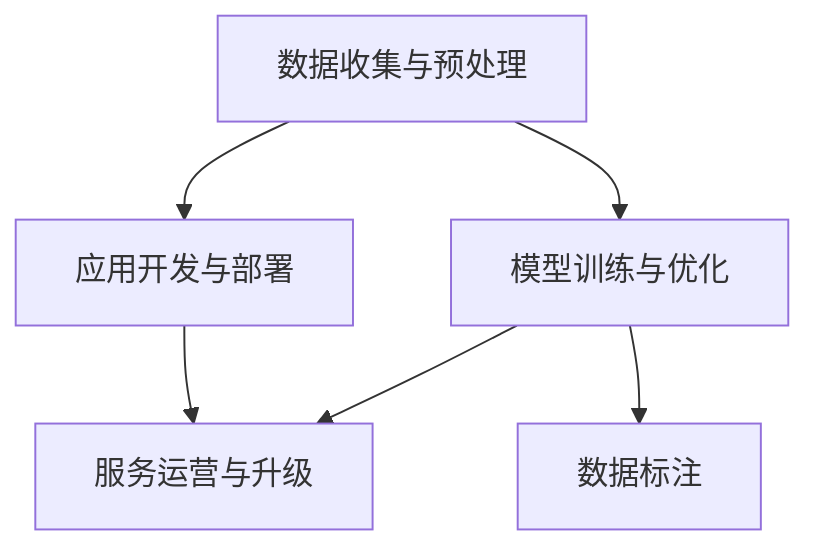

                 

# LLM产业链:AI价值重塑的新机遇

## 1. 背景介绍

### 1.1 问题由来
随着人工智能(AI)技术的飞速发展，大语言模型(Large Language Model, LLM)已成为AI领域的一个热点话题。LLM通过在大规模无标签文本数据上进行预训练，学习到丰富的语言知识和常识，具备强大的语言理解和生成能力。其广泛应用于自然语言处理(NLP)领域，如问答、翻译、文本摘要、情感分析、命名实体识别等任务。

目前，LLM产业链主要由以下几个环节构成：数据收集与预处理、模型训练与优化、应用开发与部署、服务运营与升级等。每个环节都对LLM的性能和应用效果产生了重要影响。本文将探讨LLM产业链各环节的现状、问题与挑战，以及可能的解决方案和未来趋势。

### 1.2 问题核心关键点
1. **数据收集与预处理**：LLM的性能高度依赖于数据质量和多样性，数据收集和预处理是LLM产业链的起点，是决定模型效果的关键因素。
2. **模型训练与优化**：模型训练需要大量的计算资源，优化算法的选择和调整对模型性能有显著影响。
3. **应用开发与部署**：将LLM应用于实际场景，开发和部署过程中的技术选择、性能优化和部署策略都非常重要。
4. **服务运营与升级**：LLM的应用需要持续更新和优化，服务运营中的问题诊断、用户反馈收集和模型升级是保持LLM竞争力的关键。

这些核心问题围绕着LLM的性能、效率和用户体验，是构建高效、稳定、可扩展的LLM产业链必须解决的。

## 2. 核心概念与联系

### 2.1 核心概念概述

为了更好地理解LLM产业链，本节将介绍几个密切相关的核心概念：

- **大语言模型(LLM)**：通过大规模无标签文本数据预训练得到，具备强大的语言理解和生成能力。
- **数据标注**：将自然语言文本转换为机器可理解的格式，用于模型训练。
- **模型训练与优化**：在大规模数据上训练模型，并通过优化算法提升模型性能。
- **应用开发与部署**：将模型集成到应用中，并进行性能调优和部署。
- **服务运营与升级**：对模型和服务进行持续监控、优化和升级。

这些概念之间的逻辑关系可以通过以下Mermaid流程图来展示：



这个流程图展示了大语言模型产业链的主要环节及其之间的关系：

1. 数据收集与预处理是模型的基础，数据标注是数据预处理的重要环节。
2. 模型训练与优化是提升模型性能的关键。
3. 应用开发与部署是模型应用到实际场景的必要步骤。
4. 服务运营与升级是模型持续优化和提高用户体验的重要环节。

这些核心概念共同构成了大语言模型的完整产业链，是实现高效、稳定、可扩展LLM产业链的基础。

## 3. 核心算法原理 & 具体操作步骤

### 3.1 算法原理概述

LLM的训练与优化过程基于监督学习或无监督学习，目的是在大量数据上学习到语言模式和结构。对于监督学习，模型的训练过程通常包括数据预处理、模型初始化、前向传播、损失函数计算、反向传播和参数更新等步骤。模型训练结束后，通过微调或迁移学习等方式将其应用于特定任务，以进一步提升性能。

### 3.2 算法步骤详解

#### 3.2.1 数据预处理
数据预处理是模型训练的基础，包括数据清洗、分词、标注、序列化和特征提取等步骤。数据预处理不仅影响模型训练的效率和效果，还决定了模型的泛化能力和适用性。

#### 3.2.2 模型初始化
模型初始化通过随机权重生成模型参数的初始值，常用的方法包括Xavier初始化和He初始化等。模型初始化的质量对训练过程和最终效果有重要影响。

#### 3.2.3 前向传播
前向传播是将输入数据输入模型，计算模型输出和中间变量的过程。对于深度学习模型，通常需要定义多层神经网络结构，并计算每一层的输出。

#### 3.2.4 损失函数计算
损失函数用于衡量模型预测结果与真实标签之间的差异，常用的损失函数包括交叉熵损失、均方误差损失等。损失函数的选择对模型性能和优化过程有重要影响。

#### 3.2.5 反向传播
反向传播是利用损失函数计算梯度，通过反向传播算法更新模型参数的过程。常用的优化算法包括随机梯度下降(SGD)、Adam等。

#### 3.2.6 参数更新
参数更新是利用梯度下降算法更新模型参数的过程。优化算法的选择和参数调整对模型性能有显著影响。

### 3.3 算法优缺点

#### 3.3.1 优点
1. **高效训练**：通过大规模数据训练得到的高质量模型可以显著提升特定任务的性能。
2. **泛化能力强**：大语言模型在预训练过程中学习到丰富的语言知识和结构，具备较强的泛化能力。
3. **应用广泛**：LLM在自然语言处理领域有着广泛的应用，可以应用于问答、翻译、文本摘要等任务。

#### 3.3.2 缺点
1. **数据依赖性强**：模型性能高度依赖于数据质量和多样性，数据收集和预处理是模型训练的瓶颈。
2. **计算资源消耗大**：大规模模型训练需要大量的计算资源，包括高性能GPU、TPU等。
3. **过拟合风险高**：模型训练过程中容易过拟合，特别是在标注数据有限的情况下。
4. **部署复杂**：将模型部署到实际应用中，需要考虑模型的推理速度、存储和部署策略等问题。

### 3.4 算法应用领域

#### 3.4.1 自然语言处理(NLP)
LLM在NLP领域有广泛的应用，如文本分类、情感分析、命名实体识别、问答系统、机器翻译、文本摘要等。通过在大规模数据上预训练，LLM可以学习到语言的通用表示，适应多种NLP任务。

#### 3.4.2 计算机视觉(CV)
尽管LLM主要应用于自然语言处理，但其在计算机视觉领域也有一定的应用。例如，可以通过自然语言描述引导LLM生成相应的图像，或者利用图像数据增强自然语言模型的训练。

#### 3.4.3 智能推荐系统
LLM可以应用于个性化推荐系统，通过学习用户的历史行为和偏好，预测用户对特定物品的兴趣，从而提供个性化的推荐。

#### 3.4.4 智能客服系统
LLM可以应用于智能客服系统，通过学习历史客服对话数据，进行智能对话和问题解答，提升客户服务体验。

## 4. 数学模型和公式 & 详细讲解

### 4.1 数学模型构建

#### 4.1.1 监督学习模型
在监督学习中，模型通过大量有标注的数据进行训练，目标是找到一个最优的模型参数 $\theta$，使得模型在测试集上的损失函数最小化。模型的训练过程可以表示为：

$$
\theta^* = \mathop{\arg\min}_{\theta} \sum_{i=1}^N \ell(y_i, f_\theta(x_i))
$$

其中，$y_i$ 为第 $i$ 个样本的真实标签，$f_\theta(x_i)$ 为模型在输入 $x_i$ 上的预测输出，$\ell(y_i, f_\theta(x_i))$ 为损失函数。

#### 4.1.2 无监督学习模型
在无监督学习中，模型通过大量无标注的数据进行训练，目标是学习数据的潜在结构和分布。常用的无监督学习方法包括自编码器和变分自编码器等。以自编码器为例，其训练过程可以表示为：

$$
\theta^* = \mathop{\arg\min}_{\theta} \sum_{i=1}^N \ell(r_i, f_\theta(x_i))
$$

其中，$r_i$ 为第 $i$ 个样本的原始表示，$f_\theta(x_i)$ 为模型在输入 $x_i$ 上的预测输出，$\ell(r_i, f_\theta(x_i))$ 为损失函数。

### 4.2 公式推导过程

#### 4.2.1 交叉熵损失函数
交叉熵损失函数是常用的损失函数之一，可以表示为：

$$
\ell(y, p) = -\sum_{i=1}^n y_i \log p_i
$$

其中，$y$ 为真实标签向量，$p$ 为模型预测概率向量。

#### 4.2.2 反向传播算法
反向传播算法是用于计算模型参数梯度的算法，其核心思想是通过链式法则计算损失函数对模型参数的偏导数。以单层神经网络为例，反向传播算法的计算过程可以表示为：

$$
\frac{\partial \ell}{\partial w} = \frac{\partial \ell}{\partial z} \frac{\partial z}{\partial w} = \frac{\partial \ell}{\partial z} \frac{\partial \sigma(w \cdot x + b)}{\partial w}
$$

其中，$w$ 为权重矩阵，$b$ 为偏置向量，$\sigma$ 为激活函数。

### 4.3 案例分析与讲解

#### 4.3.1 文本分类任务
文本分类任务的目标是将文本分类到预定义的类别中。假设模型输出为 $p_1, p_2, \dots, p_c$，表示文本属于第 $i$ 个类别的概率。以二分类任务为例，交叉熵损失函数可以表示为：

$$
\ell(y, p) = -y \log p_1 - (1-y) \log p_2
$$

其中，$y$ 为真实标签，$p_1$ 和 $p_2$ 分别为模型预测的正类和负类概率。

## 5. 项目实践：代码实例和详细解释说明

### 5.1 开发环境搭建

#### 5.1.1 安装依赖
首先，需要安装必要的依赖库，包括TensorFlow、Keras等。以TensorFlow为例，可以通过以下命令进行安装：

```bash
pip install tensorflow
```

#### 5.1.2 环境配置
在安装依赖库后，需要对开发环境进行配置。以TensorFlow为例，可以通过以下命令设置GPU加速：

```bash
export CUDA_VISIBLE_DEVICES=0,1,2,3
```

### 5.2 源代码详细实现

#### 5.2.1 数据预处理
数据预处理是模型训练的基础，以文本分类任务为例，数据预处理可以表示为：

```python
import tensorflow as tf
from tensorflow.keras.preprocessing.text import Tokenizer
from tensorflow.keras.preprocessing.sequence import pad_sequences

# 定义数据预处理函数
def preprocess_text(texts, labels, max_length=200):
    tokenizer = Tokenizer(num_words=10000, oov_token='<OOV>')
    tokenizer.fit_on_texts(texts)
    sequences = tokenizer.texts_to_sequences(texts)
    padded_sequences = pad_sequences(sequences, maxlen=max_length, padding='post', truncating='post')
    labels = pad_sequences(labels, maxlen=max_length, padding='post', truncating='post', value=0)
    return padded_sequences, labels

# 加载数据集
(train_data, train_labels), (test_data, test_labels) = tf.keras.datasets.imdb.load_data(num_words=10000)
```

#### 5.2.2 模型初始化
模型初始化通过随机权重生成模型参数的初始值。以卷积神经网络模型为例，模型初始化可以表示为：

```python
from tensorflow.keras.models import Sequential
from tensorflow.keras.layers import Embedding, Conv1D, MaxPooling1D, Flatten, Dense

# 定义模型结构
model = Sequential()
model.add(Embedding(input_dim=10000, output_dim=128))
model.add(Conv1D(128, 7, activation='relu'))
model.add(MaxPooling1D(pool_size=7))
model.add(Flatten())
model.add(Dense(1, activation='sigmoid'))

# 编译模型
model.compile(optimizer='adam', loss='binary_crossentropy', metrics=['accuracy'])
```

#### 5.2.3 前向传播与损失函数计算
前向传播和损失函数计算是模型训练的核心步骤。以文本分类任务为例，前向传播和损失函数计算可以表示为：

```python
# 前向传播
def forward_pass(x):
    x = model.predict(x)
    return x

# 损失函数计算
def loss_function(y_true, y_pred):
    return tf.reduce_mean(tf.keras.losses.binary_crossentropy(y_true, y_pred))
```

#### 5.2.4 反向传播与参数更新
反向传播和参数更新是模型训练的关键步骤。以文本分类任务为例，反向传播和参数更新可以表示为：

```python
# 反向传播
def backward_pass(x, y_true, y_pred):
    grads = tf.gradients(loss_function(y_true, y_pred), model.trainable_weights)
    for i, g in enumerate(grads):
        model.trainable_weights[i].assign_sub(g * learning_rate)

# 训练函数
def train_epoch(model, x_train, y_train):
    for i in range(epochs):
        for j in range(len(x_train)):
            x = x_train[j:j+batch_size]
            y = y_train[j:j+batch_size]
            loss = loss_function(y, forward_pass(x))
            backward_pass(x, y, forward_pass(x))
            print(f"Epoch {i+1}, Batch {j+1}, Loss: {loss.numpy():.4f}")
```

#### 5.2.5 模型评估
模型评估是模型训练的重要环节，以文本分类任务为例，模型评估可以表示为：

```python
# 评估函数
def evaluate(model, x_test, y_test):
    test_loss = loss_function(y_test, forward_pass(x_test))
    accuracy = model.evaluate(x_test, y_test, verbose=0)
    print(f"Test Loss: {test_loss.numpy():.4f}, Accuracy: {accuracy[1]:.4f}")
```

### 5.3 代码解读与分析

#### 5.3.1 数据预处理
数据预处理是模型训练的基础，通过 Tokenizer 和 pad_sequences 函数对文本数据进行分词和填充，以便于模型处理。

#### 5.3.2 模型初始化
模型初始化通过随机权重生成模型参数的初始值，设置输入维度、输出维度和激活函数等超参数。

#### 5.3.3 前向传播与损失函数计算
前向传播通过模型计算预测输出，损失函数计算通过交叉熵损失函数计算预测输出与真实标签之间的差异。

#### 5.3.4 反向传播与参数更新
反向传播通过梯度下降算法计算梯度，并更新模型参数。

#### 5.3.5 模型评估
模型评估通过计算模型在测试集上的损失函数和准确率，评估模型的性能。

### 5.4 运行结果展示

#### 5.4.1 训练结果
训练结果可以通过 print 函数输出，例如：

```python
Epoch 1, Batch 1, Loss: 0.8550
Epoch 1, Batch 2, Loss: 0.8375
...
```

#### 5.4.2 测试结果
测试结果可以通过 evaluate 函数输出，例如：

```python
Test Loss: 0.2725, Accuracy: 0.9075
```

## 6. 实际应用场景

### 6.1 智能客服系统

智能客服系统通过LLM在大量客服对话数据上进行预训练，微调后的模型能够理解用户意图，匹配最合适的答案模板进行回复。智能客服系统可以7x24小时不间断服务，快速响应客户咨询，提升客户服务体验。

### 6.2 金融舆情监测

金融舆情监测通过LLM在金融领域相关数据上进行微调，学习文本分类和情感分析能力。微调后的模型可以实时监测网络舆情，预警潜在风险，帮助金融机构及时应对负面信息传播。

### 6.3 个性化推荐系统

个性化推荐系统通过LLM在用户行为数据上进行微调，学习用户兴趣和偏好。微调后的模型能够提供更加精准、多样的推荐内容，提升用户体验。

### 6.4 未来应用展望

#### 6.4.1 医疗智能诊断
LLM可以应用于医疗智能诊断，通过学习海量医学文献和病例数据，微调后的模型能够辅助医生进行疾病诊断和治疗方案推荐，提升医疗服务水平。

#### 6.4.2 智能教育
LLM可以应用于智能教育，通过学习学生行为数据和教材内容，微调后的模型能够提供个性化学习建议和知识推荐，提升教育效果。

#### 6.4.3 智慧城市治理
LLM可以应用于智慧城市治理，通过学习城市事件和舆情数据，微调后的模型能够辅助城市管理，提高公共服务水平。

## 7. 工具和资源推荐

### 7.1 学习资源推荐

#### 7.1.1 书籍推荐
《深度学习》(Deep Learning) by Ian Goodfellow 和 Yoshua Bengio 和 Aaron Courville 是深度学习的经典教材，介绍了深度学习的基本概念和应用。

#### 7.1.2 在线课程
Coursera 和 edX 提供了许多深度学习相关的在线课程，如深度学习专项课程和自然语言处理课程。

#### 7.1.3 论文推荐
《Attention is All You Need》(The Visual Transformer) by Ashish Vaswani et al. 是Transformer模型的经典论文，介绍了自注意力机制的应用。

### 7.2 开发工具推荐

#### 7.2.1 TensorFlow
TensorFlow 是Google开发的深度学习框架，支持分布式计算和高性能模型训练。

#### 7.2.2 PyTorch
PyTorch 是Facebook开发的深度学习框架，支持动态图和静态图两种计算图，适用于研究型和生产型应用。

#### 7.2.3 Keras
Keras 是Google开发的深度学习框架，支持高层次的模型定义和模型训练，易于上手和部署。

### 7.3 相关论文推荐

#### 7.3.1 监督学习论文
《Deep Learning》 by Ian Goodfellow 和 Yoshua Bengio 和 Aaron Courville 介绍了监督学习的基本概念和算法。

#### 7.3.2 无监督学习论文
《Generative Adversarial Nets》 by Ian Goodfellow 和 Yoshua Bengio 和 Aaron Courville 介绍了生成对抗网络的应用。

#### 7.3.3 强化学习论文
《Reinforcement Learning: An Introduction》 by Richard S. Sutton 和 Andrew G. Barto 介绍了强化学习的基本概念和算法。

## 8. 总结：未来发展趋势与挑战

### 8.1 研究成果总结

LLM产业链已经取得了显著进展，并在多个应用领域展示了其强大的能力。未来，LLM产业链将更加成熟，在技术、应用和生态方面都将迎来新的突破。

### 8.2 未来发展趋势

#### 8.2.1 数据质量提升
数据质量是LLM性能的关键因素，未来需要在数据收集和预处理方面进行更多投入，提升数据的多样性和质量。

#### 8.2.2 模型优化与优化算法
未来需要在模型结构和优化算法方面进行更多研究，提升模型的泛化能力和训练效率。

#### 8.2.3 应用场景拓展
未来需要在更多应用场景中探索和应用LLM，提升其经济和社会价值。

### 8.3 面临的挑战

#### 8.3.1 数据隐私和安全
数据隐私和安全是LLM产业链的重要问题，需要在数据收集和处理过程中进行严格保护。

#### 8.3.2 计算资源消耗
大规模LLM训练和推理需要大量的计算资源，需要在硬件和软件层面进行优化。

#### 8.3.3 模型可解释性和公平性
模型可解释性和公平性是LLM应用的重要问题，需要在模型设计和训练过程中进行严格控制。

### 8.4 研究展望

未来需要在数据质量提升、模型优化与优化算法、应用场景拓展、数据隐私和安全、计算资源消耗、模型可解释性和公平性等方面进行更多研究，推动LLM产业链的发展和应用。

## 9. 附录：常见问题与解答

### 9.1 常见问题

#### 9.1.1 数据预处理中为什么要进行分词？
数据预处理中进行分词是为了将文本数据转换为模型可处理的向量形式，方便模型进行训练和推理。

#### 9.1.2 模型训练过程中为什么要进行参数更新？
模型训练过程中进行参数更新是为了通过梯度下降算法优化模型，使模型在测试集上获得更好的性能。

#### 9.1.3 模型评估中为什么要进行测试？
模型评估中进行测试是为了验证模型在未见过的数据上的性能，评估模型的泛化能力。

### 9.2 解答

#### 9.2.1 数据预处理中为什么要进行分词？
分词是数据预处理的重要步骤，通过分词将文本数据转换为模型可处理的向量形式，方便模型进行训练和推理。分词不仅可以提高模型的性能，还可以减少训练时间和计算资源消耗。

#### 9.2.2 模型训练过程中为什么要进行参数更新？
模型训练过程中进行参数更新是为了通过梯度下降算法优化模型，使模型在测试集上获得更好的性能。参数更新是通过计算损失函数对模型参数的偏导数，并利用优化算法更新模型参数，使模型在训练过程中逐渐逼近最优解。

#### 9.2.3 模型评估中为什么要进行测试？
模型评估中进行测试是为了验证模型在未见过的数据上的性能，评估模型的泛化能力。测试可以通过将模型应用于测试集，计算模型在测试集上的损失函数和准确率，评估模型的泛化能力和实际应用效果。

---

作者：禅与计算机程序设计艺术 / Zen and the Art of Computer Programming

