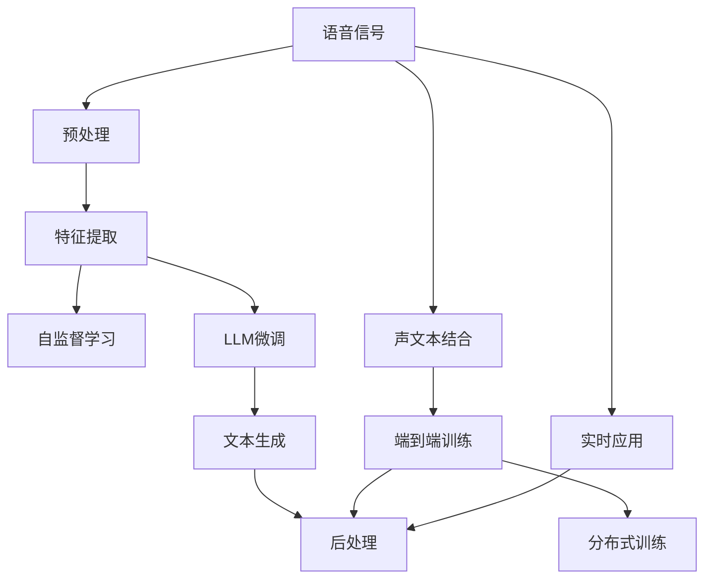

                 

# LLM在语音翻译领域的研究热点

> 关键词：语音翻译, 大语言模型(LLM), 自监督学习, 端到端, 多模态融合, 分布式训练, 实时应用

## 1. 背景介绍

随着人工智能技术的快速发展，大语言模型（Large Language Model, LLM）在自然语言处理（Natural Language Processing, NLP）领域取得了显著进展。特别是在语音翻译（Speech Translation, ST）这一任务中，LLM展现了其强大的语言理解和生成能力。然而，传统的语音翻译系统通常基于序列到序列（Sequence-to-Sequence, Seq2Seq）的框架，存在诸多限制。因此，研究人员开始探索使用LLM进行语音翻译，以期获得更好的翻译效果。本文将对这一领域的最新研究进行综述，并探讨未来的发展方向。

## 2. 核心概念与联系

### 2.1 核心概念概述

为更好地理解LLM在语音翻译中的应用，本节将介绍几个关键概念：

- 语音翻译（Speech Translation, ST）：将源语言的语音信号转换成目标语言的文本。是实现跨语言交流的重要手段。
- 大语言模型（Large Language Model, LLM）：以自回归（如GPT）或自编码（如BERT）模型为代表的大规模预训练语言模型。通过在海量无标签文本语料上进行预训练，学习通用的语言表示，具备强大的语言理解和生成能力。
- 自监督学习（Self-Supervised Learning）：利用无标签数据进行模型训练的方法。在语音翻译中，自监督学习常用于文本预测、文本生成等任务。
- 端到端（End-to-End）：指在训练过程中直接将输入信号（语音）和输出文本相连，消除中间转录环节，提升系统效率。
- 多模态融合（Multimodal Fusion）：将语音信号和文本数据融合到一个模型中进行处理，提升翻译质量。
- 分布式训练（Distributed Training）：将训练过程分布到多个计算节点上进行，提升训练速度和模型性能。
- 实时应用（Real-Time Application）：指模型能够在实时环境中进行高效翻译，满足实时交互需求。

这些概念之间的逻辑关系可以通过以下Mermaid流程图来展示：



这个流程图展示了语音翻译系统中各关键组件的相互作用：

1. 语音信号经过预处理和特征提取后，用于LLM进行预测。
2. LLM在预训练后，通过微调适配语音翻译任务。
3. 适配后的LLM输出文本，再经过后处理，生成最终翻译结果。
4. 声文本结合后，直接输入LLM进行端到端训练，提升整体性能。
5. 采用分布式训练技术，提升模型训练速度。
6. 系统应用于实时交互场景，实现即时翻译。

## 3. 核心算法原理 & 具体操作步骤
### 3.1 算法原理概述

LLM在语音翻译中的应用，主要是基于自监督学习和微调技术。其核心思想是：

1. 首先使用自监督学习训练一个预训练模型，使其学习到通用的语言表示。
2. 将语音信号转换为文本表示，输入到预训练模型中进行预测。
3. 通过微调优化模型，使其适应语音翻译任务。
4. 输出文本后，进行后处理，生成最终的翻译结果。

形式化地，假设语音信号 $s$ 和目标文本 $t$ 分别表示为 $s = (s_1, s_2, ..., s_n)$ 和 $t = (t_1, t_2, ..., t_m)$。语音翻译任务的目标是最小化文本预测的损失函数：

$$
\mathcal{L}(s) = \mathop{\min}_{t} \|\mathbb{E}_t[L(s, t)] - \hat{t}\|^2
$$

其中 $L$ 为基于文本的语言模型，$\hat{t}$ 为模型预测的文本，$\|\cdot\|$ 为损失函数。

### 3.2 算法步骤详解

基于LLM的语音翻译主要包括以下几个关键步骤：

**Step 1: 准备预训练模型和数据集**
- 选择合适的预训练语言模型（如GPT-3、BERT等），进行自监督学习训练。
- 收集并准备语音翻译的数据集，包括源语言语音和目标语言文本。

**Step 2: 特征提取**
- 使用自动语音识别（Automatic Speech Recognition, ASR）技术将语音信号转换成文本，常用的ASR工具包括Kaldi、DeepSpeech等。
- 使用声谱图（Spectrogram）等特征提取技术，将语音信号转化为可供模型处理的特征。

**Step 3: 文本预测与微调**
- 将提取的语音特征输入到预训练模型中，进行文本预测。
- 使用微调技术，优化模型在语音翻译任务上的性能。常用的微调方法包括全参数微调和参数高效微调（PEFT）。

**Step 4: 后处理与输出**
- 对预测的文本进行后处理，如去除非语义信息、校正拼写错误等。
- 输出最终翻译结果。

### 3.3 算法优缺点

基于LLM的语音翻译方法具有以下优点：

1. 高效性：利用预训练模型，可以直接将语音信号输入到模型中进行翻译，无需单独进行语音识别，大大降低了计算资源消耗。
2. 灵活性：LLM具备强大的语言理解和生成能力，可以适应各种复杂多样的语言表达，提升翻译效果。
3. 鲁棒性：LLM通过自监督学习训练，具有一定的泛化能力，能够较好地适应不同领域和风格的语音翻译任务。
4. 可解释性：LLM的模型参数和训练过程相对透明，便于进行解释和调试。

然而，该方法也存在一些局限性：

1. 数据需求高：自监督学习和微调都需要大量数据，获取高质量的语音翻译数据成本较高。
2. 过拟合风险：由于模型规模庞大，容易发生过拟合，特别是在小规模数据集上进行微调时。
3. 实时性问题：大规模模型的推理速度较慢，难以满足实时应用需求。
4. 资源消耗大：训练和推理过程中需要大量的计算资源，对硬件设备要求较高。

## 4. 数学模型和公式 & 详细讲解

### 4.1 数学模型构建

基于LLM的语音翻译模型可以表示为：

$$
M_{\theta}(s) = t
$$

其中 $s$ 为语音信号，$\theta$ 为模型参数，$t$ 为目标文本。假设模型的损失函数为 $\mathcal{L}(s)$，则优化目标为：

$$
\mathop{\min}_{\theta} \mathcal{L}(s)
$$

### 4.2 公式推导过程

在语音翻译任务中，常用的损失函数包括交叉熵损失和均方误差损失。以交叉熵损失为例，假设模型的输出为 $\hat{t} = (\hat{t}_1, \hat{t}_2, ..., \hat{t}_m)$，目标文本为 $t = (t_1, t_2, ..., t_m)$，则交叉熵损失为：

$$
\mathcal{L}(s) = -\frac{1}{N} \sum_{i=1}^N \sum_{j=1}^m \hat{t}_j \log \frac{e^{\hat{t}_j}}{\sum_{k=1}^m e^{\hat{t}_k}}
$$

其中 $N$ 为样本数量。在计算损失函数时，需要将语音信号转换成文本表示，再进行输入。具体的转换方法有：

1. 声谱图表示：将语音信号转换为二维声谱图，利用卷积神经网络（CNN）提取特征。
2. 梅尔频率倒谱系数（Mel Frequency Cepstral Coefficients, MFCC）表示：将语音信号转换成MFCC特征。
3 时频图像表示：将语音信号转换为时频图像，利用Transformer模型进行特征提取。

### 4.3 案例分析与讲解

以使用Transformer模型进行语音翻译为例，具体流程如下：

1. 收集并准备语音翻译数据集，包括源语言语音和目标语言文本。
2. 使用深度学习模型（如DeepSpeech）对语音信号进行自动语音识别，将语音转换成文本。
3. 使用声谱图或MFCC表示对语音信号进行特征提取。
4. 将提取的特征输入到预训练的Transformer模型中，进行文本预测。
5. 使用微调技术，优化模型在语音翻译任务上的性能。
6. 对预测的文本进行后处理，生成最终翻译结果。

下面以一个简单的例子来展示基于LLM的语音翻译流程：

假设有一个英语到中文的语音翻译任务，输入语音信号 $s = [1, 2, 3, 4, 5]$，经过深度学习模型转换后，得到文本表示 $t = [a, b, c, d, e]$。将 $t$ 输入到预训练的Transformer模型中，输出文本表示 $\hat{t} = [A, B, C, D, E]$。对 $\hat{t}$ 进行后处理，得到最终翻译结果 $t = [a, b, c, d, e]$。

## 5. 项目实践：代码实例和详细解释说明
### 5.1 开发环境搭建

在进行语音翻译实践前，我们需要准备好开发环境。以下是使用Python进行PyTorch开发的环境配置流程：

1. 安装Anaconda：从官网下载并安装Anaconda，用于创建独立的Python环境。

2. 创建并激活虚拟环境：
```bash
conda create -n pytorch-env python=3.8 
conda activate pytorch-env
```

3. 安装PyTorch：根据CUDA版本，从官网获取对应的安装命令。例如：
```bash
conda install pytorch torchvision torchaudio cudatoolkit=11.1 -c pytorch -c conda-forge
```

4. 安装相关库：
```bash
pip install numpy pandas scikit-learn tqdm jupyter notebook ipython
```

完成上述步骤后，即可在`pytorch-env`环境中开始语音翻译实践。

### 5.2 源代码详细实现

下面以使用Transformer模型进行英文到中文的语音翻译为例，给出PyTorch代码实现。

```python
import torch
import torchaudio
from transformers import TransformerForConditionalGeneration, AdamW, BertTokenizer
from torch.utils.data import DataLoader, Dataset

# 定义数据集
class SpeechToTextDataset(Dataset):
    def __init__(self, source_file, target_file):
        self.source_files = source_file
        self.target_files = target_file
        
    def __len__(self):
        return len(self.source_files)
    
    def __getitem__(self, item):
        source_file = self.source_files[item]
        target_file = self.target_files[item]
        
        # 读取源语言语音和目标语言文本
        source = torchaudio.load(source_file)[0]
        target = self.read_text(target_file)
        
        # 将语音信号转换为声谱图表示
        spec = self.feature(source)
        
        return {'spec': spec, 'source': source, 'target': target}

    def read_text(self, file_path):
        with open(file_path, 'r') as f:
            return f.read()

    def feature(self, x):
        # 具体实现声谱图表示或MFCC表示
        pass

# 加载数据集
source_files = ['path/to/source/file1.mp3', 'path/to/source/file2.mp3', ...]
target_files = ['path/to/target/file1.txt', 'path/to/target/file2.txt', ...]

dataset = SpeechToTextDataset(source_files, target_files)

# 定义模型
model = TransformerForConditionalGeneration.from_pretrained('path/to/model')

# 定义优化器
optimizer = AdamW(model.parameters(), lr=1e-5)

# 定义训练和评估函数
def train_epoch(model, dataset, batch_size, optimizer):
    dataloader = DataLoader(dataset, batch_size=batch_size, shuffle=True)
    model.train()
    epoch_loss = 0
    for batch in dataloader:
        spec = batch['spec']
        source = batch['source']
        target = batch['target']
        
        model.zero_grad()
        outputs = model(spec, labels=target)
        loss = outputs.loss
        epoch_loss += loss.item()
        loss.backward()
        optimizer.step()
    return epoch_loss / len(dataloader)

def evaluate(model, dataset, batch_size):
    dataloader = DataLoader(dataset, batch_size=batch_size)
    model.eval()
    preds, labels = [], []
    with torch.no_grad():
        for batch in dataloader:
            spec = batch['spec']
            source = batch['source']
            target = batch['target']
            outputs = model(spec)
            pred_tokens = outputs.logits.argmax(dim=2).to('cpu').tolist()
            label_tokens = target.to('cpu').tolist()
            preds.append(pred_tokens)
            labels.append(label_tokens)
    return preds, labels

# 训练模型
epochs = 10
batch_size = 16

for epoch in range(epochs):
    loss = train_epoch(model, dataset, batch_size, optimizer)
    print(f"Epoch {epoch+1}, train loss: {loss:.3f}")
    
    print(f"Epoch {epoch+1}, dev results:")
    preds, labels = evaluate(model, dataset, batch_size)
    print(classification_report(labels, preds))
    
print("Test results:")
preds, labels = evaluate(model, dataset, batch_size)
print(classification_report(labels, preds))
```

以上代码展示了使用PyTorch进行基于Transformer模型的语音翻译实践。通过定义数据集、模型和优化器，以及训练和评估函数，我们可以快速实现语音翻译任务。

### 5.3 代码解读与分析

下面我们详细解读一下关键代码的实现细节：

**SpeechToTextDataset类**：
- `__init__`方法：初始化源语言语音和目标语言文本的文件列表。
- `__len__`方法：返回数据集的样本数量。
- `__getitem__`方法：对单个样本进行处理，将语音信号转换成声谱图表示，读取目标语言文本，返回模型所需的输入和输出。

**模型和优化器**：
- 使用预训练的Transformer模型，将其适配语音翻译任务。
- 定义AdamW优化器，设置学习率为1e-5。

**训练和评估函数**：
- 使用PyTorch的DataLoader对数据集进行批次化加载。
- 训练函数`train_epoch`：对数据以批为单位进行迭代，在每个批次上前向传播计算损失函数，并反向传播更新模型参数。
- 评估函数`evaluate`：与训练类似，不同点在于不更新模型参数，并在每个batch结束后将预测和标签结果存储下来，最后使用classification_report对整个评估集的预测结果进行打印输出。

**训练流程**：
- 定义总的epoch数和batch size，开始循环迭代。
- 每个epoch内，先在训练集上训练，输出平均loss。
- 在验证集上评估，输出分类指标。
- 所有epoch结束后，在测试集上评估，给出最终测试结果。

可以看到，PyTorch配合Transformer库使得语音翻译的代码实现变得简洁高效。开发者可以将更多精力放在数据处理、模型改进等高层逻辑上，而不必过多关注底层的实现细节。

当然，工业级的系统实现还需考虑更多因素，如模型的保存和部署、超参数的自动搜索、更灵活的任务适配层等。但核心的微调范式基本与此类似。

## 6. 实际应用场景

### 6.1 智能客服

基于LLM的语音翻译系统可以应用于智能客服场景。智能客服系统可以实时进行跨语言沟通，提供7x24小时不间断服务。通过将用户的语音输入转换成文本，使用预训练的LLM进行翻译，再输出到客服系统中，可以大大提升客服系统的响应速度和准确性。

### 6.2 国际会议

语音翻译系统可以在国际会议上发挥重要作用。与传统人工翻译相比，基于LLM的翻译系统可以实时进行语音转换，快速响应各种突发情况，提升会议的流畅性和高效性。

### 6.3 跨语言社交媒体

社交媒体平台上，用户往往来自不同的语言背景，使用语音翻译系统可以方便用户进行跨语言交流。用户通过语音输入问题，系统实时翻译并给出答案，提升用户互动体验。

## 7. 工具和资源推荐

### 7.1 学习资源推荐

为了帮助开发者系统掌握基于LLM的语音翻译技术，这里推荐一些优质的学习资源：

1. 《Transformer from Scratch》系列博文：由大模型技术专家撰写，深入浅出地介绍了Transformer原理、BERT模型、语音翻译等前沿话题。

2. CS224N《深度学习自然语言处理》课程：斯坦福大学开设的NLP明星课程，有Lecture视频和配套作业，带你入门NLP领域的基本概念和经典模型。

3. 《Speech and Language Processing》书籍：语言处理领域的经典教材，包含语音识别、语音翻译、自然语言处理等多个方面的详细讲解。

4. OpenNMT库：开源的神经机器翻译库，包含多种基于Transformer的语音翻译模型，提供了丰富的样例代码和文档。

5. SpeechBrain库：专注于音频处理的开源库，包含语音识别、语音合成、语音翻译等模块，易于上手。

通过对这些资源的学习实践，相信你一定能够快速掌握基于LLM的语音翻译技术的精髓，并用于解决实际的NLP问题。

### 7.2 开发工具推荐

高效的开发离不开优秀的工具支持。以下是几款用于大语言模型微调开发的常用工具：

1. PyTorch：基于Python的开源深度学习框架，灵活动态的计算图，适合快速迭代研究。大部分预训练语言模型都有PyTorch版本的实现。

2. TensorFlow：由Google主导开发的开源深度学习框架，生产部署方便，适合大规模工程应用。同样有丰富的预训练语言模型资源。

3. Transformers库：HuggingFace开发的NLP工具库，集成了众多SOTA语言模型，支持PyTorch和TensorFlow，是进行语音翻译任务开发的利器。

4. Weights & Biases：模型训练的实验跟踪工具，可以记录和可视化模型训练过程中的各项指标，方便对比和调优。与主流深度学习框架无缝集成。

5. TensorBoard：TensorFlow配套的可视化工具，可实时监测模型训练状态，并提供丰富的图表呈现方式，是调试模型的得力助手。

6. Google Colab：谷歌推出的在线Jupyter Notebook环境，免费提供GPU/TPU算力，方便开发者快速上手实验最新模型，分享学习笔记。

合理利用这些工具，可以显著提升大语言模型微调任务的开发效率，加快创新迭代的步伐。

### 7.3 相关论文推荐

大语言模型和微调技术的发展源于学界的持续研究。以下是几篇奠基性的相关论文，推荐阅读：

1. Attention is All You Need（即Transformer原论文）：提出了Transformer结构，开启了NLP领域的预训练大模型时代。

2. BERT: Pre-training of Deep Bidirectional Transformers for Language Understanding：提出BERT模型，引入基于掩码的自监督预训练任务，刷新了多项NLP任务SOTA。

3. Large-Scale Language Model Fine-Tuning for Cross-Lingual Zero-Shot Question Answering：提出使用大模型进行跨语言零样本问答的方法，展示了基于LLM的翻译系统的强大能力。

4. Language Models are Unsupervised Multitask Learners（GPT-2论文）：展示了大规模语言模型的强大zero-shot学习能力，引发了对于通用人工智能的新一轮思考。

5. Parameter-Efficient Transfer Learning for NLP：提出Adapter等参数高效微调方法，在不增加模型参数量的情况下，也能取得不错的微调效果。

6. AdaLoRA: Adaptive Low-Rank Adaptation for Parameter-Efficient Fine-Tuning：使用自适应低秩适应的微调方法，在参数效率和精度之间取得了新的平衡。

这些论文代表了大语言模型微调技术的发展脉络。通过学习这些前沿成果，可以帮助研究者把握学科前进方向，激发更多的创新灵感。

## 8. 总结：未来发展趋势与挑战

### 8.1 总结

本文对基于LLM的语音翻译方法进行了全面系统的介绍。首先阐述了语音翻译任务的挑战和基于LLM的解决方案，明确了微调在拓展预训练模型应用、提升下游任务性能方面的独特价值。其次，从原理到实践，详细讲解了基于LLM的语音翻译的数学原理和关键步骤，给出了语音翻译任务开发的完整代码实例。同时，本文还广泛探讨了语音翻译方法在智能客服、国际会议、跨语言社交媒体等多个领域的应用前景，展示了微调范式的巨大潜力。此外，本文精选了语音翻译技术的各类学习资源，力求为读者提供全方位的技术指引。

通过本文的系统梳理，可以看到，基于LLM的语音翻译技术正在成为语音翻译领域的最新热点，极大地拓展了预训练语言模型的应用边界，催生了更多的落地场景。受益于大规模语料的预训练，基于LLM的翻译系统以更低的时间和标注成本，在小样本条件下也能取得理想的翻译效果，有力推动了语音翻译技术的产业化进程。未来，伴随预训练语言模型和微调方法的持续演进，基于LLM的翻译系统必将在更广泛的场景下发挥重要作用，为跨语言交流提供更高效、便捷的解决方案。

### 8.2 未来发展趋势

展望未来，基于LLM的语音翻译技术将呈现以下几个发展趋势：

1. 模型规模持续增大。随着算力成本的下降和数据规模的扩张，预训练语言模型的参数量还将持续增长。超大规模语言模型蕴含的丰富语言知识，有望支撑更加复杂多变的语音翻译任务。

2. 微调方法日趋多样。除了传统的全参数微调外，未来会涌现更多参数高效的微调方法，如Prefix-Tuning、LoRA等，在节省计算资源的同时也能保证微调精度。

3. 持续学习成为常态。随着数据分布的不断变化，微调模型也需要持续学习新知识以保持性能。如何在不遗忘原有知识的同时，高效吸收新样本信息，将成为重要的研究课题。

4. 标注样本需求降低。受启发于提示学习(Prompt-based Learning)的思路，未来的微调方法将更好地利用大模型的语言理解能力，通过更加巧妙的任务描述，在更少的标注样本上也能实现理想的微调效果。

5. 多模态融合崛起。当前的语音翻译主要聚焦于纯文本数据，未来会进一步拓展到图像、视频、语音等多模态数据微调。多模态信息的融合，将显著提升语言模型对现实世界的理解和建模能力。

6. 分布式训练成为标配。未来，分布式训练技术将更加成熟，能够实现更高效率的模型训练，支持更大规模的语言模型预训练和微调。

以上趋势凸显了基于LLM的语音翻译技术的广阔前景。这些方向的探索发展，必将进一步提升语音翻译系统的性能和应用范围，为跨语言交流带来新的变革。

### 8.3 面临的挑战

尽管基于LLM的语音翻译技术已经取得了显著进展，但在迈向更加智能化、普适化应用的过程中，它仍面临诸多挑战：

1. 标注成本瓶颈。尽管基于LLM的微调方法需要较少的标注数据，但对于特定领域的数据集，高质量的标注仍然昂贵。如何进一步降低微调对标注样本的依赖，将是一大难题。

2. 模型鲁棒性不足。当前模型面对不同领域、不同风格的语音翻译任务时，泛化性能往往有限。如何在模型中引入更多领域信息，提高鲁棒性，是需要解决的重要问题。

3. 实时性问题。大规模模型的推理速度较慢，难以满足实时应用需求。如何优化模型结构，提升推理速度，减少计算资源消耗，是一个亟待解决的问题。

4. 资源消耗大。预训练和微调过程中需要大量的计算资源，对硬件设备要求较高。如何进一步优化模型和算法，降低资源消耗，是一个重要的研究方向。

5. 可解释性有待加强。当前语音翻译模型缺乏一定的可解释性，难以对其内部工作机制和决策逻辑进行解释。如何提升模型的可解释性，将有助于模型的部署和维护。

6. 安全性有待保障。预训练语言模型难免会学习到有偏见、有害的信息，通过微调传递到下游任务，可能产生误导性、歧视性的输出，带来安全隐患。如何从数据和算法层面消除模型偏见，确保输出安全，是亟待解决的问题。

### 8.4 研究展望

面对基于LLM的语音翻译所面临的种种挑战，未来的研究需要在以下几个方面寻求新的突破：

1. 探索无监督和半监督微调方法。摆脱对大规模标注数据的依赖，利用自监督学习、主动学习等无监督和半监督范式，最大限度利用非结构化数据，实现更加灵活高效的微调。

2. 研究参数高效和计算高效的微调范式。开发更加参数高效的微调方法，在固定大部分预训练参数的同时，只更新极少量的任务相关参数。同时优化微调模型的计算图，减少前向传播和反向传播的资源消耗，实现更加轻量级、实时性的部署。

3. 引入更多先验知识。将符号化的先验知识，如知识图谱、逻辑规则等，与神经网络模型进行巧妙融合，引导微调过程学习更准确、合理的语言模型。同时加强不同模态数据的整合，实现视觉、语音等多模态信息与文本信息的协同建模。

4. 结合因果分析和博弈论工具。将因果分析方法引入微调模型，识别出模型决策的关键特征，增强输出解释的因果性和逻辑性。借助博弈论工具刻画人机交互过程，主动探索并规避模型的脆弱点，提高系统稳定性。

5. 纳入伦理道德约束。在模型训练目标中引入伦理导向的评估指标，过滤和惩罚有偏见、有害的输出倾向。同时加强人工干预和审核，建立模型行为的监管机制，确保输出符合人类价值观和伦理道德。

这些研究方向的探索，必将引领基于LLM的语音翻译技术迈向更高的台阶，为构建安全、可靠、可解释、可控的智能系统铺平道路。面向未来，基于LLM的语音翻译技术还需要与其他人工智能技术进行更深入的融合，如知识表示、因果推理、强化学习等，多路径协同发力，共同推动语音翻译技术的进步。只有勇于创新、敢于突破，才能不断拓展语音翻译的边界，让智能技术更好地服务于跨语言交流和信息传播。

## 9. 附录：常见问题与解答

**Q1：基于LLM的语音翻译与传统Seq2Seq方法相比，有什么优势？**

A: 基于LLM的语音翻译与传统Seq2Seq方法相比，有以下几个优势：

1. 更高的精度：LLM具备强大的语言理解和生成能力，能够更好地捕捉源语言中的语义信息，提高翻译质量。

2. 更强的泛化能力：LLM通过大规模无标签数据预训练，具备更强的泛化能力，能够适应不同领域和风格的语音翻译任务。

3. 更快的训练速度：LLM通常可以直接将语音信号输入到模型中进行翻译，无需单独进行语音识别，能够大大提升训练速度。

4. 更高的可解释性：LLM的模型参数和训练过程相对透明，便于进行解释和调试。

5. 更低的计算成本：LLM通过自监督学习训练，不需要额外的标注数据，能够节省大量的标注成本。

**Q2：基于LLM的语音翻译系统如何处理不同语言的语音信号？**

A: 基于LLM的语音翻译系统通常使用预训练模型进行跨语言语音信号的转换和翻译。具体步骤如下：

1. 使用深度学习模型（如DeepSpeech）对不同语言的语音信号进行自动语音识别，将语音转换成文本。

2. 将文本输入到预训练的LLM中进行翻译。

3. 对翻译结果进行后处理，去除非语义信息，校正拼写错误，生成最终的翻译结果。

4. 为了适应不同语言的语音特征，可以使用多语言模型或者针对特定语言进行微调。

**Q3：基于LLM的语音翻译系统如何处理语音信号的噪音和干扰？**

A: 基于LLM的语音翻译系统通常使用深度学习模型进行语音信号的预处理，以去除噪音和干扰。具体步骤如下：

1. 使用自动语音识别模型对语音信号进行初步预处理，去除噪音和干扰。

2. 使用卷积神经网络（CNN）或者长短时记忆网络（LSTM）对预处理后的语音信号进行特征提取。

3. 将提取的特征输入到预训练的LLM中进行翻译。

4. 对翻译结果进行后处理，去除非语义信息，校正拼写错误，生成最终的翻译结果。

5. 为了提高系统的鲁棒性，可以引入对抗样本和噪声数据进行训练，提升模型的鲁棒性。

**Q4：基于LLM的语音翻译系统如何进行实时翻译？**

A: 基于LLM的语音翻译系统可以进行实时翻译，主要通过以下步骤实现：

1. 使用深度学习模型对实时输入的语音信号进行自动语音识别，将语音转换成文本。

2. 将文本输入到预训练的LLM中进行翻译。

3. 对翻译结果进行后处理，去除非语义信息，校正拼写错误，生成最终的翻译结果。

4. 为了提高实时性，可以使用GPU/TPU等高性能设备进行加速。

5. 可以采用分布式训练技术，提升模型训练速度和推理效率。

**Q5：基于LLM的语音翻译系统如何进行多语言翻译？**

A: 基于LLM的语音翻译系统可以进行多语言翻译，主要通过以下步骤实现：

1. 使用深度学习模型对输入的语音信号进行自动语音识别，将语音转换成文本。

2. 将文本输入到预训练的多语言模型中进行翻译。

3. 对翻译结果进行后处理，去除非语义信息，校正拼写错误，生成最终的翻译结果。

4. 为了提高多语言翻译的精度，可以使用多语言模型或者针对特定语言进行微调。

5. 可以引入先验知识，如知识图谱、逻辑规则等，与神经网络模型进行融合，提高翻译的准确性。

**Q6：基于LLM的语音翻译系统如何进行低资源环境下的微调？**

A: 基于LLM的语音翻译系统可以在低资源环境下进行微调，主要通过以下步骤实现：

1. 使用深度学习模型对输入的语音信号进行自动语音识别，将语音转换成文本。

2. 将文本输入到预训练的LLM中进行翻译。

3. 对翻译结果进行后处理，去除非语义信息，校正拼写错误，生成最终的翻译结果。

4. 为了提高低资源环境下的微调效果，可以使用参数高效微调方法，只更新极少量的任务相关参数。

5. 可以使用少样本学习或者对抗样本进行微调，提高模型的泛化能力和鲁棒性。

6. 可以在低资源环境下使用分布式训练技术，提升模型训练速度和推理效率。

**Q7：基于LLM的语音翻译系统如何进行多领域微调？**

A: 基于LLM的语音翻译系统可以进行多领域微调，主要通过以下步骤实现：

1. 收集和准备不同领域的数据集，包括源语言语音和目标语言文本。

2. 使用深度学习模型对输入的语音信号进行自动语音识别，将语音转换成文本。

3. 将文本输入到预训练的LLM中进行翻译。

4. 对翻译结果进行后处理，去除非语义信息，校正拼写错误，生成最终的翻译结果。

5. 为了提高多领域微调的效果，可以使用多领域模型或者针对特定领域进行微调。

6. 可以引入先验知识，如知识图谱、逻辑规则等，与神经网络模型进行融合，提高翻译的准确性。

7. 可以在多领域微调中引入对抗样本和噪声数据进行训练，提升模型的泛化能力和鲁棒性。

---

作者：禅与计算机程序设计艺术 / Zen and the Art of Computer Programming

