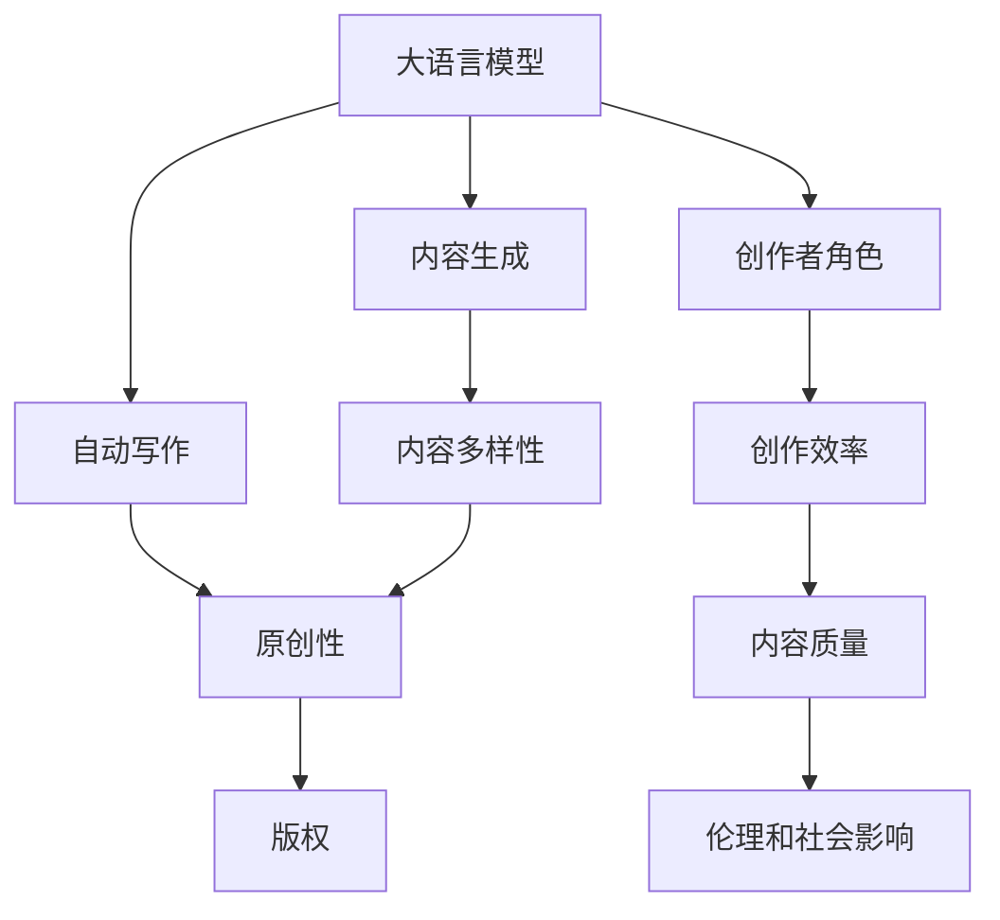

                 

# LLM对传统内容创作的挑战

> 关键词：语言模型, 内容生成, 自动写作, 创新性, 传统创作

## 1. 背景介绍

### 1.1 问题由来
近年来，随着深度学习技术的发展，自然语言处理(NLP)领域涌现出了大语言模型(Large Language Models, LLMs)，如GPT-3、BERT等。这些模型通过在大规模文本数据上预训练，具备了强大的语言理解和生成能力。与此同时，传统内容创作的流程也正在经历深刻的变革，从信息搜集、素材整理到文字撰写，每个环节都可能被自动化工具所替代。因此，LLM对传统内容创作提出了严峻挑战，从内容创作的各个环节，到创作者的角色定位，都发生了显著变化。

### 1.2 问题核心关键点
LLM对传统内容创作的挑战主要体现在以下几个方面：

- **内容生成效率**：LLM可以大规模自动生成高质量的内容，大幅提高内容创作的效率。但这也引发了关于原创性和版权的讨论。
- **内容多样性**：LLM能够产生大量不同的内容，满足不同用户的需求。但这也可能加剧内容过载和质量参差不齐的问题。
- **创作者角色**：传统创作依赖于创作者的主观判断和创造力，而LLM的介入可能导致创作者角色的转变，从内容生产者变为内容管理者或指导者。
- **内容创新性**：LLM生成的大量内容虽丰富多样，但如何在创新性方面超越人类，仍是一个待解的问题。

### 1.3 问题研究意义
研究LLM对传统内容创作的影响，对于理解NLP技术的发展趋势，评估其对创作生态的影响，以及探讨未来的创作模式变革，具有重要意义：

- 帮助创作者更好地掌握新兴技术，提升创作效率和质量。
- 指导内容生产平台优化算法，提高用户体验。
- 评估NLP技术的伦理和社会影响，推动相关法律法规的完善。
- 探索未来的创作模式，如协作创作、共同创作等，拓展创作的可能性。

## 2. 核心概念与联系

### 2.1 核心概念概述

为了更好地理解LLM对传统内容创作的影响，本节将介绍几个密切相关的核心概念：

- **大语言模型**：指通过在大规模文本数据上进行自监督学习，学习到通用语言表示的模型。这些模型如GPT-3、BERT等，具有强大的语言理解和生成能力。
- **内容生成**：指利用模型自动生成文本、图像、视频等形式的内容，如文章、新闻、广告、诗歌等。
- **自动写作**：指利用AI技术自动撰写文本，从简单的新闻报道到复杂的学术文章，都可以自动生成。
- **原创性**：指内容创作的独创性和独特性，是传统创作的核心要素之一。
- **版权**：指对原创作品的控制权和利益，是内容创作的法律保护机制。
- **内容多样性**：指同一主题下生成的不同内容，满足不同用户的需求和偏好。
- **创作者角色**：指内容创作过程中人的角色和定位，是情感、创造力和技术并存的复杂角色。

这些核心概念之间的逻辑关系可以通过以下Mermaid流程图来展示：



这个流程图展示了大语言模型与内容创作各个核心概念之间的联系：

1. 大语言模型通过预训练学习到通用的语言表示，并通过内容生成和自动写作，生成多样化内容。
2. 内容生成和自动写作改变了创作者角色的定位，创作者可能成为内容管理者或指导者。
3. 原创性在自动写作和内容生成中仍需保持，这是内容创作的本质要求。
4. 内容多样性在自动写作中尤为重要，能够满足不同用户的需求。
5. 版权是内容创作的重要法律保护机制，在自动写作中需考虑如何处理。
6. 创作者角色的转变可能导致创作效率和质量提升，同时也带来伦理和社会影响。

## 3. 核心算法原理 & 具体操作步骤
### 3.1 算法原理概述

LLM对传统内容创作的挑战主要通过以下几个方面实现：

- **内容生成**：利用LLM生成大量内容，满足不同用户的需求。
- **自动写作**：通过预训练的LLM自动生成文本，改变传统创作流程。
- **内容多样性**：通过不同的种子和参数设置，生成多样化内容。
- **创作者角色**：通过算法辅助创作，提升创作效率和质量。

形式化地，假设预训练模型为 $M_{\theta}$，其中 $\theta$ 为预训练得到的模型参数。给定文本生成任务 $T$ 的种子文本 $s$，模型的目标是通过 $M_{\theta}(s)$ 生成最合适的下一个词或子序列。目标函数可以定义为：

$$
\mathcal{L}(s, M_{\theta}) = -\log P_{M_{\theta}}(\text{next\_word} | s)
$$

其中 $P_{M_{theta}}$ 为模型在给定种子文本 $s$ 下生成下一个词或子序列的概率分布。

### 3.2 算法步骤详解

基于LLM的内容生成和自动写作过程一般包括以下几个关键步骤：

**Step 1: 准备预训练模型和数据集**
- 选择合适的预训练语言模型 $M_{\theta}$ 作为初始化参数，如 GPT-3、BERT 等。
- 准备文本生成任务 $T$ 的种子文本集 $S$，如新闻报道、电影脚本等。

**Step 2: 设计输出目标**
- 根据任务类型，设计合适的输出目标，如预测下一个词、生成完整的句子等。
- 设置合适的输出长度和截断策略，防止模型生成过长或过短的文本。

**Step 3: 设置微调超参数**
- 选择合适的优化算法及其参数，如 AdamW、SGD 等，设置学习率、批大小、迭代轮数等。
- 设置正则化技术及强度，包括权重衰减、Dropout、Early Stopping 等。
- 确定冻结预训练参数的策略，如仅微调顶层，或全部参数都参与微调。

**Step 4: 执行梯度训练**
- 将种子文本集 $S$ 分批次输入模型，前向传播计算损失函数。
- 反向传播计算参数梯度，根据设定的优化算法和学习率更新模型参数。
- 周期性在验证集上评估模型性能，根据性能指标决定是否触发 Early Stopping。
- 重复上述步骤直到满足预设的迭代轮数或 Early Stopping 条件。

**Step 5: 测试和部署**
- 在测试集上评估生成的内容质量，对比模型生成的文本与真实文本之间的差异。
- 使用生成的内容进行实际应用，如新闻报道、广告文案等。
- 持续收集新的数据，定期重新微调模型，以适应数据分布的变化。

### 3.3 算法优缺点

基于LLM的内容生成和自动写作方法具有以下优点：

- **高效性**：能够大规模自动生成内容，节省人力和时间成本。
- **多样性**：生成的内容多样性高，满足不同用户的需求。
- **灵活性**：通过不同的种子和参数设置，能够生成不同风格和类型的文本。

同时，该方法也存在一定的局限性：

- **缺乏原创性**：生成的内容可能缺乏独创性和新颖性，易于复制。
- **伦理和社会影响**：可能生成有害、误导性的内容，引发伦理和社会问题。
- **质量参差不齐**：生成的内容质量难以保证，可能导致用户不满。
- **版权问题**：生成的内容可能存在版权争议，需妥善处理。

尽管存在这些局限性，但就目前而言，基于LLM的内容生成和自动写作方法仍然是大规模内容创作的重要手段。未来相关研究的重点在于如何进一步提高内容的质量和原创性，同时兼顾伦理和社会责任。

### 3.4 算法应用领域

基于LLM的内容生成和自动写作方法已经在多个领域得到应用，例如：

- **新闻报道**：自动生成新闻报道，提高信息传播效率和覆盖面。
- **广告文案**：自动生成广告文案，提升广告投放效果和用户体验。
- **电影剧本**：自动生成电影剧本，缩短制作周期和成本。
- **诗歌创作**：自动生成诗歌，探索文学创作的边界。
- **小说创作**：自动生成小说片段，推动文学创作的新形式。
- **学术文章**：自动生成学术论文，推动学术研究和创新。

除了上述这些经典应用外，LLM的内容生成和自动写作技术也被创新性地应用到更多场景中，如社交媒体、博客、游戏等，为内容创作带来了新的可能性。随着预训练模型和内容生成技术的不断进步，相信LLM在内容创作中的应用将更加广泛和深入。

## 4. 数学模型和公式 & 详细讲解  
### 4.1 数学模型构建

本节将使用数学语言对基于LLM的内容生成和自动写作过程进行更加严格的刻画。

记预训练语言模型为 $M_{\theta}$，其中 $\theta$ 为预训练得到的模型参数。假设文本生成任务 $T$ 的目标是预测下一个词或子序列，模型的输出为 $y = (y_1, y_2, ..., y_n)$，其中 $y_i$ 为生成的下一个词或子序列。模型的目标是最大化似然函数：

$$
P_{M_{\theta}}(y | s) = \prod_{i=1}^n P_{M_{\theta}}(y_i | y_{i-1}, s)
$$

其中 $P_{M_{\theta}}(y_i | y_{i-1}, s)$ 为模型在给定种子文本 $s$ 和前一个输出 $y_{i-1}$ 下生成下一个词或子序列的概率。

目标函数可以定义为：

$$
\mathcal{L}(s, M_{\theta}) = -\log P_{M_{\theta}}(y | s)
$$

在实践中，我们通常使用基于梯度的优化算法（如SGD、Adam等）来近似求解上述最优化问题。设 $\eta$ 为学习率，$\lambda$ 为正则化系数，则参数的更新公式为：

$$
\theta \leftarrow \theta - \eta \nabla_{\theta}\mathcal{L}(\theta) - \eta\lambda\theta
$$

其中 $\nabla_{\theta}\mathcal{L}(\theta)$ 为损失函数对参数 $\theta$ 的梯度，可通过反向传播算法高效计算。

### 4.2 公式推导过程

以下我们以新闻报道生成为例，推导模型训练的损失函数及其梯度的计算公式。

假设模型 $M_{\theta}$ 在输入 $s$ 上的输出为 $\hat{y}=M_{\theta}(s) \in [0,1]$，表示样本属于下一个词或子序列的概率。真实标签 $y \in [0,1]$。则交叉熵损失函数定义为：

$$
\ell(M_{\theta}(s),y) = -[y\log \hat{y} + (1-y)\log (1-\hat{y})]
$$

将其代入目标函数公式，得：

$$
\mathcal{L}(s, \theta) = -\frac{1}{n}\sum_{i=1}^n [y_i\log M_{\theta}(y_{i-1}, s)+(1-y_i)\log(1-M_{\theta}(y_{i-1}, s))]
$$

根据链式法则，损失函数对参数 $\theta_k$ 的梯度为：

$$
\frac{\partial \mathcal{L}(s, \theta)}{\partial \theta_k} = -\frac{1}{n}\sum_{i=1}^n (\frac{y_i}{M_{\theta}(y_{i-1}, s)}-\frac{1-y_i}{1-M_{\theta}(y_{i-1}, s)}) \frac{\partial M_{\theta}(y_{i-1}, s)}{\partial \theta_k}
$$

其中 $\frac{\partial M_{\theta}(y_{i-1}, s)}{\partial \theta_k}$ 可进一步递归展开，利用自动微分技术完成计算。

在得到损失函数的梯度后，即可带入参数更新公式，完成模型的迭代优化。重复上述过程直至收敛，最终得到适应文本生成任务的最优模型参数 $\theta^*$。

## 5. 项目实践：代码实例和详细解释说明
### 5.1 开发环境搭建

在进行内容生成和自动写作实践前，我们需要准备好开发环境。以下是使用Python进行PyTorch开发的环境配置流程：

1. 安装Anaconda：从官网下载并安装Anaconda，用于创建独立的Python环境。

2. 创建并激活虚拟环境：
```bash
conda create -n pytorch-env python=3.8 
conda activate pytorch-env
```

3. 安装PyTorch：根据CUDA版本，从官网获取对应的安装命令。例如：
```bash
conda install pytorch torchvision torchaudio cudatoolkit=11.1 -c pytorch -c conda-forge
```

4. 安装Transformers库：
```bash
pip install transformers
```

5. 安装各类工具包：
```bash
pip install numpy pandas scikit-learn matplotlib tqdm jupyter notebook ipython
```

完成上述步骤后，即可在`pytorch-env`环境中开始内容生成和自动写作实践。

### 5.2 源代码详细实现

下面我们以新闻报道生成为例，给出使用Transformers库对GPT模型进行内容生成和自动写作的PyTorch代码实现。

首先，定义新闻报道生成任务的数据处理函数：

```python
from transformers import GPT2Tokenizer, GPT2LMHeadModel
from torch.utils.data import Dataset
import torch

class NewsDataset(Dataset):
    def __init__(self, texts, tokenizer, max_len=128):
        self.texts = texts
        self.tokenizer = tokenizer
        self.max_len = max_len
        
    def __len__(self):
        return len(self.texts)
    
    def __getitem__(self, item):
        text = self.texts[item]
        
        encoding = self.tokenizer(text, return_tensors='pt', max_length=self.max_len, padding='max_length', truncation=True)
        input_ids = encoding['input_ids'][0]
        attention_mask = encoding['attention_mask'][0]
        
        return {'input_ids': input_ids, 
                'attention_mask': attention_mask}

# 分词器
tokenizer = GPT2Tokenizer.from_pretrained('gpt2')
# 模型
model = GPT2LMHeadModel.from_pretrained('gpt2')

# 准备数据集
train_dataset = NewsDataset(train_texts, tokenizer)
dev_dataset = NewsDataset(dev_texts, tokenizer)
test_dataset = NewsDataset(test_texts, tokenizer)
```

然后，定义训练和评估函数：

```python
from torch.utils.data import DataLoader
from tqdm import tqdm
from sklearn.metrics import perplexity

device = torch.device('cuda') if torch.cuda.is_available() else torch.device('cpu')
model.to(device)

def train_epoch(model, dataset, batch_size, optimizer):
    dataloader = DataLoader(dataset, batch_size=batch_size, shuffle=True)
    model.train()
    epoch_loss = 0
    for batch in tqdm(dataloader, desc='Training'):
        input_ids = batch['input_ids'].to(device)
        attention_mask = batch['attention_mask'].to(device)
        model.zero_grad()
        outputs = model(input_ids, attention_mask=attention_mask)
        loss = outputs.loss
        epoch_loss += loss.item()
        loss.backward()
        optimizer.step()
    return epoch_loss / len(dataloader)

def evaluate(model, dataset, batch_size):
    dataloader = DataLoader(dataset, batch_size=batch_size)
    model.eval()
    with torch.no_grad():
        loss = 0
        for batch in dataloader:
            input_ids = batch['input_ids'].to(device)
            attention_mask = batch['attention_mask'].to(device)
            batch_outputs = model(input_ids, attention_mask=attention_mask)
            batch_loss = batch_outputs.loss
            loss += batch_loss.item()
        print(perplexity(loss / len(dataloader)))
```

最后，启动训练流程并在测试集上评估：

```python
epochs = 5
batch_size = 16

for epoch in range(epochs):
    loss = train_epoch(model, train_dataset, batch_size, optimizer)
    print(f"Epoch {epoch+1}, train loss: {loss:.3f}")
    
    print(f"Epoch {epoch+1}, dev perplexity:")
    evaluate(model, dev_dataset, batch_size)
    
print("Test perplexity:")
evaluate(model, test_dataset, batch_size)
```

以上就是使用PyTorch对GPT模型进行新闻报道生成任务的内容生成和自动写作的完整代码实现。可以看到，得益于Transformers库的强大封装，我们可以用相对简洁的代码完成GPT模型的加载和微调。

### 5.3 代码解读与分析

让我们再详细解读一下关键代码的实现细节：

**NewsDataset类**：
- `__init__`方法：初始化文本、分词器等关键组件。
- `__len__`方法：返回数据集的样本数量。
- `__getitem__`方法：对单个样本进行处理，将文本输入编码为token ids，并对其进行定长padding，最终返回模型所需的输入。

**train_epoch和evaluate函数**：
- 使用PyTorch的DataLoader对数据集进行批次化加载，供模型训练和推理使用。
- 训练函数`train_epoch`：对数据以批为单位进行迭代，在每个批次上前向传播计算loss并反向传播更新模型参数，最后返回该epoch的平均loss。
- 评估函数`evaluate`：与训练类似，不同点在于不更新模型参数，并在每个batch结束后将损失结果存储下来，最后使用perplexity评估模型的生成效果。

**训练流程**：
- 定义总的epoch数和batch size，开始循环迭代
- 每个epoch内，先在训练集上训练，输出平均loss
- 在验证集上评估，输出生成效果的perplexity
- 所有epoch结束后，在测试集上评估，给出最终测试结果

可以看到，PyTorch配合Transformers库使得GPT模型的内容生成和自动写作代码实现变得简洁高效。开发者可以将更多精力放在数据处理、模型改进等高层逻辑上，而不必过多关注底层的实现细节。

当然，工业级的系统实现还需考虑更多因素，如模型的保存和部署、超参数的自动搜索、更灵活的任务适配层等。但核心的内容生成和自动写作范式基本与此类似。

## 6. 实际应用场景
### 6.1 智能新闻报道

基于大语言模型的新闻报道生成技术，可以为新闻机构提供更为高效、丰富的报道内容。新闻记者往往需要花费大量时间在资料搜集和撰写报道上，而使用GPT模型生成新闻报道，可以大幅缩短制作周期，并保证报道的准确性和多样性。

在技术实现上，可以收集新闻机构的历史报道数据，将新闻标题和导语作为监督数据，在此基础上对GPT模型进行微调。微调后的模型能够自动生成新闻报道的完整内容，包括标题、正文、图片描述等。在生成新闻时，先输入一篇类似风格的文章作为种子文本，再进行微调，可以生成相似风格的新闻报道。

### 6.2 个性化广告文案

广告文案是企业推广的重要工具，但传统文案创作往往需要耗费大量人力和资源。使用基于大语言模型的内容生成技术，可以自动生成符合用户偏好的广告文案，提升广告投放效果。

在实践中，可以收集用户的浏览历史、购买记录等数据，将其作为监督信号。在此基础上对GPT模型进行微调，使其能够自动生成与用户偏好相匹配的广告文案。例如，针对不同年龄段、不同兴趣爱好的用户，生成不同风格和内容的广告文案。

### 6.3 自动生成学术论文

学术研究是推动人类知识进步的重要活动，但传统学术论文的撰写往往需要大量时间和精力。使用大语言模型生成学术论文的技术，可以大幅提高学术论文的撰写效率，推动学术研究的快速迭代。

在实践中，可以收集领域的经典论文，将其作为监督信号。在此基础上对GPT模型进行微调，使其能够自动生成高质量的学术论文。例如，针对不同主题和长度要求，生成结构清晰、内容丰富的学术论文。

### 6.4 未来应用展望

随着大语言模型和内容生成技术的不断发展，基于LLM的内容生成和自动写作方法将在更多领域得到应用，为内容创作带来新的可能性。

在智慧医疗领域，基于LLM的医疗报告生成技术，可以为医生提供快速、准确的医疗记录，帮助医生进行病情诊断和治疗方案制定。

在教育领域，基于LLM的教学辅助生成技术，可以为学生提供个性化化的学习资料和练习题，提升学习效果。

在文学创作领域，基于LLM的文学作品生成技术，可以为作家提供灵感和素材，辅助创作。

此外，在企业培训、法律文书、技术文档等众多领域，基于LLM的内容生成和自动写作技术也将不断涌现，为内容创作带来新的变革。相信随着预训练模型和内容生成方法的持续演进，LLM在内容创作中的应用将更加广泛和深入。

## 7. 工具和资源推荐
### 7.1 学习资源推荐

为了帮助开发者系统掌握LLM的内容生成和自动写作的理论基础和实践技巧，这里推荐一些优质的学习资源：

1. 《Transformers from the Inside Out》系列博文：由大模型技术专家撰写，深入浅出地介绍了Transformers原理、GPT模型、内容生成技术等前沿话题。

2. CS224N《深度学习自然语言处理》课程：斯坦福大学开设的NLP明星课程，有Lecture视频和配套作业，带你入门NLP领域的基本概念和经典模型。

3. 《Natural Language Generation with Transformers》书籍：涵盖内容生成技术的理论基础和实践方法，详细介绍了使用LLM进行新闻报道、广告文案等内容的自动生成。

4. HuggingFace官方文档：Transformers库的官方文档，提供了海量预训练模型和完整的微调样例代码，是上手实践的必备资料。

5. Kaggle竞赛：参加Kaggle等数据科学竞赛，通过实战练习，深入理解LLM在内容生成和自动写作中的应用。

通过对这些资源的学习实践，相信你一定能够快速掌握LLM的内容生成和自动写作的精髓，并用于解决实际的NLP问题。
###  7.2 开发工具推荐

高效的开发离不开优秀的工具支持。以下是几款用于LLM内容生成和自动写作开发的常用工具：

1. PyTorch：基于Python的开源深度学习框架，灵活动态的计算图，适合快速迭代研究。大部分预训练语言模型都有PyTorch版本的实现。

2. TensorFlow：由Google主导开发的开源深度学习框架，生产部署方便，适合大规模工程应用。同样有丰富的预训练语言模型资源。

3. Transformers库：HuggingFace开发的NLP工具库，集成了众多SOTA语言模型，支持PyTorch和TensorFlow，是进行内容生成和自动写作开发的利器。

4. Weights & Biases：模型训练的实验跟踪工具，可以记录和可视化模型训练过程中的各项指标，方便对比和调优。与主流深度学习框架无缝集成。

5. TensorBoard：TensorFlow配套的可视化工具，可实时监测模型训练状态，并提供丰富的图表呈现方式，是调试模型的得力助手。

6. Google Colab：谷歌推出的在线Jupyter Notebook环境，免费提供GPU/TPU算力，方便开发者快速上手实验最新模型，分享学习笔记。

合理利用这些工具，可以显著提升LLM内容生成和自动写作的开发效率，加快创新迭代的步伐。

### 7.3 相关论文推荐

大语言模型和内容生成技术的发展源于学界的持续研究。以下是几篇奠基性的相关论文，推荐阅读：

1. Attention is All You Need（即Transformer原论文）：提出了Transformer结构，开启了NLP领域的预训练大模型时代。

2. GPT-3: Language Models are Few-Shot Learners：提出GPT-3模型，通过预训练-微调的方式实现少样本学习，刷新了多项NLP任务SOTA。

3. ELMo: Distributed Representations of Words and Phrases and their Compositionality：提出ELMo模型，利用上下文信息进行文本表示，提升了文本生成的多样性和流畅性。

4. Generate Art with Style and Structure：提出基于GPT-3的艺术作品生成技术，展示了LLM在内容创作中的强大潜力。

5. Music Generation with Attention-based Models：提出基于GPT-3的音乐生成技术，展示了LLM在内容创作中的广泛应用。

这些论文代表了大语言模型内容生成技术的发展脉络。通过学习这些前沿成果，可以帮助研究者把握学科前进方向，激发更多的创新灵感。

## 8. 总结：未来发展趋势与挑战

### 8.1 总结

本文对基于LLM的内容生成和自动写作方法进行了全面系统的介绍。首先阐述了LLM对传统内容创作的影响，明确了LLM在内容生成、自动写作、内容多样性、创作者角色等多个方面的具体作用。其次，从原理到实践，详细讲解了LLM内容生成和自动写作的数学模型和关键步骤，给出了微调任务开发的完整代码实例。同时，本文还广泛探讨了LLM在新闻报道、广告文案、学术论文等领域的实际应用，展示了LLM的广泛应用前景。此外，本文精选了内容生成技术的各类学习资源，力求为读者提供全方位的技术指引。

通过本文的系统梳理，可以看到，基于LLM的内容生成和自动写作方法正在成为NLP领域的重要手段，极大地拓展了预训练语言模型的应用边界，推动了内容创作的自动化进程。LLM在生成文本、图片、视频等多模态内容方面展现了巨大的潜力，为内容创作带来了新的机遇和挑战。

### 8.2 未来发展趋势

展望未来，LLM内容生成和自动写作技术将呈现以下几个发展趋势：

1. **模型规模持续增大**：随着算力成本的下降和数据规模的扩张，预训练语言模型的参数量还将持续增长。超大模型具有更强的生成能力和多样性。

2. **内容多样性提升**：LLM生成的内容将更加丰富和多样化，能够满足不同用户的需求和偏好。

3. **创作者角色转变**：创作者将从内容生产者转变为内容管理者或指导者，利用LLM生成的内容进行二次创作或优化。

4. **版权和伦理问题**：LLM生成的内容可能面临版权和伦理问题，需建立相应的法律法规。

5. **生成效果提升**：通过更好的训练策略和算法改进，LLM生成的内容将更自然、更流畅。

6. **跨模态生成**：LLM不仅生成文本内容，还将扩展到图像、视频、语音等多模态内容生成，形成跨模态创作新形式。

以上趋势凸显了LLM内容生成和自动写作技术的广阔前景。这些方向的探索发展，将进一步提升内容创作的效率和质量，拓展内容创作的边界。

### 8.3 面临的挑战

尽管LLM内容生成和自动写作技术已经取得了瞩目成就，但在迈向更加智能化、普适化应用的过程中，它仍面临着诸多挑战：

1. **内容原创性问题**：生成的内容可能缺乏原创性，易于复制。需进一步提升内容的独特性和创新性。

2. **版权和伦理问题**：生成的内容可能存在版权争议，需妥善处理。

3. **内容质量参差不齐**：生成的内容质量难以保证，可能导致用户不满。需提高生成内容的准确性和流畅性。

4. **模型鲁棒性不足**：生成的内容可能对输入的微小变化敏感，需提高模型的鲁棒性。

5. **数据依赖性**：生成的内容依赖于训练数据的质量和多样性，需解决数据过载和数据不足的问题。

尽管存在这些挑战，但随着预训练模型和内容生成技术的不断演进，相信LLM内容生成和自动写作技术将在更多领域得到应用，为内容创作带来新的变革。

### 8.4 研究展望

面对LLM内容生成和自动写作所面临的挑战，未来的研究需要在以下几个方面寻求新的突破：

1. **提升内容原创性**：通过改进预训练策略和生成算法，提高内容的多样性和独特性。

2. **解决版权和伦理问题**：建立内容生成技术的版权保护机制，提升内容创作的合法性和伦理安全性。

3. **提高生成质量**：通过更好的训练策略和算法改进，提升内容的准确性和流畅性。

4. **增强模型鲁棒性**：引入更多的正则化技术和对抗训练，提高模型的鲁棒性和泛化能力。

5. **解决数据依赖性**：通过数据增强和生成对抗网络等技术，提高模型的泛化能力和适应性。

6. **探索跨模态生成**：探索将LLM应用于多模态内容生成，如跨模态文本生成、图像生成等，拓展内容创作的边界。

这些研究方向的探索，必将引领LLM内容生成和自动写作技术迈向更高的台阶，为内容创作带来新的机遇和挑战。

## 9. 附录：常见问题与解答

**Q1：LLM生成的内容缺乏原创性，如何解决？**

A: 为了提高LLM生成的内容的原创性，可以采用以下几种方法：

1. 改进预训练策略：使用更加多样化的语料进行预训练，增加模型对不同语言风格和语境的适应能力。

2. 引入对抗样本：在训练过程中引入对抗样本，增加模型的鲁棒性和多样性。

3. 使用生成对抗网络（GAN）：在生成过程中引入GAN技术，提高生成内容的独特性和多样性。

4. 结合人工创作：在生成过程中结合人工创作，对生成的内容进行二次编辑和优化。

5. 引入外部知识库：将外部知识库与模型结合，增加生成内容的丰富性和深度。

通过这些方法，可以进一步提升LLM生成的内容的原创性和独特性。

**Q2：LLM生成的内容可能存在版权问题，如何解决？**

A: 为了解决LLM生成的内容可能存在的版权问题，可以采用以下几种方法：

1. 使用公有领域数据：使用公有领域的数据进行预训练和微调，避免版权争议。

2. 引入版权保护技术：在生成过程中引入版权保护技术，确保生成的内容符合版权法规。

3. 结合人工创作：在生成过程中结合人工创作，对生成的内容进行二次编辑和优化，确保其符合版权法规。

4. 建立版权保护机制：建立内容生成技术的版权保护机制，明确版权归属和使用规范。

通过这些方法，可以避免LLM生成的内容存在版权争议，确保内容的合法性和伦理安全性。

**Q3：LLM生成的内容质量参差不齐，如何解决？**

A: 为了解决LLM生成的内容质量参差不齐的问题，可以采用以下几种方法：

1. 改进训练策略：使用更好的训练策略和算法，提高生成内容的准确性和流畅性。

2. 引入正则化技术：在训练过程中引入正则化技术，防止模型过拟合和欠拟合。

3. 引入对抗样本：在训练过程中引入对抗样本，提高模型的鲁棒性和泛化能力。

4. 结合人工创作：在生成过程中结合人工创作，对生成的内容进行二次编辑和优化。

5. 引入外部知识库：将外部知识库与模型结合，增加生成内容的丰富性和深度。

通过这些方法，可以进一步提升LLM生成的内容的准确性和流畅性，确保其质量参差不齐的问题得到解决。

**Q4：LLM生成的内容可能对输入的微小变化敏感，如何解决？**

A: 为了解决LLM生成的内容对输入的微小变化敏感的问题，可以采用以下几种方法：

1. 引入对抗训练：在训练过程中引入对抗训练，提高模型的鲁棒性和泛化能力。

2. 引入正则化技术：在训练过程中引入正则化技术，防止模型过拟合和欠拟合。

3. 使用更好的训练策略：使用更好的训练策略和算法，提高模型的稳定性和鲁棒性。

4. 引入外部知识库：将外部知识库与模型结合，增加生成内容的丰富性和深度。

通过这些方法，可以进一步提升LLM生成的内容的鲁棒性和泛化能力，确保其对输入的微小变化不敏感。

**Q5：LLM生成的内容依赖于训练数据的质量和多样性，如何解决？**

A: 为了解决LLM生成的内容依赖于训练数据的质量和多样性的问题，可以采用以下几种方法：

1. 使用更多的数据：增加训练数据的多样性和质量，提高模型的泛化能力和适应性。

2. 引入数据增强技术：在训练过程中引入数据增强技术，提高模型的鲁棒性和泛化能力。

3. 引入对抗样本：在训练过程中引入对抗样本，增加模型的鲁棒性和多样性。

4. 引入外部知识库：将外部知识库与模型结合，增加生成内容的丰富性和深度。

5. 结合人工创作：在生成过程中结合人工创作，对生成的内容进行二次编辑和优化。

通过这些方法，可以进一步提升LLM生成的内容的泛化能力和适应性，确保其不依赖于训练数据的质量和多样性。

**Q6：LLM生成的内容可能存在伦理问题，如何解决？**

A: 为了解决LLM生成的内容可能存在的伦理问题，可以采用以下几种方法：

1. 引入伦理导向的评估指标：在生成过程中引入伦理导向的评估指标，过滤和惩罚有偏见、有害的输出倾向。

2. 建立伦理保护机制：建立内容生成技术的伦理保护机制，确保生成的内容符合人类价值观和伦理道德。

3. 引入外部监督：在生成过程中引入外部监督，对生成的内容进行伦理审查和监控。

4. 结合人工创作：在生成过程中结合人工创作，对生成的内容进行二次编辑和优化。

通过这些方法，可以进一步提升LLM生成的内容的伦理性和安全性，确保其符合人类价值观和伦理道德。

---

作者：禅与计算机程序设计艺术 / Zen and the Art of Computer Programming

