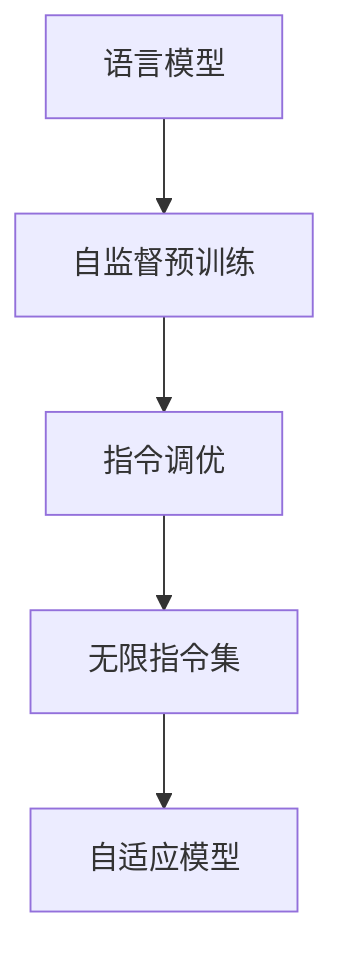

                 

# LLM无限指令集:开启无限可能

在人工智能的领域，语言模型已经从简单的词向量表示，进化到了能够理解和生成复杂语言的深度学习模型。而基于这些模型的语言模型（Large Language Models, LLMs），尤其是那些能够通过自监督学习从大规模文本中学习到通用语言表示的模型，如BERT、GPT-3等，正在开启一个全新的时代。

在本文中，我们将深入探讨LLM无限指令集的概念，以及它们如何为我们带来无限的可能性。我们将从背景介绍、核心概念、算法原理、实践应用等方面展开，帮助读者理解这一技术及其潜力。

## 1. 背景介绍

### 1.1 问题由来

在过去几年中，深度学习尤其是神经网络在大规模数据上的自监督预训练已经取得了突破性的进展。语言模型在这一领域尤为突出，它们通过在大规模无标签文本上预训练，能够学习到丰富的语言知识和常识。这使得它们在各种自然语言处理（Natural Language Processing, NLP）任务上表现出色，从文本分类、信息抽取到对话生成、摘要生成等。

然而，尽管这些模型表现出色，但在特定领域或特定任务上，它们往往需要进一步微调或定制，以获得最佳效果。这是因为，不同领域的语言特点和任务需求差异较大，通用的语言模型可能难以适应。

### 1.2 问题核心关键点

为了克服这一问题，研究人员提出了指令调优（Instruction Tuning）的概念，即通过给模型提供特定任务的详细指令，使其能够执行各种复杂的NLP任务。这一技术不仅能够提升模型在特定任务上的性能，还能够大大降低任务适配的开发成本和复杂度。

但传统的指令调优方法依赖于人工编写指令，难以处理复杂多样的任务需求。而基于LLM无限指令集的方法，则可以通过大规模的指令集预训练，让模型学习到更丰富的任务执行策略，从而实现真正的自适应。

## 2. 核心概念与联系

### 2.1 核心概念概述

为了更好地理解LLM无限指令集，我们需要首先掌握几个核心概念：

- **语言模型**：一种能够根据前文预测后文或者后文预测前文的模型，通常用于NLP任务。
- **自监督预训练**：在大规模无标签数据上进行的预训练，通过任务（如掩码语言模型、下一句话预测等）来优化模型，使其能够学习到语言的普遍规律。
- **指令调优**：给模型提供特定任务的详细指令，使其能够执行各种复杂的NLP任务。
- **无限指令集**：一种通过大规模指令集预训练，使模型能够学习到多种任务执行策略的技术。
- **自适应模型**：能够根据特定任务需求进行自适应调优的模型。

这些概念之间的联系通过以下Mermaid流程图展示：



### 2.2 核心概念原理和架构的 Mermaid 流程图


这个流程图展示了从语言模型到自适应模型的整个流程：

1. **语言模型**：通过自监督预训练学习语言的通用规律。
2. **指令调优**：通过给模型提供特定任务的指令，使其能够执行复杂任务。
3. **无限指令集**：通过大规模指令集的预训练，模型能够学习到多种任务执行策略。
4. **自适应模型**：根据特定任务需求进行自适应调优，实现真正的自适应。

## 3. 核心算法原理 & 具体操作步骤

### 3.1 算法原理概述

LLM无限指令集的核心算法原理可以概括为：

1. **大规模指令集预训练**：收集各类自然语言指令，如自然语言指令（Natural Language Instructions, NLIs），并将这些指令与预训练语言模型一起进行训练。
2. **自适应调优**：在特定任务上，通过给模型提供特定任务的指令，使模型能够执行该任务。
3. **任务无关的策略学习**：通过大规模指令集的预训练，模型能够学习到多种任务执行策略，实现真正的自适应。

### 3.2 算法步骤详解

#### 3.2.1 指令集收集

指令集的收集是无限指令集预训练的关键步骤。这需要从各种来源收集指令，如程序代码注释、自然语言描述的任务、知识图谱中的关系等。这些指令需要经过人工筛选和清洗，以确保其高质量和多样性。

#### 3.2.2 预训练过程

在收集好指令集后，可以使用基于语言模型的架构（如Transformer）进行预训练。预训练过程可以包括：

- **自监督预训练**：在未标注数据上预训练语言模型，使其能够学习到语言的通用规律。
- **指令调优**：在收集的指令集上进行调优，使模型能够执行特定的自然语言指令。

#### 3.2.3 模型微调

在预训练完成后，模型可以通过微调（Fine-Tuning）来适应特定任务的需求。微调过程通常包括：

- **选择优化器**：选择合适的优化器（如AdamW、SGD等），并设置学习率。
- **任务适配**：添加任务适配层，如分类器或生成器，并设计对应的损失函数。
- **训练与评估**：在特定任务的数据集上进行训练，并使用验证集和测试集评估模型性能。

#### 3.2.4 持续学习

持续学习（Continual Learning）是LLM无限指令集的重要特性。这意味着模型可以在新的任务上不断学习，同时保持已有的知识，避免出现灾难性遗忘（Catastrophic Forgetting）。

### 3.3 算法优缺点

#### 3.3.1 优点

- **通用性**：通过大规模指令集的预训练，模型能够适应多种任务需求。
- **高效性**：在特定任务上，微调过程所需的数据量较小，开发成本低。
- **自适应**：模型能够根据新任务需求进行自适应调优。

#### 3.3.2 缺点

- **资源消耗大**：大规模指令集预训练需要大量的计算资源。
- **泛化能力有限**：在特定领域或特定任务上，模型的泛化能力可能不如通用模型。

### 3.4 算法应用领域

#### 3.4.1 问答系统

基于LLM无限指令集的方法可以用于构建智能问答系统。通过收集和预训练大量的问答对，模型能够在特定领域内执行问答任务，如医疗咨询、法律咨询等。

#### 3.4.2 对话生成

在对话生成任务中，模型可以通过预训练和微调，生成自然流畅的对话，应用于客服、智能助手等场景。

#### 3.4.3 文本摘要

通过预训练和微调，模型可以生成高质量的文本摘要，广泛应用于新闻报道、学术论文等场景。

#### 3.4.4 代码生成

在编程领域，通过预训练和微调，模型可以生成符合特定编程语言规范的代码，辅助编程工作。

## 4. 数学模型和公式 & 详细讲解

### 4.1 数学模型构建

在数学上，我们可以将LLM无限指令集预训练的过程表示为：

$$
\text{LLM}_{\theta} = \text{Pretrain}(\text{NLIs}, \text{Data})
$$

其中，$\theta$ 为模型参数，$\text{NLIs}$ 为指令集，$\text{Data}$ 为预训练数据集。

微调过程可以表示为：

$$
\theta_{\text{finetuned}} = \text{Fine-Tuning}(\theta, \text{Task})
$$

其中，$\text{Task}$ 为特定任务。

### 4.2 公式推导过程

在指令调优中，我们通常使用交叉熵损失函数来衡量模型输出的质量。假设模型在特定任务上的输出为 $\hat{y}$，真实标签为 $y$，则交叉熵损失函数为：

$$
\mathcal{L}(\theta) = -\frac{1}{N}\sum_{i=1}^N [y_i\log \hat{y}_i + (1-y_i)\log(1-\hat{y}_i)]
$$

其中，$N$ 为样本数量，$y_i$ 为样本的真实标签，$\hat{y}_i$ 为模型在样本上的输出。

在预训练过程中，我们可以使用掩码语言模型（Masked Language Model, MLM）或下一句话预测（Next Sentence Prediction, NSP）等自监督任务来优化模型。以掩码语言模型为例，损失函数为：

$$
\mathcal{L}_{\text{MLM}}(\theta) = -\frac{1}{N}\sum_{i=1}^N \sum_{j=1}^M \log P_{\theta}(x_{i,j})
$$

其中，$x_{i,j}$ 为预训练数据集中的样本，$M$ 为样本长度。

### 4.3 案例分析与讲解

在实际应用中，我们可以以生成式问答系统为例进行讲解。假设我们希望模型能够回答关于天气的问题。我们可以收集大量的天气查询数据，并标注相应的天气信息作为答案。然后，我们可以将这些问题和答案构建成指令集，并进行预训练和微调。在微调过程中，我们可以添加分类器来区分不同的天气类型，并使用交叉熵损失函数进行优化。

## 5. 项目实践：代码实例和详细解释说明

### 5.1 开发环境搭建

在开始项目实践前，我们需要准备好开发环境。以下是使用Python进行PyTorch开发的环境配置流程：

1. 安装Anaconda：从官网下载并安装Anaconda，用于创建独立的Python环境。

2. 创建并激活虚拟环境：
```bash
conda create -n pytorch-env python=3.8 
conda activate pytorch-env
```

3. 安装PyTorch：根据CUDA版本，从官网获取对应的安装命令。例如：
```bash
conda install pytorch torchvision torchaudio cudatoolkit=11.1 -c pytorch -c conda-forge
```

4. 安装Transformers库：
```bash
pip install transformers
```

5. 安装各类工具包：
```bash
pip install numpy pandas scikit-learn matplotlib tqdm jupyter notebook ipython
```

完成上述步骤后，即可在`pytorch-env`环境中开始项目实践。

### 5.2 源代码详细实现

下面以问答系统为例，给出使用Transformers库进行预训练和微调的PyTorch代码实现。

首先，定义问答系统数据处理函数：

```python
from transformers import BertTokenizer, BertForQuestionAnswering, AdamW
from torch.utils.data import Dataset
import torch

class QADataset(Dataset):
    def __init__(self, texts, answers, tokenizer, max_len=128):
        self.texts = texts
        self.answers = answers
        self.tokenizer = tokenizer
        self.max_len = max_len
        
    def __len__(self):
        return len(self.texts)
    
    def __getitem__(self, item):
        text = self.texts[item]
        answer = self.answers[item]
        
        encoding = self.tokenizer(text, return_tensors='pt', max_length=self.max_len, padding='max_length', truncation=True)
        input_ids = encoding['input_ids'][0]
        attention_mask = encoding['attention_mask'][0]
        
        # 对答案进行编码
        answer_ids = self.tokenizer(answer, return_tensors='pt', max_length=self.max_len, padding='max_length', truncation=True)
        answer_input_ids = answer_ids['input_ids'][0]
        answer_attention_mask = answer_ids['attention_mask'][0]
        
        return {'input_ids': input_ids, 
                'attention_mask': attention_mask,
                'labels': answer_input_ids,
                'answer_attention_mask': answer_attention_mask}

# 定义任务适配层
model = BertForQuestionAnswering.from_pretrained('bert-base-cased')

# 定义优化器
optimizer = AdamW(model.parameters(), lr=2e-5)
```

然后，定义训练和评估函数：

```python
from torch.utils.data import DataLoader
from tqdm import tqdm

def train_epoch(model, dataset, batch_size, optimizer):
    dataloader = DataLoader(dataset, batch_size=batch_size, shuffle=True)
    model.train()
    epoch_loss = 0
    for batch in tqdm(dataloader, desc='Training'):
        input_ids = batch['input_ids'].to(device)
        attention_mask = batch['attention_mask'].to(device)
        labels = batch['labels'].to(device)
        answer_input_ids = batch['labels'].to(device)
        answer_attention_mask = batch['answer_attention_mask'].to(device)
        model.zero_grad()
        outputs = model(input_ids, attention_mask=attention_mask, labels=answer_input_ids, attention_mask=answer_attention_mask)
        loss = outputs.loss
        epoch_loss += loss.item()
        loss.backward()
        optimizer.step()
    return epoch_loss / len(dataloader)

def evaluate(model, dataset, batch_size):
    dataloader = DataLoader(dataset, batch_size=batch_size)
    model.eval()
    preds, labels = [], []
    with torch.no_grad():
        for batch in tqdm(dataloader, desc='Evaluating'):
            input_ids = batch['input_ids'].to(device)
            attention_mask = batch['attention_mask'].to(device)
            labels = batch['labels'].to(device)
            answer_input_ids = batch['labels'].to(device)
            answer_attention_mask = batch['answer_attention_mask'].to(device)
            batch_preds = model(input_ids, attention_mask=attention_mask, labels=answer_input_ids, attention_mask=answer_attention_mask).logits.argmax(dim=2).to('cpu').tolist()
            batch_labels = batch_labels.to('cpu').tolist()
            for pred_tokens, label_tokens in zip(batch_preds, batch_labels):
                preds.append(pred_tokens)
                labels.append(label_tokens)
                
    print(classification_report(labels, preds))
```

最后，启动训练流程并在验证集上评估：

```python
epochs = 5
batch_size = 16

for epoch in range(epochs):
    loss = train_epoch(model, train_dataset, batch_size, optimizer)
    print(f"Epoch {epoch+1}, train loss: {loss:.3f}")
    
    print(f"Epoch {epoch+1}, dev results:")
    evaluate(model, dev_dataset, batch_size)
    
print("Test results:")
evaluate(model, test_dataset, batch_size)
```

以上就是使用PyTorch进行问答系统预训练和微调的完整代码实现。可以看到，Transformers库的强大封装使得代码实现变得简洁高效。

### 5.3 代码解读与分析

让我们再详细解读一下关键代码的实现细节：

**QADataset类**：
- `__init__`方法：初始化文本、答案、分词器等关键组件。
- `__len__`方法：返回数据集的样本数量。
- `__getitem__`方法：对单个样本进行处理，将文本和答案输入编码为token ids，并将答案的编码进行padding，最终返回模型所需的输入。

**训练和评估函数**：
- 使用PyTorch的DataLoader对数据集进行批次化加载，供模型训练和推理使用。
- 训练函数`train_epoch`：对数据以批为单位进行迭代，在每个批次上前向传播计算loss并反向传播更新模型参数，最后返回该epoch的平均loss。
- 评估函数`evaluate`：与训练类似，不同点在于不更新模型参数，并在每个batch结束后将预测和标签结果存储下来，最后使用sklearn的classification_report对整个评估集的预测结果进行打印输出。

**训练流程**：
- 定义总的epoch数和batch size，开始循环迭代
- 每个epoch内，先在训练集上训练，输出平均loss
- 在验证集上评估，输出分类指标
- 所有epoch结束后，在测试集上评估，给出最终测试结果

可以看到，PyTorch配合Transformers库使得问答系统的预训练和微调的代码实现变得简洁高效。开发者可以将更多精力放在数据处理、模型改进等高层逻辑上，而不必过多关注底层的实现细节。

当然，工业级的系统实现还需考虑更多因素，如模型的保存和部署、超参数的自动搜索、更灵活的任务适配层等。但核心的预训练和微调范式基本与此类似。

## 6. 实际应用场景

### 6.1 智能客服系统

基于LLM无限指令集的方法可以广泛应用于智能客服系统的构建。传统客服往往需要配备大量人力，高峰期响应缓慢，且一致性和专业性难以保证。而使用无限指令集预训练的对话模型，可以7x24小时不间断服务，快速响应客户咨询，用自然流畅的语言解答各类常见问题。

在技术实现上，可以收集企业内部的历史客服对话记录，将问题和最佳答复构建成监督数据，在此基础上对预训练对话模型进行微调。微调后的对话模型能够自动理解用户意图，匹配最合适的答案模板进行回复。对于客户提出的新问题，还可以接入检索系统实时搜索相关内容，动态组织生成回答。如此构建的智能客服系统，能大幅提升客户咨询体验和问题解决效率。

### 6.2 金融舆情监测

金融机构需要实时监测市场舆论动向，以便及时应对负面信息传播，规避金融风险。传统的人工监测方式成本高、效率低，难以应对网络时代海量信息爆发的挑战。基于LLM无限指令集的方法，可以在金融领域相关的新闻、报道、评论等文本数据上进行预训练和微调，使其能够自动判断文本属于何种主题，情感倾向是正面、中性还是负面。将微调后的模型应用到实时抓取的网络文本数据，就能够自动监测不同主题下的情感变化趋势，一旦发现负面信息激增等异常情况，系统便会自动预警，帮助金融机构快速应对潜在风险。

### 6.3 个性化推荐系统

当前的推荐系统往往只依赖用户的历史行为数据进行物品推荐，无法深入理解用户的真实兴趣偏好。基于LLM无限指令集的方法，个性化推荐系统可以更好地挖掘用户行为背后的语义信息，从而提供更精准、多样的推荐内容。

在实践中，可以收集用户浏览、点击、评论、分享等行为数据，提取和用户交互的物品标题、描述、标签等文本内容。将文本内容作为模型输入，用户的后续行为（如是否点击、购买等）作为监督信号，在此基础上预训练和微调预训练语言模型。微调后的模型能够从文本内容中准确把握用户的兴趣点。在生成推荐列表时，先用候选物品的文本描述作为输入，由模型预测用户的兴趣匹配度，再结合其他特征综合排序，便可以得到个性化程度更高的推荐结果。

### 6.4 未来应用展望

随着LLM无限指令集方法的不断发展，基于微调范式将在更多领域得到应用，为传统行业带来变革性影响。

在智慧医疗领域，基于LLM无限指令集的方法，可以用于构建智能问答系统、病历分析、药物研发等应用，提升医疗服务的智能化水平，辅助医生诊疗，加速新药开发进程。

在智能教育领域，LLM无限指令集的方法可以应用于作业批改、学情分析、知识推荐等方面，因材施教，促进教育公平，提高教学质量。

在智慧城市治理中，LLM无限指令集的方法可以应用于城市事件监测、舆情分析、应急指挥等环节，提高城市管理的自动化和智能化水平，构建更安全、高效的未来城市。

此外，在企业生产、社会治理、文娱传媒等众多领域，基于LLM无限指令集的人工智能应用也将不断涌现，为NLP技术带来全新的突破。相信随着预训练语言模型和微调方法的不断进步，LLM无限指令集必将在构建人机协同的智能时代中扮演越来越重要的角色。

## 7. 工具和资源推荐

### 7.1 学习资源推荐

为了帮助开发者系统掌握LLM无限指令集的理论基础和实践技巧，这里推荐一些优质的学习资源：

1. 《Transformers from the Inside》系列博文：由大模型技术专家撰写，深入浅出地介绍了Transformer原理、无限指令集等前沿话题。

2. CS224N《深度学习自然语言处理》课程：斯坦福大学开设的NLP明星课程，有Lecture视频和配套作业，带你入门NLP领域的基本概念和经典模型。

3. 《Natural Language Processing with Transformers》书籍：Transformers库的作者所著，全面介绍了如何使用Transformers库进行NLP任务开发，包括无限指令集的实践方法。

4. HuggingFace官方文档：Transformers库的官方文档，提供了海量预训练模型和完整的无限指令集样例代码，是上手实践的必备资料。

5. CLUE开源项目：中文语言理解测评基准，涵盖大量不同类型的中文NLP数据集，并提供了基于无限指令集的baseline模型，助力中文NLP技术发展。

通过对这些资源的学习实践，相信你一定能够快速掌握LLM无限指令集的精髓，并用于解决实际的NLP问题。

### 7.2 开发工具推荐

高效的开发离不开优秀的工具支持。以下是几款用于LLM无限指令集开发的常用工具：

1. PyTorch：基于Python的开源深度学习框架，灵活动态的计算图，适合快速迭代研究。大部分预训练语言模型都有PyTorch版本的实现。

2. TensorFlow：由Google主导开发的开源深度学习框架，生产部署方便，适合大规模工程应用。同样有丰富的预训练语言模型资源。

3. Transformers库：HuggingFace开发的NLP工具库，集成了众多SOTA语言模型，支持PyTorch和TensorFlow，是进行无限指令集开发的利器。

4. Weights & Biases：模型训练的实验跟踪工具，可以记录和可视化模型训练过程中的各项指标，方便对比和调优。与主流深度学习框架无缝集成。

5. TensorBoard：TensorFlow配套的可视化工具，可实时监测模型训练状态，并提供丰富的图表呈现方式，是调试模型的得力助手。

6. Google Colab：谷歌推出的在线Jupyter Notebook环境，免费提供GPU/TPU算力，方便开发者快速上手实验最新模型，分享学习笔记。

合理利用这些工具，可以显著提升LLM无限指令集微调任务的开发效率，加快创新迭代的步伐。

### 7.3 相关论文推荐

LLM无限指令集技术的发展源于学界的持续研究。以下是几篇奠基性的相关论文，推荐阅读：

1. Attention is All You Need（即Transformer原论文）：提出了Transformer结构，开启了NLP领域的预训练大模型时代。

2. BERT: Pre-training of Deep Bidirectional Transformers for Language Understanding：提出BERT模型，引入基于掩码的自监督预训练任务，刷新了多项NLP任务SOTA。

3. Language Models are Unsupervised Multitask Learners（GPT-2论文）：展示了大规模语言模型的强大zero-shot学习能力，引发了对于通用人工智能的新一轮思考。

4. Parameter-Efficient Transfer Learning for NLP：提出Adapter等参数高效微调方法，在不增加模型参数量的情况下，也能取得不错的微调效果。

5. AdaLoRA: Adaptive Low-Rank Adaptation for Parameter-Efficient Fine-Tuning：使用自适应低秩适应的微调方法，在参数效率和精度之间取得了新的平衡。

6. Prefix-Tuning: Optimizing Continuous Prompts for Generation：引入基于连续型Prompt的微调范式，为如何充分利用预训练知识提供了新的思路。

这些论文代表了大语言模型无限指令集技术的发展脉络。通过学习这些前沿成果，可以帮助研究者把握学科前进方向，激发更多的创新灵感。

## 8. 总结：未来发展趋势与挑战

### 8.1 总结

本文对LLM无限指令集的概念进行了全面系统的介绍。首先阐述了LLM无限指令集的背景和重要性，明确了无限指令集在自适应、通用性、高效性等方面的优势。其次，从原理到实践，详细讲解了无限指令集的数学模型和操作步骤，给出了无限指令集方法在问答系统、对话生成、文本摘要等实际应用场景中的代码实现。同时，本文还探讨了无限指令集在智能客服、金融舆情、个性化推荐等多个领域的应用前景，展示了无限指令集范式的巨大潜力。此外，本文精选了无限指令集技术的各类学习资源，力求为读者提供全方位的技术指引。

通过本文的系统梳理，可以看到，LLM无限指令集技术正在成为NLP领域的重要范式，极大地拓展了预训练语言模型的应用边界，催生了更多的落地场景。受益于大规模语料的预训练，无限指令集方法能够通过微调过程实现真正的自适应，其泛化能力和可扩展性带来了前所未有的机遇和挑战。未来，伴随无限指令集方法的不断演进，NLP技术必将进一步突破，推动人工智能技术在各行各业的应用。

### 8.2 未来发展趋势

展望未来，LLM无限指令集技术将呈现以下几个发展趋势：

1. **模型规模持续增大**：随着算力成本的下降和数据规模的扩张，预训练语言模型的参数量还将持续增长。超大规模语言模型蕴含的丰富语言知识，有望支撑更加复杂多变的下游任务微调。

2. **无限指令集预训练成为标配**：更多的NLP任务将通过无限指令集预训练技术来实现微调，提升模型性能。

3. **自适应模型成为主流**：更多的模型将在无限指令集预训练技术的基础上进行微调，实现真正的自适应。

4. **跨模态融合**：无限指令集技术将更多地应用于跨模态数据融合，提升NLP模型的多模态学习能力。

5. **持续学习成为常态**：模型将能够不断学习新知识，同时保持已有的知识，避免出现灾难性遗忘。

6. **可解释性增强**：无限指令集技术将更多地应用于可解释性AI研究，提高模型的透明度和可信度。

7. **应用场景不断拓展**：无限指令集技术将应用于更多领域，如医疗、教育、金融等，推动这些行业的数字化转型。

### 8.3 面临的挑战

尽管LLM无限指令集技术已经取得了瞩目成就，但在迈向更加智能化、普适化应用的过程中，它仍面临着诸多挑战：

1. **数据分布差异**：不同领域或不同任务的数据分布差异较大，无限指令集预训练的模型可能在某些领域上泛化性能有限。

2. **资源消耗大**：大规模指令集预训练需要大量的计算资源，可能导致硬件成本较高。

3. **知识整合能力不足**：现有的无限指令集模型往往局限于任务内数据，难以灵活吸收和运用更广泛的先验知识。

4. **可解释性不足**：无限指令集模型作为"黑盒"系统，难以解释其内部工作机制和决策逻辑。

5. **安全性有待保障**：模型可能学习到有害信息，并通过微调传递到下游任务，产生误导性输出。

6. **灾难性遗忘**：在持续学习过程中，模型可能会遗忘已有的知识，影响性能。

### 8.4 研究展望

面对LLM无限指令集所面临的挑战，未来的研究需要在以下几个方面寻求新的突破：

1. **跨领域知识整合**：如何更好地将知识图谱、逻辑规则等先验知识与无限指令集模型结合，提升模型的泛化能力。

2. **高效计算技术**：如何利用分布式计算、模型压缩等技术，降低指令集预训练的计算成本。

3. **可解释性提升**：如何提高无限指令集模型的可解释性，使其决策过程透明可信。

4. **安全与隐私保护**：如何在模型训练和应用过程中，保障数据隐私和安全，避免有害信息的传播。

5. **灾难性遗忘解决**：如何通过持续学习技术，实现模型的稳健性和鲁棒性。

6. **多模态数据融合**：如何更好地将文本、图像、语音等多模态数据融合，提升模型的多模态学习能力。

这些研究方向的探索，必将引领LLM无限指令集技术迈向更高的台阶，为构建安全、可靠、可解释、可控的智能系统铺平道路。面向未来，LLM无限指令集技术还需要与其他人工智能技术进行更深入的融合，如知识表示、因果推理、强化学习等，多路径协同发力，共同推动自然语言理解和智能交互系统的进步。只有勇于创新、敢于突破，才能不断拓展语言模型的边界，让智能技术更好地造福人类社会。

## 9. 附录：常见问题与解答

**Q1：无限指令集预训练与通用指令调优有何区别？**

A: 无限指令集预训练是指在大规模指令集上进行预训练，使模型学习到多种任务执行策略，具备自适应能力。而通用指令调优则是针对特定任务，通过指令调优提升模型在该任务上的性能。无限指令集预训练侧重于模型的通用性和泛化能力，而通用指令调优则更侧重于任务的针对性和性能提升。

**Q2：无限指令集预训练需要多少数据？**

A: 无限指令集预训练需要大量的标注数据，这通常是通用的自然语言指令（NLIs）。数据量越大，模型的泛化能力越强。但在实际应用中，也可以采用数据增强、迁移学习等技术，用较少的数据实现较好的效果。

**Q3：无限指令集预训练的模型是否可以用于通用任务？**

A: 无限指令集预训练的模型通常具备较好的泛化能力，可以应用于多种任务。但具体效果仍取决于任务与预训练数据的分布匹配度。对于一些特定领域或特定任务，模型可能需要进行微调或定制才能达到最佳性能。

**Q4：无限指令集预训练的模型如何进行微调？**

A: 无限指令集预训练的模型可以通过添加任务适配层和设计对应的损失函数进行微调。微调过程类似于通用模型的微调，但需要注意的是，微调时可能需要使用较小的学习率，以避免破坏预训练权重。

**Q5：无限指令集预训练的模型有哪些应用场景？**

A: 无限指令集预训练的模型可以应用于问答系统、对话生成、文本摘要、代码生成等多个NLP任务。其优势在于能够自适应新任务，泛化能力更强，开发成本更低。

---

作者：禅与计算机程序设计艺术 / Zen and the Art of Computer Programming

