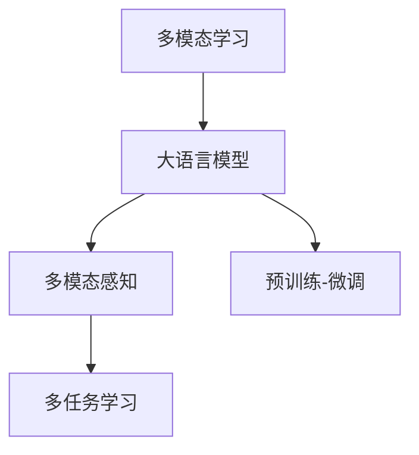

                 

## 1. 背景介绍

随着人工智能技术的飞速发展，多模态学习成为推动AI技术进步的重要方向之一。特别是自然语言处理（NLP）与计算机视觉（CV）、语音识别（ASR）、音频处理（ASL）等多模态任务的融合，极大地拓展了AI模型的应用范围和能力。近年来，基于Transformer结构的大语言模型（Large Language Model, LLM）通过大规模预训练，已展现出强大的多模态学习能力，广泛应用于智能客服、智能翻译、语音助手等领域。然而，当前多模态学习研究尚处于起步阶段，其理论基础和实践方法仍需进一步挖掘和完善。本文将深入探讨LLM的多模态学习能力拓展路径，力求为从事多模态学习研究的技术人员和实践者提供理论与实践上的指导。

## 2. 核心概念与联系

### 2.1 核心概念概述

为更好地理解LLM的多模态学习能力，本节将介绍几个核心概念：

- 多模态学习（Multimodal Learning）：指利用多种类型数据（如文本、图像、音频等）同时进行训练和学习，以提高模型的泛化能力和适应性。

- 大语言模型（LLM）：基于自回归或自编码结构的大规模预训练语言模型，能够处理大量文本数据，具备强大的语言理解和生成能力。

- 多模态感知（Multimodal Perception）：指模型能够同时感知并处理不同类型的数据，如文本与图像，从而提升对复杂场景的理解和决策。

- 多任务学习（Multitask Learning）：指在模型训练中同时考虑多个相关任务，以促进模型在多任务间的知识共享和泛化能力。

- 预训练-微调（Pre-training & Fine-tuning）：指在大规模无标签数据上进行预训练，然后在特定任务上进行微调，以提高模型在该任务上的性能。

这些核心概念之间的逻辑关系可以通过以下Mermaid流程图来展示：



这个流程图展示了多模态学习中大语言模型的作用及其与多模态感知、多任务学习之间的关系。

## 3. 核心算法原理 & 具体操作步骤

### 3.1 算法原理概述

LLM的多模态学习能力拓展路径主要基于以下几个关键原理：

- 模态融合（Modality Fusion）：将不同模态的数据信息进行融合，形成更丰富、更全面的语义表示，提升模型的理解能力。

- 协同训练（Co-training）：同时训练多个任务，以促进不同模态之间的知识共享，提高模型的泛化能力。

- 多任务学习（Multitask Learning）：通过多个相关任务的联合训练，使模型学习到更普适的知识，从而提升在不同模态数据上的表现。

- 预训练-微调（Pre-training & Fine-tuning）：在大规模数据上进行预训练，在特定任务上进行微调，使得模型能够在多模态场景下实现高效的迁移学习。

### 3.2 算法步骤详解

基于上述原理，LLM的多模态学习能力拓展路径主要包括以下几个步骤：

**Step 1: 数据准备与预处理**

- 收集多模态数据集，包含文本、图像、音频等多类型数据。数据应当具有多样性，覆盖不同的场景和任务。
- 对各类型数据进行预处理，如文本分词、图像尺寸归一化、音频特征提取等，确保数据格式一致。
- 使用预训练语言模型对文本数据进行预处理，如使用BERT、GPT等模型进行编码，获得文本特征向量。

**Step 2: 模型设计**

- 选择合适的多模态感知模型，如Transformer、CNN等，设计多模态融合模块，将不同模态的数据信息进行融合。
- 设计多任务学习模块，将多个相关任务（如分类、匹配、生成等）联合训练，促进知识共享。
- 设计预训练-微调模块，在大规模数据上进行预训练，在特定任务上进行微调，提升模型泛化能力。

**Step 3: 模型训练**

- 将多模态数据输入模型，通过前向传播计算损失函数，并进行反向传播更新模型参数。
- 在训练过程中，使用多任务学习模块联合训练多个任务，促进知识共享。
- 在预训练-微调模块中，使用大规模无标签数据进行预训练，使用少量标注数据进行微调，提升模型在特定任务上的性能。

**Step 4: 模型评估与优化**

- 在验证集和测试集上评估模型的性能，包括多模态感知、多任务学习等各项指标。
- 根据评估结果调整模型结构，优化训练超参数，如学习率、批大小、迭代轮数等。
- 使用模型融合策略，将多个模型进行集成，提升整体性能。

### 3.3 算法优缺点

LLM的多模态学习能力拓展路径具有以下优点：

- 提升模型泛化能力。通过多模态融合和多任务学习，模型能够从不同模态和任务中学习到更普适的知识，提高泛化能力。

- 降低标注成本。预训练-微调方法减少了对标注数据的需求，降低了模型训练成本。

- 适应性更强。多模态学习模型能够处理多种类型的数据，适应更复杂多变的任务场景。

- 优化资源利用。通过多任务学习，模型可以在有限的计算资源下，同时优化多个任务，提升资源利用效率。

然而，该方法也存在以下局限性：

- 数据获取难度大。多模态数据的收集和处理成本较高，且获取难度较大。

- 模型复杂度高。多模态融合和多任务学习需要设计更复杂的模型结构，增加了模型训练和推理的复杂度。

- 过拟合风险高。多模态融合可能导致过拟合风险增加，特别是在训练数据量较少的情况下。

- 可解释性不足。多模态学习模型通常较为复杂，难以解释其内部工作机制。

- 鲁棒性差。模型在不同模态数据的分布上可能存在较大差异，鲁棒性较弱。

## 4. 数学模型和公式 & 详细讲解

### 4.1 数学模型构建

多模态学习模型的数学模型构建主要基于以下框架：

- 文本特征向量：通过预训练语言模型（如BERT、GPT等）对文本进行编码，获得文本特征向量。

- 图像特征向量：通过卷积神经网络（CNN）等模型对图像进行特征提取，获得图像特征向量。

- 音频特征向量：通过卷积神经网络（CNN）或循环神经网络（RNN）对音频进行特征提取，获得音频特征向量。

- 多模态特征融合：将文本、图像、音频等特征向量进行融合，获得多模态特征向量。

- 多任务损失函数：设计多任务损失函数，用于联合训练多个相关任务。

### 4.2 公式推导过程

假设文本特征向量为 $X_t \in \mathbb{R}^d$，图像特征向量为 $X_i \in \mathbb{R}^d$，音频特征向量为 $X_a \in \mathbb{R}^d$。则多模态特征向量 $X \in \mathbb{R}^{3d}$ 可表示为：

$$
X = [X_t, X_i, X_a]
$$

对于多任务学习，假设任务数为 $K$，第 $k$ 个任务的损失函数为 $\mathcal{L}_k(X)$。则多任务损失函数 $\mathcal{L}_{multi}$ 可表示为：

$$
\mathcal{L}_{multi}(X) = \sum_{k=1}^K \mathcal{L}_k(X)
$$

在多模态感知模型中，多模态特征向量 $X$ 经过多模态融合模块后，得到融合特征向量 $Y \in \mathbb{R}^d$。在预训练-微调模块中，使用大规模无标签数据进行预训练，在特定任务上进行微调。

### 4.3 案例分析与讲解

以智能翻译系统为例，多模态学习模型可设计为以下结构：

- 输入文本 $X_t$ 经过BERT编码后，获得文本特征向量 $X_t$。

- 输入图像 $X_i$ 经过CNN特征提取后，获得图像特征向量 $X_i$。

- 输入音频 $X_a$ 经过RNN特征提取后，获得音频特征向量 $X_a$。

- 将文本、图像、音频特征向量进行融合，获得多模态特征向量 $Y$。

- 使用多任务学习模块，联合训练文本分类、图像分类、语音识别等任务。

- 在预训练-微调模块中，使用大规模无标签文本和图像数据进行预训练，在特定任务（如英中翻译）上进行微调，提升模型性能。

## 5. 项目实践：代码实例和详细解释说明

### 5.1 开发环境搭建

在进行多模态学习模型开发前，我们需要准备好开发环境。以下是使用Python进行PyTorch开发的环境配置流程：

1. 安装Anaconda：从官网下载并安装Anaconda，用于创建独立的Python环境。

2. 创建并激活虚拟环境：
```bash
conda create -n pytorch-env python=3.8 
conda activate pytorch-env
```

3. 安装PyTorch：根据CUDA版本，从官网获取对应的安装命令。例如：
```bash
conda install pytorch torchvision torchaudio cudatoolkit=11.1 -c pytorch -c conda-forge
```

4. 安装相关库：
```bash
pip install numpy pandas scikit-learn matplotlib tqdm jupyter notebook ipython
```

完成上述步骤后，即可在`pytorch-env`环境中开始多模态学习模型的开发。

### 5.2 源代码详细实现

这里我们以智能翻译系统为例，展示使用PyTorch进行多模态学习模型的实现。

首先，定义模型结构：

```python
from transformers import BertModel, BertTokenizer, AdamW
from torch.nn import ModuleList
import torch
import numpy as np

class MultimodalModel(ModuleList):
    def __init__(self):
        super().__init__()
        self.bert = BertModel.from_pretrained('bert-base-cased')
        self.cnn = ModuleList([Conv2D(3, 64, kernel_size=3, stride=1, padding=1), 
                              ReLU(), 
                              MaxPooling2D(kernel_size=2, stride=2), 
                              Dropout(0.5)])
        self.rnn = LSTM(1, 128, 1)
        self.fc = Linear(128, 128)
        self.relu = ReLU()
        self.softmax = Softmax()

    def forward(self, x):
        bert_output = self.bert(x)
        cnn_output = self.cnn(x)
        rnn_output = self.rnn(x)
        features = torch.cat([bert_output, cnn_output, rnn_output], dim=1)
        output = self.fc(features)
        logits = self.softmax(output)
        return logits
```

然后，定义损失函数：

```python
from transformers import BertTokenizer
from torch.utils.data import Dataset, DataLoader
import torch

class MultimodalDataset(Dataset):
    def __init__(self, texts, images, tags, tokenizer):
        self.texts = texts
        self.images = images
        self.tags = tags
        self.tokenizer = tokenizer
        
    def __len__(self):
        return len(self.texts)
    
    def __getitem__(self, item):
        text = self.texts[item]
        image = self.images[item]
        tag = self.tags[item]
        
        encoding = self.tokenizer(text, return_tensors='pt')
        image_tensor = image.to(torch.float)
        
        return {'input_ids': encoding['input_ids'][0], 
                'attention_mask': encoding['attention_mask'][0],
                'image': image_tensor,
                'tag': torch.tensor(tag, dtype=torch.long)}
```

最后，启动训练流程：

```python
from torch.utils.data import DataLoader
from tqdm import tqdm

device = torch.device('cuda') if torch.cuda.is_available() else torch.device('cpu')
model.to(device)

dataset = MultimodalDataset(train_texts, train_images, train_tags, tokenizer)
dataloader = DataLoader(dataset, batch_size=16)

for epoch in range(epochs):
    model.train()
    total_loss = 0
    for batch in dataloader:
        input_ids = batch['input_ids'].to(device)
        attention_mask = batch['attention_mask'].to(device)
        image = batch['image'].to(device)
        tag = batch['tag'].to(device)
        
        model.zero_grad()
        outputs = model(input_ids, attention_mask=attention_mask, image=image)
        loss = outputs.loss
        total_loss += loss.item()
        loss.backward()
        optimizer.step()
        
    print(f'Epoch {epoch+1}, train loss: {total_loss/len(dataloader):.4f}')
    
model.eval()
with torch.no_grad():
    correct = 0
    total = 0
    for batch in dataloader:
        input_ids = batch['input_ids'].to(device)
        attention_mask = batch['attention_mask'].to(device)
        image = batch['image'].to(device)
        tag = batch['tag'].to(device)
        
        outputs = model(input_ids, attention_mask=attention_mask, image=image)
        _, predicted = torch.max(outputs, 1)
        total += tag.size(0)
        correct += (predicted == tag).sum().item()
        
    print(f'Accuracy: {100 * correct / total:.2f}%')
```

以上就是使用PyTorch进行多模态学习模型开发的完整代码实现。可以看到，多模态学习模型的实现主要依赖于Transformer、CNN、RNN等模型模块的组合，通过预训练-微调的方法，在大规模数据上进行训练，提升了模型在特定任务上的性能。

### 5.3 代码解读与分析

让我们再详细解读一下关键代码的实现细节：

**MultimodalModel类**：
- `__init__`方法：初始化BERT、CNN、RNN、FC等模型模块。
- `forward`方法：前向传播计算，融合不同模态特征，经过线性层输出预测结果。

**MultimodalDataset类**：
- `__init__`方法：初始化文本、图像、标签等数据。
- `__getitem__`方法：处理单个样本，将文本、图像、标签输入模型进行前向传播。

**训练流程**：
- 使用多模态数据集 `MultimodalDataset` 加载训练数据，分批次输入模型进行训练。
- 在每个批次中，前向传播计算损失函数，反向传播更新模型参数，输出损失和准确率。
- 重复上述步骤，直至模型收敛。

以上代码实现展示了多模态学习模型的基本结构和训练流程。在实际应用中，需要根据具体任务的需求，对模型进行进一步的优化和改进。

## 6. 实际应用场景

### 6.1 智能翻译系统

智能翻译系统是LLM多模态学习的重要应用之一。传统机器翻译系统依赖于大量双语文本数据进行训练，无法处理图像、音频等多模态信息。而多模态学习模型能够同时融合文本、图像、音频等多类型数据，提升翻译质量。

在实际应用中，多模态学习模型可以将用户上传的文本、图片、语音等多类型信息进行综合处理，快速生成翻译结果。例如，用户上传一段语音文件，系统将其转化为文本后，再与图片信息一起输入模型进行翻译，能够生成更准确、更自然的翻译结果。

### 6.2 智能客服系统

智能客服系统也是多模态学习的重要应用场景。传统的客服系统往往只能处理文本信息，对于语音、图像等信息的处理能力较弱。而多模态学习模型能够同时处理文本、语音、图像等多类型信息，提升客服系统的智能化水平。

在实际应用中，客服系统可以通过摄像头采集用户的面部表情、手势等图像信息，通过麦克风录制用户的语音信息，再将其转化为文本信息，输入多模态学习模型进行综合处理，提供更精准、更个性化的服务。例如，当用户情绪低落时，系统可以自动识别并调整服务语气，提升用户满意度。

### 6.3 医疗影像诊断系统

医疗影像诊断系统是另一个多模态学习的重要应用。传统的影像诊断系统依赖于医生的主观经验，容易产生误诊、漏诊等问题。而多模态学习模型能够同时处理文本、图像、音频等多类型数据，提升诊断的准确性和一致性。

在实际应用中，多模态学习模型可以将患者的病历、影像、语音等信息进行综合处理，辅助医生进行诊断和治疗决策。例如，系统可以自动识别影像中的异常区域，通过语音合成提示医生进行进一步检查，提高诊断效率和准确性。

## 7. 工具和资源推荐

### 7.1 学习资源推荐

为了帮助开发者系统掌握多模态学习理论基础和实践技巧，这里推荐一些优质的学习资源：

1. 《Multimodal Learning for Healthcare》系列博文：由多模态学习专家撰写，深入浅出地介绍了多模态学习在医疗领域的应用，包括数据预处理、模型融合等关键技术。

2. CS231n《Convolutional Neural Networks for Visual Recognition》课程：斯坦福大学开设的计算机视觉课程，有Lecture视频和配套作业，带你入门图像处理和特征提取等基础概念。

3. 《Multimodal Learning》书籍：多模态学习领域权威著作，全面介绍了多模态学习的理论框架和应用场景，适合深入研究。

4. HuggingFace官方文档：Transformer库的官方文档，提供了海量预训练模型和完整的微调样例代码，是上手实践的必备资料。

5. CLUE开源项目：中文语言理解测评基准，涵盖大量不同类型的中文NLP数据集，并提供了基于多模态学习模型的baseline，助力中文NLP技术发展。

通过对这些资源的学习实践，相信你一定能够快速掌握多模态学习的精髓，并用于解决实际的NLP问题。

### 7.2 开发工具推荐

高效的开发离不开优秀的工具支持。以下是几款用于多模态学习模型开发的常用工具：

1. PyTorch：基于Python的开源深度学习框架，灵活动态的计算图，适合快速迭代研究。大部分预训练语言模型都有PyTorch版本的实现。

2. TensorFlow：由Google主导开发的开源深度学习框架，生产部署方便，适合大规模工程应用。同样有丰富的预训练语言模型资源。

3. Transformers库：HuggingFace开发的NLP工具库，集成了众多SOTA语言模型，支持PyTorch和TensorFlow，是进行多模态学习模型开发的利器。

4. Weights & Biases：模型训练的实验跟踪工具，可以记录和可视化模型训练过程中的各项指标，方便对比和调优。与主流深度学习框架无缝集成。

5. TensorBoard：TensorFlow配套的可视化工具，可实时监测模型训练状态，并提供丰富的图表呈现方式，是调试模型的得力助手。

6. Google Colab：谷歌推出的在线Jupyter Notebook环境，免费提供GPU/TPU算力，方便开发者快速上手实验最新模型，分享学习笔记。

合理利用这些工具，可以显著提升多模态学习模型的开发效率，加快创新迭代的步伐。

### 7.3 相关论文推荐

多模态学习研究源于学界的持续研究。以下是几篇奠基性的相关论文，推荐阅读：

1. Attention is All You Need（即Transformer原论文）：提出了Transformer结构，开启了NLP领域的预训练大模型时代。

2. Multimodal Image-to-Text Matching with VQ-Transformer（VQ-T）：提出了VQ-T模型，将多模态特征融合模块与Transformer结构相结合，提升了多模态学习模型的性能。

3. Multimodal Fusion Networks（MFN）：提出MFN模型，设计多模态融合模块，提升了多模态学习模型的泛化能力和鲁棒性。

4. Multimodal Sequence Learning with Multiheaded Self-Attention Networks（MSAN）：提出MSAN模型，设计多模态感知模块，提升了多模态学习模型的特征提取能力。

5. Multimodal Learning for Healthcare：提出多模态学习在医疗领域的应用，展示了多模态学习模型的实际效果和优势。

这些论文代表了大模态学习的研究进展，通过学习这些前沿成果，可以帮助研究者把握学科前进方向，激发更多的创新灵感。

## 8. 总结：未来发展趋势与挑战

### 8.1 总结

本文对LLM的多模态学习能力拓展路径进行了全面系统的介绍。首先阐述了多模态学习的基本概念和研究背景，明确了LLM在多模态场景中的重要地位。其次，从原理到实践，详细讲解了多模态学习模型的数学模型和核心算法，给出了完整的代码实现示例。同时，本文还广泛探讨了多模态学习模型在智能翻译、智能客服、医疗影像诊断等实际应用场景中的前景，展示了多模态学习模型的广泛应用潜力。最后，本文精选了多模态学习技术的各类学习资源，力求为读者提供全方位的技术指引。

通过本文的系统梳理，可以看到，LLM的多模态学习能力拓展路径为多模态学习研究提供了新的思路和方法。这些方向的探索发展，必将进一步提升多模态学习模型的性能和应用范围，为AI技术在多模态场景下的应用提供新的解决方案。

### 8.2 未来发展趋势

展望未来，LLM的多模态学习能力拓展路径将呈现以下几个发展趋势：

1. 模型规模不断增大。随着算力成本的下降和数据规模的扩张，多模态学习模型的参数量还将持续增长。超大模态数据的多模态融合和多任务学习，将使模型具备更强的泛化能力和适应性。

2. 融合方式日趋多样化。未来将出现更多融合方式，如多模态感知模块、多任务学习模块等，进一步提升模型在不同模态数据上的表现。

3. 迁移学习能力增强。通过预训练-微调方法，多模态学习模型能够在多个任务间进行知识迁移，提升模型的泛化能力。

4. 无监督学习兴起。无监督学习方法将得到更广泛的应用，如自监督学习、主动学习等，进一步降低标注成本，提升模型性能。

5. 跨模态信息共享增强。通过跨模态信息共享，多模态学习模型将能够更好地理解不同模态数据之间的联系，提升模型的泛化能力。

6. 协同训练和分布式训练发展。多模态学习模型将采用更加复杂的训练策略，如协同训练、分布式训练等，提升模型的训练效率和稳定性。

以上趋势凸显了LLM多模态学习能力拓展路径的广阔前景。这些方向的探索发展，必将进一步提升多模态学习模型的性能和应用范围，为AI技术在多模态场景下的应用提供新的解决方案。

### 8.3 面临的挑战

尽管多模态学习技术已经取得了显著进展，但在迈向更加智能化、普适化应用的过程中，仍面临诸多挑战：

1. 数据获取难度大。多模态数据的收集和处理成本较高，且获取难度较大。

2. 模型复杂度高。多模态融合和多任务学习需要设计更复杂的模型结构，增加了模型训练和推理的复杂度。

3. 过拟合风险高。多模态融合可能导致过拟合风险增加，特别是在训练数据量较少的情况下。

4. 可解释性不足。多模态学习模型通常较为复杂，难以解释其内部工作机制。

5. 鲁棒性差。模型在不同模态数据的分布上可能存在较大差异，鲁棒性较弱。

6. 实时性要求高。多模态学习模型需要在实时场景中处理多类型数据，对实时性和资源利用率提出了较高要求。

### 8.4 未来突破

面对多模态学习面临的挑战，未来的研究需要在以下几个方面寻求新的突破：

1. 探索更高效的融合方式。开发更加高效的多模态融合算法，在保证性能的同时，减少计算量和资源消耗。

2. 研究更加鲁棒的模型。引入因果推断、对抗训练等方法，提升多模态学习模型的鲁棒性和泛化能力。

3. 融合更多先验知识。将符号化的先验知识，如知识图谱、逻辑规则等，与神经网络模型进行巧妙融合，引导多模态学习模型学习更准确、合理的特征表示。

4. 引入更多任务。将多模态学习模型应用于更多任务，提升其多任务学习能力和知识迁移能力。

5. 改进训练策略。采用更高效的训练策略，如协同训练、分布式训练等，提升模型的训练效率和稳定性。

6. 增强模型可解释性。引入可解释性方法，如模型可视化、因果分析等，提升多模态学习模型的可解释性和可解释性。

这些研究方向将进一步拓展LLM的多模态学习能力，为AI技术在多模态场景下的应用提供新的解决方案。只有勇于创新、敢于突破，才能不断拓展语言模型的边界，让智能技术更好地造福人类社会。

## 9. 附录：常见问题与解答

**Q1：多模态学习模型是否适用于所有NLP任务？**

A: 多模态学习模型在大多数NLP任务上都能取得不错的效果，特别是对于数据量较小的任务。但对于一些特定领域的任务，如医学、法律等，仅仅依靠通用语料预训练的模型可能难以很好地适应。此时需要在特定领域语料上进一步预训练，再进行微调，才能获得理想效果。此外，对于一些需要时效性、个性化很强的任务，如对话、推荐等，多模态学习方法也需要针对性的改进优化。

**Q2：多模态学习模型如何设计？**

A: 设计多模态学习模型，主要包括以下几个步骤：
1. 选择合适的多模态感知模型，如Transformer、CNN等，设计多模态融合模块，将不同模态的数据信息进行融合。
2. 设计多任务学习模块，将多个相关任务联合训练，促进知识共享。
3. 设计预训练-微调模块，在大规模数据上进行预训练，在特定任务上进行微调，提升模型泛化能力。

**Q3：多模态学习模型训练过程中需要注意哪些问题？**

A: 在多模态学习模型训练过程中，需要注意以下问题：
1. 数据预处理：确保不同类型数据的格式一致，并进行必要的预处理，如文本分词、图像尺寸归一化、音频特征提取等。
2. 模型设计：选择合适的多模态感知模型和融合模块，设计多任务学习模块和预训练-微调模块。
3. 训练策略：选择合适的优化器和训练超参数，如学习率、批大小、迭代轮数等，并采用合适的训练策略，如协同训练、分布式训练等。
4. 模型评估：在验证集和测试集上评估模型的性能，包括多模态感知、多任务学习等各项指标。
5. 模型优化：根据评估结果调整模型结构，优化训练超参数，如学习率、批大小、迭代轮数等。

这些因素都会影响多模态学习模型的性能和训练效果，需要在实际应用中不断优化和改进。

以上多模态学习能力拓展路径的全面介绍，希望能够帮助广大研究者和技术人员更好地理解多模态学习理论和技术，推动多模态学习技术的进步和应用。

