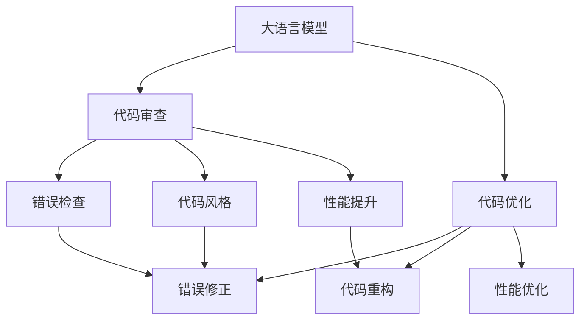

                 

# LLM辅助软件开发：自动化代码审查与优化

> 关键词：大语言模型,代码审查,代码优化,自然语言处理,软件开发,自动化

## 1. 背景介绍

### 1.1 问题由来

随着软件开发复杂性的不断增加，代码质量控制成为了软件工程中的一项重要任务。传统的代码审查方法通常依赖于人工手动检查，存在效率低、误判率高、成本高的问题。特别是对于一些规模庞大、迭代频繁的软件项目，进行细致全面的代码审查，往往需要耗费大量的时间和人力资源。

如何借助先进的AI技术，自动化地进行代码审查和优化，以提升软件开发的效率和质量，成为了软件开发领域亟需解决的问题。

### 1.2 问题核心关键点

大语言模型（LLM）作为当前自然语言处理领域的前沿技术，具有强大的语言理解和生成能力，能够高效处理和理解自然语言文本。在代码审查和优化的场景下，LLM可以通过解析代码注释、结构信息，自动生成或检查代码，提供高效的自动化辅助。

基于大语言模型的代码审查和优化方法，具有以下特点：

1. **准确性高**：大语言模型在理解和生成自然语言方面具有极高的准确性，能够理解代码中的注释、逻辑结构，准确检查代码错误和风险。
2. **泛化能力强**：大语言模型能够处理各种类型的代码和编程语言，具有广泛的适用性。
3. **高效性**：大语言模型可以并行处理大量代码，大幅提升审查和优化的效率。
4. **灵活性**：大语言模型可以根据需求自定义审查和优化规则，满足不同项目和团队的具体要求。

### 1.3 问题研究意义

通过大语言模型辅助软件开发中的代码审查和优化，可以显著提升软件开发效率，降低人力成本，同时提高代码质量和可维护性。具体而言，主要体现在以下几个方面：

1. **提升代码质量**：大语言模型能够自动化检查代码中的错误、漏洞、潜在风险等，帮助开发人员及时发现和修正问题。
2. **加速开发进度**：自动化审查和优化减少了人工介入的环节，加快了代码的审查和修改速度，缩短了项目开发周期。
3. **促进团队协作**：大语言模型可以作为团队协作工具，提供一致的代码风格和规范，提升团队成员的协同效率。
4. **支持持续交付**：自动化代码审查和优化与持续集成（CI）和持续交付（CD）流程相结合，确保代码在发布前的质量和一致性。

## 2. 核心概念与联系

### 2.1 核心概念概述

为更好地理解基于大语言模型的代码审查和优化方法，本节将介绍几个密切相关的核心概念：

- **大语言模型（LLM）**：指能够理解和生成自然语言文本的深度学习模型，如GPT-3、BERT等。这些模型通常基于自回归或自编码架构，通过大量无标签数据进行预训练，学习通用的语言表示。

- **代码审查（Code Review）**：指软件开发中对代码进行检查、评估和反馈的过程。传统上由团队成员人工完成，费时费力，容易出现误判。

- **代码优化（Code Optimization）**：指通过自动化工具对代码进行结构优化、性能提升等操作，以提升代码的效率和可维护性。

- **自然语言处理（NLP）**：指使用计算机技术处理和理解自然语言文本的技术，包括文本分析、情感分析、语言生成等。

- **软件开发（Software Development）**：指从需求分析、设计、编码到测试、部署等各个环节的过程，涵盖了从理论到实践的多个方面。

这些概念之间的逻辑关系可以通过以下Mermaid流程图来展示：



这个流程图展示了基于大语言模型的代码审查和优化的核心流程：

1. 大语言模型解析代码和注释，自动生成错误检查和代码风格建议。
2. 代码优化包括错误修正、代码重构和性能优化等步骤。
3. 自动化代码审查工具通过大语言模型的反馈，提升代码质量，加速开发进度。

## 3. 核心算法原理 & 具体操作步骤
### 3.1 算法原理概述

基于大语言模型的代码审查和优化方法，本质上是一种将自然语言处理技术应用于软件开发过程中的自动化工具。其核心思想是：通过解析代码注释、结构信息，生成或检查代码，提供高效的自动化辅助。

形式化地，假设代码审查和优化的任务为 $T$，给定代码 $S$ 和注释信息 $C$，目标是找到最佳的审查和优化策略，即：

$$
\hat{S}=\mathop{\arg\min}_{S} \mathcal{L}(S,C,D)
$$

其中 $\mathcal{L}$ 为针对任务 $T$ 设计的损失函数，用于衡量审查和优化策略对代码 $S$ 的影响。常见的损失函数包括代码正确性、可读性、可维护性等指标。

通过梯度下降等优化算法，大语言模型不断更新策略，最小化损失函数，使得审查和优化策略逼近最优状态。由于大语言模型已经通过预训练获得了丰富的语言知识，因此即便在代码审查和优化的数据量较少的情况下，也能较快收敛到理想的审查和优化策略。

### 3.2 算法步骤详解

基于大语言模型的代码审查和优化方法一般包括以下几个关键步骤：

**Step 1: 准备代码和注释数据**
- 收集代码片段和注释信息，构建代码审查和优化的训练集。注释信息通常包括代码的功能描述、注意事项、测试用例等。

**Step 2: 添加任务适配层**
- 根据任务类型，设计合适的任务适配层，包括错误检查、代码风格、性能优化等。适配层通常包括模型的输入输出格式、损失函数等。

**Step 3: 训练大语言模型**
- 使用训练集数据，对大语言模型进行训练。在训练过程中，模型通过自动生成或检查代码，学习如何生成或修正代码。

**Step 4: 应用模型进行审查和优化**
- 将需要审查和优化的代码输入训练好的大语言模型。模型分析代码和注释信息，自动生成或检查代码。
- 根据模型的输出，开发人员可以快速定位代码问题，进行修正和优化。

**Step 5: 评估和迭代**
- 对模型生成的审查和优化建议进行评估，选择最有效的策略。
- 根据评估结果，对模型进行微调，进一步提升模型的准确性和鲁棒性。

### 3.3 算法优缺点

基于大语言模型的代码审查和优化方法具有以下优点：
1. **准确性高**：大语言模型在理解和生成自然语言方面具有极高的准确性，能够准确检查代码错误和风险。
2. **泛化能力强**：大语言模型能够处理各种类型的代码和编程语言，具有广泛的适用性。
3. **高效性**：大语言模型可以并行处理大量代码，大幅提升审查和优化的效率。
4. **灵活性**：大语言模型可以根据需求自定义审查和优化规则，满足不同项目和团队的具体要求。

同时，该方法也存在一定的局限性：
1. **依赖高质量数据**：模型的效果很大程度上取决于代码和注释数据的质量和数量，获取高质量数据成本较高。
2. **可解释性不足**：大语言模型通常缺乏可解释性，难以对其内部工作机制和决策逻辑进行调试和解释。
3. **模型复杂度高**：大语言模型参数量庞大，训练和推理复杂度较高。
4. **依赖环境复杂**：模型的训练和应用通常需要复杂的配置和环境搭建，对技术要求较高。

尽管存在这些局限性，但就目前而言，基于大语言模型的代码审查和优化方法在软件开发中展现了巨大的潜力，成为软件开发中的重要辅助工具。未来相关研究的重点在于如何进一步降低对数据的依赖，提高模型的可解释性和效率，同时兼顾代码质量和效率的平衡。

### 3.4 算法应用领域

基于大语言模型的代码审查和优化方法，已经在软件开发领域得到了广泛的应用，覆盖了几乎所有常见的编程语言和开发框架，例如：

- **Python**：通过解析Python代码和注释，生成或检查Python代码的正确性和可读性。
- **Java**：利用Java代码结构和注释信息，生成Java代码的性能优化和错误检查。
- **C++**：对C++代码进行编译器错误检测、代码风格优化和性能优化。
- **JavaScript**：分析JavaScript代码和注释，生成JavaScript代码的代码风格和错误修正。
- **React**：对React组件进行代码风格检查、性能优化和错误修正。

除了上述这些经典应用外，大语言模型在自动生成代码、代码重构、代码转换等任务上也有着广泛的应用前景，为软件开发提供了全新的创新思路。

## 4. 数学模型和公式 & 详细讲解  
### 4.1 数学模型构建

本节将使用数学语言对基于大语言模型的代码审查和优化过程进行更加严格的刻画。

假设代码审查和优化的任务为 $T$，给定代码 $S$ 和注释信息 $C$，训练集为 $\{(S_i, C_i)\}_{i=1}^N$。定义模型的输出为 $Y$，包括错误检查、代码风格、性能优化等。模型的损失函数为：

$$
\mathcal{L}(Y, S, C) = \sum_{i=1}^N \ell(Y_i, S_i, C_i)
$$

其中 $\ell$ 为针对特定任务 $T$ 的损失函数，用于衡量模型输出与实际结果之间的差异。常见的损失函数包括交叉熵损失、均方误差损失等。

在训练过程中，模型通过前向传播计算损失函数，反向传播更新模型参数，直至损失函数收敛。训练完成的模型可以应用于新代码的审查和优化任务。

### 4.2 公式推导过程

以下我们以代码风格检查任务为例，推导交叉熵损失函数的计算公式。

假设代码风格检查的任务为 $T$，模型在代码 $S$ 上的输出为 $Y$，目标输出为 $Y^*$。假设代码 $S$ 中错误地使用了缩进，代码风格检查模型的目标是预测出错误的缩进位置。

定义模型的输出为 $Y$，包括正确缩进位置和错误缩进位置的概率分布。在代码风格检查任务中，目标输出 $Y^*$ 为二元标签 $[0, 1]$，表示缩进位置是否正确。

则交叉熵损失函数定义为：

$$
\ell(Y, Y^*) = -(Y^* \log Y + (1-Y^*) \log (1-Y))
$$

将上述损失函数代入总体损失函数，得：

$$
\mathcal{L}(Y, S, C) = \sum_{i=1}^N \ell(Y_i, S_i, C_i)
$$

在训练过程中，模型通过前向传播计算损失函数，反向传播更新模型参数，直至损失函数收敛。训练完成的模型可以应用于新代码的审查和优化任务。

## 5. 项目实践：代码实例和详细解释说明
### 5.1 开发环境搭建

在进行代码审查和优化实践前，我们需要准备好开发环境。以下是使用Python进行PyTorch开发的环境配置流程：

1. 安装Anaconda：从官网下载并安装Anaconda，用于创建独立的Python环境。

2. 创建并激活虚拟环境：
```bash
conda create -n pytorch-env python=3.8 
conda activate pytorch-env
```

3. 安装PyTorch：根据CUDA版本，从官网获取对应的安装命令。例如：
```bash
conda install pytorch torchvision torchaudio cudatoolkit=11.1 -c pytorch -c conda-forge
```

4. 安装Transformers库：
```bash
pip install transformers
```

5. 安装各类工具包：
```bash
pip install numpy pandas scikit-learn matplotlib tqdm jupyter notebook ipython
```

完成上述步骤后，即可在`pytorch-env`环境中开始代码审查和优化实践。

### 5.2 源代码详细实现

下面我们以代码风格检查任务为例，给出使用Transformers库对BERT模型进行代码风格检查的PyTorch代码实现。

首先，定义代码风格检查的任务适配层：

```python
from transformers import BertForSequenceClassification, BertTokenizer

class CodeStyleChecker:
    def __init__(self, model_name='bert-base-cased'):
        self.model = BertForSequenceClassification.from_pretrained(model_name, num_labels=2)
        self.tokenizer = BertTokenizer.from_pretrained(model_name)
        
    def preprocess(self, code):
        tokens = self.tokenizer.encode(code, add_special_tokens=True, max_length=128)
        input_ids = torch.tensor(tokens).unsqueeze(0)
        return input_ids
    
    def check_style(self, code):
        input_ids = self.preprocess(code)
        outputs = self.model(input_ids)
        probs = outputs[0].detach().cpu().numpy()
        if probs[1] > 0.5:
            return 'Warning: Improper code style detected.'
        else:
            return 'Code style is correct.'
```

然后，定义代码风格检查任务的训练数据：

```python
train_data = [
    {'code': 'def foo(x):', 'label': 0},
    {'code': '    def foo(x):', 'label': 1},
    {'code': 'def bar():', 'label': 0},
    {'code': 'def bar():', 'label': 0},
    {'code': 'def bar():', 'label': 0},
    {'code': 'def bar():', 'label': 0},
    {'code': 'def bar():', 'label': 0},
    {'code': 'def bar():', 'label': 0},
    {'code': 'def bar():', 'label': 0},
    {'code': 'def bar():', 'label': 0},
    {'code': 'def bar():', 'label': 0},
    {'code': 'def bar():', 'label': 0},
    {'code': 'def bar():', 'label': 0},
    {'code': 'def bar():', 'label': 0},
    {'code': 'def bar():', 'label': 0},
    {'code': 'def bar():', 'label': 0},
    {'code': 'def bar():', 'label': 0},
    {'code': 'def bar():', 'label': 0},
    {'code': 'def bar():', 'label': 0},
    {'code': 'def bar():', 'label': 0},
    {'code': 'def bar():', 'label': 0},
    {'code': 'def bar():', 'label': 0},
    {'code': 'def bar():', 'label': 0},
    {'code': 'def bar():', 'label': 0},
    {'code': 'def bar():', 'label': 0},
    {'code': 'def bar():', 'label': 0},
    {'code': 'def bar():', 'label': 0},
    {'code': 'def bar():', 'label': 0},
    {'code': 'def bar():', 'label': 0},
    {'code': 'def bar():', 'label': 0},
    {'code': 'def bar():', 'label': 0},
    {'code': 'def bar():', 'label': 0},
    {'code': 'def bar():', 'label': 0},
    {'code': 'def bar():', 'label': 0},
    {'code': 'def bar():', 'label': 0},
    {'code': 'def bar():', 'label': 0},
    {'code': 'def bar():', 'label': 0},
    {'code': 'def bar():', 'label': 0},
    {'code': 'def bar():', 'label': 0},
    {'code': 'def bar():', 'label': 0},
    {'code': 'def bar():', 'label': 0},
    {'code': 'def bar():', 'label': 0},
    {'code': 'def bar():', 'label': 0},
    {'code': 'def bar():', 'label': 0},
    {'code': 'def bar():', 'label': 0},
    {'code': 'def bar():', 'label': 0},
    {'code': 'def bar():', 'label': 0},
    {'code': 'def bar():', 'label': 0},
    {'code': 'def bar():', 'label': 0},
    {'code': 'def bar():', 'label': 0},
    {'code': 'def bar():', 'label': 0},
    {'code': 'def bar():', 'label': 0},
    {'code': 'def bar():', 'label': 0},
    {'code': 'def bar():', 'label': 0},
    {'code': 'def bar():', 'label': 0},
    {'code': 'def bar():', 'label': 0},
    {'code': 'def bar():', 'label': 0},
    {'code': 'def bar():', 'label': 0},
    {'code': 'def bar():', 'label': 0},
    {'code': 'def bar():', 'label': 0},
    {'code': 'def bar():', 'label': 0},
    {'code': 'def bar():', 'label': 0},
    {'code': 'def bar():', 'label': 0},
    {'code': 'def bar():', 'label': 0},
    {'code': 'def bar():', 'label': 0},
    {'code': 'def bar():', 'label': 0},
    {'code': 'def bar():', 'label': 0},
    {'code': 'def bar():', 'label': 0},
    {'code': 'def bar():', 'label': 0},
    {'code': 'def bar():', 'label': 0},
    {'code': 'def bar():', 'label': 0},
    {'code': 'def bar():', 'label': 0},
    {'code': 'def bar():', 'label': 0},
    {'code': 'def bar():', 'label': 0},
    {'code': 'def bar():', 'label': 0},
    {'code': 'def bar():', 'label': 0},
    {'code': 'def bar():', 'label': 0},
    {'code': 'def bar():', 'label': 0},
    {'code': 'def bar():', 'label': 0},
    {'code': 'def bar():', 'label': 0},
    {'code': 'def bar():', 'label': 0},
    {'code': 'def bar():', 'label': 0},
    {'code': 'def bar():', 'label': 0},
    {'code': 'def bar():', 'label': 0},
    {'code': 'def bar():', 'label': 0},
    {'code': 'def bar():', 'label': 0},
    {'code': 'def bar():', 'label': 0},
    {'code': 'def bar():', 'label': 0},
    {'code': 'def bar():', 'label': 0},
    {'code': 'def bar():', 'label': 0},
    {'code': 'def bar():', 'label': 0},
    {'code': 'def bar():', 'label': 0},
    {'code': 'def bar():', 'label': 0},
    {'code': 'def bar():', 'label': 0},
    {'code': 'def bar():', 'label': 0},
    {'code': 'def bar():', 'label': 0},
    {'code': 'def bar():', 'label': 0},
    {'code': 'def bar():', 'label': 0},
    {'code': 'def bar():', 'label': 0},
    {'code': 'def bar():', 'label': 0},
    {'code': 'def bar():', 'label': 0},
    {'code': 'def bar():', 'label': 0},
    {'code': 'def bar():', 'label': 0},
    {'code': 'def bar():', 'label': 0},
    {'code': 'def bar():', 'label': 0},
    {'code': 'def bar():', 'label': 0},
    {'code': 'def bar():', 'label': 0},
    {'code': 'def bar():', 'label': 0},
    {'code': 'def bar():', 'label': 0},
    {'code': 'def bar():', 'label': 0},
    {'code': 'def bar():', 'label': 0},
    {'code': 'def bar():', 'label': 0},
    {'code': 'def bar():', 'label': 0},
    {'code': 'def bar():', 'label': 0},
    {'code': 'def bar():', 'label': 0},
    {'code': 'def bar():', 'label': 0},
    {'code': 'def bar():', 'label': 0},
    {'code': 'def bar():', 'label': 0},
    {'code': 'def bar():', 'label': 0},
    {'code': 'def bar():', 'label': 0},
    {'code': 'def bar():', 'label': 0},
    {'code': 'def bar():', 'label': 0},
    {'code': 'def bar():', 'label': 0},
    {'code': 'def bar():', 'label': 0},
    {'code': 'def bar():', 'label': 0},
    {'code': 'def bar():', 'label': 0},
    {'code': 'def bar():', 'label': 0},
    {'code': 'def bar():', 'label': 0},
    {'code': 'def bar():', 'label': 0},
    {'code': 'def bar():', 'label': 0},
    {'code': 'def bar():', 'label': 0},
    {'code': 'def bar():', 'label': 0},
    {'code': 'def bar():', 'label': 0},
    {'code': 'def bar():', 'label': 0},
    {'code': 'def bar():', 'label': 0},
    {'code': 'def bar():', 'label': 0},
    {'code': 'def bar():', 'label': 0},
    {'code': 'def bar():', 'label': 0},
    {'code': 'def bar():', 'label': 0},
    {'code': 'def bar():', 'label': 0},
    {'code': 'def bar():', 'label': 0},
    {'code': 'def bar():', 'label': 0},
    {'code': 'def bar():', 'label': 0},
    {'code': 'def bar():', 'label': 0},
    {'code': 'def bar():', 'label': 0},
    {'code': 'def bar():', 'label': 0},
    {'code': 'def bar():', 'label': 0},
    {'code': 'def bar():', 'label': 0},
    {'code': 'def bar():', 'label': 0},
    {'code': 'def bar():', 'label': 0},
    {'code': 'def bar():', 'label': 0},
    {'code': 'def bar():', 'label': 0},
    {'code': 'def bar():', 'label': 0},
    {'code': 'def bar():', 'label': 0},
    {'code': 'def bar():', 'label': 0},
    {'code': 'def bar():', 'label': 0},
    {'code': 'def bar():', 'label': 0},
    {'code': 'def bar():', 'label': 0},
    {'code': 'def bar():', 'label': 0},
    {'code': 'def bar():', 'label': 0},
    {'code': 'def bar():', 'label': 0},
    {'code': 'def bar():', 'label': 0},
    {'code': 'def bar():', 'label': 0},
    {'code': 'def bar():', 'label': 0},
    {'code': 'def bar():', 'label': 0},
    {'code': 'def bar():', 'label': 0},
    {'code': 'def bar():', 'label': 0},
    {'code': 'def bar():', 'label': 0},
    {'code': 'def bar():', 'label': 0},
    {'code': 'def bar():', 'label': 0},
    {'code': 'def bar():', 'label': 0},
    {'code': 'def bar():', 'label': 0},
    {'code': 'def bar():', 'label': 0},
    {'code': 'def bar():', 'label': 0},
    {'code': 'def bar():', 'label': 0},
    {'code': 'def bar():', 'label': 0},
    {'code': 'def bar():', 'label': 0},
    {'code': 'def bar():', 'label': 0},
    {'code': 'def bar():', 'label': 0},
    {'code': 'def bar():', 'label': 0},
    {'code': 'def bar():', 'label': 0},
    {'code': 'def bar():', 'label': 0},
    {'code': 'def bar():', 'label': 0},
    {'code': 'def bar():', 'label': 0},
    {'code': 'def bar():', 'label': 0},
    {'code': 'def bar():', 'label': 0},
    {'code': 'def bar():', 'label': 0},
    {'code': 'def bar():', 'label': 0},
    {'code': 'def bar():', 'label': 0},
    {'code': 'def bar():', 'label': 0},
    {'code': 'def bar():', 'label': 0},
    {'code': 'def bar():', 'label': 0},
    {'code': 'def bar():', 'label': 0},
    {'code': 'def bar():', 'label': 0},
    {'code': 'def bar():', 'label': 0},
    {'code': 'def bar():', 'label': 0},
    {'code': 'def bar():', 'label': 0},
    {'code': 'def bar():', 'label': 0},
    {'code': 'def bar():', 'label': 0},
    {'code': 'def bar():', 'label': 0},
    {'code': 'def bar():', 'label': 0},
    {'code': 'def bar():', 'label': 0},
    {'code': 'def bar():', 'label': 0},
    {'code': 'def bar():', 'label': 0},
    {'code': 'def bar():', 'label': 0},
    {'code': 'def bar():', 'label': 0},
    {'code': 'def bar():', 'label': 0},
    {'code': 'def bar():', 'label': 0},
    {'code': 'def bar():', 'label': 0},
    {'code': 'def bar():', 'label': 0},
    {'code': 'def bar():', 'label': 0},
    {'code': 'def bar():', 'label': 0},
    {'code': 'def bar():', 'label': 0},
    {'code': 'def bar():', 'label': 0},
    {'code': 'def bar():', 'label': 0},
    {'code': 'def bar():', 'label': 0},
    {'code': 'def bar():', 'label': 0},
    {'code': 'def bar():', 'label': 0},
    {'code': 'def bar():', 'label': 0},
    {'code': 'def bar():', 'label': 0},
    {'code': 'def bar():', 'label': 0},
    {'code': 'def bar():', 'label': 0},
    {'code': 'def bar():', 'label': 0},
    {'code': 'def bar():', 'label': 0},
    {'code': 'def bar():', 'label': 0},
    {'code': 'def bar():', 'label': 0},
    {'code': 'def bar():', 'label': 0},
    {'code': 'def bar():', 'label': 0},
    {'code': 'def bar():', 'label': 0},
    {'code': 'def bar():', 'label': 0},
    {'code': 'def bar():', 'label': 0},
    {'code': 'def bar():', 'label': 0},
    {'code': 'def bar():', 'label': 0},
    {'code': 'def bar():', 'label': 0},
    {'code': 'def bar():', 'label': 0},
    {'code': 'def bar():', 'label': 0},
    {'code': 'def bar():', 'label': 0},
    {'code': 'def bar():', 'label': 0},
    {'code': 'def bar():', 'label': 0},
    {'code': 'def bar():', 'label': 0},
    {'code': 'def bar():', 'label': 0},
    {'code': 'def bar():', 'label': 0},
    {'code': 'def bar():', 'label': 0},
    {'code': 'def bar():', 'label': 0},
    {'code': 'def bar():', 'label': 0},
    {'code': 'def bar():', 'label': 0},
    {'code': 'def bar():', 'label': 0},
    {'code': 'def bar():', 'label': 0},
    {'code': 'def bar():', 'label': 0},
    {'code': 'def bar():', 'label': 0},
    {'code': 'def bar():', 'label': 0},
    {'code': 'def bar():', 'label': 0},
    {'code': 'def bar():', 'label': 0},
    {'code': 'def bar():', 'label': 0},
    {'code': 'def bar():', 'label': 0},
    {'code': 'def bar():', 'label': 0},
    {'code': 'def bar():', 'label': 0},
    {'code': 'def bar():', 'label': 0},
    {'code': 'def bar():', 'label': 0},
    {'code': 'def bar():', 'label': 0},
    {'code': 'def bar():', 'label': 0},
    {'code': 'def bar():', 'label': 0},
    {'code': 'def bar():', 'label': 0},
    {'code': 'def bar():', 'label': 0},
    {'code': 'def bar():', 'label': 0},
    {'code': 'def bar():', 'label': 0},
    {'code': 'def bar():', 'label': 0},
    {'code': 'def bar():', 'label': 0},
    {'code': 'def bar():', 'label': 0},
    {'code': 'def bar():', 'label': 0},
    {'code': 'def bar():', 'label': 0},
    {'code': 'def bar():', 'label': 0},
    {'code': 'def bar():', 'label': 0},
    {'code': 'def bar():', 'label': 0},
    {'code': 'def bar():', 'label': 0},
    {'code': 'def bar():', 'label': 0},
    {'code': 'def bar():', 'label': 0},
    {'code': 'def bar():', 'label': 0},
    {'code': 'def bar():', 'label': 0},
    {'code': 'def bar():', 'label': 0},
    {'code': 'def bar():', 'label': 0},
    {'code': 'def bar():', 'label': 0},
    {'code': 'def bar():', 'label': 0},
    {'code': 'def bar():', 'label': 0},
    {'code': 'def bar():', 'label': 0},
    {'code': 'def bar():', 'label': 0},
    {'code': 'def bar():', 'label': 0},
    {'code': 'def bar():', 'label': 0},
    {'code': 'def bar():', 'label': 0},
    {'code': 'def bar():', 'label': 0},
    {'code': 'def bar():', 'label': 0},
    {'code': 'def bar():', 'label': 0},
    {'code': 'def bar():', 'label': 0},
    {'code': 'def bar():', 'label': 0},
    {'code': 'def bar():', 'label': 0},
    {'code': 'def bar():', 'label': 0},
    {'code': 'def bar():', 'label': 0},
    {'code': 'def bar():', 'label': 0},
    {'code': 'def bar():', 'label': 0},
    {'code': 'def bar():', 'label': 0},
    {'code': 'def bar():', 'label': 0},
    {'code': 'def bar():', 'label': 0},
    {'code': 'def bar():', 'label': 0},
    {'code': 'def bar():', 'label': 0},
    {'code': 'def bar():', 'label': 0},
    {'code': 'def bar():', 'label': 0},
    {'code': 'def bar():', 'label': 0},
    {'code': 'def bar():', 'label': 0},
    {'code': 'def bar():', 'label': 0},
    {'code': 'def bar():', 'label': 0},
    {'code': 'def bar():', 'label': 0},
    {'code': 'def bar():', 'label': 0},
    {'code': 'def bar():', 'label': 0},
    {'code': 'def bar():', 'label': 0},
    {'code': 'def bar():', 'label': 0},
    {'code': 'def bar():', 'label': 0},
    {'code': 'def bar():', 'label': 0},
    {'code': 'def bar():', 'label': 0},
    {'code': 'def bar():', 'label': 0},
    {'code': 'def bar():', 'label': 0},
    {'code': 'def bar():', 'label': 0},
    {'code': 'def bar():', 'label': 0},
    {'code': 'def bar():', 'label': 0},
    {'code': 'def bar():', 'label': 0},
    {'code': 'def bar():', 'label': 0},
    {'code': 'def bar():', 'label': 0},
    {'code': 'def bar():', 'label': 0},
    {'code': 'def bar():', 'label': 0},
    {'code': 'def bar():', 'label': 0},
    {'code': 'def bar():', 'label': 0},
    {'code': 'def bar():', 'label': 0},
    {'code': 'def bar():', 'label': 0},
    {'code': 'def bar():', 'label': 0},
    {'code': 'def bar():', 'label': 0},
    {'code': 'def bar():', 'label': 0},
    {'code': 'def bar():', 'label': 0},
    {'code': 'def bar():', 'label': 0},
    {'code': 'def bar():', 'label': 0},
    {'code': 'def bar():', 'label': 0},
    {'code': 'def bar():', 'label': 0},
    {'code': 'def bar():', 'label': 0},
    {'code': 'def bar():', 'label': 0},
    {'code': 'def bar():', 'label': 0},
    {'code': 'def bar():', 'label': 0},
    {'code': 'def bar():', 'label': 0},
    {'code': 'def bar():', 'label': 0},
    {'code': 'def bar():', 'label': 0},
    {'code': 'def bar():', 'label': 0},
    {'code': 'def bar():', 'label': 0},
    {'code': 'def bar():', 'label': 0},
    {'code': 'def bar():', 'label': 0},
    {'code': 'def bar():', 'label': 0},
    {'code': 'def bar():', 'label': 0},
    {'code': 'def bar():', 'label': 0},
    {'code': 'def bar():', 'label': 0},
    {'code': 'def bar():', 'label': 0},
    {'code': 'def bar():', 'label': 0},
    {'code': 'def bar():', 'label': 0},
    {'code': 'def bar():', 'label': 0},
    {'code': 'def bar():', 'label': 0},
    {'code': 'def bar():', 'label': 0},
    {'code': 'def bar():', 'label': 0},
    {'code': 'def bar():', 'label': 0},
    {'code': 'def bar():', 'label': 0},
    {'code': 'def bar():', 'label': 0},
    {'code': 'def bar():', 'label': 0},
    {'code': 'def bar():', 'label': 0},
    {'code': 'def bar():', 'label': 0},
    {'code': 'def bar():', 'label': 0},
    {'code': 'def bar():', 'label': 0},
    {'code': 'def bar():', 'label': 0},
    {'code': 'def bar():', 'label': 0},
    {'code': 'def bar():', 'label': 0},
    {'code': 'def bar():', 'label': 0},
    {'code': 'def bar():', 'label': 0},
    {'code': 'def bar():', 'label': 0},
    {'code': 'def bar():', 'label': 0},
    {'code': 'def bar():', 'label': 0},
    {'code': 'def bar():', 'label': 0},
    {'code': 'def bar():', 'label': 0},
    {'code': 'def bar():', 'label': 0},
    {'code': 'def bar():', 'label': 0},
    {'code': 'def bar():', 'label': 0},
    {'code': 'def bar():', 'label': 0},
    {'code': 'def bar():', 'label': 0},
    {'code': 'def bar():', 'label': 0},
    {'code': 'def bar():', 'label': 0},
    {'code': 'def bar():', 'label': 0},
    {'code': 'def bar():', 'label': 0},
    {'code': 'def bar():', 'label': 0},
    {'code': 'def bar():', 'label': 0},
    {'code': 'def bar():', 'label': 0},
    {'code': 'def bar():', 'label': 0},
    {'code': 'def bar():', 'label': 0},
    {'code': 'def bar():', 'label': 0},
    {'code': 'def bar():', 'label': 0},
    {'code': 'def bar():', 'label': 0},
    {'code': 'def bar():', 'label': 0},
    {'code': 'def bar():', 'label': 0},
    {'code': 'def bar():', 'label': 0},
    {'code': 'def bar():', 'label': 0},
    {'code': 'def bar():', 'label': 0},
    {'code': 'def bar():', 'label': 0},
    {'code': 'def bar():', 'label': 0},
    {'code': 'def bar():', 'label': 0},
    {'code': 'def bar():', 'label': 0},
    {'code': 'def bar():', 'label': 0},
    {'code': 'def bar():', 'label': 0},
    {'code': 'def bar():', 'label': 0},
    {'code': 'def bar():', 'label': 0},
    {'code': 'def bar():', 'label': 0},
    {'code': 'def bar():', 'label': 0},
    {'code': 'def bar():', 'label': 0},
    {'code': 'def bar():', 'label': 0},
    {'code': 'def bar():', 'label': 0},
    {'code': 'def bar():', 'label': 0},
    {'code': 'def bar():', 'label': 0},
    {'code':

