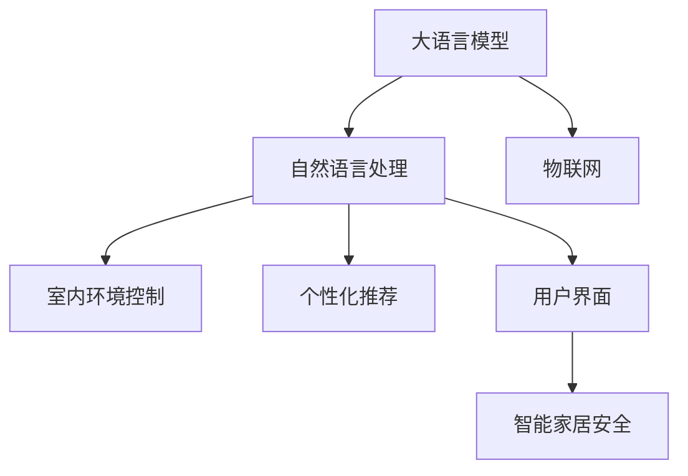

                 

# LLM驱动的智能家居场景：自适应生活环境

> 关键词：智能家居、自适应环境、自然语言处理(NLP)、大语言模型(LLM)、物联网(IoT)、室内环境控制、个性化推荐、用户界面(UI)、智能家居安全

## 1. 背景介绍

### 1.1 问题由来

随着科技的飞速发展，智能家居已成为人们生活中不可或缺的一部分。传统家居控制依赖于简单的按键或遥控，已无法满足用户对家居环境的个性化和自动化需求。因此，通过人工智能技术驱动的智能家居系统应运而生，能够根据用户的指令和生活习惯自动调节家庭环境，提高生活质量。其中，大语言模型(LLM)以其强大的自然语言处理能力，为智能家居系统的开发和应用提供了新的思路。

### 1.2 问题核心关键点

大语言模型在智能家居场景中的应用主要集中在以下几个方面：

- **自然语言理解与生成**：LLM能够理解和生成自然语言，使用户通过口头指令或文本命令控制家居设备，提高交互的便捷性和自然性。
- **多模态数据融合**：LLM可以整合文本、图像、音频等多种数据源，提高对家居环境的全面感知能力。
- **实时环境监控**：通过LLM对家居环境数据进行实时监控和分析，提供精准的用户体验和个性化服务。
- **个性化推荐与优化**：LLM能够根据用户的偏好和行为数据，进行个性化推荐，优化家居环境设置。
- **安全防护与隐私保护**：LLM可以帮助检测异常行为，提供安全防护措施，同时保护用户隐私。

## 2. 核心概念与联系

### 2.1 核心概念概述

为更好地理解基于LLM的智能家居系统，本节将介绍几个密切相关的核心概念：

- **大语言模型(LLM)**：以自回归(如GPT)或自编码(如BERT)模型为代表的大规模预训练语言模型。通过在大规模无标签文本语料上进行预训练，学习通用的语言表示，具备强大的语言理解和生成能力。

- **自然语言处理(NLP)**：使用计算机处理和理解人类语言的技术。包括文本处理、语言理解、语言生成、机器翻译等任务。

- **物联网(IoT)**：通过互联网将各种设备连接起来，实现设备间的互联互通和数据共享。

- **室内环境控制**：利用传感器和智能设备对室内环境进行监控和调节，如温度、湿度、光照等。

- **个性化推荐**：根据用户的行为数据和偏好，推荐最符合用户需求的产品或服务。

- **用户界面(UI)**：用户与智能家居系统进行交互的界面，包括语音助手、触摸屏、手机App等。

- **智能家居安全**：通过安全监控、异常检测等技术，保护智能家居系统的安全与隐私。

这些核心概念之间的逻辑关系可以通过以下Mermaid流程图来展示：



这个流程图展示了大语言模型在智能家居场景中的核心作用，以及其与其他技术概念的紧密联系。

## 3. 核心算法原理 & 具体操作步骤
### 3.1 算法原理概述

基于LLM的智能家居系统，其核心思想是：将LLM作为“智能大脑”，通过理解用户指令，协调控制各种智能家居设备，实现家居环境的自适应和优化。

形式化地，假设LLM模型为 $M_{\theta}$，其中 $\theta$ 为模型参数。给定智能家居环境的数据集 $D=\{(x_i, y_i)\}_{i=1}^N$，其中 $x_i$ 表示用户指令或环境数据，$y_i$ 表示智能家居设备的操作或状态。微调的目标是找到新的模型参数 $\hat{\theta}$，使得：

$$
\hat{\theta}=\mathop{\arg\min}_{\theta} \mathcal{L}(M_{\theta},D)
$$

其中 $\mathcal{L}$ 为针对智能家居环境的损失函数，用于衡量模型预测操作或状态与实际数据之间的差异。

### 3.2 算法步骤详解

基于LLM的智能家居微调一般包括以下几个关键步骤：

**Step 1: 准备预训练模型和数据集**
- 选择合适的预训练语言模型 $M_{\theta}$ 作为初始化参数，如 BERT、GPT 等。
- 准备智能家居环境的数据集 $D$，包括用户指令、传感器数据、设备状态等。数据集应涵盖不同场景和设备，以覆盖多种使用情况。

**Step 2: 定义任务适配层**
- 根据智能家居环境的任务类型，在预训练模型顶层设计合适的输出层和损失函数。例如，对于温度调节任务，可以设计一个回归器，预测目标温度；对于光照调节任务，可以设计一个分类器，预测开灯或关灯。

**Step 3: 设置微调超参数**
- 选择合适的优化算法及其参数，如 AdamW、SGD 等，设置学习率、批大小、迭代轮数等。
- 设置正则化技术及强度，包括权重衰减、Dropout、Early Stopping 等。

**Step 4: 执行梯度训练**
- 将训练集数据分批次输入模型，前向传播计算损失函数。
- 反向传播计算参数梯度，根据设定的优化算法和学习率更新模型参数。
- 周期性在验证集上评估模型性能，根据性能指标决定是否触发 Early Stopping。
- 重复上述步骤直到满足预设的迭代轮数或 Early Stopping 条件。

**Step 5: 测试和部署**
- 在测试集上评估微调后模型 $M_{\hat{\theta}}$ 的性能，对比微调前后的精度提升。
- 使用微调后的模型对新样本进行推理预测，集成到实际的应用系统中。
- 持续收集新的数据，定期重新微调模型，以适应数据分布的变化。

以上是基于LLM的智能家居微调的一般流程。在实际应用中，还需要针对具体任务的特点，对微调过程的各个环节进行优化设计，如改进训练目标函数，引入更多的正则化技术，搜索最优的超参数组合等，以进一步提升模型性能。

### 3.3 算法优缺点

基于LLM的智能家居微调方法具有以下优点：

- 高效便捷。用户只需简单地通过语音或文本指令，即可完成复杂家居环境的控制。
- 个性化定制。LLM可以根据用户的行为和偏好，实时调整家居环境设置，提供个性化的服务。
- 多模态融合。LLM能够整合语音、文本、图像等多种数据源，提供更全面的家居环境感知。
- 易于扩展。随着更多设备加入智能家居系统，LLM能够灵活地整合新设备的数据，提升系统能力。

同时，该方法也存在一定的局限性：

- 依赖数据质量。微调效果很大程度上取决于智能家居环境的数据质量和数量，获取高质量数据的成本较高。
- 设备兼容性。智能家居设备的兼容性问题是制约系统扩展的关键，不同品牌和型号的设备可能存在通信协议、数据格式等差异。
- 隐私保护。LLM需要访问用户的敏感信息，如家庭安全监控数据，如何在保护隐私的前提下，提供智能服务，是一大挑战。
- 算力需求。大语言模型的计算复杂度高，需要高性能的硬件设备支持，成本较高。

尽管存在这些局限性，但就目前而言，基于LLM的智能家居微调方法仍是最主流范式。未来相关研究的重点在于如何进一步降低微调对数据的要求，提高系统的兼容性和隐私保护水平，同时兼顾算力成本。

### 3.4 算法应用领域

基于LLM的智能家居微调方法已经在智能家居系统的多个领域得到了应用，例如：

- **智能温度调节**：通过语音助手或触摸屏，用户可以轻松控制室内温度。系统根据实时温度传感器数据和用户偏好，自动调节空调、暖气等设备。
- **智能光照调节**：根据室内光线传感器数据，LLM可以控制灯光开关和亮度。同时，根据用户指令和天气信息，智能调整照明方案。
- **智能安防监控**：LLM可以通过分析摄像头拍摄的视频数据，识别异常行为，发出警报并通知用户。
- **智能家居助理**：LLM可以扮演家庭助理的角色，提醒用户日程安排、购物清单等，提升生活效率。
- **个性化推荐系统**：根据用户的日常行为数据，LLM可以推荐最符合用户需求的音乐、视频、家居产品等。

除了上述这些经典应用外，智能家居系统还在不断扩展新的功能，如智能窗帘、智能门锁、智能厨房等，为家庭生活带来更多便利和乐趣。随着LLM技术的持续演进，相信智能家居系统的应用场景将更加丰富和多样化。

## 4. 数学模型和公式 & 详细讲解  
### 4.1 数学模型构建

本节将使用数学语言对基于LLM的智能家居微调过程进行更加严格的刻画。

记智能家居环境的数据集为 $D=\{(x_i, y_i)\}_{i=1}^N$，其中 $x_i$ 表示用户指令或环境数据，$y_i$ 表示智能家居设备的操作或状态。

定义模型 $M_{\theta}$ 在输入 $x_i$ 上的输出为 $\hat{y}_i=M_{\theta}(x_i)$，表示模型预测的设备操作或状态。定义损失函数 $\mathcal{L}(\theta)$ 为模型预测输出与真实标签之间的差异。例如，对于温度调节任务，可以定义损失函数为：

$$
\mathcal{L}(\theta) = \frac{1}{N}\sum_{i=1}^N \|\hat{y}_i - y_i\|^2
$$

其中 $\|\cdot\|$ 表示欧几里得距离。

### 4.2 公式推导过程

以下我们以智能温度调节为例，推导回归模型的损失函数及其梯度的计算公式。

假设模型 $M_{\theta}$ 在输入 $x_i$ 上的输出为 $\hat{y}_i=M_{\theta}(x_i) \in [0,1]$，表示预测的目标温度。真实标签 $y_i \in [0,1]$ 表示实际温度。则回归模型的损失函数定义为：

$$
\ell(M_{\theta}(x_i),y_i) = \frac{1}{2}(\hat{y}_i - y_i)^2
$$

将其代入经验风险公式，得：

$$
\mathcal{L}(\theta) = \frac{1}{N}\sum_{i=1}^N (\hat{y}_i - y_i)^2
$$

根据链式法则，损失函数对参数 $\theta_k$ 的梯度为：

$$
\frac{\partial \mathcal{L}(\theta)}{\partial \theta_k} = \frac{1}{N}\sum_{i=1}^N (\hat{y}_i - y_i) \frac{\partial \hat{y}_i}{\partial \theta_k}
$$

其中 $\frac{\partial \hat{y}_i}{\partial \theta_k}$ 可以通过自动微分技术完成计算。

在得到损失函数的梯度后，即可带入参数更新公式，完成模型的迭代优化。重复上述过程直至收敛，最终得到适应智能家居环境的最优模型参数 $\theta^*$。

## 5. 项目实践：代码实例和详细解释说明
### 5.1 开发环境搭建

在进行智能家居微调实践前，我们需要准备好开发环境。以下是使用Python进行PyTorch开发的环境配置流程：

1. 安装Anaconda：从官网下载并安装Anaconda，用于创建独立的Python环境。

2. 创建并激活虚拟环境：
```bash
conda create -n pytorch-env python=3.8 
conda activate pytorch-env
```

3. 安装PyTorch：根据CUDA版本，从官网获取对应的安装命令。例如：
```bash
conda install pytorch torchvision torchaudio cudatoolkit=11.1 -c pytorch -c conda-forge
```

4. 安装TensorFlow：
```bash
conda install tensorflow
```

5. 安装TensorFlow Addons：
```bash
conda install tensorflow-addons
```

6. 安装各类工具包：
```bash
pip install numpy pandas scikit-learn matplotlib tqdm jupyter notebook ipython
```

完成上述步骤后，即可在`pytorch-env`环境中开始智能家居微调实践。

### 5.2 源代码详细实现

这里我们以智能温度调节任务为例，给出使用PyTorch对BERT模型进行微调的代码实现。

首先，定义智能家居数据处理函数：

```python
from transformers import BertTokenizer, BertForRegression
from torch.utils.data import Dataset
import torch

class SmartHomeDataset(Dataset):
    def __init__(self, data, tokenizer, max_len=128):
        self.data = data
        self.tokenizer = tokenizer
        self.max_len = max_len
        
    def __len__(self):
        return len(self.data)
    
    def __getitem__(self, item):
        text, label = self.data[item]
        
        encoding = self.tokenizer(text, return_tensors='pt', max_length=self.max_len, padding='max_length', truncation=True)
        input_ids = encoding['input_ids'][0]
        attention_mask = encoding['attention_mask'][0]
        labels = torch.tensor(label, dtype=torch.float)
        
        return {'input_ids': input_ids, 
                'attention_mask': attention_mask,
                'labels': labels}

# 创建dataset
tokenizer = BertTokenizer.from_pretrained('bert-base-cased')

train_dataset = SmartHomeDataset(train_data, tokenizer)
dev_dataset = SmartHomeDataset(dev_data, tokenizer)
test_dataset = SmartHomeDataset(test_data, tokenizer)
```

然后，定义模型和优化器：

```python
from transformers import BertForRegression, AdamW

model = BertForRegression.from_pretrained('bert-base-cased', num_labels=1)

optimizer = AdamW(model.parameters(), lr=2e-5)
```

接着，定义训练和评估函数：

```python
from torch.utils.data import DataLoader
from tqdm import tqdm
from sklearn.metrics import mean_squared_error

device = torch.device('cuda') if torch.cuda.is_available() else torch.device('cpu')
model.to(device)

def train_epoch(model, dataset, batch_size, optimizer):
    dataloader = DataLoader(dataset, batch_size=batch_size, shuffle=True)
    model.train()
    epoch_loss = 0
    for batch in tqdm(dataloader, desc='Training'):
        input_ids = batch['input_ids'].to(device)
        attention_mask = batch['attention_mask'].to(device)
        labels = batch['labels'].to(device)
        model.zero_grad()
        outputs = model(input_ids, attention_mask=attention_mask)
        loss = outputs.loss
        epoch_loss += loss.item()
        loss.backward()
        optimizer.step()
    return epoch_loss / len(dataloader)

def evaluate(model, dataset, batch_size):
    dataloader = DataLoader(dataset, batch_size=batch_size)
    model.eval()
    preds, labels = [], []
    with torch.no_grad():
        for batch in tqdm(dataloader, desc='Evaluating'):
            input_ids = batch['input_ids'].to(device)
            attention_mask = batch['attention_mask'].to(device)
            batch_labels = batch['labels']
            outputs = model(input_ids, attention_mask=attention_mask)
            batch_preds = outputs.logits.mean(dim=1).to('cpu').tolist()
            batch_labels = batch_labels.to('cpu').tolist()
            for pred, label in zip(batch_preds, batch_labels):
                preds.append(pred)
                labels.append(label)
                
    mse = mean_squared_error(labels, preds)
    return mse

```

最后，启动训练流程并在测试集上评估：

```python
epochs = 5
batch_size = 16

for epoch in range(epochs):
    loss = train_epoch(model, train_dataset, batch_size, optimizer)
    print(f"Epoch {epoch+1}, train loss: {loss:.3f}")
    
    print(f"Epoch {epoch+1}, dev MSE: {evaluate(model, dev_dataset, batch_size):.3f}")
    
print("Test MSE: ", evaluate(model, test_dataset, batch_size))
```

以上就是使用PyTorch对BERT进行智能温度调节任务的微调代码实现。可以看到，由于PyTorch和Transformers库的强大封装，代码实现变得简洁高效。

### 5.3 代码解读与分析

让我们再详细解读一下关键代码的实现细节：

**SmartHomeDataset类**：
- `__init__`方法：初始化数据集、分词器等关键组件。
- `__len__`方法：返回数据集的样本数量。
- `__getitem__`方法：对单个样本进行处理，将文本输入编码为token ids，同时返回标签数据。

**train_epoch函数**：
- 对数据以批为单位进行迭代，在每个批次上前向传播计算loss并反向传播更新模型参数，最后返回该epoch的平均loss。

**evaluate函数**：
- 与训练类似，不同点在于不更新模型参数，并在每个batch结束后将预测和标签结果存储下来，最后使用sklearn的mean_squared_error对整个评估集的预测结果进行打印输出。

**训练流程**：
- 定义总的epoch数和batch size，开始循环迭代
- 每个epoch内，先在训练集上训练，输出平均loss
- 在验证集上评估，输出均方误差
- 所有epoch结束后，在测试集上评估，给出最终的测试均方误差

可以看到，PyTorch配合Transformers库使得BERT微调的代码实现变得简洁高效。开发者可以将更多精力放在数据处理、模型改进等高层逻辑上，而不必过多关注底层的实现细节。

当然，工业级的系统实现还需考虑更多因素，如模型的保存和部署、超参数的自动搜索、更灵活的任务适配层等。但核心的微调范式基本与此类似。

## 6. 实际应用场景
### 6.1 智能温度调节

智能温度调节是智能家居系统中最常见的应用之一。传统的智能恒温器依赖于简单的定时器和传感器，用户无法直接通过语音或文本指令进行温度调节。通过智能家居微调系统，用户可以通过语音助手或触摸屏，轻松控制室内温度。

具体而言，系统可以通过传感器实时监测室内温度，并根据用户的指令和天气信息，自动调节空调、暖气等设备。例如，用户说“将室内温度调低两度”，系统识别指令后，将调用温度调节模型预测目标温度，并控制设备执行操作。同时，系统还可以学习用户的历史温度调节偏好，提供个性化的温度调节建议。

### 6.2 智能光照调节

光照是影响家居舒适度的重要因素之一。智能光照调节系统能够根据用户的日常行为数据和光照传感器数据，自动调节室内灯光的亮度和颜色。

例如，用户可以在早晨起床时，通过语音指令“开灯”，系统识别指令后，调用光照调节模型预测适宜的亮度和颜色，并控制灯光执行操作。系统还可以学习用户对不同光照环境的需求，如阅读、睡眠等场景，提供定制化的光照方案。

### 6.3 智能安防监控

家居安全是用户关心的重要问题。智能安防监控系统通过摄像头和传感器实时监测室内外环境，能够及时发现异常行为，并提供报警通知。

例如，当系统检测到入侵行为时，立即通过语音助手或手机App通知用户，并提供现场视频回放。系统还可以学习用户的日常行为模式，对异常行为进行智能判断，避免误报。

### 6.4 未来应用展望

随着智能家居系统的不断发展，基于LLM的微调技术将拓展到更多领域，为家居生活带来更多智能化服务。

在智慧厨房领域，智能家居微调技术可以用于食谱推荐、烹饪指导、食材管理等。通过分析用户的烹饪习惯和健康数据，系统可以提供个性化的食谱和烹饪建议。

在智慧医疗领域，智能家居微调技术可以用于健康监测、个性化护理等。通过连接智能穿戴设备和医疗设备，系统可以实时监测用户健康状况，提供医疗建议和紧急救援。

在智慧办公领域，智能家居微调技术可以用于会议调度、文档管理、智能办公桌等。通过学习用户的工作习惯和日程安排，系统可以提供智能化的办公建议，提高工作效率。

总之，基于LLM的智能家居微调技术将不断拓展应用场景，为人类创造更加智能、便捷、安全的生活环境。

## 7. 工具和资源推荐
### 7.1 学习资源推荐

为了帮助开发者系统掌握智能家居微调的理论基础和实践技巧，这里推荐一些优质的学习资源：

1. 《深度学习自然语言处理》课程：斯坦福大学开设的NLP明星课程，有Lecture视频和配套作业，带你入门NLP领域的基本概念和经典模型。

2. 《Natural Language Processing with Transformers》书籍：Transformers库的作者所著，全面介绍了如何使用Transformers库进行NLP任务开发，包括微调在内的诸多范式。

3. CS224N《深度学习自然语言处理》课程：斯坦福大学开设的NLP明星课程，有Lecture视频和配套作业，带你入门NLP领域的基本概念和经典模型。

4. 《Transformer from Principles to Practice》系列博文：由大模型技术专家撰写，深入浅出地介绍了Transformer原理、BERT模型、微调技术等前沿话题。

5. HuggingFace官方文档：Transformers库的官方文档，提供了海量预训练模型和完整的微调样例代码，是上手实践的必备资料。

通过对这些资源的学习实践，相信你一定能够快速掌握智能家居微调的精髓，并用于解决实际的NLP问题。

### 7.2 开发工具推荐

高效的开发离不开优秀的工具支持。以下是几款用于智能家居微调开发的常用工具：

1. PyTorch：基于Python的开源深度学习框架，灵活动态的计算图，适合快速迭代研究。大部分预训练语言模型都有PyTorch版本的实现。

2. TensorFlow：由Google主导开发的开源深度学习框架，生产部署方便，适合大规模工程应用。同样有丰富的预训练语言模型资源。

3. Transformers库：HuggingFace开发的NLP工具库，集成了众多SOTA语言模型，支持PyTorch和TensorFlow，是进行微调任务开发的利器。

4. Weights & Biases：模型训练的实验跟踪工具，可以记录和可视化模型训练过程中的各项指标，方便对比和调优。与主流深度学习框架无缝集成。

5. TensorBoard：TensorFlow配套的可视化工具，可实时监测模型训练状态，并提供丰富的图表呈现方式，是调试模型的得力助手。

6. Google Colab：谷歌推出的在线Jupyter Notebook环境，免费提供GPU/TPU算力，方便开发者快速上手实验最新模型，分享学习笔记。

合理利用这些工具，可以显著提升智能家居微调任务的开发效率，加快创新迭代的步伐。

### 7.3 相关论文推荐

智能家居微调技术的发展源于学界的持续研究。以下是几篇奠基性的相关论文，推荐阅读：

1. Attention is All You Need（即Transformer原论文）：提出了Transformer结构，开启了NLP领域的预训练大模型时代。

2. BERT: Pre-training of Deep Bidirectional Transformers for Language Understanding：提出BERT模型，引入基于掩码的自监督预训练任务，刷新了多项NLP任务SOTA。

3. Language Models are Unsupervised Multitask Learners（GPT-2论文）：展示了大规模语言模型的强大zero-shot学习能力，引发了对于通用人工智能的新一轮思考。

4. Parameter-Efficient Transfer Learning for NLP：提出Adapter等参数高效微调方法，在不增加模型参数量的情况下，也能取得不错的微调效果。

5. Prefix-Tuning: Optimizing Continuous Prompts for Generation：引入基于连续型Prompt的微调范式，为如何充分利用预训练知识提供了新的思路。

6. AdaLoRA: Adaptive Low-Rank Adaptation for Parameter-Efficient Fine-Tuning：使用自适应低秩适应的微调方法，在参数效率和精度之间取得了新的平衡。

这些论文代表了大语言模型微调技术的发展脉络。通过学习这些前沿成果，可以帮助研究者把握学科前进方向，激发更多的创新灵感。

## 8. 总结：未来发展趋势与挑战

### 8.1 总结

本文对基于LLM的智能家居系统进行了全面系统的介绍。首先阐述了智能家居系统的发展背景和智能家居微调技术的研究意义，明确了微调在提升智能家居系统性能方面的独特价值。其次，从原理到实践，详细讲解了智能家居微调的数学原理和关键步骤，给出了智能家居微调的完整代码实例。同时，本文还广泛探讨了智能家居微调在智能温度调节、智能光照调节、智能安防监控等多个场景中的应用前景，展示了微调范式的巨大潜力。此外，本文精选了智能家居微调技术的各类学习资源，力求为读者提供全方位的技术指引。

通过本文的系统梳理，可以看到，基于LLM的智能家居微调方法正在成为智能家居系统的重要范式，极大地拓展了智能家居系统的应用边界，催生了更多的落地场景。受益于大规模语料的预训练，微调模型以更低的时间和标注成本，在小样本条件下也能取得不俗的效果，有力推动了智能家居系统的产业化进程。未来，伴随预训练语言模型和微调方法的持续演进，相信智能家居系统的应用场景将更加丰富和多样化。

### 8.2 未来发展趋势

展望未来，智能家居微调技术将呈现以下几个发展趋势：

1. 模型规模持续增大。随着算力成本的下降和数据规模的扩张，预训练语言模型的参数量还将持续增长。超大批次的训练和推理也可能遇到显存不足的问题。因此需要采用一些资源优化技术，如梯度积累、混合精度训练、模型并行等，来突破硬件瓶颈。

2. 微调方法日趋多样。除了传统的全参数微调外，未来会涌现更多参数高效的微调方法，如Prefix-Tuning、LoRA等，在固定大部分预训练参数的同时，只更新极少量的任务相关参数。同时优化微调模型的计算图，减少前向传播和反向传播的资源消耗，实现更加轻量级、实时性的部署。

3. 持续学习成为常态。随着数据分布的不断变化，微调模型也需要持续学习新知识以保持性能。如何在不遗忘原有知识的同时，高效吸收新样本信息，将成为重要的研究课题。

4. 标注样本需求降低。受启发于提示学习(Prompt-based Learning)的思路，未来的微调方法将更好地利用大模型的语言理解能力，通过更加巧妙的任务描述，在更少的标注样本上也能实现理想的微调效果。

5. 多模态微调崛起。当前的微调主要聚焦于纯文本数据，未来会进一步拓展到图像、视频、语音等多模态数据微调。多模态信息的融合，将显著提升语言模型对现实世界的理解和建模能力。

6. 知识整合能力增强。现有的微调模型往往局限于任务内数据，难以灵活吸收和运用更广泛的先验知识。如何让微调过程更好地与外部知识库、规则库等专家知识结合，形成更加全面、准确的信息整合能力，还有很大的想象空间。

以上趋势凸显了智能家居微调技术的广阔前景。这些方向的探索发展，必将进一步提升智能家居系统的性能和应用范围，为家庭生活带来更多智能化服务。

### 8.3 面临的挑战

尽管智能家居微调技术已经取得了瞩目成就，但在迈向更加智能化、普适化应用的过程中，它仍面临着诸多挑战：

1. 标注成本瓶颈。虽然微调大大降低了标注数据的需求，但对于长尾应用场景，难以获得充足的高质量标注数据，成为制约微调性能的瓶颈。如何进一步降低微调对标注样本的依赖，将是一大难题。

2. 设备兼容性。智能家居设备的兼容性问题是制约系统扩展的关键，不同品牌和型号的设备可能存在通信协议、数据格式等差异。如何实现设备间的互联互通，是未来智能家居系统必须解决的难题。

3. 隐私保护。智能家居系统的用户需要提供大量敏感信息，如家居环境数据、个人信息等。如何在保护用户隐私的前提下，提供智能服务，是一大挑战。

4. 算力需求。大语言模型的计算复杂度高，需要高性能的硬件设备支持，成本较高。如何在提高性能的同时，降低算力需求，是未来智能家居系统优化的方向之一。

尽管存在这些局限性，但就目前而言，基于LLM的智能家居微调方法仍是最主流范式。未来相关研究的重点在于如何进一步降低微调对数据的要求，提高系统的兼容性和隐私保护水平，同时兼顾算力成本。

### 8.4 研究展望

面对智能家居微调所面临的种种挑战，未来的研究需要在以下几个方面寻求新的突破：

1. 探索无监督和半监督微调方法。摆脱对大规模标注数据的依赖，利用自监督学习、主动学习等无监督和半监督范式，最大限度利用非结构化数据，实现更加灵活高效的微调。

2. 研究参数高效和计算高效的微调范式。开发更加参数高效的微调方法，在固定大部分预训练参数的同时，只更新极少量的任务相关参数。同时优化微调模型的计算图，减少前向传播和反向传播的资源消耗，实现更加轻量级、实时性的部署。

3. 融合因果和对比学习范式。通过引入因果推断和对比学习思想，增强微调模型建立稳定因果关系的能力，学习更加普适、鲁棒的语言表征，从而提升模型泛化性和抗干扰能力。

4. 引入更多先验知识。将符号化的先验知识，如知识图谱、逻辑规则等，与神经网络模型进行巧妙融合，引导微调过程学习更准确、合理的语言模型。同时加强不同模态数据的整合，实现视觉、语音等多模态信息与文本信息的协同建模。

5. 结合因果分析和博弈论工具。将因果分析方法引入微调模型，识别出模型决策的关键特征，增强输出解释的因果性和逻辑性。借助博弈论工具刻画人机交互过程，主动探索并规避模型的脆弱点，提高系统稳定性。

6. 纳入伦理道德约束。在模型训练目标中引入伦理导向的评估指标，过滤和惩罚有偏见、有害的输出倾向。同时加强人工干预和审核，建立模型行为的监管机制，确保输出符合人类价值观和伦理道德。

这些研究方向的探索，必将引领智能家居微调技术迈向更高的台阶，为构建安全、可靠、可解释、可控的智能系统铺平道路。面向未来，智能家居微调技术还需要与其他人工智能技术进行更深入的融合，如知识表示、因果推理、强化学习等，多路径协同发力，共同推动智能家居系统的进步。只有勇于创新、敢于突破，才能不断拓展智能家居微调技术的边界，让智能家居系统为家庭生活带来更多便利和乐趣。

## 9. 附录：常见问题与解答

**Q1：智能家居微调是否适用于所有智能家居设备？**

A: 智能家居微调技术主要适用于智能家居系统中的设备控制和环境监控，但并不是所有智能家居设备都适用于微调。对于控制设备（如智能灯泡、智能插座等），微调技术可以显著提高设备控制的智能化水平；而对于数据采集设备（如摄像头、传感器等），微调技术可以增强环境监控的精准度。但对于一些特定设备（如燃气设备、医疗设备等），微调技术需要根据具体设备的特性进行定制化开发。

**Q2：微调过程中如何选择合适的学习率？**

A: 智能家居微调的学习率一般要比预训练时小1-2个数量级，如果使用过大的学习率，容易破坏预训练权重，导致过拟合。一般建议从1e-5开始调参，逐步减小学习率，直至收敛。也可以使用warmup策略，在开始阶段使用较小的学习率，再逐渐过渡到预设值。需要注意的是，不同的优化器(如AdamW、Adafactor等)以及不同的学习率调度策略，可能需要设置不同的学习率阈值。

**Q3：智能家居微调的系统架构是怎样的？**

A: 智能家居微调系统通常包含以下几个主要模块：

1. **传感器与数据采集模块**：用于采集家庭环境数据，如温度、湿度、光照、声音等。
2. **大语言模型模块**：作为系统的“智能大脑”，负责理解用户指令和分析环境数据，生成控制命令。
3. **智能家居设备控制模块**：根据大语言模型的输出，控制各类智能家居设备，如空调、灯光、窗帘等。
4. **用户交互模块**：通过语音助手或触摸屏，提供用户与系统交互的接口。
5. **数据存储与处理模块**：用于存储和处理用户的指令、环境数据等。
6. **安全与隐私保护模块**：保障用户数据的安全性和隐私性。

**Q4：智能家居微调如何实现个性化推荐？**

A: 智能家居微调系统可以通过分析用户的日常行为数据，学习用户的偏好和需求，从而实现个性化推荐。例如，系统可以记录用户的温度调节偏好、光照习惯等，然后根据这些数据生成个性化的家居环境推荐。同时，系统还可以引入上下文信息，如天气、时间等，进一步提升推荐效果。

**Q5：智能家居微调系统如何提高安全性和隐私保护？**

A: 智能家居微调系统通过数据加密、访问控制等技术，保护用户的隐私和安全。具体措施包括：

1. **数据加密**：对用户的敏感数据进行加密处理，确保数据在传输和存储过程中不被非法获取。
2. **访问控制**：限制系统对用户数据的访问权限，只有授权用户或设备才能访问敏感信息。
3. **异常检测**：通过分析用户行为数据，检测异常行为，及时发出警报并采取措施。
4. **安全监控**：实时监控系统运行状态，确保系统运行稳定和安全。

通过这些措施，智能家居微调系统可以在提供智能化服务的同时，保障用户隐私和数据安全。

**Q6：智能家居微调系统如何实现多模态数据的融合？**

A: 智能家居微调系统可以通过引入多模态数据的融合技术，提高对家居环境的全面感知能力。例如，系统可以结合图像、音频、文本等多种数据源，进行综合分析，从而更准确地理解用户的指令和需求。具体方法包括：

1. **数据对齐**：将不同模态的数据对齐到统一的时空坐标系中，方便后续处理。
2. **特征提取**：对不同模态的数据进行特征提取，得到高层次的语义表示。
3. **信息融合**：将提取的特征进行融合，得到更全面的家居环境表示。
4. **模型训练**：使用融合后的多模态数据训练模型，提升系统的感知能力。

通过这些技术，智能家居微调系统可以更好地整合多模态数据，提供更精准、全面的服务。

---

作者：禅与计算机程序设计艺术 / Zen and the Art of Computer Programming

