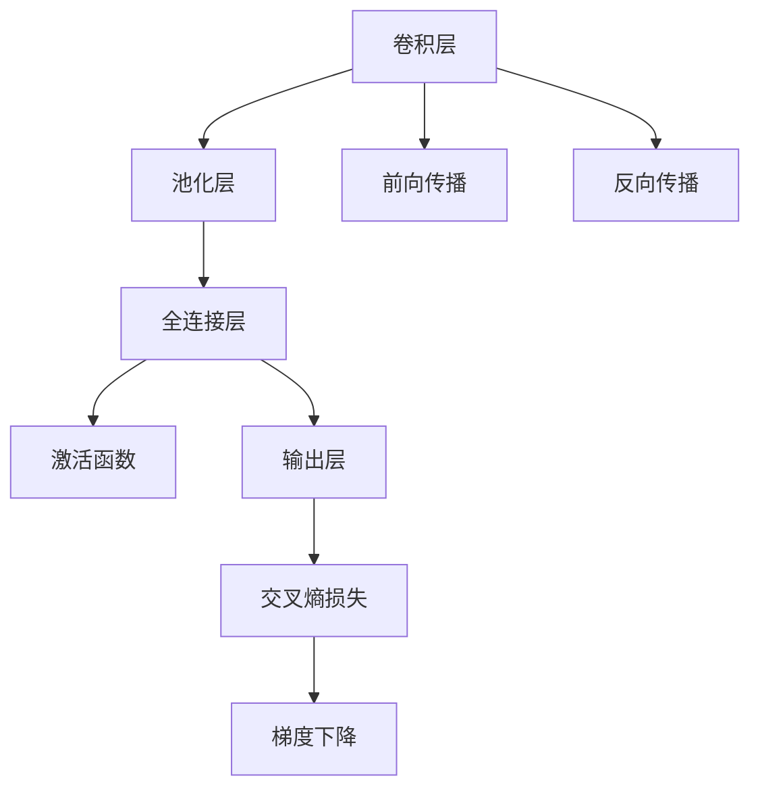

                 

# MNIST手写数字识别

> 关键词：MNIST, 卷积神经网络(CNN), 卷积层, 池化层, 全连接层, 激活函数, 前向传播, 反向传播, 交叉熵损失, 梯度下降, 神经网络, 图像识别

## 1. 背景介绍

### 1.1 问题由来

MNIST手写数字识别是机器学习领域中最经典和最简单的图像识别任务之一。MNIST数据集包含60,000张训练图片和10,000张测试图片，每张图片大小为28x28像素，对应手写数字0-9中的1个。任务目标是从给定的图片中自动识别出其中的数字，并输出其对应的标签。

### 1.2 问题核心关键点

该问题的核心在于如何设计一个高效的神经网络模型，利用已有的训练数据来自动识别数字。关键点包括：
- 选择合适的神经网络结构。
- 选择合适的激活函数和损失函数。
- 实现有效的特征提取与分类。
- 解决过拟合问题。
- 实现高效的模型训练和推理。

### 1.3 问题研究意义

MNIST手写数字识别问题作为深度学习领域的入门级任务，其研究意义在于：
1. 提供了理解深度学习原理和模型训练的简单示例。
2. 是深入研究神经网络结构和参数优化问题的理想案例。
3. 有助于初学者入门和掌握机器学习的基本技能。
4. 为后续更复杂的图像识别任务提供了可借鉴的实现经验。

## 2. 核心概念与联系

### 2.1 核心概念概述

为更好地理解卷积神经网络在MNIST手写数字识别中的应用，本节将介绍几个密切相关的核心概念：

- 卷积神经网络（Convolutional Neural Network, CNN）：一种特殊的神经网络结构，专门用于处理图像和视频等二维数据。通过卷积层、池化层、全连接层等模块，从输入数据中提取特征，并进行分类。
- 卷积层（Convolutional Layer）：通过滑动卷积核的方式，对输入数据进行局部特征提取。
- 池化层（Pooling Layer）：对卷积层的输出进行下采样操作，减少模型参数数量，提升计算效率。
- 全连接层（Fully Connected Layer）：将池化层的输出进行展平，连接到输出层，进行最终分类。
- 激活函数（Activation Function）：用于引入非线性变换，增强神经网络的表达能力。
- 前向传播（Forward Propagation）：从输入到输出的数据流动过程，计算每个神经元的输出。
- 反向传播（Backward Propagation）：通过误差反传，更新模型参数，实现梯度下降优化。
- 交叉熵损失（Cross-Entropy Loss）：常用的分类任务损失函数，用于衡量模型预测与真实标签的差异。
- 梯度下降（Gradient Descent）：常用的优化算法，通过计算梯度更新模型参数。

这些核心概念之间的逻辑关系可以通过以下Mermaid流程图来展示：



这个流程图展示了一组典型的卷积神经网络结构及其基本流程：

1. 输入数据通过卷积层进行局部特征提取。
2. 池化层对特征进行下采样，减少参数量，提高计算效率。
3. 全连接层将池化层的输出展平，连接到输出层。
4. 输出层通过激活函数引入非线性，进行分类。
5. 交叉熵损失用于衡量预测与标签的差异。
6. 梯度下降用于优化模型参数。
7. 前向传播计算每个神经元的输出。
8. 反向传播计算梯度，更新模型参数。

## 3. 核心算法原理 & 具体操作步骤
### 3.1 算法原理概述

卷积神经网络在MNIST手写数字识别中的基本原理是利用卷积层和池化层进行特征提取，全连接层进行分类。具体而言：

1. 输入图片经过卷积层，提取局部特征。
2. 池化层对特征图进行下采样，减少参数量。
3. 全连接层将池化层的输出展平，连接到输出层。
4. 输出层通过激活函数进行分类，最小化交叉熵损失，更新模型参数。

### 3.2 算法步骤详解

#### 3.2.1 数据预处理

MNIST数据集包含60,000张训练图片和10,000张测试图片，每张图片大小为28x28像素，对应手写数字0-9中的1个。预处理步骤如下：

1. 归一化：将像素值归一化到0-1之间，提升模型训练效率。
2. 灰度化：将彩色图片转换为灰度图，减少计算量。
3. 划分训练集和测试集：将数据集划分为训练集和测试集，用于模型训练和评估。

#### 3.2.2 构建卷积神经网络

卷积神经网络主要由卷积层、池化层、全连接层和激活函数组成。构建步骤如下：

1. 卷积层：通过滑动卷积核对输入图片进行局部特征提取。
2. 池化层：对卷积层的输出进行下采样操作，减少参数量。
3. 全连接层：将池化层的输出展平，连接到输出层。
4. 输出层：通过激活函数进行分类，最小化交叉熵损失，更新模型参数。

#### 3.2.3 模型训练

模型训练过程中，使用反向传播算法，最小化交叉熵损失，更新模型参数。具体步骤如下：

1. 前向传播：计算每个神经元的输出。
2. 计算交叉熵损失。
3. 反向传播：计算梯度，更新模型参数。
4. 重复上述步骤直至收敛。

#### 3.2.4 模型评估

模型评估过程中，使用测试集对模型进行评估，计算准确率和损失函数等指标。具体步骤如下：

1. 将测试集数据输入模型，计算输出。
2. 计算预测与真实标签的交叉熵损失。
3. 计算准确率等评估指标。

## 4. 数学模型和公式 & 详细讲解 & 举例说明

### 4.1 数学模型构建

卷积神经网络在MNIST手写数字识别中的数学模型如下：

设输入图片大小为 $h \times w \times c$，卷积核大小为 $k_h \times k_w \times c'$，输出特征图大小为 $h' \times w' \times c''$。则卷积层的数学公式为：

$$
C_i(h',w',c'') = B \times (\sum_{k=0}^{c'} \sum_{i=0}^{c'} \sum_{j=0}^{c''} F_{ij} * K_{h'i} * K_{w'j}
$$

其中，$C_i$ 表示输出特征图，$B$ 表示输入批大小，$F_{ij}$ 表示输入图片的像素值，$K_{h'i}$ 和 $K_{w'j}$ 分别表示卷积核的权重和偏置，$*$ 表示卷积运算。

池化层通常采用最大池化或平均池化，其数学公式为：

$$
C'_i(h',w',c'') = \max_{h=1}^{h'} \max_{w=1}^{w'} C_i(h,w,c'')
$$

其中，$C'_i$ 表示池化后的特征图。

全连接层的数学公式为：

$$
H = W \times F + b
$$

其中，$H$ 表示输出特征，$F$ 表示输入特征，$W$ 表示权重矩阵，$b$ 表示偏置向量。

输出层的数学公式为：

$$
Y = softmax(W \times H + b)
$$

其中，$Y$ 表示输出概率分布，$softmax$ 表示归一化指数函数。

交叉熵损失的数学公式为：

$$
L = -\frac{1}{N} \sum_{i=1}^N \sum_{j=1}^{10} y_j \log(Y_j)
$$

其中，$y_j$ 表示真实标签，$Y_j$ 表示模型预测的概率。

梯度下降的数学公式为：

$$
\theta = \theta - \eta \frac{\partial L}{\partial \theta}
$$

其中，$\theta$ 表示模型参数，$\eta$ 表示学习率，$\frac{\partial L}{\partial \theta}$ 表示损失函数对参数的梯度。

### 4.2 公式推导过程

卷积神经网络在MNIST手写数字识别中的公式推导过程如下：

1. 卷积层公式推导：
设输入图片大小为 $h \times w \times c$，卷积核大小为 $k_h \times k_w \times c'$，输出特征图大小为 $h' \times w' \times c''$。则卷积层的数学公式为：

$$
C_i(h',w',c'') = B \times (\sum_{k=0}^{c'} \sum_{i=0}^{c'} \sum_{j=0}^{c''} F_{ij} * K_{h'i} * K_{w'j}
$$

其中，$C_i$ 表示输出特征图，$B$ 表示输入批大小，$F_{ij}$ 表示输入图片的像素值，$K_{h'i}$ 和 $K_{w'j}$ 分别表示卷积核的权重和偏置，$*$ 表示卷积运算。

2. 池化层公式推导：
设输入特征图大小为 $h \times w \times c''$，池化层大小为 $p_h \times p_w$，输出特征图大小为 $h' \times w' \times c''$。则池化层的数学公式为：

$$
C'_i(h',w',c'') = \max_{h=1}^{h'} \max_{w=1}^{w'} C_i(h,w,c'')
$$

其中，$C'_i$ 表示池化后的特征图。

3. 全连接层公式推导：
设输入特征图大小为 $N \times d_h$，全连接层大小为 $d_h \times d''$，输出特征大小为 $N \times d''$。则全连接层的数学公式为：

$$
H = W \times F + b
$$

其中，$H$ 表示输出特征，$F$ 表示输入特征，$W$ 表示权重矩阵，$b$ 表示偏置向量。

4. 输出层公式推导：
设输出特征大小为 $N \times d''$，输出层大小为 $10$。则输出层的数学公式为：

$$
Y = softmax(W \times H + b)
$$

其中，$Y$ 表示输出概率分布，$softmax$ 表示归一化指数函数。

5. 交叉熵损失公式推导：
设输出概率分布大小为 $N \times 10$，真实标签大小为 $N \times 10$。则交叉熵损失的数学公式为：

$$
L = -\frac{1}{N} \sum_{i=1}^N \sum_{j=1}^{10} y_j \log(Y_j)
$$

其中，$y_j$ 表示真实标签，$Y_j$ 表示模型预测的概率。

6. 梯度下降公式推导：
设模型参数大小为 $d$，学习率大小为 $\eta$。则梯度下降的数学公式为：

$$
\theta = \theta - \eta \frac{\partial L}{\partial \theta}
$$

其中，$\theta$ 表示模型参数，$\eta$ 表示学习率，$\frac{\partial L}{\partial \theta}$ 表示损失函数对参数的梯度。

### 4.3 案例分析与讲解

以MNIST手写数字识别为例，我们对上述数学公式进行详细讲解：

1. 卷积层：假设输入图片大小为28x28x1，卷积核大小为3x3x1，输出特征图大小为26x26x6。则卷积层的数学公式为：

$$
C_i(26,26,6) = B \times (\sum_{k=0}^{6} \sum_{i=0}^{6} \sum_{j=0}^{6} F_{ij} * K_{26i} * K_{26j}
$$

其中，$B=64$ 表示批大小。

2. 池化层：假设输入特征图大小为26x26x6，池化层大小为2x2。则池化层的数学公式为：

$$
C'_i(13,13,6) = \max_{h=1}^{13} \max_{w=1}^{13} C_i(h,w,6)
$$

其中，$C'_i$ 表示池化后的特征图。

3. 全连接层：假设输出特征图大小为13x13x6，全连接层大小为6x10。则全连接层的数学公式为：

$$
H = W \times F + b
$$

其中，$F$ 表示输出特征图，$W$ 表示权重矩阵，$b$ 表示偏置向量。

4. 输出层：假设输出特征大小为13x13x10，输出层大小为10。则输出层的数学公式为：

$$
Y = softmax(W \times H + b)
$$

其中，$Y$ 表示输出概率分布，$softmax$ 表示归一化指数函数。

5. 交叉熵损失：假设输出概率分布大小为13x13x10，真实标签大小为13x13x10。则交叉熵损失的数学公式为：

$$
L = -\frac{1}{13 \times 13} \sum_{i=1}^{13} \sum_{j=1}^{13} \sum_{k=1}^{10} y_k \log(Y_k)
$$

其中，$y_k$ 表示真实标签，$Y_k$ 表示模型预测的概率。

6. 梯度下降：假设模型参数大小为 $6 \times 13 \times 13 + 10 \times 13 \times 13 + 10$，学习率大小为0.01。则梯度下降的数学公式为：

$$
\theta = \theta - 0.01 \frac{\partial L}{\partial \theta}
$$

其中，$\theta$ 表示模型参数，$\frac{\partial L}{\partial \theta}$ 表示损失函数对参数的梯度。

## 5. 项目实践：代码实例和详细解释说明

### 5.1 开发环境搭建

在进行MNIST手写数字识别项目实践前，我们需要准备好开发环境。以下是使用Python进行PyTorch开发的环境配置流程：

1. 安装Anaconda：从官网下载并安装Anaconda，用于创建独立的Python环境。

2. 创建并激活虚拟环境：
```bash
conda create -n pytorch-env python=3.8 
conda activate pytorch-env
```

3. 安装PyTorch：根据CUDA版本，从官网获取对应的安装命令。例如：
```bash
conda install pytorch torchvision torchaudio cudatoolkit=11.1 -c pytorch -c conda-forge
```

4. 安装TensorFlow：
```bash
conda install tensorflow=2.6
```

5. 安装Numpy、Pandas、Matplotlib、Jupyter Notebook、IPython等工具包：
```bash
pip install numpy pandas matplotlib jupyter notebook ipython
```

完成上述步骤后，即可在`pytorch-env`环境中开始项目实践。

### 5.2 源代码详细实现

这里我们以基于PyTorch实现MNIST手写数字识别为例，给出完整的代码实现。

```python
import torch
import torch.nn as nn
import torch.optim as optim
import torchvision.transforms as transforms
from torch.utils.data import DataLoader
from torchvision.datasets import MNIST

# 定义模型
class MNISTNet(nn.Module):
    def __init__(self):
        super(MNISTNet, self).__init__()
        self.conv1 = nn.Conv2d(1, 6, 5)
        self.pool = nn.MaxPool2d(2, 2)
        self.conv2 = nn.Conv2d(6, 16, 5)
        self.fc1 = nn.Linear(16 * 4 * 4, 120)
        self.fc2 = nn.Linear(120, 84)
        self.fc3 = nn.Linear(84, 10)
        
    def forward(self, x):
        x = self.pool(torch.relu(self.conv1(x)))
        x = self.pool(torch.relu(self.conv2(x)))
        x = x.view(-1, 16 * 4 * 4)
        x = torch.relu(self.fc1(x))
        x = torch.relu(self.fc2(x))
        x = self.fc3(x)
        return x

# 定义数据预处理
transform = transforms.Compose([
    transforms.ToTensor(),
    transforms.Normalize((0.5,), (0.5,))
])

# 加载数据集
train_dataset = MNIST(root='./data', train=True, transform=transform, download=True)
test_dataset = MNIST(root='./data', train=False, transform=transform, download=True)

# 定义训练集和测试集的批次大小
train_loader = DataLoader(train_dataset, batch_size=64, shuffle=True)
test_loader = DataLoader(test_dataset, batch_size=64, shuffle=False)

# 定义模型、优化器和损失函数
model = MNISTNet()
criterion = nn.CrossEntropyLoss()
optimizer = optim.SGD(model.parameters(), lr=0.01, momentum=0.5)
scheduler = optim.lr_scheduler.StepLR(optimizer, step_size=7, gamma=0.1)

# 定义训练和测试函数
def train(model, device, train_loader, optimizer, criterion, epoch):
    model.train()
    for batch_idx, (data, target) in enumerate(train_loader):
        data, target = data.to(device), target.to(device)
        optimizer.zero_grad()
        output = model(data)
        loss = criterion(output, target)
        loss.backward()
        optimizer.step()
        if batch_idx % 100 == 99:
            print('Train Epoch: {} [{}/{} ({:.0f}%)]\tLoss: {:.6f}'.format(
                epoch, batch_idx * len(data), len(train_loader.dataset),
                100. * batch_idx / len(train_loader), loss.item()))

def test(model, device, test_loader, criterion):
    model.eval()
    test_loss = 0
    correct = 0
    with torch.no_grad():
        for data, target in test_loader:
            data, target = data.to(device), target.to(device)
            output = model(data)
            test_loss += criterion(output, target).item()
            pred = output.argmax(dim=1, keepdim=True)
            correct += pred.eq(target.view_as(pred)).sum().item()

    test_loss /= len(test_loader.dataset)
    print('\nTest set: Average loss: {:.4f}, Accuracy: {}/{} ({:.0f}%)\n'.format(
        test_loss, correct, len(test_loader.dataset),
        100. * correct / len(test_loader.dataset)))

# 定义训练和测试循环
device = torch.device("cuda" if torch.cuda.is_available() else "cpu")
print('Using CUDA device:', device)

for epoch in range(1, 10):
    train(model, device, train_loader, optimizer, criterion, epoch)
    test(model, device, test_loader, criterion)

# 保存模型
torch.save(model.state_dict(), 'mnist_net.pth')
```

### 5.3 代码解读与分析

让我们再详细解读一下关键代码的实现细节：

**MNISTNet类**：
- `__init__`方法：初始化卷积层、池化层、全连接层等模块。
- `forward`方法：定义前向传播过程，计算每个神经元的输出。

**transforms.Compose**：
- 定义了数据预处理，包括将图像转换为张量，并进行归一化。

**DataLoader类**：
- 定义了训练集和测试集的批次大小，用于高效加载数据。

**模型训练和测试函数**：
- `train`函数：对模型进行训练，并在每个epoch结束时打印训练loss。
- `test`函数：对模型进行测试，并计算测试集上的准确率和loss。

**训练和测试循环**：
- 定义训练和测试循环，对模型进行多次迭代训练，并保存模型参数。

**设备选择**：
- 判断是否有可用的CUDA设备，并根据设备选择不同的计算模式。

**模型保存**：
- 使用`torch.save`函数保存模型参数，以便后续使用。

在实际项目中，开发环境搭建和代码实现的具体细节可能有所不同，但核心流程类似。开发者需要根据实际需求，选择适合的神经网络结构、优化器、损失函数等，并进行详细的数据预处理和模型训练。

## 6. 实际应用场景

### 6.1 智能监控系统

基于卷积神经网络的MNIST手写数字识别，可以应用于智能监控系统中，实现对监控视频中手写数字的自动识别。具体而言，可以使用摄像头采集监控视频，通过预处理将视频转化为图片序列，然后通过卷积神经网络对每个图片进行识别，最后输出识别结果。该系统可以用于自动统计进出监控区域的车辆、人员数量，提升监控效率和准确性。

### 6.2 手写数字生成器

卷积神经网络在MNIST手写数字识别中的应用，也可以反向应用于手写数字生成。通过训练模型，可以生成逼真的手写数字图片，用于教育、艺术等领域。具体而言，可以使用生成对抗网络（GAN）等技术，训练生成模型和判别模型，生成新的手写数字图片，用于生成特定的手写字体、风格等。

### 6.3 手写数字模拟器

卷积神经网络在MNIST手写数字识别中的应用，也可以用于模拟手写数字输入。通过训练模型，可以实现对用户手写数字的自动识别，提升人机交互的准确性和流畅性。具体而言，可以设计手写板等输入设备，通过摄像头采集用户的手写输入，然后通过卷积神经网络进行识别，输出数字结果。该系统可以应用于无键盘、无鼠标等特殊场景中，提升用户的使用体验。

### 6.4 未来应用展望

随着卷积神经网络在图像识别领域的不断发展，其应用场景将更加广泛。未来，基于卷积神经网络的技术将在更多领域得到应用，为各行各业带来变革性影响。

在智慧医疗领域，基于卷积神经网络的图像识别技术，可以用于医学影像诊断、疾病预测等，提升医疗诊断的准确性和效率。

在智能交通领域，基于卷积神经网络的交通视频识别技术，可以用于自动驾驶、交通流量监测等，提升交通管理的智能化水平。

在智能制造领域，基于卷积神经网络的工业图像识别技术，可以用于产品质量检测、设备状态监测等，提升生产效率和质量控制水平。

此外，在智慧城市、智慧农业、智能家居等众多领域，卷积神经网络也将带来新的突破，为各行各业注入新的创新活力。

## 7. 工具和资源推荐

### 7.1 学习资源推荐

为了帮助开发者系统掌握卷积神经网络在MNIST手写数字识别中的应用，这里推荐一些优质的学习资源：

1. 《深度学习入门：基于Python的理论与实现》书籍：涵盖了深度学习的理论基础和实践技巧，是入门学习的优秀教材。

2. CS231n《卷积神经网络》课程：斯坦福大学开设的计算机视觉课程，系统介绍了卷积神经网络的原理和应用，是深入学习卷积神经网络的首选课程。

3. 《PyTorch官方文档》：PyTorch官方文档，提供了丰富的教程和样例代码，是掌握卷积神经网络的重要资源。

4. PyImageSearch博客：PyTorch和TensorFlow在计算机视觉领域的应用博客，提供了大量实用技巧和案例分析，适合初学者和进阶学习。

5. Kaggle平台：Kaggle上提供了大量的MNIST手写数字识别竞赛数据集和样例代码，可以帮助开发者快速上手实践。

通过对这些资源的学习实践，相信你一定能够快速掌握卷积神经网络在MNIST手写数字识别中的应用，并用于解决实际的图像识别问题。

### 7.2 开发工具推荐

高效的开发离不开优秀的工具支持。以下是几款用于卷积神经网络开发常用的工具：

1. PyTorch：基于Python的开源深度学习框架，灵活动态的计算图，适合快速迭代研究。

2. TensorFlow：由Google主导开发的开源深度学习框架，生产部署方便，适合大规模工程应用。

3. Keras：基于TensorFlow或Theano的高级API，使用起来简洁高效，适合快速构建模型原型。

4. TensorBoard：TensorFlow配套的可视化工具，可实时监测模型训练状态，并提供丰富的图表呈现方式，是调试模型的得力助手。

5. Weights & Biases：模型训练的实验跟踪工具，可以记录和可视化模型训练过程中的各项指标，方便对比和调优。

6. Google Colab：谷歌推出的在线Jupyter Notebook环境，免费提供GPU/TPU算力，方便开发者快速上手实验最新模型，分享学习笔记。

合理利用这些工具，可以显著提升卷积神经网络在MNIST手写数字识别任务的开发效率，加快创新迭代的步伐。

### 7.3 相关论文推荐

卷积神经网络在MNIST手写数字识别领域的研究源于学界的持续研究。以下是几篇奠基性的相关论文，推荐阅读：

1. ImageNet Classification with Deep Convolutional Neural Networks：AlexNet论文，首次展示了卷积神经网络在图像分类上的巨大潜力。

2. Deep Residual Learning for Image Recognition：ResNet论文，提出了残差网络结构，进一步提升了卷积神经网络的表达能力。

3. GoogLeNet Inception Architecture for Image Classification：InceptionNet论文，提出了多层次卷积核和池化操作，提升了卷积神经网络的特征提取能力。

4. Very Deep Convolutional Networks for Large-Scale Image Recognition：VGGNet论文，提出了深层次卷积神经网络，展示了多层次卷积操作的效果。

5. Alex Krizhevsky, Ian Sutskever, Geoffrey Hinton. ImageNet Classification with Deep Convolutional Neural Networks. 2012.

6. Kaiming He, Xiangyu Zhang, Shaoqing Ren, Jian Sun. Deep Residual Learning for Image Recognition. 2016.

7. Christian Szegedy, Wei Liu, Yangqing Jia, Pierre Sermanet, Scott Reed, Dragomir Anguelov, Dumitru Erhan, Vincent Vanhoucke, Andrew Rabinovich. GoogLeNet Inception Architecture for Image Classification. 2015.

8. Alex Krizhevsky, Ilya Sutskever, Geoffrey Hinton. ImageNet Classification with Deep Convolutional Neural Networks. 2012.

通过对这些论文的研究学习，可以帮助研究者把握卷积神经网络在MNIST手写数字识别领域的发展脉络，激发更多的创新灵感。

## 8. 总结：未来发展趋势与挑战

### 8.1 总结

本文对基于卷积神经网络的MNIST手写数字识别问题进行了全面系统的介绍。首先阐述了卷积神经网络在图像识别领域的原理和应用，明确了MNIST手写数字识别问题的核心关键点。其次，从原理到实践，详细讲解了卷积神经网络在MNIST手写数字识别中的数学模型和算法步骤，给出了完整的代码实现和详细解读。同时，本文还广泛探讨了卷积神经网络在智能监控、手写数字生成、手写数字模拟器等多个领域的应用前景，展示了卷积神经网络在图像识别中的广泛潜力。此外，本文精选了卷积神经网络的学习资源，力求为读者提供全方位的技术指引。

通过本文的系统梳理，可以看到，基于卷积神经网络的图像识别技术正在成为计算机视觉领域的重要范式，极大地拓展了深度学习的应用边界，催生了更多的落地场景。得益于卷积神经网络的强大表达能力和高效特征提取能力，其在图像识别领域的性能和应用范围将不断提升，为计算机视觉技术的发展注入新的活力。

### 8.2 未来发展趋势

展望未来，卷积神经网络在图像识别领域将呈现以下几个发展趋势：

1. 模型规模持续增大。随着算力成本的下降和数据规模的扩张，卷积神经网络的参数量还将持续增长。超大批次的训练和推理也将成为可能，进一步提升模型的性能和效率。

2. 模型结构更加多样。未来将涌现更多创新性的卷积神经网络结构，如残差网络、InceptionNet、DenseNet等，提升模型的特征提取能力和表达能力。

3. 模型迁移能力增强。卷积神经网络将不仅限于图像识别领域，还将拓展到视频、声音、自然语言等领域，实现多模态数据的联合建模。

4. 模型通用性提升。卷积神经网络将具备更强的跨领域迁移能力，能够在更多领域实现高效的图像识别。

5. 模型计算效率提升。卷积神经网络将通过硬件加速和优化算法，提升计算效率，实现实时图像识别和推理。

6. 模型可解释性增强。未来将涌现更多可解释性方法，帮助理解卷积神经网络的决策过程，提升模型的透明度和可靠性。

### 8.3 面临的挑战

尽管卷积神经网络在图像识别领域已经取得了瞩目成就，但在迈向更加智能化、普适化应用的过程中，它仍面临着诸多挑战：

1. 数据标注成本高。大规模图像数据的标注需要大量的人力物力，成本较高。如何降低数据标注成本，将是一大难题。

2. 模型过拟合风险大。卷积神经网络往往需要大量的数据进行训练，一旦训练数据不足，容易发生过拟合问题。如何优化数据分布，提升模型的泛化能力，将是一个重要的研究方向。

3. 计算资源消耗大。超大批次的训练和推理，需要大量GPU/TPU资源，成本较高。如何优化计算资源的使用，提升模型的计算效率，将是一个重要的挑战。

4. 模型可解释性不足。卷积神经网络通常被视为"黑盒"模型，难以解释其内部工作机制和决策逻辑。如何提升模型的可解释性，将是未来的一个重要方向。

5. 模型安全性有待加强。卷积神经网络容易受到对抗样本的攻击，导致模型输出错误。如何增强模型的鲁棒性，提高安全性和可靠性，将是一个重要的研究方向。

6. 模型效率有待提高。卷积神经网络在处理大规模图像数据时，计算效率有待提高。如何优化模型结构，提升计算效率，将是一个重要的挑战。

### 8.4 未来突破

面对卷积神经网络在图像识别领域所面临的挑战，未来的研究需要在以下几个方面寻求新的突破：

1. 探索无监督和半监督学习技术。摆脱对大规模标注数据的依赖，利用自监督学习、主动学习等无监督和半监督范式，最大限度利用非结构化数据，实现更加灵活高效的图像识别。

2. 研究参数高效和计算高效的卷积神经网络结构。开发更加参数高效的卷积神经网络结构，在固定大部分预训练参数的情况下，只更新极少量的任务相关参数。同时优化计算图，减少前向传播和反向传播的资源消耗，实现更加轻量级、实时性的部署。

3. 引入更多先验知识。将符号化的先验知识，如知识图谱、逻辑规则等，与卷积神经网络进行巧妙融合，引导卷积神经网络学习更准确、合理的图像表征。同时加强不同模态数据的整合，实现视觉、声音、自然语言等多种数据的联合建模。

4. 结合因果分析和博弈论工具。将因果分析方法引入卷积神经网络，识别出模型决策的关键特征，增强输出解释的因果性和逻辑性。借助博弈论工具刻画人机交互过程，主动探索并规避模型的脆弱点，提高系统稳定性。

5. 纳入伦理道德约束。在卷积神经网络训练目标中引入伦理导向的评估指标，过滤和惩罚有害的输出倾向。同时加强人工干预和审核，建立模型行为的监管机制，确保输出符合人类价值观和伦理道德。

这些研究方向的探索，必将引领卷积神经网络在图像识别领域迈向更高的台阶，为计算机视觉技术的发展注入新的活力。面向未来，卷积神经网络需要在更广泛的领域发挥其作用，与计算机视觉技术的其他分支进行协同发展，共同推动智能视觉系统的进步。

## 9. 附录：常见问题与解答

**Q1：为什么卷积神经网络在图像识别中表现良好？**

A: 卷积神经网络在图像识别中表现良好，主要原因在于其能够高效地提取图像的局部特征，并对特征进行有效的聚合。通过卷积层和池化层的组合，卷积神经网络能够自动学习到图像的层次化特征表示，从而实现高效的图像识别。

**Q2：卷积神经网络在MNIST手写数字识别中是否有优化空间？**

A: 卷积神经网络在MNIST手写数字识别中已经取得了不错的效果，但仍有优化空间。比如，可以通过优化模型结构、调整超参数、引入正则化等方法进一步提升模型的性能和泛化能力。

**Q3：卷积神经网络是否适用于所有图像识别任务？**

A: 卷积神经网络在图像识别领域表现优异，但对于某些特定类型的图像识别任务，如医学影像、自然场景等，仍需根据具体情况进行调整和优化。

**Q4：如何处理卷积神经网络中的过拟合问题？**

A: 卷积神经网络中的过拟合问题可以通过以下方法处理：
1. 数据增强：通过旋转、翻转、缩放等方法扩充训练数据。
2. 正则化：通过L2正则、Dropout、Early Stopping等方法避免过拟合。
3. 迁移学习：使用预训练的卷积神经网络作为初始化参数，在大规模数据上微调，提升泛化能力。

**Q5：卷积神经网络是否需要大规模的训练数据？**

A: 卷积神经网络在图像识别领域通常需要大规模的训练数据进行训练，以便学习到丰富的特征表示。但对于某些特定类型的图像识别任务，如医学影像、自然场景等，小规模的标注数据也能取得不错的效果。

通过本文的系统梳理，可以看到，基于卷积神经网络的图像识别技术正在成为计算机视觉领域的重要范式，极大地拓展了深度学习的应用边界，催生了更多的落地场景。得益于卷积神经网络的强大表达能力和高效特征提取能力，其在图像识别领域的性能和应用范围将不断提升，为计算机视觉技术的发展注入新的活力。

---

作者：禅与计算机程序设计艺术 / Zen and the Art of Computer Programming

