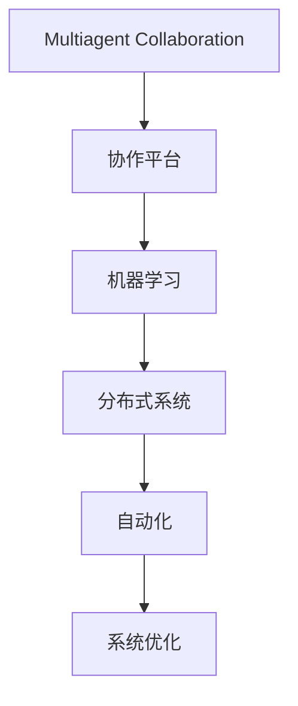

                 

# Multiagent Collaboration驱动角色工作流变革

> 关键词：Multiagent Collaboration, 角色工作流, 协作平台, 机器学习, 分布式系统, 自动化, 系统优化

## 1. 背景介绍

在当今复杂多变的工作环境中，如何更高效、更智能地驱动角色工作流，成为企业持续发展的关键所在。随着技术的进步，特别是人工智能（AI）和机器学习（ML）的飞速发展，一种全新的驱动角色工作流的方式逐渐显现——基于多智能体协作的平台。本文将详细介绍基于Multiagent Collaboration的角色工作流变革，及其对未来工作流程的深远影响。

## 2. 核心概念与联系

### 2.1 核心概念概述

- **Multiagent Collaboration（多智能体协作）**：涉及多个智能体（Agent）之间相互交流、合作和决策的过程。这些智能体可以是人、软件程序，或者是人机混合的实体。

- **角色工作流（Role Workflows）**：基于特定角色（Role）的任务分配和执行流程。每个角色对应一组任务和责任，协作平台需要智能地协调这些角色之间的交互。

- **协作平台（Collaboration Platforms）**：通过算法和模型驱动的多智能体协作，实现角色工作流的自动化和优化。

- **机器学习（Machine Learning, ML）**：使协作平台具备自适应和学习能力，通过数据分析和模型训练优化决策过程。

- **分布式系统（Distributed Systems）**：协作平台通常需要处理大量数据和任务，分布式系统可以提供更好的扩展性和可靠性。

- **自动化（Automation）**：通过机器学习算法和协作平台，实现角色工作流的自动化和智能化。

- **系统优化（System Optimization）**：通过多智能体协作和自动化，提升角色工作流的效率和准确性。

这些概念之间的联系可以通过以下Mermaid流程图来展示：



这个流程图展示了从Multiagent Collaboration到协作平台、机器学习、分布式系统、自动化，最终达到系统优化的完整过程。

## 3. 核心算法原理 & 具体操作步骤

### 3.1 算法原理概述

基于Multiagent Collaboration的角色工作流变革，其核心算法原理可以概括为以下几个步骤：

1. **数据收集与预处理**：从不同来源收集数据，并对数据进行清洗、去重和标准化。
2. **智能体识别与协作模型设计**：识别出所有需要协作的角色，并设计相应的协作模型。
3. **协作策略与学习算法**：根据角色之间的关系和任务特点，选择适合的协作策略和机器学习算法。
4. **角色任务分配与执行**：通过协作平台，将任务自动分配给相应的智能体，并监控执行过程。
5. **反馈与优化**：收集协作过程中的反馈信息，并根据反馈信息调整策略和模型，实现持续优化。

### 3.2 算法步骤详解

#### 3.2.1 数据收集与预处理

协作平台首先需要收集相关的数据。这些数据可以来自不同的来源，如历史任务记录、用户行为数据、环境传感器数据等。数据预处理包括数据清洗、去重、归一化、标注等步骤，确保数据质量。

#### 3.2.2 智能体识别与协作模型设计

智能体识别是将参与协作的角色识别出来。这包括人、软件程序和系统组件。根据任务的复杂度和角色之间的关系，设计相应的协作模型，如集中式、分布式、中心-边缘式等。

#### 3.2.3 协作策略与学习算法

根据协作模型和任务特点，选择合适的协作策略和机器学习算法。例如，可以使用强化学习（Reinforcement Learning, RL）优化协作策略，使用深度学习（Deep Learning, DL）优化决策模型。

#### 3.2.4 角色任务分配与执行

通过协作平台，将任务自动分配给相应的智能体，并监控执行过程。确保任务按时完成，并根据实际情况调整任务分配。

#### 3.2.5 反馈与优化

收集协作过程中的反馈信息，如任务完成时间、错误率、资源利用率等，并根据反馈信息调整策略和模型，实现持续优化。

### 3.3 算法优缺点

**优点**：

- **高效协作**：通过多智能体协作，实现高效的任务分配和执行。
- **自动化**：自动化角色工作流的管理和优化，减少人为干预。
- **自适应性**：机器学习算法使协作平台具备自适应能力，能够根据环境和任务变化进行调整。

**缺点**：

- **复杂性高**：设计和维护协作平台需要较高的技术门槛。
- **依赖数据质量**：数据质量直接影响协作效果，数据收集和预处理需要大量时间和资源。
- **模型局限性**：当前机器学习模型可能无法完全模拟现实世界的复杂性和不确定性。

### 3.4 算法应用领域

基于Multiagent Collaboration的角色工作流变革，已经在多个领域得到应用，如：

- **制造业**：通过协作平台优化生产线的任务分配和执行。
- **金融服务**：通过多智能体协作提升交易和风险管理的效率。
- **医疗健康**：通过协作平台协调医生、护士和患者之间的互动。
- **零售业**：通过协作平台优化供应链管理和客户服务。
- **城市管理**：通过协作平台优化交通、环境和公共服务。

## 4. 数学模型和公式 & 详细讲解 & 举例说明

### 4.1 数学模型构建

设有一个由 $n$ 个智能体组成的系统，每个智能体 $i$ 的任务为 $T_i$，协作平台的目标是最大化整体任务的完成效率 $E$。

可以定义一个效用函数 $U_i$ 描述智能体 $i$ 的任务完成情况，并定义一个协作效率函数 $C$ 描述整个系统的协作效果。则协作平台的目标可以表示为：

$$ \max_{T_i} \sum_{i=1}^n U_i(T_i) \text{ s.t. } E(T_1, \cdots, T_n) = \max C(T_1, \cdots, T_n) $$

### 4.2 公式推导过程

在优化过程中，需要考虑多种约束条件，如资源限制、时间限制、质量要求等。假设资源限制为 $R_i$，时间限制为 $T_i$，质量要求为 $Q_i$，则约束条件可以表示为：

$$ \sum_{i=1}^n R_i \leq R_{\text{total}} $$
$$ \sum_{i=1}^n T_i \leq T_{\text{total}} $$
$$ \sum_{i=1}^n Q_i \leq Q_{\text{total}} $$

其中，$R_{\text{total}}$、$T_{\text{total}}$、$Q_{\text{total}}$ 分别表示系统的总资源、总时间和总质量要求。

在求解优化问题时，可以采用分布式优化算法，如分布式协调算法（Distributed Coordination Algorithm, DCA）。DCA 是一种分散式的优化方法，每个智能体独立进行优化，并定期交换优化结果，从而实现整体优化。

### 4.3 案例分析与讲解

假设在一个制造工厂中，有多个机器人（智能体）和多个任务（如搬运、焊接、检测）需要协作完成。每个机器人都有固定的资源（如电力、加工时间）和任务要求（如准确性）。协作平台需要根据任务要求和资源限制，分配任务给机器人，并实时监控执行情况。

## 5. 项目实践：代码实例和详细解释说明

### 5.1 开发环境搭建

为了实践基于Multiagent Collaboration的角色工作流，需要搭建一个适合的环境。以下是搭建环境的步骤：

1. 安装Python和必要的库，如NumPy、Pandas、Scikit-learn等。
2. 选择适合的分布式计算框架，如Apache Spark、Apache Flink等。
3. 安装相应的协作平台软件，如Swarm、Odyssey等。
4. 准备所需的数据集，并进行预处理。

### 5.2 源代码详细实现

以下是基于Python和Spark的协作平台代码实现，重点展示任务分配和优化过程：

```python
from pyspark import SparkContext, SparkConf
from pyspark.mllib.recommendation import ALS

# 创建Spark上下文
conf = SparkConf().setAppName("Collaboration Platform")
sc = SparkContext(conf=conf)

# 准备数据集
data = sc.textFile("data.txt")

# 数据预处理
data_cleaned = data.map(lambda x: x.split(",")).filter(lambda x: len(x) == 5).map(lambda x: (x[0], x[1], float(x[2]), float(x[3]), float(x[4])))

# 定义协作模型
class CollaborationModel:
    def __init__(self, num_clusters, num_iterations):
        self.num_clusters = num_clusters
        self.num_iterations = num_iterations
        
    def train(self, data):
        # 构建协作策略和机器学习模型
        model = ALS.train(data, self.num_clusters, self.num_iterations)
        return model
        
    def predict(self, model, item):
        # 预测任务分配给每个智能体的概率
        preds = model.predictAll(item)
        return preds
    
    def optimize(self, data):
        # 优化任务分配
        model = self.train(data)
        preds = self.predict(model, data)
        # 根据预测结果调整任务分配
        return preds

# 训练协作模型
collaboration_model = CollaborationModel(5, 10)
model = collaboration_model.train(data_cleaned)

# 优化任务分配
preds = collaboration_model.optimize(data_cleaned)

# 打印预测结果
print(preds)
```

### 5.3 代码解读与分析

**Spark上下文创建**：

```python
from pyspark import SparkContext, SparkConf

conf = SparkConf().setAppName("Collaboration Platform")
sc = SparkContext(conf=conf)
```

创建Spark上下文，并设置应用名称。

**数据预处理**：

```python
data = sc.textFile("data.txt")
data_cleaned = data.map(lambda x: x.split(",")).filter(lambda x: len(x) == 5).map(lambda x: (x[0], x[1], float(x[2]), float(x[3]), float(x[4])))
```

从文件中读取数据，并进行清洗、去重和标准化。

**协作模型训练**：

```python
class CollaborationModel:
    def __init__(self, num_clusters, num_iterations):
        self.num_clusters = num_clusters
        self.num_iterations = num_iterations
        
    def train(self, data):
        model = ALS.train(data, self.num_clusters, self.num_iterations)
        return model
        
    def predict(self, model, item):
        preds = model.predictAll(item)
        return preds
    
    def optimize(self, data):
        model = self.train(data)
        preds = self.predict(model, data)
        return preds
```

定义协作模型，包括训练和预测两个主要步骤。

**模型训练和优化**：

```python
collaboration_model = CollaborationModel(5, 10)
model = collaboration_model.train(data_cleaned)
preds = collaboration_model.optimize(data_cleaned)
print(preds)
```

训练协作模型，并进行任务分配优化。

## 6. 实际应用场景

### 6.1 制造业

在制造业中，通过协作平台可以实现设备的自动调度和任务分配。例如，一个生产线上的多个机器人需要协作完成组装任务。协作平台可以根据机器人的性能和任务需求，智能地分配任务，并实时监控执行情况，确保任务按时完成。

### 6.2 金融服务

金融服务行业需要处理大量交易和风险数据。协作平台可以将交易和风险管理任务分配给多个智能体，如交易员、风险分析师等，通过实时协作和决策支持，提高交易和风险管理的效率。

### 6.3 医疗健康

医疗健康行业需要协调医生、护士和患者之间的互动。协作平台可以根据患者的病情和医生的专业知识，智能地分配任务，并实时监控执行情况，确保医疗服务的质量和效率。

### 6.4 零售业

零售业需要优化供应链管理和客户服务。协作平台可以将订单处理、库存管理和客户服务任务分配给多个智能体，通过实时协作和决策支持，提高供应链的响应速度和客户满意度。

### 6.5 城市管理

城市管理需要协调交通、环境和公共服务。协作平台可以将交通管制、环境监测和公共服务任务分配给多个智能体，通过实时协作和决策支持，提高城市管理的效率和质量。

## 7. 工具和资源推荐

### 7.1 学习资源推荐

为了深入理解基于Multiagent Collaboration的角色工作流变革，推荐以下学习资源：

1. 《多智能体系统》（Multi-agent Systems）系列书籍：深入介绍多智能体协作的理论基础和实际应用。
2. 《机器学习实战》（Hands-On Machine Learning with Scikit-Learn and TensorFlow）：介绍机器学习的基本概念和实践技巧。
3. 《分布式系统原理与设计》（Distributed Systems: Concepts and Design）：介绍分布式系统的原理和设计方法。
4. 《人工智能：一种现代方法》（Artificial Intelligence: A Modern Approach）：介绍人工智能的基本概念和前沿技术。
5. 《Python网络编程》（Python Network Programming）：介绍Python网络编程的基础知识和高级技巧。

### 7.2 开发工具推荐

为了实现基于Multiagent Collaboration的角色工作流变革，推荐以下开发工具：

1. Python：Python是协作平台开发的首选语言，具有简洁、易学和功能强大的特点。
2. Apache Spark：一个高效的分布式计算框架，支持大规模数据处理和机器学习任务。
3. Odyssey：一个开源的协作平台，支持多智能体协作和任务分配。
4. PyTorch：一个开源的深度学习框架，支持高效的模型训练和优化。
5. TensorFlow：一个开源的机器学习框架，支持高效的模型训练和分布式计算。

### 7.3 相关论文推荐

以下是几篇奠基性的相关论文，推荐阅读：

1. "A Multi-Agent System Approach for Workflow Management" - 该论文提出了一种基于多智能体的工作流管理系统，提高了工作效率和管理效果。
2. "Adaptive Multi-Agent Collaboration for Workflow Optimization" - 该论文研究了如何通过多智能体协作优化工作流，提出了一些有效的优化算法。
3. "Multi-Agent Collaboration in Manufacturing" - 该论文介绍了在制造业中如何通过协作平台优化任务分配和执行。
4. "A Survey on Multi-Agent Collaboration in Financial Services" - 该论文综述了多智能体协作在金融服务中的应用，探讨了相关的挑战和解决方案。
5. "Machine Learning and Multi-Agent Systems for Healthcare Collaboration" - 该论文探讨了在医疗健康领域如何通过协作平台优化协作流程，提高医疗服务的效率和质量。

## 8. 总结：未来发展趋势与挑战

### 8.1 总结

本文详细介绍了基于Multiagent Collaboration的角色工作流变革，展示了其核心算法原理、具体操作步骤以及优缺点。通过分析多个实际应用场景，揭示了该技术在未来工作流管理中的巨大潜力。

### 8.2 未来发展趋势

未来基于Multiagent Collaboration的角色工作流变革将呈现以下几个发展趋势：

1. **智能化提升**：随着机器学习和深度学习技术的发展，协作平台将变得更加智能，能够根据实时数据自动调整任务分配和执行策略。
2. **跨领域应用**：协作平台将逐步扩展到更多领域，如教育、政府、能源等，实现更广泛的应用。
3. **安全性提升**：协作平台将采用更多安全措施，如数据加密、访问控制等，确保数据和协作过程的安全性。
4. **交互性增强**：协作平台将采用更先进的交互技术，如自然语言处理、语音识别等，提升用户体验和交互效果。
5. **自动化优化**：协作平台将更加自动化，能够自动检测和修复协作过程中的问题，减少人为干预。

### 8.3 面临的挑战

尽管基于Multiagent Collaboration的角色工作流变革带来了诸多好处，但仍面临以下挑战：

1. **数据隐私和安全**：协作平台需要处理大量敏感数据，如何保护数据隐私和安全是关键挑战。
2. **系统复杂性**：协作平台需要协调多个智能体，系统设计和维护需要高技术门槛。
3. **算法瓶颈**：现有的协作算法和模型可能无法完全满足复杂多变的环境需求。
4. **计算资源消耗**：大规模协作任务需要大量计算资源，如何高效利用计算资源是重要问题。
5. **人机交互**：协作平台需要实现人机自然的交互，提高用户的使用体验。

### 8.4 研究展望

未来的研究需要重点关注以下几个方面：

1. **分布式协作算法**：研究更高效的分布式协作算法，提高系统扩展性和鲁棒性。
2. **数据驱动优化**：研究更多基于数据驱动的优化方法，提高系统的自适应能力。
3. **跨领域协作**：研究跨领域协作的模型和算法，提升协作平台的通用性和可扩展性。
4. **人机交互设计**：研究更自然、更高效的人机交互方法，提升用户体验。
5. **数据隐私保护**：研究更多数据隐私保护方法，确保数据安全。

## 9. 附录：常见问题与解答

**Q1: 什么是基于Multiagent Collaboration的角色工作流？**

A: 基于Multiagent Collaboration的角色工作流是一种通过多智能体协作驱动任务分配和执行的工作流管理方式。每个智能体（如人、软件程序等）都有特定的任务和责任，协作平台根据任务需求和资源限制，智能地协调这些智能体之间的协作。

**Q2: 为什么需要基于Multiagent Collaboration的角色工作流？**

A: 传统的工作流管理方式需要大量的人工干预和手动调整，效率低下。基于Multiagent Collaboration的角色工作流可以自动化任务分配和执行，提高工作效率和质量。同时，协作平台能够根据环境和任务变化自动调整策略，提升系统的自适应能力。

**Q3: 基于Multiagent Collaboration的角色工作流有哪些应用？**

A: 基于Multiagent Collaboration的角色工作流已经在多个领域得到应用，如制造业、金融服务、医疗健康、零售业和城市管理等。这些应用展示了协作平台在提高效率、优化资源和改善服务质量方面的巨大潜力。

**Q4: 如何实现基于Multiagent Collaboration的角色工作流？**

A: 实现基于Multiagent Collaboration的角色工作流需要以下几个步骤：数据收集与预处理、智能体识别与协作模型设计、协作策略与学习算法、角色任务分配与执行、反馈与优化。

**Q5: 基于Multiagent Collaboration的角色工作流有哪些优势和劣势？**

A: 优势包括高效协作、自动化、自适应性等。劣势包括系统复杂性高、数据质量依赖、模型局限性等。

**Q6: 基于Multiagent Collaboration的角色工作流未来的发展趋势是什么？**

A: 未来的发展趋势包括智能化提升、跨领域应用、安全性提升、交互性增强、自动化优化等。

**Q7: 基于Multiagent Collaboration的角色工作流面临哪些挑战？**

A: 主要挑战包括数据隐私和安全、系统复杂性、算法瓶颈、计算资源消耗、人机交互等。

**Q8: 如何克服基于Multiagent Collaboration的角色工作流面临的挑战？**

A: 需要重点关注分布式协作算法、数据驱动优化、跨领域协作、人机交互设计、数据隐私保护等方面，以克服当前面临的挑战。

---

作者：禅与计算机程序设计艺术 / Zen and the Art of Computer Programming

