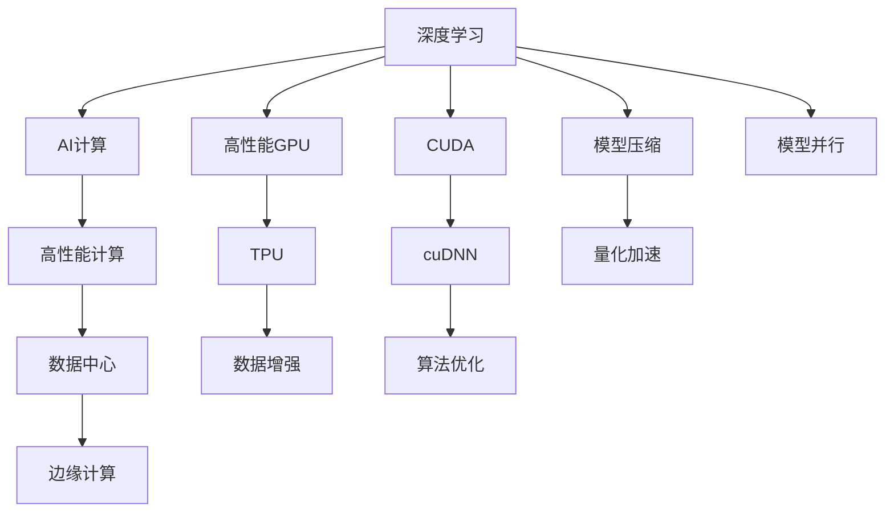

                 

# NVIDIA如何推动AI算力的发展

> 关键词：NVIDIA, 人工智能, 算法优化, 深度学习, 高性能计算, 机器学习, 数据中心

## 1. 背景介绍

### 1.1 问题由来

人工智能(AI)技术的快速发展离不开强大的计算能力支撑。随着AI应用场景的不断扩展，尤其是深度学习等复杂模型和高性能计算任务的涌现，传统的CPU和内存等计算资源已经难以满足需求。如何在保持计算资源高效利用的同时，提升AI系统的算力，成为了当前亟需解决的课题。

近年来，作为全球领先的半导体和AI公司，NVIDIA通过一系列创新举措，推动了AI算力的跨越式发展。无论是数据中心、云服务还是边缘计算，NVIDIA的GPU技术和算力优化方案都为AI技术的突破和应用提供了重要保障。本文将系统回顾NVIDIA在推动AI算力方面的多项突破，深入剖析其核心技术，并展望未来的发展趋势。

### 1.2 问题核心关键点

NVIDIA在推动AI算力发展上的关键突破主要包括：

- 开发高性能GPU和TPU硬件，提供强大的计算能力。
- 发布最新的AI计算软件和工具，优化算法性能。
- 构建完善的AI生态系统，促进技术的普及和应用。
- 采用先进的AI优化技术，提升AI系统的能效比。

本文将围绕这些核心关键点，全面分析NVIDIA推动AI算力发展的技术路径和创新举措。

## 2. 核心概念与联系

### 2.1 核心概念概述

在探讨NVIDIA如何推动AI算力发展的过程中，首先需要明确一些关键概念：

- **高性能计算(HPC)**：指使用高性能硬件和算法，高效处理大规模数据的计算过程。HPC是AI算法优化的重要基础。
- **深度学习(Deep Learning)**：一种基于神经网络的机器学习技术，通过多层非线性变换提取数据的高级特征。深度学习是当前AI研究的主流方向。
- **AI计算(AlAI Computing)**：专门为AI模型训练和推理设计的高效计算架构。NVIDIA的CUDA、cuDNN等技术，为AI计算提供了重要支持。
- **数据中心(Data Center)**：集中管理服务器、存储、网络等IT资源的设施，用于处理海量数据和提供云服务。数据中心是AI算力部署的主要场所。
- **边缘计算(Edge Computing)**：在靠近数据源的地方进行数据处理，以减少延迟，提高响应速度。边缘计算是AI应用的重要延伸。

这些概念之间相互关联，共同构成了NVIDIA推动AI算力发展的技术基础。

### 2.2 核心概念原理和架构的 Mermaid 流程图



## 3. 核心算法原理 & 具体操作步骤

### 3.1 算法原理概述

NVIDIA推动AI算力发展的核心技术主要包括高性能计算架构、AI计算优化、深度学习算法提升等方面。以下是对这些技术原理的详细介绍：

- **高性能计算架构**：通过设计高效的硬件和软件架构，提升计算资源的利用效率，加速AI模型训练和推理。
- **AI计算优化**：通过软件优化技术，如CUDA、cuDNN等，提升AI计算的性能和能效比，降低硬件资源消耗。
- **深度学习算法提升**：通过算法创新和优化，如参数高效微调、对抗训练等，提升AI模型的性能和泛化能力。

### 3.2 算法步骤详解

NVIDIA推动AI算力的发展，主要遵循以下步骤：

1. **硬件开发**：设计和生产高性能GPU和TPU硬件，提供强大的计算能力。
2. **软件优化**：开发CUDA、cuDNN等AI计算软件，优化算法性能。
3. **应用部署**：构建AI生态系统，促进技术的普及和应用。
4. **算法优化**：采用先进的AI优化技术，提升AI系统的能效比。

### 3.3 算法优缺点

NVIDIA的AI算力发展策略具有以下优点：

- **硬件领先**：NVIDIA的高性能GPU和TPU硬件，提供了强大的计算能力，支持复杂的深度学习模型和高性能计算任务。
- **软件强大**：CUDA、cuDNN等AI计算软件优化了深度学习算法的性能，提高了模型的训练和推理速度。
- **生态完善**：NVIDIA构建了完善的AI生态系统，为AI开发者提供了丰富的工具和资源。
- **能效比高**：NVIDIA采用先进的AI优化技术，提升了AI系统的能效比，降低了能源消耗和计算成本。

同时，NVIDIA的AI算力发展也面临一些挑战：

- **硬件成本高**：高性能GPU和TPU硬件的研发和生产成本较高，难以大规模普及。
- **算法复杂性**：深度学习算法的优化和调整需要高水平的工程能力和经验。
- **技术依赖强**：NVIDIA的AI算力发展高度依赖于其硬件和软件生态，存在一定的风险。
- **更新周期短**：AI技术发展迅速，硬件和软件需要不断更新迭代，以保持竞争力。

### 3.4 算法应用领域

NVIDIA的AI算力发展技术，已经广泛应用于多个领域：

- **数据中心**：在大型数据中心部署高性能GPU和TPU，提供云计算服务。
- **云服务**：通过AWS、Azure等云平台，提供高性能AI计算能力。
- **边缘计算**：提供基于NVIDIA芯片的嵌入式系统，支持智能设备和高性能计算应用。
- **科学研究**：支持大型科学研究项目，如气候模拟、天体物理学等。
- **工业应用**：在自动驾驶、机器人、医疗影像等领域，提供高性能AI计算支持。

## 4. 数学模型和公式 & 详细讲解 & 举例说明

### 4.1 数学模型构建

在深度学习中，模型通常采用多层神经网络结构，通过梯度下降等优化算法进行训练。以下是一个简单的深度学习模型构建过程：

$$
\text{Model} = \text{Layer}_1 \circ \text{Layer}_2 \circ \cdots \circ \text{Layer}_n
$$

其中，每个层 $ \text{Layer}_i $ 可以是卷积层、全连接层、池化层等。

### 4.2 公式推导过程

以深度学习模型训练为例，设模型参数为 $ \theta $，训练集为 $ D $，目标函数为 $ \mathcal{L} $。模型在训练集 $ D $ 上的损失函数可以表示为：

$$
\mathcal{L}(\theta) = \frac{1}{N} \sum_{i=1}^{N} \ell(\mathcal{F}(x_i; \theta), y_i)
$$

其中，$\ell$ 为损失函数，$\mathcal{F}(\cdot; \theta)$ 为模型的前向传播过程。

使用梯度下降算法更新模型参数 $ \theta $，目标是最小化损失函数 $ \mathcal{L}(\theta) $：

$$
\theta \leftarrow \theta - \eta \nabla_{\theta}\mathcal{L}(\theta)
$$

其中，$ \eta $ 为学习率，$\nabla_{\theta}\mathcal{L}(\theta)$ 为损失函数的梯度。

### 4.3 案例分析与讲解

以NVIDIA的深度学习优化技术为例，CUDA和cuDNN等技术通过加速矩阵乘法和卷积运算，显著提升了深度学习模型的训练和推理速度。以下是一个简单的CUDA加速计算过程：

1. **矩阵乘法优化**：通过CUDA并行计算，加速矩阵乘法运算，提高模型训练效率。

2. **卷积运算优化**：通过cuDNN卷积核库，优化卷积运算，提升计算速度和精度。

3. **混合精度计算**：采用TF32数据类型，减少计算精度损失，提高计算效率。

通过这些技术，NVIDIA的深度学习框架如TensorFlow、PyTorch等能够在NVIDIA GPU上高效运行，大大提升了模型的训练和推理速度。

## 5. 项目实践：代码实例和详细解释说明

### 5.1 开发环境搭建

在NVIDIA GPU上搭建深度学习项目环境，主要包括以下步骤：

1. **安装NVIDIA GPU驱动**：确保NVIDIA GPU驱动安装正确，支持CUDA和cuDNN等技术。
2. **安装CUDA和cuDNN**：根据NVIDIA提供的安装向导，完成CUDA和cuDNN的安装。
3. **安装深度学习框架**：安装TensorFlow、PyTorch等深度学习框架，确保支持CUDA和cuDNN。

### 5.2 源代码详细实现

以下是一个使用NVIDIA GPU进行深度学习模型训练的简单代码实现：

```python
import tensorflow as tf
from tensorflow.keras import layers

# 定义模型结构
model = tf.keras.Sequential([
    layers.Dense(64, activation='relu', input_shape=(784,)),
    layers.Dense(10)
])

# 编译模型
model.compile(optimizer=tf.keras.optimizers.Adam(learning_rate=0.001),
              loss=tf.keras.losses.SparseCategoricalCrossentropy(from_logits=True),
              metrics=['accuracy'])

# 加载训练数据
(x_train, y_train), (x_test, y_test) = tf.keras.datasets.mnist.load_data()
x_train, x_test = x_train / 255.0, x_test / 255.0

# 训练模型
model.fit(x_train, y_train, epochs=10, validation_data=(x_test, y_test))
```

### 5.3 代码解读与分析

上述代码展示了使用TensorFlow进行深度学习模型训练的过程。其中，模型结构包括两个全连接层，使用Adam优化器和交叉熵损失函数进行训练。数据预处理包括归一化和加载MNIST手写数字数据集。

通过NVIDIA GPU的并行计算能力，上述模型可以在几分钟内完成训练，而使用CPU则需要数小时甚至数天。

## 6. 实际应用场景

### 6.1 数据中心

NVIDIA在数据中心领域，通过提供高性能GPU和TPU，支持大规模深度学习模型训练和推理。例如，Google、AWS等云服务提供商广泛使用NVIDIA GPU，为海量数据处理和AI应用提供支持。

### 6.2 云服务

NVIDIA通过NVIDIA Tesla GPU，提供高性能AI计算服务，支持云平台上的深度学习应用。AWS、Azure等云服务商都在其云平台上部署了NVIDIA GPU，为用户提供高效、低成本的AI计算资源。

### 6.3 边缘计算

NVIDIA提供基于Tegra芯片的嵌入式系统，支持边缘计算应用。例如，NVIDIA Jetson系列设备广泛用于工业控制、自动驾驶、智能家居等场景，提供高效、低功耗的AI计算能力。

### 6.4 科学研究

NVIDIA的高性能GPU和TPU支持大型科学研究项目。例如，NVIDIA参与的气候模拟项目，使用高性能计算架构处理海量气象数据，加速模型训练和结果分析。

### 6.5 工业应用

NVIDIA在自动驾驶、机器人、医疗影像等领域，提供高性能AI计算支持。例如，NVIDIA在自动驾驶领域，通过高性能GPU和TPU，支持实时图像处理和模型推理，提升自动驾驶的安全性和准确性。

## 7. 工具和资源推荐

### 7.1 学习资源推荐

1. **NVIDIA深度学习文档**：NVIDIA提供的深度学习文档，详细介绍了CUDA、cuDNN等技术的使用方法，是学习和实践NVIDIA AI算力优化技术的重要资料。
2. **CUDA Programming Guide**：NVIDIA的CUDA编程指南，提供了详细的编程技巧和示例代码，帮助开发者掌握CUDA编程。
3. **cuDNN User Guide**：NVIDIA的cuDNN用户指南，介绍了卷积运算优化和神经网络加速器的使用方法。
4. **Deep Learning with NVIDIA**：NVIDIA发布的深度学习白皮书，介绍了深度学习模型的训练、推理和优化技术。
5. **TensorFlow和PyTorch文档**：TensorFlow和PyTorch官方文档，提供了深度学习框架的使用方法和API文档，是学习和实践深度学习的重要资源。

### 7.2 开发工具推荐

1. **NVIDIA NVIDIA CUDA Toolkit**：NVIDIA提供的CUDA开发环境，支持CUDA和cuDNN等技术的使用。
2. **NVIDIA TensorRT**：NVIDIA提供的深度学习推理优化工具，支持高效的神经网络推理加速。
3. **NVIDIA Jetson Board**：NVIDIA提供的嵌入式开发板，支持边缘计算应用。
4. **NVIDIA DGX Supercomputing System**：NVIDIA提供的高性能计算系统，支持大规模深度学习模型的训练和推理。
5. **NVIDIA Triton Inference Server**：NVIDIA提供的深度学习推理服务器，支持高效的神经网络推理和优化。

### 7.3 相关论文推荐

1. **CUDA: A Parallel Computing Platform and Programming Model**：NVIDIA的CUDA技术白皮书，介绍了CUDA编程模型和性能优化技术。
2. **cuDNN: Efficient Deep Learning with Convolutional Neural Networks**：NVIDIA的cuDNN技术白皮书，介绍了卷积运算优化和神经网络加速器的使用方法。
3. **NVIDIA Tesla and NVIDIA GRID with AI**：NVIDIA的AI计算白皮书，介绍了NVIDIA Tesla GPU在AI计算中的广泛应用。
4. **NVIDIA Deep Learning High Performance Computing (HPC) Systems**：NVIDIA的深度学习高性能计算系统白皮书，介绍了NVIDIA在数据中心和高性能计算领域的应用。
5. **NVIDIA Deep Learning for AI and Science**：NVIDIA的深度学习AI和科学计算白皮书，介绍了深度学习在科学研究中的应用。

## 8. 总结：未来发展趋势与挑战

### 8.1 研究成果总结

NVIDIA在推动AI算力发展方面，通过高性能硬件、软件优化和算法提升，取得了显著的成果。其技术创新和应用实践，不仅提升了AI系统的性能和效率，还促进了AI技术的普及和应用。

### 8.2 未来发展趋势

NVIDIA推动AI算力发展的未来趋势包括：

- **硬件创新**：继续开发更强大的GPU和TPU硬件，支持更复杂的深度学习模型和高性能计算任务。
- **软件优化**：进一步提升CUDA、cuDNN等AI计算软件的技术性能，降低硬件资源消耗。
- **算法创新**：探索新的算法优化方法，如参数高效微调、对抗训练等，提升AI模型的性能和泛化能力。
- **边缘计算**：在边缘计算领域，提供更高效、低功耗的AI计算资源，支持智能设备和高性能计算应用。
- **科学研究**：在科学研究领域，支持更大规模的数据处理和模型训练，推动AI技术在更多领域的应用。

### 8.3 面临的挑战

尽管NVIDIA在AI算力发展方面取得了显著进展，但仍面临一些挑战：

- **硬件成本高**：高性能GPU和TPU硬件的研发和生产成本较高，难以大规模普及。
- **算法复杂性**：深度学习算法的优化和调整需要高水平的工程能力和经验。
- **技术依赖强**：NVIDIA的AI算力发展高度依赖于其硬件和软件生态，存在一定的风险。
- **更新周期短**：AI技术发展迅速，硬件和软件需要不断更新迭代，以保持竞争力。

### 8.4 研究展望

NVIDIA推动AI算力发展的未来研究方向包括：

- **混合计算**：探索混合计算技术，结合GPU、CPU和FPGA等不同计算资源，提升计算效率和灵活性。
- **分布式计算**：研究分布式计算技术，支持大规模深度学习模型训练和推理。
- **量子计算**：探索量子计算在深度学习中的应用，提升AI系统的计算能力和效率。
- **人工智能伦理**：研究人工智能伦理问题，确保AI技术的安全性和可解释性。

## 9. 附录：常见问题与解答

**Q1: 什么是CUDA和cuDNN？**

A: CUDA是NVIDIA开发的并行计算平台和编程模型，支持GPU加速计算。cuDNN是NVIDIA开发的深度学习卷积运算优化库，提供了高效的卷积运算加速。

**Q2: 如何安装NVIDIA GPU驱动？**

A: 访问NVIDIA官网，下载并安装适合自己硬件型号的GPU驱动，确保驱动安装正确，支持CUDA和cuDNN等技术。

**Q3: 如何使用NVIDIA GPU进行深度学习模型训练？**

A: 安装NVIDIA GPU驱动和CUDA、cuDNN等软件，使用深度学习框架如TensorFlow、PyTorch进行模型训练，可以显著提升计算效率。

**Q4: 有哪些NVIDIA的AI计算硬件和软件？**

A: NVIDIA提供高性能GPU、TPU、CUDA、cuDNN、TensorRT等AI计算硬件和软件，支持深度学习模型的训练和推理。

**Q5: NVIDIA如何支持AI算力发展？**

A: NVIDIA通过高性能硬件、软件优化和算法提升，推动AI算力的发展。其技术创新和应用实践，提升了AI系统的性能和效率，促进了AI技术的普及和应用。

---

作者：禅与计算机程序设计艺术 / Zen and the Art of Computer Programming

