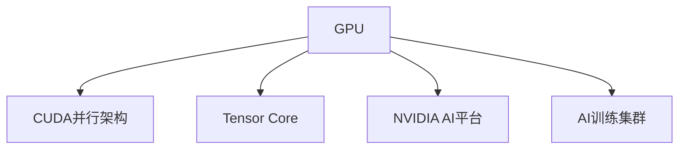

                 

# NVIDIA如何改变了AI算力格局

## 1. 背景介绍

随着人工智能(AI)技术的飞速发展，AI算力已经成为推动AI应用落地的关键因素。过去十年中，算力的提升主要得益于GPU（图形处理器）的突破，使得深度学习模型的训练和推理效率大幅提升。然而，随着模型复杂度的不断增加，传统的GPU架构已难以满足大模型高并行度的计算需求。

在此背景下，NVIDIA凭借其创新的CUDA并行架构和深度学习优化技术，逐步奠定了其在AI算力领域的领导地位。其GPU产品，如GeForce、Quadro、Tesla等系列，已经成为业界训练和推理AI模型的首选平台。

## 2. 核心概念与联系

### 2.1 核心概念概述

为更好地理解NVIDIA如何改变AI算力格局，本节将介绍几个核心概念：

- **CUDA并行架构**：NVIDIA开发的并行计算架构，使得GPU能够在单个芯片上并行处理大量数据，极大地提高了数据处理效率。
- **Tensor Core**：NVIDIA GPU专用于矩阵运算的硬件加速单元，使得深度学习模型的训练和推理速度大大提升。
- **NVIDIA AI平台**：包括硬件加速器（如GPU、TPU等）、深度学习框架（如CUDA、cuDNN、TensorRT等）、应用软件（如NVIDIA AI Studio、NVIDIA Deep Learning SDK等）的全面集成，大大降低了AI应用的开发门槛。
- **AI训练集群**：由多个NVIDIA GPU构成的集群系统，通过网络互连和协同计算，实现大规模并行计算，提高训练效率。

这些核心概念共同构成了NVIDIA在AI算力领域的核心竞争力，使其能够在各个应用场景中提供高效、灵活、易用的AI计算解决方案。

### 2.2 核心概念原理和架构的 Mermaid 流程图



这个流程图展示了NVIDIA AI算力的主要架构：

1. **GPU**：作为计算单元，提供了并行计算的基础。
2. **CUDA并行架构**：使得GPU能够高效处理大量数据。
3. **Tensor Core**：加速深度学习中的矩阵运算。
4. **NVIDIA AI平台**：提供了从硬件到软件的一站式解决方案。
5. **AI训练集群**：通过并行计算，实现大规模训练。

这些组件相辅相成，共同提升了AI算力的整体效率和性能。

## 3. 核心算法原理 & 具体操作步骤

### 3.1 算法原理概述

NVIDIA改变AI算力格局的核心在于其创新的GPU架构和深度学习优化技术。这些技术使得深度学习模型的训练和推理速度大大提升，大幅降低了AI应用的计算成本，加速了AI应用的落地。

### 3.2 算法步骤详解

NVIDIA AI算力的主要步骤包括：

1. **GPU硬件加速**：利用NVIDIA GPU的Tensor Core和CUDA并行架构，加速深度学习模型的训练和推理。
2. **深度学习框架优化**：提供CUDA、cuDNN等深度学习框架，优化GPU内核，提升计算效率。
3. **应用软件集成**：提供NVIDIA AI Studio、TensorRT等应用软件，简化了AI应用的开发和部署。
4. **AI训练集群扩展**：通过构建多GPU集群，实现大规模并行计算，进一步提升训练效率。

### 3.3 算法优缺点

NVIDIA AI算力具有以下优点：

- **高效计算**：通过GPU硬件加速和深度学习框架优化，大幅提升了深度学习模型的计算效率。
- **易用性**：NVIDIA AI平台集成了硬件加速器和应用软件，降低了AI应用的开发门槛。
- **可扩展性**：通过AI训练集群扩展，支持大规模并行计算，满足复杂模型的训练需求。

然而，其也存在一些缺点：

- **高成本**：高性能GPU和集群系统的建设成本较高。
- **能耗问题**：大规模并行计算需要大量电力，能耗问题需要解决。
- **算法限制**：深度学习模型的高并行度特点可能导致算法设计上的限制。

### 3.4 算法应用领域

NVIDIA AI算力在多个领域得到了广泛应用：

- **计算机视觉**：如图像分类、目标检测、图像分割等任务。
- **自然语言处理**：如机器翻译、情感分析、文本生成等任务。
- **自动驾驶**：如车辆行为预测、路径规划、环境感知等任务。
- **科学计算**：如气候模拟、药物设计、生物信息学等任务。
- **游戏开发**：如实时渲染、物理模拟、增强现实等任务。

## 4. 数学模型和公式 & 详细讲解 & 举例说明

### 4.1 数学模型构建

NVIDIA AI算力的一个重要应用场景是在深度学习模型中。下面以卷积神经网络（CNN）为例，介绍NVIDIA GPU在数学模型构建中的应用。

假设有一个简单的卷积神经网络，其结构如下：


其中，$x_i$ 为输入图像，$y_i$ 为输出标签，$w_i$ 为卷积核，$f_i$ 为激活函数。

### 4.2 公式推导过程

在深度学习中，前向传播和反向传播是计算模型的基础。以下以CNN为例，介绍前向传播和反向传播的计算过程。

**前向传播**：

输入图像 $x_i$ 经过卷积核 $w_i$ 的卷积操作，得到特征图 $z_i$：

$$
z_i = x_i * w_i
$$

其中 $*$ 表示卷积运算。

特征图 $z_i$ 经过激活函数 $f_i$，得到输出 $y_i$：

$$
y_i = f(z_i)
$$

**反向传播**：

反向传播计算梯度，用于更新卷积核 $w_i$ 和激活函数 $f_i$ 的参数。假设损失函数为均方误差损失（Mean Squared Error, MSE），则梯度计算公式为：

$$
\frac{\partial L}{\partial w_i} = \frac{\partial L}{\partial y_i} * \frac{\partial y_i}{\partial z_i} * \frac{\partial z_i}{\partial w_i}
$$

其中 $\frac{\partial L}{\partial y_i}$ 为损失函数对输出 $y_i$ 的梯度，$\frac{\partial y_i}{\partial z_i}$ 为激活函数对特征图 $z_i$ 的梯度，$\frac{\partial z_i}{\partial w_i}$ 为卷积核对输入 $x_i$ 的梯度。

通过NVIDIA GPU的Tensor Core加速，上述计算过程可以在极短的时间内完成，显著提高了模型训练和推理的效率。

### 4.3 案例分析与讲解

假设我们有一个图像分类任务，需要将猫和狗的图像分类为猫或狗。我们可以使用CNN模型进行训练和推理。训练集和测试集分别包含500张猫和狗的图像。

在训练阶段，我们将图像输入卷积神经网络，通过前向传播和反向传播计算损失函数，并根据损失函数对模型参数进行更新。

在推理阶段，我们将新的图像输入卷积神经网络，通过前向传播得到预测结果，并与真实标签进行比较，计算分类准确率。

通过NVIDIA GPU的加速，我们只需几分钟就可以完成模型的训练和推理，大大提升了AI应用的效率。

## 5. 项目实践：代码实例和详细解释说明

### 5.1 开发环境搭建

为了演示NVIDIA AI算力的应用，我们需要搭建一个基于NVIDIA GPU的深度学习开发环境。以下是搭建环境的详细步骤：

1. 安装NVIDIA GPU驱动程序：从NVIDIA官网下载对应的驱动程序，并完成安装。
2. 安装NVIDIA CUDA工具包：从NVIDIA官网下载对应的工具包，并完成安装。
3. 安装深度学习框架：如TensorFlow、PyTorch等，支持在NVIDIA GPU上运行。
4. 配置环境变量：将CUDA和TensorFlow的路径添加到系统环境变量中。

### 5.2 源代码详细实现

以下是一个简单的CNN模型在NVIDIA GPU上的实现代码：

```python
import tensorflow as tf
from tensorflow.keras import layers

# 定义CNN模型
model = tf.keras.Sequential([
    layers.Conv2D(32, (3, 3), activation='relu', input_shape=(28, 28, 1)),
    layers.MaxPooling2D((2, 2)),
    layers.Conv2D(64, (3, 3), activation='relu'),
    layers.MaxPooling2D((2, 2)),
    layers.Flatten(),
    layers.Dense(64, activation='relu'),
    layers.Dense(10, activation='softmax')
])

# 定义损失函数
loss_fn = tf.keras.losses.SparseCategoricalCrossentropy(from_logits=True)

# 定义优化器
optimizer = tf.keras.optimizers.Adam()

# 编译模型
model.compile(optimizer=optimizer, loss=loss_fn, metrics=['accuracy'])

# 训练模型
model.fit(train_images, train_labels, epochs=10, validation_data=(test_images, test_labels))

# 推理模型
predictions = model.predict(test_images)
```

### 5.3 代码解读与分析

- **Sequential模型定义**：使用Keras的Sequential模型定义卷积神经网络，包含多个卷积层和全连接层。
- **损失函数定义**：使用SparseCategoricalCrossentropy损失函数，适用于多分类任务。
- **优化器定义**：使用Adam优化器，适用于深度学习模型的训练。
- **模型编译**：通过compile方法定义模型的训练参数，包括优化器、损失函数和评估指标。
- **模型训练**：使用fit方法训练模型，指定训练集和验证集。
- **模型推理**：使用predict方法对测试集进行推理，得到预测结果。

### 5.4 运行结果展示

在训练和推理完成后，我们可以查看模型的准确率和损失函数：

```python
print(model.evaluate(test_images, test_labels))
print(model.predict(test_images))
```

通过NVIDIA GPU的加速，我们可以快速完成模型的训练和推理，并得到较好的结果。

## 6. 实际应用场景

### 6.1 计算机视觉

NVIDIA AI算力在计算机视觉领域得到了广泛应用。例如，通过深度学习模型，可以实现实时图像分类、目标检测、图像分割等任务。

在自动驾驶应用中，NVIDIA GPU可以加速模型训练，实现车辆行为预测、路径规划、环境感知等任务。例如，NVIDIA的Autopilot系统利用GPU加速的深度学习模型，实现自动驾驶和自动泊车等功能。

### 6.2 自然语言处理

NVIDIA AI算力在自然语言处理领域也有着广泛的应用。例如，通过深度学习模型，可以实现机器翻译、情感分析、文本生成等任务。

在聊天机器人应用中，NVIDIA GPU可以加速模型训练，实现智能对话和语音识别等任务。例如，NVIDIA的VoltiAI平台提供AI聊天机器人，可以与用户进行自然对话，提供智能客服、虚拟助理等服务。

### 6.3 科学计算

NVIDIA AI算力在科学计算领域也有着重要的应用。例如，通过深度学习模型，可以实现气候模拟、药物设计、生物信息学等任务。

在气候模拟应用中，NVIDIA GPU可以加速模型训练，实现复杂的气候模型预测。例如，NVIDIA的GeForce RTX系列GPU可以加速气象模型计算，提升气候预测的准确性。

### 6.4 游戏开发

NVIDIA AI算力在游戏开发领域也有着广泛的应用。例如，通过深度学习模型，可以实现实时渲染、物理模拟、增强现实等任务。

在游戏开发应用中，NVIDIA GPU可以加速模型训练，实现高质量的游戏效果。例如，NVIDIA的NVIDIA GeForce RTX系列GPU可以加速游戏渲染，提升游戏的画面质量和流畅度。

## 7. 工具和资源推荐

### 7.1 学习资源推荐

为了帮助开发者系统掌握NVIDIA AI算力的理论基础和实践技巧，这里推荐一些优质的学习资源：

1. **NVIDIA官网**：提供最新硬件和软件技术的详细介绍和教程。
2. **NVIDIA CUDA文档**：提供CUDA并行计算架构的详细文档和示例代码。
3. **NVIDIA Deep Learning SDK**：提供深度学习框架的详细文档和示例代码。
4. **NVIDIA AI Studio**：提供AI应用的开发和部署平台，提供丰富的工具和资源。
5. **Udacity深度学习课程**：提供深度学习理论和实践的全面讲解，涵盖NVIDIA GPU的使用。

通过对这些资源的学习实践，相信你一定能够快速掌握NVIDIA AI算力的精髓，并用于解决实际的AI问题。

### 7.2 开发工具推荐

高效的开发离不开优秀的工具支持。以下是几款用于NVIDIA AI算力开发的常用工具：

1. **PyTorch**：基于Python的深度学习框架，支持在NVIDIA GPU上运行，提供丰富的深度学习库和工具。
2. **TensorFlow**：由Google主导开发的深度学习框架，支持在NVIDIA GPU上运行，提供高性能的计算图和优化器。
3. **CUDA**：NVIDIA开发的并行计算架构，支持在NVIDIA GPU上进行高效的并行计算。
4. **cuDNN**：NVIDIA优化的深度学习库，提供高效的卷积、池化、归一化等计算。
5. **TensorRT**：NVIDIA优化的深度学习推理库，支持实时推理加速。
6. **NVIDIA AI Studio**：提供AI应用的开发和部署平台，集成多种工具和资源。
7. **NVIDIA Deep Learning SDK**：提供深度学习框架的集成和优化，支持在NVIDIA GPU上运行。

合理利用这些工具，可以显著提升NVIDIA AI算力的开发效率，加快创新迭代的步伐。

### 7.3 相关论文推荐

NVIDIA AI算力的发展离不开学界的持续研究。以下是几篇奠基性的相关论文，推荐阅读：

1. **CUDA Parallel Computing Platform**：NVIDIA开发的并行计算架构，提供高效的计算性能。
2. **Tensor Core Architecture**：NVIDIA GPU专用于矩阵运算的硬件加速单元，提升深度学习模型的训练和推理速度。
3. **NVIDIA AI Platform**：提供硬件加速器、深度学习框架、应用软件的全面集成，降低AI应用的开发门槛。
4. **AI Training Cluster**：通过构建多GPU集群，实现大规模并行计算，提高训练效率。
5. **Efficient Deep Learning on GPUs**：NVIDIA深度学习优化技术的研究，提升GPU计算性能。

这些论文代表了大语言模型微调技术的发展脉络。通过学习这些前沿成果，可以帮助研究者把握学科前进方向，激发更多的创新灵感。

## 8. 总结：未来发展趋势与挑战

### 8.1 总结

本文对NVIDIA如何改变AI算力格局进行了全面系统的介绍。首先阐述了NVIDIA在GPU硬件加速、深度学习优化等方面的突破，明确了其在AI算力领域的领导地位。其次，从原理到实践，详细讲解了NVIDIA AI算力的主要步骤，给出了具体的应用案例。同时，本文还广泛探讨了NVIDIA AI算力在计算机视觉、自然语言处理、科学计算、游戏开发等多个领域的应用前景，展示了NVIDIA AI算力的强大潜力。最后，本文精选了NVIDIA AI算力的各类学习资源，力求为读者提供全方位的技术指引。

通过本文的系统梳理，可以看到，NVIDIA AI算力通过创新的硬件架构和深度学习优化技术，大幅提升了AI应用的计算效率和性能，推动了AI技术在各个领域的应用落地。未来，伴随NVIDIA AI算力的进一步发展，相信NVIDIA将在构建未来AI算力格局中扮演更加重要的角色。

### 8.2 未来发展趋势

展望未来，NVIDIA AI算力将呈现以下几个发展趋势：

1. **量子计算的集成**：随着量子计算技术的突破，NVIDIA GPU将能够与量子计算无缝集成，提升AI应用的计算效率。
2. **AI训练集群的扩展**：通过构建更大规模的AI训练集群，支持更多GPU设备的并行计算，提升训练效率。
3. **AI推理加速的提升**：通过TensorRT等工具，进一步提升AI推理加速的性能，支持更多复杂模型的实时推理。
4. **AI算力的开源化**：通过开源AI算力平台和工具，降低AI应用的开发门槛，促进更多开发者参与AI应用开发。
5. **AI算力的跨平台支持**：通过跨平台支持，使得AI算力能够在更多设备和平台上应用，提升AI应用的灵活性和可扩展性。

这些趋势将进一步提升NVIDIA AI算力的计算效率和性能，推动AI技术在更多领域的应用落地。

### 8.3 面临的挑战

尽管NVIDIA AI算力已经取得了显著成就，但在迈向更加智能化、普适化应用的过程中，它仍面临诸多挑战：

1. **高成本问题**：高性能GPU和集群系统的建设成本较高，对中小企业和科研机构可能是一个障碍。
2. **能耗问题**：大规模并行计算需要大量电力，能耗问题需要解决。
3. **算法限制**：深度学习模型的高并行度特点可能导致算法设计上的限制，需要更多的算法创新。
4. **安全问题**：大规模并行计算可能引入更多的安全漏洞，需要加强安全防护。
5. **数据隐私**：AI应用的数据处理可能涉及用户隐私问题，需要加强数据隐私保护。

这些挑战需要通过更多的技术创新和产业合作来解决，才能进一步提升NVIDIA AI算力的性能和应用范围。

### 8.4 研究展望

面对NVIDIA AI算力所面临的挑战，未来的研究需要在以下几个方面寻求新的突破：

1. **提升计算效率**：通过算法优化、硬件加速等技术，进一步提升AI算力的计算效率。
2. **降低成本**：通过AI算力的开源化和跨平台支持，降低AI应用的开发成本。
3. **加强安全防护**：通过安全漏洞检测和防护技术，提升AI算力的安全性。
4. **保障数据隐私**：通过数据加密、差分隐私等技术，保障AI应用的数据隐私。
5. **推动跨领域应用**：通过与其他技术（如区块链、物联网等）的结合，推动AI算力在更多领域的应用。

这些研究方向的探索，将引领NVIDIA AI算力迈向更高的台阶，为构建安全、可靠、可解释、可控的AI系统铺平道路。面向未来，NVIDIA AI算力需要与其他人工智能技术进行更深入的融合，共同推动AI技术的发展和应用。

## 9. 附录：常见问题与解答

**Q1：如何搭建NVIDIA AI算力开发环境？**

A: 搭建NVIDIA AI算力开发环境需要安装NVIDIA GPU驱动程序、NVIDIA CUDA工具包、深度学习框架等。可以参考NVIDIA官网提供的安装指南，按照步骤进行安装。

**Q2：NVIDIA AI算力在实际应用中需要注意哪些问题？**

A: 在实际应用中，需要注意以下几个问题：

1. **数据预处理**：保证数据预处理的一致性和准确性，避免数据偏差。
2. **模型训练**：选择合适的超参数和训练策略，避免过拟合和欠拟合。
3. **模型推理**：优化模型推理流程，保证实时性。
4. **模型部署**：确保模型在生产环境中的稳定性和可靠性。
5. **安全性**：保障AI应用的数据隐私和安全防护。

**Q3：NVIDIA AI算力在科学计算中有什么应用？**

A: NVIDIA AI算力在科学计算中有广泛的应用，例如：

1. **气候模拟**：通过深度学习模型，实现复杂的气候模型预测。
2. **药物设计**：通过深度学习模型，加速药物分子的设计和筛选。
3. **生物信息学**：通过深度学习模型，分析生物数据，发现新的基因变异等。

**Q4：NVIDIA AI算力对AI应用开发有哪些帮助？**

A: NVIDIA AI算力对AI应用开发有以下几个方面的帮助：

1. **计算效率提升**：通过GPU硬件加速和深度学习优化技术，大幅提升深度学习模型的计算效率。
2. **开发门槛降低**：提供深度学习框架和应用软件，简化AI应用的开发和部署。
3. **可扩展性提高**：通过AI训练集群扩展，支持大规模并行计算，满足复杂模型的训练需求。
4. **灵活性增强**：提供跨平台支持，提升AI算力的灵活性和可扩展性。

---

作者：禅与计算机程序设计艺术 / Zen and the Art of Computer Programming

