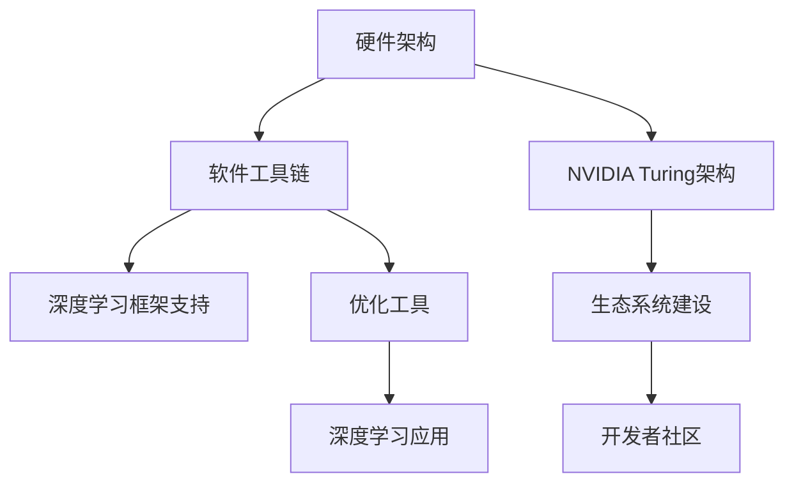
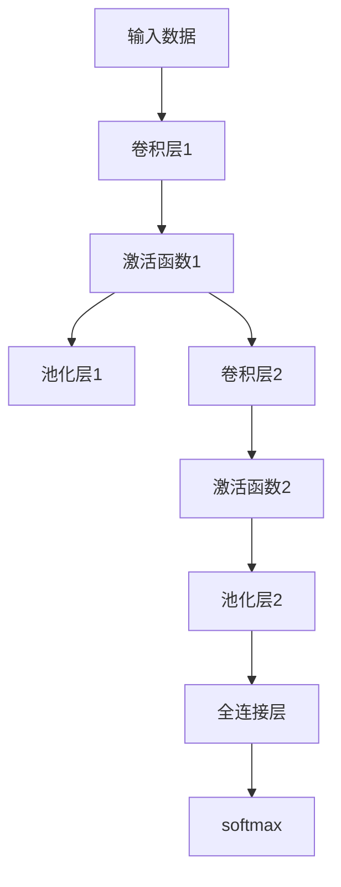
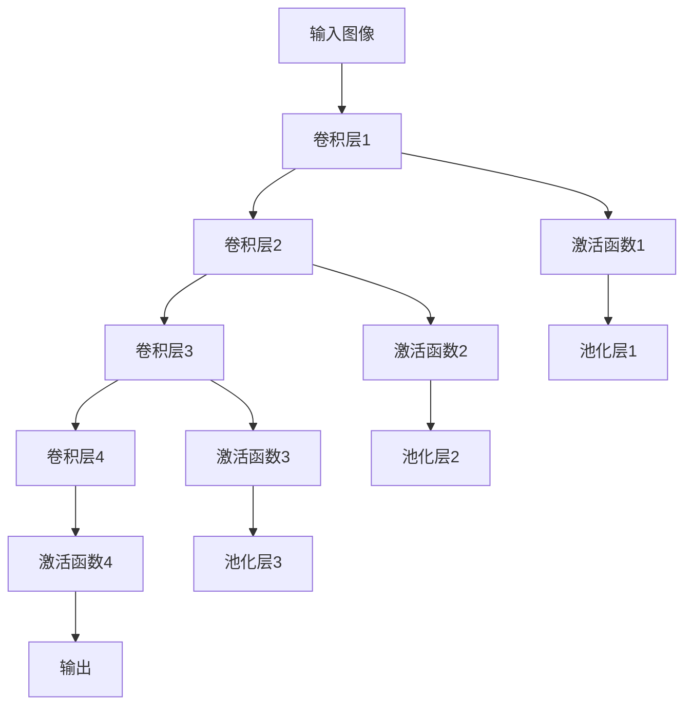

                 

# NVIDIA的算力支持

NVIDIA作为全球领先的GPU厂商，其算力支持和技术创新对人工智能领域产生了深远影响。本文将系统阐述NVIDIA在算力支持方面的核心能力，包括硬件架构、软件工具链、生态系统建设等，并探讨其在全球AI热潮中的独特优势和未来趋势。

## 1. 背景介绍

### 1.1 问题由来
随着深度学习技术的快速发展，人工智能（AI）在各个行业的应用场景不断增多。GPU作为一种并行计算资源，被广泛应用于深度学习的训练和推理。NVIDIA凭借其在GPU领域的长期积累，迅速崛起，成为推动AI产业发展的重要力量。NVIDIA的算力支持不仅体现在硬件层面，还通过软件工具链和生态系统的建设，形成了强大的技术生态系统。

### 1.2 问题核心关键点
NVIDIA算力支持的几个核心关键点包括：
- **硬件架构**：NVIDIA GPU的并行计算架构，使其在深度学习计算中具有卓越的性能。
- **软件工具链**：NVIDIA提供了多种深度学习框架和优化工具，如CUDA、cuDNN等，显著提升开发效率。
- **生态系统建设**：通过构建完善的硬件、软件和开发工具链，NVIDIA建立了强大的AI技术生态系统。

这些关键点使得NVIDIA在AI算力支持方面独树一帜，成为各大AI技术公司的重要合作伙伴。

### 1.3 问题研究意义
研究NVIDIA的算力支持，不仅有助于理解其技术实力和行业地位，还能为企业和开发者提供参考，指导如何在AI应用中更高效地利用GPU资源。

## 2. 核心概念与联系

### 2.1 核心概念概述

为更好地理解NVIDIA的算力支持，本节将介绍几个密切相关的核心概念：

- **硬件架构**：NVIDIA GPU的并行计算架构，使得其能够高效处理大规模并行计算任务。
- **软件工具链**：包括NVIDIA提供的深度学习框架（如TensorRT）、优化工具（如CUDA、cuDNN），以及开源工具（如PyTorch、TensorFlow等）。
- **生态系统建设**：NVIDIA通过与学术界、产业界合作，构建了包括硬件、软件、开发者社区在内的全方位生态系统。
- **NVIDIA Turing架构**：NVIDIA在2018年推出的最新GPU架构，旨在提高算力和能效，降低AI应用成本。
- **深度学习框架支持**：NVIDIA深度支持TensorRT、CUDA、cuDNN等深度学习框架，加速AI应用开发。

这些核心概念之间的逻辑关系可以通过以下Mermaid流程图来展示：



这个流程图展示了大规模GPU计算硬件的算力支持，包括NVIDIA Turing架构、软件工具链，以及NVIDIA构建的生态系统。通过这些组件的协同工作，NVIDIA实现了AI计算的高效、易用和低成本。

## 3. 核心算法原理 & 具体操作步骤
### 3.1 算法原理概述

NVIDIA算力支持的原理主要基于其先进的硬件架构和优化的软件工具链。硬件层面，NVIDIA GPU通过大规模并行计算架构，实现了高效的数据处理能力；软件层面，通过深度学习框架和优化工具的优化，进一步提升了计算性能和开发效率。

### 3.2 算法步骤详解

NVIDIA算力支持的步骤主要包括：

**Step 1: 硬件选型和部署**
- 根据AI应用需求选择合适的NVIDIA GPU型号。NVIDIA GPU家族丰富，包括消费级、专业级、数据中心级等不同型号，可满足不同规模和类型的AI应用。
- 部署GPU硬件，包括服务器选型、网络部署、电源管理等，确保硬件环境稳定可靠。

**Step 2: 软件安装和配置**
- 安装NVIDIA GPU驱动和CUDA工具包。CUDA工具包是NVIDIA GPU的编程环境，提供了并行计算和内存管理等核心功能。
- 配置环境变量，确保应用能够正确访问NVIDIA GPU资源。

**Step 3: 框架和模型选择**
- 选择合适的深度学习框架，如TensorFlow、PyTorch等，并根据模型需求进行配置。
- 导入预训练模型，如ResNet、BERT等，进行微调或迁移学习。

**Step 4: 模型训练和优化**
- 使用NVIDIA提供的优化工具，如cuDNN、TensorRT等，加速模型训练和推理过程。
- 根据性能需求进行超参数调优，包括学习率、批大小、优化器等。

**Step 5: 应用部署和监控**
- 将训练好的模型部署到生产环境，并进行性能测试。
- 使用NVIDIA提供的监控工具，如NVIDIA SMI、Dell神经网络工具等，实时监控GPU状态和应用性能。

### 3.3 算法优缺点

NVIDIA算力支持的优点包括：
- **高效计算**：NVIDIA GPU的高并行计算架构，使其在深度学习任务中表现出色，能够快速完成大规模计算。
- **易用性**：NVIDIA提供的软件工具链和优化工具，简化了AI应用的开发和部署过程，提高了开发效率。
- **广泛支持**：NVIDIA GPU广泛支持各种深度学习框架和应用场景，适用范围广。

NVIDIA算力支持的缺点包括：
- **高成本**：高性能GPU硬件和专业软件工具链，使得NVIDIA算力支持的成本较高，不适合小型企业。
- **能耗大**：NVIDIA GPU的能耗较高，对电力和冷却系统要求较高。
- **资源限制**：高性能GPU资源有限，无法满足所有大规模深度学习任务的需求。

### 3.4 算法应用领域

NVIDIA算力支持的应用领域广泛，包括但不限于：

- **计算机视觉**：如物体检测、图像分割、人脸识别等任务。
- **自然语言处理**：如机器翻译、语音识别、文本生成等任务。
- **医疗影像**：如医学影像分析、病理学图像处理等任务。
- **自动驾驶**：如传感器数据处理、环境感知等任务。
- **科学计算**：如模拟仿真、天气预测等高计算量任务。

此外，NVIDIA还通过与各大科技公司和研究机构合作，推动其在生物信息学、金融分析、智能制造等多个领域的AI应用落地。

## 4. 数学模型和公式 & 详细讲解 & 举例说明

### 4.1 数学模型构建

NVIDIA算力支持的数学模型构建主要基于深度学习框架的计算图。以卷积神经网络（CNN）为例，其计算图如下：



其中，A表示输入数据，B和E表示卷积层，C和F表示激活函数，D和G表示池化层，H表示全连接层，I表示输出。

### 4.2 公式推导过程

假设输入数据为 $x \in \mathbb{R}^n$，卷积核为 $w \in \mathbb{R}^{k \times k \times c \times o}$，激活函数为 $f$，池化函数为 $g$，全连接层为 $h$。

卷积层计算公式为：
$$
y = f(w * x + b)
$$
其中 $*$ 表示卷积操作，$b$ 为偏置项。

激活函数计算公式为：
$$
f(x) = max(0, x)
$$

池化层计算公式为：
$$
z = g(y)
$$

全连接层计算公式为：
$$
y = h(x)
$$

softmax函数计算公式为：
$$
p = \frac{e^x}{\sum_{i=1}^{n} e^x}
$$

### 4.3 案例分析与讲解

以NVIDIA GPU在计算机视觉中的应用为例。在目标检测任务中，NVIDIA GPU能够高效地处理大规模图像数据，通过卷积神经网络（CNN）进行特征提取和分类，实现快速准确的目标检测。

以YOLO（You Only Look Once）算法为例，其计算图如下：



NVIDIA GPU通过并行计算架构，可以同时处理多个特征图，显著提升计算效率。例如，NVIDIA GeForce RTX 3090 GPU在单卡下，能够处理多个特征图并行计算，加速目标检测模型的训练和推理。

## 5. 项目实践：代码实例和详细解释说明

### 5.1 开发环境搭建

在搭建NVIDIA算力支持环境时，需要考虑以下步骤：

**Step 1: 硬件选型和部署**
- 选择适合AI应用的NVIDIA GPU型号，如GeForce、Quadro、Tesla等系列。
- 部署GPU硬件，包括服务器选型、网络部署、电源管理等。

**Step 2: 软件安装和配置**
- 安装NVIDIA GPU驱动和CUDA工具包。NVIDIA提供多版本CUDA工具包，如CUDA 11.0、12.0等。
- 配置环境变量，确保应用能够正确访问NVIDIA GPU资源。

**Step 3: 框架和模型选择**
- 选择合适的深度学习框架，如TensorFlow、PyTorch等。
- 导入预训练模型，如ResNet、BERT等，进行微调或迁移学习。

### 5.2 源代码详细实现

以下是使用PyTorch框架在NVIDIA GPU上进行目标检测任务的具体实现代码：

```python
import torch
import torch.nn as nn
import torch.optim as optim
import torchvision.transforms as transforms
from torchvision import datasets, models, transforms

# 定义模型
class Net(nn.Module):
    def __init__(self):
        super(Net, self).__init__()
        self.conv1 = nn.Conv2d(3, 16, kernel_size=3, stride=1, padding=1)
        self.relu1 = nn.ReLU()
        self.maxpool1 = nn.MaxPool2d(kernel_size=2, stride=2)
        self.conv2 = nn.Conv2d(16, 32, kernel_size=3, stride=1, padding=1)
        self.relu2 = nn.ReLU()
        self.maxpool2 = nn.MaxPool2d(kernel_size=2, stride=2)
        self.fc1 = nn.Linear(32 * 4 * 4, 512)
        self.relu3 = nn.ReLU()
        self.fc2 = nn.Linear(512, 2)

    def forward(self, x):
        x = self.conv1(x)
        x = self.relu1(x)
        x = self.maxpool1(x)
        x = self.conv2(x)
        x = self.relu2(x)
        x = self.maxpool2(x)
        x = x.view(x.size(0), -1)
        x = self.fc1(x)
        x = self.relu3(x)
        x = self.fc2(x)
        return x

# 定义数据集
transform = transforms.Compose([
    transforms.Resize(256),
    transforms.CenterCrop(224),
    transforms.ToTensor(),
    transforms.Normalize([0.485, 0.456, 0.406], [0.229, 0.224, 0.225])
])

train_dataset = datasets.CIFAR10(root='./data', train=True, transform=transform, download=True)
test_dataset = datasets.CIFAR10(root='./data', train=False, transform=transform, download=True)

# 定义训练函数
def train(model, train_loader, optimizer, criterion, num_epochs=10):
    for epoch in range(num_epochs):
        model.train()
        for images, labels in train_loader:
            optimizer.zero_grad()
            outputs = model(images)
            loss = criterion(outputs, labels)
            loss.backward()
            optimizer.step()
        print(f'Epoch {epoch+1}, Loss: {loss.item()}')

# 训练模型
model = Net()
criterion = nn.CrossEntropyLoss()
optimizer = optim.SGD(model.parameters(), lr=0.01, momentum=0.9)

train_loader = torch.utils.data.DataLoader(train_dataset, batch_size=32, shuffle=True)
test_loader = torch.utils.data.DataLoader(test_dataset, batch_size=32, shuffle=False)

train(model, train_loader, optimizer, criterion)
```

### 5.3 代码解读与分析

**硬件选型和部署**
- 选择适合的NVIDIA GPU型号，确保硬件能够满足AI应用的需求。
- 部署GPU硬件，包括服务器选型、网络部署、电源管理等，确保硬件环境稳定可靠。

**软件安装和配置**
- 安装NVIDIA GPU驱动和CUDA工具包。NVIDIA提供多版本CUDA工具包，选择适合自己应用版本。
- 配置环境变量，确保应用能够正确访问NVIDIA GPU资源。

**框架和模型选择**
- 选择合适的深度学习框架，如TensorFlow、PyTorch等。
- 导入预训练模型，如ResNet、BERT等，进行微调或迁移学习。

**模型训练和优化**
- 使用NVIDIA提供的优化工具，如cuDNN、TensorRT等，加速模型训练和推理过程。
- 根据性能需求进行超参数调优，包括学习率、批大小、优化器等。

**应用部署和监控**
- 将训练好的模型部署到生产环境，并进行性能测试。
- 使用NVIDIA提供的监控工具，如NVIDIA SMI、Dell神经网络工具等，实时监控GPU状态和应用性能。

## 6. 实际应用场景
### 6.1 智能医疗

在智能医疗领域，NVIDIA算力支持能够显著提升医疗影像分析、病理学图像处理等任务的处理速度和精度。NVIDIA GPU的高并行计算能力，使得医疗影像数据的大规模处理成为可能，加速了AI在医学影像分析中的应用。

例如，在X光图像分析任务中，NVIDIA GPU能够高效地处理大规模X光图像数据，通过卷积神经网络（CNN）进行特征提取和分类，实现快速准确的图像分析。这不仅提高了医生的诊断效率，还提升了诊断的准确性。

### 6.2 自动驾驶

在自动驾驶领域，NVIDIA算力支持能够支持大规模传感器数据的处理和实时决策。NVIDIA GPU的高并行计算能力，使得自动驾驶系统能够实时处理来自多路传感器的数据，进行环境感知和决策，提升自动驾驶的安全性和稳定性。

例如，在自动驾驶车辆的数据处理任务中，NVIDIA GPU能够高效地处理来自多路传感器（如摄像头、雷达、激光雷达等）的数据，进行环境感知和物体检测，辅助自动驾驶车辆进行决策。这不仅提高了自动驾驶系统的响应速度，还提升了安全性。

### 6.3 科学计算

在科学计算领域，NVIDIA算力支持能够支持大规模高计算量任务的处理。NVIDIA GPU的高并行计算能力，使得科学计算任务的处理速度得到大幅提升，加速了科学研究的进程。

例如，在天气预测任务中，NVIDIA GPU能够高效地处理大规模气象数据，进行数值天气预报，提升天气预测的准确性。这不仅提高了科学研究的效率，还推动了气象科学的发展。

### 6.4 未来应用展望

随着NVIDIA GPU技术的不断进步，未来其在AI算力支持方面的发展趋势如下：

**高性能计算架构**
- NVIDIA将继续优化GPU架构，提高计算性能和能效，降低AI应用成本。
- NVIDIA的H100、A100等新一代GPU将进一步提升计算能力和能效比。

**软件工具链优化**
- NVIDIA将继续优化其软件工具链，提供更加易用的深度学习框架和优化工具，简化AI应用的开发和部署过程。
- NVIDIA将推出更加高效的深度学习库和工具，提升开发效率和模型性能。

**生态系统建设**
- NVIDIA将进一步加强与学术界、产业界的合作，构建更加完善的AI技术生态系统。
- NVIDIA将推动更多开发者和企业使用NVIDIA GPU，推动AI应用的落地和普及。

## 7. 工具和资源推荐
### 7.1 学习资源推荐

为了帮助开发者系统掌握NVIDIA算力支持的理论基础和实践技巧，这里推荐一些优质的学习资源：

1. **NVIDIA官方文档**：NVIDIA提供详细的硬件和软件文档，帮助开发者理解NVIDIA GPU的工作原理和使用方法。
2. **NVIDIA CUDA编程指南**：NVIDIA提供的CUDA编程指南，涵盖CUDA编程基础和优化技巧，是学习NVIDIA GPU编程的必备资源。
3. **NVIDIA TensorRT文档**：NVIDIA提供的TensorRT文档，涵盖TensorRT框架的使用和优化技巧，帮助开发者加速模型推理。
4. **NVIDIA开发者社区**：NVIDIA开发者社区提供了丰富的资源和社区支持，帮助开发者解决实际问题。
5. **CUDA开发者大会**：NVIDIA每年举办的CUDA开发者大会，汇集全球顶尖的CUDA开发者，分享最新技术和应用案例。

通过对这些资源的学习实践，相信你一定能够快速掌握NVIDIA算力支持的精髓，并用于解决实际的NLP问题。

### 7.2 开发工具推荐

高效的开发离不开优秀的工具支持。以下是几款用于NVIDIA GPU开发常用的工具：

1. **PyTorch**：基于Python的开源深度学习框架，灵活动态的计算图，适合快速迭代研究。NVIDIA GPU支持PyTorch，并提供了PyTorch在GPU上的优化版本。
2. **TensorFlow**：由Google主导开发的开源深度学习框架，生产部署方便，适合大规模工程应用。NVIDIA GPU支持TensorFlow，并提供了TensorFlow在GPU上的优化版本。
3. **NVIDIA CUDA**：NVIDIA提供的并行计算平台，支持C++、Python等多种编程语言，提供了高效的数据并行计算能力。
4. **NVIDIA cuDNN**：NVIDIA提供的深度学习加速库，支持多种深度学习框架，提供了高效的卷积和池化操作加速。
5. **NVIDIA TensorRT**：NVIDIA提供的深度学习推理加速库，支持多种深度学习框架，提供了高效的模型推理加速。

合理利用这些工具，可以显著提升NVIDIA GPU开发效率，加快创新迭代的步伐。

### 7.3 相关论文推荐

NVIDIA算力支持的研究源于学界的持续研究。以下是几篇奠基性的相关论文，推荐阅读：

1. **《CUDA-Accelerated Deep Learning on NVIDIA GPUs》**：介绍NVIDIA GPU在深度学习中的加速原理和应用案例。
2. **《NVIDIA's Deep Learning SDK》**：详细介绍NVIDIA GPU提供的深度学习工具和优化技巧，涵盖CUDA、cuDNN、TensorRT等工具。
3. **《TensorRT 7: Speed, Accuracy, and Versatility》**：详细介绍TensorRT 7的新特性和优化技巧，帮助开发者提升模型推理效率。

这些论文代表了大规模GPU计算硬件的算力支持的发展脉络。通过学习这些前沿成果，可以帮助研究者把握学科前进方向，激发更多的创新灵感。

## 8. 总结：未来发展趋势与挑战
### 8.1 总结

本文对NVIDIA算力支持进行了全面系统的介绍。首先阐述了NVIDIA在算力支持方面的核心能力，包括硬件架构、软件工具链、生态系统建设等。其次，从原理到实践，详细讲解了NVIDIA GPU在深度学习计算中的表现，以及如何高效使用NVIDIA GPU进行AI应用开发。

通过本文的系统梳理，可以看到，NVIDIA在AI算力支持方面具有强大的技术实力和广泛的适用性，推动了AI技术在各个行业的应用落地。未来，随着技术的不断演进，NVIDIA在AI算力支持方面的潜力将进一步释放，成为全球AI技术发展的重要推动力。

### 8.2 未来发展趋势

展望未来，NVIDIA算力支持的发展趋势如下：

**高性能计算架构**
- NVIDIA将继续优化GPU架构，提高计算性能和能效，降低AI应用成本。
- NVIDIA的H100、A100等新一代GPU将进一步提升计算能力和能效比。

**软件工具链优化**
- NVIDIA将继续优化其软件工具链，提供更加易用的深度学习框架和优化工具，简化AI应用的开发和部署过程。
- NVIDIA将推出更加高效的深度学习库和工具，提升开发效率和模型性能。

**生态系统建设**
- NVIDIA将进一步加强与学术界、产业界的合作，构建更加完善的AI技术生态系统。
- NVIDIA将推动更多开发者和企业使用NVIDIA GPU，推动AI应用的落地和普及。

**多模态计算**
- NVIDIA将继续扩展其GPU计算能力，支持更多类型的数据计算，如图像、视频、语音等。
- NVIDIA将推出多模态计算工具，帮助开发者高效处理多种类型的数据。

**AI应用创新**
- NVIDIA将推动AI技术在更多领域的应用，如医疗、自动驾驶、科学研究等。
- NVIDIA将推出更多创新应用，推动AI技术的普及和发展。

以上趋势凸显了NVIDIA在AI算力支持方面的广阔前景。这些方向的探索发展，必将进一步提升NVIDIA GPU的计算能力，拓展AI技术的应用范围，为全球AI技术的发展提供强大支持。

### 8.3 面临的挑战

尽管NVIDIA算力支持技术已经取得了瞩目成就，但在迈向更加智能化、普适化应用的过程中，仍面临以下挑战：

**高成本**
- 高性能GPU硬件和专业软件工具链，使得NVIDIA算力支持的成本较高，不适合小型企业。

**能耗大**
- NVIDIA GPU的能耗较高，对电力和冷却系统要求较高。

**资源限制**
- 高性能GPU资源有限，无法满足所有大规模深度学习任务的需求。

**性能瓶颈**
- 当深度学习模型规模不断增大时，NVIDIA GPU的性能瓶颈逐渐显现，需要进一步优化硬件架构和软件工具链。

**生态系统不完善**
- 虽然NVIDIA构建了较为完善的硬件、软件和开发工具链，但在某些特定领域，如生物信息学、智能制造等，仍需要进一步完善其生态系统。

正视NVIDIA算力支持面临的这些挑战，积极应对并寻求突破，将是大规模GPU计算硬件算力支持走向成熟的必由之路。相信随着学界和产业界的共同努力，这些挑战终将一一被克服，NVIDIA GPU将为全球AI技术的发展提供更加强大的支持。

### 8.4 研究展望

面对NVIDIA算力支持所面临的挑战，未来的研究需要在以下几个方面寻求新的突破：

**优化硬件架构**
- 通过更先进的硬件架构设计，提升NVIDIA GPU的计算性能和能效。
- 推出更高性能的GPU，如H100、A100等，进一步提升计算能力和能效比。

**提升软件工具链**
- 通过优化深度学习框架和工具，提升开发效率和模型性能。
- 推出更加高效的深度学习库和工具，帮助开发者更高效地进行AI应用开发。

**构建完善的生态系统**
- 通过与学术界、产业界的合作，构建更完善的AI技术生态系统。
- 推动更多开发者和企业使用NVIDIA GPU，推动AI应用的落地和普及。

**支持多模态计算**
- 支持图像、视频、语音等多种类型的数据计算，提升多模态数据处理的效率。
- 推出多模态计算工具，帮助开发者高效处理多种类型的数据。

**推动AI应用创新**
- 推动AI技术在更多领域的应用，如医疗、自动驾驶、科学研究等。
- 推出更多创新应用，推动AI技术的普及和发展。

这些研究方向的探索，必将引领NVIDIA GPU算力支持技术迈向更高的台阶，为全球AI技术的发展提供更加强大的支持。面向未来，NVIDIA GPU算力支持技术还需要与其他AI技术进行更深入的融合，如知识表示、因果推理、强化学习等，多路径协同发力，共同推动自然语言理解和智能交互系统的进步。只有勇于创新、敢于突破，才能不断拓展GPU计算能力的边界，让AI技术更好地造福人类社会。

## 9. 附录：常见问题与解答

**Q1：如何使用NVIDIA GPU进行深度学习训练？**

A: 使用NVIDIA GPU进行深度学习训练需要以下步骤：
1. 选择适合的NVIDIA GPU型号，如GeForce、Quadro、Tesla等系列。
2. 安装NVIDIA GPU驱动和CUDA工具包。
3. 配置环境变量，确保应用能够正确访问NVIDIA GPU资源。
4. 选择合适的深度学习框架，如TensorFlow、PyTorch等，进行模型训练。
5. 导入预训练模型，如ResNet、BERT等，进行微调或迁移学习。

**Q2：NVIDIA GPU在深度学习计算中有什么优势？**

A: NVIDIA GPU在深度学习计算中的优势主要包括：
1. 并行计算架构：NVIDIA GPU的高并行计算架构，使其能够高效处理大规模并行计算任务。
2. 高速内存：NVIDIA GPU的显存容量大，支持高带宽内存，加速模型训练和推理过程。
3. 优化工具：NVIDIA提供了cuDNN、TensorRT等深度学习加速库，提升计算效率。

**Q3：NVIDIA GPU在智能医疗中的应用有哪些？**

A: NVIDIA GPU在智能医疗中的应用主要包括：
1. 医疗影像分析：NVIDIA GPU能够高效处理大规模医疗影像数据，通过卷积神经网络（CNN）进行特征提取和分类，实现快速准确的图像分析。
2. 病理学图像处理：NVIDIA GPU能够高效处理大规模病理学图像数据，进行自动化的病理学分析，提升诊断效率和准确性。

**Q4：NVIDIA GPU在高能效计算中的表现如何？**

A: NVIDIA GPU在高能效计算中的表现非常优异。其先进的并行计算架构和优化技术，使得NVIDIA GPU在能效比方面处于行业领先地位。NVIDIA GPU的高能效特性，不仅降低了计算成本，还减少了碳排放，符合绿色计算的发展趋势。

**Q5：NVIDIA GPU在自动驾驶中的应用有哪些？**

A: NVIDIA GPU在自动驾驶中的应用主要包括：
1. 传感器数据处理：NVIDIA GPU能够高效处理来自多路传感器（如摄像头、雷达、激光雷达等）的数据，进行环境感知和物体检测，辅助自动驾驶车辆进行决策。
2. 实时决策：NVIDIA GPU的高并行计算能力，使得自动驾驶系统能够实时处理大量数据，进行实时决策，提升自动驾驶的安全性和稳定性。

总之，NVIDIA GPU算力支持在深度学习计算中表现卓越，广泛应用于智能医疗、自动驾驶、科学计算等多个领域。其高性能计算架构、优化工具和完善的生态系统，使得NVIDIA GPU成为全球AI技术发展的重要推动力。

---

作者：禅与计算机程序设计艺术 / Zen and the Art of Computer Programming

