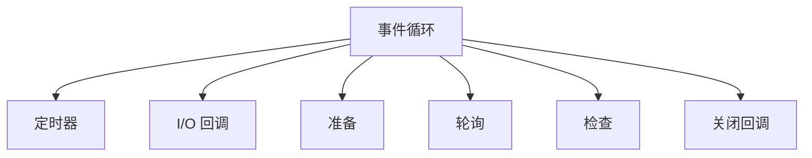

                 

# Node.js 异步编程：事件循环和回调

异步编程是现代 Web 开发中不可或缺的一部分。Node.js 作为 JavaScript 在服务器端的运行平台，其本质就是一个异步事件驱动的 I/O 平台。Node.js 的核心机制是事件循环（Event Loop）和回调（Callback），理解这些概念对于深入了解 Node.js 和 Node.js 相关的异步编程至关重要。本文将详细介绍 Node.js 的事件循环和回调，并结合实际例子展示其在实际应用中的运用。

## 1. 背景介绍

Node.js 是一个使用单线程的 JavaScript 运行时，它使用事件驱动、非阻塞 I/O 模型。相较于多线程或多进程的同步 I/O 模型，Node.js 的异步 I/O 模型具有更好的资源利用率和吞吐量。

异步编程的核心是回调函数，回调函数是异步编程中重要的概念之一，它通常定义在异步函数中，用于在异步操作完成后执行特定的任务。回调函数的执行通常会安排在事件循环中执行。

## 2. 核心概念与联系

### 2.1 核心概念概述

在 Node.js 中，核心机制包括事件循环和回调函数。这两个概念是异步编程的核心。

#### 事件循环（Event Loop）

事件循环是 Node.js 中最基本和最重要的概念。事件循环是一个不断循环的机制，用于处理异步操作。事件循环分为以下几个阶段：

1. **定时器（Timer）**：处理当前时间的定时器回调函数。
2. **I/O 回调（I/O Callbacks）**：处理 I/O 相关的回调函数，包括文件读取、网络请求等。
3. **准备（Preparation）**：处理准备执行的回调函数。
4. **轮询（Polling）**：轮询文件描述符是否准备好。
5. **检查（Check）**：处理检查回调函数，例如 `setImmediate`。
6. **关闭回调（Close Callbacks）**：处理关闭回调函数。

这些阶段会循环运行，每个阶段执行完毕后，会返回执行下一个阶段。在 Node.js 中，非阻塞 I/O 操作（如读取文件、网络请求等）的回调函数会插入到事件循环的适当位置，等待被执行。

#### 回调函数（Callback）

回调函数是 Node.js 中处理异步操作的主要手段。回调函数是一个函数，它作为参数传递给异步函数，在异步操作完成后被调用。回调函数通常包含两个参数：错误（Error）和结果（Result）。例如：

```javascript
fs.readFile('file.txt', 'utf8', (err, data) => {
  if (err) throw err;
  console.log(data);
});
```

在上面的例子中，`fs.readFile` 方法是一个异步函数，它会读取文件并调用回调函数。在文件读取完成后，如果发生错误，错误会被传递给回调函数的第一个参数 `err`，否则，文件内容会被传递给回调函数的第二个参数 `data`。

### 2.2 核心概念原理和架构的 Mermaid 流程图



## 3. 核心算法原理 & 具体操作步骤

### 3.1 算法原理概述

Node.js 的事件循环机制遵循一种单线程的执行模型。所有的代码都是在主线程上执行的，而异步操作则是在事件循环的各个阶段中执行的。这种单线程模型使得 Node.js 在处理大量并发连接时，能够更高效地利用系统资源。

Node.js 的事件循环是基于 libuv 库实现的。libuv 是一个跨平台的 I/O 库，它提供了一组底层的异步 I/O 接口，用于处理异步操作。

### 3.2 算法步骤详解

#### 步骤 1：创建异步操作

在 Node.js 中，异步操作通常由异步函数（如 `fs.readFile`、`http.request` 等）创建。这些函数接收一个回调函数作为参数，用于在异步操作完成后执行特定的任务。

#### 步骤 2：执行异步操作

当异步操作被调用时，Node.js 会将其插入到事件循环中，等待执行。在事件循环的不同阶段中，Node.js 会检查是否需要执行回调函数。

#### 步骤 3：执行回调函数

当事件循环到达适当的阶段时，Node.js 会执行回调函数。回调函数的执行顺序遵循一定的规则，例如 I/O 回调函数会优先于定时器回调函数执行。

### 3.3 算法优缺点

#### 优点

1. **高效**：Node.js 的单线程模型使得它可以高效地处理大量并发连接，因为它不需要在每个连接之间切换线程。
2. **灵活**：Node.js 的回调机制使得它可以处理复杂的异步逻辑，而不需要使用锁或其他同步机制。
3. **简单**：Node.js 的异步编程模型简单易懂，易于理解和实现。

#### 缺点

1. **回调地狱**：在处理复杂的异步操作时，回调函数的嵌套会导致代码可读性和维护性降低，称为“回调地狱”。
2. **难以处理错误**：回调函数的错误处理往往比较困难，因为错误可能会在异步操作完成之前发生。
3. **资源限制**：Node.js 的单线程模型限制了它在处理 CPU 密集型任务时的性能。

### 3.4 算法应用领域

Node.js 的异步编程模型适用于以下场景：

1. **Web 开发**：Node.js 是 Web 开发的理想平台，因为它能够高效地处理大量并发连接，并且支持高效的路由和模板引擎。
2. **实时应用**：Node.js 适用于需要实时响应的应用，如聊天应用、实时数据处理等。
3. **爬虫**：Node.js 的异步编程模型使得它非常适合编写高效的爬虫程序。
4. **流媒体**：Node.js 的异步编程模型使得它非常适合处理流媒体数据，如音频和视频。

## 4. 数学模型和公式 & 详细讲解 & 举例说明

### 4.1 数学模型构建

在 Node.js 中，异步编程通常涉及以下几个数学模型：

1. **时间模型**：Node.js 的时间模型基于 Unix 时间戳（即自 1970 年 1 月 1 日以来的秒数）。
2. **I/O 模型**：Node.js 的 I/O 操作通常是基于事件驱动的，这意味着它们不会阻塞主线程。
3. **回调模型**：Node.js 的回调函数通常包含两个参数：错误（Error）和结果（Result）。

### 4.2 公式推导过程

在 Node.js 中，异步编程的公式通常包含以下元素：

1. **时间**：Node.js 的时间模型基于 Unix 时间戳。
2. **I/O 操作**：Node.js 的 I/O 操作通常是基于事件驱动的。
3. **回调函数**：回调函数是异步编程中最重要的部分。

### 4.3 案例分析与讲解

#### 例子 1：读取文件

以下是一个读取文件的例子：

```javascript
const fs = require('fs');

fs.readFile('file.txt', 'utf8', (err, data) => {
  if (err) throw err;
  console.log(data);
});
```

在这个例子中，`fs.readFile` 是一个异步函数，它会读取文件并调用回调函数。在文件读取完成后，如果发生错误，错误会被传递给回调函数的第一个参数 `err`，否则，文件内容会被传递给回调函数的第二个参数 `data`。

## 5. 项目实践：代码实例和详细解释说明

### 5.1 开发环境搭建

要使用 Node.js 进行开发，需要先安装 Node.js。Node.js 可以从官网下载安装包进行安装。安装完成后，可以通过命令行检查 Node.js 的安装情况：

```bash
node -v
npm -v
```

### 5.2 源代码详细实现

#### 例子 2：发送 HTTP 请求

以下是一个发送 HTTP 请求的例子：

```javascript
const http = require('http');

http.get('http://example.com', (res) => {
  console.log(`状态码：${res.statusCode}`);
  res.on('data', (data) => {
    console.log(data.toString());
  });
}).on('error', (err) => {
  console.error(err);
});
```

在这个例子中，`http.get` 是一个异步函数，它会发送 HTTP 请求并调用回调函数。在请求完成后，回调函数会被调用，并传递响应对象 `res`。可以通过 `res.statusCode` 获取响应状态码，并通过 `res.on('data', ...)` 监听数据流，接收响应数据。

### 5.3 代码解读与分析

在 Node.js 中，异步操作通常使用回调函数进行调用。回调函数是异步编程中最重要的部分，它用于在异步操作完成后执行特定的任务。

### 5.4 运行结果展示

在上面的例子中，如果请求成功，将会打印出 HTTP 响应的状态码和数据。如果请求失败，将会打印出错误信息。

## 6. 实际应用场景

Node.js 的异步编程模型适用于以下场景：

1. **Web 开发**：Node.js 是 Web 开发的理想平台，因为它能够高效地处理大量并发连接，并且支持高效的路由和模板引擎。
2. **实时应用**：Node.js 适用于需要实时响应的应用，如聊天应用、实时数据处理等。
3. **爬虫**：Node.js 的异步编程模型使得它非常适合编写高效的爬虫程序。
4. **流媒体**：Node.js 的异步编程模型使得它非常适合处理流媒体数据，如音频和视频。

## 7. 工具和资源推荐

### 7.1 学习资源推荐

1. **Node.js 官方文档**：Node.js 的官方文档是学习 Node.js 的最好资源之一，其中包含了详细的事件循环和回调函数介绍。
2. **《Node.js 实战》**：这是一本优秀的 Node.js 入门书籍，介绍了 Node.js 的核心概念和异步编程模型。
3. **《JavaScript Promise迷你书》**：这是一本介绍 Promise 和异步编程的好书，对于理解 Node.js 的异步编程模型非常有帮助。

### 7.2 开发工具推荐

1. **Visual Studio Code**：这是一个轻量级的代码编辑器，支持 Node.js 开发，并且有很多插件可以增强开发体验。
2. **npm**：Node.js 的包管理器，可以方便地安装、更新和卸载 Node.js 模块。
3. **Git**：版本控制系统，用于管理代码版本和协作开发。

### 7.3 相关论文推荐

1. **《Node.js 核心技术》**：这是一篇关于 Node.js 核心技术的论文，介绍了 Node.js 的事件循环和异步编程模型。
2. **《Node.js 架构模式》**：这是一篇介绍 Node.js 架构模式的论文，提供了许多实用的 Node.js 开发技巧。

## 8. 总结：未来发展趋势与挑战

### 8.1 研究成果总结

Node.js 的异步编程模型在许多方面已经非常成熟。事件循环和回调函数是 Node.js 异步编程的核心机制，使得 Node.js 能够高效地处理大量并发连接。

### 8.2 未来发展趋势

1. **更高效的异步编程模型**：未来的 Node.js 可能会引入更高效的异步编程模型，例如 Promise 和 async/await 等。
2. **更好的错误处理**：未来的 Node.js 可能会引入更好的错误处理机制，例如 try-catch 和 Error Handling 中间件。
3. **更多的异步 I/O 操作**：未来的 Node.js 可能会引入更多的异步 I/O 操作，例如 WebSocket 和 Sockets。
4. **更好的性能优化**：未来的 Node.js 可能会引入更好的性能优化机制，例如 WebAssembly 和 Native Addons。

### 8.3 面临的挑战

1. **性能瓶颈**：Node.js 在处理大量并发连接时，可能会遇到性能瓶颈。
2. **安全性问题**：Node.js 需要更好的安全性措施，以防止恶意攻击和数据泄露。
3. **兼容性问题**：Node.js 需要在不同的操作系统和浏览器中保持兼容。
4. **内存管理**：Node.js 需要更好的内存管理机制，以避免内存泄漏和垃圾回收问题。

### 8.4 研究展望

未来的 Node.js 可能需要引入更高效的异步编程模型、更好的错误处理机制、更多的异步 I/O 操作和更好的性能优化机制，以应对未来不断增加的并发连接和更复杂的应用场景。同时，也需要更好的安全性措施和更好的内存管理机制，以提高 Node.js 的可靠性和稳定性。

## 9. 附录：常见问题与解答

### 9.1 常见问题

1. **什么是异步编程？**

   异步编程是一种编程范式，它允许程序在执行时处理多个任务，而不是按顺序执行。异步编程可以提高程序的效率和性能。

2. **什么是回调函数？**

   回调函数是异步编程中最重要的部分，它用于在异步操作完成后执行特定的任务。回调函数通常包含两个参数：错误（Error）和结果（Result）。

3. **什么是事件循环？**

   事件循环是 Node.js 中最基本和最重要的概念。事件循环是一个不断循环的机制，用于处理异步操作。事件循环分为以下几个阶段：定时器（Timer）、I/O 回调（I/O Callbacks）、准备（Preparation）、轮询（Polling）、检查（Check）和关闭回调（Close Callbacks）。

### 9.2 解答

1. **什么是异步编程？**

   异步编程是一种编程范式，它允许程序在执行时处理多个任务，而不是按顺序执行。异步编程可以提高程序的效率和性能。

2. **什么是回调函数？**

   回调函数是异步编程中最重要的部分，它用于在异步操作完成后执行特定的任务。回调函数通常包含两个参数：错误（Error）和结果（Result）。

3. **什么是事件循环？**

   事件循环是 Node.js 中最基本和最重要的概念。事件循环是一个不断循环的机制，用于处理异步操作。事件循环分为以下几个阶段：定时器（Timer）、I/O 回调（I/O Callbacks）、准备（Preparation）、轮询（Polling）、检查（Check）和关闭回调（Close Callbacks）。

---

作者：禅与计算机程序设计艺术 / Zen and the Art of Computer Programming

