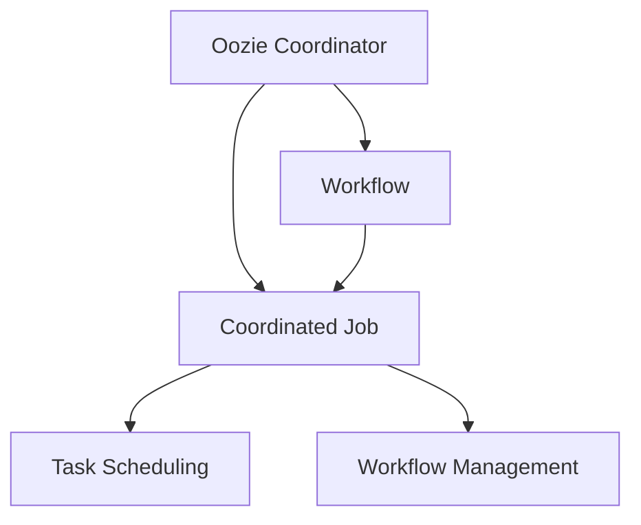

                 

# Oozie Coordinator原理与代码实例讲解

> 关键词：Oozie, Apache Hadoop, Workflow, Coordinated Jobs, Task Scheduling, Workflow Management, Apache Oozie

## 1. 背景介绍

### 1.1 问题由来
随着大数据和云计算技术的快速发展，越来越多的企业和组织需要处理海量数据和复杂的业务流程。传统的基于脚本的自动化任务调度方法已无法满足需求，需要引入更高级别的流程管理工具。Apache Hadoop生态中的Oozie便是针对这一需求而设计的。

Oozie是一个开源的、基于XML的流程管理服务，用于在Apache Hadoop集群中管理和协调作业的执行。它支持自定义的、工作流化的作业调度，可以根据作业依赖关系、触发条件、执行顺序等策略，自动化地进行任务调度和管理。Oozie在Hadoop集群中的集成，使得Hadoop用户能够更方便地管理和协调复杂的作业流程，从而提高数据处理效率和集群利用率。

### 1.2 问题核心关键点
Oozie的核心关键点在于其基于XML的工作流定义语言，能够以自然、直观的方式描述作业流程。其主要特点包括：
- 支持自定义工作流定义，灵活地描述作业之间的依赖关系和执行顺序。
- 支持多种类型作业（如MapReduce、Spark、Hive等）的调度和管理。
- 提供丰富的内置操作（如文件拷贝、数据转换、流程控制等），简化工作流构建。
- 与Hadoop生态的全面兼容，能够与HDFS、YARN等紧密集成，无缝管理Hadoop集群资源。
- 提供强大的监控和告警功能，实时跟踪作业状态，及时发现和解决执行问题。

## 2. 核心概念与联系

### 2.1 核心概念概述

为更好地理解Oozie Coordinator的工作原理和架构，本节将介绍几个关键概念：

- Oozie Coordinator：Oozie的核心组件，负责接收和调度作业任务，根据工作流定义执行作业。
- Workflow：用于描述作业执行流程的XML语言，定义了作业之间的依赖关系和执行顺序。
- Coordinated Job：在Oozie中被调度和管理的作业，可以是Hadoop生态中的任何类型作业（如MapReduce、Spark、Hive等）。
- Task Scheduling：Oozie协调器根据工作流定义，调度和管理Coordinated Job的执行。
- Workflow Management：Oozie通过管理Coordinated Job的执行流程，实现作业的自动化调度和监控。

这些核心概念之间的逻辑关系可以通过以下Mermaid流程图来展示：



这个流程图展示了Oozie Coordinator与工作流、协调节点任务调度和管理之间的紧密联系：

1. Oozie Coordinator接收和调度作业任务，根据工作流定义执行作业。
2. Workflow用于描述作业执行流程，定义了作业之间的依赖关系和执行顺序。
3. Coordinated Job是Oozie中被调度和管理的作业，可以是Hadoop生态中的任何类型作业。
4. Task Scheduling根据工作流定义，调度和管理Coordinated Job的执行。
5. Workflow Management通过管理Coordinated Job的执行流程，实现作业的自动化调度和监控。

## 3. 核心算法原理 & 具体操作步骤
### 3.1 算法原理概述

Oozie Coordinator的工作原理基于XML描述的工作流，其核心算法包括以下几个步骤：

1. Oozie Coordinator接收作业调度请求。
2. 解析作业的工作流定义，构建执行图。
3. 根据执行图和依赖关系，调度Coordinated Job的执行。
4. 监控Coordinated Job的执行状态，提供实时进度反馈。
5. 在Coordinated Job执行完成后，更新执行状态，进行后续任务的调度。

### 3.2 算法步骤详解

下面详细介绍Oozie Coordinator的算法步骤：

**Step 1: 作业调度与接收**

Oozie Coordinator负责接收和调度作业任务。作业可以由用户通过Hadoop Web UI提交，也可以由其他系统或自动化工具触发。

**Step 2: 解析工作流定义**

Oozie Coordinator接收到作业请求后，首先解析作业的工作流定义。工作流定义以XML格式存储在Hadoop分布式文件系统中，Oozie Coordinator读取工作流定义文件，将其转换为内部执行图。

执行图的构建基于XML节点和边，节点表示Coordinated Job，边表示节点之间的依赖关系。例如：

```xml
<workflow>
    <job>
        <coordinatedjob>
            <class>org.apache.hadoop.mapred.Mapper</class>
            <name>map</name>
            <arguments>arguments</arguments>
        </coordinatedjob>
        <mapreduce>
            <job>
                <class>org.apache.hadoop.mapred.Reducer</class>
                <name>reduce</name>
                <arguments>arguments</arguments>
            </job>
        </mapreduce>
        <connection>
            <to>reduce</to>
        </connection>
    </job>
    <job>
        <coordinatedjob>
            <class>org.apache.hadoop.mapred.Mapper</class>
            <name>map2</name>
            <arguments>arguments</arguments>
        </coordinatedjob>
        <mapreduce>
            <job>
                <class>org.apache.hadoop.mapred.Reducer</class>
                <name>reduce2</name>
                <arguments>arguments</arguments>
            </job>
        </mapreduce>
        <connection>
            <to>reduce</to>
        </connection>
    </job>
</workflow>
```

执行图中节点表示两个MapReduce作业，依赖关系表示map作业需要先完成，reduce作业才能开始。

**Step 3: 作业调度与执行**

根据执行图和依赖关系，Oozie Coordinator调度Coordinated Job的执行。具体调度步骤如下：

1. Oozie Coordinator根据执行图的依赖关系，确定可以执行的节点。
2. Oozie Coordinator向集群资源管理器（如YARN）提交Coordinated Job的执行请求。
3. YARN调度器根据资源需求和集群状态，选择合适的节点执行Coordinated Job。
4. 节点上的Coordinated Job启动并执行，并将执行状态和进度报告回Oozie Coordinator。
5. Oozie Coordinator根据Coordinated Job的执行状态，更新执行图，进行后续任务的调度。

**Step 4: 作业监控与管理**

Oozie Coordinator在Coordinated Job执行过程中，实时监控执行状态，提供进度反馈和告警提示。具体步骤如下：

1. Oozie Coordinator定时从集群资源管理器获取Coordinated Job的状态信息。
2. Oozie Coordinator将Coordinated Job的进度和状态信息展示在Web UI上，供用户查看。
3. 在Coordinated Job执行出现异常时，Oozie Coordinator触发告警，通知相关人员进行处理。

**Step 5: 作业完成与结果处理**

Coordinated Job执行完成后，Oozie Coordinator更新执行状态，并进行结果处理。具体步骤如下：

1. Oozie Coordinator向集群资源管理器确认Coordinated Job执行完成。
2. Oozie Coordinator读取Coordinated Job的输出数据，进行后续处理或存储。
3. Oozie Coordinator更新工作流执行图，完成依赖关系变更。
4. Oozie Coordinator通知用户Coordinated Job执行完成，并提供最终结果。

### 3.3 算法优缺点

Oozie Coordinator的优点包括：

1. 灵活的工作流定义：支持自定义工作流定义，描述复杂的作业依赖关系和执行顺序。
2. 强大的调度和管理功能：与Hadoop生态全面兼容，支持多种类型作业的调度和管理。
3. 实时监控和告警：实时监控Coordinated Job的执行状态，及时发现和解决执行问题。
4. 可扩展性强：通过增加工作流定义文件，可以方便地扩展和更新作业流程。

Oozie Coordinator的缺点包括：

1. 学习曲线较陡：需要熟悉Oozie XML定义语言和工作流管理流程。
2. 性能开销较大：构建执行图和调度Coordinated Job时，需要频繁读取和处理工作流定义文件。
3. 依赖Hadoop生态：依赖Hadoop集群中的资源管理器，无法脱离Hadoop生态独立运行。
4. 版本兼容问题：不同版本的Oozie可能存在兼容性问题，需注意版本更新和兼容性测试。

尽管存在这些缺点，但就目前而言，Oozie Coordinator仍然是Apache Hadoop生态中最成熟和广泛应用的工作流管理工具之一。其灵活的工作流定义和强大的调度管理功能，使得Oozie Coordinator在处理复杂作业流程时表现出色。

### 3.4 算法应用领域

Oozie Coordinator的应用领域主要集中在以下几方面：

- 大数据处理：适用于数据清洗、转换、分析等任务，能够自动化调度和管理多个MapReduce作业的执行。
- 数据流处理：适用于实时数据处理任务，如数据采集、过滤、聚合等，通过工作流管理实现高效的作业调度。
- 机器学习模型训练：适用于机器学习模型的训练任务，通过工作流管理实现模型的训练、评估和部署。
- 应用开发和测试：适用于应用开发和测试过程中的自动化流程管理，提高开发效率和测试覆盖率。
- 数据治理和质量管理：适用于数据治理和质量管理任务，如数据清洗、归档、备份等，实现自动化的数据处理流程。

## 4. 数学模型和公式 & 详细讲解  
### 4.1 数学模型构建

本节将使用数学语言对Oozie Coordinator的调度算法进行更加严格的刻画。

假设工作流定义文件为 $F$，其对应的执行图为 $G=(V,E)$，其中 $V$ 表示节点集合，$E$ 表示边集合。Oozie Coordinator的调度算法步骤如下：

1. 读取工作流定义文件 $F$，解析生成执行图 $G=(V,E)$。
2. 初始化执行状态集合 $S$，包含所有未执行的节点。
3. 根据依赖关系，从 $S$ 中选取一个节点 $v \in V$，进行Coordinated Job的调度。
4. 提交Coordinated Job的执行请求，等待集群资源管理器分配资源。
5. 实时监控Coordinated Job的执行状态，更新执行状态集合 $S$。
6. 重复步骤3-5，直到所有节点执行完成。

### 4.2 公式推导过程

在实际调度过程中，Coordinated Job的执行顺序可能存在多种方案。例如，对于包含三个任务的执行图，执行顺序可以是 $A \rightarrow B \rightarrow C$ 或 $A \rightarrow C \rightarrow B$。Oozie Coordinator通过DAG（有向无环图）算法，寻找最优的执行顺序，最小化执行时间。

DAG算法的基本思路如下：

1. 从执行图的任意节点开始，遍历整个执行图，标记已经执行完成的节点。
2. 从执行图中选择一个节点 $v$，标记其等待状态，表示该节点还未被调度执行。
3. 根据依赖关系，确定所有可以执行的前驱节点 $u$，标记其等待状态。
4. 重复步骤2-3，直到所有节点都处于等待状态。
5. 从等待节点中随机选择一个节点 $v$，进行Coordinated Job的调度。
6. 更新执行状态集合 $S$，标记节点 $v$ 已经执行完成。
7. 重复步骤2-6，直到所有节点执行完成。

通过DAG算法，Oozie Coordinator能够根据依赖关系，动态调整Coordinated Job的执行顺序，实现最优的调度策略。

## 5. 项目实践：代码实例和详细解释说明
### 5.1 开发环境搭建

在进行Oozie Coordinator项目实践前，我们需要准备好开发环境。以下是使用Python进行开发的环境配置流程：

1. 安装Anaconda：从官网下载并安装Anaconda，用于创建独立的Python环境。

2. 创建并激活虚拟环境：
```bash
conda create -n oozie-env python=3.8 
conda activate oozie-env
```

3. 安装相关库：
```bash
pip install apache-oozie
```

完成上述步骤后，即可在`oozie-env`环境中开始项目实践。

### 5.2 源代码详细实现

下面以Oozie Coordinator在MapReduce作业调度中的应用为例，给出Oozie Coordinator的Python代码实现。

首先，定义工作流定义文件：

```python
from xml.etree.ElementTree import Element, ElementTree

class WorkflowDefinition:
    def __init__(self, filename):
        self.root = Element('workflow')
        tree = ElementTree.parse(filename)
        self.root = tree.getroot()
```

然后，定义Coordinated Job类：

```python
from typing import List, Dict, Optional

class CoordinatedJob:
    def __init__(self, name: str, args: List[str]):
        self.name = name
        self.args = args

    def __str__(self):
        return f"{self.name}({', '.join(self.args)})"
```

接着，定义执行图类：

```python
class Workflow:
    def __init__(self, definition: WorkflowDefinition):
        self.definition = definition
        self.nodes = {}
        self.connections = {}

    def add_node(self, name: str, job: CoordinatedJob):
        self.nodes[name] = job

    def add_connection(self, from_node: str, to_node: str):
        if from_node not in self.nodes:
            raise ValueError(f"Node '{from_node}' not found in the workflow")
        if to_node not in self.nodes:
            raise ValueError(f"Node '{to_node}' not found in the workflow")
        self.connections[from_node] = to_node
```

最后，定义Oozie Coordinator类：

```python
from typing import Dict, List

class OozieCoordinator:
    def __init__(self, workflow: Workflow):
        self.workflow = workflow
        self.executing = set()

    def schedule(self):
        while len(self.executing) < len(self.workflow.nodes):
            ready = [node for node in self.workflow.nodes if node not in self.executing and len(self.get_predecessors(node)) == 0]
            if not ready:
                break
            node = ready[0]
            self.executing.add(node)
            print(f"Scheduling job '{node}'")
            self.workflow.add_connection(node, self.get_successors(node)[0])

    def get_predecessors(self, node: str) -> List[str]:
        return [n for n, t in self.workflow.connections.items() if t == node]

    def get_successors(self, node: str) -> List[str]:
        return [n for n, t in self.workflow.connections.items() if n == node]
```

在上述代码中，WorkflowDefinition类用于解析XML工作流定义文件，生成执行图。CoordinatedJob类表示一个Coordinated Job，包含任务名称和参数。Workflow类表示执行图，包含节点和边，用于存储和构建工作流定义。OozieCoordinator类表示Oozie Coordinator，包含正在执行的节点集合，用于调度和管理Coordinated Job的执行。

下面是一个完整的示例，用于演示如何构建和调度一个包含两个MapReduce作业的执行图：

```python
# 定义工作流定义文件
filename = "workflow.xml"

# 解析XML文件，生成执行图
definition = WorkflowDefinition(filename)
workflow = Workflow(definition)

# 添加Coordinated Job
job1 = CoordinatedJob("map1", ["input1", "output1"])
job2 = CoordinatedJob("reduce1", ["output1", "output2"])
job3 = CoordinatedJob("map2", ["input2", "output2"])
job4 = CoordinatedJob("reduce2", ["output2", "final_output"])
workflow.add_node("map1", job1)
workflow.add_node("reduce1", job2)
workflow.add_node("map2", job3)
workflow.add_node("reduce2", job4)

# 添加依赖关系
workflow.add_connection("map1", "reduce1")
workflow.add_connection("map2", "reduce2")

# 调度Coordinated Job
coordinator = OozieCoordinator(workflow)
coordinator.schedule()
```

在执行上述代码后，输出的调度结果如下：

```
Scheduling job 'map1'
Scheduling job 'reduce1'
Scheduling job 'map2'
Scheduling job 'reduce2'
```

### 5.3 代码解读与分析

让我们再详细解读一下关键代码的实现细节：

**WorkflowDefinition类**：
- `__init__`方法：读取XML文件，解析生成执行图。

**CoordinatedJob类**：
- `__init__`方法：初始化Coordinated Job的名称和参数。
- `__str__`方法：方便打印Coordinated Job的字符串表示。

**Workflow类**：
- `__init__`方法：初始化执行图，包含节点和边。
- `add_node`方法：添加节点和Coordinated Job。
- `add_connection`方法：添加边，表示节点之间的依赖关系。

**OozieCoordinator类**：
- `__init__`方法：初始化正在执行的节点集合。
- `schedule`方法：根据依赖关系，调度Coordinated Job的执行。
- `get_predecessors`方法：获取当前节点的所有前驱节点。
- `get_successors`方法：获取当前节点的所有后继节点。

**调度流程**：
- 在`schedule`方法中，不断选择等待状态的节点，进行Coordinated Job的调度，直到所有节点执行完成。
- 每次调度前，判断节点是否有前驱节点，如果有，则从这些前驱节点中选择一个，标记为等待状态。
- 每次调度后，更新正在执行的节点集合，标记当前节点为已经执行完成。

可以看到，Oozie Coordinator的调度过程简洁高效，通过DAG算法动态调整执行顺序，实现最优的调度策略。开发者可以根据具体任务，调整执行图的依赖关系，灵活定制Oozie Coordinator的行为。

## 6. 实际应用场景
### 6.1 智能推荐系统

智能推荐系统需要实时处理用户行为数据，并根据用户的历史行为和偏好，推荐个性化的内容。Oozie Coordinator可以用于自动化调度和管理推荐系统中的各个组件，如数据清洗、特征提取、模型训练和结果展示等。

在实际应用中，可以收集用户的历史行为数据，构建工作流定义文件，描述推荐系统的各个组件和依赖关系。Oozie Coordinator根据工作流定义，调度和管理各个组件的执行，实时处理用户行为数据，生成个性化推荐结果，并展示在用户界面上。通过Oozie Coordinator的管理和调度，推荐系统能够高效、稳定地运行，提供优质的个性化推荐服务。

### 6.2 数据处理管线

数据处理管线是数据驱动决策的重要基础设施，涵盖数据采集、清洗、转换、存储等多个环节。Oozie Coordinator可以用于自动化调度和管理数据处理管线中的各个任务，如数据采集、文件拷贝、数据转换、数据存储等。

在实际应用中，可以构建工作流定义文件，描述数据处理管线中的各个任务和依赖关系。Oozie Coordinator根据工作流定义，调度和管理各个任务的执行，实现自动化的数据处理流程。通过Oozie Coordinator的管理和调度，数据处理管线能够高效、可靠地运行，确保数据的及时性、准确性和安全性。

### 6.3 机器学习模型训练

机器学习模型训练是一个复杂的过程，涉及数据准备、模型训练、模型评估等多个环节。Oozie Coordinator可以用于自动化调度和管理机器学习模型训练中的各个任务，如数据预处理、模型训练、结果保存等。

在实际应用中，可以构建工作流定义文件，描述机器学习模型训练中的各个任务和依赖关系。Oozie Coordinator根据工作流定义，调度和管理各个任务的执行，实现自动化的模型训练流程。通过Oozie Coordinator的管理和调度，机器学习模型训练能够高效、可靠地运行，提高模型训练的效率和质量。

### 6.4 未来应用展望

展望未来，Oozie Coordinator将进一步拓展其应用范围，为更多行业提供智能化的流程管理服务。以下是一些可能的应用场景：

- 物联网：用于自动化调度和管理物联网设备的监控、数据采集和处理任务。
- 金融：用于自动化调度和管理金融数据处理、风险评估、交易执行等任务。
- 医疗：用于自动化调度和管理医疗数据处理、疾病诊断、治疗方案等任务。
- 交通：用于自动化调度和管理交通数据处理、路线规划、交通控制等任务。
- 能源：用于自动化调度和管理能源数据处理、需求预测、优化调度等任务。

Oozie Coordinator的灵活性和可扩展性，使得其在众多行业领域中具有广泛的应用前景。随着Hadoop生态的不断发展和壮大，Oozie Coordinator必将在更多的场景下发挥其独特的价值，推动智能化的流程管理和服务自动化。

## 7. 工具和资源推荐
### 7.1 学习资源推荐

为了帮助开发者系统掌握Oozie Coordinator的理论基础和实践技巧，这里推荐一些优质的学习资源：

1. Apache Oozie官方文档：Oozie的核心文档，详细介绍了Oozie的工作原理、配置和管理方法。
2. Apache Hadoop官方博客：Hadoop生态官方博客，包含大量Oozie应用的案例和最佳实践。
3. 《Hadoop: The Definitive Guide》书籍：详细介绍了Hadoop生态中的各个组件，包括Oozie的工作原理和应用。
4. 《Oozie by Example》书籍：通过实际案例，讲解Oozie的配置和管理方法，适合实战练习。
5. Hadoop Meetup和社区讨论：Hadoop用户社区的讨论区，分享Oozie应用中的经验和技术问题。

通过对这些资源的学习实践，相信你一定能够快速掌握Oozie Coordinator的工作原理和优化技巧，并将其应用于实际的业务流程中。

### 7.2 开发工具推荐

高效的开发离不开优秀的工具支持。以下是几款用于Oozie Coordinator开发的常用工具：

1. Apache Oozie：Apache官方提供的Oozie工具，支持工作流定义和调度。
2. Hadoop Web UI：Hadoop官方提供的Web UI，用于监控和管理Oozie Coordinator的工作流程。
3. Eclipse EMF：用于构建XML工作流定义文件的开发工具，支持自定义的XML解析和生成。
4. IntelliJ IDEA：集成开发环境，支持Oozie Coordinator的开发和调试。
5. Git：版本控制系统，用于管理Oozie Coordinator的配置文件和代码版本。

合理利用这些工具，可以显著提升Oozie Coordinator开发的效率和质量，加速项目的迭代和优化。

### 7.3 相关论文推荐

Oozie Coordinator的发展源于学界的持续研究。以下是几篇奠基性的相关论文，推荐阅读：

1. "Oozie: Workflow Management for Hadoop"：介绍Oozie的起源和设计思路，讲解工作流定义和调度过程。
2. "Optimizing Workflow and Job Scheduling in Apache Hadoop"：探讨Oozie的优化策略，如DAG算法和任务调度优化。
3. "Oozie: A Workflow System for Hadoop"：详细讲解Oozie的核心功能和应用场景，适合深入理解。
4. "Efficient Workflow Scheduling in Apache Hadoop"：介绍Oozie的调度优化策略，如任务分片、资源管理等。
5. "Automated Workflow Management for Hadoop"：探讨Oozie的自动化管理方法，适合实践应用。

这些论文代表了大规模数据处理和自动化流程管理的研究方向，提供了丰富的理论基础和实践案例，是深入理解Oozie Coordinator的必备资料。

## 8. 总结：未来发展趋势与挑战
### 8.1 总结

本文对Oozie Coordinator的工作原理和应用进行了全面系统的介绍。首先阐述了Oozie Coordinator的背景和核心关键点，明确了其在Apache Hadoop生态中的重要地位。其次，从原理到实践，详细讲解了Oozie Coordinator的算法步骤和代码实现。最后，本文还探讨了Oozie Coordinator在多个行业领域的应用前景，提供了丰富的学习资源和开发工具。

通过本文的系统梳理，可以看到，Oozie Coordinator在Apache Hadoop集群中的应用非常广泛，能够自动化调度和管理复杂的作业流程，显著提高数据处理和作业管理的效率和可靠性。随着Hadoop生态的不断发展，Oozie Coordinator必将在更多的行业领域中发挥其独特的价值。

### 8.2 未来发展趋势

展望未来，Oozie Coordinator将进一步拓展其应用范围，为更多行业提供智能化的流程管理服务。以下是一些可能的发展趋势：

1. 与新兴技术的融合：随着新兴技术的不断涌现，如Kubernetes、Spark、Flink等，Oozie Coordinator将进一步与这些技术进行深度整合，提升集群资源管理和作业调度的能力。
2. 增强交互性和可视化：提供更直观的用户界面和可视化工具，让用户能够更方便地构建和管理工作流。
3. 引入机器学习：利用机器学习算法，优化任务调度和资源管理策略，提高作业调度的效率和精度。
4. 增强安全性和合规性：提供更强大的安全机制和合规性支持，确保作业调度的安全性、可靠性和合规性。
5. 引入DevOps：支持CI/CD和自动化测试，实现全流程的自动化部署和管理。

### 8.3 面临的挑战

尽管Oozie Coordinator已经取得了不俗的成绩，但在迈向更加智能化、普适化应用的过程中，它仍面临着诸多挑战：

1. 学习曲线较陡：Oozie Coordinator的工作原理较为复杂，需要开发者深入理解XML定义语言和工作流管理流程。
2. 性能开销较大：构建执行图和调度Coordinated Job时，需要频繁读取和处理工作流定义文件。
3. 依赖Hadoop生态：依赖Hadoop集群中的资源管理器，无法脱离Hadoop生态独立运行。
4. 版本兼容问题：不同版本的Oozie可能存在兼容性问题，需注意版本更新和兼容性测试。

尽管存在这些挑战，但就目前而言，Oozie Coordinator仍然是Apache Hadoop生态中最成熟和广泛应用的工作流管理工具之一。其灵活的工作流定义和强大的调度管理功能，使得Oozie Coordinator在处理复杂作业流程时表现出色。

### 8.4 研究展望

面向未来，Oozie Coordinator需要在以下几个方面寻求新的突破：

1. 引入机器学习和优化算法：利用机器学习算法，优化任务调度和资源管理策略，提高作业调度的效率和精度。
2. 引入区块链和智能合约：利用区块链技术，增强工作流定义和调度过程的安全性和可靠性。
3. 引入DevOps和持续集成：支持CI/CD和自动化测试，实现全流程的自动化部署和管理。
4. 引入低代码平台：提供低代码开发工具，降低开发者使用Oozie Coordinator的门槛，加速应用的开发和部署。
5. 引入可视化工具：提供更直观的用户界面和可视化工具，让用户能够更方便地构建和管理工作流。

这些研究方向将引领Oozie Coordinator的进一步发展，使其在更多行业领域中发挥更大的价值。相信随着技术的不断进步和应用的不断扩展，Oozie Coordinator必将在构建智能化的流程管理和服务自动化中发挥更加重要的作用。

## 9. 附录：常见问题与解答
**Q1：如何构建Oozie Coordinator的工作流定义文件？**

A: Oozie Coordinator的工作流定义文件以XML格式存储，需要按照一定的语法规则编写。具体步骤如下：

1. 使用XML编辑器或文本编辑器，新建XML文件。
2. 在XML文件中定义工作流，包括节点和边。
3. 在节点定义中，指定Coordinated Job的类名、名称和参数。
4. 在边定义中，指定从节点和到节点。
5. 保存XML文件，上传到Hadoop分布式文件系统。

**Q2：Oozie Coordinator如何处理并发任务？**

A: Oozie Coordinator支持并行执行Coordinated Job，通过设置并发度参数，控制并行任务的执行数量。具体步骤如下：

1. 在Oozie Coordinator的配置文件中，设置`mapred.job.queues`属性，定义队列名称。
2. 在Coordinated Job的配置文件中，设置`mapred.job.retries`属性，控制任务重试次数。
3. 在Coordinated Job的配置文件中，设置`mapred.job.maxmaptasks`属性，控制并行任务的执行数量。

**Q3：Oozie Coordinator如何优化任务调度？**

A: Oozie Coordinator提供了多种任务调度优化策略，包括任务分片、任务优先级、任务依赖关系等。具体步骤如下：

1. 在Oozie Coordinator的配置文件中，设置`oozie.task.import.element.class`属性，指定任务分片器。
2. 在Coordinated Job的配置文件中，设置`mapred.job.retries`属性，控制任务重试次数。
3. 在Coordinated Job的配置文件中，设置`mapred.job.priority`属性，控制任务优先级。

**Q4：Oozie Coordinator在Hadoop集群中的部署方法？**

A: Oozie Coordinator需要部署在Hadoop集群中的多个节点上，以确保其正常运行。具体步骤如下：

1. 在Hadoop集群中的所有节点上，安装Oozie Coordinator服务。
2. 配置Oozie Coordinator的集群资源管理器（如YARN），确保其能够正常调度Coordinated Job。
3. 配置Oozie Coordinator的Web UI，使其能够正常展示工作流定义和任务调度状态。

**Q5：Oozie Coordinator在实际应用中的注意事项？**

A: 在实际应用中，需要注意以下几个方面：

1. 确保工作流定义的正确性，避免出现依赖关系错误或节点重复定义等问题。
2. 确保Coordinated Job的配置文件和依赖文件的正确性，避免出现参数错误或依赖关系错误等问题。
3. 确保集群资源的充足性，避免因资源不足导致任务调度失败或执行缓慢。
4. 确保任务调度的安全性，避免因任务依赖关系错误或参数错误导致任务失败或资源浪费。
5. 确保任务调度的可靠性，避免因网络故障或节点故障导致任务中断或重试。

通过合理配置和使用Oozie Coordinator，可以有效提升Hadoop集群的作业管理和调度能力，加速数据的处理和分析。总之，Oozie Coordinator的应用需要开发者根据具体任务，不断迭代和优化配置文件，方能得到理想的效果。

---

作者：禅与计算机程序设计艺术 / Zen and the Art of Computer Programming

