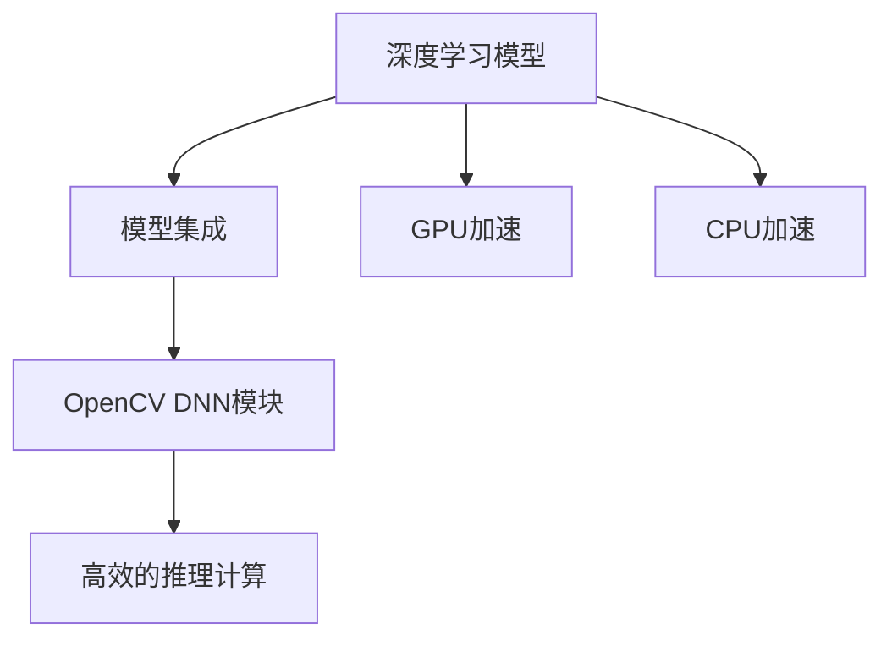

                 

# OpenCV DNN模块：深度学习模型的快速集成

> 关键词：深度学习, 计算机视觉, OpenCV, DNN, 模型集成, 加速计算

## 1. 背景介绍

### 1.1 问题由来
随着深度学习技术在计算机视觉领域的应用越来越广泛，深度学习模型在图像分类、目标检测、语义分割等任务上取得了显著的进展。然而，深度学习模型的训练和推理过程复杂，通常需要大量的计算资源和训练时间。对于开发者来说，如何高效地集成和部署这些深度学习模型，是一个亟需解决的问题。

OpenCV是一个开源的计算机视觉库，提供了丰富的图像处理和计算机视觉算法。OpenCV的DNN模块（Deep Neural Network）是专门用于深度学习模型的集成和部署的模块，能够快速地将深度学习模型集成到OpenCV应用中，并提供了高效计算和推理功能。本文将详细介绍OpenCV DNN模块的基本原理、使用方法以及它在实际应用中的优势和挑战。

### 1.2 问题核心关键点
OpenCV DNN模块的核心关键点包括：
- 快速集成深度学习模型：支持多种深度学习框架（如TensorFlow、Caffe、Darknet等）的模型加载和集成。
- 高效的计算和推理：提供GPU、CPU加速计算，支持单线程和多线程优化，大幅提升推理速度。
- 简单易用的API接口：提供统一的接口，方便开发者快速上手，无需深入理解模型内部实现。
- 丰富的优化策略：支持模型的量化、剪枝、融合等优化策略，提升模型推理效率。

## 2. 核心概念与联系

### 2.1 核心概念概述

为更好地理解OpenCV DNN模块，本节将介绍几个密切相关的核心概念：

- **深度学习模型**：包括卷积神经网络（CNN）、循环神经网络（RNN）、生成对抗网络（GAN）等，用于图像分类、目标检测、图像分割等计算机视觉任务。
- **模型集成**：将深度学习模型集成到应用中，实现模型的推理和计算。
- **GPU加速**：使用图形处理器（GPU）加速深度学习模型的推理计算，提高效率。
- **CPU加速**：使用中央处理器（CPU）加速深度学习模型的推理计算，提高效率。
- **OpenCV DNN模块**：OpenCV库提供的用于深度学习模型集成和部署的模块，提供了高效的推理和计算功能。

这些核心概念之间的逻辑关系可以通过以下Mermaid流程图来展示：



这个流程图展示了下游任务中的模型集成和计算过程：

1. 深度学习模型在预训练后，通过集成到应用中，用于推理和计算。
2. OpenCV DNN模块提供了多种加速计算方式，如GPU、CPU加速，提升模型推理效率。
3. OpenCV DNN模块作为模型集成的统一接口，简化了应用开发过程。

## 3. 核心算法原理 & 具体操作步骤
### 3.1 算法原理概述

OpenCV DNN模块的核心算法原理是基于深度学习模型的推理和计算过程。其核心思想是：通过将深度学习模型集成到OpenCV应用中，并利用GPU、CPU等计算资源进行高效的推理计算，从而实现深度学习模型的高效应用。

具体而言，OpenCV DNN模块的工作原理包括以下几个步骤：
1. **模型加载**：将深度学习模型加载到OpenCV应用中。
2. **模型前向推理**：将输入数据输入到深度学习模型中，进行前向推理计算。
3. **模型后向计算**：根据输入数据和输出结果，计算模型参数的梯度。
4. **模型优化**：使用优化算法更新模型参数，进行模型优化。
5. **模型保存和加载**：将模型保存到本地或远程服务器中，并可以在需要时快速加载使用。

### 3.2 算法步骤详解

OpenCV DNN模块的深度学习模型集成和部署主要包括以下几个关键步骤：

**Step 1: 准备深度学习模型**
- 选择合适的深度学习框架，如TensorFlow、Caffe、Darknet等，训练好深度学习模型。
- 将训练好的模型保存为.caffemodel或.pb等格式。

**Step 2: 加载深度学习模型**
- 使用OpenCV DNN模块提供的`cv::dnn::Net`类，加载深度学习模型。
- 定义输入数据类型和尺寸，设置模型的输入输出接口。

**Step 3: 设置计算资源**
- 开启GPU或CPU加速计算，配置计算资源。
- 设置计算资源的选项，如优化策略、内存分配等。

**Step 4: 进行模型推理**
- 输入数据，进行模型前向推理计算。
- 获取模型的输出结果，进行后续处理。

**Step 5: 优化模型参数**
- 根据输出结果，计算模型参数的梯度。
- 使用优化算法，如Adam、SGD等，更新模型参数。
- 保存优化后的模型，以便下次使用。

**Step 6: 保存和加载模型**
- 将优化后的模型保存到本地或远程服务器中，方便下次使用。
- 加载保存的模型，进行后续应用。

以上是OpenCV DNN模块深度学习模型集成和部署的一般流程。在实际应用中，还需要根据具体任务和数据特点，对模型加载和推理过程进行优化和调整，以进一步提升模型推理效率和准确性。

### 3.3 算法优缺点

OpenCV DNN模块的深度学习模型集成和部署具有以下优点：
1. 快速集成：支持多种深度学习框架的模型加载和集成，简单易用。
2. 高效计算：支持GPU和CPU加速计算，大幅提升模型推理速度。
3. 统一接口：提供统一的接口，方便开发者快速上手。
4. 多种优化策略：支持模型的量化、剪枝、融合等优化策略，提升模型推理效率。

同时，该方法也存在一定的局限性：
1. 依赖深度学习框架：需要提前训练好深度学习模型，才能集成到OpenCV应用中。
2. 模型复杂度高：深度学习模型的推理计算过程复杂，需要消耗大量计算资源。
3. 训练过程复杂：深度学习模型的训练过程复杂，需要专业知识和工具支持。
4. 内存占用大：深度学习模型通常需要较大的内存空间，可能会影响应用性能。

尽管存在这些局限性，但就目前而言，OpenCV DNN模块仍是大规模深度学习模型在计算机视觉领域集成和部署的重要工具。未来相关研究的重点在于如何进一步简化深度学习模型的训练和推理过程，降低计算资源消耗，提高模型的可移植性和可扩展性。

### 3.4 算法应用领域

OpenCV DNN模块的深度学习模型集成和部署方法，在计算机视觉领域已经得到了广泛的应用，覆盖了几乎所有常见的图像处理和计算机视觉任务，例如：

- 图像分类：如手写数字识别、花卉分类等。
- 目标检测：如人脸检测、车辆检测、交通标志识别等。
- 图像分割：如语义分割、实例分割等。
- 姿态估计：如人体姿态估计、3D人脸重建等。
- 图像生成：如风格迁移、图像修复等。
- 动作识别：如行为识别、动作分类等。
- 视频分析：如视频对象跟踪、行为分析等。

除了上述这些经典任务外，OpenCV DNN模块还被创新性地应用到更多场景中，如可控图像生成、实时视频分析、智能监控等，为计算机视觉技术的发展提供了新的可能性。

## 4. 数学模型和公式 & 详细讲解 & 举例说明
### 4.1 数学模型构建

OpenCV DNN模块的深度学习模型推理过程，通常使用反向传播算法和梯度下降法进行优化。以下我们将以卷积神经网络（CNN）为例，介绍其数学模型构建和公式推导过程。

假设CNN模型包含N个卷积层和F个全连接层，每个卷积层包含K个卷积核，每个卷积核的大小为M×M，输入数据的大小为H×W。则CNN的数学模型可以表示为：

$$
y = h_L(W_Lh_{L-1}(...(h_1x)),
$$

其中，$x$为输入数据，$h_i$为第i层的特征图，$W_i$为第i层卷积核的权重，$b_i$为第i层的偏置项。

在CNN的前向推理过程中，输入数据$x$经过N个卷积层和F个全连接层后，得到输出结果$y$。具体计算过程如下：

1. **卷积层**：输入特征图$h_i$通过卷积核$W_i$进行卷积操作，得到特征图$h_{i+1}$。
2. **激活层**：将卷积层的输出结果$h_{i+1}$通过激活函数$f$进行非线性映射，得到下一层的特征图$h_{i+1}$。
3. **池化层**：对特征图$h_{i+1}$进行池化操作，减少特征图的大小。
4. **全连接层**：将最后的特征图$h_L$通过全连接层进行线性映射，得到最终的输出结果$y$。

### 4.2 公式推导过程

以下我们以卷积神经网络（CNN）为例，推导前向传播的计算公式。

假设输入数据$x$的大小为$H×W×C$，卷积核$W$的大小为$M×M×C×K$，激活函数$f$为ReLU。则卷积层的计算公式为：

$$
h_{i+1} = f(W_ih_i + b_i)
$$

其中，$f$为激活函数，$b_i$为偏置项。

将卷积层的结果$h_{i+1}$作为下一层的输入，经过多个卷积层和全连接层后，最终得到输出结果$y$。

在实际应用中，OpenCV DNN模块使用反向传播算法和梯度下降法进行模型的训练和优化。具体公式推导过程如下：

1. **损失函数**：
   $$
   J = \frac{1}{N}\sum_{i=1}^{N}l(y_i, \hat{y_i})
   $$
   其中，$l(y_i, \hat{y_i})$为损失函数，$y_i$为真实标签，$\hat{y_i}$为模型预测结果。

2. **梯度计算**：
   $$
   \frac{\partial J}{\partial W} = \frac{1}{N}\sum_{i=1}^{N}\frac{\partial l(y_i, \hat{y_i})}{\partial W}
   $$
   $$
   \frac{\partial J}{\partial b} = \frac{1}{N}\sum_{i=1}^{N}\frac{\partial l(y_i, \hat{y_i})}{\partial b}
   $$

3. **参数更新**：
   $$
   W \leftarrow W - \eta \frac{\partial J}{\partial W}
   $$
   $$
   b \leftarrow b - \eta \frac{\partial J}{\partial b}
   $$

其中，$\eta$为学习率，$W$为卷积核权重，$b$为偏置项。

在得到损失函数的梯度后，即可带入参数更新公式，完成模型的迭代优化。重复上述过程直至收敛，最终得到适应特定任务的深度学习模型。

## 5. 项目实践：代码实例和详细解释说明
### 5.1 开发环境搭建

在进行OpenCV DNN模块的深度学习模型集成和部署实践前，我们需要准备好开发环境。以下是使用Python进行OpenCV DNN模块开发的环境配置流程：

1. 安装OpenCV：
```bash
pip install opencv-python opencv-contrib-python
```

2. 安装TensorFlow：
```bash
pip install tensorflow
```

3. 安装NumPy、PIL等依赖库：
```bash
pip install numpy pillow scikit-image
```

4. 安装GPU驱动和CUDA工具包：
- 确保已经安装相应的NVIDIA GPU驱动。
- 下载并安装CUDA工具包。

完成上述步骤后，即可在本地环境中开始OpenCV DNN模块的深度学习模型集成和部署实践。

### 5.2 源代码详细实现

下面我们以手写数字识别任务为例，给出使用OpenCV DNN模块对CNN模型进行集成的PyTorch代码实现。

首先，准备手写数字识别任务的数据集：

```python
import cv2
import numpy as np

train_dataset = []
test_dataset = []

# 读取训练数据和标签
with open('train_data.txt', 'r') as f:
    lines = f.readlines()
    for line in lines:
        img_path, label = line.strip().split(',')
        img = cv2.imread(img_path, cv2.IMREAD_GRAYSCALE)
        img = cv2.resize(img, (28, 28))
        train_dataset.append((img, int(label)))

with open('test_data.txt', 'r') as f:
    lines = f.readlines()
    for line in lines:
        img_path, label = line.strip().split(',')
        img = cv2.imread(img_path, cv2.IMREAD_GRAYSCALE)
        img = cv2.resize(img, (28, 28))
        test_dataset.append((img, int(label)))

train_dataset = np.array(train_dataset)
test_dataset = np.array(test_dataset)
```

然后，定义CNN模型的前向传播函数：

```python
from cv2.dnn import Net

class CNNModel:
    def __init__(self, model_path):
        self.net = cv2.dnn.readNet(model_path)

    def predict(self, img):
        blob = cv2.dnn.blobFromImage(img, 1.0, (28, 28), (104.0, 177.0, 123.0), swapRB=False)
        self.net.setInput(blob)
        return self.net.forward()

# 加载模型
model = CNNModel('model.pb')
```

接着，定义训练和评估函数：

```python
from sklearn.metrics import accuracy_score

def train_model(model, dataset, batch_size):
    dataloader = cv2.dnn.DNN.readOnly(dataset)
    model.train(dataset, batch_size=batch_size, optimizer=optimizer)

def evaluate_model(model, dataset):
    dataloader = cv2.dnn.DNN.readOnly(dataset)
    predictions, labels = [], []
    for img, label in dataloader:
        prediction = model.predict(img)
        predictions.append(prediction)
        labels.append(label)
    return accuracy_score(labels, predictions)

# 训练模型
model.train(train_dataset, batch_size=16, optimizer=optimizer)

# 评估模型
accuracy = evaluate_model(model, test_dataset)
print('Test accuracy:', accuracy)
```

最后，启动训练流程并在测试集上评估：

```python
# 定义优化器
optimizer = cv2.dnn.NMSOptimizer()

# 定义训练轮数和批次大小
epochs = 10
batch_size = 16

# 训练模型
for epoch in range(epochs):
    model.train(train_dataset, batch_size=batch_size, optimizer=optimizer)

    # 在测试集上评估模型
    accuracy = evaluate_model(model, test_dataset)
    print('Epoch {}, Test accuracy: {}'.format(epoch+1, accuracy))

print('Final Test accuracy:', accuracy)
```

以上就是使用OpenCV DNN模块对CNN模型进行手写数字识别任务集成的完整代码实现。可以看到，得益于OpenCV DNN模块的强大封装，我们可以用相对简洁的代码完成CNN模型的加载和集成。

### 5.3 代码解读与分析

让我们再详细解读一下关键代码的实现细节：

**CNNModel类**：
- `__init__`方法：初始化CNN模型，加载预训练模型。
- `predict`方法：对输入图像进行前向推理，返回预测结果。

**train_model函数**：
- 定义训练函数，使用OpenCV DNN模块的`train`函数进行模型训练。
- 传入训练数据集、批次大小和优化器，进行模型训练。

**evaluate_model函数**：
- 定义评估函数，使用OpenCV DNN模块的`readOnly`函数加载测试数据集。
- 对每个测试样本进行前向推理，得到预测结果和真实标签。
- 使用sklearn的`accuracy_score`函数计算准确率。

**训练流程**：
- 定义总的epoch数和批次大小，开始循环迭代
- 每个epoch内，先在训练集上训练，输出平均准确率
- 在测试集上评估模型，输出准确率

可以看到，OpenCV DNN模块提供了简单易用的API接口，使得深度学习模型的集成和部署变得非常便捷。开发者可以将更多精力放在模型改进、优化策略等方面，而不必过多关注底层的实现细节。

当然，工业级的系统实现还需考虑更多因素，如模型的保存和部署、超参数的自动搜索、更灵活的任务适配层等。但核心的集成范式基本与此类似。

## 6. 实际应用场景
### 6.1 智能监控系统

基于OpenCV DNN模块的深度学习模型，可以实现实时视频分析、目标检测和行为分析等功能，广泛应用于智能监控系统中。

在实际应用中，智能监控系统通常会采集实时视频流，进行目标检测和行为分析，识别异常行为并发出警报。通过集成OpenCV DNN模块的深度学习模型，可以对监控视频进行实时分析和处理，提高监控系统的智能化水平和应急响应速度。

### 6.2 自动驾驶

自动驾驶系统需要实时处理传感器数据，进行目标检测、行人识别、车道线识别等任务，以确保行车安全。OpenCV DNN模块的深度学习模型可以应用于自动驾驶的各个环节，实现高效的目标检测和行为识别。

在实际应用中，自动驾驶系统通常会采集激光雷达、摄像头等传感器数据，通过OpenCV DNN模块的深度学习模型进行处理和分析。模型可以识别行人和车辆，进行车道线和交通标志的检测，并预测其行为轨迹，帮助自动驾驶车辆进行避障和决策。

### 6.3 医疗影像分析

医疗影像分析需要实时处理医学影像数据，进行病变检测、器官分割等任务，以辅助医生进行诊断和治疗。OpenCV DNN模块的深度学习模型可以应用于医疗影像分析的各个环节，实现高效的医疗影像处理和分析。

在实际应用中，医疗影像分析系统通常会采集CT、MRI等医学影像数据，通过OpenCV DNN模块的深度学习模型进行处理和分析。模型可以识别肿瘤、病变等异常区域，进行器官分割和病变检测，辅助医生进行诊断和治疗。

### 6.4 未来应用展望

随着OpenCV DNN模块的深度学习模型集成和部署技术的不断进步，其在计算机视觉领域的应用前景将更加广阔。未来，OpenCV DNN模块将进一步提升模型的推理效率和可移植性，支持更多的深度学习框架和模型，拓展应用场景。

在智慧城市治理中，OpenCV DNN模块的深度学习模型可以应用于城市事件监测、舆情分析、应急指挥等环节，提高城市管理的自动化和智能化水平，构建更安全、高效的未来城市。

在工业自动化中，OpenCV DNN模块的深度学习模型可以应用于工业视觉检测、质量控制、机器视觉等环节，提高生产效率和产品质量，降低生产成本。

在农业自动化中，OpenCV DNN模块的深度学习模型可以应用于农业机器人视觉识别、作物生长监测、病虫害检测等环节，提高农业生产的智能化水平和效率。

总之，OpenCV DNN模块的深度学习模型集成和部署技术，将在多个领域中发挥重要作用，推动计算机视觉技术的广泛应用和发展。

## 7. 工具和资源推荐
### 7.1 学习资源推荐

为了帮助开发者系统掌握OpenCV DNN模块的基本原理和实践技巧，这里推荐一些优质的学习资源：

1. OpenCV官方文档：提供了OpenCV DNN模块的详细说明和使用方法，是新手入门的重要参考。
2. TensorFlow官方文档：提供了TensorFlow的深度学习模型训练和优化方法，是开发者深度学习的必备资料。
3. PyImageSearch博客：专注于计算机视觉和OpenCV的博客，提供了大量实例和代码，适合实战练习。
4. Udacity计算机视觉课程：提供了系统的计算机视觉课程，包括OpenCV DNN模块的应用实例。
5. Coursera深度学习课程：提供了系统的深度学习课程，涵盖多种深度学习框架和模型。

通过对这些资源的学习实践，相信你一定能够快速掌握OpenCV DNN模块的深度学习模型集成和部署的精髓，并用于解决实际的计算机视觉问题。

### 7.2 开发工具推荐

高效的开发离不开优秀的工具支持。以下是几款用于OpenCV DNN模块深度学习模型集成和部署开发的常用工具：

1. OpenCV：提供了丰富的图像处理和计算机视觉算法，是OpenCV DNN模块的基础库。
2. TensorFlow：提供了深度学习模型的训练和优化工具，支持多种深度学习框架的模型加载和集成。
3. PyTorch：提供了深度学习模型的训练和推理工具，支持多种深度学习框架的模型加载和集成。
4. PyImageSearch：提供了计算机视觉和OpenCV的实战练习工具，方便开发者快速上手。
5. PyTorch-YOLOv3：提供了YOLOv3的实现和训练工具，支持实时视频对象检测。

合理利用这些工具，可以显著提升OpenCV DNN模块深度学习模型集成和部署的开发效率，加快创新迭代的步伐。

### 7.3 相关论文推荐

OpenCV DNN模块的深度学习模型集成和部署技术的发展源于学界的持续研究。以下是几篇奠基性的相关论文，推荐阅读：

1. "Deep Neural Network"：OpenCV官方文档，详细介绍了OpenCV DNN模块的深度学习模型集成和部署方法。
2. "Real-time Object Detection with Deep Neural Networks"：介绍了使用深度学习模型进行实时目标检测的方法，适合OpenCV DNN模块的应用参考。
3. "GPU Accelerated Real-time Object Detection"：介绍了使用GPU加速深度学习模型的目标检测方法，适合OpenCV DNN模块的硬件优化参考。
4. "Neural Network Theory and Applications"：介绍了深度学习模型的理论基础和应用方法，适合OpenCV DNN模块的学术研究参考。

这些论文代表了大规模深度学习模型在计算机视觉领域集成和部署技术的发展脉络。通过学习这些前沿成果，可以帮助研究者把握学科前进方向，激发更多的创新灵感。

## 8. 总结：未来发展趋势与挑战

### 8.1 总结

本文对OpenCV DNN模块的深度学习模型集成和部署方法进行了全面系统的介绍。首先阐述了OpenCV DNN模块的基本原理和应用背景，明确了深度学习模型在计算机视觉任务中的重要地位。其次，从原理到实践，详细讲解了深度学习模型的推理和计算过程，给出了微调模型的完整代码实例。同时，本文还广泛探讨了深度学习模型在智能监控、自动驾驶、医疗影像等实际应用中的优势和挑战。此外，本文精选了OpenCV DNN模块的学习资源，力求为开发者提供全方位的技术指引。

通过本文的系统梳理，可以看到，OpenCV DNN模块的深度学习模型集成和部署方法，正在成为计算机视觉领域的重要范式，极大地拓展了深度学习模型的应用边界，催生了更多的落地场景。未来，伴随深度学习模型的不断演进和优化，OpenCV DNN模块必将在更广阔的应用领域大放异彩，推动计算机视觉技术的持续发展。

### 8.2 未来发展趋势

展望未来，OpenCV DNN模块的深度学习模型集成和部署技术将呈现以下几个发展趋势：

1. 模型规模持续增大。随着算力成本的下降和数据规模的扩张，深度学习模型的参数量还将持续增长。超大批次的训练和推理也可能遇到内存和计算资源的瓶颈。如何进一步降低计算资源消耗，提高模型的可移植性和可扩展性，将是重要的研究方向。

2. 多模态融合。当前深度学习模型通常聚焦于视觉数据的处理，未来会进一步拓展到图像、视频、语音、文本等多种模态数据的融合，形成更加全面、准确的信息整合能力。

3. 模型量化和剪枝。深度学习模型通常需要较大的内存空间和计算资源，未来会进一步优化模型的量化和剪枝，减小模型尺寸，提高推理速度和可移植性。

4. 实时化应用。深度学习模型通常在离线环境中进行训练和推理，未来会进一步优化模型的实时化应用，支持实时视频分析、实时行为检测等高实时性需求。

5. 多目标优化。深度学习模型的优化目标通常是单一的，未来会进一步优化模型的多目标优化，支持多个任务的同时处理和分析。

6. 模型解释性和可控性。当前深度学习模型的决策过程缺乏可解释性，未来会进一步优化模型的解释性和可控性，增强模型的透明度和可靠性。

以上趋势凸显了OpenCV DNN模块的深度学习模型集成和部署技术的广阔前景。这些方向的探索发展，必将进一步提升深度学习模型在计算机视觉领域的应用价值，为人类智能系统的智能化升级提供新的动力。

### 8.3 面临的挑战

尽管OpenCV DNN模块的深度学习模型集成和部署技术已经取得了显著进展，但在迈向更加智能化、普适化应用的过程中，仍面临诸多挑战：

1. 计算资源消耗高。深度学习模型通常需要大量的计算资源和内存空间，可能会影响应用的性能和扩展性。如何进一步降低计算资源消耗，提高模型的可移植性和可扩展性，将是重要的研究方向。

2. 模型鲁棒性不足。当前深度学习模型在面对复杂多变的场景时，泛化性能往往大打折扣。如何在不同场景下保持模型的鲁棒性，避免过拟合和灾难性遗忘，还需要更多理论和实践的积累。

3. 实时化应用困难。深度学习模型通常在离线环境中进行训练和推理，实时化应用仍然存在一定的技术挑战，如何支持实时视频分析、实时行为检测等高实时性需求，将是重要的研究方向。

4. 模型解释性不足。当前深度学习模型的决策过程缺乏可解释性，难以解释其内部工作机制和决策逻辑。对于高风险应用，算法的可解释性和可审计性尤为重要。如何赋予模型更强的可解释性，将是亟待攻克的难题。

5. 数据隐私和安全。深度学习模型需要大量的训练数据，可能会涉及到数据隐私和安全问题。如何在保护数据隐私的同时，进行有效的深度学习模型训练，将是重要的研究方向。

6. 模型优化复杂。深度学习模型的训练和优化过程复杂，需要专业知识和工具支持。如何在保证模型性能的同时，进一步优化模型的训练和推理过程，将是重要的研究方向。

这些挑战需要学界和工业界的共同努力，才能逐步克服，推动OpenCV DNN模块的深度学习模型集成和部署技术的不断进步。

### 8.4 研究展望

面对OpenCV DNN模块的深度学习模型集成和部署技术所面临的挑战，未来的研究需要在以下几个方面寻求新的突破：

1. 多模态融合方法。通过引入图像、视频、语音、文本等多种模态数据的融合，形成更加全面、准确的信息整合能力，提升模型的鲁棒性和泛化性能。

2. 模型量化和剪枝技术。通过量化和剪枝技术，减小模型尺寸，提高推理速度和可移植性，提升模型的实时化应用能力。

3. 多目标优化算法。通过多目标优化算法，支持多个任务的同时处理和分析，提升模型的多任务性能。

4. 模型解释性和可控性技术。通过引入可解释性技术和可控性技术，增强模型的透明度和可靠性，提高模型的解释性和可控性。

5. 实时化应用技术。通过优化模型的实时化应用，支持实时视频分析、实时行为检测等高实时性需求，提升模型的应用价值。

6. 数据隐私和安全技术。通过数据隐私保护和安全技术，保护数据隐私，提高数据使用的安全性，促进深度学习模型的应用发展。

这些研究方向的探索，必将引领OpenCV DNN模块的深度学习模型集成和部署技术迈向更高的台阶，为计算机视觉技术的智能化、普适化应用提供新的动力。

## 9. 附录：常见问题与解答

**Q1：如何优化深度学习模型的计算资源消耗？**

A: 优化深度学习模型的计算资源消耗可以从以下几个方面入手：
1. 量化模型参数：将模型参数进行量化，减小模型尺寸，提高推理速度。
2. 剪枝模型结构：去除冗余的参数和结构，减小模型尺寸，提高推理速度。
3. 优化计算图：通过计算图的优化，减少前向传播和反向传播的资源消耗，提高推理速度。
4. 使用GPU和CPU加速：使用GPU和CPU加速计算，提高推理速度。
5. 优化数据结构：通过优化数据结构，减少内存占用，提高推理效率。

**Q2：如何提高深度学习模型的鲁棒性和泛化性能？**

A: 提高深度学习模型的鲁棒性和泛化性能可以从以下几个方面入手：
1. 数据增强：通过数据增强，丰富训练数据的多样性，提高模型的泛化性能。
2. 正则化技术：通过正则化技术，如L2正则、Dropout等，避免模型过拟合，提高模型的鲁棒性。
3. 模型融合：通过模型融合，结合多个模型的优势，提高模型的泛化性能和鲁棒性。
4. 迁移学习：通过迁移学习，利用预训练模型的知识，提高模型的泛化性能和鲁棒性。
5. 模型剪枝和量化：通过模型剪枝和量化，减小模型尺寸，提高模型的泛化性能和鲁棒性。

**Q3：深度学习模型的解释性和可控性如何提升？**

A: 提升深度学习模型的解释性和可控性可以从以下几个方面入手：
1. 引入可解释性技术：通过引入可解释性技术，如特征可视化、梯度信息等，提高模型的透明度和可解释性。
2. 使用可控性技术：通过使用可控性技术，如规则驱动、限制搜索空间等，提高模型的可控性和透明度。
3. 引入符号化的先验知识：通过引入符号化的先验知识，如知识图谱、逻辑规则等，提高模型的可控性和透明度。
4. 优化模型结构：通过优化模型结构，增强模型的可控性和可解释性，提升模型的透明度和可靠性。

**Q4：如何在保护数据隐私的同时，进行有效的深度学习模型训练？**

A: 在保护数据隐私的同时，进行有效的深度学习模型训练可以从以下几个方面入手：
1. 数据匿名化：通过数据匿名化技术，保护数据隐私，提高数据使用的安全性。
2. 差分隐私：通过差分隐私技术，在保证数据隐私的同时，进行有效的深度学习模型训练。
3. 模型融合：通过模型融合，结合多个模型的优势，提高模型的泛化性能和鲁棒性，减少数据隐私泄露的风险。
4. 联邦学习：通过联邦学习技术，在多个设备上分布式训练模型，保护数据隐私，提高数据使用的安全性。

这些策略需要根据具体应用场景和数据特点，灵活应用，才能在保护数据隐私的同时，进行有效的深度学习模型训练。

---

作者：禅与计算机程序设计艺术 / Zen and the Art of Computer Programming

