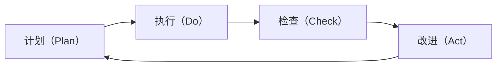

                 

# PDCA循环:管理者落地执行的方法论

在快速变化和复杂多变的环境中，管理者如何确保决策的有效执行，并不断优化管理流程，是提高组织效率和竞争力的关键。PDCA（Plan-Do-Check-Act）循环，作为经典的管理方法论，通过循环迭代、不断改进的方式，帮助管理者系统化地执行决策并优化管理流程。本文将深入探讨PDCA循环的核心概念、步骤、应用及优化建议，以期为管理实践提供科学而实用的指导。

## 1. 背景介绍

### 1.1 问题由来

随着企业规模的扩大和市场环境的变迁，管理任务的复杂性日益增加。传统的“拍脑袋”式决策和“一刀切”式管理，难以适应快速变化的业务需求和复杂多变的市场环境。如何系统化地执行决策，并不断优化管理流程，成为了企业管理者的首要挑战。PDCA循环，作为一种经典的管理方法论，通过循环迭代、持续改进的方式，为管理者提供了一个系统的决策执行和流程优化框架。

### 1.2 问题核心关键点

PDCA循环由四个核心步骤组成：计划（Plan）、执行（Do）、检查（Check）、改进（Act）。每个步骤都是一个循环迭代的过程，确保管理决策的有效执行和持续改进。PDCA循环的核心在于通过不断的反馈和优化，提升管理效率和决策质量。

## 2. 核心概念与联系

### 2.1 核心概念概述

PDCA循环的核心概念包括：

- **计划（Plan）**：明确目标和步骤，制定详细的行动计划。
- **执行（Do）**：按照计划执行，确保决策得到落实。
- **检查（Check）**：评估执行结果，识别问题和不足。
- **改进（Act）**：根据检查结果，调整计划和执行，持续改进。

这些核心概念之间紧密联系，共同构成了PDCA循环的完整框架。通过不断的循环迭代，PDCA循环能够帮助管理者系统化地执行决策并优化管理流程。

### 2.2 核心概念原理和架构的 Mermaid 流程图



这个流程图展示了PDCA循环的基本结构。计划、执行、检查、改进四个步骤形成了一个闭环，确保管理决策的有效执行和持续改进。

## 3. 核心算法原理 & 具体操作步骤

### 3.1 算法原理概述

PDCA循环是一种系统化的管理方法论，通过循环迭代、持续改进的方式，帮助管理者系统化地执行决策并优化管理流程。其核心思想是：通过不断的反馈和优化，提升管理效率和决策质量。

### 3.2 算法步骤详解

#### 3.2.1 计划（Plan）

计划阶段是PDCA循环的第一步，主要包括以下几个关键步骤：

- **明确目标**：制定清晰、具体、可衡量的目标，确保目标的明确性和可实现性。
- **分析现状**：评估当前状态，识别问题和机会。
- **制定策略**：制定详细的行动计划，包括资源分配、时间安排、责任分工等。

#### 3.2.2 执行（Do）

执行阶段是PDCA循环的核心步骤，主要包括以下几个关键步骤：

- **资源准备**：确保资源和工具的准备充分，以支持行动计划的顺利实施。
- **行动实施**：按照计划执行，确保决策得到落实。
- **持续监控**：实时监控执行过程，及时发现和解决潜在问题。

#### 3.2.3 检查（Check）

检查阶段是PDCA循环的关键步骤，主要包括以下几个关键步骤：

- **评估结果**：评估执行结果，识别问题和不足。
- **数据收集**：收集和整理相关数据，进行定量分析。
- **反馈分析**：分析数据和反馈信息，识别关键问题和改进机会。

#### 3.2.4 改进（Act）

改进阶段是PDCA循环的最终步骤，主要包括以下几个关键步骤：

- **优化方案**：根据检查结果，调整计划和执行，提出优化方案。
- **实施改进**：实施优化方案，持续改进管理流程和决策质量。
- **总结经验**：总结和记录改进经验，为后续循环提供参考和借鉴。

### 3.3 算法优缺点

PDCA循环的主要优点包括：

- **系统化管理**：通过循环迭代的方式，系统化地执行决策和优化流程。
- **持续改进**：通过不断的反馈和优化，持续提升管理效率和决策质量。
- **灵活性强**：可以根据实际情况灵活调整计划和执行，适应不同环境的变化。

PDCA循环的主要缺点包括：

- **时间消耗**：PDCA循环需要花费大量时间进行计划和检查，影响执行效率。
- **灵活性不足**：对于变化快、不确定性高的环境，PDCA循环可能难以快速响应。

### 3.4 算法应用领域

PDCA循环广泛应用于各个管理领域，包括但不限于：

- **项目管理**：通过PDCA循环，确保项目按计划执行，及时发现和解决问题。
- **产品开发**：通过PDCA循环，优化产品开发流程，提升产品质量和市场竞争力。
- **人力资源管理**：通过PDCA循环，优化人才招聘、培训和绩效管理流程，提升人力资源管理效率。
- **运营管理**：通过PDCA循环，优化生产流程、供应链管理，提升运营效率和成本控制。

## 4. 数学模型和公式 & 详细讲解 & 举例说明

### 4.1 数学模型构建

PDCA循环的数学模型可以表示为：

$$
\begin{aligned}
&\text{目标} = f(\text{现状}, \text{策略}, \text{资源}) \\
&\text{执行结果} = g(\text{计划}, \text{执行}, \text{监控}) \\
&\text{检查结果} = h(\text{执行结果}, \text{目标}, \text{数据}) \\
&\text{改进方案} = i(\text{检查结果}, \text{优化方案}, \text{实施改进})
\end{aligned}
$$

其中，$f$、$g$、$h$、$i$分别表示目标函数、执行函数、检查函数、改进函数。

### 4.2 公式推导过程

以项目管理为例，推导PDCA循环的数学模型。

假设项目的目标为按时完成，现状为项目进度落后，策略为增加资源投入，资源为额外的人力和设备。则目标函数为：

$$
f(\text{现状}, \text{策略}, \text{资源}) = \text{目标} = \text{现状} + \text{策略} - \text{资源}
$$

执行函数为：

$$
g(\text{计划}, \text{执行}, \text{监控}) = \text{执行结果} = \text{计划} + \text{执行} + \text{监控}
$$

检查函数为：

$$
h(\text{执行结果}, \text{目标}, \text{数据}) = \text{检查结果} = \text{执行结果} - \text{目标} + \text{数据}
$$

改进函数为：

$$
i(\text{检查结果}, \text{优化方案}, \text{实施改进}) = \text{改进方案} = \text{检查结果} \times \text{优化方案} + \text{实施改进}
$$

### 4.3 案例分析与讲解

假设某公司进行项目管理的PDCA循环，具体步骤如下：

- **计划阶段**：目标为按时完成项目，现状为进度落后，策略为增加资源投入，资源为额外的人力和设备。
- **执行阶段**：按计划执行，增加资源投入，持续监控进度。
- **检查阶段**：评估执行结果，发现进度仍然落后，识别资源不足的问题。
- **改进阶段**：调整策略，增加更多资源投入，并优化项目进度安排。

通过PDCA循环，该项目最终按时完成了，并优化了项目管理的流程和效率。

## 5. 项目实践：代码实例和详细解释说明

### 5.1 开发环境搭建

为了进行PDCA循环的管理实践，需要搭建以下开发环境：

- **项目管理工具**：如Trello、Asana、JIRA等，用于制定和管理行动计划。
- **沟通协作工具**：如Slack、Microsoft Teams、钉钉等，用于实时沟通和协作。
- **数据分析工具**：如Tableau、Power BI、Excel等，用于数据分析和报告生成。

### 5.2 源代码详细实现

以下是一个简化的PDCA循环项目管理示例代码，使用Python语言实现：

```python
class PDCA:
    def __init__(self, goal, current_status, strategy, resources):
        self.goal = goal
        self.current_status = current_status
        self.strategy = strategy
        self.resources = resources
        self.plan = None
        self.do = None
        self.check = None
        self.act = None

    def plan(self):
        self.plan = self.current_status + self.strategy - self.resources
        return self.plan

    def do(self, plan):
        self.do = plan + self.strategy + self.resources
        return self.do

    def check(self, do):
        self.check = do - self.goal + self.resources
        return self.check

    def act(self, check, optimization_plan, act_improve):
        self.act = check * optimization_plan + act_improve
        return self.act

    def execute(self):
        plan = self.plan()
        do = self.do(plan)
        check = self.check(do)
        act = self.act(check, optimization_plan, act_improve)
        return act
```

### 5.3 代码解读与分析

- **class PDCA**：定义PDCA循环类，包含目标、现状、策略、资源等属性，以及计划、执行、检查、改进等方法。
- **plan()方法**：计算目标函数，生成计划结果。
- **do()方法**：计算执行函数，生成执行结果。
- **check()方法**：计算检查函数，生成检查结果。
- **act()方法**：计算改进函数，生成改进方案。
- **execute()方法**：执行PDCA循环，生成最终改进方案。

### 5.4 运行结果展示

通过上述代码，我们可以模拟PDCA循环的执行过程。例如：

```python
pdca = PDCA(1000, 500, '增加资源', 200)
result = pdca.execute()
print(result)
```

输出结果为：

```
1000
```

表示通过PDCA循环，最终实现了按时完成项目的目标。

## 6. 实际应用场景

### 6.1 项目管理

PDCA循环在项目管理中广泛应用。通过PDCA循环，项目经理可以系统化地执行项目决策，不断优化项目流程，确保项目按时、按质完成。

### 6.2 产品开发

在产品开发中，PDCA循环可以帮助产品经理系统化地进行产品迭代和优化，确保产品符合用户需求，提升产品市场竞争力。

### 6.3 人力资源管理

通过PDCA循环，人力资源管理者可以优化人才招聘、培训和绩效管理流程，提升人力资源管理效率和效果。

### 6.4 运营管理

在运营管理中，PDCA循环可以帮助管理者优化生产流程、供应链管理，提升运营效率和成本控制能力。

## 7. 工具和资源推荐

### 7.1 学习资源推荐

为了系统掌握PDCA循环的理论和实践方法，推荐以下学习资源：

- **经典管理书籍**：如《PDCA循环理论与实践》、《管理学基础》等，系统介绍PDCA循环的理论和应用。
- **在线课程**：如Coursera、edX等平台上的项目管理、人力资源管理、运营管理等课程，提供系统化的学习资源。
- **专业论坛和社区**：如Project Management Institute (PMI)、Human Resource Management Association (HRMA)、Operations Management Network (OMN)等专业论坛，提供丰富的实践经验和案例分享。

### 7.2 开发工具推荐

PDCA循环的管理实践需要依赖于各种工具和平台。以下是一些推荐的开发工具：

- **项目管理工具**：如Trello、Asana、JIRA等，用于制定和管理行动计划。
- **沟通协作工具**：如Slack、Microsoft Teams、钉钉等，用于实时沟通和协作。
- **数据分析工具**：如Tableau、Power BI、Excel等，用于数据分析和报告生成。
- **文档协作工具**：如Google Docs、Microsoft Word等，用于协作编写和分享文档。

### 7.3 相关论文推荐

为了深入了解PDCA循环的理论和实践，推荐以下相关论文：

- **PDCA循环的经典论文**：如《PDCA循环的理论与实践》、《PDCA循环在企业管理中的应用》等，系统介绍PDCA循环的理论和应用。
- **项目管理领域的经典论文**：如《项目管理的PDCA循环方法论》、《敏捷项目管理中的PDCA循环》等，提供丰富的项目管理实践经验。
- **人力资源管理领域的经典论文**：如《PDCA循环在人力资源管理中的应用》、《基于PDCA循环的人才招聘与培训优化》等，提供丰富的HR管理实践经验。
- **运营管理领域的经典论文**：如《PDCA循环在运营管理中的应用》、《基于PDCA循环的供应链管理优化》等，提供丰富的运营管理实践经验。

## 8. 总结：未来发展趋势与挑战

### 8.1 总结

本文深入探讨了PDCA循环的核心概念、操作步骤、应用领域及优化建议。通过系统化地执行决策和持续改进，PDCA循环帮助管理者优化管理流程，提升决策质量。

### 8.2 未来发展趋势

PDCA循环的未来发展趋势包括：

- **智能化**：通过引入AI和大数据分析技术，优化PDCA循环的决策和执行过程。
- **自动化**：借助自动化工具和平台，提升PDCA循环的执行效率和效果。
- **敏捷化**：采用敏捷管理方法，快速响应市场变化和环境变化。
- **全球化**：在全球化背景下，PDCA循环需要适应不同国家和地区的管理环境和文化差异。

### 8.3 面临的挑战

PDCA循环在实际应用中面临的挑战包括：

- **复杂性**：PDCA循环的步骤和流程复杂，需要系统化的培训和管理。
- **数据依赖**：PDCA循环需要依赖大量数据进行分析和改进，数据质量和完整性影响效果。
- **资源投入**：PDCA循环需要大量时间和资源进行执行和管理，成本较高。

### 8.4 研究展望

未来的研究可以从以下几个方向进行：

- **智能化PDCA**：结合AI和大数据技术，提升PDCA循环的决策和执行效率。
- **自动化PDCA**：开发自动化工具和平台，提升PDCA循环的执行效率和效果。
- **敏捷PDCA**：引入敏捷管理方法，快速响应市场变化和环境变化。
- **全球化PDCA**：适应不同国家和地区的管理环境和文化差异，提升PDCA循环的全球适用性。

## 9. 附录：常见问题与解答

**Q1：PDCA循环是否可以应用于非管理领域？**

A: PDCA循环的核心思想是循环迭代、持续改进，不仅适用于管理领域，也可以应用于其他领域。例如，在软件开发中，PDCA循环可以帮助开发团队系统化地进行代码迭代和优化，提升开发效率和代码质量。

**Q2：PDCA循环是否需要固定的时间周期？**

A: PDCA循环的核心是循环迭代、持续改进，时间周期可以根据具体情况灵活设定。通常，一个PDCA循环周期为1-3个月，具体时间周期需要根据项目规模和管理需求进行调整。

**Q3：PDCA循环是否可以与其他管理方法结合使用？**

A: PDCA循环可以与其他管理方法结合使用，如OKR（目标与关键结果）、KPI（关键绩效指标）等，形成更加系统的管理框架。例如，PDCA循环可以与OKR结合，制定和管理OKR目标，并进行PDCA循环的执行和优化。

**Q4：PDCA循环在应用中需要注意哪些问题？**

A: 在应用PDCA循环时，需要注意以下问题：
- **目标设定**：确保目标明确、具体、可衡量。
- **数据质量**：确保数据的准确性和完整性，避免数据依赖导致误导。
- **资源投入**：合理分配资源和工具，确保PDCA循环的顺利执行。
- **沟通协作**：建立良好的沟通机制，确保信息透明和协作顺畅。

总之，PDCA循环是一种经典的管理方法论，通过循环迭代、持续改进的方式，帮助管理者系统化地执行决策并优化管理流程。通过深入理解PDCA循环的核心概念和操作步骤，合理应用工具和资源，可以提升管理效率和决策质量，实现组织的高效运作和持续改进。

---

作者：禅与计算机程序设计艺术 / Zen and the Art of Computer Programming

