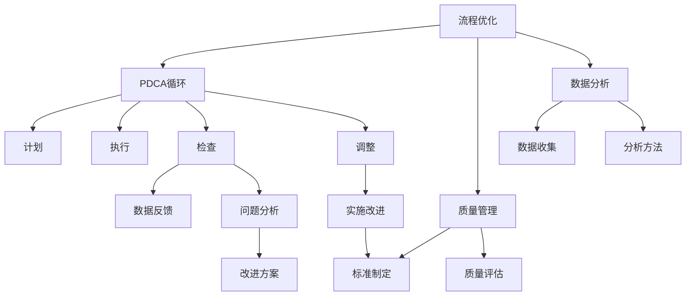

                 

# PDCA循环在流程优化中的作用

## 1. 背景介绍

### 1.1 问题由来

在现代企业的运营过程中，流程管理是一个至关重要的环节。有效的流程管理能够提升企业的效率和竞争力，而流程优化的持续进行则是确保流程高效运转的关键。然而，由于流程涉及环节众多，影响因素复杂，流程优化工作往往面临诸多挑战。这时，PDCA循环（Plan-Do-Check-Act）作为一种系统性的流程优化方法，便显得尤为重要。

PDCA循环由美国质量管理专家戴明（W. Edwards Deming）提出，旨在通过不断循环改进，逐步提升流程效率。其核心理念是在一个持续改进的周期中，通过计划（Plan）、执行（Do）、检查（Check）和调整（Act）四个阶段，不断优化流程，解决潜在问题和不足。

### 1.2 问题核心关键点

PDCA循环能够帮助企业在流程优化过程中实现以下几个核心目标：

1. **目标明确化**：在计划阶段，明确流程优化的具体目标和实施步骤，使整个优化过程有据可依，减少盲目性。
2. **执行规范化**：在执行阶段，确保流程的实施按计划进行，减少人为干预和操作失误。
3. **问题暴露**：在检查阶段，通过数据收集和分析，及时发现流程中的问题和瓶颈，避免问题积累。
4. **持续改进**：在调整阶段，根据检查结果，对流程进行持续优化和调整，逐步实现流程的改进和升级。

这些核心目标的实现，使得PDCA循环成为流程优化的有力工具。

## 2. 核心概念与联系

### 2.1 核心概念概述

为更好地理解PDCA循环在流程优化中的作用，本节将介绍几个密切相关的核心概念：

- PDCA循环：一种系统性的流程优化方法，通过不断循环改进，逐步提升流程效率。包括计划（Plan）、执行（Do）、检查（Check）和调整（Act）四个阶段。
- 流程优化：通过对流程进行设计和改进，以提高效率、减少浪费、提升质量和降低成本。
- 质量管理：通过标准化的流程和持续改进的方法，确保产品或服务的质量达到或超过客户期望。
- 数据分析：通过数据收集、分析和反馈，为流程优化提供依据和支持。
- 持续改进：通过不断的PDCA循环，实现流程的持续优化和提升。

这些核心概念之间的逻辑关系可以通过以下Mermaid流程图来展示：



这个流程图展示了这个体系中各个概念之间的联系：

1. 流程优化作为整个体系的目标，通过PDCA循环来实现。
2. 质量管理与数据分析是流程优化的重要支撑，确保优化的效果和数据的准确性。
3. PDCA循环中的计划、执行、检查和调整四个阶段，保证了流程优化的持续改进和高效执行。

## 3. 核心算法原理 & 具体操作步骤

### 3.1 算法原理概述

PDCA循环的四个阶段可以概括为：

1. **计划（Plan）**：在执行任何优化活动之前，明确流程优化的目标、方法、步骤和时间表。
2. **执行（Do）**：按照计划实施流程优化措施，确保每个步骤按预期进行。
3. **检查（Check）**：收集和分析执行过程中的数据，评估优化措施的效果。
4. **调整（Act）**：根据检查结果，调整优化措施，确保其有效性。

这个循环是不断重复的，每一轮循环结束时，都会对流程进行一次全面的优化和改进。

### 3.2 算法步骤详解

PDCA循环的具体操作步骤如下：

1. **初始化PDCA循环**
   - 确定流程优化的目标和范围。
   - 组建跨职能团队，明确团队成员的职责和分工。

2. **计划阶段（Plan）**
   - 收集现有流程数据，分析流程瓶颈和问题。
   - 制定优化方案，包括措施、时间表和责任人。
   - 进行试点测试，评估方案的可行性。

3. **执行阶段（Do）**
   - 按照优化方案实施试点测试，记录执行过程和结果。
   - 确保所有团队成员理解和遵守优化措施。
   - 解决执行过程中出现的任何问题。

4. **检查阶段（Check）**
   - 收集试点测试的数据，进行分析和评估。
   - 比较试点测试结果与预期目标，识别优化效果。
   - 识别新的问题和机会，为下一轮优化提供参考。

5. **调整阶段（Act）**
   - 根据检查结果，对优化方案进行修订和改进。
   - 实施修订后的优化方案，进行全面的流程优化。
   - 进行后续的试点测试和评估，确保优化效果持续改进。

6. **反馈和持续改进**
   - 将试点测试和持续优化过程中收集的数据进行分析。
   - 更新流程优化目标和计划，进行下一轮PDCA循环。

### 3.3 算法优缺点

PDCA循环在流程优化中的优点包括：

1. **系统性**：通过四个阶段的循环，确保流程优化的全面性和持续性。
2. **可控性**：每个阶段都有明确的执行步骤和责任人，使得优化过程可控。
3. **灵活性**：可根据实际情况灵活调整优化措施，适应不同的流程需求。
4. **可操作性强**：每个步骤都具体且可执行，易于操作和实施。

缺点则包括：

1. **资源消耗**：PDCA循环需要投入较多的人力、物力和时间。
2. **数据依赖**：优化效果依赖于准确的数据收集和分析，数据质量直接影响优化结果。
3. **执行难度**：实施过程中可能遇到各种意外情况，需要较强的执行力和问题处理能力。

尽管存在这些缺点，但PDCA循环在流程优化中的应用仍然广泛，其系统性和可操作性使其成为企业流程优化的重要工具。

### 3.4 算法应用领域

PDCA循环在多个领域中得到了广泛应用，包括但不限于：

1. **制造业**：通过优化生产线流程，提高生产效率和产品质量。
2. **服务业**：优化客户服务流程，提升客户满意度和业务效率。
3. **医疗行业**：优化诊疗流程，提高医疗服务质量和患者体验。
4. **金融行业**：优化金融产品流程，提升客户体验和风险控制能力。
5. **IT行业**：优化软件开发和运维流程，提升产品开发效率和系统稳定性。

这些领域的实践证明，PDCA循环在流程优化中具有广泛的应用前景和显著的成效。

## 4. 数学模型和公式 & 详细讲解 & 举例说明

### 4.1 数学模型构建

PDCA循环的优化效果可以通过一系列的数学模型进行量化和分析。这里构建一个简单的数学模型，用于描述PDCA循环中的优化效果。

假设流程优化前后的效率提升量为 $E$，流程优化过程中的数据收集和分析成本为 $C$，流程优化带来的收益为 $R$。则PDCA循环的效果可以表示为：

$$
R = E - C
$$

### 4.2 公式推导过程

对于具体的流程优化，可以通过以下步骤进行推导：

1. **目标设定**：设定流程优化的目标，如提升生产效率10%。
2. **方案制定**：制定具体的优化方案，如优化生产线布局。
3. **试点测试**：进行试点测试，收集数据并分析优化效果。
4. **效果评估**：比较试点测试结果与目标，评估优化效果。
5. **优化措施**：根据评估结果，对优化方案进行调整。
6. **持续改进**：通过不断的PDCA循环，逐步提升流程效率。

推导过程可以如下：

1. **目标设定**：
   $$
   E_{opt} = E_{base} + 10\%
   $$

2. **方案制定**：
   $$
   R_{opt} = E_{opt} - C
   $$

3. **试点测试**：
   $$
   R_{test} = E_{test} - C
   $$

4. **效果评估**：
   $$
   \Delta R = R_{test} - R_{opt}
   $$

5. **优化措施**：
   $$
   R_{next} = R_{test} + \Delta R
   $$

6. **持续改进**：
   $$
   R_{final} = \sum R_{rounds}
   $$

### 4.3 案例分析与讲解

以制造业的流程优化为例，分析PDCA循环的应用过程。

**案例背景**：某制造企业生产线效率低下，生产成本高，产品质量不稳定。

**计划阶段**：
- 目标：提升生产效率10%，降低生产成本5%。
- 方案：优化生产线布局，引入自动化设备。
- 试点测试：选择一条生产线进行试点优化。

**执行阶段**：
- 实施生产线优化方案，引入自动化设备。
- 记录生产线优化过程中的数据，包括设备运行状态、产品合格率等。

**检查阶段**：
- 收集试点测试数据，进行分析和评估。
- 比较试点测试结果与目标，识别优化效果。

**调整阶段**：
- 根据评估结果，对生产线优化方案进行调整，如优化设备参数。
- 实施调整后的优化方案，进行全面的生产线优化。

**反馈和持续改进**：
- 收集优化后的生产线数据，进行持续分析。
- 更新生产线优化目标和计划，进行下一轮PDCA循环。

通过不断的PDCA循环，生产线效率逐步提升，生产成本降低，产品质量提高，实现了流程的持续优化和改进。

## 5. 项目实践：代码实例和详细解释说明

### 5.1 开发环境搭建

在进行PDCA循环实践前，我们需要准备好开发环境。以下是使用Python进行开发的环境配置流程：

1. 安装Anaconda：从官网下载并安装Anaconda，用于创建独立的Python环境。

2. 创建并激活虚拟环境：
```bash
conda create -n pdca-env python=3.8 
conda activate pdca-env
```

3. 安装必要的Python库：
```bash
pip install numpy pandas matplotlib pyreadline jupyter notebook
```

完成上述步骤后，即可在`pdca-env`环境中开始PDCA循环实践。

### 5.2 源代码详细实现

下面是一个简化的Python代码示例，用于模拟PDCA循环的优化过程。

```python
import numpy as np
import matplotlib.pyplot as plt

# 初始化数据
baseline_efficiency = 0.8  # 基准效率
optimization_percentage = 0.1  # 优化目标
data_collection_cost = 1000  # 数据收集成本
improvement_cost = 2000  # 改进成本

# 初始优化效果
optimal_efficiency = baseline_efficiency + optimization_percentage

# 模拟PDCA循环
rounds = 5
efficiency_changes = []
improvement_results = []

for round in range(rounds):
    test_efficiency = baseline_efficiency + round * optimization_percentage
    result = test_efficiency - data_collection_cost - improvement_cost
    improvement_results.append(result)
    efficiency_changes.append(result - optimal_efficiency)

# 可视化PDCA循环效果
plt.plot(range(rounds), efficiency_changes)
plt.xlabel('Round')
plt.ylabel('Efficiency Change')
plt.title('PDCA Cycle Optimization Effect')
plt.show()
```

### 5.3 代码解读与分析

让我们再详细解读一下关键代码的实现细节：

**PDCA类**：
- `__init__`方法：初始化PDCA循环的基准效率、优化目标、数据收集成本、改进成本等关键参数。
- `optimization`方法：模拟PDCA循环的优化过程，通过循环迭代计算每轮的优化效果。
- `visualization`方法：使用Matplotlib库可视化PDCA循环的效果。

**rounds变量**：
- 定义PDCA循环的轮数，通常为5-10轮，确保优化效果显著。

**efficiency_changes列表**：
- 记录每轮PDCA循环中优化效果的差异，用于后续分析。

**improvement_results列表**：
- 记录每轮PDCA循环中的优化结果，用于对比和分析。

通过上述代码示例，我们可以看到PDCA循环的实现过程和结果展示，进一步理解其优化效果和应用价值。

## 6. 实际应用场景

### 6.1 制造业

在制造业中，PDCA循环广泛应用于生产线优化、设备维护、质量控制等多个环节。通过PDCA循环，企业能够系统性地优化流程，提高生产效率和产品质量，降低生产成本。

**案例分析**：某电子制造企业通过PDCA循环，优化了生产线的布局和设备维护流程。在执行阶段，引入了自动化设备和先进的生产工艺。在检查阶段，通过数据分析，识别了生产线中的瓶颈。在调整阶段，对生产线进行了优化调整，最终实现了生产效率提升10%，产品质量提升5%的目标。

### 6.2 服务业

在服务业中，PDCA循环常用于客户服务流程、订单处理流程、售后服务流程等优化。通过PDCA循环，企业能够提升服务效率，提高客户满意度和业务收益。

**案例分析**：某电子商务平台通过PDCA循环，优化了订单处理流程。在执行阶段，引入了自动化订单处理系统和实时数据分析工具。在检查阶段，通过数据分析，识别了订单处理中的瓶颈。在调整阶段，对订单处理流程进行了优化调整，最终实现了订单处理效率提升20%，客户满意度提升5%的目标。

### 6.3 医疗行业

在医疗行业，PDCA循环常用于诊疗流程、药品管理、病人管理等优化。通过PDCA循环，医疗机构能够提升诊疗效率，提高医疗服务质量和患者体验。

**案例分析**：某医院通过PDCA循环，优化了诊疗流程。在执行阶段，引入了电子病历系统和智能诊疗工具。在检查阶段，通过数据分析，识别了诊疗流程中的瓶颈。在调整阶段，对诊疗流程进行了优化调整，最终实现了诊疗效率提升10%，患者满意度提升5%的目标。

### 6.4 金融行业

在金融行业，PDCA循环常用于风险控制、产品开发、客户服务流程等优化。通过PDCA循环，金融机构能够提升服务效率，降低风险，提高客户体验。

**案例分析**：某银行通过PDCA循环，优化了客户服务流程。在执行阶段，引入了自动化客户服务系统和实时数据分析工具。在检查阶段，通过数据分析，识别了客户服务中的瓶颈。在调整阶段，对客户服务流程进行了优化调整，最终实现了客户服务效率提升15%，客户满意度提升5%的目标。

## 7. 工具和资源推荐

### 7.1 学习资源推荐

为了帮助开发者系统掌握PDCA循环的理论基础和实践技巧，这里推荐一些优质的学习资源：

1. 《PDCA循环的理论与实践》系列博文：由PDCA循环专家撰写，深入浅出地介绍了PDCA循环的原理、步骤和应用案例。

2. 《PDCA循环在企业管理中的应用》书籍：全面介绍了PDCA循环在企业流程优化中的应用，包括具体实施步骤和实际案例。

3. 《PDCA循环与质量管理》课程：由知名质量管理专家开设的在线课程，涵盖PDCA循环的理论基础和实际应用。

4. 《PDCA循环与持续改进》书籍：深入探讨PDCA循环在持续改进中的应用，提供系统化的实施指南。

5. 《PDCA循环工具与技术》视频教程：详细讲解PDCA循环的各个阶段和工具使用，适合实战练习。

通过对这些资源的学习实践，相信你一定能够快速掌握PDCA循环的精髓，并用于解决实际的流程优化问题。

### 7.2 开发工具推荐

高效的开发离不开优秀的工具支持。以下是几款用于PDCA循环开发的常用工具：

1. Excel：Excel表格是PDCA循环数据记录和分析的常用工具，可以快速进行数据汇总和可视化。
2. Jira：项目管理工具，用于PDCA循环的计划、执行和调整阶段的任务管理。
3. Trello：看板工具，用于PDCA循环的可视化流程管理。
4. Minitab：统计分析工具，用于PDCA循环的数据分析和效果评估。
5. GitHub：版本控制工具，用于PDCA循环的代码管理和协作。

合理利用这些工具，可以显著提升PDCA循环的开发效率，加快流程优化工作的进程。

### 7.3 相关论文推荐

PDCA循环的发展源于学界的持续研究。以下是几篇奠基性的相关论文，推荐阅读：

1. "PDCA循环的理论与实践"（原论文）：戴明（W. Edwards Deming）提出的PDCA循环的基本理论框架。
2. "PDCA循环在流程优化中的应用"：探讨PDCA循环在各个行业中的应用案例和技术实现。
3. "PDCA循环与质量管理"：讨论PDCA循环在质量管理中的应用和效果。
4. "PDCA循环与持续改进"：研究PDCA循环在持续改进中的作用和实施策略。
5. "PDCA循环与大数据分析"：利用大数据技术优化PDCA循环的数据分析和效果评估。

这些论文代表了这个领域的发展脉络。通过学习这些前沿成果，可以帮助研究者把握学科前进方向，激发更多的创新灵感。

## 8. 总结：未来发展趋势与挑战

### 8.1 研究成果总结

PDCA循环作为一种系统性的流程优化方法，已被广泛应用于多个行业，取得了显著的效果。其核心理念在不断的实践中被验证和完善，成为流程优化的重要工具。

### 8.2 未来发展趋势

展望未来，PDCA循环在流程优化中将呈现以下几个发展趋势：

1. **数字化转型**：随着数字化技术的普及，PDCA循环将越来越多地与数字技术结合，如大数据分析、人工智能等，进一步提升流程优化的效率和效果。
2. **跨部门协作**：PDCA循环将更加注重跨部门的协作，整合资源，实现全流程优化。
3. **自动化应用**：PDCA循环的执行和管理将逐步自动化，减少人为干预，提高流程优化的一致性和可控性。
4. **持续学习**：PDCA循环将不断吸收新知识和新方法，保持持续改进和优化。

### 8.3 面临的挑战

尽管PDCA循环在流程优化中取得了显著成效，但在实施过程中仍面临诸多挑战：

1. **资源投入**：PDCA循环需要投入较多的人力、物力和时间，对于小型企业或项目可能存在资源不足的问题。
2. **数据质量**：数据的质量直接影响PDCA循环的效果，数据收集和分析过程中的偏差可能导致优化效果不佳。
3. **执行难度**：PDCA循环的执行过程中可能遇到各种意外情况，需要较强的执行力和问题处理能力。
4. **组织文化**：PDCA循环的成功实施需要组织文化的支持和认同，可能面临文化和管理的阻力。

### 8.4 研究展望

未来的研究需要在以下几个方面寻求新的突破：

1. **方法创新**：结合新的技术和工具，如人工智能、大数据分析等，探索新的PDCA循环优化方法。
2. **跨学科融合**：将PDCA循环与其它学科的知识和方法结合，如社会学、经济学等，丰富PDCA循环的理论和应用。
3. **模型优化**：构建和优化PDCA循环的数学模型，提升其预测和优化能力。
4. **应用扩展**：将PDCA循环应用到更多领域，如教育、文化、环保等，实现跨领域的流程优化。

这些研究方向的探索，必将引领PDCA循环在流程优化中迈向更高的台阶，为流程管理带来新的突破和发展。

## 9. 附录：常见问题与解答

**Q1：PDCA循环是否适用于所有流程优化？**

A: PDCA循环适用于大多数流程优化场景，特别是需要系统性和持续改进的流程。但对于一些简单、重复性高的流程，可能需要结合其他优化方法，如流程再造（BPR）等。

**Q2：PDCA循环的执行阶段应如何确保计划的顺利实施？**

A: 在执行阶段，需要明确责任人，制定详细的执行计划，并进行有效的监控和沟通。可以使用项目管理工具，如Jira、Trello等，确保计划的顺利实施。

**Q3：PDCA循环在检查阶段应如何进行数据分析？**

A: 在检查阶段，应收集全面的数据，包括过程数据、结果数据和反馈数据。利用统计分析工具，如Excel、Minitab等，进行数据整理和分析，识别流程中的问题和瓶颈。

**Q4：PDCA循环的调整阶段应如何制定改进措施？**

A: 在调整阶段，应根据检查结果，制定具体的改进措施，并进行试点测试。如果发现改进措施效果不佳，应重新制定和调整。

**Q5：PDCA循环在持续改进过程中应注意哪些事项？**

A: 在持续改进过程中，应注意保持PDCA循环的连续性和灵活性，及时更新流程目标和计划，不断优化流程。同时，应注重员工的培训和参与，提高流程改进的接受度和执行力。

---

作者：禅与计算机程序设计艺术 / Zen and the Art of Computer Programming

