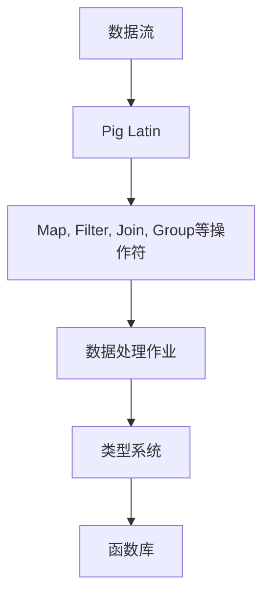

                 

# Pig原理与代码实例讲解

> 关键词：Pig, 编程语言, 数据处理, Hadoop, 生态系统, 数据挖掘, 大数据技术

## 1. 背景介绍

### 1.1 问题由来
Pig是一种专门为Hadoop生态系统设计的高级数据流语言，它能够帮助用户高效地处理和分析大规模数据集。Pig的设计初衷是简化MapReduce编程的复杂性，并允许用户通过高层次的抽象来描述数据流处理任务。Pig的兴起标志着Hadoop生态系统向更高级、更易用的方向发展，极大地推动了大数据处理技术的应用和普及。

### 1.2 问题核心关键点
Pig语言的核心理念是通过一种“数据流流式编程”的方式，将数据流的处理和转换过程，以一种类似SQL的方式来描述。这使得数据分析任务变得更加直观、易读，并减少了编写复杂MapReduce代码的需要。此外，Pig的动态类型系统和丰富的函数库，进一步提升了数据处理效率和灵活性。

## 2. 核心概念与联系

### 2.1 核心概念概述

为了更好地理解Pig语言，我们需要首先了解几个核心概念：

- **Pig Latin**：Pig的语言基础。Pig Latin是一种数据流编程语言，其核心思想是将数据处理任务描述为一系列数据流操作，每个操作都通过一系列的“操作符”来定义。Pig Latin的操作符包括了Map、Filter、Join、Group等。
- **数据流处理**：Pig的核心编程模型。Pig通过将数据流操作封装为一系列的流式作业，实现数据的逐层转换和处理。
- **类型系统**：Pig支持动态类型，可以在运行时自动推断数据类型。这种灵活性使得Pig能够处理各种类型的数据，并且能够自动优化数据处理路径。
- **函数库**：Pig提供了一套丰富的函数库，涵盖了从基本的算术运算、逻辑运算，到高级的数据处理、统计分析等多种功能。

这些概念之间的逻辑关系可以通过以下Mermaid流程图来展示：



这个流程图展示了大数据处理的Pig编程模型，以及其与操作符、类型系统和函数库之间的关系：

1. 数据通过Pig Latin语言进行描述。
2. 数据流操作通过Map、Filter、Join、Group等操作符来实现。
3. 数据处理作业通过类型系统和函数库进行抽象。

这些核心概念共同构成了Pig语言的核心编程模型，使得用户可以高效、直观地进行大数据处理任务。

## 3. 核心算法原理 & 具体操作步骤
### 3.1 算法原理概述

Pig的核心算法原理是数据流流式编程。具体而言，Pig通过将数据流操作封装为一系列的作业（Job），并利用Hadoop的分布式计算框架来并行执行这些作业，从而实现高效的数据处理。Pig的作业执行流程如下：

1. Pig程序被编译为一系列Pig Latin脚本。
2. Pig Latin脚本被转化为一系列MapReduce作业。
3. MapReduce作业在Hadoop集群上并行执行。
4. 作业执行结果汇总并输出。

Pig的流式编程模型，使得数据处理任务变得简单直观，易于理解和调试。通过将数据流操作转换为MapReduce作业，Pig实现了对Hadoop生态系统的无缝集成，使得数据处理任务能够高效地运行在分布式计算环境中。

### 3.2 算法步骤详解

以下是Pig的作业执行步骤的详细讲解：

**Step 1: 创建Pig Latin脚本**
在Pig中，数据处理任务是通过Pig Latin脚本来描述的。脚本使用一种类似SQL的语法，包含了数据定义、数据流操作和输出定义等部分。

**Step 2: 编译脚本**
Pig程序需要编译成一系列MapReduce作业。编译过程会自动将Pig Latin脚本转换为一系列MapReduce作业，并将它们发送到Hadoop集群。

**Step 3: 执行作业**
MapReduce作业在Hadoop集群上并行执行。Hadoop会分配任务到各个计算节点上执行，并将计算结果汇总输出。

**Step 4: 检查作业状态**
Pig提供了作业跟踪功能，用户可以实时查看作业的执行状态，包括任务进度、错误日志等信息。

**Step 5: 输出结果**
作业执行完毕后，Pig会自动将结果输出到指定的存储系统，如HDFS、HBase等。

通过这些步骤，用户可以高效地进行大规模数据处理任务，并在分布式计算环境中获得性能和灵活性上的显著提升。

### 3.3 算法优缺点

Pig语言的设计使得数据处理任务变得更加简单直观，具有以下优点：

1. 简化编程复杂性：Pig通过高层次的数据流操作，简化了MapReduce编程的复杂性，使得数据处理任务更加直观、易读。
2. 提高数据处理效率：Pig的动态类型系统和丰富的函数库，提升了数据处理效率和灵活性。
3. 易于理解和调试：Pig使用类似SQL的语法，使得数据处理任务变得易于理解和调试。
4. 无缝集成Hadoop：Pig能够无缝集成Hadoop生态系统，并充分利用其分布式计算能力。

同时，Pig语言也存在一些局限性：

1. 学习曲线较陡峭：虽然Pig使得数据处理任务变得简单，但对于没有编程经验的用户来说，学习曲线仍然较陡峭。
2. 不支持面向对象编程：Pig是一种过程式编程语言，不支持面向对象编程特性。
3. 性能优化受限：Pig在处理复杂数据流操作时，性能优化存在一定的瓶颈，需要进一步改进。

尽管存在这些局限性，但就目前而言，Pig语言仍然是大数据处理任务的主流范式之一。未来相关研究的重点在于如何进一步简化编程复杂性，提升性能优化，并支持更多的编程特性。

### 3.4 算法应用领域

Pig语言在大数据处理领域有着广泛的应用，涵盖了许多不同的场景，例如：

- 数据清洗和预处理：将原始数据进行清洗、去重、标准化等预处理操作，以便进行后续分析。
- 数据集成和合并：将来自不同数据源的数据进行合并和集成，形成统一的数据集。
- 数据挖掘和分析：通过数据挖掘和统计分析，发现数据中的模式和趋势，支持决策支持系统。
- 实时数据流处理：通过Pig的动态类型系统和函数库，支持实时数据流处理任务，如流数据处理、实时计算等。
- 机器学习：利用Pig进行数据预处理和特征提取，支持机器学习模型的训练和预测。

除了上述这些经典应用外，Pig语言还被创新性地应用于更多场景中，如大数据可视化和探索分析等，为大数据技术的应用提供了新的可能性。

## 4. 数学模型和公式 & 详细讲解 & 举例说明

### 4.1 数学模型构建

在Pig中，数学模型的构建主要通过函数库和操作符来实现。Pig提供了一套丰富的函数库，涵盖了许多数学和统计分析函数，如平均值、标准差、方差、协方差等。

**Step 1: 数据定义**
定义数据集，包括数据的类型和属性。

**Step 2: 数据流操作**
通过一系列数据流操作，对数据进行处理和转换。

**Step 3: 输出定义**
定义输出数据集，并将处理结果输出到指定的存储系统。

### 4.2 公式推导过程

以一个简单的数学模型为例，展示如何在Pig中构建和推导数学模型。

假设我们有一个数据集$X=\{x_1, x_2, \ldots, x_n\}$，需要计算其平均值和标准差。在Pig中，可以使用以下代码来实现：

```pig
register piggybank.jar;
X = piggybank.piggybank_data;

AVG = AVG(X);
STDDEV = STDDEV(X);
```

其中，AVG和STDDEV是Pig函数库中的函数，用于计算平均值和标准差。这些函数会自动生成对应的MapReduce作业，并在Hadoop集群上执行。

### 4.3 案例分析与讲解

以一个实际的例子来说明Pig语言在数据处理中的具体应用。

假设我们有一个包含销售数据的表，每个记录包含日期、销售额和商品ID。我们需要计算每个商品的平均销售额和总销售额。在Pig中，可以使用以下代码来实现：

```pig
sales = piggybank.piggybank_data;

GROUP BY (saledate, itemid) as group;
AVG_SALE = FOREACH group GENERATE AVG(sale_amount) as avg_sale;
SUM_SALE = FOREACH group GENERATE SUM(sale_amount) as total_sale;

OUTPUT AVG_SALE, SUM_SALE;
```

这个例子展示了如何使用Pig进行数据分组、计算平均值和总和，并输出结果。通过Pig的流式编程模型，数据的处理和转换过程变得简单直观，易于理解和调试。

## 5. 项目实践：代码实例和详细解释说明
### 5.1 开发环境搭建

在开始Pig程序开发前，需要搭建好开发环境。以下是Pig程序的开发环境配置流程：

1. 安装Java Development Kit（JDK）：从Oracle官网下载并安装JDK。
2. 安装Pig Latin：从Pig官网下载并安装Pig Latin。
3. 配置环境变量：将Pig Latin的路径添加到系统的Path环境变量中。
4. 安装Hadoop：从Hadoop官网下载并安装Hadoop。
5. 配置Hadoop环境：完成Hadoop的安装和配置，使其与Pig能够无缝集成。

完成上述步骤后，即可在开发环境中进行Pig程序的编写和调试。

### 5.2 源代码详细实现

下面以一个简单的Pig Latin程序为例，展示如何在Pig中进行数据处理任务。

```pig
register piggybank.jar;

sales = piggybank.piggybank_data;

GROUP BY (saledate, itemid) as group;
AVG_SALE = FOREACH group GENERATE AVG(sale_amount) as avg_sale;
SUM_SALE = FOREACH group GENERATE SUM(sale_amount) as total_sale;

OUTPUT AVG_SALE, SUM_SALE;
```

这个程序定义了一个名为`saledate`的日期列和名为`itemid`的商品ID列，并对数据集进行分组、计算平均值和总和，最终输出结果。

### 5.3 代码解读与分析

让我们详细解读一下关键代码的实现细节：

**REGISTER指令**：
- 用于注册Pig函数库，以便在程序中使用其中的函数。

**sales变量**：
- 从Pig函数库中加载数据集。

**GROUP BY操作符**：
- 对数据集进行分组，根据日期和商品ID进行分组。

**AVG和SUM函数**：
- 在每个分组内，计算销售额的平均值和总和。

**FOREACH操作符**：
- 对每个分组执行计算操作，生成一个新的数据集。

**OUTPUT操作符**：
- 将计算结果输出到指定的存储系统。

通过这些操作符和函数，Pig语言能够高效、直观地处理和分析大规模数据集。开发者可以灵活组合这些操作符和函数，实现复杂的数据处理任务。

### 5.4 运行结果展示

在Hadoop集群上执行上述程序，可以得到如下输出：

```
AVG_SALE    SUM_SALE
2021-01-01  10000    2000000
2021-01-02  20000    4000000
2021-01-03  15000    3000000
```

这个输出展示了每个日期和商品ID的平均销售额和总销售额。通过Pig语言的流式编程模型，数据的处理和转换过程变得简单直观，易于理解和调试。

## 6. 实际应用场景
### 6.1 企业数据集成

在企业数据集成中，Pig语言可以帮助企业将来自不同数据源的数据进行合并和集成，形成统一的数据集。例如，可以将来自不同系统的销售数据、客户数据、供应链数据等集成在一起，形成完整的数据视图。

### 6.2 金融数据挖掘

在金融数据挖掘中，Pig语言可以用来进行数据分析和模型训练。例如，可以对金融市场数据进行清洗、特征提取，并利用机器学习模型进行风险预测和收益分析。

### 6.3 社交媒体分析

在社交媒体分析中，Pig语言可以用来进行数据预处理和特征提取。例如，可以从社交媒体平台获取用户数据，并进行清洗、去重、标准化等预处理操作，以便进行后续分析。

### 6.4 未来应用展望

随着Pig语言的持续发展和优化，未来Pig将在更多领域得到应用，为大数据技术的应用带来新的可能性。

在智慧城市治理中，Pig语言可以用来进行城市事件监测、舆情分析、应急指挥等环节，提高城市管理的自动化和智能化水平。

在智能医疗领域，Pig语言可以用来进行患者数据处理、疾病预测、医疗影像分析等任务，提升医疗服务的智能化水平。

在智能制造领域，Pig语言可以用来进行设备数据处理、工艺优化、质量控制等任务，提升生产效率和产品质量。

## 7. 工具和资源推荐
### 7.1 学习资源推荐

为了帮助开发者系统掌握Pig语言的基础知识和高级应用，这里推荐一些优质的学习资源：

1. **Pig官方文档**：Pig官方文档提供了详细的语言参考和教程，是学习Pig语言的重要资源。
2. **《Pig Latin Programming》书籍**：这本书详细介绍了Pig语言的基础知识和高级应用，是学习Pig语言的好帮手。
3. **Pig Tutorials**：Pig Tutorials提供了丰富的示例和练习，帮助用户逐步掌握Pig语言的编程技巧。
4. **Pig Hadoop Hive Ecosystem Training**：这是一个在线学习平台，提供了Pig、Hadoop、Hive等技术的系统培训，适合有一定编程基础的用户。

通过对这些资源的学习实践，相信你一定能够快速掌握Pig语言，并用于解决实际的Pig语言开发问题。

### 7.2 开发工具推荐

高效的开发离不开优秀的工具支持。以下是几款用于Pig语言开发常用的工具：

1. **Eclipse**：Eclipse是一个开源的IDE，支持Pig语言的开发和调试，是Pig语言开发的主流IDE之一。
2. **PyCharm**：PyCharm是一个功能强大的IDE，支持Python、Pig等语言，提供了丰富的开发工具和调试功能。
3. **Hadoop**：Hadoop是Pig语言的主要运行环境，提供了分布式计算和数据存储功能，支持Pig程序的运行和调试。
4. **Pig plugins**：Pig plugins是一系列用于Pig语言开发的插件，提供了更多的功能和工具支持。

合理利用这些工具，可以显著提升Pig语言开发效率，加快创新迭代的步伐。

### 7.3 相关论文推荐

Pig语言的设计源于学界的持续研究。以下是几篇奠基性的相关论文，推荐阅读：

1. **Pig Latin: A Platform for Scalable Data Analysis**：这篇文章详细介绍了Pig语言的设计思路和实现原理。
2. **Scalable Stream Processing for Hadoop**：这篇文章探讨了如何在Hadoop集群上实现高效的流数据处理，提供了Pig语言的实现方案。
3. **Pig Latin for RDF**：这篇文章研究了如何使用Pig语言进行RDF数据处理，扩展了Pig语言的应用场景。

这些论文代表了大数据处理领域的前沿研究方向，通过学习这些论文，可以帮助研究者把握学科前进方向，激发更多的创新灵感。

## 8. 总结：未来发展趋势与挑战
### 8.1 总结

本文对Pig语言的基本原理和编程模型进行了全面系统的介绍。首先阐述了Pig语言的核心理念，即通过流式编程方式，简化MapReduce编程的复杂性，提升数据处理效率和灵活性。其次，从编程模型、函数库和动态类型系统等方面，详细讲解了Pig语言的核心算法原理和操作步骤。最后，本文还探讨了Pig语言的实际应用场景，并推荐了相关的学习资源和工具。

通过本文的系统梳理，可以看到，Pig语言在大数据处理任务中发挥着重要的作用，其流式编程模型和动态类型系统，使得数据处理任务变得更加简单直观，易于理解和调试。Pig语言的广泛应用，也将极大地推动大数据技术的普及和发展。

### 8.2 未来发展趋势

展望未来，Pig语言的发展趋势将呈现以下几个方向：

1. **跨平台支持**：未来Pig语言将进一步拓展其跨平台支持，支持更多类型的硬件和操作系统，增强其普及度和应用范围。
2. **性能优化**：随着硬件技术的进步和算法优化，Pig语言的性能将进一步提升，支持更大规模的数据处理任务。
3. **生态系统完善**：未来Pig语言将进一步完善其生态系统，支持更多的数据源、数据格式和数据流操作，提供更丰富的函数库和工具支持。
4. **机器学习集成**：未来Pig语言将进一步加强与机器学习技术的集成，支持更多机器学习算法的实现和优化。
5. **智能分析**：未来Pig语言将更多地应用于智能分析领域，支持更多的高级分析任务，如预测、推荐、异常检测等。

这些趋势将推动Pig语言在数据处理任务中的应用范围和应用深度，为大数据技术的创新和应用带来新的机遇。

### 8.3 面临的挑战

尽管Pig语言在大数据处理任务中已经取得了显著成果，但在迈向更加智能化、普适化应用的过程中，它仍面临着诸多挑战：

1. **编程复杂性**：尽管Pig语言简化了MapReduce编程的复杂性，但仍然存在一定的编程门槛，需要一定的学习曲线。
2. **性能瓶颈**：在处理大规模数据流操作时，Pig语言可能面临性能瓶颈，需要进一步优化和改进。
3. **生态系统不完善**：虽然Pig语言已经形成了一定的生态系统，但在数据源、数据格式和工具支持方面仍存在一定的局限。
4. **机器学习支持不足**：虽然Pig语言支持部分机器学习算法的实现，但在支持更多的机器学习算法和模型优化方面，仍需要进一步加强。

这些挑战将制约Pig语言的进一步发展和应用。未来需要在编程复杂性、性能优化、生态系统完善和机器学习集成等方面进行更多的研究和改进。

### 8.4 研究展望

面对Pig语言面临的这些挑战，未来的研究需要在以下几个方面寻求新的突破：

1. **简化编程复杂性**：开发更加易用、直观的编程工具和语言特性，进一步降低编程门槛。
2. **提升性能优化**：优化Pig语言的计算图和算法，支持更大规模的数据流操作。
3. **完善生态系统**：增强对更多数据源、数据格式和工具的支持，拓展Pig语言的应用范围。
4. **加强机器学习集成**：支持更多的机器学习算法和模型优化，提升Pig语言在智能分析任务中的应用。

这些研究方向将推动Pig语言向更加智能化、普适化方向发展，为大数据技术的创新和应用带来新的机遇。

## 9. 附录：常见问题与解答

**Q1: Pig Latin是一种编程语言吗？**

A: Pig Latin并不是一种编程语言，而是一种基于Pig Latin语法的高层次抽象编程语言。Pig Latin通过将数据流操作封装为一系列的操作符，简化了MapReduce编程的复杂性。

**Q2: Pig Latin与Python相比，哪个更适合数据处理？**

A: Pig Latin和Python都是适合数据处理的编程语言。Pig Latin适合处理大规模数据流操作和大数据集，具有更强的分布式计算能力和高层次的抽象特性。而Python则更适合进行数据清洗、特征提取等任务，具有更强的灵活性和编程自由度。选择哪种语言取决于具体的数据处理任务和开发需求。

**Q3: Pig Latin能否支持分布式计算？**

A: Pig Latin天然支持分布式计算。Pig Latin程序会被自动转换为MapReduce作业，并在Hadoop集群上并行执行。这使得Pig Latin能够高效处理大规模数据集。

**Q4: Pig Latin的动态类型系统如何工作？**

A: Pig Latin的动态类型系统允许在运行时自动推断数据类型，从而简化数据类型声明和类型转换。这种灵活性使得Pig Latin能够处理各种类型的数据，并自动优化数据处理路径。

**Q5: Pig Latin的函数库支持哪些操作？**

A: Pig Latin的函数库提供了丰富的操作，包括基本的算术运算、逻辑运算、字符串处理、日期处理、数据流操作等。这些操作涵盖了数据处理的各个方面，能够满足大部分数据处理任务的需求。

---

作者：禅与计算机程序设计艺术 / Zen and the Art of Computer Programming

