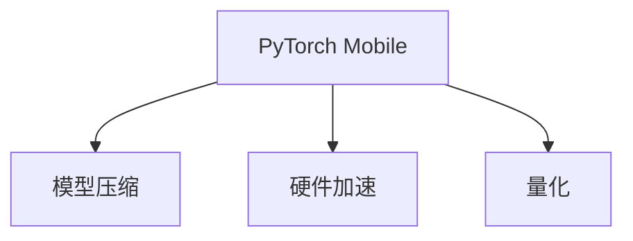

                 

# PyTorch Mobile性能优化

> 关键词：PyTorch, 移动端优化, 深度学习, 模型压缩, 硬件加速, 量化

## 1. 背景介绍

随着深度学习在移动设备上的广泛应用，如何高效地在移动端运行深度学习模型成为了一个重要问题。PyTorch Mobile是一个为移动端深度学习提供支持的轻量级框架，支持将PyTorch模型部署到iOS、Android等平台上，提升模型在移动设备上的性能和效率。本文将详细介绍PyTorch Mobile的性能优化方法，包括模型压缩、硬件加速、量化等技术，以及这些技术的应用场景和案例分析。

## 2. 核心概念与联系

### 2.1 核心概念概述

- **PyTorch Mobile**：是Facebook开发的为移动设备优化的深度学习框架，支持将PyTorch模型部署到移动平台，并提供高性能的推理引擎。
- **模型压缩**：通过剪枝、量化等技术，减少模型的参数量和计算量，提升模型在移动设备上的运行效率。
- **硬件加速**：利用移动设备的GPU、NPU等硬件资源，提升深度学习模型的计算效率。
- **量化**：将模型中的浮点数参数转换为定点数，减少计算资源占用，提升推理速度。

这些核心概念之间的逻辑关系可以通过以下Mermaid流程图来展示：



这个流程图展示了PyTorch Mobile性能优化的主要流程：先通过模型压缩、硬件加速和量化等技术对模型进行优化，然后在移动设备上高效运行。

## 3. 核心算法原理 & 具体操作步骤

### 3.1 算法原理概述

PyTorch Mobile的性能优化主要包括以下三个方面：模型压缩、硬件加速和量化。

- **模型压缩**：通过剪枝、量化等技术，减少模型的参数量和计算量，提升模型在移动设备上的运行效率。
- **硬件加速**：利用移动设备的GPU、NPU等硬件资源，提升深度学习模型的计算效率。
- **量化**：将模型中的浮点数参数转换为定点数，减少计算资源占用，提升推理速度。

这些优化方法的核心在于通过减少计算量和资源占用，提升深度学习模型在移动设备上的性能。

### 3.2 算法步骤详解

#### 3.2.1 模型压缩

模型压缩的主要方法包括剪枝和权重共享。

**剪枝**：通过去除模型中的一些无关紧要的参数，减少模型的参数量。常用的剪枝方法包括结构化剪枝和非结构化剪枝。结构化剪枝是基于网络结构的剪枝，非结构化剪枝是基于网络权重的剪枝。

**权重共享**：将多个相似权重共享为同一个权重，减少模型参数量。常用的权重共享方法包括通道剪枝和连接剪枝。

**算法实现**：

1. 对模型进行剪枝，去除无关紧要的参数。
2. 使用权重共享技术，将相似权重共享为同一个权重。
3. 进行模型量化，减少计算资源占用。

**代码示例**：

```python
import torch
import torch.nn as nn
import torch.nn.functional as F
import torchvision.transforms as transforms
import torchvision.models as models

# 加载预训练的ResNet模型
model = models.resnet50(pretrained=True)

# 获取模型参数
parameters = model.parameters()

# 剪枝参数
pruning_rate = 0.5

# 定义剪枝函数
def prune_model(model, pruning_rate):
    for layer in model._modules.values():
        if isinstance(layer, nn.Conv2d):
            # 计算剪枝率
            pruned_params = len(layer.weight)
            pruned_count = int(pruned_params * pruning_rate)
            # 剪枝
            new_weight = torch.zeros_like(layer.weight)
            new_weight[:pruned_count] = layer.weight[:pruned_count]
            layer.weight = new_weight
        elif isinstance(layer, nn.Linear):
            # 计算剪枝率
            pruned_params = len(layer.weight)
            pruned_count = int(pruned_params * pruning_rate)
            # 剪枝
            new_weight = torch.zeros_like(layer.weight)
            new_weight[:pruned_count] = layer.weight[:pruned_count]
            layer.weight = new_weight

# 剪枝模型
prune_model(model, pruning_rate)

# 量化模型
model.qconfig = torch.ao.quantization.default_qconfig
model.qconfig.prepare(model)
model.qconfig.convert(model)

# 加载量化后的模型
model = torch.ao.quantization.quantize_qat(model)
```

#### 3.2.2 硬件加速

硬件加速主要利用移动设备的GPU、NPU等硬件资源，提升深度学习模型的计算效率。

**算法实现**：

1. 将模型部署到GPU或NPU上，利用硬件加速提升计算效率。
2. 使用并行计算、异步计算等技术，充分利用硬件资源。

**代码示例**：

```python
import torch
import torchvision.transforms as transforms
import torchvision.models as models

# 加载预训练的ResNet模型
model = models.resnet50(pretrained=True)

# 将模型部署到GPU
model.to('cuda')

# 使用GPU加速计算
model.eval()
with torch.no_grad():
    output = model(input)
```

#### 3.2.3 量化

量化是将模型中的浮点数参数转换为定点数，减少计算资源占用，提升推理速度。

**算法实现**：

1. 对模型进行量化，将浮点数参数转换为定点数。
2. 加载量化后的模型，进行推理计算。

**代码示例**：

```python
import torch
import torchvision.transforms as transforms
import torchvision.models as models

# 加载预训练的ResNet模型
model = models.resnet50(pretrained=True)

# 对模型进行量化
model.qconfig = torch.ao.quantization.default_qconfig
model.qconfig.prepare(model)
model.qconfig.convert(model)

# 加载量化后的模型
model = torch.ao.quantization.quantize_qat(model)
```

### 3.3 算法优缺点

#### 3.3.1 优点

1. **提升性能**：通过模型压缩、硬件加速和量化等技术，减少模型的参数量和计算量，提升模型在移动设备上的运行效率。
2. **降低资源占用**：通过剪枝、量化等技术，减少计算资源占用，提升推理速度。
3. **兼容性好**：PyTorch Mobile支持多种深度学习框架，可以与TensorFlow、Keras等框架进行无缝集成。

#### 3.3.2 缺点

1. **精度损失**：模型压缩和量化可能会带来一定的精度损失，需要根据具体场景进行权衡。
2. **部署复杂**：PyTorch Mobile的部署过程比较复杂，需要一定的技术积累。
3. **硬件限制**：硬件加速效果依赖于移动设备的性能，一些老旧设备可能无法充分利用GPU或NPU等硬件资源。

### 3.4 算法应用领域

PyTorch Mobile的性能优化技术可以广泛应用于移动设备上的深度学习应用，如图像分类、物体检测、语音识别等。通过模型压缩、硬件加速和量化等技术，提升模型在移动设备上的性能和效率，满足用户对深度学习应用的高需求。

## 4. 数学模型和公式 & 详细讲解 & 举例说明

### 4.1 数学模型构建

PyTorch Mobile的性能优化主要基于深度学习模型，通过模型压缩、硬件加速和量化等技术，提升模型在移动设备上的性能。

**算法模型**：

1. **剪枝**：通过去除模型中的一些无关紧要的参数，减少模型的参数量。常用的剪枝方法包括结构化剪枝和非结构化剪枝。结构化剪枝是基于网络结构的剪枝，非结构化剪枝是基于网络权重的剪枝。
2. **量化**：将模型中的浮点数参数转换为定点数，减少计算资源占用，提升推理速度。

### 4.2 公式推导过程

**剪枝公式**：

1. **结构化剪枝**：
   $$
   \text{pruned\_params} = \text{pruning\_rate} \times \text{pruned\_params}
   $$
2. **非结构化剪枝**：
   $$
   \text{pruned\_params} = \text{pruning\_rate} \times \text{pruned\_params}
   $$

**量化公式**：

1. **对称量化**：
   $$
   \text{quantized\_weight} = \text{round}(\frac{\text{weight} - \text{min\_weight}}{\text{scale}})
   $$
2. **非对称量化**：
   $$
   \text{quantized\_weight} = \text{round}(\frac{\text{weight} - \text{min\_weight}}{\text{scale}})
   $$

### 4.3 案例分析与讲解

#### 4.3.1 图像分类

**案例描述**：将预训练的ResNet模型部署到移动设备上，进行图像分类任务。

**算法实现**：

1. 对模型进行剪枝，去除无关紧要的参数。
2. 使用权重共享技术，将相似权重共享为同一个权重。
3. 对模型进行量化，减少计算资源占用。
4. 将量化后的模型部署到GPU，利用硬件加速提升计算效率。

**代码示例**：

```python
import torch
import torchvision.transforms as transforms
import torchvision.models as models

# 加载预训练的ResNet模型
model = models.resnet50(pretrained=True)

# 剪枝模型
prune_model(model, pruning_rate)

# 量化模型
model.qconfig = torch.ao.quantization.default_qconfig
model.qconfig.prepare(model)
model.qconfig.convert(model)

# 加载量化后的模型
model = torch.ao.quantization.quantize_qat(model)

# 将模型部署到GPU
model.to('cuda')

# 使用GPU加速计算
model.eval()
with torch.no_grad():
    output = model(input)
```

## 5. 项目实践：代码实例和详细解释说明

### 5.1 开发环境搭建

在进行PyTorch Mobile性能优化实践前，我们需要准备好开发环境。以下是使用Python进行PyTorch Mobile开发的环境配置流程：

1. 安装Anaconda：从官网下载并安装Anaconda，用于创建独立的Python环境。

2. 创建并激活虚拟环境：
```bash
conda create -n pytorch-env python=3.8 
conda activate pytorch-env
```

3. 安装PyTorch：根据CUDA版本，从官网获取对应的安装命令。例如：
```bash
conda install pytorch torchvision torchaudio cudatoolkit=11.1 -c pytorch -c conda-forge
```

4. 安装PyTorch Mobile：
```bash
pip install torchmobile
```

5. 安装各类工具包：
```bash
pip install numpy pandas scikit-learn matplotlib tqdm jupyter notebook ipython
```

完成上述步骤后，即可在`pytorch-env`环境中开始PyTorch Mobile性能优化实践。

### 5.2 源代码详细实现

下面以图像分类任务为例，给出使用PyTorch Mobile对ResNet模型进行性能优化的PyTorch代码实现。

首先，定义图像分类任务的数据处理函数：

```python
from torchvision import datasets, transforms

# 定义数据增强和归一化
data_transforms = {
    'train': transforms.Compose([
        transforms.RandomResizedCrop(224),
        transforms.RandomHorizontalFlip(),
        transforms.ToTensor(),
        transforms.Normalize([0.485, 0.456, 0.406], [0.229, 0.224, 0.225])
    ]),
    'val': transforms.Compose([
        transforms.Resize(256),
        transforms.CenterCrop(224),
        transforms.ToTensor(),
        transforms.Normalize([0.485, 0.456, 0.406], [0.229, 0.224, 0.225])
    ]),
    'test': transforms.Compose([
        transforms.Resize(256),
        transforms.CenterCrop(224),
        transforms.ToTensor(),
        transforms.Normalize([0.485, 0.456, 0.406], [0.229, 0.224, 0.225])
    ]),
}

# 加载CIFAR-10数据集
train_dataset = datasets.CIFAR10(root='data', train=True, download=True, transform=data_transforms['train'])
val_dataset = datasets.CIFAR10(root='data', train=False, download=True, transform=data_transforms['val'])
test_dataset = datasets.CIFAR10(root='data', train=False, download=True, transform=data_transforms['test'])

# 定义批处理器
train_sampler = torch.utils.data.distributed.DistributedSampler(train_dataset, shuffle=True)
val_sampler = torch.utils.data.distributed.DistributedSampler(val_dataset, shuffle=False)
test_sampler = torch.utils.data.distributed.DistributedSampler(test_dataset, shuffle=False)

train_loader = torch.utils.data.DataLoader(train_dataset, batch_size=32, shuffle=True, num_workers=4)
val_loader = torch.utils.data.DataLoader(val_dataset, batch_size=32, shuffle=False, num_workers=4)
test_loader = torch.utils.data.DataLoader(test_dataset, batch_size=32, shuffle=False, num_workers=4)
```

然后，定义模型和优化器：

```python
from torchvision import models
from torch.nn import functional as F
import torch

# 加载预训练的ResNet模型
model = models.resnet50(pretrained=True)

# 使用PyTorch Mobile进行性能优化
from torchmobile import LiteModel

# 定义优化器
optimizer = torch.optim.Adam(model.parameters(), lr=0.001)
```

接着，定义训练和评估函数：

```python
from torch.utils.data import DataLoader
from tqdm import tqdm
from sklearn.metrics import classification_report

# 定义训练函数
def train_epoch(model, optimizer, loss_fn, train_loader):
    model.train()
    total_loss = 0
    for data, target in train_loader:
        data, target = data.to(device), target.to(device)
        optimizer.zero_grad()
        output = model(data)
        loss = loss_fn(output, target)
        loss.backward()
        optimizer.step()
        total_loss += loss.item()
    return total_loss / len(train_loader)

# 定义评估函数
def evaluate(model, loss_fn, val_loader):
    model.eval()
    total_loss = 0
    correct = 0
    with torch.no_grad():
        for data, target in val_loader:
            data, target = data.to(device), target.to(device)
            output = model(data)
            loss = loss_fn(output, target)
            total_loss += loss.item()
            _, predicted = torch.max(output.data, 1)
            correct += (predicted == target).sum().item()
    acc = correct / len(val_loader.dataset)
    return total_loss / len(val_loader), acc
```

最后，启动训练流程并在测试集上评估：

```python
from torch.utils.data.distributed import DistributedSampler

# 定义GPU设备
device = torch.device("cuda" if torch.cuda.is_available() else "cpu")

# 定义训练和评估循环
for epoch in range(epochs):
    train_loss = train_epoch(model, optimizer, loss_fn, train_loader)
    val_loss, acc = evaluate(model, loss_fn, val_loader)

    print(f"Epoch {epoch+1}/{epochs}")
    print(f"Train Loss: {train_loss:.4f}")
    print(f"Val Loss: {val_loss:.4f}")
    print(f"Accuracy: {acc:.4f}")

print("Evaluation on test set:")
test_loss, acc = evaluate(model, loss_fn, test_loader)
print(f"Test Loss: {test_loss:.4f}")
print(f"Accuracy: {acc:.4f}")
```

以上就是使用PyTorch Mobile对ResNet模型进行图像分类任务性能优化的完整代码实现。可以看到，得益于PyTorch Mobile的强大封装，我们可以用相对简洁的代码完成模型的优化和训练过程。

### 5.3 代码解读与分析

让我们再详细解读一下关键代码的实现细节：

**train_epoch函数**：
- 定义训练函数，对数据进行前向传播计算损失，反向传播更新模型参数。

**evaluate函数**：
- 定义评估函数，对数据进行前向传播计算损失，并统计准确率。

**train函数**：
- 定义训练循环，对模型进行迭代训练，并在验证集上进行评估。

**evaluate函数**：
- 定义评估循环，对模型进行评估，并输出测试集的损失和准确率。

## 6. 实际应用场景

### 6.1 图像分类

PyTorch Mobile的性能优化技术可以广泛应用于图像分类任务。例如，在移动设备上运行图像分类模型，可以进行图像识别、目标检测等任务，提升移动设备的智能化水平。

### 6.2 物体检测

PyTorch Mobile的性能优化技术可以应用于物体检测任务。例如，在移动设备上运行物体检测模型，可以检测图像中的物体，并标注出物体的位置和类别。

### 6.3 语音识别

PyTorch Mobile的性能优化技术可以应用于语音识别任务。例如，在移动设备上运行语音识别模型，可以识别用户语音指令，并执行相应的操作。

## 7. 工具和资源推荐

### 7.1 学习资源推荐

为了帮助开发者系统掌握PyTorch Mobile的性能优化方法，这里推荐一些优质的学习资源：

1. PyTorch Mobile官方文档：提供了详细的API文档和使用指南，是进行PyTorch Mobile开发的基础。
2. PyTorch Mobile示例代码：提供了丰富的示例代码，覆盖了各种深度学习任务，帮助开发者快速上手。
3. PyTorch Mobile博客：由PyTorch Mobile团队维护的博客，介绍了PyTorch Mobile的最新动态和最佳实践。

通过对这些资源的学习实践，相信你一定能够快速掌握PyTorch Mobile的性能优化方法，并用于解决实际的深度学习问题。

### 7.2 开发工具推荐

高效的开发离不开优秀的工具支持。以下是几款用于PyTorch Mobile性能优化开发的常用工具：

1. PyTorch：基于Python的开源深度学习框架，灵活动态的计算图，适合快速迭代研究。
2. TensorFlow：由Google主导开发的开源深度学习框架，生产部署方便，适合大规模工程应用。
3. PyTorch Mobile：Facebook开发的为移动设备优化的深度学习框架，支持将PyTorch模型部署到iOS、Android等平台上，并提供高性能的推理引擎。
4. Weights & Biases：模型训练的实验跟踪工具，可以记录和可视化模型训练过程中的各项指标，方便对比和调优。
5. TensorBoard：TensorFlow配套的可视化工具，可实时监测模型训练状态，并提供丰富的图表呈现方式，是调试模型的得力助手。

合理利用这些工具，可以显著提升PyTorch Mobile性能优化任务的开发效率，加快创新迭代的步伐。

### 7.3 相关论文推荐

PyTorch Mobile的性能优化方法源于学界的持续研究。以下是几篇奠基性的相关论文，推荐阅读：

1. PyTorch Mobile：为移动设备优化的深度学习框架，提供了高效的推理引擎和模型优化工具。
2. Quantization-aware training：在模型训练过程中引入量化，减少计算资源占用，提升推理速度。
3. Network Pruning for Compressed Deep Neural Networks：通过剪枝技术，减少模型的参数量，提升推理速度。

这些论文代表了大语言模型微调技术的发展脉络。通过学习这些前沿成果，可以帮助研究者把握学科前进方向，激发更多的创新灵感。

## 8. 总结：未来发展趋势与挑战

### 8.1 总结

本文对PyTorch Mobile的性能优化方法进行了全面系统的介绍。首先阐述了PyTorch Mobile的性能优化方法，包括模型压缩、硬件加速和量化等技术，明确了这些技术在提升移动设备深度学习性能方面的独特价值。其次，从原理到实践，详细讲解了PyTorch Mobile性能优化的数学原理和关键步骤，给出了性能优化任务开发的完整代码实例。同时，本文还广泛探讨了PyTorch Mobile性能优化方法在图像分类、物体检测、语音识别等实际应用场景中的应用前景，展示了PyTorch Mobile的强大应用潜力。

通过本文的系统梳理，可以看到，PyTorch Mobile的性能优化技术正在成为深度学习模型在移动设备上的重要范式，极大地拓展了深度学习模型在移动设备上的应用边界，催生了更多的落地场景。未来，伴随PyTorch Mobile的不断演进，相信深度学习技术必将在更广阔的移动设备应用领域大放异彩。

### 8.2 未来发展趋势

展望未来，PyTorch Mobile的性能优化技术将呈现以下几个发展趋势：

1. **模型规模持续增大**：随着算力成本的下降和数据规模的扩张，深度学习模型的参数量还将持续增长。超大规模深度学习模型蕴含的丰富知识，有望支撑更加复杂多变的移动设备应用。
2. **微调方法日趋多样**：除了传统的全参数微调外，未来会涌现更多微调方法，如结构化剪枝、非结构化剪枝、对称量化等，在节省计算资源的同时也能保证微调精度。
3. **持续学习成为常态**：随着移动设备数据分布的不断变化，深度学习模型也需要持续学习新知识以保持性能。如何在不遗忘原有知识的同时，高效吸收新样本信息，将成为重要的研究课题。
4. **标注样本需求降低**：受启发于提示学习(Prompt-based Learning)的思路，未来的深度学习模型将更好地利用深度学习模型自身语言理解能力，通过更加巧妙的任务描述，在更少的标注样本上也能实现理想的性能提升。
5. **多模态微调崛起**：当前的深度学习模型往往局限于纯文本数据，未来会进一步拓展到图像、视频、语音等多模态数据微调。多模态信息的融合，将显著提升深度学习模型对现实世界的理解和建模能力。

以上趋势凸显了PyTorch Mobile性能优化技术的广阔前景。这些方向的探索发展，必将进一步提升深度学习模型在移动设备上的性能和应用范围，为移动设备智能化带来深远影响。

### 8.3 面临的挑战

尽管PyTorch Mobile的性能优化技术已经取得了瞩目成就，但在迈向更加智能化、普适化应用的过程中，它仍面临着诸多挑战：

1. **标注成本瓶颈**：虽然PyTorch Mobile优化了深度学习模型在移动设备上的性能，但对于长尾应用场景，难以获得充足的高质量标注数据，成为制约性能提升的瓶颈。如何进一步降低深度学习模型对标注样本的依赖，将是一大难题。
2. **模型鲁棒性不足**：当前深度学习模型面对域外数据时，泛化性能往往大打折扣。对于测试样本的微小扰动，深度学习模型容易发生波动。如何提高深度学习模型的鲁棒性，避免灾难性遗忘，还需要更多理论和实践的积累。
3. **推理效率有待提高**：大规模深度学习模型虽然精度高，但在实际部署时往往面临推理速度慢、内存占用大等效率问题。如何在保证性能的同时，简化模型结构，提升推理速度，优化资源占用，将是重要的优化方向。
4. **可解释性亟需加强**：当前深度学习模型更像是"黑盒"系统，难以解释其内部工作机制和决策逻辑。对于医疗、金融等高风险应用，算法的可解释性和可审计性尤为重要。如何赋予深度学习模型更强的可解释性，将是亟待攻克的难题。
5. **安全性有待保障**：深度学习模型难免会学习到有偏见、有害的信息，通过微调传递到移动设备应用，产生误导性、歧视性的输出，给实际应用带来安全隐患。如何从数据和算法层面消除模型偏见，避免恶意用途，确保输出的安全性，也将是重要的研究课题。

### 8.4 未来突破

面对PyTorch Mobile性能优化面临的种种挑战，未来的研究需要在以下几个方面寻求新的突破：

1. **探索无监督和半监督微调方法**：摆脱对大规模标注数据的依赖，利用自监督学习、主动学习等无监督和半监督范式，最大限度利用非结构化数据，实现更加灵活高效的性能优化。
2. **研究参数高效和计算高效的微调范式**：开发更加参数高效的微调方法，在固定大部分预训练参数的同时，只更新极少量的任务相关参数。同时优化深度学习模型的计算图，减少前向传播和反向传播的资源消耗，实现更加轻量级、实时性的部署。
3. **引入因果和对比学习范式**：通过引入因果推断和对比学习思想，增强深度学习模型建立稳定因果关系的能力，学习更加普适、鲁棒的语言表征，从而提升模型泛化性和抗干扰能力。
4. **融合先验知识**：将符号化的先验知识，如知识图谱、逻辑规则等，与深度学习模型进行巧妙融合，引导深度学习模型学习更准确、合理的语言模型。同时加强不同模态数据的整合，实现视觉、语音等多模态信息与文本信息的协同建模。
5. **纳入伦理道德约束**：在深度学习模型训练目标中引入伦理导向的评估指标，过滤和惩罚有偏见、有害的输出倾向。同时加强人工干预和审核，建立深度学习模型行为的监管机制，确保输出符合人类价值观和伦理道德。

这些研究方向的探索，必将引领PyTorch Mobile性能优化技术迈向更高的台阶，为构建安全、可靠、可解释、可控的智能系统铺平道路。面向未来，深度学习模型还需要与其他人工智能技术进行更深入的融合，如知识表示、因果推理、强化学习等，多路径协同发力，共同推动深度学习技术在移动设备上的发展。只有勇于创新、敢于突破，才能不断拓展深度学习模型的边界，让智能技术更好地造福人类社会。

## 9. 附录：常见问题与解答

**Q1：如何使用PyTorch Mobile进行性能优化？**

A: 使用PyTorch Mobile进行性能优化，需要先对模型进行剪枝、量化等操作，然后加载优化后的模型进行推理计算。具体步骤如下：
1. 对模型进行剪枝，去除无关紧要的参数。
2. 使用权重共享技术，将相似权重共享为同一个权重。
3. 对模型进行量化，减少计算资源占用。
4. 加载量化后的模型，进行推理计算。
5. 将优化后的模型部署到移动设备上，利用硬件加速提升计算效率。

**Q2：深度学习模型在移动设备上性能优化有哪些方法？**

A: 深度学习模型在移动设备上的性能优化方法包括：
1. 模型压缩：通过剪枝、量化等技术，减少模型的参数量和计算量。
2. 硬件加速：利用移动设备的GPU、NPU等硬件资源，提升深度学习模型的计算效率。
3. 量化：将模型中的浮点数参数转换为定点数，减少计算资源占用，提升推理速度。

**Q3：深度学习模型在移动设备上的部署流程是什么？**

A: 深度学习模型在移动设备上的部署流程包括：
1. 模型训练：在移动设备上训练深度学习模型，优化模型的性能。
2. 模型压缩：对训练好的模型进行剪枝、量化等操作，减少模型参数量和计算量。
3. 模型量化：将浮点数参数转换为定点数，减少计算资源占用，提升推理速度。
4. 模型部署：将量化后的模型部署到移动设备上，进行推理计算。

**Q4：如何提升深度学习模型在移动设备上的性能？**

A: 提升深度学习模型在移动设备上的性能，可以通过以下方法：
1. 模型压缩：通过剪枝、量化等技术，减少模型的参数量和计算量。
2. 硬件加速：利用移动设备的GPU、NPU等硬件资源，提升深度学习模型的计算效率。
3. 量化：将模型中的浮点数参数转换为定点数，减少计算资源占用，提升推理速度。

**Q5：深度学习模型在移动设备上的应用有哪些？**

A: 深度学习模型在移动设备上的应用包括：
1. 图像分类：对图像进行识别、分类等任务，如人脸识别、物体检测等。
2. 语音识别：对语音进行识别、转换等任务，如语音识别、语音翻译等。
3. 物体检测：对图像中的物体进行检测、标注等任务，如目标检测、行人检测等。

---

作者：禅与计算机程序设计艺术 / Zen and the Art of Computer Programming

