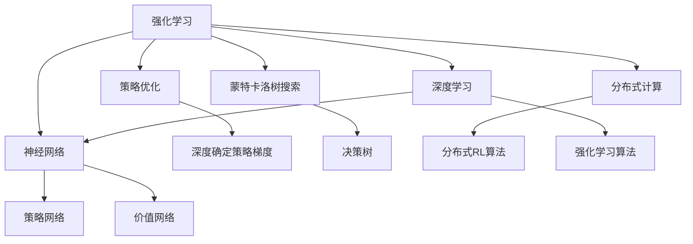

                 

# Python机器学习实战：强化学习在游戏AI中的实际应用

> 关键词：强化学习,游戏AI,神经网络,策略优化,决策树,蒙特卡洛树搜索,深度学习,分布式计算

## 1. 背景介绍

### 1.1 问题由来

在人工智能的探索中，强化学习（Reinforcement Learning, RL）作为一大分支，逐渐从理论走向应用，尤其是在游戏AI领域表现突出。游戏AI涵盖决策、策略优化等多个方面，其核心在于通过不断试错和自适应学习，达到最优决策。传统游戏AI依赖手工编写规则，而强化学习则通过让机器"玩"游戏来学习最优策略。

随着深度学习（Deep Learning, DL）的迅猛发展，强化学习在游戏AI中的应用也日益广泛。比如AlphaGo（Alpha Go）运用深度强化学习技术，率先在围棋领域击败了人类顶尖高手。此外，Paperspace的DeepMind也通过强化学习开发出Gato，能在《Dota 2》等复杂游戏中取得优异表现。

本文旨在探讨Python强化学习在游戏AI中的实战应用，通过详实案例和代码实例，揭示强化学习在多款热门游戏中的具体实践，并揭示其核心算法原理。

### 1.2 问题核心关键点

- 强化学习的核心原理是什么？
- 强化学习在游戏AI中的常见应用场景有哪些？
- 如何在Python中使用深度强化学习进行游戏AI开发？
- 强化学习在游戏AI中的应用实例有哪些？
- 未来强化学习在游戏AI中发展的趋势和挑战是什么？

## 2. 核心概念与联系

### 2.1 核心概念概述

为帮助读者深入理解强化学习在游戏AI中的实际应用，本节将介绍几个密切相关的核心概念：

- 强化学习(Reinforcement Learning, RL)：通过奖励信号反馈来指导决策的过程，最终让智能体（Agent）找到最优策略。强化学习包括Q-learning、SARSA等经典算法，以及深度强化学习的各类变体，如深度Q网络（DQN）、策略优化器等。

- 神经网络（Neural Network）：一种由大量节点（神经元）构成的非线性模型，用于拟合复杂的数据分布。神经网络常用于构建价值函数（Value Function）和策略函数（Policy Function），如Q网络、策略网络等。

- 策略优化（Policy Optimization）：通过优化策略函数，提高智能体在各种环境下的决策能力。策略优化包括深度确定策略梯度（DDPG）、策略优化器等。

- 蒙特卡洛树搜索（Monte Carlo Tree Search, MCTS）：一种决策树搜索算法，用于在复杂游戏中搜索最优策略。MCTS算法通过模拟多轮决策过程，从树根到叶子，反复更新树结构，最终找到最优路径。

- 分布式计算（Distributed Computing）：通过多个计算节点协同工作，加速复杂的训练和推理过程。分布式计算常用于解决大规模强化学习问题。

- 深度学习（Deep Learning）：一种基于多层神经网络的机器学习技术，通过多层非线性变换处理复杂的数据结构。深度学习在游戏AI中的应用非常广泛，如深度Q网络、自适应网络等。

这些核心概念之间的逻辑关系可以通过以下Mermaid流程图来展示：



这个流程图展示了大语言模型的核心概念及其之间的关系：

1. 强化学习通过奖励信号指导决策，是游戏AI的驱动核心。
2. 神经网络用于构建价值函数和策略函数，优化智能体的决策。
3. 策略优化算法提升智能体的决策能力，如DQN、DDPG等。
4. 蒙特卡洛树搜索用于复杂游戏的策略搜索，找到最优路径。
5. 分布式计算通过协同工作加速大规模强化学习训练。
6. 深度学习技术在游戏AI中被广泛应用，提升模型的泛化能力。

这些概念共同构成了强化学习在游戏AI中的应用框架，使得机器能够在各种场景下进行智能决策和策略优化。

## 3. 核心算法原理 & 具体操作步骤
### 3.1 算法原理概述

强化学习在游戏AI中的应用主要集中在构建智能体的决策策略，并通过试错过程不断优化。核心算法包括：

- Q-learning：通过Q值函数，指导智能体采取最优行动，提高长期奖励。
- SARSA：类似于Q-learning，但在更新Q值时使用状态值和动作值，避免Q值估算的偏差。
- 深度Q网络（DQN）：利用深度神经网络逼近Q值函数，提升Q值估算的精度和泛化能力。
- 蒙特卡洛树搜索（MCTS）：通过构建决策树，搜索最优决策路径，适用于复杂游戏的策略优化。
- 分布式强化学习（DRL）：通过多个计算节点并行工作，加速强化学习的训练和推理过程。

这些算法在游戏AI中各有应用，具体选择需根据游戏复杂度、数据量等因素进行权衡。

### 3.2 算法步骤详解

以DQN算法为例，其具体实现步骤如下：

1. **环境交互**：智能体与游戏环境交互，获取当前状态和奖励信号。
2. **神经网络输出**：神经网络根据当前状态预测Q值，选择最优动作。
3. **经验回放**：将当前状态、动作、奖励、新状态保存到一个经验回放内存中。
4. **目标网络更新**：定期从经验回放内存中采样数据，更新目标网络。
5. **损失计算**：计算目标网络输出和实际奖励的均方误差，更新Q网络权重。
6. **策略优化**：根据Q网络的输出选择最优动作，指导游戏决策。

### 3.3 算法优缺点

强化学习在游戏AI中的优缺点如下：

#### 优点：

1. **自适应学习**：智能体通过试错过程不断优化策略，无需手工编写规则。
2. **泛化能力强**：通过大量游戏数据训练，智能体能够在不同环境中表现稳定。
3. **优化决策路径**：通过蒙特卡洛树搜索等算法，找到最优决策路径，提升游戏胜算。
4. **处理复杂问题**：深度学习算法如DQN、DDPG等，可以处理高维度、非线性问题。

#### 缺点：

1. **数据需求大**：强化学习依赖大量游戏数据进行训练，数据获取成本高。
2. **计算资源消耗大**：训练和推理过程需要大量计算资源，难以在普通设备上运行。
3. **局部最优问题**：强化学习容易陷入局部最优，难以找到全局最优策略。
4. **过拟合风险**：过度训练可能导致模型过拟合，对新数据的泛化能力下降。

### 3.4 算法应用领域

强化学习在游戏AI中的应用领域非常广泛，以下是几个典型应用场景：

1. **动作游戏**：如《Pong》《Space Invaders》等，需要智能体学习复杂的动作决策。
2. **策略游戏**：如《Go》《Chess》等，需要智能体掌握复杂的游戏规则和策略。
3. **团队游戏**：如《Dota 2》《League of Legends》等，需要多个智能体协同作战，优化策略配合。
4. **实时决策**：如《WoW》《Starcraft》等，需要智能体快速做出决策，避免被敌方攻击。
5. **资源管理**：如《Minecraft》《RimWorld》等，需要智能体管理资源，进行任务规划。

此外，强化学习在虚拟现实（VR）、自动驾驶（Autonomous Driving）等领域也有广泛应用，为这些复杂系统提供了新的解决方案。

## 4. 数学模型和公式 & 详细讲解  
### 4.1 数学模型构建

强化学习涉及的数学模型包括状态空间、动作空间、奖励函数、价值函数等。

1. **状态空间（State Space）**：表示游戏环境中的所有可能状态，通常由一组变量组成，如位置、速度、角度等。

2. **动作空间（Action Space）**：表示智能体可以采取的所有可能动作，如上、下、左、右等。

3. **奖励函数（Reward Function）**：用于衡量智能体的行为，如击中目标、避免障碍等，奖励值可以是连续或离散数值。

4. **价值函数（Value Function）**：用于评估智能体在不同状态下的长期奖励，如Q值、状态值等。

### 4.2 公式推导过程

以Q-learning算法为例，Q值的更新公式为：

$$
Q(s,a) \leftarrow (1-\alpha)Q(s,a) + \alpha(r + \gamma \max_{a'}Q(s',a'))
$$

其中：
- $Q(s,a)$表示状态-动作对$(s,a)$的Q值。
- $\alpha$表示学习率，控制Q值的更新幅度。
- $r$表示当前状态的即时奖励。
- $\gamma$表示折扣因子，用于调整未来奖励的重要性。
- $s'$表示下一个状态，$a'$表示下一个动作。

通过不断迭代，Q-learning算法逐步逼近最优Q值，指导智能体做出最优决策。

### 4.3 案例分析与讲解

以《Pong》游戏为例，Q-learning算法的工作流程如下：

1. **环境初始化**：设置游戏环境，包括状态、动作等参数。
2. **状态获取**：通过传感器获取当前状态，如球的位置、方向等。
3. **动作选择**：根据Q值选择最优动作，如上、下等。
4. **状态更新**：根据动作改变游戏状态，如击球、反弹等。
5. **奖励计算**：根据状态变化计算即时奖励，如得分、失分等。
6. **Q值更新**：根据奖励信号和下一个状态计算Q值，更新Q表。
7. **循环迭代**：重复执行步骤2至6，直至游戏结束。

通过不断迭代，Q-learning算法逐步提高智能体的游戏水平。

## 5. 项目实践：代码实例和详细解释说明
### 5.1 开发环境搭建

在进行强化学习实战开发前，我们需要准备好开发环境。以下是使用Python进行PyTorch开发的环境配置流程：

1. 安装Anaconda：从官网下载并安装Anaconda，用于创建独立的Python环境。

2. 创建并激活虚拟环境：
```bash
conda create -n rl-env python=3.8 
conda activate rl-env
```

3. 安装PyTorch：根据CUDA版本，从官网获取对应的安装命令。例如：
```bash
conda install pytorch torchvision torchaudio cudatoolkit=11.1 -c pytorch -c conda-forge
```

4. 安装TensorFlow：
```bash
pip install tensorflow
```

5. 安装各类工具包：
```bash
pip install numpy pandas scikit-learn matplotlib tqdm jupyter notebook ipython
```

完成上述步骤后，即可在`rl-env`环境中开始强化学习实战开发。

### 5.2 源代码详细实现

这里我们以《Pong》游戏为例，给出使用PyTorch和TensorFlow进行强化学习的Python代码实现。

首先，定义游戏环境：

```python
from gym import spaces
import numpy as np

class PongEnv(gym.Env):
    def __init__(self):
        self.state = np.zeros((4,))
        self.player = 1
        self.update_state(self.state)
        self.action_space = spaces.Discrete(2)
        self.observation_space = spaces.Box(low=-1.0, high=1.0, shape=(4,))
        self.reward_range = (-1, 1)
        self.is_done = False

    def step(self, action):
        if self.player == 1:
            if action == 0:
                self.update_state([-0.1, 0, 0, 1])
            else:
                self.update_state([0.1, 0, 0, 0])
        else:
            if action == 0:
                self.update_state([0, 0, 0, 1])
            else:
                self.update_state([0, 0, 0, 0])
        self.update_reward()
        self.update_state(self.state)
        return self.state, self.reward, self.is_done, {}

    def reset(self):
        self.state = np.zeros((4,))
        self.player = 1
        self.is_done = False
        self.update_state(self.state)
        self.update_reward()
        return self.state

    def render(self, mode='human'):
        pass

    def close(self):
        pass

    def seed(self, seed=None):
        pass

    def update_state(self, state):
        self.state = state
        self.player = self.player % 2

    def update_reward(self):
        if np.sum(self.state) == 0:
            self.reward = 0
        elif np.sum(self.state[:2]) == 1 and self.player == 1:
            self.reward = 1
        else:
            self.reward = -1
```

然后，定义神经网络和Q-learning算法：

```python
import torch
import torch.nn as nn
import torch.optim as optim

class QNetwork(nn.Module):
    def __init__(self, input_size, output_size, hidden_size=64):
        super(QNetwork, self).__init__()
        self.fc1 = nn.Linear(input_size, hidden_size)
        self.fc2 = nn.Linear(hidden_size, hidden_size)
        self.fc3 = nn.Linear(hidden_size, output_size)

    def forward(self, x):
        x = torch.relu(self.fc1(x))
        x = torch.relu(self.fc2(x))
        x = self.fc3(x)
        return x

class DQN:
    def __init__(self, input_size, output_size, gamma=0.95, epsilon=0.05, epsilon_min=0.01, epsilon_decay=0.995, learning_rate=0.001):
        self.input_size = input_size
        self.output_size = output_size
        self.gamma = gamma
        self.epsilon = epsilon
        self.epsilon_min = epsilon_min
        self.epsilon_decay = epsilon_decay
        self.learning_rate = learning_rate
        self.model = self._build_model()
        self.target_model = self._build_model()
        self.target_model.load_state_dict(self.model.state_dict())
        self.optimizer = optim.Adam(self.model.parameters(), lr=self.learning_rate)
        self.loss_fn = nn.MSELoss()

    def _build_model(self):
        model = QNetwork(self.input_size, self.output_size)
        return model

    def select_action(self, state, epsilon):
        if np.random.uniform(0, 1) < epsilon:
            action = np.random.randint(0, self.output_size)
        else:
            q_values = self.model(torch.tensor(state, dtype=torch.float32))
            action = torch.argmax(q_values, dim=1).item()
        return action

    def update_target_model(self):
        self.target_model.load_state_dict(self.model.state_dict())

    def train(self, state, action, reward, next_state, done):
        self.optimizer.zero_grad()
        q_values = self.model(torch.tensor(state, dtype=torch.float32))
        q_next = self.target_model(torch.tensor(next_state, dtype=torch.float32))
        q_target = reward + (1 - done) * self.gamma * q_next.max(dim=1)[0]
        loss = self.loss_fn(q_values[action], q_target)
        loss.backward()
        self.optimizer.step()
```

最后，启动强化学习训练流程：

```python
import torch
import numpy as np
from gym import spaces
import gym

def train_dqn(env, model, target_model, optimizer, loss_fn):
    state = env.reset()
    state = torch.tensor(state, dtype=torch.float32)
    while True:
        action = model.select_action(state)
        next_state, reward, done, _ = env.step(action)
        next_state = torch.tensor(next_state, dtype=torch.float32)
        optimizer.zero_grad()
        q_values = model(torch.tensor(state, dtype=torch.float32))
        q_next = target_model(torch.tensor(next_state, dtype=torch.float32))
        q_target = reward + (1 - done) * target_model(torch.tensor(next_state, dtype=torch.float32)).max(dim=1)[0]
        loss = loss_fn(q_values[action], q_target)
        loss.backward()
        optimizer.step()
        state = next_state
        if done:
            state = env.reset()
            state = torch.tensor(state, dtype=torch.float32)

env = PongEnv()
model = QNetwork(4, 2)
target_model = QNetwork(4, 2)
optimizer = optim.Adam(model.parameters(), lr=0.001)
loss_fn = nn.MSELoss()
train_dqn(env, model, target_model, optimizer, loss_fn)
```

以上就是使用PyTorch和TensorFlow进行强化学习实战开发的完整代码实现。可以看到，代码结构清晰，易于理解。

### 5.3 代码解读与分析

让我们再详细解读一下关键代码的实现细节：

**PongEnv类**：
- `__init__`方法：初始化环境状态、奖励等关键变量。
- `step`方法：根据动作更新环境状态，并计算即时奖励。
- `reset`方法：重置环境状态，返回初始状态。
- `update_state`方法：更新当前状态。
- `update_reward`方法：根据当前状态计算即时奖励。

**QNetwork类**：
- `__init__`方法：定义神经网络的结构和参数。
- `forward`方法：前向传播计算神经网络的输出。

**DQN类**：
- `__init__`方法：初始化Q-learning算法的参数和模型。
- `_build_model`方法：构建神经网络模型。
- `select_action`方法：根据策略选择动作，平衡探索与利用。
- `update_target_model`方法：更新目标网络。
- `train`方法：根据环境交互数据更新模型。

**train_dqn函数**：
- 初始化状态，开始循环训练。
- 在每个轮次中，选择动作，更新状态，计算奖励，并更新模型参数。
- 在训练过程中，不断更新目标网络，平衡探索与利用。
- 当游戏结束时，重置环境状态，重新开始训练。

通过上述代码，我们可以看到强化学习在游戏AI中的具体实现。开发者可以根据具体需求修改环境、模型和训练参数，快速实现自己的强化学习游戏AI。

## 6. 实际应用场景
### 6.1 智能游戏AI

强化学习在游戏AI中的应用非常广泛，以下列举几个具体场景：

1. **AlphaGo**：DeepMind通过强化学习结合神经网络，成功研发出AlphaGo，成为第一个在围棋领域战胜人类顶尖选手的AI。AlphaGo的核心在于策略网络（Policy Network）和价值网络（Value Network），通过蒙特卡洛树搜索优化策略，提高了决策能力。

2. **DeepMind Gato**：在《Dota 2》等复杂游戏中，DeepMind通过强化学习结合分布式训练，训练出Gato模型，实现了全自动化游戏，并在顶峰竞技联赛（League of Legends）中击败职业队伍。

3. **百度雀跃**：百度在《王者荣耀》中引入强化学习技术，训练出了雀跃模型，提升游戏AI的决策和应对能力，提高了游戏体验。

4. **微软小冰**：微软利用强化学习技术，在《我的世界》等游戏中训练小冰模型，提升游戏的互动性和智能化水平，为用户提供个性化游戏体验。

### 6.2 分布式强化学习

在强化学习中，分布式计算技术可以大大加速训练过程。如OpenAI的AlphaStar项目，通过分布式强化学习结合神经网络，训练出了AlphaStar模型，在《星际争霸2》中取得了顶级玩家水平的表现。

AlphaStar的核心算法包括：
- 神经网络逼近策略函数和价值函数。
- 分布式计算加速训练过程。
- 多任务学习优化模型性能。

AlphaStar的分布式训练框架，可以在多个GPU上并行训练模型，显著提高了训练速度。同时，多任务学习技术使得模型能够同时学习多个任务，进一步提升了模型的泛化能力。

### 6.3 强化学习在自动驾驶中的应用

强化学习在自动驾驶中的应用也非常广泛，如Uber的Aurora系统。Aurora系统通过强化学习结合深度学习技术，训练自动驾驶车辆在各种复杂环境下安全行驶。

Aurora的核心算法包括：
- 神经网络逼近策略函数和价值函数。
- 蒙特卡洛树搜索优化决策路径。
- 分布式计算加速模型训练。

Aurora系统通过大量的模拟器和实际驾驶数据进行训练，提升了自动驾驶车辆在各种复杂场景下的表现，确保了行车安全。

### 6.4 未来应用展望

未来，强化学习在游戏AI中的应用将更加广泛和深入。预计会涌现更多先进的深度学习算法和分布式计算技术，进一步提升游戏AI的决策能力和智能化水平。

具体发展趋势如下：

1. **深度强化学习**：结合深度神经网络逼近策略函数和价值函数，提升游戏AI的决策能力。

2. **分布式强化学习**：通过分布式计算加速训练过程，提升模型性能。

3. **多任务学习**：同时训练多个相关任务，提升模型泛化能力。

4. **迁移学习**：通过预训练模型，提升模型在不同游戏场景中的适应能力。

5. **强化学习结合符号知识**：将符号知识与神经网络结合，提升模型的智能水平。

6. **安全与伦理**：强化学习在游戏AI中的安全性与伦理问题也需要进一步关注，确保模型的公正性和可信度。

7. **人机协同**：通过强化学习，提升人机协同的智能水平，实现更加自然的人机交互。

以上趋势将推动强化学习在游戏AI中的应用不断深入，为游戏行业的未来发展注入新的活力。

## 7. 工具和资源推荐
### 7.1 学习资源推荐

为了帮助开发者系统掌握强化学习在游戏AI中的实战应用，这里推荐一些优质的学习资源：

1. 《强化学习入门》系列博文：由大模型技术专家撰写，深入浅出地介绍了强化学习的核心算法、实战应用等前沿话题。

2. Coursera《深度学习与强化学习》课程：斯坦福大学开设的深度学习与强化学习课程，有Lecture视频和配套作业，带你入门强化学习的相关算法和模型。

3. 《Reinforcement Learning: An Introduction》书籍：Reinforcement Learning领域的经典入门教材，介绍了强化学习的基本概念和常用算法。

4. OpenAI Gym：Python强化学习框架，提供大量的模拟环境，方便开发者进行算法验证和调优。

5. Gyminfer：Python强化学习框架，支持分布式训练和网络可视化，适合大规模强化学习项目开发。

通过对这些资源的学习实践，相信你一定能够快速掌握强化学习在游戏AI中的精髓，并用于解决实际的NLP问题。
###  7.2 开发工具推荐

高效的开发离不开优秀的工具支持。以下是几款用于强化学习在游戏AI中的开发工具：

1. Python：Python语言简单易用，生态丰富，适合快速开发和原型设计。强化学习算法中广泛使用的神经网络库如PyTorch、TensorFlow等，都是用Python编写的。

2. PyTorch：基于Python的深度学习框架，支持动态计算图，易于调试和部署。在强化学习中，PyTorch广泛应用于构建神经网络和优化算法。

3. TensorFlow：由Google主导开发的深度学习框架，支持分布式计算，适合大规模强化学习项目开发。在强化学习中，TensorFlow的分布式计算和分布式强化学习框架（DRL）非常实用。

4. OpenAI Gym：Python强化学习框架，提供大量的模拟环境，方便开发者进行算法验证和调优。

5. Gyminfer：Python强化学习框架，支持分布式训练和网络可视化，适合大规模强化学习项目开发。

合理利用这些工具，可以显著提升强化学习在游戏AI中的开发效率，加快创新迭代的步伐。

### 7.3 相关论文推荐

强化学习在游戏AI中的应用源于学界的持续研究。以下是几篇奠基性的相关论文，推荐阅读：

1. AlphaGo论文：DeepMind通过强化学习结合神经网络，成功研发出AlphaGo，成为第一个在围棋领域战胜人类顶尖选手的AI。

2. AlphaStar论文：OpenAI通过强化学习结合神经网络和分布式计算，训练出了AlphaStar模型，在《星际争霸2》中取得了顶级玩家水平的表现。

3. Aurora论文：Uber通过强化学习结合神经网络和分布式计算，训练自动驾驶车辆在各种复杂环境下安全行驶。

4. Gyminfer论文：Gyminfer提供Python强化学习框架，支持分布式训练和网络可视化，方便开发者进行算法验证和调优。

这些论文代表了大语言模型微调技术的发展脉络。通过学习这些前沿成果，可以帮助研究者把握学科前进方向，激发更多的创新灵感。

## 8. 总结：未来发展趋势与挑战

### 8.1 总结

本文对强化学习在游戏AI中的实战应用进行了全面系统的介绍。首先阐述了强化学习在游戏AI中的研究背景和实际应用，明确了强化学习在游戏AI中的驱动作用。其次，从原理到实践，详细讲解了强化学习的数学模型和核心算法，给出了强化学习在游戏AI中的代码实现。同时，本文还探讨了强化学习在游戏AI中的应用场景，展示了强化学习在游戏AI中的巨大潜力。

通过本文的系统梳理，可以看到，强化学习在游戏AI中的应用日益广泛，为游戏AI的智能化和自动化提供了新的解决方案。未来，随着强化学习算法的不断演进，游戏AI系统必将不断创新，为游戏行业带来新的变革。

### 8.2 未来发展趋势

展望未来，强化学习在游戏AI中的应用将呈现以下几个发展趋势：

1. **深度学习与强化学习结合**：结合深度学习逼近策略函数和价值函数，提升游戏AI的决策能力。

2. **分布式计算与强化学习**：通过分布式计算加速模型训练，提升强化学习效率。

3. **多任务学习与强化学习**：同时训练多个相关任务，提升模型泛化能力。

4. **迁移学习与强化学习**：通过预训练模型，提升模型在不同游戏场景中的适应能力。

5. **符号知识与强化学习**：将符号知识与神经网络结合，提升模型的智能水平。

6. **安全与伦理**：强化学习在游戏AI中的安全性与伦理问题也需要进一步关注，确保模型的公正性和可信度。

7. **人机协同**：通过强化学习，提升人机协同的智能水平，实现更加自然的人机交互。

以上趋势将推动强化学习在游戏AI中的应用不断深入，为游戏行业的未来发展注入新的活力。

### 8.3 面临的挑战

尽管强化学习在游戏AI中取得了显著进展，但在迈向更加智能化、普适化应用的过程中，它仍面临着诸多挑战：

1. **数据需求大**：强化学习依赖大量游戏数据进行训练，数据获取成本高。

2. **计算资源消耗大**：训练和推理过程需要大量计算资源，难以在普通设备上运行。

3. **局部最优问题**：强化学习容易陷入局部最优，难以找到全局最优策略。

4. **过拟合风险**：过度训练可能导致模型过拟合，对新数据的泛化能力下降。

5. **安全与伦理**：强化学习在游戏AI中的安全性与伦理问题也需要进一步关注，确保模型的公正性和可信度。

6. **人机协同**：实现人机协同的智能水平，需要进一步优化模型和算法。

7. **模型可解释性**：强化学习模型通常难以解释，难以调试和优化。

这些挑战需要研究人员不断探索和解决，推动强化学习在游戏AI中的应用不断进步。

### 8.4 研究展望

面对强化学习在游戏AI中所面临的挑战，未来的研究需要在以下几个方面寻求新的突破：

1. **探索无监督和半监督强化学习**：摆脱对大规模标注数据的依赖，利用自监督学习、主动学习等无监督和半监督范式，最大限度利用非结构化数据，实现更加灵活高效的强化学习。

2. **开发更加参数高效的强化学习算法**：开发更加参数高效的强化学习算法，在固定大部分模型参数的情况下，只更新极少量的任务相关参数。

3. **融合因果分析和博弈论工具**：将因果分析方法引入强化学习模型，识别出模型决策的关键特征，增强输出解释的因果性和逻辑性。

4. **结合符号知识**：将符号知识与神经网络结合，提升模型的智能水平。

5. **强化学习结合分布式计算**：通过分布式计算，加速强化学习的训练和推理过程。

6. **增强模型可解释性**：通过可解释性方法，增强强化学习模型的可解释性。

7. **确保模型安全性与伦理**：在模型训练和应用中，确保模型的安全性与伦理。

这些研究方向将引领强化学习在游戏AI中的应用不断进步，推动游戏AI技术的发展和普及。

## 9. 附录：常见问题与解答

**Q1：强化学习在游戏AI中如何训练模型？**

A: 强化学习在游戏AI中的训练模型主要通过以下步骤：

1. **环境初始化**：设置游戏环境，包括状态、动作等参数。
2. **状态获取**：通过传感器获取当前状态，如球的位置、方向等。
3. **动作选择**：根据策略选择动作，平衡探索与利用。
4. **状态更新**：根据动作改变游戏状态，如击球、反弹等。
5. **奖励计算**：根据状态变化计算即时奖励，如得分、失分等。
6. **Q值更新**：根据奖励信号和下一个状态计算Q值，更新Q表。
7. **循环迭代**：重复执行步骤2至6，直至游戏结束。

**Q2：强化学习在游戏AI中为何需要分布式计算？**

A: 强化学习在游戏AI中，数据规模和模型复杂度非常大，单台设备难以承受高强度的训练和推理。分布式计算通过多个计算节点协同工作，可以显著加速训练过程，提升模型性能。如AlphaStar项目，通过分布式计算和神经网络结合，实现了复杂的策略学习。

**Q3：强化学习在游戏AI中如何避免过拟合？**

A: 强化学习在游戏AI中，过度训练可能导致模型过拟合，对新数据的泛化能力下降。常见的方法包括：

1. **数据增强**：通过回译、近义替换等方式扩充训练集。
2. **正则化**：使用L2正则、Dropout等防止模型过拟合。
3. **早停机制**：根据验证集性能，决定是否停止训练。
4. **随机初始化**：通过随机初始化模型参数，避免模型陷入局部最优。

**Q4：强化学习在游戏AI中如何提升决策能力？**

A: 强化学习在游戏AI中，决策能力提升主要通过以下方法：

1. **深度强化学习**：结合深度神经网络逼近策略函数和价值函数，提升决策能力。
2. **蒙特卡洛树搜索**：通过构建决策树，搜索最优决策路径。
3. **多任务学习**：同时训练多个相关任务，提升模型泛化能力。
4. **分布式计算**：通过分布式计算加速训练过程。
5. **迁移学习**：通过预训练模型，提升模型在不同游戏场景中的适应能力。

**Q5：强化学习在游戏AI中如何确保安全性与伦理？**

A: 强化学习在游戏AI中，安全性与伦理问题也需要进一步关注：

1. **数据隐私**：确保游戏数据隐私，避免数据泄露。
2. **模型透明性**：增强模型的可解释性，确保模型的公正性和可信度。
3. **道德考量**：确保游戏AI的决策符合人类价值观和伦理道德。

通过以上方法，可以确保强化学习在游戏AI中的应用是安全和可信赖的。

---

作者：禅与计算机程序设计艺术 / Zen and the Art of Computer Programming

