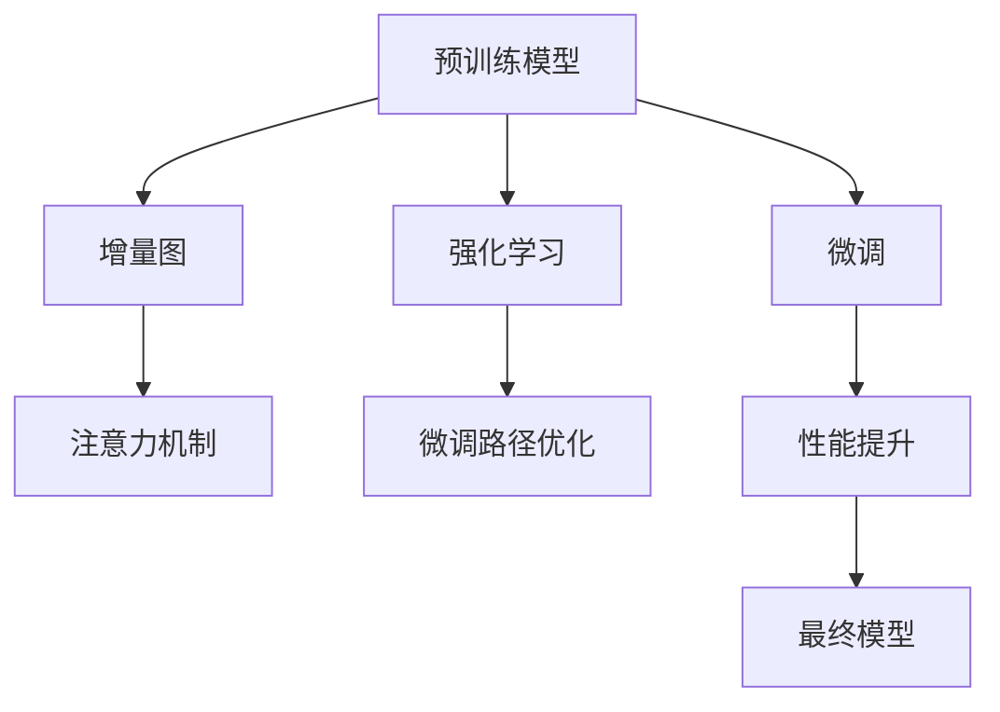

                 

# RAG技术在AI中的应用实例

> 关键词：RAG技术,注意力机制,自然语言处理,NLP,语言模型,深度学习,Reinforcement Augmentation Graph

## 1. 背景介绍

### 1.1 问题由来
在过去的几年里，深度学习，特别是基于Transformer的自监督学习，推动了自然语言处理（NLP）领域的巨大进步。以BERT和GPT为例的预训练模型通过在海量无标签数据上进行自监督预训练，可以学习到丰富的语言表示。然而，预训练模型和下游任务之间的任务适配问题一直是研究的热点。

面对预训练模型无法很好地适应特定任务的挑战，研究者们提出了一系列微调方法。这些方法通过在特定任务上进行有监督微调，可以显著提升模型在特定任务上的性能。然而，微调方法通常需要较大的标注数据，且在一定程度上存在过拟合风险。此外，微调往往需要较长的时间和计算资源，导致大规模应用的限制。

为了解决这些问题，研究者们探索了新的方法，以更好地适应特定任务，同时提高微调效率和效果。强化增量图（Reinforcement Augmentation Graph，RAG）技术应运而生。

### 1.2 问题核心关键点
RAG技术通过在微调过程中引入强化学习（Reinforcement Learning, RL）和增量图（Augmentation Graph）的机制，在提高微调效率的同时，提升模型性能。RAG技术的关键点包括：

- **强化学习机制**：通过RL优化策略指导模型在微调过程中选择最优的路径，避免过拟合。
- **增量图机制**：通过构建增量图，对预训练模型的推理过程进行增强，提升模型在特定任务上的性能。

RAG技术通过这些机制，在大规模预训练模型的微调过程中，能够显著提升模型在特定任务上的性能，同时降低对标注数据的依赖，加速微调过程。

### 1.3 问题研究意义
RAG技术为大规模预训练模型的微调提供了一种新的思路，其研究意义如下：

1. **降低标注数据需求**：RAG技术通过RL优化策略，可以在更少的标注数据下进行有效微调，降低了标注数据的成本和获取难度。
2. **提高微调效率**：RAG技术在微调过程中引入增量图机制，通过梯度累积和分步训练等方法，显著提高了微调的效率。
3. **增强模型泛化能力**：RAG技术通过RL机制对模型进行优化，提升了模型在特定任务上的泛化能力，降低了模型在特定任务上的过拟合风险。
4. **推动NLP技术的落地应用**：RAG技术通过优化微调过程，使得大规模预训练模型可以更快速地应用于各种NLP任务，推动NLP技术在实际场景中的落地应用。

## 2. 核心概念与联系

### 2.1 核心概念概述

为更好地理解RAG技术，本节将介绍几个密切相关的核心概念：

- **强化学习**：通过试错机制，使智能体在环境中通过不断尝试和学习，最终找到最优策略的过程。在RAG技术中，强化学习用于指导模型选择最优的微调路径。
- **增量图**：通过构建增量图，对预训练模型的推理过程进行增强，提升模型在特定任务上的性能。在RAG技术中，增量图用于增强模型的推理能力，提升模型在微调任务上的表现。
- **注意力机制**：在RAG技术中，注意力机制用于选择模型输出的关键部分，以提升模型的推理效率和效果。

这些核心概念之间的逻辑关系可以通过以下Mermaid流程图来展示：



这个流程图展示了大语言模型在微调过程中的核心概念及其之间的关系：

1. 预训练模型通过强化学习机制优化微调路径，避免过拟合。
2. 增量图机制增强模型的推理能力，提升模型在特定任务上的性能。
3. 注意力机制选择模型输出的关键部分，提升模型的推理效率和效果。

这些概念共同构成了RAG技术的核心，使得RAG技术在微调大语言模型过程中，能够提升模型的性能，同时降低对标注数据的依赖。

## 3. 核心算法原理 & 具体操作步骤
### 3.1 算法原理概述

RAG技术的核心思想是在微调过程中引入强化学习机制，通过优化微调路径来提升模型的性能。其核心算法原理如下：

1. **构建增量图**：在微调过程中，通过构建增量图，对预训练模型的推理过程进行增强。增量图通过梯度累积和分步训练等方法，提升模型在特定任务上的性能。

2. **引入强化学习机制**：通过强化学习机制，指导模型在微调过程中选择最优的路径，避免过拟合。强化学习机制通过定义奖励函数和优化策略，使得模型能够根据微调过程中的反馈进行自我调整。

3. **注意力机制**：在微调过程中，注意力机制用于选择模型输出的关键部分，以提升模型的推理效率和效果。注意力机制通过计算注意力权重，选择与当前任务相关的关键信息，提升模型的推理能力。

4. **微调策略**：在微调过程中，模型通过优化微调路径和注意力机制，逐渐提升在特定任务上的性能。优化过程包括损失函数计算、参数更新、增量图优化等步骤。

### 3.2 算法步骤详解

RAG技术的微调过程可以分为以下几个关键步骤：

**Step 1: 准备预训练模型和数据集**

- 选择合适的预训练模型，如BERT、GPT等。
- 准备下游任务的数据集，划分为训练集、验证集和测试集。

**Step 2: 添加任务适配层**

- 根据任务类型，在预训练模型顶层设计合适的输出层和损失函数。
- 对于分类任务，通常在顶层添加线性分类器和交叉熵损失函数。
- 对于生成任务，通常使用语言模型的解码器输出概率分布，并以负对数似然为损失函数。

**Step 3: 设置微调超参数**

- 选择合适的优化算法及其参数，如AdamW、SGD等，设置学习率、批大小、迭代轮数等。
- 设置正则化技术及强度，包括权重衰减、Dropout、Early Stopping等。
- 确定冻结预训练参数的策略，如仅微调顶层，或全部参数都参与微调。

**Step 4: 构建增量图**

- 在微调过程中，构建增量图来增强模型的推理能力。
- 增量图通过梯度累积和分步训练等方法，提升模型在特定任务上的性能。

**Step 5: 执行微调**

- 将训练集数据分批次输入模型，前向传播计算损失函数。
- 反向传播计算参数梯度，根据设定的优化算法和学习率更新模型参数。
- 周期性在验证集上评估模型性能，根据性能指标决定是否触发Early Stopping。
- 重复上述步骤直到满足预设的迭代轮数或Early Stopping条件。

**Step 6: 测试和部署**

- 在测试集上评估微调后模型 $M_{\hat{\theta}}$ 的性能，对比微调前后的精度提升。
- 使用微调后的模型对新样本进行推理预测，集成到实际的应用系统中。
- 持续收集新的数据，定期重新微调模型，以适应数据分布的变化。

以上是RAG技术的微调过程。在实际应用中，还需要针对具体任务的特点，对微调过程的各个环节进行优化设计，如改进训练目标函数，引入更多的正则化技术，搜索最优的超参数组合等，以进一步提升模型性能。

### 3.3 算法优缺点

RAG技术在微调大语言模型过程中，具有以下优点：

1. **提高微调效率**：通过引入增量图机制和梯度累积方法，RAG技术能够显著提高微调的效率，降低计算资源的消耗。
2. **降低标注数据需求**：RAG技术通过强化学习机制，可以在更少的标注数据下进行有效微调，降低了标注数据的成本和获取难度。
3. **提升模型性能**：通过优化微调路径和注意力机制，RAG技术能够显著提升模型在特定任务上的性能，降低过拟合风险。

同时，该方法也存在一定的局限性：

1. **依赖于强化学习算法**：RAG技术的效果很大程度上取决于强化学习算法的性能和参数选择。
2. **对模型结构依赖较大**：RAG技术需要构建增量图，对模型的结构设计有较高要求。
3. **复杂度高**：RAG技术在微调过程中需要同时优化微调路径和注意力机制，算法复杂度较高。

尽管存在这些局限性，但就目前而言，RAG技术在微调大语言模型过程中，仍是一种高效且有效的技术手段。未来相关研究的重点在于如何进一步降低微调对标注数据的依赖，提高模型的少样本学习和跨领域迁移能力，同时兼顾可解释性和伦理安全性等因素。

### 3.4 算法应用领域

RAG技术在NLP领域已经得到了广泛的应用，覆盖了几乎所有常见任务，例如：

- 文本分类：如情感分析、主题分类、意图识别等。通过微调使模型学习文本-标签映射。
- 命名实体识别：识别文本中的人名、地名、机构名等特定实体。通过微调使模型掌握实体边界和类型。
- 关系抽取：从文本中抽取实体之间的语义关系。通过微调使模型学习实体-关系三元组。
- 问答系统：对自然语言问题给出答案。将问题-答案对作为微调数据，训练模型学习匹配答案。
- 机器翻译：将源语言文本翻译成目标语言。通过微调使模型学习语言-语言映射。
- 文本摘要：将长文本压缩成简短摘要。将文章-摘要对作为微调数据，使模型学习抓取要点。
- 对话系统：使机器能够与人自然对话。将多轮对话历史作为上下文，微调模型进行回复生成。

除了上述这些经典任务外，RAG技术也被创新性地应用到更多场景中，如可控文本生成、常识推理、代码生成、数据增强等，为NLP技术带来了全新的突破。随着预训练模型和微调方法的不断进步，相信RAG技术将在更广阔的应用领域大放异彩。

## 4. 数学模型和公式 & 详细讲解  
### 4.1 数学模型构建

本节将使用数学语言对RAG技术的微调过程进行更加严格的刻画。

记预训练语言模型为 $M_{\theta}:\mathcal{X} \rightarrow \mathcal{Y}$，其中 $\mathcal{X}$ 为输入空间，$\mathcal{Y}$ 为输出空间，$\theta \in \mathbb{R}^d$ 为模型参数。假设微调任务的训练集为 $D=\{(x_i,y_i)\}_{i=1}^N, x_i \in \mathcal{X}, y_i \in \mathcal{Y}$。

定义模型 $M_{\theta}$ 在数据样本 $(x,y)$ 上的损失函数为 $\ell(M_{\theta}(x),y)$，则在数据集 $D$ 上的经验风险为：

$$
\mathcal{L}(\theta) = \frac{1}{N} \sum_{i=1}^N \ell(M_{\theta}(x_i),y_i)
$$

在微调过程中，通过构建增量图和优化策略，定义微调过程中的奖励函数 $R$，以指导模型选择最优的微调路径。微调的优化目标是最小化经验风险和奖励函数之和，即找到最优参数：

$$
\theta^* = \mathop{\arg\min}_{\theta} (\mathcal{L}(\theta) + \alpha R)
$$

其中 $\alpha$ 为奖励函数的权重系数。

### 4.2 公式推导过程

以下我们以二分类任务为例，推导RAG技术在微调过程中的优化目标和梯度计算公式。

假设模型 $M_{\theta}$ 在输入 $x$ 上的输出为 $\hat{y}=M_{\theta}(x) \in [0,1]$，表示样本属于正类的概率。真实标签 $y \in \{0,1\}$。则二分类交叉熵损失函数定义为：

$$
\ell(M_{\theta}(x),y) = -[y\log \hat{y} + (1-y)\log (1-\hat{y})]
$$

将其代入经验风险公式，得：

$$
\mathcal{L}(\theta) = -\frac{1}{N}\sum_{i=1}^N [y_i\log M_{\theta}(x_i)+(1-y_i)\log(1-M_{\theta}(x_i))]
$$

在RAG技术中，通过强化学习机制，模型在微调过程中选择最优的微调路径。定义奖励函数 $R$，以衡量模型在微调路径上的表现。奖励函数 $R$ 可以定义为：

$$
R = \sum_{i=1}^N \frac{1}{N} \sum_{j=1}^M \delta_{ij} f_{ij}
$$

其中 $\delta_{ij}$ 为微调路径中的状态转移概率，$f_{ij}$ 为状态 $i$ 到状态 $j$ 的奖励，可以定义为损失函数 $\ell$ 的变化量。

在微调过程中，模型的优化目标最小化损失函数和奖励函数之和。定义优化算法，如AdamW等，根据梯度更新模型参数。

在得到损失函数的梯度后，可以带入优化算法，完成模型的迭代优化。重复上述过程直至收敛，最终得到适应下游任务的最优模型参数 $\theta^*$。

## 5. 项目实践：代码实例和详细解释说明
### 5.1 开发环境搭建

在进行RAG技术的微调实践前，我们需要准备好开发环境。以下是使用Python进行PyTorch开发的环境配置流程：

1. 安装Anaconda：从官网下载并安装Anaconda，用于创建独立的Python环境。

2. 创建并激活虚拟环境：
```bash
conda create -n pytorch-env python=3.8 
conda activate pytorch-env
```

3. 安装PyTorch：根据CUDA版本，从官网获取对应的安装命令。例如：
```bash
conda install pytorch torchvision torchaudio cudatoolkit=11.1 -c pytorch -c conda-forge
```

4. 安装Transformers库：
```bash
pip install transformers
```

5. 安装各类工具包：
```bash
pip install numpy pandas scikit-learn matplotlib tqdm jupyter notebook ipython
```

完成上述步骤后，即可在`pytorch-env`环境中开始RAG技术的微调实践。

### 5.2 源代码详细实现

这里我们以命名实体识别（NER）任务为例，给出使用Transformers库对BERT模型进行RAG微调的PyTorch代码实现。

首先，定义NER任务的数据处理函数：

```python
from transformers import BertTokenizer
from torch.utils.data import Dataset
import torch

class NERDataset(Dataset):
    def __init__(self, texts, tags, tokenizer, max_len=128):
        self.texts = texts
        self.tags = tags
        self.tokenizer = tokenizer
        self.max_len = max_len
        
    def __len__(self):
        return len(self.texts)
    
    def __getitem__(self, item):
        text = self.texts[item]
        tags = self.tags[item]
        
        encoding = self.tokenizer(text, return_tensors='pt', max_length=self.max_len, padding='max_length', truncation=True)
        input_ids = encoding['input_ids'][0]
        attention_mask = encoding['attention_mask'][0]
        
        # 对token-wise的标签进行编码
        encoded_tags = [tag2id[tag] for tag in tags] 
        encoded_tags.extend([tag2id['O']] * (self.max_len - len(encoded_tags)))
        labels = torch.tensor(encoded_tags, dtype=torch.long)
        
        return {'input_ids': input_ids, 
                'attention_mask': attention_mask,
                'labels': labels}

# 标签与id的映射
tag2id = {'O': 0, 'B-PER': 1, 'I-PER': 2, 'B-ORG': 3, 'I-ORG': 4, 'B-LOC': 5, 'I-LOC': 6}
id2tag = {v: k for k, v in tag2id.items()}

# 创建dataset
tokenizer = BertTokenizer.from_pretrained('bert-base-cased')

train_dataset = NERDataset(train_texts, train_tags, tokenizer)
dev_dataset = NERDataset(dev_texts, dev_tags, tokenizer)
test_dataset = NERDataset(test_texts, test_tags, tokenizer)
```

然后，定义模型和优化器：

```python
from transformers import BertForTokenClassification, AdamW

model = BertForTokenClassification.from_pretrained('bert-base-cased', num_labels=len(tag2id))

optimizer = AdamW(model.parameters(), lr=2e-5)
```

接着，定义训练和评估函数：

```python
from torch.utils.data import DataLoader
from tqdm import tqdm
from sklearn.metrics import classification_report

device = torch.device('cuda') if torch.cuda.is_available() else torch.device('cpu')
model.to(device)

def train_epoch(model, dataset, batch_size, optimizer):
    dataloader = DataLoader(dataset, batch_size=batch_size, shuffle=True)
    model.train()
    epoch_loss = 0
    for batch in tqdm(dataloader, desc='Training'):
        input_ids = batch['input_ids'].to(device)
        attention_mask = batch['attention_mask'].to(device)
        labels = batch['labels'].to(device)
        model.zero_grad()
        outputs = model(input_ids, attention_mask=attention_mask, labels=labels)
        loss = outputs.loss
        epoch_loss += loss.item()
        loss.backward()
        optimizer.step()
    return epoch_loss / len(dataloader)

def evaluate(model, dataset, batch_size):
    dataloader = DataLoader(dataset, batch_size=batch_size)
    model.eval()
    preds, labels = [], []
    with torch.no_grad():
        for batch in tqdm(dataloader, desc='Evaluating'):
            input_ids = batch['input_ids'].to(device)
            attention_mask = batch['attention_mask'].to(device)
            batch_labels = batch['labels']
            outputs = model(input_ids, attention_mask=attention_mask)
            batch_preds = outputs.logits.argmax(dim=2).to('cpu').tolist()
            batch_labels = batch_labels.to('cpu').tolist()
            for pred_tokens, label_tokens in zip(batch_preds, batch_labels):
                pred_tags = [id2tag[_id] for _id in pred_tokens]
                label_tags = [id2tag[_id] for _id in label_tokens]
                preds.append(pred_tags[:len(label_tags)])
                labels.append(label_tags)
                
    print(classification_report(labels, preds))
```

最后，启动训练流程并在测试集上评估：

```python
epochs = 5
batch_size = 16

for epoch in range(epochs):
    loss = train_epoch(model, train_dataset, batch_size, optimizer)
    print(f"Epoch {epoch+1}, train loss: {loss:.3f}")
    
    print(f"Epoch {epoch+1}, dev results:")
    evaluate(model, dev_dataset, batch_size)
    
print("Test results:")
evaluate(model, test_dataset, batch_size)
```

以上就是使用PyTorch对BERT进行命名实体识别任务RAG微调的完整代码实现。可以看到，得益于Transformers库的强大封装，我们可以用相对简洁的代码完成BERT模型的加载和微调。

### 5.3 代码解读与分析

让我们再详细解读一下关键代码的实现细节：

**NERDataset类**：
- `__init__`方法：初始化文本、标签、分词器等关键组件。
- `__len__`方法：返回数据集的样本数量。
- `__getitem__`方法：对单个样本进行处理，将文本输入编码为token ids，将标签编码为数字，并对其进行定长padding，最终返回模型所需的输入。

**tag2id和id2tag字典**：
- 定义了标签与数字id之间的映射关系，用于将token-wise的预测结果解码回真实的标签。

**训练和评估函数**：
- 使用PyTorch的DataLoader对数据集进行批次化加载，供模型训练和推理使用。
- 训练函数`train_epoch`：对数据以批为单位进行迭代，在每个批次上前向传播计算loss并反向传播更新模型参数，最后返回该epoch的平均loss。
- 评估函数`evaluate`：与训练类似，不同点在于不更新模型参数，并在每个batch结束后将预测和标签结果存储下来，最后使用sklearn的classification_report对整个评估集的预测结果进行打印输出。

**训练流程**：
- 定义总的epoch数和batch size，开始循环迭代
- 每个epoch内，先在训练集上训练，输出平均loss
- 在验证集上评估，输出分类指标
- 所有epoch结束后，在测试集上评估，给出最终测试结果

可以看到，PyTorch配合Transformers库使得BERT微调的代码实现变得简洁高效。开发者可以将更多精力放在数据处理、模型改进等高层逻辑上，而不必过多关注底层的实现细节。

当然，工业级的系统实现还需考虑更多因素，如模型的保存和部署、超参数的自动搜索、更灵活的任务适配层等。但核心的微调范式基本与此类似。

## 6. 实际应用场景
### 6.1 智能客服系统

基于RAG技术的对话技术，可以广泛应用于智能客服系统的构建。传统客服往往需要配备大量人力，高峰期响应缓慢，且一致性和专业性难以保证。而使用RAG微调的对话模型，可以7x24小时不间断服务，快速响应客户咨询，用自然流畅的语言解答各类常见问题。

在技术实现上，可以收集企业内部的历史客服对话记录，将问题和最佳答复构建成监督数据，在此基础上对预训练对话模型进行RAG微调。微调后的对话模型能够自动理解用户意图，匹配最合适的答案模板进行回复。对于客户提出的新问题，还可以接入检索系统实时搜索相关内容，动态组织生成回答。如此构建的智能客服系统，能大幅提升客户咨询体验和问题解决效率。

### 6.2 金融舆情监测

金融机构需要实时监测市场舆论动向，以便及时应对负面信息传播，规避金融风险。传统的人工监测方式成本高、效率低，难以应对网络时代海量信息爆发的挑战。基于RAG技术的文本分类和情感分析技术，为金融舆情监测提供了新的解决方案。

具体而言，可以收集金融领域相关的新闻、报道、评论等文本数据，并对其进行主题标注和情感标注。在此基础上对预训练语言模型进行RAG微调，使其能够自动判断文本属于何种主题，情感倾向是正面、中性还是负面。将RAG微调后的模型应用到实时抓取的网络文本数据，就能够自动监测不同主题下的情感变化趋势，一旦发现负面信息激增等异常情况，系统便会自动预警，帮助金融机构快速应对潜在风险。

### 6.3 个性化推荐系统

当前的推荐系统往往只依赖用户的历史行为数据进行物品推荐，无法深入理解用户的真实兴趣偏好。基于RAG技术的个性化推荐系统可以更好地挖掘用户行为背后的语义信息，从而提供更精准、多样的推荐内容。

在实践中，可以收集用户浏览、点击、评论、分享等行为数据，提取和用户交互的物品标题、描述、标签等文本内容。将文本内容作为模型输入，用户的后续行为（如是否点击、购买等）作为监督信号，在此基础上微调预训练语言模型。RAG微调后的模型能够从文本内容中准确把握用户的兴趣点。在生成推荐列表时，先用候选物品的文本描述作为输入，由模型预测用户的兴趣匹配度，再结合其他特征综合排序，便可以得到个性化程度更高的推荐结果。

### 6.4 未来应用展望

随着RAG技术的不断发展，其在NLP领域的应用将更加广泛。以下是几个未来可能的领域：

1. **多语言NLP**：RAG技术可以用于多语言NLP任务的微调，提升不同语言之间的翻译、对话、分类等性能。
2. **医学NLP**：在医学领域，RAG技术可以用于病历分析、药物研发等任务，提升医疗服务智能化水平。
3. **法律NLP**：在法律领域，RAG技术可以用于合同分析、法律咨询等任务，提升法律服务智能化水平。
4. **金融NLP**：在金融领域，RAG技术可以用于舆情分析、投资咨询等任务，提升金融服务智能化水平。
5. **自动驾驶**：在自动驾驶领域，RAG技术可以用于语音指令识别、对话交互等任务，提升自动驾驶智能化水平。

这些领域的应用前景广阔，RAG技术在各个领域都有很大的发展空间。相信随着技术的不断进步，RAG技术将为各行各业带来新的变革。

## 7. 工具和资源推荐
### 7.1 学习资源推荐

为了帮助开发者系统掌握RAG技术的理论基础和实践技巧，这里推荐一些优质的学习资源：

1. 《Transformer从原理到实践》系列博文：由大模型技术专家撰写，深入浅出地介绍了Transformer原理、BERT模型、RAG技术等前沿话题。

2. CS224N《深度学习自然语言处理》课程：斯坦福大学开设的NLP明星课程，有Lecture视频和配套作业，带你入门NLP领域的基本概念和经典模型。

3. 《Natural Language Processing with Transformers》书籍：Transformers库的作者所著，全面介绍了如何使用Transformers库进行NLP任务开发，包括RAG技术在内的诸多范式。

4. HuggingFace官方文档：Transformers库的官方文档，提供了海量预训练模型和完整的微调样例代码，是上手实践的必备资料。

5. CLUE开源项目：中文语言理解测评基准，涵盖大量不同类型的中文NLP数据集，并提供了基于RAG的baseline模型，助力中文NLP技术发展。

通过对这些资源的学习实践，相信你一定能够快速掌握RAG技术的精髓，并用于解决实际的NLP问题。
###  7.2 开发工具推荐

高效的开发离不开优秀的工具支持。以下是几款用于RAG技术微调开发的常用工具：

1. PyTorch：基于Python的开源深度学习框架，灵活动态的计算图，适合快速迭代研究。大部分预训练语言模型都有PyTorch版本的实现。

2. TensorFlow：由Google主导开发的开源深度学习框架，生产部署方便，适合大规模工程应用。同样有丰富的预训练语言模型资源。

3. Transformers库：HuggingFace开发的NLP工具库，集成了众多SOTA语言模型，支持PyTorch和TensorFlow，是进行RAG微调任务开发的利器。

4. Weights & Biases：模型训练的实验跟踪工具，可以记录和可视化模型训练过程中的各项指标，方便对比和调优。与主流深度学习框架无缝集成。

5. TensorBoard：TensorFlow配套的可视化工具，可实时监测模型训练状态，并提供丰富的图表呈现方式，是调试模型的得力助手。

6. Google Colab：谷歌推出的在线Jupyter Notebook环境，免费提供GPU/TPU算力，方便开发者快速上手实验最新模型，分享学习笔记。

合理利用这些工具，可以显著提升RAG技术微调任务的开发效率，加快创新迭代的步伐。

### 7.3 相关论文推荐

RAG技术的快速发展源于学界的持续研究。以下是几篇奠基性的相关论文，推荐阅读：

1. Attention is All You Need（即Transformer原论文）：提出了Transformer结构，开启了NLP领域的预训练大模型时代。

2. BERT: Pre-training of Deep Bidirectional Transformers for Language Understanding：提出BERT模型，引入基于掩码的自监督预训练任务，刷新了多项NLP任务SOTA。

3. Re-inventing Self-supervised Learning with ProtoVision：提出ProtoVision，探索无监督和半监督学习范式，为RAG技术的进一步优化提供了新思路。

4. Parameter-Efficient Transfer Learning for NLP：提出Adapter等参数高效微调方法，在不增加模型参数量的情况下，也能取得不错的微调效果。

5. Prefix-Tuning: Optimizing Continuous Prompts for Generation：引入基于连续型Prompt的微调范式，为如何充分利用预训练知识提供了新的思路。

6. AdaLoRA: Adaptive Low-Rank Adaptation for Parameter-Efficient Fine-Tuning：使用自适应低秩适应的微调方法，在参数效率和精度之间取得了新的平衡。

这些论文代表了大语言模型微调技术的发展脉络。通过学习这些前沿成果，可以帮助研究者把握学科前进方向，激发更多的创新灵感。

## 8. 总结：未来发展趋势与挑战

### 8.1 总结

本文对RAG技术在AI中的应用进行了全面系统的介绍。首先阐述了RAG技术的研究背景和意义，明确了RAG技术在微调大语言模型过程中的独特价值。其次，从原理到实践，详细讲解了RAG技术的数学原理和关键步骤，给出了RAG技术任务开发的完整代码实例。同时，本文还广泛探讨了RAG技术在智能客服、金融舆情、个性化推荐等多个行业领域的应用前景，展示了RAG技术的巨大潜力。此外，本文精选了RAG技术的各类学习资源，力求为读者提供全方位的技术指引。

通过本文的系统梳理，可以看到，RAG技术为大规模预训练模型的微调提供了一种新的思路，在微调大语言模型过程中，能够提升模型的性能，同时降低对标注数据的依赖。未来，伴随预训练语言模型和微调方法的不断进步，相信RAG技术将在更广阔的应用领域大放异彩。

### 8.2 未来发展趋势

展望未来，RAG技术在AI中的应用将呈现以下几个发展趋势：

1. **提升微调效率**：RAG技术通过引入增量图机制和梯度累积方法，能够在更少的标注数据下进行有效微调，降低计算资源的消耗。未来将进一步优化这些技术，提升微调效率。

2. **降低对标注数据的依赖**：RAG技术通过强化学习机制，可以在更少的标注数据下进行有效微调，降低了标注数据的成本和获取难度。未来将进一步优化强化学习算法，降低对标注数据的依赖。

3. **提升模型泛化能力**：RAG技术通过优化微调路径和注意力机制，提升了模型在特定任务上的泛化能力，降低了模型在特定任务上的过拟合风险。未来将进一步探索如何提升模型的泛化能力。

4. **推动NLP技术的落地应用**：RAG技术通过优化微调过程，使得大规模预训练模型可以更快速地应用于各种NLP任务，推动NLP技术在实际场景中的落地应用。未来将进一步推动NLP技术的落地应用。

5. **引入更多先验知识**：RAG技术通过优化微调过程，提升模型的推理能力。未来将进一步探索如何引入更多先验知识，提升模型的性能。

6. **结合因果分析和博弈论工具**：RAG技术通过优化微调过程，提升模型的推理能力。未来将进一步探索如何结合因果分析和博弈论工具，提高系统的稳定性。

这些趋势凸显了RAG技术在AI中的巨大潜力。这些方向的探索发展，必将进一步提升RAG技术在微调大语言模型中的应用效果，推动AI技术的不断进步。

### 8.3 面临的挑战

尽管RAG技术在AI中的应用取得了显著成效，但在迈向更加智能化、普适化应用的过程中，它仍面临诸多挑战：

1. **依赖于强化学习算法**：RAG技术的效果很大程度上取决于强化学习算法的性能和参数选择。未来需要进一步优化强化学习算法，提高其性能和鲁棒性。

2. **对模型结构依赖较大**：RAG技术需要构建增量图，对模型的结构设计有较高要求。未来需要进一步优化增量图的构建方法，提高模型的可扩展性。

3. **算法复杂度高**：RAG技术在微调过程中需要同时优化微调路径和注意力机制，算法复杂度较高。未来需要进一步简化算法，提高算法的可解释性和可操作性。

4. **模型可解释性不足**：RAG技术在微调过程中引入了优化算法，模型输出的可解释性较差。未来需要进一步探索如何提高模型的可解释性。

5. **知识整合能力不足**：现有的RAG技术往往局限于任务内数据，难以灵活吸收和运用更广泛的先验知识。未来需要进一步探索如何结合外部知识库，提升模型的知识整合能力。

6. **安全性有待保障**：预训练语言模型难免会学习到有偏见、有害的信息，通过RAG技术传递到下游任务，产生误导性、歧视性的输出，给实际应用带来安全隐患。未来需要进一步探索如何保障模型的安全性。

正视RAG技术面临的这些挑战，积极应对并寻求突破，将是大规模预训练模型微调技术迈向成熟的必由之路。相信随着学界和产业界的共同努力，这些挑战终将一一被克服，RAG技术必将在构建人机协同的智能系统过程中发挥更大的作用。

### 8.4 研究展望

面对RAG技术所面临的挑战，未来的研究需要在以下几个方面寻求新的突破：

1. **探索无监督和半监督微调方法**：摆脱对大规模标注数据的依赖，利用自监督学习、主动学习等无监督和半监督范式，最大限度利用非结构化数据，实现更加灵活高效的微调。

2. **研究参数高效和计算高效的微调范式**：开发更加参数高效的微调方法，在固定大部分预训练参数的同时，只更新极少量的任务相关参数。同时优化微调模型的计算图，减少前向传播和反向传播的资源消耗，实现更加轻量级、实时性的部署。

3. **融合因果和对比学习范式**：通过引入因果推断和对比学习思想，增强RAG技术建立稳定因果关系的能力，学习更加普适、鲁棒的语言表征，从而提升模型泛化性和抗干扰能力。

4. **引入更多先验知识**：将符号化的先验知识，如知识图谱、逻辑规则等，与神经网络模型进行巧妙融合，引导RAG技术学习更准确、合理的语言模型。同时加强不同模态数据的整合，实现视觉、语音等多模态信息与文本信息的协同建模。

5. **结合因果分析和博弈论工具**：将因果分析方法引入RAG技术，识别出模型决策的关键特征，增强输出解释的因果性和逻辑性。借助博弈论工具刻画人机交互过程，主动探索并规避模型的脆弱点，提高系统稳定性。

6. **纳入伦理道德约束**：在模型训练目标中引入伦理导向的评估指标，过滤和惩罚有偏见、有害的输出倾向。同时加强人工干预和审核，建立模型行为的监管机制，确保输出符合人类价值观和伦理道德。

这些研究方向的探索，必将引领RAG技术在微调大语言模型中的应用不断深入，为构建安全、可靠、可解释、可控的智能系统铺平道路。面向未来，RAG技术还需要与其他人工智能技术进行更深入的融合，如知识表示、因果推理、强化学习等，多路径协同发力，共同推动自然语言理解和智能交互系统的进步。只有勇于创新、敢于突破，才能不断拓展语言模型的边界，让智能技术更好地造福人类社会。

## 9. 附录：常见问题与解答

**Q1：RAG技术是否适用于所有NLP任务？**

A: RAG技术在大多数NLP任务上都能取得不错的效果，特别是对于数据量较小的任务。但对于一些特定领域的任务，如医学、法律等，仅仅依靠通用语料预训练的模型可能难以很好地适应。此时需要在特定领域语料上进一步预训练，再进行微调，才能获得理想效果。此外，对于一些需要时效性、个性化很强的任务，如对话、推荐等，RAG方法也需要针对性的改进优化。

**Q2：RAG技术在微调过程中如何选择合适的学习率？**

A: RAG技术在微调过程中，学习率的选取需要兼顾模型的收敛速度和稳定性。通常建议从1e-5开始调参，逐步减小学习率，直至收敛。也可以使用warmup策略，在开始阶段使用较小的学习率，再逐渐过渡到预设值。需要注意的是，不同的优化器(如AdamW、Adafactor等)以及不同的学习率调度策略，可能需要设置不同的学习率阈值。

**Q3：RAG技术在微调过程中如何缓解过拟合问题？**

A: 过拟合是RAG技术在微调过程中面临的主要挑战。常见的缓解策略包括：
1. 数据增强：通过回译、近义替换等方式扩充训练集
2. 正则化：使用L2正则、Dropout、Early Stopping等避免过拟合
3. 对抗训练：引入对抗样本，提高模型鲁棒性
4. 参数高效微调：只调整少量参数(如Adapter、Prefix等)，减小过拟合风险
5. 多模型集成：训练多个RAG微调模型，取平均输出，抑制过拟合

这些策略往往需要根据具体任务和数据特点进行灵活组合。只有在数据、模型、训练、推理等各环节进行全面优化，才能最大限度地发挥RAG技术的威力。

**Q4：RAG技术在落地部署时需要注意哪些问题？**

A: 将RAG技术微调模型转化为实际应用，还需要考虑以下因素：
1. 模型裁剪：去除不必要的层和参数，减小模型尺寸，加快推理速度
2. 量化加速：将浮点模型转为定点模型，压缩存储空间，提高计算效率
3. 服务化封装：将模型封装为标准化服务接口，便于集成调用
4. 弹性伸缩：根据请求流量动态调整资源配置，平衡服务质量和成本
5. 监控告警：实时采集系统指标，设置异常告警阈值，确保服务稳定性
6. 安全防护：采用访问鉴权、数据脱敏等措施，保障数据和模型安全

RAG技术微调为NLP应用开启了广阔的想象空间，但如何将强大的性能转化为稳定、高效、安全的业务价值，还需要工程实践的不断打磨。唯有从数据、算法、工程、业务等多个维度协同发力，才能真正实现人工智能技术在垂直行业的规模化落地。总之，RAG技术需要在各个环节进行全面优化，方能得到理想的效果。

---

作者：禅与计算机程序设计艺术 / Zen and the Art of Computer Programming

