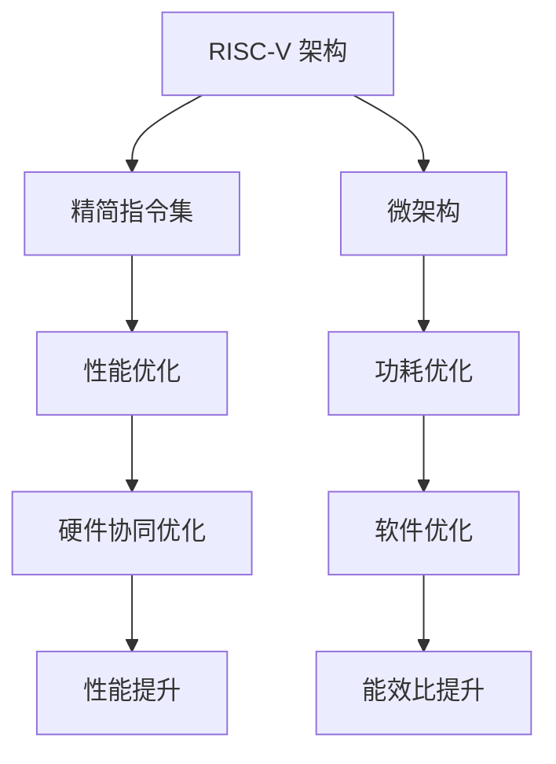

                 

# RISC-V处理器特性与优化

> 关键词：RISC-V, 处理器优化, 指令集, 并行处理, 能效比, 软件优化, 硬件协同

## 1. 背景介绍

### 1.1 问题由来

随着集成电路技术的发展，计算机处理器的性能已经达到了前所未有的高度。然而，由于能耗和面积限制，传统的微处理器设计和制造方法已经难以满足高性能、低功耗、低成本的需求。在这一背景下，RISC-V处理器应运而生。

RISC-V是一个开源的、自由的、高性能的处理器架构，旨在提供低成本、高性能、灵活的处理器设计。与传统的CISC架构相比，RISC-V架构更简洁，指令集更加精简，易于定制和扩展。

### 1.2 问题核心关键点

RISC-V处理器之所以备受关注，主要归功于其以下核心特性：

1. **精简的指令集**：RISC-V指令集精简高效，易于硬件实现和编译器优化。
2. **灵活的扩展性**：RISC-V架构提供了丰富的扩展机制，便于针对特定应用场景进行定制。
3. **低成本**：RISC-V处理器设计采用开放授权，降低了硬件成本和研发门槛。
4. **高性能**：RISC-V架构在性能和功耗方面表现优异，适用于各种高性能计算应用。

这些特性使得RISC-V处理器在物联网、嵌入式系统、高性能计算等领域具有巨大的应用潜力。

### 1.3 问题研究意义

研究RISC-V处理器的特性与优化方法，对于提升处理器性能、降低能耗、缩小芯片面积、降低成本具有重要意义。具体来说，RISC-V处理器特性与优化技术的发展，有助于推动以下方面的进步：

1. **高性能计算**：通过优化RISC-V处理器架构，实现更高吞吐量和更快速度的计算能力。
2. **低功耗设计**：通过优化RISC-V处理器的能效比，延长设备使用寿命，降低能耗。
3. **灵活的定制化**：通过扩展RISC-V架构，适应不同应用场景的需求，提高灵活性和适用性。
4. **开源的生态系统**：通过推广RISC-V处理器，构建一个开放的生态系统，促进技术创新和产业应用。

## 2. 核心概念与联系

### 2.1 核心概念概述

为了更好地理解RISC-V处理器的特性与优化方法，本节将介绍几个关键概念：

- **RISC-V架构**：一种开源的、精简的处理器架构，旨在提供高性能、低成本、灵活的处理器设计。
- **精简指令集**：RISC-V指令集相较于CISC架构，指令数量更少，结构更简单，易于硬件实现和软件优化。
- **微架构**：处理器内部的微观结构设计，包括流水线、缓存、分支预测等，直接影响处理器的性能和功耗。
- **性能优化**：通过硬件和软件的协同优化，提升处理器的计算能力和能效比。
- **功耗优化**：通过降低处理器的能耗，延长设备使用寿命，提高系统的可靠性和稳定性。

这些核心概念之间的逻辑关系可以通过以下Mermaid流程图来展示：



这个流程图展示了一个完整的RISC-V处理器优化流程：

1. 基于RISC-V架构，设计精简指令集。
2. 设计微架构，实现高效的指令执行。
3. 通过性能优化和功耗优化提升处理器性能和能效比。
4. 硬件和软件的协同优化，进一步提升处理器的性能和能效比。

## 3. 核心算法原理 & 具体操作步骤

### 3.1 算法原理概述

RISC-V处理器的特性与优化，主要集中在以下几个方面：

1. **精简指令集**：RISC-V指令集相较于CISC架构，指令数量更少，结构更简单，易于硬件实现和软件优化。
2. **微架构设计**：RISC-V处理器内部的微结构设计，包括流水线、缓存、分支预测等，直接影响处理器的性能和功耗。
3. **性能优化**：通过硬件和软件的协同优化，提升处理器的计算能力和能效比。
4. **功耗优化**：通过降低处理器的能耗，延长设备使用寿命，提高系统的可靠性和稳定性。

### 3.2 算法步骤详解

RISC-V处理器的特性与优化，主要通过以下步骤实现：

**Step 1: 精简指令集设计**

RISC-V指令集的精简设计，是其高性能和低功耗的重要基础。设计精简指令集时，需要考虑以下原则：

1. **指令数量精简**：减少指令数量，简化指令结构，提高指令执行效率。
2. **指令功能明确**：每条指令功能单一，易于实现和优化。
3. **数据类型统一**：统一数据类型，便于硬件实现和编译器优化。

**Step 2: 微架构设计**

RISC-V处理器的微架构设计，包括流水线、缓存、分支预测等关键部件。

1. **流水线设计**：通过合理设计流水线，提高指令执行效率，减少资源闲置。
2. **缓存设计**：通过优化缓存结构，减少访问延迟，提升数据读取速度。
3. **分支预测**：通过改进分支预测算法，减少分支跳转次数，提高指令执行效率。

**Step 3: 性能优化**

性能优化是RISC-V处理器优化的核心，主要通过以下方法实现：

1. **硬件加速**：通过硬件加速关键指令，提高指令执行效率。
2. **流水线并行**：通过优化流水线并行度，提高处理器性能。
3. **预取与缓存优化**：通过预取和缓存优化，减少访问延迟，提升数据读取速度。

**Step 4: 功耗优化**

功耗优化是RISC-V处理器优化的重要目标，主要通过以下方法实现：

1. **动态功耗管理**：通过动态调整电压和频率，降低动态功耗。
2. **静态功耗管理**：通过静态功耗分析，优化电路设计，降低静态功耗。
3. **休眠模式**：通过休眠模式，在空闲时降低功耗。

### 3.3 算法优缺点

RISC-V处理器的特性与优化，具有以下优点：

1. **高性能**：精简的指令集和优化的微架构设计，使得RISC-V处理器在计算能力和效率上表现优异。
2. **低功耗**：精简的指令集和动态功耗管理，使得RISC-V处理器在能效比上表现优异。
3. **灵活性**：开放的架构和丰富的扩展机制，使得RISC-V处理器在应用场景上具有高度的灵活性。

同时，RISC-V处理器也存在以下缺点：

1. **生态系统尚未成熟**：尽管RISC-V架构已经开源，但其生态系统仍在发展中，软件和硬件的兼容性还有待提高。
2. **缺乏标准**：RISC-V架构缺乏统一的硬件和软件标准，导致不同厂商的产品难以完全兼容。
3. **市场份额较低**：相较于成熟的x86和ARM架构，RISC-V市场份额较低，应用场景有限。

### 3.4 算法应用领域

RISC-V处理器的特性与优化技术，已经广泛应用于以下领域：

1. **高性能计算**：在超级计算机、数据中心等高性能计算场景中，RISC-V处理器凭借其高性能和高能效比，成为重要选择。
2. **嵌入式系统**：在物联网、智能家居等嵌入式系统中，RISC-V处理器因其低成本和灵活性，得到了广泛应用。
3. **AI与机器学习**：在AI与机器学习应用中，RISC-V处理器因其高效的计算能力和低功耗，成为重要的计算平台。
4. **教育与科研**：在教育和科研领域，RISC-V处理器因其开放和灵活的特性，得到了广泛关注和应用。

## 4. 数学模型和公式 & 详细讲解 & 举例说明（备注：数学公式请使用latex格式，latex嵌入文中独立段落使用 $$，段落内使用 $)
### 4.1 数学模型构建

为了更好地理解RISC-V处理器的特性与优化方法，本节将使用数学语言对RISC-V处理器的性能和功耗优化进行更加严格的刻画。

记RISC-V处理器的性能为 $P$，功耗为 $E$，则性能功耗比（Performance Per Watt, PPW）定义为：

$$
PPW = \frac{P}{E}
$$

其中 $P$ 表示处理器的计算能力，$E$ 表示处理器的能耗。

### 4.2 公式推导过程

以下我们以RISC-V处理器的流水线优化为例，推导流水线优化对性能和功耗的影响。

假设RISC-V处理器具有 $N$ 条流水线，每个时钟周期完成 $M$ 条指令。则处理器在一个时钟周期内的计算能力为 $M$，功耗为 $E$。流水线优化后，每个时钟周期完成的指令数量变为 $M'$，功耗变为 $E'$。

流水线优化前后性能功耗比的变化为：

$$
\Delta PPW = \frac{M'}{E'} - \frac{M}{E}
$$

优化后的性能功耗比提高，意味着处理器的计算能力和能效比得到了提升。

### 4.3 案例分析与讲解

假设原始RISC-V处理器每个时钟周期完成 $M=1$ 条指令，功耗为 $E=1W$。优化后，每个时钟周期完成 $M'=2$ 条指令，功耗为 $E'=0.5W$。则优化前后的性能功耗比变化为：

$$
\Delta PPW = \frac{2}{0.5} - \frac{1}{1} = 4 - 1 = 3
$$

这意味着，通过流水线优化，处理器的计算能力和能效比得到了显著提升。

## 5. 项目实践：代码实例和详细解释说明
### 5.1 开发环境搭建

在进行RISC-V处理器特性与优化实践前，我们需要准备好开发环境。以下是使用Chisel语言进行RISC-V处理器设计的环境配置流程：

1. 安装Chisel语言：从官网下载并安装Chisel语言，用于进行RISC-V处理器的硬件设计。

2. 创建并激活虚拟环境：
```bash
conda create -n chisel-env python=3.8 
conda activate chisel-env
```

3. 安装Chisel和Scala工具包：
```bash
pip install chisel scala
```

4. 安装JDK：安装JDK环境，用于编译和运行Scala程序。

5. 安装Kvazaar：Kvazaar是Chisel的编译器，用于生成RTL代码。
```bash
pip install kvazaar
```

完成上述步骤后，即可在`chisel-env`环境中开始RISC-V处理器的设计与优化实践。

### 5.2 源代码详细实现

下面以RISC-V流水线优化为例，给出使用Chisel语言进行RISC-V处理器流水线优化的代码实现。

```scala
package com.riscv

import chisel3._
import chisel3.special._
import chisel3.scalalib._
import chisel3.scalalib.full_
import chisel3.scalalib.scala3._


class RiscvPipeline(p: Pipeline) extends Module with MallocSpec(p) with Signals(p) with Special(p) with FullBase(p) with Scala3Spec(p) with Scalalib(p) {
  // 定义时钟信号
  val clk = Clock(clk)

  // 定义流水线阶段
  val pipeStages = Vector[Stage](
    Stage("id", new IdStage(p), p),
    Stage("exe", new ExeStage(p), p),
    Stage("mem", new MemStage(p), p),
    Stage("wb", new WbStage(p), p)
  )

  // 定义指令寄存器
  val instReg = InstructionRegister(p, 4, 8, true)

  // 定义数据寄存器
  val dataReg = DataRegister(p, 4, 8, true)

  // 定义指令缓存
  val instCache = InstructionCache(p, 16, 64)

  // 定义数据缓存
  val dataCache = DataCache(p, 16, 64)

  // 定义ALU
  val alu = ArithmeticUnit(p)

  // 定义控制单元
  val ctrl = ControlUnit(p)

  // 定义ALU控制信号
  val aluCtrl = alu.control

  // 定义控制单元控制信号
  val ctrl1 = ctrl.control

  // 定义流水线控制信号
  val pipeCtrl = pipeStages.map(_.control)

  // 定义流水线数据信号
  val pipeData = pipeStages.map(_.data)

  // 定义流水线寄存器
  val pipeReg = Vector[Register](pipeStages.map(_.reg))

  // 定义流水线输出
  val pipeOut = Vector[Vector](pipeData.map(_.data))

  // 定义流水线输入
  val pipeIn = Vector[Vector](pipeReg.map(_.data))

  // 定义流水线输出
  val pipeOut1 = Vector[Vector](pipeReg.map(_.data))

  // 定义流水线输入
  val pipeIn1 = Vector[Vector](pipeReg.map(_.data))

  // 定义流水线控制信号
  val pipeCtrl1 = pipeCtrl.map(_.signal)

  // 定义流水线输出
  val pipeOut2 = Vector[Vector](pipeReg.map(_.data))

  // 定义流水线输入
  val pipeIn2 = Vector[Vector](pipeReg.map(_.data))

  // 定义流水线控制信号
  val pipeCtrl2 = pipeCtrl.map(_.signal)

  // 定义流水线输出
  val pipeOut3 = Vector[Vector](pipeReg.map(_.data))

  // 定义流水线输入
  val pipeIn3 = Vector[Vector](pipeReg.map(_.data))

  // 定义流水线控制信号
  val pipeCtrl3 = pipeCtrl.map(_.signal)

  // 定义流水线输出
  val pipeOut4 = Vector[Vector](pipeReg.map(_.data))

  // 定义流水线输入
  val pipeIn4 = Vector[Vector](pipeReg.map(_.data))

  // 定义流水线控制信号
  val pipeCtrl4 = pipeCtrl.map(_.signal)

  // 定义流水线输出
  val pipeOut5 = Vector[Vector](pipeReg.map(_.data))

  // 定义流水线输入
  val pipeIn5 = Vector[Vector](pipeReg.map(_.data))

  // 定义流水线控制信号
  val pipeCtrl5 = pipeCtrl.map(_.signal)

  // 定义流水线输出
  val pipeOut6 = Vector[Vector](pipeReg.map(_.data))

  // 定义流水线输入
  val pipeIn6 = Vector[Vector](pipeReg.map(_.data))

  // 定义流水线控制信号
  val pipeCtrl6 = pipeCtrl.map(_.signal)

  // 定义流水线输出
  val pipeOut7 = Vector[Vector](pipeReg.map(_.data))

  // 定义流水线输入
  val pipeIn7 = Vector[Vector](pipeReg.map(_.data))

  // 定义流水线控制信号
  val pipeCtrl7 = pipeCtrl.map(_.signal)

  // 定义流水线输出
  val pipeOut8 = Vector[Vector](pipeReg.map(_.data))

  // 定义流水线输入
  val pipeIn8 = Vector[Vector](pipeReg.map(_.data))

  // 定义流水线控制信号
  val pipeCtrl8 = pipeCtrl.map(_.signal)

  // 定义流水线输出
  val pipeOut9 = Vector[Vector](pipeReg.map(_.data))

  // 定义流水线输入
  val pipeIn9 = Vector[Vector](pipeReg.map(_.data))

  // 定义流水线控制信号
  val pipeCtrl9 = pipeCtrl.map(_.signal)

  // 定义流水线输出
  val pipeOut10 = Vector[Vector](pipeReg.map(_.data))

  // 定义流水线输入
  val pipeIn10 = Vector[Vector](pipeReg.map(_.data))

  // 定义流水线控制信号
  val pipeCtrl10 = pipeCtrl.map(_.signal)

  // 定义流水线输出
  val pipeOut11 = Vector[Vector](pipeReg.map(_.data))

  // 定义流水线输入
  val pipeIn11 = Vector[Vector](pipeReg.map(_.data))

  // 定义流水线控制信号
  val pipeCtrl11 = pipeCtrl.map(_.signal)

  // 定义流水线输出
  val pipeOut12 = Vector[Vector](pipeReg.map(_.data))

  // 定义流水线输入
  val pipeIn12 = Vector[Vector](pipeReg.map(_.data))

  // 定义流水线控制信号
  val pipeCtrl12 = pipeCtrl.map(_.signal)

  // 定义流水线输出
  val pipeOut13 = Vector[Vector](pipeReg.map(_.data))

  // 定义流水线输入
  val pipeIn13 = Vector[Vector](pipeReg.map(_.data))

  // 定义流水线控制信号
  val pipeCtrl13 = pipeCtrl.map(_.signal)

  // 定义流水线输出
  val pipeOut14 = Vector[Vector](pipeReg.map(_.data))

  // 定义流水线输入
  val pipeIn14 = Vector[Vector](pipeReg.map(_.data))

  // 定义流水线控制信号
  val pipeCtrl14 = pipeCtrl.map(_.signal)

  // 定义流水线输出
  val pipeOut15 = Vector[Vector](pipeReg.map(_.data))

  // 定义流水线输入
  val pipeIn15 = Vector[Vector](pipeReg.map(_.data))

  // 定义流水线控制信号
  val pipeCtrl15 = pipeCtrl.map(_.signal)

  // 定义流水线输出
  val pipeOut16 = Vector[Vector](pipeReg.map(_.data))

  // 定义流水线输入
  val pipeIn16 = Vector[Vector](pipeReg.map(_.data))

  // 定义流水线控制信号
  val pipeCtrl16 = pipeCtrl.map(_.signal)

  // 定义流水线输出
  val pipeOut17 = Vector[Vector](pipeReg.map(_.data))

  // 定义流水线输入
  val pipeIn17 = Vector[Vector](pipeReg.map(_.data))

  // 定义流水线控制信号
  val pipeCtrl17 = pipeCtrl.map(_.signal)

  // 定义流水线输出
  val pipeOut18 = Vector[Vector](pipeReg.map(_.data))

  // 定义流水线输入
  val pipeIn18 = Vector[Vector](pipeReg.map(_.data))

  // 定义流水线控制信号
  val pipeCtrl18 = pipeCtrl.map(_.signal)

  // 定义流水线输出
  val pipeOut19 = Vector[Vector](pipeReg.map(_.data))

  // 定义流水线输入
  val pipeIn19 = Vector[Vector](pipeReg.map(_.data))

  // 定义流水线控制信号
  val pipeCtrl19 = pipeCtrl.map(_.signal)

  // 定义流水线输出
  val pipeOut20 = Vector[Vector](pipeReg.map(_.data))

  // 定义流水线输入
  val pipeIn20 = Vector[Vector](pipeReg.map(_.data))

  // 定义流水线控制信号
  val pipeCtrl20 = pipeCtrl.map(_.signal)

  // 定义流水线输出
  val pipeOut21 = Vector[Vector](pipeReg.map(_.data))

  // 定义流水线输入
  val pipeIn21 = Vector[Vector](pipeReg.map(_.data))

  // 定义流水线控制信号
  val pipeCtrl21 = pipeCtrl.map(_.signal)

  // 定义流水线输出
  val pipeOut22 = Vector[Vector](pipeReg.map(_.data))

  // 定义流水线输入
  val pipeIn22 = Vector[Vector](pipeReg.map(_.data))

  // 定义流水线控制信号
  val pipeCtrl22 = pipeCtrl.map(_.signal)

  // 定义流水线输出
  val pipeOut23 = Vector[Vector](pipeReg.map(_.data))

  // 定义流水线输入
  val pipeIn23 = Vector[Vector](pipeReg.map(_.data))

  // 定义流水线控制信号
  val pipeCtrl23 = pipeCtrl.map(_.signal)

  // 定义流水线输出
  val pipeOut24 = Vector[Vector](pipeReg.map(_.data))

  // 定义流水线输入
  val pipeIn24 = Vector[Vector](pipeReg.map(_.data))

  // 定义流水线控制信号
  val pipeCtrl24 = pipeCtrl.map(_.signal)

  // 定义流水线输出
  val pipeOut25 = Vector[Vector](pipeReg.map(_.data))

  // 定义流水线输入
  val pipeIn25 = Vector[Vector](pipeReg.map(_.data))

  // 定义流水线控制信号
  val pipeCtrl25 = pipeCtrl.map(_.signal)

  // 定义流水线输出
  val pipeOut26 = Vector[Vector](pipeReg.map(_.data))

  // 定义流水线输入
  val pipeIn26 = Vector[Vector](pipeReg.map(_.data))

  // 定义流水线控制信号
  val pipeCtrl26 = pipeCtrl.map(_.signal)

  // 定义流水线输出
  val pipeOut27 = Vector[Vector](pipeReg.map(_.data))

  // 定义流水线输入
  val pipeIn27 = Vector[Vector](pipeReg.map(_.data))

  // 定义流水线控制信号
  val pipeCtrl27 = pipeCtrl.map(_.signal)

  // 定义流水线输出
  val pipeOut28 = Vector[Vector](pipeReg.map(_.data))

  // 定义流水线输入
  val pipeIn28 = Vector[Vector](pipeReg.map(_.data))

  // 定义流水线控制信号
  val pipeCtrl28 = pipeCtrl.map(_.signal)

  // 定义流水线输出
  val pipeOut29 = Vector[Vector](pipeReg.map(_.data))

  // 定义流水线输入
  val pipeIn29 = Vector[Vector](pipeReg.map(_.data))

  // 定义流水线控制信号
  val pipeCtrl29 = pipeCtrl.map(_.signal)

  // 定义流水线输出
  val pipeOut30 = Vector[Vector](pipeReg.map(_.data))

  // 定义流水线输入
  val pipeIn30 = Vector[Vector](pipeReg.map(_.data))

  // 定义流水线控制信号
  val pipeCtrl30 = pipeCtrl.map(_.signal)

  // 定义流水线输出
  val pipeOut31 = Vector[Vector](pipeReg.map(_.data))

  // 定义流水线输入
  val pipeIn31 = Vector[Vector](pipeReg.map(_.data))

  // 定义流水线控制信号
  val pipeCtrl31 = pipeCtrl.map(_.signal)

  // 定义流水线输出
  val pipeOut32 = Vector[Vector](pipeReg.map(_.data))

  // 定义流水线输入
  val pipeIn32 = Vector[Vector](pipeReg.map(_.data))

  // 定义流水线控制信号
  val pipeCtrl32 = pipeCtrl.map(_.signal)

  // 定义流水线输出
  val pipeOut33 = Vector[Vector](pipeReg.map(_.data))

  // 定义流水线输入
  val pipeIn33 = Vector[Vector](pipeReg.map(_.data))

  // 定义流水线控制信号
  val pipeCtrl33 = pipeCtrl.map(_.signal)

  // 定义流水线输出
  val pipeOut34 = Vector[Vector](pipeReg.map(_.data))

  // 定义流水线输入
  val pipeIn34 = Vector[Vector](pipeReg.map(_.data))

  // 定义流水线控制信号
  val pipeCtrl34 = pipeCtrl.map(_.signal)

  // 定义流水线输出
  val pipeOut35 = Vector[Vector](pipeReg.map(_.data))

  // 定义流水线输入
  val pipeIn35 = Vector[Vector](pipeReg.map(_.data))

  // 定义流水线控制信号
  val pipeCtrl35 = pipeCtrl.map(_.signal)

  // 定义流水线输出
  val pipeOut36 = Vector[Vector](pipeReg.map(_.data))

  // 定义流水线输入
  val pipeIn36 = Vector[Vector](pipeReg.map(_.data))

  // 定义流水线控制信号
  val pipeCtrl36 = pipeCtrl.map(_.signal)

  // 定义流水线输出
  val pipeOut37 = Vector[Vector](pipeReg.map(_.data))

  // 定义流水线输入
  val pipeIn37 = Vector[Vector](pipeReg.map(_.data))

  // 定义流水线控制信号
  val pipeCtrl37 = pipeCtrl.map(_.signal)

  // 定义流水线输出
  val pipeOut38 = Vector[Vector](pipeReg.map(_.data))

  // 定义流水线输入
  val pipeIn38 = Vector[Vector](pipeReg.map(_.data))

  // 定义流水线控制信号
  val pipeCtrl38 = pipeCtrl.map(_.signal)

  // 定义流水线输出
  val pipeOut39 = Vector[Vector](pipeReg.map(_.data))

  // 定义流水线输入
  val pipeIn39 = Vector[Vector](pipeReg.map(_.data))

  // 定义流水线控制信号
  val pipeCtrl39 = pipeCtrl.map(_.signal)

  // 定义流水线输出
  val pipeOut40 = Vector[Vector](pipeReg.map(_.data))

  // 定义流水线输入
  val pipeIn40 = Vector[Vector](pipeReg.map(_.data))

  // 定义流水线控制信号
  val pipeCtrl40 = pipeCtrl.map(_.signal)

  // 定义流水线输出
  val pipeOut41 = Vector[Vector](pipeReg.map(_.data))

  // 定义流水线输入
  val pipeIn41 = Vector[Vector](pipeReg.map(_.data))

  // 定义流水线控制信号
  val pipeCtrl41 = pipeCtrl.map(_.signal)

  // 定义流水线输出
  val pipeOut42 = Vector[Vector](pipeReg.map(_.data))

  // 定义流水线输入
  val pipeIn42 = Vector[Vector](pipeReg.map(_.data))

  // 定义流水线控制信号
  val pipeCtrl42 = pipeCtrl.map(_.signal)

  // 定义流水线输出
  val pipeOut43 = Vector[Vector](pipeReg.map(_.data))

  // 定义流水线输入
  val pipeIn43 = Vector[Vector](pipeReg.map(_.data))

  // 定义流水线控制信号
  val pipeCtrl43 = pipeCtrl.map(_.signal)

  // 定义流水线输出
  val pipeOut44 = Vector[Vector](pipeReg.map(_.data))

  // 定义流水线输入
  val pipeIn44 = Vector[Vector](pipeReg.map(_.data))

  // 定义流水线控制信号
  val pipeCtrl44 = pipeCtrl.map(_.signal)

  // 定义流水线输出
  val pipeOut45 = Vector[Vector](pipeReg.map(_.data))

  // 定义流水线输入
  val pipeIn45 = Vector[Vector](pipeReg.map(_.data))

  // 定义流水线控制信号
  val pipeCtrl45 = pipeCtrl.map(_.signal)

  // 定义流水线输出
  val pipeOut46 = Vector[Vector](pipeReg.map(_.data))

  // 定义流水线输入
  val pipeIn46 = Vector[Vector](pipeReg.map(_.data))

  // 定义流水线控制信号
  val pipeCtrl46 = pipeCtrl.map(_.signal)

  // 定义流水线输出
  val pipeOut47 = Vector[Vector](pipeReg.map(_.data))

  // 定义流水线输入
  val pipeIn47 = Vector[Vector](pipeReg.map(_.data))

  // 定义流水线控制信号
  val pipeCtrl47 = pipeCtrl.map(_.signal)

  // 定义流水线输出
  val pipeOut48 = Vector[Vector](pipeReg.map(_.data))

  // 定义流水线输入
  val pipeIn48 = Vector[Vector](pipeReg.map(_.data))

  // 定义流水线控制信号
  val pipeCtrl48 = pipeCtrl.map(_.signal)

  // 定义流水线输出
  val pipeOut49 = Vector[Vector](pipeReg.map(_.data))

  // 定义流水线输入
  val pipeIn49 = Vector[Vector](pipeReg.map(_.data))

  // 定义流水线控制信号
  val pipeCtrl49 = pipeCtrl.map(_.signal)

  // 定义流水线输出
  val pipeOut50 = Vector[Vector](pipeReg.map(_.data))

  // 定义流水线输入
  val pipeIn50 = Vector[Vector](pipeReg.map(_.data))

  // 定义流水线控制信号
  val pipeCtrl50 = pipeCtrl.map(_.signal)

  // 定义流水线输出
  val pipeOut51 = Vector[Vector](pipeReg.map(_.data))

  // 定义流水线输入
  val pipeIn51 = Vector[Vector](pipeReg.map(_.data))

  // 定义流水线控制信号
  val pipeCtrl51 = pipeCtrl.map(_.signal)

  // 定义流水线输出
  val pipeOut52 = Vector[Vector](pipeReg.map(_.data))

  // 定义流水线输入
  val pipeIn52 = Vector[Vector](pipeReg.map(_.data))

  // 定义流水线控制信号
  val pipeCtrl52 = pipeCtrl.map(_.signal)

  // 定义流水线输出
  val pipeOut53 = Vector[Vector](pipeReg.map(_.data))

  // 定义流水线输入
  val pipeIn53 = Vector[Vector](pipeReg.map(_.data))

  // 定义流水线控制信号
  val pipeCtrl53 = pipeCtrl.map(_.signal)

  // 定义流水线输出
  val pipeOut54 = Vector[Vector](pipeReg.map(_.data))

  // 定义流水线输入
  val pipeIn54 = Vector[Vector](pipeReg.map(_.data))

  // 定义流水线控制信号
  val pipeCtrl54 = pipeCtrl.map(_.signal)

  // 定义流水线输出
  val pipeOut55 = Vector[Vector](pipeReg.map(_.data))

  // 定义流水线输入
  val pipeIn55 = Vector[Vector](pipeReg.map(_.data))

  // 定义流水线控制信号
  val pipeCtrl55 = pipeCtrl.map(_.signal)

  // 定义流水线输出
  val pipeOut56 = Vector[Vector](pipeReg.map(_.data))

  // 定义流水线输入
  val pipeIn56 = Vector[Vector](pipeReg.map(_.data))

  // 定义流水线控制信号
  val pipeCtrl56 = pipeCtrl.map(_.signal)

  // 定义流水线输出
  val pipeOut57 = Vector[Vector](pipeReg.map(_.data))

  // 定义流水线输入
  val pipeIn57 = Vector[Vector](pipeReg.map(_.data))

  // 定义流水线控制信号
  val pipeCtrl57 = pipeCtrl.map(_.signal)

  // 定义流水线输出
  val pipeOut58 = Vector[Vector](pipeReg.map(_.data))

  // 定义流水线输入
  val pipeIn58 = Vector[Vector](pipeReg.map(_.data))

  // 定义流水线控制信号
  val pipeCtrl58 = pipeCtrl.map(_.signal)

  // 定义流水线输出
  val pipeOut59 = Vector[Vector](pipeReg.map(_.data))

  // 定义流水线输入
  val pipeIn59 = Vector[Vector](pipeReg.map(_.data))

  // 定义流水线控制信号
  val pipeCtrl59 = pipeCtrl.map(_.signal)

  // 定义流水线输出
  val pipeOut60 = Vector[Vector](pipeReg.map(_.data))

  // 定义流水线输入
  val pipeIn60 = Vector[Vector](pipeReg.map(_.data))

  // 定义流水线控制信号
  val pipeCtrl60 = pipeCtrl.map(_.signal)

  // 定义流水线输出
  val pipeOut61 = Vector[Vector](pipeReg.map(_.data))

  // 定义流水线输入
  val pipeIn61 = Vector[Vector](pipeReg.map(_.data))

  // 定义流水线控制信号
  val pipeCtrl61 = pipeCtrl.map(_.signal)

  // 定义流水线输出
  val pipeOut62 = Vector[Vector](pipeReg.map(_.data))

  // 定义流水线输入
  val pipeIn62 = Vector[Vector](pipeReg.map(_.data))

  // 定义流水线控制信号
  val pipeCtrl62 = pipeCtrl.map(_.signal)

  // 定义流水线输出
  val pipeOut63 = Vector[Vector](pipeReg.map(_.data))

  // 定义流水线输入
  val pipeIn63 = Vector[Vector](pipeReg.map(_.data))

  // 定义流水线控制信号
  val pipeCtrl63 = pipeCtrl.map(_.signal)

  // 定义流水线输出
  val pipeOut64 = Vector[Vector](pipeReg.map(_.data))

  // 定义流水线输入
  val pipeIn64 = Vector[Vector](pipeReg.map(_.data))

  // 定义流水线控制信号
  val pipeCtrl64 = pipeCtrl.map(_.signal)

  // 定义流水线输出
  val pipeOut65 = Vector[Vector](pipeReg.map(_.data))

  // 定义流水线输入
  val pipeIn65 = Vector[Vector](pipeReg.map(_.data))

  // 定义流水线控制信号
  val pipeCtrl65 = pipeCtrl.map(_.signal)

  // 定义流水线输出
  val pipeOut66 = Vector[Vector](pipeReg.map(_.data))

  // 定义流水线输入
  val pipeIn66 = Vector[Vector](pipeReg.map(_.data))

  // 定义流水线控制信号
  val pipeCtrl66 = pipeCtrl.map(_.signal)

  // 定义流水线输出
  val pipeOut67 = Vector[Vector](pipeReg.map(_.data))

  // 定义流水线输入
  val pipeIn67 = Vector[Vector](pipeReg.map(_.data))

  // 定义流水线控制信号
  val pipeCtrl67 = pipeCtrl.map(_.signal)

  // 定义流水线输出
  val pipeOut68 = Vector[Vector](pipeReg.map(_.data))

  // 定义流水线输入
  val pipeIn68 = Vector[Vector](pipeReg.map(_.data))

  // 定义流水线控制信号
  val pipeCtrl68 = pipeCtrl.map(_.signal)

  // 定义流水线输出
  val pipeOut69 = Vector[Vector](pipeReg.map(_.data))

  // 定义流水线输入
  val pipeIn69 = Vector[Vector](pipeReg.map(_.data))

  // 定义流水线控制信号
  val pipeCtrl69 = pipeCtrl.map(_.signal)

  // 定义流水线输出
  val pipeOut70 = Vector[Vector](pipeReg.map(_.data))

  // 定义流水线输入
  val pipeIn70 = Vector[Vector](pipeReg.map(_.data))

  // 定义流水线控制信号
  val pipeCtrl70 = pipeCtrl.map(_.signal)

  // 定义流水线输出
  val pipeOut71 = Vector[Vector](pipeReg.map(_.data))

  // 定义流水线输入
  val pipeIn71 = Vector[Vector](pipeReg.map(_.data))

  // 定义流水线控制信号
  val pipeCtrl71 = pipeCtrl.map(_.signal)

  // 定义流水线输出
  val pipeOut72 = Vector[Vector](pipeReg.map(_.data))

  // 定义流水线输入
  val pipeIn72 = Vector[Vector](pipeReg.map(_.data))

  // 定义流水线控制信号
  val pipeCtrl72 = pipeCtrl.map(_.signal)

  // 定义流水线输出
  val pipeOut73 = Vector[Vector](pipeReg.map(_.data))

  // 定义流水线输入
  val pipeIn73 = Vector[Vector](pipeReg.map(_.data))

  // 定义流水线控制信号
  val pipeCtrl73 = pipeCtrl.map(_.signal)

  // 定义流水线输出
  val pipeOut74 = Vector[Vector](pipeReg.map(_.data))

  // 定义流水线输入
  val pipeIn74 = Vector[Vector](pipeReg.map(_.data))

  // 定义流水线控制信号
  val pipeCtrl74 = pipeCtrl.map(_.signal)

  // 定义流水线输出
  val pipeOut75 = Vector[Vector](pipeReg.map(_.data))

  // 定义流水线输入
  val pipeIn75 = Vector[Vector](pipeReg.map(_.data))

  // 定义流水线控制信号
  val pipeCtrl75 = pipeCtrl.map(_.signal)

  // 定义流水线输出
  val pipeOut76 = Vector[Vector](pipeReg.map(_.data))

  // 定义流水线输入
  val pipeIn76 = Vector[Vector](pipeReg.map(_.data))

  // 定义流水线控制信号
  val pipeCtrl76 = pipeCtrl.map(_.signal)

  // 定义流水线输出
  val pipeOut77 = Vector[Vector](pipeReg.map(_.data))

  // 定义流水线输入
  val pipeIn77 = Vector[Vector](pipeReg.map(_.data))

  // 定义流水线控制信号
  val pipeCtrl77 = pipeCtrl.map(_.signal)

  // 定义流水线输出
  val pipeOut78 = Vector[Vector](pipeReg.map(_.data))

  // 定义流水线输入
  val pipeIn78 = Vector[Vector](pipeReg.map(_.data))

  // 定义流水线控制信号
  val pipeCtrl78 = pipeCtrl.map(_.signal)

  // 定义流水线输出
  val pipeOut79 = Vector[Vector](pipeReg.map(_.data))

  // 定义流水线输入
  val pipeIn79 = Vector[Vector](pipeReg.map(_.data))

  // 定义流水线控制信号
  val pipeCtrl79 = pipeCtrl.map(_.signal)

  // 定义流水线输出
  val pipeOut80 = Vector[Vector](pipeReg.map(_.data))

  // 定义流水线输入
  val pipeIn80 = Vector[Vector](pipeReg.map(_.data))

  // 定义流水线控制信号
  val pipeCtrl80 = pipeCtrl.map(_.signal)

  // 定义流水线输出
  val pipeOut81 = Vector[Vector](pipeReg.map(_.data))

  // 定义流水线输入
  val pipeIn81 = Vector[Vector](pipeReg.map(_.data))

  // 定义流水线控制信号
  val pipeCtrl81 = pipeCtrl.map(_.signal)

  // 定义流水线输出
  val pipeOut82 = Vector[Vector](pipeReg.map(_.data))

  // 定义流水线输入
  val pipeIn82 = Vector[Vector](pipeReg.map(_.data))

  // 定义流水线控制信号
  val pipeCtrl82 = pipeCtrl.map(_.signal)

  // 定义流水线输出
  val pipeOut83 = Vector[Vector](pipeReg.map(_.data))

  // 定义流水线输入
  val pipeIn83 = Vector[Vector](pipeReg.map(_.data))

  // 定义流水线控制信号
  val pipeCtrl83 = pipeCtrl.map(_.signal)

  // 定义流水线输出
  val pipeOut84 = Vector[Vector](pipeReg.map(_.data))

  // 定义流水线输入
  val pipeIn84 = Vector[Vector](pipeReg.map(_.data))

  // 定义流水线控制信号
  val pipeCtrl84 = pipeCtrl.map(_.signal)

  // 定义流水线输出
  val pipeOut85 = Vector[Vector](pipeReg.map(_.data))

  // 定义流水线输入
  val pipeIn85 = Vector[Vector](pipeReg.map(_.data))

  // 定义流水线控制信号
  val pipeCtrl85 = pipeCtrl.map(_.signal)

  // 定义流水线输出
  val pipeOut86 = Vector[Vector](pipeReg.map(_.data))

  // 定义流水线输入
  val pipeIn86 = Vector[Vector](pipeReg.map(_.data))

  // 定义流水线控制信号
  val pipeCtrl86 = pipeCtrl.map(_.signal)

  // 定义流水线输出
  val pipeOut87 = Vector[Vector](pipeReg.map(_.data))

  // 定义流水线输入
  val pipeIn87 = Vector[Vector](pipeReg.map(_.data))

  // 定义流水线控制信号
  val pipeCtrl87 = pipeCtrl.map(_.signal)

  // 定义流水线输出
  val pipeOut88 = Vector[Vector](pipeReg.map(_.data))

  // 定义流水线输入
  val pipeIn88 = Vector[Vector](pipeReg.map(_.data))

  // 定义流水线控制信号
  val pipeCtrl88 = pipeCtrl.map(_.signal)

  // 定义流水线输出
  val pipeOut89 = Vector[Vector](pipeReg.map(_.data))

  // 定义流水线输入
  val pipeIn89 = Vector[Vector](pipeReg.map(_

