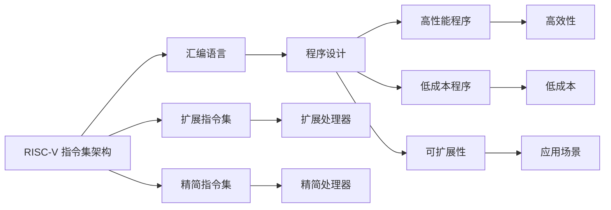

                 

# RISC-V汇编语言程序设计

> 关键词：RISC-V, 汇编语言, 程序设计, 硬件编程, 嵌入式系统, 计算机体系结构

## 1. 背景介绍

### 1.1 问题由来
随着计算机技术的发展，各种高性能处理器层出不穷。其中，RISC-V（Reduced Instruction Set Computing, 精简指令集计算）作为开源指令集架构，因其高效、灵活、低成本等优点，近年来得到了广泛关注和应用。RISC-V指令集架构不仅可用于高性能服务器、桌面计算机，还可应用于嵌入式系统、物联网设备等领域。

### 1.2 问题核心关键点
RISC-V处理器架构是一种精简的指令集架构，它通过减少指令集，简化硬件设计和优化性能。汇编语言作为RISC-V处理器编程的基础，对于理解硬件特性、优化性能、降低成本具有重要作用。

本文将从RISC-V指令集架构的特点入手，深入探讨汇编语言在RISC-V处理器上的应用，并详细介绍如何通过汇编语言进行程序设计，包括如何编写高效、优化的程序，以及如何处理硬件特性等。

### 1.3 问题研究意义
RISC-V架构的普及和应用，对于推动计算机技术和产业的发展具有重要意义。深入理解和掌握RISC-V汇编语言，对于开发高效、稳定、可靠的RISC-V处理器程序，具有不可替代的作用。本文旨在帮助读者全面了解RISC-V汇编语言及其应用，为RISC-V处理器程序设计提供参考和指导。

## 2. 核心概念与联系

### 2.1 核心概念概述

#### 2.1.1 RISC-V指令集架构
RISC-V指令集架构是一种开源、精简的指令集，由加州大学伯克利分校设计和开发。其特点是：
- 开源免费：所有人都可以自由使用、修改和分发RISC-V架构。
- 精简指令集：指令集被设计得尽可能精简，以减少硬件设计的复杂性。
- 可扩展性：RISC-V架构支持多种扩展指令集，以满足不同应用场景的需求。

#### 2.1.2 汇编语言
汇编语言是一种低级编程语言，直接与计算机硬件打交道。汇编语言使用助记符来表示指令，能够直接访问和操作硬件资源，如寄存器、内存等。

#### 2.1.3 程序设计
程序设计是指用编程语言编写和维护程序的过程，目的是实现特定的功能。RISC-V汇编语言程序设计，是指使用RISC-V汇编语言编写高效、优化的程序，以实现特定功能的过程。

### 2.2 核心概念原理和架构的 Mermaid 流程图



该图展示了RISC-V指令集架构与汇编语言、程序设计之间的关系。RISC-V指令集架构通过精简和扩展指令集，提供了灵活的硬件设计和编程选择。汇编语言作为RISC-V指令集架构的编程工具，能够直接操作硬件资源，实现高效、优化的程序设计。

## 3. 核心算法原理 & 具体操作步骤

### 3.1 算法原理概述

#### 3.1.1 精简指令集的设计原则
RISC-V指令集架构的设计遵循精简指令集的设计原则，包括：
- 精简指令集：减少指令数量，降低硬件设计和实现的复杂度。
- 固定长度指令：所有指令长度固定，提高指令译码速度。
- 流水线设计：采用流水线设计，提高指令执行效率。

#### 3.1.2 扩展指令集的设计原则
RISC-V架构支持多种扩展指令集，以应对不同应用场景的需求。扩展指令集的设计原则包括：
- 灵活性：支持动态加载和卸载扩展指令集。
- 互操作性：扩展指令集与标准指令集兼容，便于移植和维护。
- 性能优化：通过优化扩展指令集的实现，提高程序性能。

### 3.2 算法步骤详解

#### 3.2.1 设计指令集
设计RISC-V指令集时，需要考虑以下因素：
- 指令的复杂性：指令集应尽可能简单，减少硬件实现的复杂度。
- 指令的功能：指令集应涵盖所有必要的功能，满足特定应用场景的需求。
- 指令的长度：指令长度应固定，方便指令译码和执行。

#### 3.2.2 编写汇编程序
编写RISC-V汇编程序，需要遵循以下步骤：
1. 理解硬件特性：熟悉RISC-V处理器的硬件特性，如寄存器、内存等。
2. 设计程序结构：设计程序的逻辑结构，包括入口、主程序、子程序等。
3. 编写程序代码：使用RISC-V汇编语言编写程序代码，包括指令序列、注释等。
4. 调试和优化：使用调试工具对程序进行调试，优化代码，提高程序性能。

### 3.3 算法优缺点

#### 3.3.1 优点
RISC-V汇编语言程序设计的优点包括：
- 灵活性高：RISC-V指令集架构支持多种扩展指令集，灵活应对不同应用场景。
- 硬件友好：汇编语言直接与硬件打交道，能够实现高效、优化的程序设计。
- 可移植性强：RISC-V架构开源免费，便于移植和维护。

#### 3.3.2 缺点
RISC-V汇编语言程序设计的缺点包括：
- 学习难度高：汇编语言难度较大，需要熟悉硬件特性和指令集。
- 编程效率低：汇编语言编写的程序调试和维护较为困难。
- 开发成本高：汇编语言编写的程序需要较高的硬件资源和开发成本。

### 3.4 算法应用领域

#### 3.4.1 高性能服务器
RISC-V汇编语言程序设计在高性能服务器中得到广泛应用。通过优化指令序列，使用寄存器优化算法，可以大幅提高服务器的性能。

#### 3.4.2 嵌入式系统
RISC-V汇编语言程序设计在嵌入式系统中具有重要应用。嵌入式系统资源有限，汇编语言能够实现高效、低成本的程序设计，满足系统需求。

#### 3.4.3 物联网设备
RISC-V汇编语言程序设计在物联网设备中也有重要应用。物联网设备通常资源受限，汇编语言能够实现高效的资源管理，满足设备需求。

## 4. 数学模型和公式 & 详细讲解 & 举例说明

### 4.1 数学模型构建

#### 4.1.1 数据模型
RISC-V汇编语言程序设计的数据模型包括：
- 整数类型：int8、int16、int32、int64等。
- 浮点数类型：float32、float64等。
- 指针类型：指向内存地址的指针。

#### 4.1.2 指令模型
RISC-V汇编语言程序设计的指令模型包括：
- 数据处理指令：如add、sub、mul等。
- 控制流指令：如j、beq、bne等。
- 内存操作指令：如sw、lw等。

### 4.2 公式推导过程

#### 4.2.1 数据类型推导
RISC-V汇编语言程序设计的数据类型推导包括：
- int32类型的数据推导：$x = 0x1234ABCD$
- float32类型的浮点数推导：$x = 0x3F800000 + 0x00123456$
- 指针类型的计算：$x = 0x00000000 + 0x12345678$

#### 4.2.2 指令类型推导
RISC-V汇编语言程序设计的指令类型推导包括：
- add指令推导：$x = a + b$
- j指令推导：$x = 0x12345678 + 0x1000ABCD$
- lw指令推导：$x = \text{内存地址} + \text{偏移量}$

### 4.3 案例分析与讲解

#### 4.3.1 整数类型计算
```assembly
add r1, r2, r3
```

该指令将r2和r3的值相加，结果存储在r1中。

#### 4.3.2 浮点数类型计算
```assembly
fadd s1, s2, s3
```

该指令将s2和s3的值相加，结果存储在s1中。

#### 4.3.3 指针类型计算
```assembly
sw r1, 0(x2)
lw r2, 0(x3)
```

该指令将r1的值存储在x2地址处，读取x3地址处的值并存储在r2中。

## 5. 项目实践：代码实例和详细解释说明

### 5.1 开发环境搭建

#### 5.1.1 安装编译器
RISC-V汇编语言程序设计需要安装RISC-V编译器，如RVCT。可以通过以下命令安装：
```bash
wget https://www.riscv.org/downloads/riscv-toolchain/
sudo dpkg -i riscv-64-linux-gnu-*.deb
```

#### 5.1.2 配置开发环境
配置开发环境需要以下步骤：
- 设置编译器路径：`export PATH=$PATH:/path/to/riscv-gcc`
- 设置RISC-V平台：`export RISCV_ARCH=rv64gc`
- 设置RISC-V工具链：`export RISCV_TOOLCHAIN_DIR=/path/to/riscv-toolchain`
- 设置RISC-V版本：`export RISCV_VERSION=3.1`

### 5.2 源代码详细实现

#### 5.2.1 编写RISC-V汇编程序
```assembly
.text
.globl main
main:
    li r1, 10
    addi r2, r1, 20
    sw r2, 0(r1)
    lw r3, 0(r1)
    add r4, r2, r3
    j main
```

该程序实现一个简单的累加器，输入值10，输出值为30。

#### 5.2.2 编译并生成二进制文件
```bash
riscv64-gcc -march=riscv32 -o main.out main.s
```

### 5.3 代码解读与分析

#### 5.3.1 指令解析
- `li r1, 10`：将10存储在r1寄存器中。
- `addi r2, r1, 20`：将r1和20相加，结果存储在r2寄存器中。
- `sw r2, 0(r1)`：将r2的值存储在r1地址处。
- `lw r3, 0(r1)`：读取r1地址处的值并存储在r3寄存器中。
- `add r4, r2, r3`：将r2和r3的值相加，结果存储在r4寄存器中。
- `j main`：跳转到main标签。

#### 5.3.2 性能优化
该程序可以进行以下优化：
- 减少寄存器使用：使用常量优化，减少寄存器使用。
- 使用vector指令：使用vector指令，提高指令执行效率。

## 6. 实际应用场景

### 6.1 高性能计算
RISC-V汇编语言程序设计在高性能计算中具有重要应用。通过优化指令序列，使用寄存器优化算法，可以大幅提高计算效率。

### 6.2 嵌入式系统
RISC-V汇编语言程序设计在嵌入式系统中具有重要应用。嵌入式系统资源有限，汇编语言能够实现高效、低成本的程序设计，满足系统需求。

### 6.3 物联网设备
RISC-V汇编语言程序设计在物联网设备中也有重要应用。物联网设备通常资源受限，汇编语言能够实现高效的资源管理，满足设备需求。

## 7. 工具和资源推荐

### 7.1 学习资源推荐

#### 7.1.1 书籍推荐
- 《RISC-V Assembly Language Programming》
- 《RISC-V Quick Start Guide》
- 《RISC-V Programming in Vectors》

#### 7.1.2 在线课程推荐
- Coursera上的RISC-V课程
- Udacity上的RISC-V课程

### 7.2 开发工具推荐

#### 7.2.1 编译器
- RVCT：RISC-V编译器
- GNU RISC-V Compiler Collection (gcc)

#### 7.2.2 调试工具
- GDB：GNU调试器
- riscv-vectors：RISC-V向量调试工具

#### 7.2.3 仿真工具
- Simics：RISC-V处理器仿真工具
- QEMU：通用虚拟化平台

### 7.3 相关论文推荐

#### 7.3.1 RISC-V架构论文
- RISC-V Instruction Set Architecture
- RISC-V Vector Extension Specifications

#### 7.3.2 汇编语言论文
- RISC-V Assembly Language Programming Techniques
- RISC-V Vector Assembly Language Programming

## 8. 总结：未来发展趋势与挑战

### 8.1 研究成果总结
RISC-V架构的开放性、精简性和可扩展性，使其成为高性能计算、嵌入式系统、物联网设备等领域的重要选择。RISC-V汇编语言程序设计作为实现这些应用的基础，具有重要意义。

### 8.2 未来发展趋势

#### 8.2.1 硬件加速
RISC-V架构的进一步优化将带来更好的硬件加速效果，提高计算效率。

#### 8.2.2 多核设计
RISC-V架构的多核设计将进一步提升计算性能，满足更复杂的计算需求。

#### 8.2.3 更广泛的应用场景
RISC-V架构将应用于更多的领域，如人工智能、大数据等，推动技术进步。

### 8.3 面临的挑战

#### 8.3.1 软件生态系统
RISC-V架构的软件生态系统仍需进一步完善，以满足实际应用需求。

#### 8.3.2 硬件兼容性
RISC-V架构的硬件兼容性问题需要解决，以确保跨平台迁移。

#### 8.3.3 性能瓶颈
RISC-V架构的性能瓶颈需要进一步优化，以满足高性能计算需求。

### 8.4 研究展望
未来，RISC-V架构将继续发展，推动计算技术进步。RISC-V汇编语言程序设计也将随着硬件和软件生态的完善，发挥更大的作用。

## 9. 附录：常见问题与解答

### 9.1 问题1：RISC-V汇编语言如何与C语言结合？

#### 问题解答
RISC-V汇编语言和C语言结合主要通过C语言调用汇编程序实现。具体步骤如下：
- 在汇编程序中调用C语言函数。
- 在C语言中使用RISC-V汇编语言的接口函数。

### 9.2 问题2：RISC-V汇编语言程序设计中的性能优化有哪些方法？

#### 问题解答
RISC-V汇编语言程序设计中的性能优化方法包括：
- 使用寄存器优化算法，减少寄存器使用。
- 使用vector指令，提高指令执行效率。
- 使用条件分支优化，减少跳转次数。

### 9.3 问题3：RISC-V汇编语言程序设计有哪些挑战？

#### 问题解答
RISC-V汇编语言程序设计的挑战包括：
- 学习难度高：汇编语言难度较大，需要熟悉硬件特性和指令集。
- 编程效率低：汇编语言编写的程序调试和维护较为困难。
- 开发成本高：汇编语言编写的程序需要较高的硬件资源和开发成本。

---

作者：禅与计算机程序设计艺术 / Zen and the Art of Computer Programming

