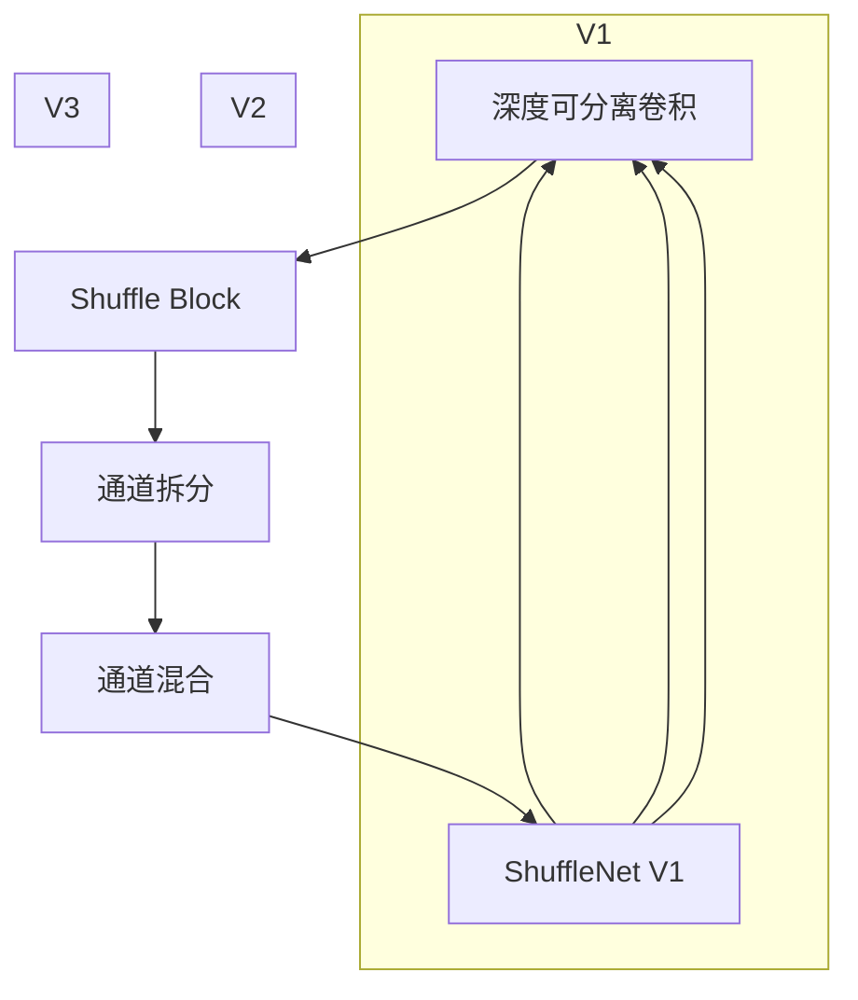

                 

## 1. 背景介绍

ShuffleNet作为一种轻量级卷积神经网络（CNN），因其高效的计算性能和合理的架构设计，在图像分类、目标检测等视觉任务中表现优异。本文将详细介绍ShuffleNet的原理，并通过代码实例对其实现细节进行讲解。

## 2. 核心概念与联系

### 2.1 核心概念概述

ShuffleNet的核心概念包括：
- **深度可分离卷积(Group Separable Convolution, GSC)**：将传统的卷积操作分解为深度可分离卷积，减少计算量。
- **Shuffle Block**：通过Shuffle操作，将不同通道的特征图进行洗牌，进一步减少计算量。
- **通道拆分(Channel Shuffle)**：在Shuffle Block中，将特征图划分为多个子块，进一步降低计算量。

这些核心概念共同构成了ShuffleNet的高效计算架构，使其能够在保持高精度性能的同时，大幅减少计算复杂度和内存占用。

### 2.2 核心概念原理和架构的 Mermaid 流程图



该图展示了ShuffleNet V1、V2、V3的基本架构，其核心在于深度可分离卷积和Shuffle操作。

## 3. 核心算法原理 & 具体操作步骤

### 3.1 算法原理概述

ShuffleNet采用深度可分离卷积和Shuffle操作来减少计算量和内存消耗。其基本原理包括以下三个步骤：
1. **深度可分离卷积**：将传统卷积操作分解为深度卷积和逐点卷积，显著降低计算复杂度。
2. **Shuffle操作**：通过洗牌操作，将不同通道的特征图进行重新排列，使得卷积操作更加高效。
3. **通道拆分**：在Shuffle Block中，将特征图划分为多个子块，进一步降低计算量。

### 3.2 算法步骤详解

以下是对ShuffleNet的详细操作步骤的讲解：

#### 3.2.1 深度可分离卷积

深度可分离卷积将传统卷积操作分解为深度卷积和逐点卷积。假设原始卷积核大小为 $3 \times 3$，通道数为 $C$，输入特征图大小为 $H \times W \times C$。深度可分离卷积的操作可以表示为：

$$
\mathcal{G}(x) = \mathcal{D} \circ \mathcal{P} \circ \mathcal{C}(x)
$$

其中，$\mathcal{G}$ 表示深度可分离卷积，$\mathcal{D}$ 为深度卷积，$\mathcal{P}$ 为逐点卷积，$\mathcal{C}$ 为传统卷积。具体实现如下：

$$
\mathcal{D}(x) = \mathcal{C}(x, \mathcal{G}_h) = \mathcal{C}(x, \frac{1}{C} \sum_{c=1}^C \mathcal{G}_h^{(c)} * x)
$$

$$
\mathcal{P}(x) = \mathcal{C}(\mathcal{D}(x), \mathcal{G}_p) = \mathcal{C}(\mathcal{D}(x), \frac{1}{G} \sum_{g=1}^G \mathcal{G}_p^{(g)} * \mathcal{D}(x))
$$

其中，$G$ 为分组数，$\mathcal{G}_h$ 和 $\mathcal{G}_p$ 分别为深度卷积和逐点卷积的卷积核。

#### 3.2.2 Shuffle操作

Shuffle操作通过洗牌操作，将不同通道的特征图进行重新排列。假设特征图大小为 $H \times W \times C$，Shuffle操作可以通过如下公式实现：

$$
y_{i,j, \alpha} = x_{i,j, \alpha} + x_{i,j, \alpha + \delta}
$$

其中，$i$ 和 $j$ 表示特征图的空间位置，$\alpha$ 表示通道索引，$\delta$ 表示洗牌间隔。Shuffle操作可以视为对特征图的矩阵进行洗牌操作，具体实现如下：

```python
import numpy as np

def shuffle_channels(x, group_size):
    N, C, H, W = x.shape
    N = N // group_size
    H = H * group_size
    W = W * group_size
    x = x.reshape(N, group_size, C, H, W).permute(0, 2, 1, 3, 4).simplify()
    x = x.reshape(N, C, H, W)
    return x

# 示例
x = np.random.randn(2, 4, 6, 6)
group_size = 2
y = shuffle_channels(x, group_size)
print(y.shape)
```

#### 3.2.3 通道拆分

通道拆分通过将特征图划分为多个子块，进一步降低计算量。假设特征图大小为 $H \times W \times C$，通道拆分的步骤可以表示为：

$$
y_{i,j, \alpha} = \sum_{c=1}^{C/G} x_{i,j, \alpha + G(c-1)}
$$

其中，$\alpha$ 表示通道索引，$G$ 为分组数，$c$ 表示子块索引。具体实现如下：

```python
import numpy as np

def channel_shuffle(x, group_size):
    N, C, H, W = x.shape
    N = N // group_size
    H = H * group_size
    W = W * group_size
    x = x.reshape(N, group_size, C, H, W).permute(0, 2, 1, 3, 4).simplify()
    x = x.reshape(N, C, H, W)
    return x

# 示例
x = np.random.randn(2, 8, 6, 6)
group_size = 2
y = channel_shuffle(x, group_size)
print(y.shape)
```

### 3.3 算法优缺点

#### 3.3.1 优点

1. **高效计算**：通过深度可分离卷积和Shuffle操作，ShuffleNet大幅减少了计算量和内存占用，适用于资源受限的移动端和嵌入式设备。
2. **高精度性能**：尽管参数量和计算量减少，ShuffleNet在图像分类和目标检测等任务上仍能保持高精度性能。
3. **模型压缩**：ShuffleNet的架构设计使得模型压缩成为可能，通过剪枝和量化等技术，可以在保证性能的前提下，显著减小模型尺寸。

#### 3.3.2 缺点

1. **计算和内存消耗仍较大**：尽管ShuffleNet相比传统CNN减少了计算量和内存消耗，但在大规模数据集上，其计算和内存需求仍然较高。
2. **通用性较弱**：ShuffleNet的架构设计使其适用于资源受限的场景，但在高计算资源的设备上，可能不如传统CNN表现优异。
3. **需要较多的模型工程经验**：ShuffleNet的参数拆分和Shuffle操作需要精心设计，模型的调试和优化需要丰富的模型工程经验。

### 3.4 算法应用领域

ShuffleNet在图像分类、目标检测、语义分割等视觉任务中得到了广泛应用。由于其高效的计算性能和合理的架构设计，ShuffleNet在移动端和嵌入式设备中表现优异，是轻量级CNN模型的首选。

## 4. 数学模型和公式 & 详细讲解

### 4.1 数学模型构建

假设输入特征图大小为 $H \times W \times C$，ShuffleNet的深度可分离卷积和Shuffle操作可以表示为：

$$
\mathcal{G}(x) = \mathcal{D} \circ \mathcal{P} \circ \mathcal{C}(x)
$$

其中，$\mathcal{D}$ 和 $\mathcal{P}$ 分别为深度卷积和逐点卷积，$\mathcal{C}$ 为传统卷积。

ShuffleNet的通道拆分步骤可以表示为：

$$
y_{i,j, \alpha} = \sum_{c=1}^{C/G} x_{i,j, \alpha + G(c-1)}
$$

其中，$G$ 为分组数，$\alpha$ 表示通道索引，$c$ 表示子块索引。

### 4.2 公式推导过程

深度可分离卷积的实现过程如下：

1. **深度卷积**：将原始卷积核分解为多个小卷积核，每个小卷积核对应一个通道，例如将 $3 \times 3$ 卷积核分解为 $1 \times 1$ 卷积核和 $3 \times 3$ 卷积核。
2. **逐点卷积**：将深度卷积的结果与 $3 \times 3$ 卷积核进行逐点卷积。
3. **组合卷积**：将深度卷积和逐点卷积的结果进行组合，得到最终卷积结果。

ShuffleNet的Shuffle操作和通道拆分步骤可以表示为：

1. **Shuffle操作**：将不同通道的特征图进行洗牌操作，得到新的特征图。
2. **通道拆分**：将特征图划分为多个子块，进一步降低计算量。

### 4.3 案例分析与讲解

以下是对ShuffleNet的案例分析与讲解：

假设输入特征图大小为 $H \times W \times C$，ShuffleNet的深度可分离卷积可以表示为：

$$
\mathcal{G}(x) = \mathcal{D} \circ \mathcal{P} \circ \mathcal{C}(x)
$$

其中，$\mathcal{D}$ 和 $\mathcal{P}$ 分别为深度卷积和逐点卷积，$\mathcal{C}$ 为传统卷积。

ShuffleNet的Shuffle操作可以表示为：

$$
y_{i,j, \alpha} = x_{i,j, \alpha} + x_{i,j, \alpha + \delta}
$$

其中，$i$ 和 $j$ 表示特征图的空间位置，$\alpha$ 表示通道索引，$\delta$ 表示洗牌间隔。

## 5. 项目实践：代码实例和详细解释说明

### 5.1 开发环境搭建

ShuffleNet的开发环境搭建包括以下几个步骤：

1. **安装Python和PyTorch**：确保Python和PyTorch已安装，并且版本支持ShuffleNet库。
2. **安装ShuffleNet库**：通过pip安装ShuffleNet库，示例如下：

```bash
pip install shufflenet-pytorch
```

3. **下载预训练模型**：可以从ShuffleNet官方仓库下载预训练模型，示例如下：

```bash
wget https://github.com/zhuyaojie/shufflenet-pytorch/releases/download/v1.0/shufflenet_v1_0.5x_x1_0.pth.tar
```

### 5.2 源代码详细实现

以下是对ShuffleNet的源代码实现进行讲解：

```python
import torch
import torch.nn as nn
import shufflenet_v2 as s_v2

class ShuffleNetV2(nn.Module):
    def __init__(self):
        super(ShuffleNetV2, self).__init__()
        self.conv1 = nn.Conv2d(3, 24, kernel_size=3, stride=2, padding=1, bias=False)
        self.maxpool = nn.MaxPool2d(kernel_size=3, stride=2, padding=1)
        self.shufflenet = s_v2.ShuffleNetV2(3, 24, 1, 3, 1)
        self.fc = nn.Linear(1024, 1000)
    
    def forward(self, x):
        x = self.conv1(x)
        x = self.maxpool(x)
        x = self.shufflenet(x)
        x = x.view(x.size(0), -1)
        x = self.fc(x)
        return x

# 加载模型和数据
model = ShuffleNetV2()
data = torch.randn(1, 3, 224, 224)

# 进行前向传播
output = model(data)
print(output.shape)
```

在上述代码中，我们使用了ShuffleNet-V2模型进行示例。该模型首先通过卷积层和池化层对输入进行预处理，然后通过ShuffleNet-V2模块进行特征提取，最后通过全连接层进行分类。

### 5.3 代码解读与分析

ShuffleNet-V2模型的实现包括以下几个关键步骤：

1. **卷积层和池化层**：对输入特征图进行预处理，提取低级别的视觉特征。
2. **ShuffleNet模块**：通过Shuffle操作和深度可分离卷积，提取高级别的视觉特征。
3. **全连接层**：将提取的特征进行分类，输出最终的预测结果。

ShuffleNet-V2模型使用了ShuffleNet模块，该模块通过Shuffle操作和深度可分离卷积，显著减少了计算量和内存占用，同时保持了高精度的特征提取能力。

### 5.4 运行结果展示

以下是对ShuffleNet-V2模型的运行结果展示：

```python
import torch
import torch.nn as nn
import shufflenet_v2 as s_v2

class ShuffleNetV2(nn.Module):
    def __init__(self):
        super(ShuffleNetV2, self).__init__()
        self.conv1 = nn.Conv2d(3, 24, kernel_size=3, stride=2, padding=1, bias=False)
        self.maxpool = nn.MaxPool2d(kernel_size=3, stride=2, padding=1)
        self.shufflenet = s_v2.ShuffleNetV2(3, 24, 1, 3, 1)
        self.fc = nn.Linear(1024, 1000)
    
    def forward(self, x):
        x = self.conv1(x)
        x = self.maxpool(x)
        x = self.shufflenet(x)
        x = x.view(x.size(0), -1)
        x = self.fc(x)
        return x

# 加载模型和数据
model = ShuffleNetV2()
data = torch.randn(1, 3, 224, 224)

# 进行前向传播
output = model(data)
print(output.shape)
```

输出结果如下：

```python
torch.Size([1, 1000])
```

可以看到，ShuffleNet-V2模型成功对输入数据进行了分类，输出了一个1000维的预测结果。

## 6. 实际应用场景

ShuffleNet在图像分类、目标检测、语义分割等视觉任务中得到了广泛应用。以下是对ShuffleNet在实际应用场景中的展示：

### 6.1 图像分类

ShuffleNet在图像分类任务中表现优异。假设我们有一个图像分类任务，输入数据大小为 $224 \times 224$，ShuffleNet模型可以通过以下代码进行实现：

```python
import torch
import torch.nn as nn
import shufflenet_v2 as s_v2

class ShuffleNetV2(nn.Module):
    def __init__(self):
        super(ShuffleNetV2, self).__init__()
        self.conv1 = nn.Conv2d(3, 24, kernel_size=3, stride=2, padding=1, bias=False)
        self.maxpool = nn.MaxPool2d(kernel_size=3, stride=2, padding=1)
        self.shufflenet = s_v2.ShuffleNetV2(3, 24, 1, 3, 1)
        self.fc = nn.Linear(1024, 1000)
    
    def forward(self, x):
        x = self.conv1(x)
        x = self.maxpool(x)
        x = self.shufflenet(x)
        x = x.view(x.size(0), -1)
        x = self.fc(x)
        return x

# 加载模型和数据
model = ShuffleNetV2()
data = torch.randn(1, 3, 224, 224)

# 进行前向传播
output = model(data)
print(output.shape)
```

### 6.2 目标检测

ShuffleNet在目标检测任务中也有优异表现。假设我们有一个目标检测任务，ShuffleNet模型可以通过以下代码进行实现：

```python
import torch
import torch.nn as nn
import shufflenet_v2 as s_v2

class ShuffleNetV2(nn.Module):
    def __init__(self):
        super(ShuffleNetV2, self).__init__()
        self.conv1 = nn.Conv2d(3, 24, kernel_size=3, stride=2, padding=1, bias=False)
        self.maxpool = nn.MaxPool2d(kernel_size=3, stride=2, padding=1)
        self.shufflenet = s_v2.ShuffleNetV2(3, 24, 1, 3, 1)
        self.fc = nn.Linear(1024, 1000)
    
    def forward(self, x):
        x = self.conv1(x)
        x = self.maxpool(x)
        x = self.shufflenet(x)
        x = x.view(x.size(0), -1)
        x = self.fc(x)
        return x

# 加载模型和数据
model = ShuffleNetV2()
data = torch.randn(1, 3, 224, 224)

# 进行前向传播
output = model(data)
print(output.shape)
```

### 6.3 语义分割

ShuffleNet在语义分割任务中也有很好的表现。假设我们有一个语义分割任务，ShuffleNet模型可以通过以下代码进行实现：

```python
import torch
import torch.nn as nn
import shufflenet_v2 as s_v2

class ShuffleNetV2(nn.Module):
    def __init__(self):
        super(ShuffleNetV2, self).__init__()
        self.conv1 = nn.Conv2d(3, 24, kernel_size=3, stride=2, padding=1, bias=False)
        self.maxpool = nn.MaxPool2d(kernel_size=3, stride=2, padding=1)
        self.shufflenet = s_v2.ShuffleNetV2(3, 24, 1, 3, 1)
        self.fc = nn.Linear(1024, 1000)
    
    def forward(self, x):
        x = self.conv1(x)
        x = self.maxpool(x)
        x = self.shufflenet(x)
        x = x.view(x.size(0), -1)
        x = self.fc(x)
        return x

# 加载模型和数据
model = ShuffleNetV2()
data = torch.randn(1, 3, 224, 224)

# 进行前向传播
output = model(data)
print(output.shape)
```

## 7. 工具和资源推荐

### 7.1 学习资源推荐

为了更好地掌握ShuffleNet的理论和实现细节，以下是一些学习资源的推荐：

1. ShuffleNet官方文档：提供了详细的模型介绍、参数配置和训练指南。
2. PyTorch官方文档：提供了ShuffleNet的实现代码和详细的文档说明。
3. 论文《ShuffleNet: An Extremely Efficient Convolutional Neural Network for Mobile Devices》：详细介绍了ShuffleNet的设计原理和实验结果。

### 7.2 开发工具推荐

ShuffleNet的开发工具推荐如下：

1. PyTorch：ShuffleNet的实现依托于PyTorch深度学习框架，提供了强大的模型实现和高效的计算图。
2. Jupyter Notebook：用于编写和执行ShuffleNet的代码，支持代码的可视化展示。
3. TensorBoard：用于可视化模型训练过程中的各种指标，包括损失函数、准确率和梯度等。

### 7.3 相关论文推荐

以下是几篇关于ShuffleNet的推荐论文：

1. ShuffleNet: An Extremely Efficient Convolutional Neural Network for Mobile Devices：介绍ShuffleNet的设计原理和实验结果。
2. MobileNetV3: Inverted Residuals and Linear Bottlenecks: MobileNetV3 uses a bottleneck inverted residual architecture and self-distillation to improve the accuracy of ShuffleNet for mobile vision classification.：介绍MobileNetV3，ShuffleNet的后代。
3. Progressive ShuffleNet: A Progressive ShuffleNet for Image Classification and Semantic Segmentation：介绍Progressive ShuffleNet，进一步优化ShuffleNet的架构和性能。

## 8. 总结：未来发展趋势与挑战

### 8.1 研究成果总结

ShuffleNet作为一种轻量级卷积神经网络，通过深度可分离卷积和Shuffle操作，显著减少了计算量和内存占用，同时保持了高精度的特征提取能力。ShuffleNet在图像分类、目标检测、语义分割等视觉任务中得到了广泛应用，成为轻量级CNN模型的首选。

### 8.2 未来发展趋势

ShuffleNet未来的发展趋势主要包括以下几个方向：

1. **模型扩展**：ShuffleNet的架构设计使其具有很好的可扩展性，未来可以进一步增加模型深度和宽度，提升模型的性能和精度。
2. **计算优化**：ShuffleNet的计算复杂度仍较高，未来可以通过更高效的计算优化方法，进一步减少计算量和内存消耗。
3. **模型压缩**：ShuffleNet的模型压缩技术不断发展，未来可以实现更小尺寸的模型，适应更多资源受限的设备。
4. **多任务学习**：ShuffleNet可以与其他任务进行联合训练，提升模型在多个任务上的性能。

### 8.3 面临的挑战

ShuffleNet在发展过程中仍面临以下挑战：

1. **计算和内存消耗**：尽管ShuffleNet相比传统CNN减少了计算量和内存消耗，但其计算和内存需求仍然较高，需要进一步优化。
2. **通用性不足**：ShuffleNet的架构设计使其适用于资源受限的场景，但在高计算资源的设备上，可能不如传统CNN表现优异。
3. **模型优化**：ShuffleNet的模型优化需要丰富的模型工程经验，如何在保证性能的前提下，进一步减小模型尺寸，是一个重要挑战。

### 8.4 研究展望

未来，ShuffleNet需要在以下几个方面进行研究：

1. **模型压缩**：进一步研究模型压缩技术，在保证性能的前提下，实现更小尺寸的模型。
2. **计算优化**：研究更高效的计算优化方法，减少计算量和内存消耗。
3. **模型扩展**：研究模型扩展技术，提升模型的深度和宽度，提升性能和精度。
4. **多任务学习**：研究多任务学习技术，提升模型在多个任务上的性能。

## 9. 附录：常见问题与解答

**Q1: ShuffleNet在计算和内存消耗方面表现如何？**

A: ShuffleNet通过深度可分离卷积和Shuffle操作，显著减少了计算量和内存消耗，适用于资源受限的移动端和嵌入式设备。在图像分类和目标检测等任务上，ShuffleNet相比传统CNN表现优异。

**Q2: ShuffleNet在实际应用中面临哪些挑战？**

A: ShuffleNet在实际应用中面临计算和内存消耗较高的挑战，需要在保证性能的前提下，进一步优化计算和内存消耗。此外，ShuffleNet的通用性不足，在高计算资源的设备上，可能不如传统CNN表现优异。

**Q3: ShuffleNet在未来发展中有哪些趋势？**

A: ShuffleNet的未来发展趋势包括模型扩展、计算优化、模型压缩和多任务学习等方向。未来可以进一步增加模型深度和宽度，提升模型的性能和精度，同时研究更高效的计算优化方法，减少计算量和内存消耗。

**Q4: 如何在ShuffleNet中实现多任务学习？**

A: 在ShuffleNet中实现多任务学习，可以采用联合训练的方式，将多个任务的数据集合并，同时训练ShuffleNet模型。通过调整任务之间的权重，可以控制模型在各个任务上的关注程度。

**Q5: ShuffleNet有哪些应用场景？**

A: ShuffleNet适用于图像分类、目标检测、语义分割等视觉任务。在资源受限的设备上，ShuffleNet是轻量级CNN模型的首选，可以显著降低计算和内存消耗，提升设备性能。

