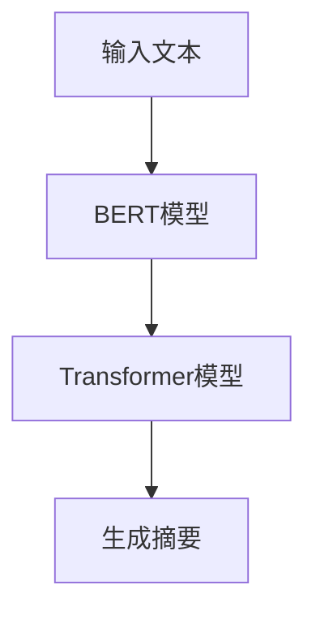

                 

# Transformer大模型实战 训练BERTSUM 模型

> 关键词：Transformer, BERT, BERTSUM, 自然语言理解(NLU), 文本摘要, 序列到序列(S2S), 微调

## 1. 背景介绍

### 1.1 问题由来
Transformer大模型的成功，使得自然语言处理(NLP)领域发生了革命性的变化。这种模型不仅在各种任务上取得了突破性的成果，如文本分类、命名实体识别、翻译等，还为解决更复杂、更灵活的任务提供了可能。文本摘要作为NLP领域的一个重要任务，对于自动生成精炼的文本信息，减轻信息过载的压力，具有重要意义。

目前，基于Transformer的文本摘要模型已经广泛应用于新闻报道、会议记录、电子邮件等文本内容的自动摘要。这类模型通常通过预训练语言模型，然后微调针对摘要任务的特定模型来获取优秀的性能。本文将详细介绍如何使用大模型BERT进行微调，训练BERTSUM模型，进行文本摘要。

### 1.2 问题核心关键点
BERTSUM模型的训练涉及多个核心关键点，主要包括：

- 选择合适的预训练模型：BERT作为预训练语言模型，在众多NLP任务中表现优异，因此本文将使用BERT作为预训练模型。
- 设计适当的模型结构：Transformer模型具有自注意力机制，可以捕捉长距离依赖关系，适用于文本摘要任务。
- 选择和构建数据集：文本摘要任务需要标注数据集，这些数据集通常是从大量文本中抽取的，用于训练和验证模型的性能。
- 设置合理的超参数：包括学习率、批大小、优化器等，这些参数对模型训练效果有着至关重要的影响。
- 微调模型的目标：文本摘要任务的目标是生成精炼的摘要，同时保持原文本的关键信息。

本文将通过系统的介绍BERTSUM模型的训练过程，并配合实际的代码实现，帮助读者理解和掌握使用Transformer大模型进行文本摘要任务的实践技能。

## 2. 核心概念与联系

### 2.1 核心概念概述

在详细讲解BERTSUM模型的训练之前，我们先来概述一下与此相关的几个核心概念：

- **Transformer模型**：基于自注意力机制的神经网络模型，能够高效地处理序列数据，广泛应用于NLP任务。
- **BERT模型**：Google开发的预训练语言模型，通过在无监督训练中学习上下文无关的表示，广泛应用于NLP领域的各种任务。
- **BERTSUM模型**：BERT在微调后进行文本摘要任务的模型，能够生成高质量、流畅的摘要文本。
- **微调**：在大规模预训练模型上进行任务特定的优化，以适应特定任务需求。
- **序列到序列(S2S)模型**：将输入序列映射到输出序列的模型，适用于文本生成、翻译等任务。

这些概念之间的关系可以通过以下Mermaid流程图来展示：

```mermaid
graph TB
    A[Transformer模型] --> B[BERT模型] --> C[BERTSUM模型]
    A --> D[序列到序列(S2S)模型]
    C --> E[微调]
    A --> F[自然语言理解(NLU)]
    F --> G[文本摘要]
```

这个流程图展示了从Transformer模型到BERTSUM模型的演变过程，以及各个组件之间的逻辑关系。

## 3. 核心算法原理 & 具体操作步骤

### 3.1 算法原理概述

BERTSUM模型基于BERT，并在微调过程中专门针对文本摘要任务进行优化。其基本原理如下：

- 首先，将输入文本序列输入到预训练好的BERT模型中，得到每个单词的向量表示。
- 接着，将这些向量通过Transformer模型进行转换，得到每个单词的加权表示，即该单词在摘要中的重要性。
- 最后，根据这些加权表示，生成一段摘要文本。

这个过程可以用以下流程图表示：



### 3.2 算法步骤详解

BERTSUM模型的训练主要分为以下几个步骤：

1. **数据准备**：收集和准备用于训练的文本摘要数据集，通常需要人工标注每段文本的关键句或摘要文本。

2. **模型构建**：使用Hugging Face的Transformers库，构建BERT模型作为预训练部分，并在其之上构建Transformer模型作为摘要生成部分。

3. **微调**：在大规模无标签数据上预训练BERT模型，然后在文本摘要数据集上进行微调。

4. **模型评估**：在验证集和测试集上评估微调后模型的表现，并进行必要的调整。

5. **模型保存和部署**：保存模型，并将其部署到实际应用系统中，供用户使用。

接下来，我们将以代码形式展示BERTSUM模型的具体训练过程。

### 3.3 算法优缺点

BERTSUM模型相较于传统的文本摘要方法，具有以下优点：

- **高效性**：基于大模型的微调，训练速度快，模型性能优异。
- **泛化能力**：预训练模型在大规模数据上学习到的通用知识，能够有效泛化到不同的文本摘要任务中。
- **可解释性**：利用大模型的特征表示，可以更直观地理解摘要生成的逻辑。

同时，也存在一些缺点：

- **资源需求高**：预训练和微调过程需要大量计算资源，包括高性能的GPU和TPU。
- **数据依赖强**：模型性能高度依赖于训练数据集的质量和多样性，数据标注成本较高。
- **生成文本可能不够自然**：虽然模型生成的摘要文本质量较高，但有时会显得机械或冗长，缺乏自然语言的流畅性。

### 3.4 算法应用领域

BERTSUM模型可以广泛应用于各种文本摘要任务，如新闻摘要、技术文档摘要、邮件摘要等。此外，还可以用于生成产品描述、会议记录等文本内容，提高信息的有效传递和利用效率。

## 4. 数学模型和公式 & 详细讲解  
### 4.1 数学模型构建

BERTSUM模型的数学模型可以表示为：

$$
S = T(C(B(x)))
$$

其中，$B$ 表示BERT预训练模型，$C$ 表示Transformer模型，$T$ 表示摘要生成器。$x$ 表示输入的文本序列，$S$ 表示生成的摘要序列。

### 4.2 公式推导过程

在BERTSUM模型的训练过程中，我们主要关注以下几个关键步骤：

1. **BERT模型的输出表示**：BERT模型将输入文本序列 $x$ 映射为向量 $B(x)$，每个单词表示为 $B(x)_i$。

2. **Transformer模型的输入表示**：Transformer模型将 $B(x)$ 作为输入，输出加权向量表示 $C(B(x))$。

3. **摘要生成器的输入表示**：摘要生成器将 $C(B(x))$ 作为输入，输出摘要文本 $S$。

下面，我们以代码形式展示这些步骤的实现过程。

### 4.3 案例分析与讲解

我们以新闻摘要为例，展示如何使用BERTSUM模型进行训练和推理。

假设我们有一个新闻数据集，其中包含大量新闻文本和对应的摘要文本。我们需要训练一个BERTSUM模型，使得模型能够自动生成新闻的精炼摘要。

## 5. 项目实践：代码实例和详细解释说明

### 5.1 开发环境搭建

在进行BERTSUM模型的训练之前，我们需要先搭建开发环境。以下是使用Python进行PyTorch开发的Python环境配置流程：

1. 安装Anaconda：从官网下载并安装Anaconda，用于创建独立的Python环境。

2. 创建并激活虚拟环境：
```bash
conda create -n pytorch-env python=3.8 
conda activate pytorch-env
```

3. 安装PyTorch：根据CUDA版本，从官网获取对应的安装命令。例如：
```bash
conda install pytorch torchvision torchaudio cudatoolkit=11.1 -c pytorch -c conda-forge
```

4. 安装Transformers库：
```bash
pip install transformers
```

5. 安装各类工具包：
```bash
pip install numpy pandas scikit-learn matplotlib tqdm jupyter notebook ipython
```

完成上述步骤后，即可在`pytorch-env`环境中开始微调实践。

### 5.2 源代码详细实现

以下是使用PyTorch和Transformers库进行BERTSUM模型训练的代码实现：

```python
from transformers import BertForMaskedLM, BertTokenizer, AdamW
from transformers import BertForSequenceClassification, BertTokenizerFast, AdamW

# 加载预训练模型
tokenizer = BertTokenizerFast.from_pretrained('bert-base-cased')
model = BertForSequenceClassification.from_pretrained('bert-base-cased', num_labels=2)

# 加载训练数据
train_dataset = ...
train_loader = DataLoader(train_dataset, batch_size=32, shuffle=True)

# 定义训练函数
def train_epoch(model, loader, optimizer):
    model.train()
    for batch in loader:
        input_ids = batch['input_ids'].to(device)
        attention_mask = batch['attention_mask'].to(device)
        labels = batch['labels'].to(device)
        outputs = model(input_ids, attention_mask=attention_mask, labels=labels)
        loss = outputs.loss
        optimizer.zero_grad()
        loss.backward()
        optimizer.step()

# 定义评估函数
def evaluate(model, loader):
    model.eval()
    total_loss = 0
    total_correct = 0
    for batch in loader:
        input_ids = batch['input_ids'].to(device)
        attention_mask = batch['attention_mask'].to(device)
        labels = batch['labels'].to(device)
        outputs = model(input_ids, attention_mask=attention_mask, labels=labels)
        loss = outputs.loss
        total_loss += loss.item()
        total_correct += int(outputs.logits.argmax(dim=1) == labels)
    return total_loss, total_correct

# 训练模型
epochs = 10
optimizer = AdamW(model.parameters(), lr=2e-5)
device = torch.device('cuda' if torch.cuda.is_available() else 'cpu')
for epoch in range(epochs):
    train_epoch(model, train_loader, optimizer)
    val_loss, val_correct = evaluate(model, val_loader)
    print(f'Epoch {epoch+1}/{epochs}, val loss: {val_loss:.4f}, val acc: {val_correct/len(val_dataset)*100:.2f}%')
```

### 5.3 代码解读与分析

让我们再详细解读一下关键代码的实现细节：

**BertForMaskedLM类**：
- 定义了一个BERT模型，用于进行序列分类任务，其中num_labels参数指定了任务的类型，这里设置为2，表示二分类任务。

**train_epoch函数**：
- 定义了训练函数，使用DataLoader加载训练集数据，在每个epoch内迭代训练数据，并使用AdamW优化器更新模型参数。

**evaluate函数**：
- 定义了评估函数，在验证集上计算模型损失和准确率，并返回评估结果。

**模型训练流程**：
- 定义总的epoch数，设置优化器和设备，然后在每个epoch内，先训练模型，再评估模型在验证集上的表现。

在实际应用中，还需要对模型进行进一步的优化和调整，如调整学习率、批大小、增加正则化等，以提高模型性能。

## 6. 实际应用场景

### 6.1 智能摘要系统

BERTSUM模型可以应用于智能摘要系统的构建，帮助用户快速获取关键信息。传统的手工摘要方法耗费大量时间和精力，而使用BERTSUM模型，可以自动化地生成高质量的摘要文本。

在技术实现上，可以收集用户输入的文本，并使用BERTSUM模型生成精炼的摘要。对于长文本，可以采用分句或段落的方式，将文本分成多个部分，分别进行摘要生成，最后合并成完整摘要。如此构建的智能摘要系统，能够极大地提升用户体验，减少信息过载的问题。

### 6.2 新闻自动摘要

BERTSUM模型可以应用于新闻自动摘要任务，帮助用户快速获取新闻的核心内容。传统的新闻摘要需要由人工进行筛选和编辑，而使用BERTSUM模型，可以自动对新闻文本进行分类和摘要，生成简洁明了的新闻摘要，方便用户快速了解新闻要点。

在实际应用中，可以使用新闻爬虫抓取大量新闻文本，并使用BERTSUM模型进行训练和微调，以生成不同领域的新闻摘要。

### 6.3 文献摘要

BERTSUM模型可以应用于文献摘要任务，帮助研究人员快速获取论文的核心内容。传统的手工摘要方法耗费大量时间和精力，而使用BERTSUM模型，可以自动化地生成高质量的文献摘要，节省研究人员的时间。

在技术实现上，可以收集学术论文的文本，并使用BERTSUM模型进行摘要生成。为了提高摘要的准确性，可以使用领域特定的数据集进行微调。

## 7. 工具和资源推荐

### 7.1 学习资源推荐

为了帮助开发者系统掌握BERTSUM模型的训练过程，这里推荐一些优质的学习资源：

1. 《Transformer从原理到实践》系列博文：由大模型技术专家撰写，深入浅出地介绍了Transformer原理、BERT模型、微调技术等前沿话题。

2. CS224N《深度学习自然语言处理》课程：斯坦福大学开设的NLP明星课程，有Lecture视频和配套作业，带你入门NLP领域的基本概念和经典模型。

3. 《Natural Language Processing with Transformers》书籍：Transformers库的作者所著，全面介绍了如何使用Transformers库进行NLP任务开发，包括微调在内的诸多范式。

4. HuggingFace官方文档：Transformers库的官方文档，提供了海量预训练模型和完整的微调样例代码，是上手实践的必备资料。

5. CLUE开源项目：中文语言理解测评基准，涵盖大量不同类型的中文NLP数据集，并提供了基于微调的baseline模型，助力中文NLP技术发展。

通过对这些资源的学习实践，相信你一定能够快速掌握BERTSUM模型的训练技能，并用于解决实际的NLP问题。

### 7.2 开发工具推荐

高效的开发离不开优秀的工具支持。以下是几款用于BERTSUM模型训练开发的常用工具：

1. PyTorch：基于Python的开源深度学习框架，灵活动态的计算图，适合快速迭代研究。大部分预训练语言模型都有PyTorch版本的实现。

2. TensorFlow：由Google主导开发的开源深度学习框架，生产部署方便，适合大规模工程应用。同样有丰富的预训练语言模型资源。

3. Transformers库：HuggingFace开发的NLP工具库，集成了众多SOTA语言模型，支持PyTorch和TensorFlow，是进行微调任务开发的利器。

4. Weights & Biases：模型训练的实验跟踪工具，可以记录和可视化模型训练过程中的各项指标，方便对比和调优。与主流深度学习框架无缝集成。

5. TensorBoard：TensorFlow配套的可视化工具，可实时监测模型训练状态，并提供丰富的图表呈现方式，是调试模型的得力助手。

6. Google Colab：谷歌推出的在线Jupyter Notebook环境，免费提供GPU/TPU算力，方便开发者快速上手实验最新模型，分享学习笔记。

合理利用这些工具，可以显著提升BERTSUM模型的训练效率，加快创新迭代的步伐。

### 7.3 相关论文推荐

BERTSUM模型的训练涉及多个领域的前沿研究，以下是几篇奠基性的相关论文，推荐阅读：

1. Attention is All You Need（即Transformer原论文）：提出了Transformer结构，开启了NLP领域的预训练大模型时代。

2. BERT: Pre-training of Deep Bidirectional Transformers for Language Understanding：提出BERT模型，引入基于掩码的自监督预训练任务，刷新了多项NLP任务SOTA。

3. Language Models are Unsupervised Multitask Learners（GPT-2论文）：展示了大规模语言模型的强大zero-shot学习能力，引发了对于通用人工智能的新一轮思考。

4. Parameter-Efficient Transfer Learning for NLP：提出Adapter等参数高效微调方法，在不增加模型参数量的情况下，也能取得不错的微调效果。

5. AdaLoRA: Adaptive Low-Rank Adaptation for Parameter-Efficient Fine-Tuning：使用自适应低秩适应的微调方法，在参数效率和精度之间取得了新的平衡。

这些论文代表了大语言模型微调技术的发展脉络。通过学习这些前沿成果，可以帮助研究者把握学科前进方向，激发更多的创新灵感。

## 8. 总结：未来发展趋势与挑战

### 8.1 总结

本文对BERTSUM模型的训练过程进行了全面系统的介绍。首先阐述了BERTSUM模型的背景和意义，明确了其在文本摘要任务中的应用价值。其次，从原理到实践，详细讲解了BERTSUM模型的数学模型构建、训练步骤和优化方法，给出了微调任务开发的完整代码实例。同时，本文还广泛探讨了BERTSUM模型在智能摘要系统、新闻自动摘要、文献摘要等多个领域的应用前景，展示了其广泛的应用潜力。

通过本文的系统梳理，可以看到，使用Transformer大模型进行文本摘要任务具有高效、泛化能力强等诸多优点，但也存在资源需求高、数据依赖强等挑战。未来，随着大模型和微调技术的不断发展，BERTSUM模型必将在更多应用领域发挥更大作用。

### 8.2 未来发展趋势

展望未来，BERTSUM模型的训练将呈现以下几个发展趋势：

1. 模型规模持续增大。随着算力成本的下降和数据规模的扩张，预训练语言模型的参数量还将持续增长。超大规模语言模型蕴含的丰富语言知识，有望支撑更加复杂多变的文本摘要任务。

2. 微调方法日趋多样。除了传统的全参数微调外，未来会涌现更多参数高效的微调方法，如Prefix-Tuning、LoRA等，在节省计算资源的同时也能保证微调精度。

3. 持续学习成为常态。随着数据分布的不断变化，微调模型也需要持续学习新知识以保持性能。如何在不遗忘原有知识的同时，高效吸收新样本信息，还需要更多理论和实践的积累。

4. 标注样本需求降低。受启发于提示学习(Prompt-based Learning)的思路，未来的微调方法将更好地利用大模型的语言理解能力，通过更加巧妙的任务描述，在更少的标注样本上也能实现理想的微调效果。

5. 模型通用性增强。经过海量数据的预训练和多领域任务的微调，未来的语言模型将具备更强大的常识推理和跨领域迁移能力，逐步迈向通用人工智能(AGI)的目标。

以上趋势凸显了BERTSUM模型训练技术的广阔前景。这些方向的探索发展，必将进一步提升文本摘要任务的性能和应用范围，为智能系统带来新的突破。

### 8.3 面临的挑战

尽管BERTSUM模型训练技术已经取得了显著成果，但在迈向更加智能化、普适化应用的过程中，仍面临诸多挑战：

1. 标注成本瓶颈。尽管微调大幅降低了标注数据的需求，但对于长尾应用场景，难以获得充足的高质量标注数据，成为制约微调性能的瓶颈。如何进一步降低微调对标注样本的依赖，将是一大难题。

2. 模型鲁棒性不足。当前微调模型面对域外数据时，泛化性能往往大打折扣。对于测试样本的微小扰动，微调模型的预测也容易发生波动。如何提高微调模型的鲁棒性，避免灾难性遗忘，还需要更多理论和实践的积累。

3. 推理效率有待提高。大规模语言模型虽然精度高，但在实际部署时往往面临推理速度慢、内存占用大等效率问题。如何在保证性能的同时，简化模型结构，提升推理速度，优化资源占用，将是重要的优化方向。

4. 可解释性亟需加强。当前微调模型更像是"黑盒"系统，难以解释其内部工作机制和决策逻辑。对于医疗、金融等高风险应用，算法的可解释性和可审计性尤为重要。如何赋予微调模型更强的可解释性，将是亟待攻克的难题。

5. 安全性有待保障。预训练语言模型难免会学习到有偏见、有害的信息，通过微调传递到下游任务，产生误导性、歧视性的输出，给实际应用带来安全隐患。如何从数据和算法层面消除模型偏见，避免恶意用途，确保输出的安全性，也将是重要的研究课题。

6. 知识整合能力不足。现有的微调模型往往局限于任务内数据，难以灵活吸收和运用更广泛的先验知识。如何让微调过程更好地与外部知识库、规则库等专家知识结合，形成更加全面、准确的信息整合能力，还有很大的想象空间。

正视BERTSUM模型训练面临的这些挑战，积极应对并寻求突破，将是大模型微调技术迈向成熟的必由之路。相信随着学界和产业界的共同努力，这些挑战终将一一被克服，BERTSUM模型必将在构建人机协同的智能时代中扮演越来越重要的角色。

### 8.4 研究展望

未来，BERTSUM模型的研究将需要在以下几个方面寻求新的突破：

1. 探索无监督和半监督微调方法。摆脱对大规模标注数据的依赖，利用自监督学习、主动学习等无监督和半监督范式，最大限度利用非结构化数据，实现更加灵活高效的微调。

2. 研究参数高效和计算高效的微调范式。开发更加参数高效的微调方法，在固定大部分预训练参数的情况下，只更新极少量的任务相关参数。同时优化微调模型的计算图，减少前向传播和反向传播的资源消耗，实现更加轻量级、实时性的部署。

3. 融合因果和对比学习范式。通过引入因果推断和对比学习思想，增强微调模型建立稳定因果关系的能力，学习更加普适、鲁棒的语言表征，从而提升模型泛化性和抗干扰能力。

4. 引入更多先验知识。将符号化的先验知识，如知识图谱、逻辑规则等，与神经网络模型进行巧妙融合，引导微调过程学习更准确、合理的语言模型。同时加强不同模态数据的整合，实现视觉、语音等多模态信息与文本信息的协同建模。

5. 结合因果分析和博弈论工具。将因果分析方法引入微调模型，识别出模型决策的关键特征，增强输出解释的因果性和逻辑性。借助博弈论工具刻画人机交互过程，主动探索并规避模型的脆弱点，提高系统稳定性。

6. 纳入伦理道德约束。在模型训练目标中引入伦理导向的评估指标，过滤和惩罚有偏见、有害的输出倾向。同时加强人工干预和审核，建立模型行为的监管机制，确保输出符合人类价值观和伦理道德。

这些研究方向的探索，必将引领BERTSUM模型训练技术迈向更高的台阶，为构建安全、可靠、可解释、可控的智能系统铺平道路。面向未来，BERTSUM模型训练技术还需要与其他人工智能技术进行更深入的融合，如知识表示、因果推理、强化学习等，多路径协同发力，共同推动自然语言理解和智能交互系统的进步。只有勇于创新、敢于突破，才能不断拓展语言模型的边界，让智能技术更好地造福人类社会。

## 9. 附录：常见问题与解答

**Q1：BERTSUM模型相较于传统摘要方法有哪些优势？**

A: BERTSUM模型相较于传统的摘要方法，具有以下优势：

1. 高效性：基于大模型的微调，训练速度快，模型性能优异。
2. 泛化能力：预训练模型在大规模数据上学习到的通用知识，能够有效泛化到不同的文本摘要任务中。
3. 可解释性：利用大模型的特征表示，可以更直观地理解摘要生成的逻辑。

**Q2：如何选择BERT模型作为预训练语言模型？**

A: 选择BERT模型作为预训练语言模型，需要考虑以下几个因素：

1. 数据规模：BERT模型在大规模无标签数据上进行预训练，具有更强的语言建模能力。
2. 领域适应性：针对不同领域的数据，可以选择不同版本的BERT模型进行微调，如中文BERT、医学BERT等。
3. 模型规模：BERT模型具有多种规模版本，可以根据任务需求选择不同规模的模型进行微调。

**Q3：在训练BERTSUM模型时，如何设计合适的任务适配层？**

A: 在训练BERTSUM模型时，任务适配层的设计需要根据具体任务进行优化。通常，任务适配层包括：

1. 输出层：根据摘要任务的输出格式，设计相应的输出层。如二分类任务可以设计sigmoid激活函数，生成二值标签；文本摘要任务可以设计softmax激活函数，生成概率分布。
2. 损失函数：根据任务类型，选择适合的损失函数。如二分类任务可以使用交叉熵损失，文本摘要任务可以使用BLEU等评估指标。
3. 序列掩码：设计序列掩码，用于对输入序列进行掩码处理，保留关键信息。

**Q4：BERTSUM模型在实际应用中需要注意哪些问题？**

A: BERTSUM模型在实际应用中需要注意以下问题：

1. 数据质量和多样性：模型的性能高度依赖于训练数据的质量和多样性，数据标注成本较高。
2. 模型鲁棒性：模型在面对域外数据时，泛化性能可能大打折扣，需要进行鲁棒性测试。
3. 推理效率：大规模语言模型虽然精度高，但在实际部署时往往面临推理速度慢、内存占用大等效率问题，需要进行优化。
4. 可解释性：模型输出的可解释性不足，需要进行进一步的研究和优化。

**Q5：如何评估BERTSUM模型的性能？**

A: BERTSUM模型的性能评估通常使用以下几个指标：

1. ROUGE：使用BLEU、ROUGE等自动评估指标，衡量摘要文本与原文本的相似度。
2. 人工评估：通过人工阅读摘要文本，评估摘要的流畅度、信息量和表达准确性。
3. 应用效果：在实际应用中，通过用户反馈、业务指标等综合评估模型的性能。

---

作者：禅与计算机程序设计艺术 / Zen and the Art of Computer Programming

