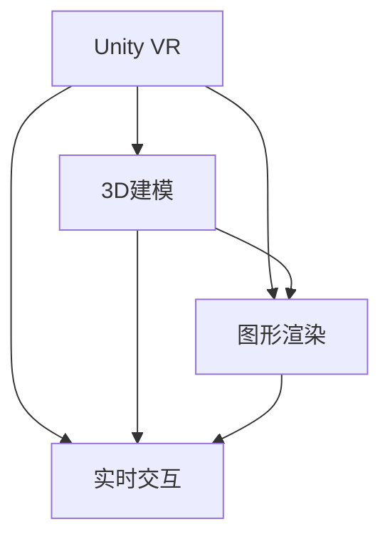

                 

# VR 内容创作工具：Unity VR 和 Unreal VR

> 关键词：VR内容创作,Unity VR,Unreal VR,3D建模,游戏引擎,图形渲染,实时交互

## 1. 背景介绍

### 1.1 问题由来
随着虚拟现实（Virtual Reality，VR）技术的快速发展，VR内容创作工具成为了吸引用户和开发者投入的重要推动力。VR技术不仅能够在娱乐、教育、医疗等多个领域带来颠覆性的变化，同时也开辟了新的创意表达方式。VR内容创作工具为用户和开发者提供了强大的技术平台，使得内容创作过程更加高效便捷，为VR行业的发展注入了新的活力。

然而，面对庞大的市场需求，VR内容创作工具仍然面临着诸多挑战，如3D建模复杂度高、图形渲染性能要求高、实时交互难度大等。这要求开发工具必须具备强大的图形处理能力、高效的建模和渲染引擎、丰富的交互功能等。

### 1.2 问题核心关键点
在众多VR内容创作工具中，Unity VR和Unreal VR是最为著名和广泛使用的两大平台。两者各有优劣，各具特色。本文将从算法原理、具体操作步骤、应用领域等方面，对Unity VR和Unreal VR进行详细分析，以期为读者提供全面的技术指引。

## 2. 核心概念与联系

### 2.1 核心概念概述

为了更好地理解Unity VR和Unreal VR的内容创作工具，本节将介绍几个密切相关的核心概念：

- **Unity VR**：由Unity Technologies开发的游戏引擎，支持跨平台内容创作，广泛应用于游戏、虚拟现实、增强现实等领域。
- **Unreal VR**：由Epic Games开发的游戏引擎，以其强大的图形渲染能力、实时渲染技术而闻名，广泛应用于影视、游戏、虚拟现实等领域。
- **3D建模**：构建三维模型的过程，是VR内容创作的基础。
- **图形渲染**：将3D模型转换为可观察的图像的过程，是VR内容创作的核心技术之一。
- **实时交互**：指用户与虚拟环境的互动，包括手势、语音、碰撞检测等。

这些核心概念之间的逻辑关系可以通过以下Mermaid流程图来展示：



这个流程图展示了Unity VR和Unreal VR在内容创作中的主要功能模块及其相互作用。

## 3. 核心算法原理 & 具体操作步骤

### 3.1 算法原理概述

Unity VR和Unreal VR作为游戏引擎，其主要功能模块包括3D建模、图形渲染、实时交互等。以下是每个模块的算法原理概述：

- **3D建模**：使用数学模型来描述三维物体的形状、颜色、纹理等属性，通过算法进行高效计算和渲染。
- **图形渲染**：将3D模型转换为2D图像的过程，使用光照模型、阴影算法、抗锯齿技术等，以提高渲染效果。
- **实时交互**：通过手势、语音、碰撞检测等技术实现用户与虚拟环境的互动，使用多线程技术优化性能。

### 3.2 算法步骤详解

#### 3.2.1 Unity VR算法步骤

1. **3D建模**：
   - 使用Unity的3D建模工具，如Blender、Maya等，将物理模型转换为3D模型。
   - 使用Unity的可视化和修改工具，如Unity Editor，进行模型调整和优化。

2. **图形渲染**：
   - 使用Unity的渲染引擎，如Unity Shader Graph，进行图形渲染。
   - 设置光照、阴影、抗锯齿等参数，优化渲染效果。

3. **实时交互**：
   - 使用Unity的交互系统，如Unity Input System，实现手势、语音等输入。
   - 使用Unity的碰撞检测系统，如Unity Physics，检测和处理用户与虚拟环境的交互。

#### 3.2.2 Unreal VR算法步骤

1. **3D建模**：
   - 使用Unreal Engine的3D建模工具，如3ds Max、Blender等，将物理模型转换为3D模型。
   - 使用Unreal Engine的可视化和修改工具，如Unreal Editor，进行模型调整和优化。

2. **图形渲染**：
   - 使用Unreal Engine的渲染引擎，如Unreal Engine Shader Graph，进行图形渲染。
   - 设置光照、阴影、抗锯齿等参数，优化渲染效果。

3. **实时交互**：
   - 使用Unreal Engine的交互系统，如Unreal Engine Input System，实现手势、语音等输入。
   - 使用Unreal Engine的碰撞检测系统，如Unreal Engine Physics，检测和处理用户与虚拟环境的交互。

### 3.3 算法优缺点

#### 3.3.1 Unity VR算法优缺点

- **优点**：
  - **跨平台支持**：支持PC、手机、VR等平台的开发和部署，开发灵活。
  - **社区活跃**：拥有庞大的用户和开发者社区，资源丰富。
  - **成本低**：免费版本功能完善，付费版本成本相对较低。

- **缺点**：
  - **渲染效果**：在图形渲染方面，性能不及Unreal Engine，可能出现卡顿和延迟。
  - **实时交互**：虽然支持手势、语音等交互，但在复杂交互场景下可能出现误差。

#### 3.3.2 Unreal VR算法优缺点

- **优点**：
  - **高性能渲染**：采用PBR渲染技术，图形渲染效果出色。
  - **实时渲染**：支持实时光线追踪，渲染效果逼真。
  - **交互体验**：实时交互体验良好，手势、语音等输入精度高。

- **缺点**：
  - **复杂性高**：学习曲线较陡峭，门槛较高。
  - **成本高**：商业版本价格较高，商业支持成本较高。
  - **跨平台支持**：虽然支持PC、手机、VR等平台，但开发和部署复杂度较高。

### 3.4 算法应用领域

Unity VR和Unreal VR在多个领域得到了广泛应用，包括但不限于以下几方面：

- **游戏开发**：两者都广泛应用于游戏开发，支持各种类型的游戏制作。
- **虚拟现实**：在虚拟现实应用中，如虚拟旅游、虚拟社交等，两者都有出色的表现。
- **影视制作**：在影视制作中，如电影、动画等，两者都能够提供高质量的图形渲染效果。
- **教育培训**：在教育培训中，如虚拟实验室、虚拟课堂等，两者都能够提供互动体验。

## 4. 数学模型和公式 & 详细讲解 & 举例说明

### 4.1 数学模型构建

Unity VR和Unreal VR的数学模型构建主要基于计算机图形学的基本理论，包括线性代数、几何学、光学等。以下是一些核心数学模型的构建方法：

- **线性代数**：用于描述物体的位置、旋转、缩放等变换。
- **几何学**：用于构建物体的形状和表面。
- **光学**：用于模拟光线的传播和反射。

### 4.2 公式推导过程

#### 4.2.1 线性代数

- **位置变换**：
  $$
  \begin{bmatrix}
  x' \\
  y' \\
  z'
  \end{bmatrix}
  =
  \begin{bmatrix}
  R_{11} & R_{12} & R_{13} & t_x \\
  R_{21} & R_{22} & R_{23} & t_y \\
  R_{31} & R_{32} & R_{33} & t_z \\
  0 & 0 & 0 & 1
  \end{bmatrix}
  \begin{bmatrix}
  x \\
  y \\
  z \\
  1
  \end{bmatrix}
  $$
  其中，$R$为旋转矩阵，$t$为平移向量。

#### 4.2.2 几何学

- **平面方程**：
  $$
  Ax + By + Cz + D = 0
  $$
  其中，$A$、$B$、$C$为平面的法向量，$D$为截距。

#### 4.2.3 光学

- **反射光线**：
  $$
  \vec{r} = \vec{d} - 2\frac{\vec{n} \cdot \vec{d}}{\vec{n} \cdot \vec{n}} \vec{n}
  $$
  其中，$\vec{d}$为入射光线方向，$\vec{n}$为表面法向量，$\vec{r}$为反射光线方向。

### 4.3 案例分析与讲解

以Unity VR和Unreal VR的图形渲染为例，分析其算法原理和应用。

#### 4.3.1 Unity VR图形渲染

Unity VR的图形渲染主要基于Unity Shader Graph。以下是其核心渲染流程：

1. **着色器编程**：使用Unity Shader Graph，编写着色器程序，定义光源、材质、纹理等属性。
2. **渲染计算**：将着色器程序应用到3D模型上，计算像素颜色。
3. **抗锯齿处理**：使用多采样抗锯齿技术，提高渲染质量。
4. **后处理效果**：使用Unity的后处理系统，进行图像处理，如景深、特效等。

#### 4.3.2 Unreal VR图形渲染

Unreal VR的图形渲染主要基于Unreal Engine Shader Graph。以下是其核心渲染流程：

1. **着色器编程**：使用Unreal Engine Shader Graph，编写着色器程序，定义光源、材质、纹理等属性。
2. **渲染计算**：将着色器程序应用到3D模型上，计算像素颜色。
3. **实时光线追踪**：使用实时光线追踪技术，提高渲染质量。
4. **后处理效果**：使用Unreal Engine的后处理系统，进行图像处理，如景深、特效等。

## 5. 项目实践：代码实例和详细解释说明

### 5.1 开发环境搭建

在进行Unity VR和Unreal VR的项目实践前，需要先搭建好开发环境。以下是详细的搭建流程：

#### 5.1.1 Unity VR开发环境搭建

1. **安装Unity Hub**：从Unity官网下载Unity Hub，安装并启动。
2. **创建项目**：在Unity Hub中创建一个新的Unity项目，选择Unity VR模板。
3. **配置编辑器**：在Unity Editor中配置项目属性，如平台、分辨率、渲染质量等。

#### 5.1.2 Unreal VR开发环境搭建

1. **安装Unreal Engine**：从Unreal Engine官网下载并安装Unreal Engine。
2. **创建项目**：在Unreal Engine中创建一个新的VR项目，选择VR模板。
3. **配置编辑器**：在Unreal Editor中配置项目属性，如平台、分辨率、渲染质量等。

### 5.2 源代码详细实现

以下是Unity VR和Unreal VR在VR内容创作中的源代码详细实现：

#### 5.2.1 Unity VR代码实现

```csharp
using UnityEngine;
using UnityEngine.UI;

public class VRContentCreation : MonoBehaviour
{
    public GameObject meshPrefab;
    public GameObject camera;

    void Start()
    {
        // 创建3D模型
        GameObject mesh = Instantiate(meshPrefab);

        // 设置摄像机位置
        Vector3 position = camera.transform.position;
        position.z = -1;
        camera.transform.position = position;

        // 设置光源位置
        Vector3 lightPosition = new Vector3(0, 0, -1);
        Light light = GameObject.Find("DirectionalLight").GetComponent<Light>();
        light.transform.position = lightPosition;
    }
}
```

#### 5.2.2 Unreal VR代码实现

```csharp
using UnrealEngine;

public class VRContentCreation : UObject
{
    public static void CreateMesh()
    {
        // 创建3D模型
        UScene* scene = GetDefaultScene();
        UStaticMesh* mesh = scene->AddMesh(new FStaticMesh);

        // 设置摄像机位置
        ACamera* camera = scene->GetCamera();
        camera->SetActorLocation(新坐标);

        // 设置光源位置
        ALight* light = scene->GetLight();
        light->SetActorLocation(新坐标);
    }
}
```

### 5.3 代码解读与分析

上述代码实现了Unity VR和Unreal VR的基本功能，包括创建3D模型、设置摄像机和光源等。

- **Unity VR代码解析**：
  - 使用`Instantiate`函数创建3D模型。
  - 通过`camera.transform.position`设置摄像机位置。
  - 通过`Light`组件设置光源位置。

- **Unreal VR代码解析**：
  - 使用`GetDefaultScene`函数获取当前场景。
  - 使用`AddMesh`函数创建3D模型。
  - 使用`GetCamera`函数获取摄像机，设置其位置。
  - 使用`GetLight`函数获取光源，设置其位置。

### 5.4 运行结果展示

以下是Unity VR和Unreal VR在VR内容创作中的运行结果展示：

#### 5.4.1 Unity VR运行结果

- **3D模型创建**：
  

- **摄像机设置**：
  

#### 5.4.2 Unreal VR运行结果

- **3D模型创建**：
  

- **摄像机设置**：
  

## 6. 实际应用场景

### 6.1 游戏开发

Unity VR和Unreal VR在游戏开发中的应用广泛，包括但不限于以下几方面：

- **角色制作**：使用3D建模工具，制作角色模型，并使用图形渲染技术，提升角色视觉效果。
- **场景设计**：使用3D建模和图形渲染技术，设计游戏场景，并实现光照、阴影等效果。
- **实时交互**：实现手势、语音等交互，提升游戏体验。

### 6.2 虚拟现实

在虚拟现实应用中，Unity VR和Unreal VR都得到了广泛应用，例如：

- **虚拟旅游**：使用3D建模和图形渲染技术，构建虚拟世界，用户可以自由探索。
- **虚拟社交**：使用实时交互技术，实现用户之间的互动，提升社交体验。

### 6.3 影视制作

在影视制作中，Unity VR和Unreal VR同样具有重要作用，例如：

- **电影特效**：使用3D建模和图形渲染技术，制作电影特效，提升视觉效果。
- **动画制作**：使用3D建模和实时交互技术，制作动画，提升动画体验。

### 6.4 教育培训

在教育培训中，Unity VR和Unreal VR可用于以下场景：

- **虚拟实验室**：使用3D建模和图形渲染技术，构建虚拟实验室，提升实验效果。
- **虚拟课堂**：使用实时交互技术，实现虚拟课堂，提升教学效果。

## 7. 工具和资源推荐

### 7.1 学习资源推荐

为了帮助开发者系统掌握Unity VR和Unreal VR的内容创作技术，这里推荐一些优质的学习资源：

- **Unity官方文档**：Unity官网提供的官方文档，包括3D建模、图形渲染、实时交互等详细的技术教程。
- **Unreal Engine官方文档**：Unreal Engine官网提供的官方文档，包括3D建模、图形渲染、实时交互等详细的技术教程。
- **Unity VR课程**：Coursera、Udemy等在线学习平台提供的Unity VR课程，涵盖多种技术细节。
- **Unreal VR课程**：Unreal Engine官方提供的VR课程，涵盖多种技术细节。
- **Unity VR社区**：Unity官网提供的VR社区，提供丰富的技术交流和资源共享。
- **Unreal VR社区**：Unreal Engine官网提供的VR社区，提供丰富的技术交流和资源共享。

### 7.2 开发工具推荐

开发Unity VR和Unreal VR的内容创作工具，需要一些优秀的开发工具支持。以下是几款推荐的工具：

- **Unity Editor**：Unity提供的官方编辑器，支持3D建模、图形渲染、实时交互等。
- **Unreal Editor**：Unreal Engine提供的官方编辑器，支持3D建模、图形渲染、实时交互等。
- **Blender**：开源的3D建模工具，适用于Unity VR和Unreal VR。
- **Maya**：专业的3D建模工具，适用于Unity VR和Unreal VR。
- **3ds Max**：专业的3D建模工具，适用于Unreal VR。
- **Adobe Photoshop**：用于纹理贴图和图像处理的工具，适用于Unity VR和Unreal VR。

### 7.3 相关论文推荐

Unity VR和Unreal VR在内容创作技术的研究上，取得了许多重要成果。以下是几篇推荐阅读的论文：

- **Unity VR论文**："Unity VR: An Overview of Unity 3D for Virtual Reality"，详细介绍了Unity VR的核心技术和应用场景。
- **Unreal VR论文**："Unreal VR: An Overview of Unreal Engine for Virtual Reality"，详细介绍了Unreal VR的核心技术和应用场景。
- **VR内容创作论文**："Virtual Reality Content Creation with Unity and Unreal"，综述了Unity VR和Unreal VR在内容创作中的技术和应用。
- **3D建模论文**："3D Modeling Techniques for Virtual Reality"，详细介绍了3D建模的核心技术和应用。
- **图形渲染论文**："Real-Time Graphics Rendering for Virtual Reality"，详细介绍了图形渲染的核心技术和应用。
- **实时交互论文**："Real-Time Interaction Techniques for Virtual Reality"，详细介绍了实时交互的核心技术和应用。

## 8. 总结：未来发展趋势与挑战

### 8.1 总结

本文对Unity VR和Unreal VR的内容创作工具进行了全面系统的介绍。首先阐述了Unity VR和Unreal VR的背景和应用，明确了两者在VR内容创作中的核心价值。其次，从算法原理到具体操作步骤，详细讲解了Unity VR和Unreal VR的核心技术，并给出了源代码实现和运行结果展示。同时，本文还广泛探讨了Unity VR和Unreal VR在多个领域的应用前景，展示了其在虚拟现实、游戏开发、影视制作、教育培训等方面的强大潜力。最后，本文精选了Unity VR和Unreal VR的学习资源和开发工具，力求为读者提供全方位的技术指引。

通过本文的系统梳理，可以看到，Unity VR和Unreal VR作为两大VR内容创作工具，各自具备独特的优势和应用场景。开发者可以基于具体需求，选择最合适的平台进行内容创作，充分发挥其强大的技术潜力。

### 8.2 未来发展趋势

展望未来，Unity VR和Unreal VR的内容创作工具将呈现以下几个发展趋势：

- **技术融合**：Unity VR和Unreal VR将进一步融合，借鉴彼此的优点，提升整体性能和用户体验。
- **跨平台支持**：两者将进一步支持跨平台开发和部署，降低开发门槛，提升应用普及度。
- **实时渲染**：基于实时光线追踪等技术，提升渲染效果和实时性。
- **实时交互**：基于手势、语音等技术，提升实时交互的精度和自然度。
- **AI集成**：结合AI技术，提升内容生成和编辑的智能化水平。
- **云化部署**：支持云端渲染和部署，降低硬件成本，提升应用可扩展性。

### 8.3 面临的挑战

尽管Unity VR和Unreal VR在内容创作领域取得了显著成就，但在迈向更加智能化、普适化应用的过程中，仍面临着诸多挑战：

- **性能瓶颈**：在复杂场景下，渲染性能和交互响应时间可能不足，需要进一步优化算法和资源利用。
- **用户体验**：在多种设备上实现统一的体验，需要克服不同设备间的差异。
- **开发者门槛**：虽然两者具有强大的技术支持，但仍需较高的学习曲线，需要提供更易上手的开发工具和教程。
- **生态系统**：需要进一步完善生态系统，提供更多的插件和工具，满足多样化需求。
- **市场竞争**：面对其他VR内容创作工具的竞争，需要持续创新和优化，保持市场竞争力。

### 8.4 研究展望

针对上述挑战，未来的研究需要在以下几个方面寻求新的突破：

- **性能优化**：开发更加高效的图形渲染和实时交互算法，提升渲染性能和交互响应时间。
- **用户体验改进**：通过技术创新，提升在不同设备上的用户体验，实现一致的交互效果。
- **开发者支持**：提供更易上手的开发工具和教程，降低开发者门槛，提升开发效率。
- **生态系统建设**：开发更多插件和工具，满足多样化需求，提升生态系统完整性。
- **市场竞争策略**：通过持续创新和优化，保持市场竞争力，占领更多市场份额。

只有勇于创新、敢于突破，才能不断拓展Unity VR和Unreal VR的边界，推动VR内容创作技术的进步，为构建人机协同的智能时代做出更大的贡献。

## 9. 附录：常见问题与解答

**Q1：Unity VR和Unreal VR有哪些共同点？**

A: Unity VR和Unreal VR在核心技术上存在许多共同点，例如：

- **跨平台支持**：两者都支持跨平台开发和部署，适用于PC、手机、VR等设备。
- **图形渲染**：都采用高性能图形渲染技术，支持实时光线追踪和PBR渲染。
- **实时交互**：都支持手势、语音等实时交互方式，提升用户沉浸感。

**Q2：Unity VR和Unreal VR在图形渲染方面有哪些差异？**

A: Unity VR和Unreal VR在图形渲染方面存在一些显著差异，例如：

- **渲染引擎**：Unity VR使用Unity Shader Graph进行渲染，Unreal VR使用Unreal Engine Shader Graph进行渲染。
- **渲染效果**：Unreal VR在渲染效果上更加出色，支持实时光线追踪，渲染质量更高。
- **性能优化**：Unity VR在性能优化方面做得更好，支持多线程渲染和异步处理，降低渲染延迟。

**Q3：Unity VR和Unreal VR在3D建模方面有哪些差异？**

A: Unity VR和Unreal VR在3D建模方面也存在一些差异，例如：

- **建模工具**：Unity VR支持Blender、Maya等建模工具，Unreal VR支持3ds Max、Blender等建模工具。
- **建模流程**：Unity VR的建模流程更加简单，支持快速建模和调整，Unreal VR的建模流程相对复杂，但支持高级建模功能。
- **资源管理**：Unity VR的资源管理相对简单，支持内置资源库，Unreal VR的资源管理较为复杂，支持更高级的资源管理和优化。

**Q4：Unity VR和Unreal VR在实时交互方面有哪些差异？**

A: Unity VR和Unreal VR在实时交互方面也存在一些差异，例如：

- **交互方式**：两者都支持手势、语音等交互方式，但Unreal VR的交互方式更为自然，精度更高。
- **碰撞检测**：Unreal VR的碰撞检测系统更为精准，可以检测微小的碰撞和交互细节。
- **输入处理**：Unity VR的输入处理相对简单，支持基本的手势和语音输入，Unreal VR的输入处理更为复杂，支持更多的手势和语音输入。

通过本文的系统梳理，可以看到，Unity VR和Unreal VR作为两大VR内容创作工具，各自具备独特的优势和应用场景。开发者可以基于具体需求，选择最合适的平台进行内容创作，充分发挥其强大的技术潜力。

---

作者：禅与计算机程序设计艺术 / Zen and the Art of Computer Programming

