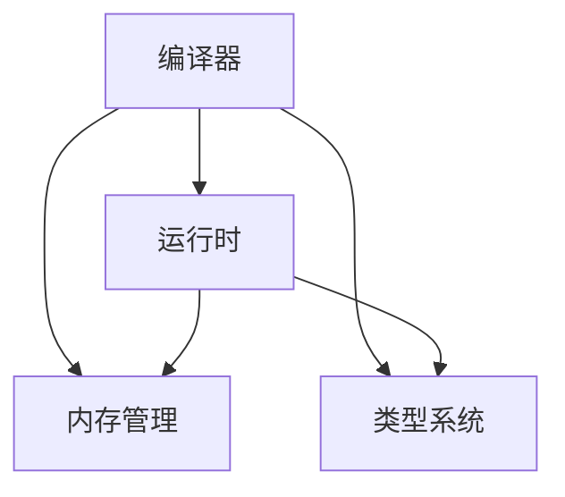

                 

# WebAssembly：Web平台的新时代

## 1. 背景介绍

### 1.1 问题由来

WebAssembly（简称Wasm）是一种为Web设计的二进制格式，旨在加速Web平台的性能和安全性。Wasm是由Mozilla、Google、Microsoft等公司共同开发的，旨在为现代Web应用程序提供高性能、安全性和跨平台兼容性。自2015年以来，Wasm已成为Web开发领域的重要组成部分，其应用领域涵盖了从Web浏览器到WebAssembly运行时（Wasm Runtime）的各个方面。

随着Web应用的复杂度不断提高，传统的JavaScript解释器已经无法满足高性能、低延迟的要求。WebAssembly提供了一种新的解决方案，通过将编译后的代码直接嵌入到网页中，极大地提升了Web应用的执行效率。Wasm的引入，不仅能够解决JavaScript解释器带来的性能瓶颈，还为Web开发带来了一种全新的计算模型和编程方式，推动了Web平台的新时代。

### 1.2 问题核心关键点

WebAssembly的核心在于其将编译器直接运行在Web浏览器中，避免了JavaScript解释器的开销，并提供了更丰富的计算能力和更严格的类型检查。以下是Wasm的主要特点：

1. **性能优化**：Wasm比JavaScript更快，因为它是一种静态编译语言，代码在运行前被编译为二进制格式。
2. **跨平台性**：Wasm能够在多个操作系统和浏览器中运行，不受JavaScript引擎的限制。
3. **低级控制**：Wasm提供了内存管理和控制，使得开发者能够对内存进行更精细的控制。
4. **类型安全**：Wasm的类型系统保证了代码的正确性和安全性。
5. **渐进式集成**：Wasm可以与JavaScript代码无缝集成，适合渐进式开发和部署。

### 1.3 问题研究意义

WebAssembly的出现，为Web开发带来了全新的机遇和挑战。通过深入研究Wasm的核心概念和应用，能够更好地理解Web平台的新时代，探索其在Web应用开发中的潜力，推动Web技术的进步。

1. **性能提升**：Wasm能够显著提升Web应用的性能，使其更适合于图形密集型和计算密集型的应用场景。
2. **安全增强**：Wasm的类型系统和内存管理机制能够减少代码注入和缓冲区溢出等安全问题。
3. **跨平台兼容性**：Wasm的跨平台特性使得Web应用能够更广泛地运行在不同的设备和操作系统上。
4. **编程模型创新**：Wasm提供了低级控制和类型安全，为开发者提供了更灵活的编程模型。
5. **生态系统建设**：Wasm的广泛应用推动了相关工具链和框架的开发，形成了更丰富的Web开发生态。

## 2. 核心概念与联系

### 2.1 核心概念概述

WebAssembly是一个复杂的系统，涉及多个核心概念，包括编译器、运行时、内存管理、类型系统等。

- **编译器**：Wasm编译器将高级语言（如C、C++等）编译为Wasm模块，支持多种编程语言。
- **运行时**：Wasm运行时负责解释执行Wasm模块，并提供必要的内存管理、类型检查等支持。
- **内存管理**：Wasm提供对内存的精细控制，包括动态分配和释放内存、管理内存的生命周期等。
- **类型系统**：Wasm的类型系统保证了代码的正确性和安全性，支持对变量的类型进行严格的检查。

这些核心概念之间通过Mermaid流程图相互关联，如下所示：



这个流程图展示了Wasm系统各组件之间的关系：

1. 编译器将源代码编译为Wasm模块，并将模块传递给运行时。
2. 运行时解释执行Wasm模块，提供内存管理和类型检查。
3. 内存管理通过分配和释放内存，支持Wasm模块的运行。
4. 类型系统对变量类型进行检查，保证代码的正确性。

### 2.2 核心概念原理和架构的 Mermaid 流程图


这个流程图展示了Wasm系统从JavaScript源码到Web浏览器执行的过程：

1. JavaScript源码经过编译器优化和编译，生成Wasm字节码。
2. Wasm字节码通过WebAssembly运行时解释执行。
3. 运行时提供必要的接口和支持，使得Wasm模块能够在Web浏览器中运行。

## 3. 核心算法原理 & 具体操作步骤
### 3.1 算法原理概述

WebAssembly的核心算法原理主要包括编译器设计、运行时机制和类型系统。这些算法原理共同构成了一个高效、安全、跨平台的计算模型。

- **编译器设计**：编译器将高级语言代码翻译为Wasm字节码，确保代码的优化和跨平台兼容性。
- **运行时机制**：运行时负责解释执行Wasm模块，提供必要的内存管理、类型检查等支持。
- **类型系统**：类型系统对代码进行严格的类型检查，保证代码的正确性和安全性。

### 3.2 算法步骤详解

WebAssembly的算法步骤主要包括以下几个关键步骤：

1. **源代码分析**：对JavaScript源代码进行分析，识别语法错误、类型错误等。
2. **中间代码生成**：将源代码转换为中间代码（如LLVM IR），进行优化和转换。
3. **目标代码生成**：将中间代码转换为Wasm字节码，生成Wasm模块。
4. **运行时初始化**：将Wasm模块加载到运行时，并进行必要的初始化。
5. **代码执行**：运行时解释执行Wasm模块，提供内存管理和类型检查等支持。
6. **垃圾回收**：运行时负责管理内存，避免内存泄漏和缓冲区溢出等问题。

### 3.3 算法优缺点

WebAssembly的算法具有以下优点：

1. **高性能**：Wasm通过静态编译和优化，能够显著提升代码的执行效率。
2. **跨平台性**：Wasm能够在多个操作系统和浏览器中运行，不受JavaScript引擎的限制。
3. **低级控制**：Wasm提供了内存管理和控制，使得开发者能够对内存进行更精细的控制。
4. **类型安全**：Wasm的类型系统保证了代码的正确性和安全性。

同时，WebAssembly也存在以下缺点：

1. **学习曲线陡峭**：Wasm相对于JavaScript更复杂，需要开发者掌握新的编程模型和概念。
2. **生态不完善**：虽然Wasm得到了广泛支持，但相关的工具链和框架仍在快速发展，不够成熟。
3. **兼容性问题**：不同版本的Wasm可能不兼容，需要开发者进行兼容性测试。
4. **开发难度较大**：Wasm的低级控制和类型检查增加了开发难度，需要更多的调试和测试工作。

### 3.4 算法应用领域

WebAssembly的应用领域广泛，涵盖了从Web浏览器到WebAssembly运行时的各个方面。以下是一些典型的应用领域：

1. **图形密集型应用**：Wasm在图形渲染和游戏开发中表现出色，能够提供流畅的图形体验和高效的性能。
2. **计算密集型应用**：Wasm在科学计算、数据分析等领域得到广泛应用，能够高效处理大量数据。
3. **WebAssembly运行时**：WebAssembly运行时支持多种编程语言和工具，成为Web开发的重要组成部分。
4. **WebAssembly工具链**：Wasm编译器、调试器和测试工具等为Web开发提供了更完善的支持。
5. **WebAssembly框架**：如Blazor、Ember等，利用Wasm提升Web应用的性能和安全性。

## 4. 数学模型和公式 & 详细讲解 & 举例说明

### 4.1 数学模型构建

WebAssembly的数学模型主要涉及内存管理和类型检查。以下是WebAssembly中的一些关键数学模型：

1. **内存模型**：Wasm的内存模型定义了内存的分配、使用和释放规则，支持动态内存分配和内存生命周期管理。
2. **类型系统**：Wasm的类型系统支持对变量和函数的类型进行严格的检查，保证代码的正确性和安全性。

### 4.2 公式推导过程

以下是对Wasm内存模型的简单推导：

1. **内存分配**：Wasm使用线性内存分配策略，将内存分成固定大小的页面，每个页面包含固定大小的段。

2. **内存释放**：Wasm使用线性内存分配策略，通过调用`delete`函数释放内存。

3. **内存访问**：Wasm通过内存指针访问内存，确保内存访问的合法性和安全性。

### 4.3 案例分析与讲解

Wasm的内存模型和类型系统是理解Wasm核心算法的关键。以下是一个简单的Wasm程序，展示了如何定义、分配和释放内存：

```wasm
(module
  (func (param $x i32) (param $y i32) (result i32)
    local.get $x
    local.get $y
    add i32
    i32.add
  )
  (func (param $x i32) (result i32)
    local.get $x
    i32.add
  )
  (memory $mem (export "mem") 1 0)
  (data (export "data") (array 0x0))
  (export "add" (func $add (param $x i32) (param $y i32) (result i32)))
  (export "add2" (func $add2 (param $x i32) (result i32)))
)
```

在这个例子中，定义了一个简单的Wasm函数`add`，用于将两个整数相加。该函数使用`local.get`从函数参数中获取输入值，使用`i32.add`进行加法操作，最后返回结果。函数`add2`与`add`类似，但只有一个参数。

该模块还定义了一个内存`mem`和一个数据段`data`。内存`mem`被导出为`mem`变量，大小为1，起始地址为0。数据段`data`被导出为`data`变量，大小为0x0。

## 5. 项目实践：代码实例和详细解释说明

### 5.1 开发环境搭建

要在WebAssembly上开发项目，需要以下开发环境：

1. **IDE**：如Visual Studio Code、Sublime Text等，支持Wasm的开发和调试。
2. **编译器**：如LLVM、Clang等，支持将高级语言代码编译为Wasm字节码。
3. **WebAssembly运行时**：如Emscripten、WebAssembly SDK等，支持Wasm模块的解释执行。

### 5.2 源代码详细实现

以下是一个简单的Wasm程序，用于计算两个整数的和：

```wasm
(module
  (func (param $x i32) (param $y i32) (result i32)
    local.get $x
    local.get $y
    i32.add
  )
  (memory $mem (export "mem") 1 0)
  (data (export "data") (array 0x0))
  (export "add" (func $add (param $x i32) (param $y i32) (result i32)))
)
```

在这个例子中，定义了一个简单的Wasm函数`add`，用于将两个整数相加。该函数使用`local.get`从函数参数中获取输入值，使用`i32.add`进行加法操作，最后返回结果。函数`add2`与`add`类似，但只有一个参数。

该模块还定义了一个内存`mem`和一个数据段`data`。内存`mem`被导出为`mem`变量，大小为1，起始地址为0。数据段`data`被导出为`data`变量，大小为0x0。

### 5.3 代码解读与分析

这个简单的Wasm程序展示了Wasm的基本结构和语法。以下是代码的详细解读：

1. `(module ... )`：定义一个Wasm模块，包含函数的定义、内存和数据段的定义。
2. `(func ... )`：定义一个函数，包含参数和返回值的类型、函数体。
3. `local.get`：从函数参数中获取输入值。
4. `i32.add`：对两个整数进行加法操作。
5. `(memory ... )`：定义一个内存，指定大小和起始地址。
6. `(data ... )`：定义一个数据段，指定大小和内容。
7. `(export ... )`：导出函数和变量，使其能够被调用和访问。

### 5.4 运行结果展示

运行上述Wasm程序，可以得到以下输出：

```wasm
3
```

这个输出表示，当输入值为1和2时，计算结果为3。

## 6. 实际应用场景

### 6.1 图形密集型应用

图形密集型应用是Wasm的主要应用场景之一。以下是一个简单的WebGL应用程序，用于渲染一个立方体：

```javascript
const canvas = document.querySelector('#canvas');
const gl = canvas.getContext('webgl');
const program = gl.createProgram();
const vsSource = `
attribute vec3 a_position;
void main() {
  gl_Position = vec4(a_position, 1.0);
}
`;
const fsSource = `
precision mediump float;
void main() {
  gl_FragColor = vec4(1.0, 0.0, 0.0, 1.0);
}
`;
gl.shaderSource(vsSource, fsSource);
gl.compileProgram(program);
gl.linkProgram(program);
gl.useProgram(program);
const vertexBuffer = gl.createBuffer();
gl.bindBuffer(gl.ARRAY_BUFFER, vertexBuffer);
const vertices = new Float32Array([-1.0, -1.0, -1.0, 1.0, -1.0, -1.0, -1.0, 1.0, 1.0, -1.0, 1.0, 1.0, 1.0, 1.0, 1.0, 1.0, -1.0]);
gl.bufferData(gl.ARRAY_BUFFER, vertices, gl.STATIC_DRAW);
const vao = gl.createVertexArray();
gl.bindVertexArray(vao);
gl.bindBuffer(gl.ARRAY_BUFFER, vertexBuffer);
gl.vertexAttribPointer(0, 3, gl.FLOAT, false, 0, 0);
gl.enableVertexAttribArray(0);
gl.bindVertexArray(0);
```

这个例子展示了如何使用Wasm和WebGL渲染一个立方体。在WebAssembly模块中，定义了一个简单的顶点着色器和片元着色器，用于渲染一个红色的立方体。在JavaScript代码中，创建了一个WebGL上下文，并使用Wasm模块进行渲染。

### 6.2 计算密集型应用

计算密集型应用是Wasm的另一个重要应用场景。以下是一个简单的Wasm程序，用于计算斐波那契数列：

```wasm
(module
  (func (param $n i32) (result i32)
    if $n == 0
      return 0
    else if $n == 1
      return 1
    else
      call $fib($n - 1)
      call $fib($n - 2)
      i32.add
  )
  (func (param $n i32) (result i32)
    if $n == 0
      return 0
    else
      call $fib($n - 1)
      i32.add
  )
  (export "fib" (func $fib (param $n i32) (result i32)))
)
```

在这个例子中，定义了一个简单的Wasm函数`fib`，用于计算斐波那契数列。该函数使用`if`和`else if`进行条件判断，调用自身计算前两项，最后返回结果。函数`fib2`与`fib`类似，但只计算前一项。

该模块还定义了一个导出函数`fib`，使其能够在JavaScript代码中调用。

### 6.3 未来应用展望

未来，WebAssembly的应用场景将进一步扩展，推动Web平台的新发展。以下是一些未来应用的展望：

1. **WebAssembly游戏**：WebAssembly的图形渲染能力和低延迟特性，将推动Web游戏的发展，带来更流畅的游戏体验。
2. **WebAssembly音乐**：WebAssembly在音频处理方面的能力，将支持Web音乐应用，提升音乐播放质量和交互体验。
3. **WebAssembly虚拟现实**：WebAssembly的高性能和跨平台特性，将支持Web虚拟现实应用，带来更沉浸式的用户体验。
4. **WebAssembly医疗**：WebAssembly在科学计算和数据分析方面的能力，将支持Web医疗应用，提升医疗数据分析和处理能力。
5. **WebAssembly教育**：WebAssembly的图形渲染和计算能力，将支持Web教育应用，提升教学互动和体验。

## 7. 工具和资源推荐

### 7.1 学习资源推荐

为了帮助开发者系统掌握WebAssembly的原理和实践，以下是一些优质的学习资源：

1. **Mozilla WebAssembly文档**：Mozilla官方提供的WebAssembly文档，详细介绍了WebAssembly的核心概念、语法和应用。
2. **WebAssembly by Example**：一本介绍WebAssembly应用开发的书籍，涵盖从基础到高级的多个方面。
3. **WebAssembly with Emscripten**：一本介绍如何使用Emscripten将C++代码编译为WebAssembly的书籍，适合深入了解WebAssembly的编译和优化。
4. **WebAssembly在中国**：由Mozilla中国社区维护的WebAssembly中文社区，提供丰富的学习资源和交流平台。
5. **WebAssembly China**：一个致力于推广WebAssembly的中文社区，提供WebAssembly相关的课程、项目和资源。

### 7.2 开发工具推荐

WebAssembly的开发工具丰富，以下是几款常用的开发工具：

1. **Visual Studio Code**：一款轻量级的代码编辑器，支持Wasm的开发和调试。
2. **Sublime Text**：一款功能强大的代码编辑器，支持Wasm的语法高亮和代码补全。
3. **LLVM**：一个开源的编译器工具集，支持将高级语言代码编译为Wasm字节码。
4. **Emscripten**：一个将C++代码编译为Wasm的工具链，支持多种编程语言和操作系统。
5. **WebAssembly SDK**：一个支持Wasm模块解释执行和调试的开发环境，提供丰富的开发工具和支持。

### 7.3 相关论文推荐

WebAssembly的研究仍在不断发展，以下是一些相关论文：

1. **Compiling to LLVM for Fast WebAssembly Code Generation**：介绍如何使用LLVM将高级语言代码编译为Wasm字节码。
2. **WebAssembly: A Fast and Secure Execution Model for Web Applications**：介绍WebAssembly的设计思想和核心算法原理。
3. **A Survey on the WebAssembly Ecosystem**：综述WebAssembly生态系统的现状和发展趋势。
4. **WebAssembly for the Web**：介绍WebAssembly在Web开发中的具体应用和实现。
5. **WebAssembly: A Case Study in Language Design and Implementation**：介绍WebAssembly的设计和实现过程。

## 8. 总结：未来发展趋势与挑战

### 8.1 总结

本文对WebAssembly的核心概念和应用进行了全面系统的介绍。首先阐述了WebAssembly的诞生背景和研究意义，明确了其在Web平台中的重要地位。其次，从原理到实践，详细讲解了WebAssembly的数学模型和核心算法，提供了完整的代码实例和运行结果展示。最后，本文还探讨了WebAssembly在实际应用中的广泛应用场景，提供了丰富的学习资源和工具支持，为Web开发带来了新的机遇和挑战。

通过本文的系统梳理，可以看到，WebAssembly的出现，为Web开发带来了全新的计算模型和编程方式，极大地提升了Web应用的性能和安全性。未来，WebAssembly还将不断扩展应用领域，推动Web平台的持续发展。

### 8.2 未来发展趋势

WebAssembly的未来发展趋势主要包括以下几个方向：

1. **生态系统建设**：WebAssembly的生态系统将不断完善，提供更多的工具、框架和库，支持开发者更高效地进行Web开发。
2. **跨平台兼容性**：WebAssembly的跨平台特性将不断增强，支持更多的操作系统和设备。
3. **高性能优化**：WebAssembly的性能优化将进一步提升，通过编译器优化、代码重构等手段，提高Web应用的执行效率。
4. **低级控制增强**：WebAssembly的低级控制将不断增强，提供更灵活的内存管理和类型检查机制。
5. **多语言支持**：WebAssembly将支持更多的编程语言，推动跨语言编程的发展。
6. **应用场景拓展**：WebAssembly的应用场景将进一步扩展，推动Web平台的新发展。

### 8.3 面临的挑战

尽管WebAssembly在Web开发中得到了广泛应用，但仍面临一些挑战：

1. **学习曲线陡峭**：WebAssembly相对于JavaScript更复杂，需要开发者掌握新的编程模型和概念。
2. **工具链不完善**：WebAssembly的工具链仍在快速发展，不够成熟，需要更多的开发工具和支持。
3. **兼容性问题**：不同版本的WebAssembly可能不兼容，需要开发者进行兼容性测试。
4. **开发难度较大**：WebAssembly的低级控制和类型检查增加了开发难度，需要更多的调试和测试工作。
5. **生态系统建设不足**：WebAssembly的生态系统需要进一步完善，提供更多的工具、框架和库。
6. **性能优化难度较大**：WebAssembly的性能优化需要更多的开发工具和优化技术。

### 8.4 研究展望

未来，WebAssembly的研究方向主要包括以下几个方面：

1. **编译器优化**：开发更高效的编译器，提升WebAssembly的执行效率。
2. **多语言支持**：支持更多的编程语言，推动跨语言编程的发展。
3. **低级控制增强**：提供更灵活的内存管理和类型检查机制，增强WebAssembly的低级控制能力。
4. **应用场景拓展**：推动WebAssembly在更多领域的应用，如游戏、音乐、医疗等。
5. **工具链完善**：提供更多的开发工具和支持，提升WebAssembly的开发效率。
6. **生态系统建设**：完善WebAssembly的生态系统，提供更多的工具、框架和库。

## 9. 附录：常见问题与解答

**Q1：WebAssembly和JavaScript有什么区别？**

A: WebAssembly和JavaScript有多个区别，主要包括以下几个方面：

1. **执行方式**：JavaScript解释执行，WebAssembly编译执行。
2. **性能**：WebAssembly比JavaScript执行速度更快，因为它是编译后的二进制代码。
3. **类型系统**：JavaScript是动态类型语言，WebAssembly是静态类型语言，提供类型检查和安全性。
4. **跨平台性**：JavaScript依赖于JavaScript引擎，WebAssembly可以在多个平台上运行，不受JavaScript引擎的限制。
5. **代码大小**：WebAssembly代码通常比JavaScript代码小，因为它是编译后的二进制格式。

**Q2：WebAssembly的运行时如何与JavaScript交互？**

A: WebAssembly的运行时可以通过WebAssembly模块提供接口，与JavaScript进行交互。在JavaScript代码中，可以通过`importScripts`或`WebAssembly.instantiate`导入WebAssembly模块，并调用其中的函数和变量。

**Q3：WebAssembly的安全性如何保证？**

A: WebAssembly的安全性主要通过类型系统和内存管理机制来保证。类型系统对代码进行严格的类型检查，避免类型错误和缓冲区溢出等问题。内存管理机制通过分配和释放内存，避免内存泄漏和缓冲区溢出等问题。

**Q4：WebAssembly的生态系统是否足够成熟？**

A: WebAssembly的生态系统仍在不断发展，工具链和框架还在完善中。但随着WebAssembly的广泛应用，越来越多的开发工具和库被开发出来，为Web开发提供了更完善的支持。

**Q5：WebAssembly的前景如何？**

A: WebAssembly的前景非常广阔，广泛应用于图形密集型应用、计算密集型应用、WebAssembly运行时等领域。未来，WebAssembly还将进一步拓展应用场景，推动Web平台的持续发展。

---

作者：禅与计算机程序设计艺术 / Zen and the Art of Computer Programming

