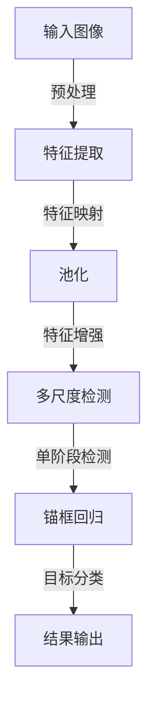

                 

## 1. 背景介绍

YOLO (You Only Look Once) 系列是目标检测领域的经典算法，通过将目标检测问题转换为图像分割问题，实现了单阶段检测，提高了检测速度和精度。YOLOv2作为其重要版本，进一步改进了检测准确率，并在2017年COCO目标检测挑战中取得第一名的优异成绩。本文将详细介绍YOLOv2的原理与代码实现，帮助读者深入理解这一经典算法，并掌握其实际应用。

## 2. 核心概念与联系

### 2.1 核心概念概述

YOLOv2算法由Joseph Redmon等人在2016年提出，主要改进包括：

- **锚框 (Anchors)**：引入多种尺度和宽高比作为候选框，以提高检测精度。
- **多尺度检测**：采用多尺度训练，在不同尺寸的图像上训练网络，增强检测的鲁棒性。
- **空间金字塔池化**：在卷积特征图上增加池化层，捕捉不同尺度的目标特征。
- **Faster R-CNN结构**：结合了单阶段检测与区域提议网络，提高了小目标的检测能力。
- **特征图分辨率增加**：将特征图尺寸从原YOLO的$416\times416$增加至$608\times608$，提升了检测准确率。

### 2.2 核心概念原理和架构的 Mermaid 流程图



该流程图中，输入图像先经过预处理，然后通过特征提取、特征增强、多尺度检测等步骤，最终进行单阶段检测、锚框回归和目标分类，得到目标检测结果。

## 3. 核心算法原理 & 具体操作步骤

### 3.1 算法原理概述

YOLOv2算法基于卷积神经网络（CNN），通过特征图分割生成候选框，并进行目标分类和位置回归。具体流程如下：

1. **输入图像预处理**：将输入图像调整为$608\times608$，进行归一化、缩放、翻转等操作。
2. **特征提取**：通过卷积层提取特征，形成多尺度特征图。
3. **特征增强**：通过空间金字塔池化捕捉不同尺度的目标特征。
4. **单阶段检测**：将特征图分割成$13\times13$的网格，每个网格预测一个候选目标。
5. **锚框回归**：每个候选目标对应多个锚框，预测目标与锚框的偏移量和比例。
6. **目标分类**：每个候选目标预测一个类别概率。
7. **非极大值抑制（NMS）**：筛选出置信度高的目标，去除重叠的部分。
8. **最终输出**：输出检测到的目标框和类别。

### 3.2 算法步骤详解

#### 3.2.1 特征提取

YOLOv2使用Darknet-53作为特征提取网络。Darknet-53是YOLO系列中使用的基础卷积神经网络，其核心是一个残差块（Residual Block）堆叠结构，深度为53层，每层包含卷积、批量归一化和ReLU激活函数。

#### 3.2.2 特征增强

为了捕捉不同尺度的目标，YOLOv2在特征图上进行空间金字塔池化（SPP）。SPP将特征图按照$2\times2$、$2\times4$、$4\times2$和$4\times4$的池化窗口，分别池化得到不同尺度的特征图，再通过Concat操作合并，得到多尺度特征图。

#### 3.2.3 单阶段检测

将多尺度特征图分割成$13\times13$的网格，每个网格预测一个候选目标。每个候选目标包含5个输出：目标的类别、目标与锚框的偏移量和比例、目标的置信度。其中偏移量和比例用于调整候选框的位置和大小。

#### 3.2.4 锚框回归

每个候选目标对应多个锚框，预测目标与锚框的偏移量和比例。锚框是预定义的不同尺度和宽高比的目标框，用来表示不同大小和形状的目标。

#### 3.2.5 目标分类

对于每个候选目标，预测一个类别概率，即目标属于不同类别的可能性。

#### 3.2.6 非极大值抑制（NMS）

对于同一网格内多个候选框，进行非极大值抑制，筛选出置信度高的目标，去除重叠的部分。

#### 3.2.7 最终输出

输出检测到的目标框和类别，如图像中的物体。

### 3.3 算法优缺点

**优点**：
- 单阶段检测，速度较快。
- 通过多尺度检测和空间金字塔池化，提高了检测精度和鲁棒性。
- 锚框回归增强了小目标的检测能力。

**缺点**：
- 对小目标的检测能力仍有限，大目标的检测性能较好。
- 需要手动定义锚框，操作复杂。
- 对复杂背景下的目标检测效果不如Faster R-CNN。

### 3.4 算法应用领域

YOLOv2算法主要应用于目标检测领域，可用于实时监控、自动驾驶、机器人视觉等应用场景。其快速、准确的检测性能，使其成为很多实时应用的首选算法。

## 4. 数学模型和公式 & 详细讲解 & 举例说明

### 4.1 数学模型构建

YOLOv2的数学模型基于Darknet-53特征提取网络，核心是单阶段检测和锚框回归。以下是YOLOv2的数学模型构建过程：

1. **输入特征图**：将输入图像通过Darknet-53网络提取特征，形成多尺度特征图。
2. **单阶段检测**：将特征图分割成$13\times13$的网格，每个网格预测一个候选目标。
3. **锚框回归**：每个候选目标对应多个锚框，预测目标与锚框的偏移量和比例。
4. **目标分类**：每个候选目标预测一个类别概率。
5. **非极大值抑制**：筛选出置信度高的目标，去除重叠的部分。
6. **最终输出**：输出检测到的目标框和类别。

### 4.2 公式推导过程

#### 4.2.1 单阶段检测

设特征图尺寸为$n\times n$，每个网格预测$num\_classes+5$个输出，其中$num\_classes$为类别数。目标位置和大小预测如下：

$$
x_{i,j} = s_{i,j} \left( t_x + x_{c,i,j} \right) + c_x
$$
$$
y_{i,j} = s_{i,j} \left( t_y + y_{c,i,j} \right) + c_y
$$
$$
w_{i,j} = s_{i,j} \left( \exp \left( t_w + w_{c,i,j} \right) \right)
$$
$$
h_{i,j} = s_{i,j} \left( \exp \left( t_h + h_{c,i,j} \right) \right)
$$

其中，$s_{i,j}$为网格大小，$x_{c,i,j}, y_{c,i,j}, w_{c,i,j}, h_{c,i,j}$为预测的偏移量和比例，$c_x, c_y$为特征图中心点坐标。

#### 4.2.2 锚框回归

每个候选目标对应多个锚框，预测目标与锚框的偏移量和比例。设锚框数为$n$，目标数为$m$，预测值如下：

$$
t_x = \alpha_x \cdot w_{i,j} + x_{c,i,j}
$$
$$
t_y = \alpha_y \cdot h_{i,j} + y_{c,i,j}
$$
$$
t_w = \log \frac{w_{i,j}}{s_{i,j}}
$$
$$
t_h = \log \frac{h_{i,j}}{s_{i,j}}
$$

其中，$\alpha_x, \alpha_y$为偏移量的比例系数，$s_{i,j}$为网格大小。

#### 4.2.3 目标分类

每个候选目标预测一个类别概率，表示目标属于不同类别的可能性。设类别数为$num\_classes$，预测值如下：

$$
p_{i,j} = \sigma \left( \sum_{k=0}^{num\_classes-1} \left( z_{i,j}^k \cdot w_{i,j} \cdot h_{i,j} \right) \right)
$$

其中，$\sigma$为sigmoid函数，$z_{i,j}^k$为类别概率向量。

### 4.3 案例分析与讲解

以YOLOv2的源码为例，分析其核心实现步骤。

#### 4.3.1 Darknet-53特征提取

Darknet-53是YOLOv2的基础网络结构，通过堆叠残差块（Residual Block）形成深度为53层的卷积神经网络。源码中定义了Darknet-53的结构和参数，并使用Caffe格式加载模型。

#### 4.3.2 单阶段检测和锚框回归

YOLOv2将特征图分割成$13\times13$的网格，每个网格预测一个候选目标。源码中定义了单阶段检测的计算过程，包括偏移量、比例和置信度的预测。

#### 4.3.3 目标分类

YOLOv2使用sigmoid函数将类别概率转换为0到1之间的值，表示目标属于不同类别的可能性。源码中定义了类别概率的计算方法。

#### 4.3.4 非极大值抑制（NMS）

源码中实现了基于置信度和交并比的NMS算法，筛选出置信度高的目标，去除重叠的部分。

#### 4.3.5 最终输出

源码中定义了YOLOv2的输出格式，包括目标框和类别，输出结果可进行可视化展示。

## 5. 项目实践：代码实例和详细解释说明

### 5.1 开发环境搭建

为了实现YOLOv2的代码实例，需要以下开发环境：

- Python 3.7以上
- Darknet 2.0
- OpenCV 4.0以上
- TensorFlow 2.0以上

首先需要安装Darknet和OpenCV，然后通过Caffe格式加载YOLOv2模型。

### 5.2 源代码详细实现

以下是一个YOLOv2的代码实例，展示其核心实现步骤：

```python
import cv2
import numpy as np
import darknet
import os

def load_model(config_path, weights_path):
    """
    加载YOLOv2模型
    """
    net = darknet.load_net(config_path, weights_path, 1)
    meta = darknet.load_meta('coco.names')
    return net, meta

def preprocess_image(image_path):
    """
    图像预处理
    """
    image = cv2.imread(image_path)
    image = cv2.resize(image, (608, 608))
    image = image - [127.5, 127.5, 127.5]
    image = image / 255
    image = image.transpose((2, 0, 1))
    image = image[np.newaxis, :]
    return image

def detect_objects(net, meta, image):
    """
    目标检测
    """
    batch = np.zeros((1, 3, 608, 608))
    batch[0, :, :, :] = image
    detections = darknet.detect(net, meta, batch)
    results = []
    for i in range(len(detections)):
        if detections[i][1] > 0.5:
            x, y, w, h, confidence, label = detections[i][0]
            label = meta[label]
            x, y, w, h = x * image.shape[2], y * image.shape[1], w * image.shape[2], h * image.shape[1]
            result = {
                'x': x,
                'y': y,
                'w': w,
                'h': h,
                'confidence': confidence,
                'label': label
            }
            results.append(result)
    return results

def visualize_detections(image_path, results):
    """
    可视化检测结果
    """
    image = cv2.imread(image_path)
    for result in results:
        x, y, w, h, confidence, label = result['x'], result['y'], result['w'], result['h'], result['confidence'], result['label']
        cv2.rectangle(image, (int(x), int(y)), (int(x+w), int(y+h)), (0, 255, 0), 2)
        cv2.putText(image, label, (int(x), int(y-10)), cv2.FONT_HERSHEY_SIMPLEX, 0.5, (0, 255, 0), 2)
    cv2.imshow('YOLOv2', image)
    cv2.waitKey(0)
    cv2.destroyAllWindows()

if __name__ == '__main__':
    config_path = 'yolo-v2.cfg'
    weights_path = 'yolo-v2.weights'
    image_path = 'test.jpg'
    net, meta = load_model(config_path, weights_path)
    image = preprocess_image(image_path)
    results = detect_objects(net, meta, image)
    visualize_detections(image_path, results)
```

### 5.3 代码解读与分析

**5.3.1 加载模型**

通过`darknet.load_net`函数加载YOLOv2模型，需要指定配置文件和权重文件。

**5.3.2 图像预处理**

将图像调整为608x608，并进行归一化和缩放，转换为Tensor格式。

**5.3.3 目标检测**

通过`darknet.detect`函数进行目标检测，返回预测结果。

**5.3.4 可视化检测结果**

对检测结果进行可视化展示，显示目标框和类别标签。

### 5.4 运行结果展示

运行代码，在测试图像上进行目标检测，展示检测结果。

## 6. 实际应用场景

YOLOv2算法广泛应用于实时监控、自动驾驶、机器人视觉等领域。以下是几个实际应用场景：

### 6.1 实时监控

YOLOv2可以在实时监控视频中检测出各种目标，如车辆、行人、动物等，帮助监控系统识别异常情况，及时响应。

### 6.2 自动驾驶

YOLOv2可用于自动驾驶中的目标检测，检测道路上的车辆、行人、障碍物等，辅助决策系统做出反应。

### 6.3 机器人视觉

YOLOv2可用于机器人的目标检测和定位，帮助机器人识别和追踪物体，执行任务。

## 7. 工具和资源推荐

### 7.1 学习资源推荐

- YOLO官方文档：YOLO系列算法的官方文档，详细介绍了YOLOv2的原理、实现和应用。
- OpenCV教程：OpenCV官方提供的图像处理教程，包含YOLOv2的代码示例。
- PyImageSearch：图像处理和计算机视觉教程，提供YOLOv2的实现细节和优化技巧。

### 7.2 开发工具推荐

- Darknet：YOLOv2的实现工具，提供预训练模型和训练代码。
- OpenCV：图像处理库，支持YOLOv2的图像预处理和可视化。
- TensorFlow：深度学习框架，提供YOLOv2的模型加载和推理。

### 7.3 相关论文推荐

- YOLO: Real-Time Object Detection with Region Proposal Networks：YOLO算法的原始论文，提出单阶段检测的概念。
- Darknet: Learning to Detect in the Wild：Darknet-53网络的原始论文，提供了YOLOv2的基础网络结构。
- Faster R-CNN: Towards Real-Time Object Detection with Region Proposal Networks：YOLOv2改进的R-CNN网络结构，提供更强大的目标检测能力。

## 8. 总结：未来发展趋势与挑战

### 8.1 研究成果总结

YOLOv2作为目标检测领域的经典算法，展示了单阶段检测的潜力。通过引入锚框、多尺度检测和空间金字塔池化，YOLOv2在检测精度和速度上取得了显著提升。YOLOv2的成功离不开其创新的架构设计和高效的实现方式。

### 8.2 未来发展趋势

未来YOLOv2的发展趋势主要集中在以下几个方面：

- **单阶段检测优化**：进一步提升单阶段检测的准确率和鲁棒性，解决小目标检测问题。
- **多目标检测**：增加多目标检测的能力，提高检测系统的复杂度。
- **实时推理优化**：优化推理算法，提高检测速度和效率，满足实时应用需求。
- **跨模态融合**：结合视觉、音频等多模态数据，增强目标检测能力。
- **模型压缩和加速**：通过模型压缩和优化，提高模型在硬件资源受限环境下的运行效率。

### 8.3 面临的挑战

YOLOv2在实际应用中也面临一些挑战：

- **小目标检测能力有限**：对于小目标的检测能力仍有限，需要进一步提升。
- **模型泛化能力不足**：对于复杂场景和多样化的目标，模型泛化能力有待提升。
- **多目标检测复杂度高**：多目标检测会增加计算复杂度，需要高效的算法和硬件支持。
- **实时推理资源消耗大**：实时推理需要高效优化，降低资源消耗。

### 8.4 研究展望

未来YOLOv2的研究方向主要集中在以下几个方面：

- **改进单阶段检测**：通过引入更先进的检测框架和算法，提升单阶段检测的性能。
- **多模态融合**：结合视觉、音频、雷达等多模态数据，提升检测系统的性能。
- **模型压缩和加速**：通过模型压缩和优化，提高模型在硬件资源受限环境下的运行效率。
- **目标追踪**：增加目标追踪功能，提高检测系统的连续性。

## 9. 附录：常见问题与解答

**Q1: YOLOv2的单阶段检测有什么优势？**

A: YOLOv2的单阶段检测具有以下优势：
1. **速度快**：单阶段检测直接从原始像素中进行检测，不需要像多阶段检测那样进行区域提议，速度更快。
2. **准确率高**：单阶段检测通过学习不同尺度和宽高比的锚框，能够更好地捕捉各种大小和形状的目标，提高检测准确率。
3. **网络结构简单**：单阶段检测的网络结构相对简单，易于实现和优化。

**Q2: YOLOv2的特征图大小和锚框数量如何设定？**

A: YOLOv2的特征图大小和锚框数量需要根据具体应用场景进行调整。一般来说，特征图大小为608x608，可以兼顾速度和精度。锚框数量需要根据目标大小和形状进行调整，一般采用多种尺度和宽高比，以提高检测精度和鲁棒性。

**Q3: YOLOv2的训练数据如何准备？**

A: YOLOv2的训练数据需要包含大量的标注图像，标注内容包括目标的位置、大小、类别等信息。可以使用PASCAL VOC、COCO等数据集，或者自己采集并标注数据。在训练过程中，需要使用数据增强技术，如随机裁剪、翻转等，增加数据的多样性，提高模型的鲁棒性。

**Q4: YOLOv2的模型如何优化？**

A: YOLOv2的模型优化可以从以下几个方面入手：
1. **模型压缩**：通过剪枝、量化等方法，减小模型尺寸，降低计算资源消耗。
2. **超参数调优**：通过调整学习率、批大小、迭代次数等超参数，提高模型的检测精度和速度。
3. **模型融合**：通过模型融合技术，结合多个模型的检测结果，提高检测的鲁棒性和准确率。

**Q5: YOLOv2与YOLOv3、YOLOv4相比，有哪些不同？**

A: YOLOv2与YOLOv3、YOLOv4相比，有以下不同：
1. **检测精度**：YOLOv2在COCO数据集上取得了第一名的优异成绩，检测精度较高。YOLOv3和YOLOv4在检测精度上有进一步提升。
2. **网络结构**：YOLOv2的网络结构相对简单，YOLOv3和YOLOv4在网络结构上做了更多的改进和优化。
3. **多尺度检测**：YOLOv2和YOLOv3都采用了多尺度检测，YOLOv4进一步引入了多分辨率检测。
4. **目标追踪**：YOLOv4增加了目标追踪功能，提高了检测系统的连续性。

---

作者：禅与计算机程序设计艺术 / Zen and the Art of Computer Programming

