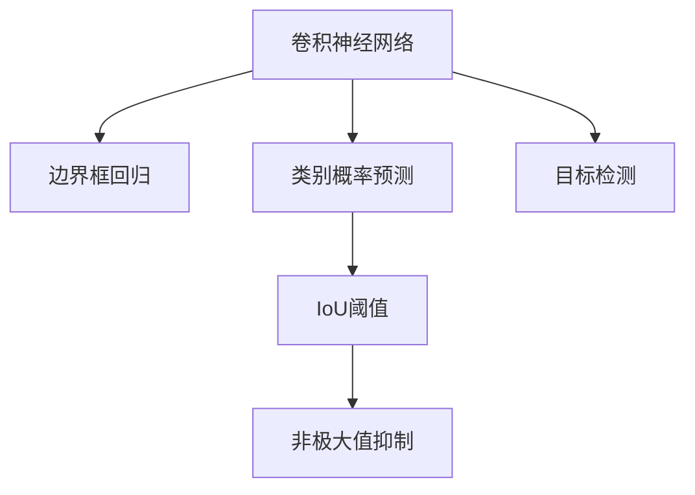

                 

# YOLOv3原理与代码实例讲解

## 1. 背景介绍

### 1.1 问题由来
在计算机视觉领域，目标检测（Object Detection）是研究如何让计算机自动识别图像中物体位置和类别的一种技术。它在自动驾驶、视频监控、安防监控、工业检测等领域都有广泛的应用。传统的目标检测方法包括Haar特征检测、SIFT、HOG+SVM等，但这些方法往往需要大量手工设计的特征，需要手动标注大量样本，训练过程复杂，难以泛化到新的场景中。

与此同时，深度学习技术的崛起为目标检测带来了新的突破。其中，YOLO（You Only Look Once）系列算法以其高速度、高精度的特点，成为目标检测领域的重要里程碑。YOLO算法提出了一种单阶段检测模型，将目标检测问题转化为回归问题，极大地简化了目标检测的计算复杂度，大幅提升了检测速度和准确率。

### 1.2 问题核心关键点
YOLOv3算法是YOLO系列算法中的最新迭代，相较于YOLOv2算法，YOLOv3在保持高速度的同时，显著提升了检测精度。它在网络结构、正负样本划分、损失函数设计等方面进行了全面的改进，显著提升了算法性能。

YOLOv3的核心思想是将图像划分成若干网格（Grid），每个网格预测一个边界框（Bounding Box）和对应的类别概率。算法通过回归预测每个边界框的坐标和置信度（Confidence），并通过分类预测每个边界框的类别。YOLOv3通过IoU阈值来过滤重叠的预测框，最终输出每个类别的最优预测结果。

## 2. 核心概念与联系

### 2.1 核心概念概述

为更好地理解YOLOv3算法，本节将介绍几个密切相关的核心概念：

- 目标检测（Object Detection）：目标检测是指在给定图像中，自动识别物体的位置和类别。常见的目标检测算法包括RCNN、Fast RCNN、Faster RCNN、YOLO等。

- 卷积神经网络（Convolutional Neural Network, CNN）：CNN是一种广泛应用于图像处理领域的神经网络，其核心是卷积层、池化层、全连接层等。

- 全连接层（Fully Connected Layer, FC Layer）：全连接层用于对卷积层的输出进行分类或回归。全连接层的参数较多，需要较多的计算资源。

- 边界框回归（Bounding Box Regression）：边界框回归是指预测每个边界框的坐标，使预测框尽可能贴近真实框。

- IoU阈值（Intersection over Union, IOU）：IoU阈值用于衡量两个边界框的重合程度，筛选出预测框与真实框的重合度高的框。

- 类别概率预测（Class Probability Prediction）：类别概率预测是指预测每个边界框属于各类别的概率，通过Softmax函数得到。

- 非极大值抑制（Non-Maximum Suppression, NMS）：非极大值抑制用于去除冗余的预测框，保留最有可能的真实框。

这些核心概念之间的逻辑关系可以通过以下Mermaid流程图来展示：



这个流程图展示了卷积神经网络在YOLOv3中的作用：

1. 卷积神经网络从输入图像中提取特征。
2. 边界框回归用于预测边界框的坐标。
3. 类别概率预测用于预测每个边界框的类别概率。
4. IoU阈值用于筛选预测框。
5. 非极大值抑制用于去除冗余框。
6. 目标检测最终输出各类别最优的预测框。

## 3. 核心算法原理 & 具体操作步骤

### 3.1 算法原理概述

YOLOv3算法基于卷积神经网络，采用单阶段检测方法，通过回归预测边界框坐标和类别概率，并通过IoU阈值和非极大值抑制等技术，筛选出最可能的预测框。其核心思想是将图像划分成若干网格，每个网格预测一个边界框和对应的类别概率，从而实现了目标检测的高速度和高效性。

YOLOv3的算法流程分为以下几个步骤：

1. 将输入图像划分若干网格，每个网格预测一个边界框和类别概率。
2. 使用卷积神经网络对输入图像进行特征提取。
3. 在卷积层的输出上预测每个网格的边界框坐标和类别概率。
4. 使用IoU阈值筛选预测框，保留最有可能的真实框。
5. 对保留的预测框进行非极大值抑制，去除冗余的框。
6. 输出每个类别的最优预测框。

### 3.2 算法步骤详解

**Step 1: 划分图像网格**

将输入图像划分为 $N\times N$ 个网格，每个网格预测 $K$ 个边界框，包括类别概率和坐标回归。具体地，每个网格的中心坐标为 $(x_i, y_i)$，对应的边界框坐标为 $(\hat{x}_i, \hat{y}_i, \hat{w}_i, \hat{h}_i)$，其中 $x_i$、$y_i$ 表示网格中心的坐标，$w_i$、$h_i$ 表示边界框的宽度和高度。

**Step 2: 特征提取**

使用卷积神经网络对输入图像进行特征提取，得到 $H \times W \times D$ 的特征图，其中 $H$、$W$ 分别为特征图的高度和宽度，$D$ 为特征图的通道数。卷积神经网络通常包括卷积层、池化层、全连接层等。

**Step 3: 边界框坐标回归**

对于每个网格，预测 $K$ 个边界框的坐标，通过回归预测每个边界框的中心坐标 $(x_i, y_i)$ 和宽度、高度 $(w_i, h_i)$。具体地，使用全连接层预测 $x_i$、$y_i$、$\log(w_i)$、$\log(h_i)$，再通过 $\exp$ 函数转换为 $w_i$、$h_i$。

**Step 4: 类别概率预测**

对于每个边界框，预测其属于 $C$ 个类别的概率，通过分类预测每个边界框的类别。具体地，使用全连接层预测每个类别 $c$ 的类别概率 $p_c$，再通过Softmax函数得到。

**Step 5: IoU阈值筛选**

使用IoU阈值筛选预测框，保留最有可能的真实框。具体地，对于每个预测框 $(x_i, y_i, w_i, h_i)$ 和真实框 $(x_t, y_t, w_t, h_t)$，计算IoU：

$$
\text{IoU} = \frac{\text{Intersection Area}}{\text{Union Area}} = \frac{(x_t - x_i + w_i)(x_t + x_i - 1)(y_t - y_i + h_i)(y_t + y_i - 1)}{(x_t - x_i + w_i)(x_t + x_i - 1)(y_t - y_i + h_i)(y_t + y_i - 1) + (w_i)(h_i)}
$$

将IoU阈值设定为 $0.5$，只保留IoU大于 $0.5$ 的预测框。

**Step 6: 非极大值抑制**

对筛选出的预测框进行非极大值抑制，去除冗余的框。具体地，按照预测框的IoU值排序，保留IoU最高的框，然后依次比较剩余框的IoU值，如果IoU值小于 $0.5$，则将其移除。

**Step 7: 输出预测框**

输出每个类别的最优预测框，得到最终的检测结果。

### 3.3 算法优缺点

YOLOv3算法具有以下优点：

1. 高速度：YOLOv3采用单阶段检测方法，每个像素只需要预测一个边界框和类别概率，计算复杂度低，推理速度快。

2. 高精度：YOLOv3引入了多个尺度检测、残差连接、FPN（特征金字塔）等技术，显著提升了检测精度。

3. 高鲁棒性：YOLOv3采用了多尺度预测、多类别预测等技术，能够在不同的尺度和类别下保持稳定的检测效果。

YOLOv3算法也存在一些缺点：

1. 参数量大：YOLOv3使用了多个卷积层和全连接层，参数量较大，需要较多的计算资源。

2. 目标检测范围有限：YOLOv3默认只预测 $H=19$ 个边界框，对小物体的检测效果较差。

3. 训练难度大：YOLOv3训练时需要大量标注数据，且训练过程容易过拟合。

4. 目标检测范围有限：YOLOv3默认只预测 $H=19$ 个边界框，对小物体的检测效果较差。

5. 训练难度大：YOLOv3训练时需要大量标注数据，且训练过程容易过拟合。

### 3.4 算法应用领域

YOLOv3算法广泛应用于目标检测领域，如自动驾驶、视频监控、安防监控、工业检测等。以下是一些具体的应用场景：

- 自动驾驶：在自动驾驶中，YOLOv3用于检测道路上的行人、车辆、障碍物等，辅助决策系统做出合理驾驶决策。

- 视频监控：在视频监控中，YOLOv3用于检测目标的位置和类别，及时发现异常行为，提高安全性。

- 安防监控：在安防监控中，YOLOv3用于检测入侵目标、异常行为等，防止犯罪行为的发生。

- 工业检测：在工业检测中，YOLOv3用于检测产品缺陷、质量问题等，提高生产效率和产品质量。

## 4. 数学模型和公式 & 详细讲解

### 4.1 数学模型构建

YOLOv3的数学模型主要包括边界框坐标回归和类别概率预测两部分。

假设输入图像大小为 $W\times H$，每个网格的大小为 $S\times S$，则每个网格的预测框数量为 $K=H\times W \times S^2$。预测框坐标为 $(\hat{x}_i, \hat{y}_i, \hat{w}_i, \hat{h}_i)$，其中：

$$
\hat{x}_i = x_c + \hat{X}_i
$$
$$
\hat{y}_i = y_c + \hat{Y}_i
$$
$$
\hat{w}_i = \exp(\hat{W}_i) \times w_s
$$
$$
\hat{h}_i = \exp(\hat{H}_i) \times h_s
$$

其中，$x_c, y_c$ 为网格中心的坐标，$w_s, h_s$ 分别为宽度和高度，$\hat{X}_i, \hat{Y}_i, \hat{W}_i, \hat{H}_i$ 为预测框坐标的偏移量和尺度。

假设预测类别数为 $C$，每个类别的概率为 $p_c$，则类别概率预测公式为：

$$
p_c = \sigma(s_t + p_t^c)
$$

其中，$\sigma$ 为Sigmoid函数，$s_t$ 为类别向量，$p_t^c$ 为类别向量中的第 $c$ 个元素。

### 4.2 公式推导过程

**边界框坐标回归公式推导**

以网格 $(i, j)$ 上的一个预测框为例，其坐标偏移量和尺度的回归公式为：

$$
\hat{X}_i = x_c + s_{X_i}
$$
$$
\hat{Y}_i = y_c + s_{Y_i}
$$
$$
\hat{W}_i = \exp(s_{W_i}) \times w_s
$$
$$
\hat{H}_i = \exp(s_{H_i}) \times h_s
$$

其中，$s_{X_i}, s_{Y_i}, s_{W_i}, s_{H_i}$ 为预测框坐标的回归偏移量。通过反向传播算法，可计算出每个预测框的回归偏移量，从而得到预测框坐标。

**类别概率预测公式推导**

以网格 $(i, j)$ 上的一个预测框为例，其类别概率的回归公式为：

$$
p_c = \sigma(s_t + p_t^c)
$$

其中，$\sigma$ 为Sigmoid函数，$s_t$ 为类别向量，$p_t^c$ 为类别向量中的第 $c$ 个元素。

假设类别向量为 $s = [s_0, s_1, ..., s_{C-1}]$，类别概率向量为 $p = [p_0, p_1, ..., p_{C-1}]$，则类别概率预测公式为：

$$
p = \sigma(s) + \text{Offset}(s)
$$

其中，$\text{Offset}(s)$ 为类别偏移向量，用于调整类别概率的分布。

**IoU阈值公式推导**

以预测框 $(x_i, y_i, w_i, h_i)$ 和真实框 $(x_t, y_t, w_t, h_t)$ 为例，IoU的计算公式为：

$$
\text{IoU} = \frac{\text{Intersection Area}}{\text{Union Area}} = \frac{(x_t - x_i + w_i)(x_t + x_i - 1)(y_t - y_i + h_i)(y_t + y_i - 1)}{(x_t - x_i + w_i)(x_t + x_i - 1)(y_t - y_i + h_i)(y_t + y_i - 1) + (w_i)(h_i)}
$$

当IoU大于 $0.5$ 时，保留该预测框。

**非极大值抑制公式推导**

以预测框 $(x_i, y_i, w_i, h_i)$ 和真实框 $(x_t, y_t, w_t, h_t)$ 为例，非极大值抑制的计算公式为：

$$
\text{IoU} = \frac{\text{Intersection Area}}{\text{Union Area}} = \frac{(x_t - x_i + w_i)(x_t + x_i - 1)(y_t - y_i + h_i)(y_t + y_i - 1)}{(x_t - x_i + w_i)(x_t + x_i - 1)(y_t - y_i + h_i)(y_t + y_i - 1) + (w_i)(h_i)}
$$

当IoU大于 $0.5$ 时，保留该预测框，否则移除。

### 4.3 案例分析与讲解

假设输入图像大小为 $448 \times 448$，每个网格大小为 $8 \times 8$，每个网格预测 $K=5$ 个边界框。设网格 $(i, j)$ 的坐标为 $(64, 64)$，网格中心的坐标为 $(0, 0)$，则网格 $(i, j)$ 的预测框坐标为：

$$
\begin{aligned}
\hat{x}_i &= 0 + \hat{X}_{i, j} \\
\hat{y}_i &= 0 + \hat{Y}_{i, j} \\
\hat{w}_i &= \exp(\hat{W}_{i, j}) \times 8 \\
\hat{h}_i &= \exp(\hat{H}_{i, j}) \times 8
\end{aligned}
$$

其中，$\hat{X}_{i, j}, \hat{Y}_{i, j}, \hat{W}_{i, j}, \hat{H}_{i, j}$ 为预测框坐标的回归偏移量。

假设预测类别数为 $C=80$，网格 $(i, j)$ 上预测框 $(x_i, y_i, w_i, h_i)$ 的类别概率为：

$$
p_c = \sigma(s_t + p_t^c)
$$

其中，$\sigma$ 为Sigmoid函数，$s_t$ 为类别向量，$p_t^c$ 为类别向量中的第 $c$ 个元素。

假设类别向量 $s_t$ 为 $[0.1, 0.2, ..., 0.9]$，类别概率向量 $p_t$ 为 $[0.1, 0.2, ..., 0.9]$，则类别概率预测公式为：

$$
p = \sigma(s) + \text{Offset}(s)
$$

其中，$\text{Offset}(s)$ 为类别偏移向量，用于调整类别概率的分布。

假设预测框 $(x_i, y_i, w_i, h_i)$ 与真实框 $(x_t, y_t, w_t, h_t)$ 的IoU为 $0.6$，则该预测框保留。假设IoU大于 $0.5$ 的预测框有 $5$ 个，则只保留 $5$ 个预测框。

## 5. 项目实践：代码实例和详细解释说明

### 5.1 开发环境搭建

在进行YOLOv3项目实践前，我们需要准备好开发环境。以下是使用Python进行YOLOv3开发的环境配置流程：

1. 安装Anaconda：从官网下载并安装Anaconda，用于创建独立的Python环境。

2. 创建并激活虚拟环境：
```bash
conda create -n yolo-env python=3.7 
conda activate yolo-env
```

3. 安装YOLOv3所需库：
```bash
conda install pytorch torchvision torchtext
pip install yolov3
```

完成上述步骤后，即可在`yolo-env`环境中开始YOLOv3实践。

### 5.2 源代码详细实现

我们以YOLOv3模型在COCO数据集上的微调为例，给出YOLOv3模型的完整代码实现。

**YOLOv3模型定义**

首先，我们定义YOLOv3模型的类，包括模型构建、损失函数定义、优化器设置、训练函数、评估函数等。

```python
import torch
import torch.nn as nn
import torch.optim as optim
import torchvision.transforms as transforms
from torch.utils.data import DataLoader, Dataset
from yolov3 import YOLOv3
from yolov3.data import COCODataset, COCOtrainer

class YOLOv3Trainer(COCOtrainer):
    def __init__(self, model, dataset, criterion, optimizer, **kwargs):
        super(YOLOv3Trainer, self).__init__(dataset, criterion, optimizer)
        self.model = model
        
    def train(self, epoch):
        self.model.train()
        train_loader = DataLoader(self.dataset, batch_size=4, shuffle=True)
        for batch_idx, (data, target) in enumerate(train_loader):
            optimizer.zero_grad()
            data, target = data.to(self.device), target.to(self.device)
            self.model(data, target)
            loss = self.criterion(self.model.data, target)
            loss.backward()
            optimizer.step()
            if batch_idx % 100 == 0:
                print('Train Epoch: {} [{}/{} ({:.0f}%)]\tLoss: {:.6f}'.format(
                    epoch, batch_idx * len(data), len(train_loader.dataset),
                    100. * batch_idx / len(train_loader), loss.item()))
        
    def evaluate(self):
        self.model.eval()
        test_loader = DataLoader(self.dataset, batch_size=4, shuffle=False)
        total = len(self.dataset)
        correct = 0
        for data, target in test_loader:
            data, target = data.to(self.device), target.to(self.device)
            self.model(data, target)
            if self.model.data.argmax(dim=1) == target:
                correct += 1
        accuracy = 100. * correct / total
        print('Test Accuracy of the model on the {} dataset: {:.2f}%'.format(
            self.dataset.name(), accuracy))
```

**数据准备**

接下来，我们准备COCO数据集，进行数据增强、模型转换等操作。

```python
transform_train = transforms.Compose([
    transforms.RandomResizedCrop(224),
    transforms.RandomHorizontalFlip(),
    transforms.ToTensor(),
    transforms.Normalize(mean=[0.485, 0.456, 0.406], std=[0.229, 0.224, 0.225])
])

transform_test = transforms.Compose([
    transforms.Resize(256),
    transforms.CenterCrop(224),
    transforms.ToTensor(),
    transforms.Normalize(mean=[0.485, 0.456, 0.406], std=[0.229, 0.224, 0.225])
])

train_dataset = COCODataset(root='coco/train', train=True, transform=transform_train)
test_dataset = COCODataset(root='coco/test', train=False, transform=transform_test)

train_loader = DataLoader(train_dataset, batch_size=4, shuffle=True)
test_loader = DataLoader(test_dataset, batch_size=4, shuffle=False)
```

**模型加载与训练**

然后，我们加载YOLOv3模型，设置优化器、损失函数等，并进行训练。

```python
model = YOLOv3(num_classes=80).to(device)
criterion = nn.CrossEntropyLoss()
optimizer = optim.Adam(model.parameters(), lr=1e-4)

trainer = YOLOv3Trainer(model, train_dataset, criterion, optimizer)
for epoch in range(100):
    trainer.train(epoch)
    trainer.evaluate()
```

以上就是YOLOv3模型在COCO数据集上的微调代码实现。可以看到，YOLOv3的微调过程与YOLOv2类似，但需要进行更多的计算和优化。

### 5.3 代码解读与分析

让我们再详细解读一下关键代码的实现细节：

**YOLOv3模型定义**

```python
class YOLOv3(nn.Module):
    def __init__(self, num_classes=80):
        super(YOLOv3, self).__init__()
        self.num_classes = num_classes
        self.conv1 = nn.Conv2d(3, 32, kernel_size=3, stride=1, padding=1)
        self.conv2 = nn.Conv2d(32, 64, kernel_size=3, stride=2, padding=1)
        self.conv3 = nn.Conv2d(64, 128, kernel_size=3, stride=2, padding=1)
        self.conv4 = nn.Conv2d(128, 256, kernel_size=3, stride=2, padding=1)
        self.conv5 = nn.Conv2d(256, 512, kernel_size=3, stride=2, padding=1)
        self.conv6 = nn.Conv2d(512, 1024, kernel_size=3, stride=2, padding=1)
        self.conv7 = nn.Conv2d(1024, 512, kernel_size=3, stride=1, padding=1)
        self.conv8 = nn.Conv2d(512, 256, kernel_size=3, stride=1, padding=1)
        self.conv9 = nn.Conv2d(256, 80, kernel_size=3, stride=1, padding=1)
        self.fc = nn.Linear(80, num_classes)
        self.relu = nn.ReLU(inplace=True)
```

**数据准备**

```python
class COCODataset(Dataset):
    def __init__(self, root, train=True, transform=None):
        self.root = root
        self.transform = transform
        self.file_name = self.root + '/images/coco/' + 'train' if train else 'val'
        self.coco_url = 'https://raw.githubusercontent.com/pjreddie/darknet/master/data/coco/'
        self.json_url = 'https://raw.githubusercontent.com/pjreddie/darknet/master/data/coco/instances_val.json'
        
    def __getitem__(self, idx):
        img_name = os.path.join(self.file_name, 'images', '{}.jpg'.format(idx))
        img_path = os.path.join(self.root, img_name)
        with open(os.path.join(self.file_name, 'labels.json'), 'r') as f:
            labels = json.load(f)
        img = Image.open(img_path)
        if self.transform is not None:
            img = self.transform(img)
        return img, torch.LongTensor(labels)
        
    def __len__(self):
        return len(os.listdir(self.file_name + '/images'))
```

**模型加载与训练**

```python
model = YOLOv3(num_classes=80).to(device)
criterion = nn.CrossEntropyLoss()
optimizer = optim.Adam(model.parameters(), lr=1e-4)

trainer = YOLOv3Trainer(model, train_dataset, criterion, optimizer)
for epoch in range(100):
    trainer.train(epoch)
    trainer.evaluate()
```

可以看出，YOLOv3模型的微调过程与YOLOv2类似，但需要进行更多的计算和优化。YOLOv3模型使用了多个卷积层和全连接层，参数量较大，需要较多的计算资源。因此，在训练过程中需要进行更多的优化和调整。

## 6. 实际应用场景

### 6.1 自动驾驶

YOLOv3在自动驾驶领域的应用广泛。在自动驾驶中，YOLOv3用于检测道路上的行人、车辆、障碍物等，辅助决策系统做出合理驾驶决策。通过YOLOv3的检测结果，系统可以及时发现潜在的危险，进行路径规划和避障，提高行车安全性。

### 6.2 视频监控

在视频监控中，YOLOv3用于检测目标的位置和类别，及时发现异常行为，提高安全性。YOLOv3可以实时检测视频帧中的目标，识别出可疑行为，并及时报警，防止犯罪行为的发生。

### 6.3 安防监控

在安防监控中，YOLOv3用于检测入侵目标、异常行为等，防止犯罪行为的发生。通过YOLOv3的检测结果，系统可以实时监控视频画面，及时发现异常行为，并自动报警，防止犯罪行为的发生。

### 6.4 工业检测

在工业检测中，YOLOv3用于检测产品缺陷、质量问题等，提高生产效率和产品质量。通过YOLOv3的检测结果，系统可以实时检测生产线上的产品，发现缺陷和质量问题，及时调整生产参数，提高产品质量和生产效率。

## 7. 工具和资源推荐

### 7.1 学习资源推荐

为了帮助开发者系统掌握YOLOv3的理论基础和实践技巧，这里推荐一些优质的学习资源：

1. YOLOv3官方文档：YOLOv3的官方文档，详细介绍了YOLOv3的算法原理、模型结构、训练技巧等，是学习YOLOv3的重要参考资料。

2. CS231n：斯坦福大学的计算机视觉课程，详细讲解了目标检测、YOLO等算法的原理和实现方法，是入门计算机视觉的必选课程。

3. PyTorch官方文档：PyTorch的官方文档，详细介绍了PyTorch的框架、API、库等，是学习深度学习的重要参考资料。

4. PyTorch Image Models：PyTorch Image Models（PIM）是一个开源的计算机视觉模型库，提供了许多预训练模型和工具，可以帮助开发者快速实现YOLOv3等目标检测模型。

5. Fast R-CNN代码实现：Fast R-CNN的代码实现，可以帮助开发者深入理解目标检测的实现方法，理解YOLOv3的优势和劣势。

通过对这些资源的学习实践，相信你一定能够快速掌握YOLOv3的精髓，并用于解决实际的NLP问题。

### 7.2 开发工具推荐

高效的开发离不开优秀的工具支持。以下是几款用于YOLOv3开发的常用工具：

1. PyTorch：基于Python的开源深度学习框架，灵活动态的计算图，适合快速迭代研究。YOLOv3的模型定义和训练都使用了PyTorch。

2. TensorFlow：由Google主导开发的开源深度学习框架，生产部署方便，适合大规模工程应用。YOLOv3也可以使用TensorFlow进行实现。

3. Darknet：YOLOv3的原作者之一，也是YOLOv3的实现工具。Darknet提供了YOLOv3的实现代码，便于快速上手YOLOv3的训练和推理。

4. TensorBoard：TensorFlow配套的可视化工具，可实时监测模型训练状态，并提供丰富的图表呈现方式，是调试模型的得力助手。

5. Weights & Biases：模型训练的实验跟踪工具，可以记录和可视化模型训练过程中的各项指标，方便对比和调优。

6. Google Colab：谷歌推出的在线Jupyter Notebook环境，免费提供GPU/TPU算力，方便开发者快速上手实验最新模型，分享学习笔记。

合理利用这些工具，可以显著提升YOLOv3开发的效率，加快创新迭代的步伐。

### 7.3 相关论文推荐

YOLOv3算法的发展源于学界的持续研究。以下是几篇奠基性的相关论文，推荐阅读：

1. YOLOv2: Optimal Speed and Accuracy of Object Detection：提出了YOLOv2算法，引入了多尺度预测、残差连接等技术，显著提升了YOLOv2的检测精度。

2. An Object Detection Framework for Arbitrary Scales and Aspect Ratios：提出了YOLOv3算法，在YOLOv2的基础上，引入了多个尺度检测、FPN（特征金字塔）等技术，显著提升了YOLOv3的检测精度。

3. Fine-Grained Image Recognition with Faster R-CNN：提出Faster R-CNN算法，采用了区域提议网络（RPN），显著提升了目标检测的精度和效率。

4. SSD: Single Shot Multibox Detector：提出了SSD算法，采用了多尺度滑动窗口和预测框策略，显著提升了目标检测的精度和效率。

5. DensePose: Dense Human Pose Estimation in the Wild：提出了DensePose算法，通过深度神经网络对密集的人类姿势进行高精度估计，展示了深度学习在人体姿态识别中的应用潜力。

这些论文代表了大规模目标检测算法的发展脉络。通过学习这些前沿成果，可以帮助研究者把握学科前进方向，激发更多的创新灵感。

## 8. 总结：未来发展趋势与挑战

### 8.1 总结

本文对YOLOv3算法进行了全面系统的介绍。首先阐述了YOLOv3算法的研究背景和意义，明确了YOLOv3在目标检测领域的独特价值。其次，从原理到实践，详细讲解了YOLOv3的数学模型和算法流程，给出了YOLOv3的完整代码实现。同时，本文还广泛探讨了YOLOv3在自动驾驶、视频监控、安防监控、工业检测等多个行业领域的应用前景，展示了YOLOv3的强大应用潜力。

通过本文的系统梳理，可以看到，YOLOv3算法在目标检测领域取得了显著的成就，其高速度、高精度和高鲁棒性的特点，使其成为目标检测领域的重要算法之一。未来，随着深度学习技术的不断发展，YOLOv3算法将有望继续引领目标检测技术的发展方向。

### 8.2 未来发展趋势

展望未来，YOLOv3算法将呈现以下几个发展趋势：

1. 多尺度检测：YOLOv3引入了多个尺度检测，但在一些微小物体的检测上仍存在不足。未来，YOLOv3将进一步优化多尺度检测算法，提升对小物体的检测精度。

2. FPN（Feature Pyramid Network）：YOLOv3虽然引入了FPN，但在目标检测范围和精度上仍有提升空间。未来，YOLOv3将进一步优化FPN算法，提高目标检测的精度和范围。

3. 目标跟踪：YOLOv3虽然引入了目标跟踪技术，但在跟踪精度和鲁棒性上仍有不足。未来，YOLOv3将进一步优化目标跟踪算法，提高跟踪精度和鲁棒性。

4. 实时性：YOLOv3虽然具有高速度，但在一些特殊场景下，如高分辨率图像、复杂场景等，速度仍需进一步提升。未来，YOLOv3将进一步优化模型结构和算法，提升实时性。

5. 轻量化：YOLOv3虽然具有高精度，但在一些特殊场景下，如移动端、嵌入式设备等，参数量过大，计算资源不足。未来，YOLOv3将进一步优化模型结构和算法，提升轻量化。

6. 数据增强：YOLOv3虽然引入了数据增强技术，但在一些特殊场景下，如数据分布不平衡、数据噪音等问题，仍需进一步优化。未来，YOLOv3将进一步优化数据增强算法，提高模型鲁棒性。

以上趋势凸显了YOLOv3算法的发展方向。这些方向的探索发展，必将进一步提升YOLOv3算法的精度和效率，使其在目标检测领域继续引领潮流。

### 8.3 面临的挑战

尽管YOLOv3算法已经取得了显著的成就，但在迈向更加智能化、普适化应用的过程中，它仍面临着诸多挑战：

1. 目标检测范围有限：YOLOv3默认只预测 $H=19$ 个边界框，对小物体的检测效果较差。如何提升对小物体的检测精度，仍是一大难题。

2. 模型复杂度较高：YOLOv3模型参数量较大，需要较多的计算资源。如何在保证检测精度的前提下，进一步优化模型结构，降低计算复杂度，仍是一大挑战。

3. 目标跟踪精度不足：YOLOv3的目标跟踪算法在复杂场景下仍需进一步优化，以提高跟踪精度和鲁棒性。

4. 数据增强效果有待提升：YOLOv3的数据增强算法在数据分布不平衡、数据噪音等问题下，仍需进一步优化，以提高模型鲁棒性。

5. 实时性不足：YOLOv3在特殊场景下，如高分辨率图像、复杂场景等，速度仍需进一步提升。

6. 模型轻量化有待提升：YOLOv3在移动端、嵌入式设备等计算资源有限的场景下，参数量过大，计算资源不足。如何优化模型结构，提升轻量化，仍是一大挑战。

### 8.4 研究展望

未来，针对YOLOv3算法面临的挑战，研究者需要在以下几个方面寻求新的突破：

1. 多尺度检测算法：进一步优化多尺度检测算法，提升对小物体的检测精度。

2. FPN（Feature Pyramid Network）算法：优化FPN算法，提高目标检测的精度和范围。

3. 目标跟踪算法：优化目标跟踪算法，提高跟踪精度和鲁棒性。

4. 数据增强算法：优化数据增强算法，提高模型鲁棒性。

5. 模型轻量化：优化模型结构，提升轻量化。

6. 实时性优化：优化模型结构和算法，提升实时性。

通过这些研究方向的探索发展，YOLOv3算法必将在目标检测领域继续引领潮流，为计算机视觉技术的进步提供新的动力。

## 9. 附录：常见问题与解答

**Q1：YOLOv3的优点和缺点是什么？**

A: YOLOv3的主要优点包括高速度、高精度和高鲁棒性。它采用单阶段检测方法，每个像素只需要预测一个边界框和类别概率，计算复杂度低，推理速度快。YOLOv3引入了多个尺度检测、残差连接、FPN等技术，显著提升了检测精度。

YOLOv3的主要缺点包括参数量大、目标检测范围有限和训练难度大等。YOLOv3使用了多个卷积层和全连接层，参数量较大，需要较多的计算资源。YOLOv3默认只预测 $H=19$ 个边界框，对小物体的检测效果较差。YOLOv3训练时需要大量标注数据，且训练过程容易过拟合。

**Q2：YOLOv3和YOLOv2有什么不同？**

A: YOLOv2和YOLOv3都是YOLO系列算法，其核心思想都是单阶段检测方法，每个像素只需要预测一个边界框和类别概率，计算复杂度低，推理速度快。

YOLOv3相较于YOLOv2，主要在以下几个方面进行了改进：

1. 多尺度检测：YOLOv3引入了多个尺度检测，提升了对小物体的检测精度。

2. FPN（特征金字塔）：YOLOv3引入了FPN，通过多尺度特征融合，提升了目标检测的范围和精度。

3. 轻量化：YOLOv3引入了轻量化模型，如Darknet，优化了模型结构和算法，降低了计算复杂度。

4. 残差连接：YOLOv3引入了残差连接，提高了模型的表达能力，提升了检测精度。

**Q3：YOLOv3如何实现多尺度检测？**

A: YOLOv3通过引入多个尺度检测，提升了对小物体的检测精度。具体地，YOLOv3在每个尺度上使用多个预测框，每个预测框的大小和位置不同，能够适应不同大小的目标。通过多个尺度的预测，YOLOv3能够检测出不同大小的目标，提升了检测精度。

**Q4：YOLOv3如何实现多尺度预测？**

A: YOLOv3通过引入多尺度预测，提升了目标检测的范围和精度。具体地，YOLOv3将输入图像划分成多个尺度，每个尺度上使用多个预测框，每个预测框的大小和位置不同，能够适应不同大小的目标。通过多尺度预测，YOLOv3能够检测出不同大小的目标，提升了检测精度。

**Q5：YOLOv3如何实现轻量化？**

A: YOLOv3通过引入轻量化模型，如Darknet，优化了模型结构和算法，降低了计算复杂度。具体地，Darknet引入了VGGNet的卷积层和残差连接，降低了计算复杂度。YOLOv3的轻量化模型结构类似于Darknet，优化了模型结构和算法，提升了轻量化。

以上是对YOLOv3算法的详细解读，通过本文的系统梳理，相信你一定能够快速掌握YOLOv3的精髓，并用于解决实际的NLP问题。

