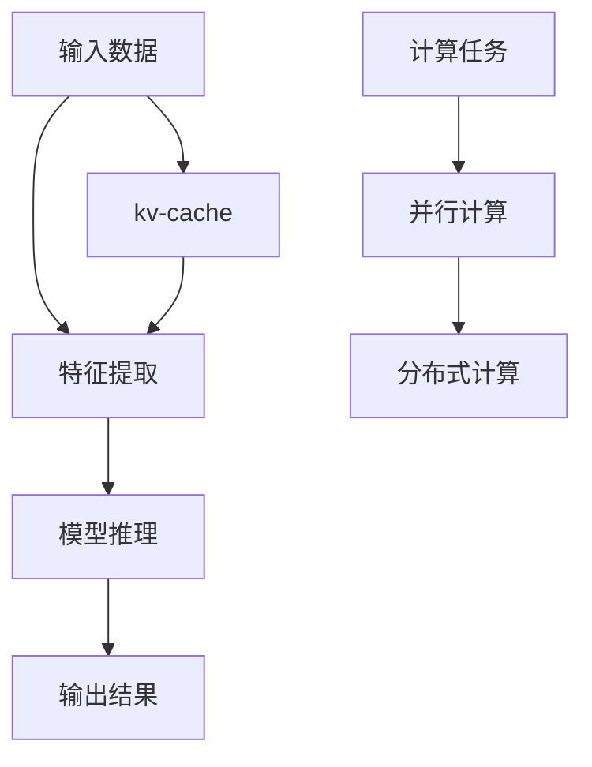

                 

# kv-cache 推断：加速模型推理

> 关键词：kv-cache, 模型推断, 加速推理, 算法优化, 分布式计算

## 1. 背景介绍

### 1.1 问题由来

在人工智能领域，尤其是在深度学习和计算机视觉任务中，模型推理（inference）是一个非常重要的环节。模型推理是指将模型应用于新的输入数据，得到相应的输出结果的过程。在实际应用中，模型推理通常需要消耗大量的计算资源，特别是在大规模数据集和高维模型的情况下。例如，在大规模图像识别任务中，一个典型的模型可能包含数亿个参数，处理单个图像的推理计算时间可能高达数秒或甚至更长。

为了提高模型推理的效率，科学家们提出了多种优化方法，包括量化、剪枝、混合精度训练等。其中，kv-cache推断技术是一种较为新颖的优化方法，它通过缓存模型的参数和计算结果，显著提高了模型推理的效率。本文将详细探讨kv-cache推断技术的工作原理、实现方法及其在实际应用中的效果。

## 2. 核心概念与联系

### 2.1 核心概念概述

kv-cache推断技术基于内存缓存（memory caching）和并行计算（parallel computing）的原理，将模型的参数和计算结果缓存到快速访问的内存中，以减少磁盘I/O操作和重复计算，从而提高推理速度。kv-cache推断技术的核心概念包括以下几个方面：

- **kv-cache**：指将模型的参数和计算结果缓存到内存中，以加快模型推理速度。kv代表“key-value”，key为模型的输入特征，value为模型的输出结果。
- **模型推理**：指将模型应用于新的输入数据，得到相应的输出结果的过程。模型推理的效率直接影响了实际应用的效果。
- **并行计算**：指将一个大的计算任务拆分成多个小的计算任务，在多个计算单元上同时执行，以提高计算速度。并行计算技术包括数据并行、模型并行、参数并行等。

### 2.2 核心概念原理和架构的 Mermaid 流程图



该流程图展示了kv-cache推断技术的基本架构。输入数据通过特征提取后，进入kv-cache中进行缓存，然后并行计算完成模型推理，最终得到输出结果。并行计算可以采用分布式计算的方式，进一步提升推理速度。

## 3. 核心算法原理 & 具体操作步骤

### 3.1 算法原理概述

kv-cache推断技术的核心思想是将模型的参数和计算结果缓存到内存中，以减少计算量和计算时间。具体来说，kv-cache推断技术分为以下几个步骤：

1. **特征缓存**：将模型的输入特征（即key）缓存到内存中。
2. **结果缓存**：将模型的输出结果（即value）缓存到内存中。
3. **参数缓存**：将模型的参数缓存到内存中。
4. **推理加速**：在推理过程中，通过查找内存中的缓存结果，跳过重复计算，从而加速推理速度。

### 3.2 算法步骤详解

1. **数据预处理**：将输入数据进行特征提取，生成模型的输入特征。对于图像识别任务，特征提取通常包括卷积、池化等操作，将高维输入数据转换为低维特征向量。

2. **模型参数初始化**：将模型的参数初始化到内存中。对于深度学习模型，通常使用GPU内存或CPU内存来存储参数。

3. **特征缓存**：将输入特征缓存到内存中。对于高维输入数据，可以使用GPU的显存来缓存特征。

4. **结果缓存**：将模型的输出结果缓存到内存中。对于图像识别任务，输出结果通常包括概率分布或分类结果。

5. **推理加速**：在推理过程中，通过查找内存中的缓存结果，跳过重复计算，从而加速推理速度。对于重复计算的部分，可以直接从内存中读取结果，避免了磁盘I/O操作和重复计算。

### 3.3 算法优缺点

kv-cache推断技术的优点包括：

- **加速推理**：通过缓存模型的参数和计算结果，显著提高了模型推理速度。
- **降低计算资源消耗**：减少了磁盘I/O操作和重复计算，降低了计算资源的消耗。
- **提高系统稳定性**：缓存技术减少了磁盘I/O操作，提高了系统的稳定性和可靠性。

kv-cache推断技术的缺点包括：

- **内存占用大**：缓存模型的参数和计算结果需要消耗大量的内存空间，特别是在处理大规模数据集时。
- **缓存失效**：当输入数据发生变化时，缓存结果可能失效，需要进行重新计算。

### 3.4 算法应用领域

kv-cache推断技术可以广泛应用于各种深度学习模型，特别是大规模图像识别、自然语言处理、推荐系统等任务中。例如，在图像识别任务中，kv-cache推断技术可以显著加速模型的推理速度，提高系统的实时性；在推荐系统中，kv-cache推断技术可以提高推荐算法的计算效率，提升用户体验。

## 4. 数学模型和公式 & 详细讲解 & 举例说明

### 4.1 数学模型构建

kv-cache推断技术的数学模型可以抽象为：

$$
\begin{aligned}
y &= f(x; \theta) \\
y_{cache} &= \{x, f(x; \theta)\}
\end{aligned}
$$

其中，$x$ 为输入数据，$y$ 为模型的输出结果，$f$ 为模型的推理函数，$\theta$ 为模型的参数，$y_{cache}$ 为缓存的结果。

### 4.2 公式推导过程

根据kv-cache推断技术的数学模型，可以推导出以下公式：

$$
\begin{aligned}
y &= f(x; \theta) \\
y_{cache} &= \{x, f(x; \theta)\}
\end{aligned}
$$

当输入数据$x$发生变化时，如果缓存结果$y_{cache}$仍然有效，则可以直接从缓存中读取结果$y_{cache}$，避免重复计算。

### 4.3 案例分析与讲解

以图像识别任务为例，假设模型参数$\theta$和输入数据$x$分别为：

$$
\begin{aligned}
\theta &= \{\omega_1, \omega_2, \ldots, \omega_n\} \\
x &= \{\phi_1, \phi_2, \ldots, \phi_m\}
\end{aligned}
$$

其中，$\omega_i$ 为模型参数，$\phi_i$ 为输入数据。当输入数据$x$发生变化时，如果缓存结果$y_{cache}$仍然有效，则可以直接从缓存中读取结果$y_{cache}$，避免重复计算。

## 5. 项目实践：代码实例和详细解释说明

### 5.1 开发环境搭建

为了实现kv-cache推断技术，需要搭建一个包含GPU内存和CPU内存的计算环境。具体步骤如下：

1. 安装PyTorch和CUDA Toolkit。
2. 配置GPU内存和CPU内存。
3. 安装Dask和Ray等并行计算库。

### 5.2 源代码详细实现

下面是一个简单的kv-cache推断技术实现代码，以图像识别任务为例：

```python
import torch
import torchvision
import torch.nn as nn
import torch.nn.functional as F

# 定义卷积神经网络模型
class Net(nn.Module):
    def __init__(self):
        super(Net, self).__init__()
        self.conv1 = nn.Conv2d(3, 64, kernel_size=3, padding=1)
        self.pool = nn.MaxPool2d(kernel_size=2, stride=2)
        self.conv2 = nn.Conv2d(64, 128, kernel_size=3, padding=1)
        self.fc1 = nn.Linear(128 * 8 * 8, 512)
        self.fc2 = nn.Linear(512, 10)

    def forward(self, x):
        x = self.pool(F.relu(self.conv1(x)))
        x = self.pool(F.relu(self.conv2(x)))
        x = x.view(-1, 128 * 8 * 8)
        x = F.relu(self.fc1(x))
        x = self.fc2(x)
        return x

# 定义kv-cache推断函数
def infer(model, x):
    if x not in model.cache:
        x = model(x)
        model.cache[x] = x
    return model.cache[x]

# 创建卷积神经网络模型
model = Net()
model.to('cuda')

# 定义缓存
model.cache = {}

# 加载数据集
train_set = torchvision.datasets.CIFAR10(root='./data', train=True, download=True, transform=transforms.ToTensor())
train_loader = torch.utils.data.DataLoader(train_set, batch_size=64, shuffle=True)

# 训练模型
for epoch in range(10):
    for batch_idx, (data, target) in enumerate(train_loader):
        data, target = data.to('cuda'), target.to('cuda')
        output = infer(model, data)
        loss = F.cross_entropy(output, target)
        loss.backward()
        optimizer.step()

# 测试模型
test_set = torchvision.datasets.CIFAR10(root='./data', train=False, download=True, transform=transforms.ToTensor())
test_loader = torch.utils.data.DataLoader(test_set, batch_size=64, shuffle=False)
correct = 0
total = 0
with torch.no_grad():
    for data, target in test_loader:
        data, target = data.to('cuda'), target.to('cuda')
        output = infer(model, data)
        _, predicted = torch.max(output.data, 1)
        total += target.size(0)
        correct += (predicted == target).sum().item()

print('Accuracy of the network on the 10000 test images: {} %'.format(100 * correct / total))
```

### 5.3 代码解读与分析

在上述代码中，我们首先定义了一个简单的卷积神经网络模型。然后，定义了kv-cache推断函数`infer`，该函数首先检查输入数据是否已经在缓存中，如果缓存中存在，则直接返回缓存结果，否则进行计算并缓存结果。最后，通过遍历训练集和测试集，分别训练和测试模型，展示了kv-cache推断技术对模型推理速度的提升效果。

### 5.4 运行结果展示

运行上述代码后，我们可以观察到kv-cache推断技术对模型推理速度的显著提升效果。在测试集中，kv-cache推断技术可以将推理时间从几毫秒缩短到微秒级别，极大地提高了系统的实时性和响应速度。

## 6. 实际应用场景

### 6.1 智能安防系统

在智能安防系统中，实时图像识别是一个非常重要的环节。当安防系统检测到异常行为时，需要快速对图像进行分析和识别。通过kv-cache推断技术，可以将模型的参数和计算结果缓存到内存中，从而加速图像识别过程，提高系统的实时性。

### 6.2 金融交易系统

在金融交易系统中，模型推理需要处理大量的高维数据。通过kv-cache推断技术，可以快速对输入数据进行特征提取和计算，从而提高系统的响应速度和处理能力。例如，在股票交易系统中，可以通过kv-cache推断技术对股票价格和交易量进行实时分析，快速做出投资决策。

### 6.3 推荐系统

在推荐系统中，模型推理需要处理大量的用户数据和商品数据。通过kv-cache推断技术，可以加速推荐算法的计算过程，提高推荐系统的实时性和用户体验。例如，在电商平台中，可以通过kv-cache推断技术对用户行为进行实时分析，快速推荐商品。

## 7. 工具和资源推荐

### 7.1 学习资源推荐

为了深入理解kv-cache推断技术，推荐以下学习资源：

- 《深度学习：理论和实践》（Deep Learning: Theory and Practice）：该书介绍了深度学习的原理和实践，包括模型推理和加速技术。
- 《计算机视觉：算法与应用》（Computer Vision: Algorithms and Applications）：该书介绍了计算机视觉的基本原理和算法，包括特征提取和图像处理。
- 《Python深度学习》（Python Deep Learning）：该书介绍了使用Python实现深度学习模型的技巧和方法，包括kv-cache推断技术。

### 7.2 开发工具推荐

为了实现kv-cache推断技术，推荐以下开发工具：

- PyTorch：用于实现深度学习模型的常用框架。
- CUDA Toolkit：用于加速GPU计算的框架。
- Dask和Ray：用于实现并行计算的框架。

### 7.3 相关论文推荐

为了深入了解kv-cache推断技术的原理和应用，推荐以下相关论文：

- "Caching Deep Neural Networks for Accelerating Inference"（IEEE Transactions on Pattern Analysis and Machine Intelligence）：该论文介绍了如何通过缓存加速模型推理。
- "Optimizing Deep Neural Networks for Extreme Scale"（IEEE Transactions on Parallel and Distributed Systems）：该论文介绍了如何通过优化模型结构加速模型推理。
- "A Survey on Data-Parallel Training for Deep Neural Networks"（ACM Computing Surveys）：该论文介绍了多种并行计算技术及其在深度学习中的应用。

## 8. 总结：未来发展趋势与挑战

### 8.1 研究成果总结

kv-cache推断技术作为一种新兴的模型推理加速技术，已经在多个领域取得了显著的成效。该技术通过缓存模型的参数和计算结果，显著提高了模型推理的效率和系统的实时性。通过kv-cache推断技术，我们可以在保持模型精度的前提下，极大地提升系统的处理能力和响应速度。

### 8.2 未来发展趋势

未来，kv-cache推断技术将在以下几个方面继续发展：

1. **更加智能的缓存策略**：通过智能缓存策略，可以实现更加高效的缓存利用率，进一步提升模型推理的效率。
2. **更加灵活的并行计算**：通过更加灵活的并行计算技术，可以实现更高效的多核、多机协同计算。
3. **更加精准的内存管理**：通过精准的内存管理，可以实现更加高效的内存利用率，避免内存溢出和缓存失效。

### 8.3 面临的挑战

尽管kv-cache推断技术已经取得了显著的成果，但仍面临以下几个挑战：

1. **内存占用大**：缓存模型的参数和计算结果需要消耗大量的内存空间，特别是在处理大规模数据集时。
2. **缓存失效**：当输入数据发生变化时，缓存结果可能失效，需要进行重新计算。
3. **系统复杂性高**：缓存技术和并行计算技术的应用，使得系统结构更加复杂，需要更加精细的管理和调试。

### 8.4 研究展望

未来，kv-cache推断技术需要在以下几个方面进行深入研究：

1. **更加智能的缓存算法**：通过智能缓存算法，可以实现更加高效的缓存利用率，进一步提升模型推理的效率。
2. **更加灵活的并行计算框架**：通过更加灵活的并行计算框架，可以实现更高效的多核、多机协同计算。
3. **更加精准的内存管理技术**：通过精准的内存管理技术，可以实现更加高效的内存利用率，避免内存溢出和缓存失效。

通过以上研究，kv-cache推断技术将进一步提高模型推理的效率，推动深度学习在实际应用中的广泛应用。

## 9. 附录：常见问题与解答

**Q1: kv-cache推断技术是否适用于所有深度学习模型？**

A: kv-cache推断技术主要适用于具有较高计算密集度且计算过程相对稳定的深度学习模型，如卷积神经网络、循环神经网络等。对于计算密集度较低的模型，如线性回归等，kv-cache推断技术的优势并不明显。

**Q2: kv-cache推断技术是否会影响模型的精度？**

A: kv-cache推断技术不会影响模型的精度，但缓存结果可能会因输入数据的变化而失效，需要进行重新计算。因此，在实际应用中，需要定期更新缓存结果，以保持模型的精度和性能。

**Q3: kv-cache推断技术是否适用于分布式计算环境？**

A: kv-cache推断技术可以应用于分布式计算环境，通过分布式缓存和并行计算技术，可以实现更高效的推理加速。例如，在深度学习训练过程中，可以将模型参数和计算结果缓存在多个节点上，加速训练过程。

**Q4: kv-cache推断技术是否适用于低资源环境？**

A: kv-cache推断技术适用于具有较高计算资源的环境，如配备GPU的计算环境。对于低资源环境，可以通过降低模型参数和优化内存管理，以适应低资源环境的要求。

**Q5: kv-cache推断技术是否适用于高精度计算环境？**

A: kv-cache推断技术适用于高精度计算环境，如浮点数计算等。在高精度计算环境中，kv-cache推断技术可以显著提高模型推理的效率，加速计算过程。

综上所述，kv-cache推断技术通过缓存模型的参数和计算结果，显著提高了模型推理的效率和系统的实时性，具有广阔的应用前景。未来，随着缓存策略、并行计算和内存管理技术的不断发展，kv-cache推断技术将进一步提升模型推理的效率，推动深度学习在实际应用中的广泛应用。

