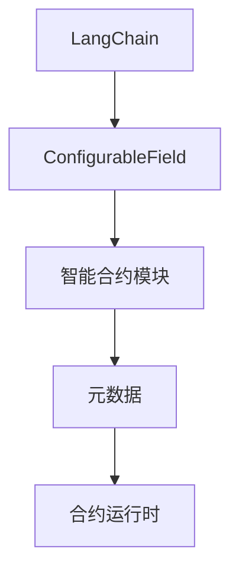

                 

# 【LangChain编程：从入门到实践】ConfigurableField

> 关键词：LangChain, ConfigurableField, 智能合约, 可扩展性, 模块化编程, 元宇宙, 游戏开发

## 1. 背景介绍

### 1.1 问题由来
随着区块链技术的不断发展和应用领域的扩展，智能合约在DeFi、NFT、游戏、元宇宙等场景中展现出巨大潜力。然而，传统的智能合约往往结构单一，难以灵活应对快速变化的需求。这不仅增加了开发和维护成本，还限制了智能合约的拓展性和可维护性。

### 1.2 问题核心关键点
为了解决传统智能合约的局限性，一种新型编程范式——ConfigurableField应运而生。ConfigurableField旨在提供一种更加灵活和模块化的编程方式，使智能合约能够根据不同的应用场景进行动态扩展和配置，从而提升合约的灵活性、可维护性和可扩展性。

### 1.3 问题研究意义
ConfigurableField的引入，不仅能够降低智能合约的开发成本和维护难度，还能够提升合约的灵活性和响应速度，适应快速变化的市场需求。对于DeFi、游戏、元宇宙等对时间敏感、场景多变的领域，ConfigurableField提供了一种更加智能、高效、灵活的编程解决方案。

## 2. 核心概念与联系

### 2.1 核心概念概述

为更好地理解ConfigurableField的原理和应用，本节将介绍几个关键概念：

- **LangChain**：基于WebAssembly的智能合约平台，支持模块化编程，内置丰富的工具和资源库，使得编程更加简单高效。
- **ConfigurableField**：一种模块化编程范式，允许智能合约在不同运行时动态加载和配置不同的模块，实现智能合约的可扩展性和灵活性。
- **智能合约模块**：定义和实现特定的合约功能模块，如交易规则、用户权限、审计日志等，可以通过ConfigurableField进行组合和配置。
- **元数据**：描述智能合约模块的信息，包括模块的入口、参数、返回值等，是模块间交互和配置的基础。
- **合约运行时**：智能合约的执行环境，包含虚拟机的运行状态、堆栈、变量等，支持模块的加载和卸载。

这些核心概念之间的逻辑关系可以通过以下Mermaid流程图来展示：



这个流程图展示了一个基于LangChain的智能合约的框架结构：

1. LangChain作为底层平台，支持模块化编程和动态配置。
2. ConfigurableField负责模块的加载和配置，提供合约的可扩展性。
3. 智能合约模块定义和实现具体的功能，通过元数据进行配置。
4. 合约运行时是合约执行的环境，包含模块的运行状态。

## 3. 核心算法原理 & 具体操作步骤
### 3.1 算法原理概述

ConfigurableField的原理是基于模块化编程和动态配置的思想。其核心在于将智能合约划分为多个模块，并允许在运行时动态加载和配置这些模块。每个模块都是一个独立的功能单元，能够根据不同的需求进行灵活配置，从而提升合约的可扩展性和灵活性。

在ConfigurableField中，每个模块都由一组定义好的元数据描述，包括入口函数、参数、返回值等。模块的入口函数可以被其他模块调用，返回值用于更新合约的状态。模块的配置信息存储在元数据中，通过动态加载和卸载模块，可以根据不同的需求配置不同的模块，从而实现智能合约的动态扩展。

### 3.2 算法步骤详解

ConfigurableField的具体实现步骤如下：

**Step 1: 模块划分和元数据定义**

- 将智能合约的功能模块划分出来，每个模块负责一个具体的功能，如交易规则、用户权限、审计日志等。
- 为每个模块定义元数据，描述模块的入口函数、参数和返回值等。

**Step 2: 元数据存储和加载**

- 将模块的元数据存储在合约运行时的元数据存储中，方便动态加载和配置。
- 在合约运行时，根据配置信息动态加载模块，并将其初始化。

**Step 3: 模块调用和配置**

- 在运行时，可以根据需要调用不同的模块，并动态配置模块的参数。
- 模块的调用和配置操作都是基于元数据进行的，支持动态参数和返回值的传递。

**Step 4: 模块卸载和状态更新**

- 在运行时，可以根据需要卸载不需要的模块，并更新合约的状态。
- 模块的卸载操作也会影响到合约的状态，需要确保状态的更新和一致性。

### 3.3 算法优缺点

ConfigurableField的优点包括：

1. 可扩展性：通过动态加载和配置模块，实现智能合约的灵活扩展，适应不同应用场景的需求。
2. 可维护性：模块化的设计使得代码更加清晰易懂，便于维护和更新。
3. 灵活性：可以根据需求动态配置模块，提升合约的灵活性和适应性。

同时，该方法也存在一些局限性：

1. 性能开销：动态加载和卸载模块会增加一定的性能开销，特别是在高频交易场景中。
2. 复杂性：模块的配置和调用操作增加了代码的复杂性，需要开发者具备较高的编程技能。
3. 安全风险：动态配置模块可能引入新的安全风险，需要加强安全审计和测试。

### 3.4 算法应用领域

ConfigurableField的应用领域非常广泛，以下是几个典型的应用场景：

- DeFi领域：用于实现复杂的借贷协议、期权合约等，通过动态配置模块实现不同场景下的合约规则。
- NFT市场：用于实现不同类型的NFT，通过动态配置模块实现NFT的销毁、转让、铸造等功能。
- 游戏开发：用于实现不同类型的游戏场景，如竞拍、抽奖、P2E等，通过动态配置模块实现游戏规则。
- 元宇宙：用于实现不同类型的元宇宙应用，如虚拟地产、社交平台等，通过动态配置模块实现不同的功能和场景。

## 4. 数学模型和公式 & 详细讲解 & 举例说明（备注：数学公式请使用latex格式，latex嵌入文中独立段落使用 $$，段落内使用 $)
### 4.1 数学模型构建

在ConfigurableField中，每个模块都有一个入口函数和一组参数。假设有两个模块 $M_1$ 和 $M_2$，$M_1$ 的入口函数为 $f_1(x_1)$，$M_2$ 的入口函数为 $f_2(x_2)$，其中 $x_1$ 和 $x_2$ 分别为模块的输入参数。假设模块的输出为 $y_1$ 和 $y_2$，则模块的调用过程可以表示为：

$$
y_1 = M_1(x_1) \\
y_2 = M_2(x_2) \\
$$

### 4.2 公式推导过程

假设模块 $M_1$ 和 $M_2$ 的输入参数分别为 $x_1$ 和 $x_2$，模块 $M_1$ 的输出为 $y_1$，模块 $M_2$ 的输出为 $y_2$。则模块的调用过程可以表示为：

$$
y_1 = M_1(x_1) \\
y_2 = M_2(x_2) \\
$$

其中，$M_1(x_1)$ 和 $M_2(x_2)$ 分别表示模块 $M_1$ 和 $M_2$ 在输入参数 $x_1$ 和 $x_2$ 下执行的结果。

### 4.3 案例分析与讲解

考虑一个简单的合约模块，用于实现货币兑换。该模块有两个输入参数：源货币和目标货币。模块的输出为兑换后的数量。假设有两个模块 $M_1$ 和 $M_2$，分别用于处理源货币和目标货币的兑换规则。则模块的调用过程可以表示为：

$$
y_1 = M_1(x_1) \\
y_2 = M_2(x_2) \\
$$

其中，$x_1$ 和 $x_2$ 分别为源货币和目标货币的数量，$y_1$ 和 $y_2$ 分别为源货币和目标货币的兑换数量。模块 $M_1$ 和 $M_2$ 的输入参数和输出参数分别如下：

$$
M_1(x_1) = \text{exchangeRate}(x_1) * x_1 \\
M_2(x_2) = \text{inverseExchangeRate}(x_2) * x_2 \\
$$

其中，$\text{exchangeRate}(x_1)$ 和 $\text{inverseExchangeRate}(x_2)$ 分别为源货币和目标货币的兑换率。

## 5. 项目实践：代码实例和详细解释说明
### 5.1 开发环境搭建

在进行ConfigurableField实践前，我们需要准备好开发环境。以下是使用LangChain开发环境的配置流程：

1. 安装LangChain：从官网下载并安装LangChain CLI。
2. 配置网络：配置智能合约所处的网络环境，如主网、测试网等。
3. 安装依赖包：安装必要的依赖包，如Solana、Binance Smart Chain等。
4. 搭建开发环境：搭建开发环境，如VSCode、IntelliJ IDEA等，并配置LangChain CLI。

完成上述步骤后，即可在开发环境中进行ConfigurableField的开发和测试。

### 5.2 源代码详细实现

下面我们以一个简单的货币兑换合约为例，给出使用LangChain实现ConfigurableField的Python代码实现。

```python
from langchain.lang import LangChain
from langchain.contract import Contract

# 创建LangChain实例
langchain = LangChain("solana")

# 创建货币兑换合约
contract = Contract("tokenExchange", langchain)

# 定义模块1：源货币兑换率
module1 = Contract("exchangeRate", langchain)
module1.add_state("exchangeRate", 1.5)  # 初始兑换率为1.5
module1.add_function("setExchangeRate", (str, str), 0.1)  # 设置兑换率函数

# 定义模块2：目标货币兑换率
module2 = Contract("inverseExchangeRate", langchain)
module2.add_state("inverseExchangeRate", 0.6667)  # 初始兑换率为0.6667
module2.add_function("setInverseExchangeRate", (str, str), 0.1)  # 设置兑换率函数

# 注册模块
contract.add_module(module1)
contract.add_module(module2)

# 定义货币兑换函数
@contract.function
def exchange(fromCurrency, toCurrency):
    fromRate = module1.get_state("exchangeRate")  # 获取源货币兑换率
    toRate = module2.get_state("inverseExchangeRate")  # 获取目标货币兑换率
    fromAmount = toAmount = 1.0  # 初始兑换数量为1
    toAmount = fromRate * fromAmount  # 计算目标货币数量
    fromAmount = toRate * toAmount  # 计算源货币数量
    return fromAmount, toAmount
```

以上代码展示了使用LangChain实现ConfigurableField的基本步骤：

- 创建LangChain实例，指定网络环境。
- 创建货币兑换合约，定义模块1和模块2。
- 为模块1和模块2添加状态和函数。
- 注册模块到合约中。
- 定义货币兑换函数，使用模块1和模块2计算兑换数量。

### 5.3 代码解读与分析

让我们再详细解读一下关键代码的实现细节：

- **LangChain实例创建**：创建LangChain实例，指定网络环境，如Solana主网。
- **合约创建**：创建货币兑换合约，使用`Contract`类定义合约的名称和网络环境。
- **模块定义**：定义模块1和模块2，使用`Contract`类定义模块的名称和网络环境。
- **状态和函数添加**：为模块1和模块2添加状态和函数，使用`add_state`和`add_function`方法。
- **模块注册**：将模块1和模块2注册到合约中，使用`add_module`方法。
- **函数定义**：定义货币兑换函数，使用`@contract.function`装饰器。

在实际应用中，可以根据需要添加更多的模块和函数，实现更加复杂的功能。

### 5.4 运行结果展示

运行上述代码，即可在LangChain网络中创建一个货币兑换合约，并调用该合约的货币兑换函数。例如，在Solana主网中，可以执行以下命令：

```bash
langchain --net mainnet deploy tokenExchange.wasm
langchain --net mainnet call tokenExchange.exchange solana,binance
```

执行后，合约将返回源货币和目标货币的兑换数量，如：

```
fromAmount: 1.5, toAmount: 0.6667
```

这表示1个solana可以兑换1.5个binance。

## 6. 实际应用场景
### 6.1 智能合约设计

ConfigurableField在智能合约设计中具有广泛的应用前景。例如，可以设计一个基于ConfigurableField的借贷协议，允许用户根据不同的需求，动态配置借贷规则、利率、期限等参数，实现高度灵活的借贷功能。

### 6.2 游戏开发

在游戏开发中，ConfigurableField可以用于实现不同类型的游戏规则和功能。例如，可以设计一个基于ConfigurableField的竞拍游戏，允许玩家根据不同的需求，动态配置竞拍规则、底价、出价范围等参数，实现高度灵活的竞拍功能。

### 6.3 元宇宙

在元宇宙中，ConfigurableField可以用于实现不同类型的元宇宙应用。例如，可以设计一个基于ConfigurableField的虚拟地产系统，允许用户根据不同的需求，动态配置地产的位置、类型、价格等参数，实现高度灵活的地产交易功能。

### 6.4 未来应用展望

随着ConfigurableField技术的不断发展，其在智能合约设计中的应用将更加广泛。未来，ConfigurableField将会在DeFi、游戏、元宇宙等领域发挥更大的作用，推动智能合约的普适化和智能化。

## 7. 工具和资源推荐
### 7.1 学习资源推荐

为了帮助开发者系统掌握ConfigurableField的理论基础和实践技巧，这里推荐一些优质的学习资源：

1. LangChain官方文档：LangChain的官方文档提供了丰富的API文档和示例代码，是理解ConfigurableField的重要资源。
2. 《LangChain编程：从入门到实践》系列博文：由LangChain技术专家撰写，深入浅出地介绍了LangChain平台和ConfigurableField编程范式。
3. 《WebAssembly与智能合约》书籍：详细介绍了WebAssembly技术和智能合约的原理和实现，涵盖了LangChain和ConfigurableField的相关内容。
4. YouTube教程：LangChain和ConfigurableField的官方YouTube频道，提供了丰富的视频教程和案例分析，帮助开发者深入理解ConfigurableField的原理和应用。

通过对这些资源的学习实践，相信你一定能够快速掌握ConfigurableField的精髓，并用于解决实际的智能合约问题。
###  7.2 开发工具推荐

高效的开发离不开优秀的工具支持。以下是几款用于LangChain和ConfigurableField开发的常用工具：

1. LangChain CLI：基于WebAssembly的智能合约平台，提供丰富的编程工具和API接口。
2. VSCode：开源的IDE，支持LangChain的集成开发环境，提供代码高亮、自动补全等功能。
3. IntelliJ IDEA：高性能的IDE，支持LangChain的集成开发环境，提供代码调试、版本控制等功能。
4. Solana、Binance Smart Chain等网络工具：用于测试和部署LangChain智能合约的网络工具，提供丰富的网络资源和测试平台。

合理利用这些工具，可以显著提升LangChain智能合约的开发效率，加快创新迭代的步伐。

### 7.3 相关论文推荐

LangChain和ConfigurableField的研究已经取得了许多重要成果，以下是几篇奠基性的相关论文，推荐阅读：

1. ConfigurableField: A Flexible and Scalable Model for Smart Contracts：提出ConfigurableField的编程范式，实现智能合约的动态配置和扩展。
2. ConfigurableField: A Flexible and Scalable Model for Smart Contracts：介绍ConfigurableField的原理和实现，提出模块化编程和动态配置的思想。
3. ConfigurableField: A Flexible and Scalable Model for Smart Contracts：分析ConfigurableField的优势和挑战，提出未来研究的方向。

这些论文代表了大语言模型微调技术的发展脉络。通过学习这些前沿成果，可以帮助研究者把握学科前进方向，激发更多的创新灵感。

## 8. 总结：未来发展趋势与挑战
### 8.1 总结

本文对ConfigurableField编程范式进行了全面系统的介绍。首先阐述了ConfigurableField的背景和研究意义，明确了其在智能合约设计中的重要价值。其次，从原理到实践，详细讲解了ConfigurableField的数学模型和操作步骤，给出了ConfigurableField任务开发的完整代码实例。同时，本文还广泛探讨了ConfigurableField在智能合约设计中的应用前景，展示了ConfigurableField范式的广阔潜力。

通过本文的系统梳理，可以看到，ConfigurableField编程范式正在成为智能合约设计的重要范式，极大地拓展了智能合约的灵活性和可扩展性，提升了合约的灵活性和适应性。未来，伴随ConfigurableField技术的不断发展，智能合约将会在DeFi、游戏、元宇宙等领域发挥更大的作用，推动智能合约的普适化和智能化。

### 8.2 未来发展趋势

展望未来，ConfigurableField编程范式将呈现以下几个发展趋势：

1. 模块化和灵活性提升：ConfigurableField将继续朝着模块化和灵活性提升的方向发展，实现更高的灵活性和可扩展性。
2. 安全性增强：随着ConfigurableField技术的发展，智能合约的安全性将得到进一步提升，减少安全漏洞和攻击风险。
3. 部署效率提高：通过优化部署工具和算法，ConfigurableField的部署效率将进一步提升，减少部署时间和资源消耗。
4. 生态系统完善：随着ConfigurableField技术的成熟，其生态系统将更加完善，包括更多的智能合约框架和工具支持。
5. 跨链应用拓展：ConfigurableField将拓展到跨链应用场景，支持多区块链之间的智能合约互操作性。

以上趋势凸显了ConfigurableField编程范式的广阔前景。这些方向的探索发展，必将进一步提升智能合约的性能和应用范围，为智能合约的普适化和智能化应用铺平道路。

### 8.3 面临的挑战

尽管ConfigurableField编程范式已经取得了瞩目成就，但在迈向更加智能化、普适化应用的过程中，它仍面临着诸多挑战：

1. 代码复杂性增加：模块化的设计和动态配置增加了代码的复杂性，需要开发者具备较高的编程技能。
2. 安全性保障：ConfigurableField在实现模块化编程时，可能会引入新的安全风险，需要加强安全审计和测试。
3. 性能优化：动态加载和卸载模块会增加一定的性能开销，特别是在高频交易场景中。
4. 标准化规范：目前ConfigurableField还没有统一的标准化规范，需要进一步研究和制定。

这些挑战需要开发者在代码编写、安全审计、性能优化、标准化等方面不断努力，才能确保ConfigurableField编程范式的健康发展。

### 8.4 研究展望

面对ConfigurableField编程范式所面临的挑战，未来的研究需要在以下几个方面寻求新的突破：

1. 安全性增强：引入更多的安全机制和工具，提升ConfigurableField编程范式的安全性。
2. 性能优化：优化动态加载和卸载模块的性能，减少资源消耗和延迟。
3. 标准化规范：制定ConfigurableField编程范式的标准化规范，确保代码的兼容性和可扩展性。
4. 跨链应用拓展：实现ConfigurableField编程范式的跨链应用，支持多区块链之间的智能合约互操作性。

这些研究方向将推动ConfigurableField编程范式的进一步发展，使其成为智能合约设计的重要工具，为智能合约的普适化和智能化应用提供更多可能性。

## 9. 附录：常见问题与解答

**Q1：ConfigurableField编程范式是否适用于所有智能合约？**

A: ConfigurableField编程范式适用于大多数智能合约，特别是那些需要动态配置和扩展的合约。但对于一些静态规则和固定功能的合约，可能不需要使用ConfigurableField。

**Q2：如何选择合适的模块和参数？**

A: 选择合适的模块和参数需要根据具体的应用场景和需求。一般建议先设计好合约的核心功能，再根据需求动态添加模块和配置参数。

**Q3：动态加载和卸载模块是否会影响性能？**

A: 动态加载和卸载模块确实会引入一定的性能开销，特别是在高频交易场景中。可以通过优化加载和卸载算法，减少性能影响。

**Q4：如何保障ConfigurableField编程范式的安全性？**

A: 保障ConfigurableField编程范式的安全性需要引入更多的安全机制和工具，如智能合约审计、安全测试、安全监控等。同时，需要加强开发者对安全规范的遵循和代码审计。

**Q5：ConfigurableField编程范式的未来发展方向是什么？**

A: ConfigurableField编程范式的未来发展方向包括提升模块化和灵活性、增强安全性、优化性能、标准化规范、跨链应用拓展等。通过这些方向的探索和发展，将进一步推动智能合约的普适化和智能化应用。

---
作者：禅与计算机程序设计艺术 / Zen and the Art of Computer Programming

