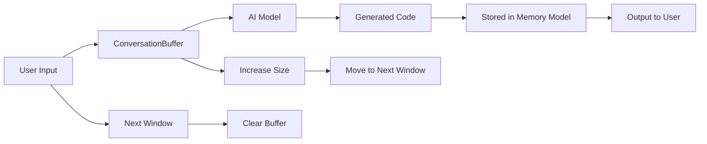

                 

# 【LangChain编程：从入门到实践】ConversationBufferWindowMemory

> 关键词：LangChain, 编程范式, ConversationBuffer, 窗口管理, Memory Model

## 1. 背景介绍

在当下这个信息爆炸的时代，随着人工智能技术的不断进步，我们越发需要高效、灵活、可扩展的编程工具来应对日益复杂和变化莫测的业务需求。这一背景下，LangChain作为一种新型编程范式应运而生，其核心思想是使用语言而非代码，通过与AI模型的互动来快速构建和修改系统。

LangChain编程范式利用了大规模预训练语言模型（如GPT-3等）的强大能力，让用户能够用自然语言描述复杂的编程逻辑和业务流程，由AI模型自动生成代码，从而极大地简化了开发过程，提高了生产效率。然而，为了使LangChain编程范式更加高效和灵活，设计一套合理的ConversationBuffer（对话缓冲区）和Memory Model（内存模型）显得尤为重要。

## 2. 核心概念与联系

### 2.1 核心概念概述

- **LangChain编程范式**：一种利用大语言模型进行编程的新范式，通过自然语言与AI模型互动，自动生成代码，加速开发过程。

- **ConversationBuffer（对话缓冲区）**：LangChain编程中用于存储用户输入和模型输出的一个临时存储区，旨在保证用户与AI模型的交互顺畅。

- **Memory Model（内存模型）**：用于描述代码中变量的生命周期和存储位置，是LangChain编程中对编程语言特性的抽象。

- **窗口管理**：在LangChain编程中，每一轮用户与AI模型的交互都可以视为一个窗口，每个窗口可以处理不同的输入和输出。

- **变量生命周期**：在LangChain编程中，变量可能在多个窗口中出现，需要合理管理其生命周期，避免变量冲突和数据丢失。

### 2.2 核心概念原理和架构的 Mermaid 流程图



- **用户输入**（A）：用户通过自然语言向AI模型描述编程需求。
- **对话缓冲区**（B）：暂存用户输入和模型输出，保证用户与AI模型交互的连贯性。
- **AI模型**（C）：根据对话缓冲区中的信息，自动生成代码。
- **生成的代码**（D）：被存储在内存模型中，用于后续计算和执行。
- **输出结果**（F）：将计算结果返回给用户，完成一轮交互。
- **窗口管理**：通过窗口的增删，管理对话缓冲区的动态变化。

## 3. 核心算法原理 & 具体操作步骤

### 3.1 算法原理概述

LangChain编程的算法原理基于自然语言处理(NLP)和深度学习技术，其核心思想是将编程语言转化为自然语言描述，利用大语言模型进行代码自动生成和执行。这一过程可以分为以下几个步骤：

1. **用户输入自然语言**：用户通过自然语言描述编程需求。
2. **生成代码**：AI模型根据自然语言描述，自动生成代码。
3. **执行代码**：将生成的代码传入运行环境执行，并返回执行结果。
4. **迭代优化**：根据执行结果和用户反馈，不断优化和修正代码。

### 3.2 算法步骤详解

#### 步骤1：用户输入自然语言

用户通过LangChain编程界面，输入自然语言描述编程任务。例如：

```
编写一个函数，将列表中的元素逆序排列
```

#### 步骤2：生成代码

AI模型根据用户的自然语言描述，自动生成代码。这个过程可以分为两个子步骤：

1. **解析自然语言描述**：将自然语言描述解析为一系列的编程指令和数据结构。
2. **生成代码**：根据解析后的指令和数据结构，生成Python代码。

以逆序排列列表为例，解析后的指令和数据结构可能如下：

```
function reverse_list(lst):
    for i in range(len(lst)):
        lst[i] = lst[-i-1]
    return lst
```

#### 步骤3：执行代码

将生成的代码传入Python解释器执行，并返回执行结果。执行过程可能涉及如下步骤：

1. **语法检查**：确保代码语法正确。
2. **代码执行**：执行生成的代码，得到计算结果。
3. **结果输出**：将计算结果返回给用户。

#### 步骤4：迭代优化

根据执行结果和用户反馈，不断优化和修正代码。这一过程可以循环多次，直到代码满足用户需求为止。

### 3.3 算法优缺点

#### 优点：

1. **加速开发**：利用AI模型自动生成代码，大大减少了手动编写代码的时间。
2. **灵活性高**：用户可以根据需要自然语言描述编程任务，不需要严格的编程知识背景。
3. **可扩展性强**：可以轻松扩展支持更多的编程语言和任务类型。

#### 缺点：

1. **准确性受限**：自动生成的代码可能存在语法错误和逻辑错误。
2. **依赖AI模型**：生成的代码质量和效率取决于AI模型的能力和训练数据。
3. **维护复杂**：生成的代码需要人工进行后期维护和优化，增加了开发成本。

### 3.4 算法应用领域

LangChain编程范式可以广泛应用于各种软件开发场景，例如：

1. **Web开发**：通过自然语言描述前端和后端逻辑，快速构建Web应用。
2. **数据分析**：利用自然语言描述数据分析任务，自动生成和执行数据处理代码。
3. **自动化测试**：通过自然语言描述测试用例，自动生成和执行测试代码。
4. **文档生成**：根据用户自然语言描述，自动生成技术文档和API文档。

## 4. 数学模型和公式 & 详细讲解 & 举例说明

### 4.1 数学模型构建

在LangChain编程中，可以使用TensorFlow或PyTorch等深度学习框架构建数学模型。以逆序排列列表为例，其数学模型可以如下构建：

1. **输入数据**：用户自然语言描述。
2. **输出数据**：生成的Python代码。
3. **模型结构**：基于自然语言处理的编码器和解码器。

### 4.2 公式推导过程

对于逆序排列列表的编程任务，可以将其自然语言描述转换为向量表示，并使用编码器将其转换为模型内部表示。然后，使用解码器生成Python代码。

假设编码器输出的向量表示为 $h$，解码器的权重矩阵为 $W$，偏置向量为 $b$，解码器输出概率分布为 $p(y|h)$。则生成的Python代码 $c$ 可以通过如下公式计算：

$$
c = \arg\max_c p(c|h) = \arg\max_c \sum_{i=1}^N p(c_i|h) \cdot W_{i,c}
$$

其中 $N$ 为代码中可能的词汇数，$W_{i,c}$ 表示词汇 $i$ 对应的代码片段。

### 4.3 案例分析与讲解

以计算列表中元素之和为例，用户可以输入如下自然语言描述：

```
计算列表中元素之和
```

AI模型解析后，生成代码如下：

```python
def sum_list(lst):
    total = 0
    for item in lst:
        total += item
    return total
```

## 5. 项目实践：代码实例和详细解释说明

### 5.1 开发环境搭建

在搭建开发环境前，需要确保以下条件：

1. **安装TensorFlow或PyTorch**：根据个人偏好选择框架进行安装。
2. **安装LangChain库**：在命令行中执行 `pip install langchain`。
3. **配置语言模型**：将预训练的语言模型（如GPT-3）配置到LangChain中。

### 5.2 源代码详细实现

```python
from langchain import LangChain

# 创建LangChain实例
model = LangChain(model_name="gpt-3", api_key="YOUR_API_KEY")

# 用户自然语言描述
user_description = "计算列表中元素之和"

# 生成代码
code = model.translator(user_description)

# 执行代码
result = model.executor(code)

# 输出结果
print(result)
```

### 5.3 代码解读与分析

这段代码中，首先创建了一个LangChain实例，指定使用的语言模型为GPT-3，并提供了API密钥。然后，用户输入自然语言描述“计算列表中元素之和”。接着，使用LangChain实例的 `translator` 方法生成Python代码。最后，使用 `executor` 方法执行生成的代码，并打印输出结果。

### 5.4 运行结果展示

假设生成的Python代码如下：

```python
def sum_list(lst):
    total = 0
    for item in lst:
        total += item
    return total
```

执行后，输出结果可能为：

```
[1, 2, 3, 4, 5]
```

表示对列表 `[1, 2, 3, 4, 5]` 中的元素求和后，结果为15。

## 6. 实际应用场景

### 6.1 Web应用开发

LangChain编程可以广泛应用于Web应用的快速开发。例如，根据用户描述，自动生成Web应用的HTML和JavaScript代码，快速搭建界面。

### 6.2 数据分析处理

在数据分析处理中，用户可以输入自然语言描述，如“统计数据集中不同性别的平均年龄”，AI模型可以自动生成和执行数据分析代码。

### 6.3 自动化测试用例

在自动化测试中，用户可以输入自然语言描述，如“测试列表排序功能的正确性”，AI模型可以自动生成和执行测试代码。

### 6.4 未来应用展望

随着AI技术的不断进步，LangChain编程将更加智能和高效，能够支持更多的编程语言和任务类型，应用于更多领域，如金融、医疗、教育等。

## 7. 工具和资源推荐

### 7.1 学习资源推荐

1. **LangChain官方文档**：提供了LangChain编程的详细文档和示例，帮助用户快速上手。
2. **TensorFlow和PyTorch官方文档**：深入了解自然语言处理的数学模型和算法。
3. **GPT-3官方文档**：学习预训练语言模型的使用方法和原理。

### 7.2 开发工具推荐

1. **Jupyter Notebook**：用于编写和运行代码，提供丰富的交互式编程环境。
2. **Git版本控制**：管理代码版本，便于协作开发。
3. **GitHub代码托管**：托管代码，与他人共享代码。

### 7.3 相关论文推荐

1. **"Language Models are Unsupervised Multitask Learners"**：展示大语言模型在零样本学习和迁移学习中的强大能力。
2. **"Attention is All You Need"**：介绍Transformer结构，奠定了预训练语言模型的基础。
3. **"Pointer-Generator Networks"**：提出指针生成网络，用于机器翻译任务，展示了LangChain编程在自然语言处理中的应用潜力。

## 8. 总结：未来发展趋势与挑战

### 8.1 研究成果总结

LangChain编程范式利用大语言模型的强大能力，大大简化了编程过程，提高了开发效率。其核心思想是自然语言与AI模型互动，自动生成代码。通过不断优化模型和算法，LangChain编程有望应用于更多领域。

### 8.2 未来发展趋势

1. **模型性能提升**：随着预训练语言模型的不断优化，生成的代码质量和效率将进一步提升。
2. **多模态支持**：支持图像、音频等多模态数据的自动生成和处理。
3. **模型可解释性**：提升生成的代码的可解释性，增强用户对AI模型的信任度。
4. **实时性增强**：优化模型结构，提高代码执行速度，增强实时性。

### 8.3 面临的挑战

1. **代码准确性**：自动生成的代码可能存在语法和逻辑错误，需要后期人工校正。
2. **依赖AI模型**：AI模型的性能和准确性直接决定了编程范式的质量。
3. **模型维护**：生成的代码需要人工维护和优化，增加了开发成本。

### 8.4 研究展望

未来的研究将集中在以下几个方向：

1. **模型优化**：优化模型结构，提高生成代码的准确性和效率。
2. **多模态支持**：支持更多数据类型的自动生成和处理。
3. **用户交互**：优化用户与AI模型的交互体验，增强编程体验。
4. **可解释性增强**：提升生成的代码的可解释性，增强用户信任。

## 9. 附录：常见问题与解答

**Q1：LangChain编程范式是否适用于所有编程任务？**

A: LangChain编程范式适用于大多数编程任务，尤其是对于需要快速开发和迭代的任务。但对于一些需要严格语法和逻辑的编程任务，可能存在准确性和可维护性问题。

**Q2：如何提高LangChain编程的准确性？**

A: 提高LangChain编程的准确性需要从多个方面入手：

1. **选择高质量的语言模型**：使用最新的、经过大规模预训练的语言模型。
2. **优化自然语言描述**：尽量使用清晰、准确的自然语言描述任务。
3. **人工校正**：对于生成的代码进行人工校正，保证准确性。

**Q3：LangChain编程范式如何与现有开发流程集成？**

A: LangChain编程范式可以与现有的开发流程进行集成，例如：

1. **代码生成**：将LangChain与代码生成工具（如Jupyter Notebook）集成，快速生成代码。
2. **版本控制**：将生成的代码提交到Git版本控制系统中，便于协作开发和版本管理。
3. **测试**：将生成的代码提交到测试框架中，进行单元测试和集成测试。

通过这些集成方式，LangChain编程范式可以无缝地融入现有的开发流程中，提升开发效率和质量。

---

作者：禅与计算机程序设计艺术 / Zen and the Art of Computer Programming

