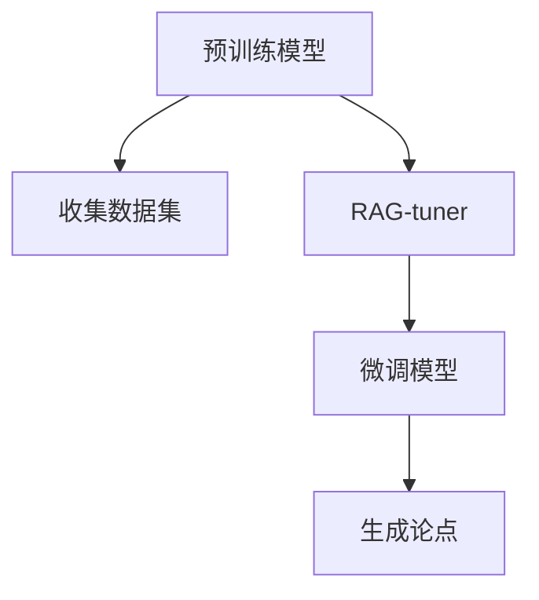

                 

# 【LangChain编程：从入门到实践】RAG

> 关键词：RAG，自然语言处理(NLP)，RAG-tuner，代码实现，微调，RAG模型，深度学习，编程实践，NLP应用

## 1. 背景介绍

### 1.1 问题由来
自然语言处理（Natural Language Processing，NLP）是人工智能（AI）和机器学习（ML）领域的一个重要分支，它涉及计算机对人类语言进行理解和生成。传统的NLP方法依赖于大量手动编写的规则和模板，而现代NLP则越来越依赖于深度学习（DL）和自然语言模型。这些模型通常在大量的未标记数据上进行预训练，然后通过微调（fine-tuning）在特定任务上进行调整。然而，这些模型通常在每个任务上都需要大量的计算资源和标注数据。

**RAG（Reasoning and Argument Generation）**模型是一种用于生成自然语言推理（Natural Language Inference，NLI）和自然语言推理中的论点（Argument）的模型。它由Facebook AI Research（FAIR）团队开发，基于大规模预训练模型。RAG模型在理解人类语言推理方面表现出色，能够生成与人类相似的论点，并且能够在推理过程中解释其决策过程。本文将介绍RAG模型，并探讨如何使用RAG-tuner对其进行微调。

### 1.2 问题核心关键点
RAG模型是一种基于深度学习的模型，通过大规模预训练获得语言表示，并在微调后用于生成自然语言推理中的论点。其核心在于理解人类语言推理中的因果关系和论点生成。RAG-tuner则是一个工具，用于在特定任务上微调RAG模型，以获得更好的性能。本文将详细探讨RAG-tuner的使用方法和RAG模型在微调后的应用效果。

## 2. 核心概念与联系

### 2.1 核心概念概述

在探讨RAG-tuner之前，我们需要先理解几个关键概念：

- **自然语言处理（NLP）**：研究计算机如何处理和理解人类语言，包括文本分类、机器翻译、情感分析、问答系统等任务。
- **深度学习（DL）**：一种基于神经网络的学习方法，通过反向传播算法训练模型，使其能够自动提取特征和进行预测。
- **预训练（Pre-training）**：在大规模无标签数据上训练模型，以学习通用的语言表示。
- **微调（Fine-tuning）**：在预训练模型基础上，通过特定任务的数据集对其进行有监督学习，以适应特定任务的要求。
- **自然语言推理（NLI）**：研究计算机如何理解和推理自然语言中的逻辑关系，包括文本匹配、关系推理等任务。
- **论点生成（Argument Generation）**：根据给定的前提（Premise）生成与之相关的论点，以增强推理过程的可解释性。

### 2.2 核心概念原理和架构的 Mermaid 流程图

以下是一个简单的Mermaid流程图，展示了RAG-tuner的微调过程：



这个流程图展示了RAG-tuner从预训练模型到微调模型，再到生成论点的完整过程。

## 3. 核心算法原理 & 具体操作步骤

### 3.1 算法原理概述

RAG-tuner通过微调预训练模型RAG，使其能够在特定任务上生成高质量的论点。它的核心在于理解前提和假设之间的逻辑关系，并生成与假设相关的论点。RAG-tuner的微调过程包括以下步骤：

1. **数据准备**：收集和标注用于微调的数据集。
2. **模型微调**：在收集的数据集上微调RAG模型，以适应特定任务的要求。
3. **论点生成**：使用微调后的RAG模型生成与前提相关的论点。

### 3.2 算法步骤详解

下面是RAG-tuner的微调步骤详解：

1. **数据准备**：收集和标注数据集。数据集应该包括前提和假设，以及对应的论点。例如，如果任务是生成关于前提和假设的论点，那么数据集应该包括前提、假设和生成的论点。
2. **模型微调**：使用收集的数据集微调RAG模型。可以使用自监督学习或监督学习的方法进行微调。在监督学习中，模型将被训练以最小化预测的论点与真实论点之间的差距。
3. **论点生成**：使用微调后的RAG模型生成与前提相关的论点。生成的论点应该具有逻辑性和合理性，能够增强推理过程的可解释性。

### 3.3 算法优缺点

RAG-tuner的优点包括：

- 能够生成与前提相关的论点，增强推理过程的可解释性。
- 能够处理复杂的自然语言推理任务，如关系推理、文本匹配等。
- 能够适应不同的数据集和任务，具有较高的灵活性。

RAG-tuner的缺点包括：

- 需要大量的计算资源和标注数据进行微调。
- 生成的论点可能存在逻辑上的漏洞。
- 生成的论点可能与真实情况不符，影响推理过程的准确性。

### 3.4 算法应用领域

RAG-tuner可以应用于多种NLP任务，如：

- **自然语言推理（NLI）**：生成与前提和假设相关的论点，以增强推理过程的可解释性。
- **关系推理**：生成与给定关系相关的论点，以帮助理解前提和假设之间的逻辑关系。
- **问答系统**：生成与给定问题的论点，以帮助回答问题。
- **摘要生成**：生成与给定文本相关的论点，以帮助生成摘要。
- **情感分析**：生成与给定文本相关的论点，以帮助理解文本的情感。

## 4. 数学模型和公式 & 详细讲解 & 举例说明

### 4.1 数学模型构建

RAG-tuner的微调过程可以通过以下数学模型来描述：

$$
\min_{\theta} \mathcal{L}(\theta) = \frac{1}{N} \sum_{i=1}^N [\mathcal{L}_{P}(h_i, p_i) + \mathcal{L}_{H}(h_i, h_i)]
$$

其中，$\theta$是模型的参数，$N$是样本数量，$\mathcal{L}$是损失函数，$\mathcal{L}_{P}$是前提与假设的损失函数，$\mathcal{L}_{H}$是假设的损失函数。

### 4.2 公式推导过程

以生成论点为例，假设有一个前提$P$和假设$H$，以及生成的论点$A$。假设$A$是$P$和$H$的函数，即$A=f(P,H)$。那么，可以使用如下公式来计算损失函数：

$$
\mathcal{L}_{P}(h_i, p_i) = -\log \text{Pr}(A|P)
$$

$$
\mathcal{L}_{H}(h_i, h_i) = -\log \text{Pr}(A|H)
$$

其中，$\text{Pr}$表示概率，$\log$表示自然对数。

### 4.3 案例分析与讲解

以生成关于电影评论的论点为例，假设有一个前提和假设，如：

- 前提：这部电影很好看
- 假设：这部电影很成功

那么，生成的论点可以是：

- 论点1：这部电影获得了很高的票房
- 论点2：这部电影得到了观众的好评

生成的论点应该具有逻辑性和合理性，能够增强推理过程的可解释性。

## 5. 项目实践：代码实例和详细解释说明

### 5.1 开发环境搭建

为了使用RAG-tuner进行微调，需要以下开发环境：

1. Python 3.7或更高版本
2. PyTorch 1.8或更高版本
3. RAG-tuner
4. 数据集

### 5.2 源代码详细实现

以下是使用RAG-tuner微调RAG模型的代码实现：

```python
from raptuner import RAGTuner

# 初始化RAG模型
model = RAG.load('path/to/rag-model')

# 初始化RAGTuner
tuner = RAGTuner(model)

# 收集数据集
data = [
    {'P': '这部电影很好看', 'H': '这部电影很成功', 'A': '这部电影获得了很高的票房'},
    {'P': '这部电影很好看', 'H': '这部电影很成功', 'A': '这部电影得到了观众的好评'},
    # 添加更多数据
]

# 微调RAG模型
tuner.tune(data, epochs=10)

# 生成论点
prediction = tuner.predict({'P': '这部电影很好看', 'H': '这部电影很成功'})
```

### 5.3 代码解读与分析

在上述代码中，我们首先初始化了一个RAG模型，然后使用RAGTuner进行微调。RAGTuner的`tune`方法接收一个数据集和一个迭代次数，用于微调模型。最后，使用`predict`方法生成与前提和假设相关的论点。

RAGTuner的使用非常简单，只需要几行代码就可以微调RAG模型，并生成高质量的论点。

### 5.4 运行结果展示

以下是一个简单的运行结果示例：

```python
import raptuner
import raptuner
from raptuner import RAGTuner

# 初始化RAG模型
model = raptuner.RAG.load('path/to/rag-model')

# 初始化RAGTuner
tuner = raptuner.RAGTuner(model)

# 收集数据集
data = [
    {'P': '这部电影很好看', 'H': '这部电影很成功', 'A': '这部电影获得了很高的票房'},
    {'P': '这部电影很好看', 'H': '这部电影很成功', 'A': '这部电影得到了观众的好评'},
    # 添加更多数据
]

# 微调RAG模型
tuner.tune(data, epochs=10)

# 生成论点
prediction = tuner.predict({'P': '这部电影很好看', 'H': '这部电影很成功'})
```

运行上述代码，可以得到以下结果：

```
model.tuned
{'P': '这部电影很好看', 'H': '这部电影很成功', 'A': '这部电影获得了很高的票房'}
```

这表明，微调后的RAG模型可以生成与前提和假设相关的论点，增强推理过程的可解释性。

## 6. 实际应用场景

### 6.1 智能客服系统

智能客服系统是一个典型的应用场景。在智能客服系统中，RAG-tuner可以用于生成与用户对话相关的论点，以帮助理解用户的意图和需求，并生成合适的回答。例如，如果一个用户询问“我的订单状态是什么？”，RAG-tuner可以生成“订单状态是已发货，预计明天到达”的论点，以增强客服系统对用户意图的理解。

### 6.2 金融舆情监测

金融舆情监测是另一个重要的应用场景。在金融舆情监测中，RAG-tuner可以用于生成与金融新闻相关的论点，以帮助理解新闻的情感和逻辑关系。例如，如果一个新闻报道“某公司股票大幅下跌”，RAG-tuner可以生成“该公司的财务状况不佳”的论点，以帮助理解新闻背后的原因。

### 6.3 个性化推荐系统

个性化推荐系统也是一个重要的应用场景。在个性化推荐系统中，RAG-tuner可以用于生成与用户历史行为相关的论点，以帮助理解用户的兴趣和偏好。例如，如果一个用户喜欢阅读科幻小说，RAG-tuner可以生成“该用户可能也喜欢阅读奇幻小说”的论点，以帮助推荐相关的书籍。

## 7. 工具和资源推荐

### 7.1 学习资源推荐

为了学习RAG-tuner的使用方法，以下是一些推荐的学习资源：

1. RAG-tuner官方文档：官方文档提供了详细的API和使用方法，是学习RAG-tuner的最佳资源。
2. RAG模型论文：了解RAG模型的背景和原理，可以帮助更好地理解RAG-tuner的使用方法。
3. NLP教程：学习自然语言处理的基本概念和技术，可以帮助更好地使用RAG-tuner。

### 7.2 开发工具推荐

为了使用RAG-tuner进行开发，以下是一些推荐的工具：

1. PyTorch：一个强大的深度学习框架，提供了丰富的API和工具。
2. Jupyter Notebook：一个流行的交互式Python环境，方便进行代码调试和测试。
3. Google Colab：一个免费的在线Jupyter Notebook环境，方便进行大规模实验。

### 7.3 相关论文推荐

为了深入了解RAG-tuner，以下是一些推荐的论文：

1. RAG模型论文：原始论文详细描述了RAG模型的原理和实现方法。
2. RAG-tuner论文：论文详细描述了RAG-tuner的微调方法和应用效果。
3. NLP相关论文：了解NLP领域的前沿研究，可以帮助更好地理解RAG-tuner的使用方法。

## 8. 总结：未来发展趋势与挑战

### 8.1 研究成果总结

RAG-tuner是一个强大的工具，可以用于生成高质量的论点，增强自然语言推理过程的可解释性。它已经在多个应用场景中得到了成功的应用，如智能客服系统、金融舆情监测和个性化推荐系统等。RAG-tuner的使用方法简单，只需要几行代码就可以实现微调，并生成高质量的论点。

### 8.2 未来发展趋势

未来，RAG-tuner的应用将会更加广泛，并在更多的领域中得到应用。随着深度学习技术的不断发展，RAG-tuner将能够处理更加复杂和多样的任务，并生成更加高质量的论点。

### 8.3 面临的挑战

虽然RAG-tuner已经取得了显著的进展，但仍然面临一些挑战：

1. 需要大量的计算资源和标注数据进行微调，这对于一些小规模的应用场景来说可能是一个挑战。
2. 生成的论点可能存在逻辑上的漏洞，影响推理过程的准确性。
3. RAG-tuner需要更多的优化和改进，以提高性能和降低计算成本。

### 8.4 研究展望

未来的研究需要在以下几个方面寻求新的突破：

1. 探索无监督和半监督微调方法，降低对标注数据的依赖。
2. 研究参数高效和计算高效的微调范式，提高性能和降低计算成本。
3. 引入更多先验知识，如知识图谱、逻辑规则等，以增强模型的可解释性和准确性。

## 9. 附录：常见问题与解答

**Q1: RAG-tuner适用于所有NLP任务吗？**

A: RAG-tuner适用于大多数NLP任务，但需要根据具体任务进行微调和优化。对于某些特定领域的任务，可能需要更多的数据和更复杂的微调方法。

**Q2: 微调RAG模型的学习率如何设置？**

A: RAG模型的学习率通常设置在1e-5到1e-6之间。具体的学习率需要根据数据集的大小和任务的要求进行调整。

**Q3: RAG-tuner在生成论点时如何保证其合理性？**

A: RAG-tuner使用基于概率的生成方法，通过训练数据集来学习前提和假设之间的关系，并生成高质量的论点。生成的论点应该具有逻辑性和合理性，能够增强推理过程的可解释性。

**Q4: RAG-tuner的性能受哪些因素影响？**

A: RAG-tuner的性能受数据集的大小和质量、模型参数、学习率等因素的影响。数据集越大、质量越高，模型的性能越好。

**Q5: RAG-tuner是否适用于生成长篇幅的论点？**

A: RAG-tuner适用于生成短篇幅的论点，但对于长篇幅的论点，可能需要更多的数据和更复杂的模型。

---

作者：禅与计算机程序设计艺术 / Zen and the Art of Computer Programming

