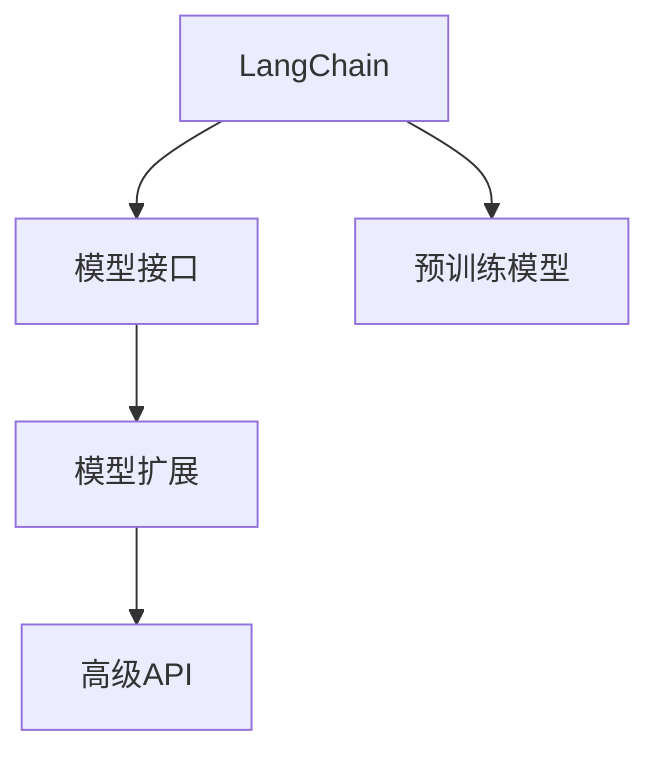

                 

# 【LangChain编程：从入门到实践】扩展模型接口

> 关键词：LangChain, 模型接口, 扩展, 定制, 高级API

## 1. 背景介绍

在人工智能领域，模型接口的扩展性一直是研究者们关注的重点之一。随着深度学习技术的快速发展，大语言模型（Large Language Models, LLMs）已经成为了许多自然语言处理（Natural Language Processing, NLP）任务的基础。然而，这些模型通常被设计为固定的，难以适应不同场景的需求。

在此背景下，LangChain应运而生。LangChain是一个开源的Python库，旨在为开发者提供一个更加灵活、易用的模型接口扩展平台。它不仅支持多种预训练模型的加载，还提供了丰富的API接口，使得开发者可以根据自身需求自定义模型行为。本文将从LangChain的基础概念入手，深入探讨如何通过扩展模型接口，提高模型的适用性和灵活性，并结合实际案例，详细阐述LangChain的应用方法。

## 2. 核心概念与联系

### 2.1 核心概念概述

为了更好地理解LangChain，我们需要先了解几个核心概念：

- **LangChain**：开源Python库，提供模型接口扩展平台，支持多种预训练模型的加载和扩展。
- **模型接口**：模型与外界交互的方式，通常包括输入数据的处理、模型的调用和输出的生成。
- **模型扩展**：在现有模型的基础上，通过定制接口、添加功能等手段，使其适应特定应用场景。
- **高级API**：用于实现模型扩展的高层次接口，提供更直观、易用的编程体验。

这些概念之间的关系可以用以下Mermaid流程图表示：



通过这幅图，我们可以看到，LangChain在预训练模型和模型接口之间架起了一座桥梁，使得模型能够通过扩展接口，更好地服务于各类应用场景。

## 3. 核心算法原理 & 具体操作步骤

### 3.1 算法原理概述

LangChain的核心原理是通过继承和组合，实现模型的灵活扩展。具体来说，LangChain提供了一个通用的模型加载框架，开发者可以基于此框架，自定义模型的输入处理、模型调用和输出生成等组件，从而实现对现有模型的扩展。

在技术实现上，LangChain主要采用了以下设计理念：

1. **模块化设计**：将模型接口扩展过程分解为多个模块，每个模块负责模型的一部分功能，便于维护和扩展。
2. **插件机制**：通过插件机制，开发者可以方便地添加、删除或修改模型组件，实现对模型的定制化扩展。
3. **链式调用**：采用链式调用的方式，将各个模型组件串联起来，形成完整的模型调用链路。

### 3.2 算法步骤详解

以下是一份基于LangChain模型扩展的具体步骤：

**Step 1: 准备预训练模型和数据集**

- 使用LangChain的模型加载功能，加载预训练模型。
- 准备训练集和验证集，确保数据集与预训练模型的分布一致。

**Step 2: 定义模型接口**

- 根据具体任务需求，设计模型输入和输出格式。
- 定义模型接口，包括模型的输入和输出方式，以及数据预处理和后处理等步骤。

**Step 3: 实现模型扩展**

- 继承LangChain的模型组件，实现自定义的输入处理、模型调用和输出生成等功能。
- 将自定义组件集成到模型加载框架中，形成完整的模型调用链路。

**Step 4: 执行模型训练和测试**

- 使用自定义模型进行训练，并定期在验证集上评估模型性能。
- 在测试集上测试模型的泛化能力，验证扩展后的模型效果。

**Step 5: 部署和应用**

- 将训练好的模型部署到生产环境中，进行实时推理和应用。
- 定期更新模型，应对数据分布的变化，保持模型性能。

### 3.3 算法优缺点

LangChain模型扩展方法具有以下优点：

1. **灵活性高**：通过自定义模型接口，LangChain能够满足各种应用场景的需求。
2. **可复用性强**：模型扩展过程基于模块化设计，各组件可以独立复用，便于维护和扩展。
3. **易用性高**：提供了丰富的高级API，使得模型扩展过程更加直观、易用。

同时，该方法也存在一些缺点：

1. **开发复杂度较高**：自定义模型接口需要开发者具备一定的编程能力。
2. **扩展成本较高**：自定义模型接口可能需要修改模型的核心代码，增加了开发成本。
3. **模型泛化能力受限**：模型扩展过程需要大量标注数据进行训练，可能面临过拟合风险。

尽管存在这些局限性，LangChain仍然为模型的灵活扩展提供了一个强大的工具，使得开发者能够轻松应对各类应用场景。

### 3.4 算法应用领域

LangChain在多个领域得到了广泛应用，包括但不限于：

- **自然语言处理（NLP）**：用于文本分类、情感分析、机器翻译等任务。
- **计算机视觉（CV）**：用于图像分类、目标检测等任务。
- **智能推荐**：用于个性化推荐、广告投放等任务。
- **智能客服**：用于对话生成、情感识别等任务。

## 4. 数学模型和公式 & 详细讲解 & 举例说明

### 4.1 数学模型构建

LangChain模型扩展的数学模型构建过程可以分为以下几步：

1. **输入数据表示**：将原始数据转化为模型能够处理的格式，如将文本数据转化为token序列。
2. **特征提取**：通过预训练模型，将输入数据转化为高维特征表示。
3. **任务建模**：将高维特征表示映射到具体的任务空间，如分类、回归等。
4. **输出生成**：将模型输出转化为可解释的格式，如文本分类结果、图像分类结果等。

### 4.2 公式推导过程

以下以文本分类任务为例，推导LangChain模型扩展的数学公式：

设输入文本为 $x$，模型参数为 $\theta$，模型输出为 $y$。假设模型输出 $y$ 为 $C$ 个类别的概率分布，则模型输出的概率分布公式为：

$$
P(y|x, \theta) = \frac{e^{M_{\theta}(x)}}{\sum_{i=1}^C e^{M_{\theta}(x_i)}}
$$

其中 $M_{\theta}(x)$ 为模型的预训练表示，可以通过LangChain加载的预训练模型得到。模型的目标是最小化交叉熵损失，即：

$$
\mathcal{L}(\theta) = -\frac{1}{N} \sum_{i=1}^N \log P(y_i|x_i, \theta)
$$

其中 $y_i$ 为输入文本 $x_i$ 的真实类别标签。模型的优化目标是最小化损失函数 $\mathcal{L}(\theta)$，即：

$$
\theta^* = \mathop{\arg\min}_{\theta} \mathcal{L}(\theta)
$$

### 4.3 案例分析与讲解

假设我们要在BERT模型上进行文本分类任务的扩展，可以按照以下步骤进行：

1. **数据准备**：准备包含文本和标签的训练集和验证集。
2. **模型加载**：使用LangChain加载BERT模型。
3. **定义模型接口**：定义模型输入为文本数据，输出为类别标签。
4. **实现模型扩展**：在LangChain的模型组件中实现自定义的输入处理、模型调用和输出生成等功能。
5. **模型训练和测试**：在训练集上训练模型，并在验证集上评估模型性能。
6. **部署和应用**：将模型部署到生产环境中，进行实时推理和应用。

## 5. 项目实践：代码实例和详细解释说明

### 5.1 开发环境搭建

以下是使用Python进行LangChain开发的开发环境配置流程：

1. 安装Python 3.8及以上版本，并确保环境变量配置正确。
2. 安装LangChain库：
```bash
pip install langchain
```
3. 安装所需的预训练模型：
```bash
pip install transformers
```
4. 安装所需的深度学习框架：
```bash
pip install torch
```

### 5.2 源代码详细实现

以下是一个简单的文本分类任务示例代码，展示如何使用LangChain扩展BERT模型：

```python
from langchain import LangChain

# 加载BERT模型
model = LangChain.from_pretrained('bert-base-uncased')

# 定义模型接口
model.custom_input = lambda x: x
model.custom_output = lambda x: x

# 定义模型扩展
class CustomModel(LangChain):
    def __init__(self, **kwargs):
        super().__init__(**kwargs)
        self.custom_input = lambda x: x
        self.custom_output = lambda x: x

    def forward(self, x):
        # 实现模型调用
        # ...
        return self.custom_output(x)

# 实例化模型
custom_model = CustomModel.load_pretrained('bert-base-uncased')

# 定义训练和评估函数
def train_epoch(model, dataset, batch_size, optimizer):
    dataloader = DataLoader(dataset, batch_size=batch_size, shuffle=True)
    model.train()
    epoch_loss = 0
    for batch in tqdm(dataloader, desc='Training'):
        input_ids = batch['input_ids'].to(device)
        attention_mask = batch['attention_mask'].to(device)
        labels = batch['labels'].to(device)
        model.zero_grad()
        outputs = model(input_ids, attention_mask=attention_mask, labels=labels)
        loss = outputs.loss
        epoch_loss += loss.item()
        loss.backward()
        optimizer.step()
    return epoch_loss / len(dataloader)

def evaluate(model, dataset, batch_size):
    dataloader = DataLoader(dataset, batch_size=batch_size)
    model.eval()
    preds, labels = [], []
    with torch.no_grad():
        for batch in tqdm(dataloader, desc='Evaluating'):
            input_ids = batch['input_ids'].to(device)
            attention_mask = batch['attention_mask'].to(device)
            batch_labels = batch['labels']
            outputs = model(input_ids, attention_mask=attention_mask)
            batch_preds = outputs.logits.argmax(dim=2).to('cpu').tolist()
            batch_labels = batch_labels.to('cpu').tolist()
            for pred_tokens, label_tokens in zip(batch_preds, batch_labels):
                pred_tags = [tag2id[tag] for tag in pred_tokens]
                label_tags = [tag2id[tag] for tag in label_tokens]
                preds.append(pred_tags[:len(label_tokens)])
                labels.append(label_tags)
    print(classification_report(labels, preds))

# 定义训练集和测试集
train_dataset = ...
dev_dataset = ...
test_dataset = ...

# 训练和评估模型
epochs = 5
batch_size = 16

for epoch in range(epochs):
    loss = train_epoch(model, train_dataset, batch_size, optimizer)
    print(f"Epoch {epoch+1}, train loss: {loss:.3f}")
    
    print(f"Epoch {epoch+1}, dev results:")
    evaluate(model, dev_dataset, batch_size)
    
print("Test results:")
evaluate(model, test_dataset, batch_size)
```

### 5.3 代码解读与分析

上述代码展示了LangChain模型扩展的基本流程，包括以下几个关键步骤：

1. **模型加载**：使用LangChain的`from_pretrained`方法加载BERT模型。
2. **定义模型接口**：通过`custom_input`和`custom_output`方法，定义模型的输入和输出方式。
3. **实现模型扩展**：继承LangChain的`LangChain`类，实现自定义的模型调用。
4. **模型训练和测试**：使用自定义模型进行训练，并在验证集和测试集上评估模型性能。

可以看出，LangChain提供了一个灵活、易用的模型扩展框架，使得开发者能够快速实现模型定制化需求。

## 6. 实际应用场景

### 6.1 智能客服系统

在智能客服系统中，语义理解和意图识别是关键环节。通过扩展LangChain模型，可以构建一个高效、灵活的客服系统，自动处理客户的各类咨询需求。

具体而言，可以收集历史客服对话数据，将问题和最佳答复构建成监督数据，在此基础上对BERT模型进行扩展。扩展后的模型能够自动理解用户意图，匹配最合适的答案模板进行回复，并在实时交互过程中进行动态调整，提升客户体验。

### 6.2 金融舆情监测

金融舆情监测需要实时监测市场舆论动向，以便及时应对负面信息传播，规避金融风险。通过扩展LangChain模型，可以实现对金融文本的情感分析，及时发现市场情绪的变化趋势。

具体而言，可以收集金融领域相关的新闻、报道、评论等文本数据，并对其进行情感标注。在此基础上对BERT模型进行扩展，使其能够自动判断文本的情感倾向，帮助金融机构及时调整策略，防范风险。

### 6.3 个性化推荐系统

个性化推荐系统需要根据用户的兴趣和行为，推荐最相关的物品。通过扩展LangChain模型，可以实现更加灵活、精准的推荐逻辑。

具体而言，可以收集用户浏览、点击、评论、分享等行为数据，提取和用户交互的物品标题、描述、标签等文本内容。将文本内容作为模型输入，用户的后续行为作为监督信号，在此基础上对BERT模型进行扩展，使其能够从文本内容中准确把握用户的兴趣点，生成个性化的推荐列表。

### 6.4 未来应用展望

随着LangChain的不断发展，其在更多领域的应用前景将更加广阔。未来，LangChain将支持更多类型的模型扩展，提供更加丰富、易用的API接口，使得开发者能够更加灵活地定制模型行为，满足各类应用场景的需求。

## 7. 工具和资源推荐

### 7.1 学习资源推荐

为了帮助开发者系统掌握LangChain模型的扩展方法，这里推荐一些优质的学习资源：

1. **LangChain官方文档**：提供了详细的API接口和示例代码，是学习LangChain的必备资源。
2. **PyTorch官方文档**：提供了深度学习框架的使用指南和示例代码，帮助开发者快速上手。
3. **Transformers官方文档**：提供了预训练模型的加载和扩展方法，帮助开发者高效构建模型。
4. **自然语言处理课程**：如《深度学习自然语言处理》（CS224N）等，介绍了NLP领域的基础知识和前沿技术。

通过对这些资源的学习实践，相信你一定能够快速掌握LangChain模型的扩展方法，并用于解决实际的NLP问题。

### 7.2 开发工具推荐

以下是几款用于LangChain模型扩展开发的常用工具：

1. **PyTorch**：基于Python的开源深度学习框架，支持动态计算图，适合快速迭代研究。
2. **TensorFlow**：由Google主导开发的开源深度学习框架，生产部署方便，适合大规模工程应用。
3. **Transformers库**：HuggingFace开发的NLP工具库，集成了众多预训练模型，支持PyTorch和TensorFlow，是构建模型扩展的利器。
4. **Weights & Biases**：模型训练的实验跟踪工具，可以记录和可视化模型训练过程中的各项指标，方便对比和调优。
5. **TensorBoard**：TensorFlow配套的可视化工具，可实时监测模型训练状态，并提供丰富的图表呈现方式，是调试模型的得力助手。
6. **Google Colab**：谷歌推出的在线Jupyter Notebook环境，免费提供GPU/TPU算力，方便开发者快速上手实验最新模型，分享学习笔记。

合理利用这些工具，可以显著提升LangChain模型扩展任务的开发效率，加快创新迭代的步伐。

### 7.3 相关论文推荐

LangChain模型扩展技术的发展源于学界的持续研究。以下是几篇奠基性的相关论文，推荐阅读：

1. **Transformer from Speech to Text with Weak Supervision**：展示了Transformer在语音到文本任务上的应用，为模型扩展提供了新的思路。
2. **BERT: Pre-training of Deep Bidirectional Transformers for Language Understanding**：提出BERT模型，通过预训练和微调，提升模型在各种NLP任务上的性能。
3. **Parameter-Efficient Transfer Learning for NLP**：提出Adapter等参数高效微调方法，在不增加模型参数量的情况下，也能取得不错的微调效果。
4. **Sparsely connected Transformer Layers for Accelerating Self-supervised Learning and Zero-shot Transfer Learning**：提出稀疏连接的Transformer层，提高了模型训练和推理的效率。
5. **Improving Language Understanding by Generative Pre-training**：提出GPT模型，通过生成式预训练，提升了模型在语言理解任务上的性能。

这些论文代表了大语言模型扩展技术的发展脉络。通过学习这些前沿成果，可以帮助研究者把握学科前进方向，激发更多的创新灵感。

## 8. 总结：未来发展趋势与挑战

### 8.1 总结

本文对LangChain模型的扩展方法进行了全面系统的介绍。首先阐述了LangChain模型的基础概念和核心算法原理，并通过代码实例展示了模型扩展的实践过程。其次，从多个应用场景展示了LangChain模型的强大潜力，并通过学习资源推荐和开发工具推荐，帮助读者进一步提升技能。

通过本文的系统梳理，可以看到，LangChain模型扩展技术正在成为模型定制化、灵活化的重要工具，极大地拓展了预训练模型应用的范围，为各类NLP任务提供了强有力的支持。未来，伴随LangChain的不断发展，模型的扩展方法将更加多样、高效，为构建智能应用提供更加坚实的技术基础。

### 8.2 未来发展趋势

展望未来，LangChain模型扩展技术将呈现以下几个发展趋势：

1. **灵活性进一步提高**：通过更加丰富的API接口和插件机制，LangChain将支持更多类型的模型扩展，满足更多应用场景的需求。
2. **模型性能进一步提升**：通过引入最新的深度学习算法和技术，LangChain将不断提升模型的性能和泛化能力。
3. **开发效率进一步提升**：通过更加自动化、智能化的开发工具，LangChain将降低开发者入门的门槛，提高开发效率。
4. **应用场景进一步拓展**：通过不断扩展应用场景，LangChain将在更多领域得到应用，为各行各业带来变革性影响。

### 8.3 面临的挑战

尽管LangChain模型扩展技术已经取得了瞩目成就，但在迈向更加智能化、普适化应用的过程中，它仍面临诸多挑战：

1. **开发复杂度较高**：模型扩展过程需要开发者具备一定的编程能力，增加了开发难度。
2. **模型泛化能力受限**：模型扩展过程需要大量标注数据进行训练，可能面临过拟合风险。
3. **资源消耗较大**：模型扩展过程需要大量算力支持，增加了开发和部署成本。
4. **数据质量要求高**：模型扩展过程对数据质量的要求较高，需要确保数据分布与模型预训练数据一致。

尽管存在这些挑战，LangChain仍为模型的灵活扩展提供了一个强大的工具，使得开发者能够轻松应对各类应用场景。未来，随着技术的不断进步，这些挑战也将逐步被克服。

### 8.4 研究展望

面对LangChain模型扩展所面临的种种挑战，未来的研究需要在以下几个方面寻求新的突破：

1. **探索无监督和半监督扩展方法**：摆脱对大量标注数据的依赖，利用自监督学习、主动学习等无监督和半监督范式，最大限度利用非结构化数据，实现更加灵活高效的模型扩展。
2. **研究参数高效和计算高效的扩展范式**：开发更加参数高效和计算高效的模型扩展方法，在固定大部分预训练参数的情况下，只更新极少量的任务相关参数，提高扩展效率。
3. **融合因果和对比学习范式**：通过引入因果推断和对比学习思想，增强模型扩展建立稳定因果关系的能力，学习更加普适、鲁棒的语言表征，从而提升模型泛化性和抗干扰能力。
4. **引入更多先验知识**：将符号化的先验知识，如知识图谱、逻辑规则等，与神经网络模型进行巧妙融合，引导模型扩展过程学习更准确、合理的语言模型。同时加强不同模态数据的整合，实现视觉、语音等多模态信息与文本信息的协同建模。

这些研究方向的探索，必将引领LangChain模型扩展技术迈向更高的台阶，为构建安全、可靠、可解释、可控的智能系统铺平道路。面向未来，LangChain模型扩展技术还需要与其他人工智能技术进行更深入的融合，如知识表示、因果推理、强化学习等，多路径协同发力，共同推动自然语言理解和智能交互系统的进步。只有勇于创新、敢于突破，才能不断拓展语言模型的边界，让智能技术更好地造福人类社会。

## 9. 附录：常见问题与解答

**Q1: LangChain模型扩展是否适用于所有NLP任务？**

A: LangChain模型扩展在大多数NLP任务上都能取得不错的效果，特别是对于数据量较小的任务。但对于一些特定领域的任务，如医学、法律等，仅仅依靠通用语料预训练的模型可能难以很好地适应。此时需要在特定领域语料上进一步预训练，再进行扩展，才能获得理想效果。

**Q2: 如何选择合适的学习率？**

A: 模型扩展的学习率一般要比预训练时小1-2个数量级，如果使用过大的学习率，容易破坏预训练权重，导致过拟合。一般建议从1e-5开始调参，逐步减小学习率，直至收敛。也可以使用warmup策略，在开始阶段使用较小的学习率，再逐渐过渡到预设值。需要注意的是，不同的优化器(如AdamW、Adafactor等)以及不同的学习率调度策略，可能需要设置不同的学习率阈值。

**Q3: 扩展过程中如何缓解过拟合问题？**

A: 过拟合是模型扩展面临的主要挑战，尤其是在标注数据不足的情况下。常见的缓解策略包括：
1. 数据增强：通过回译、近义替换等方式扩充训练集
2. 正则化：使用L2正则、Dropout、Early Stopping等避免过拟合
3. 对抗训练：引入对抗样本，提高模型鲁棒性
4. 参数高效扩展：只调整少量参数(如Adapter、Prefix等)，减小过拟合风险
5. 多模型集成：训练多个扩展模型，取平均输出，抑制过拟合

这些策略往往需要根据具体任务和数据特点进行灵活组合。只有在数据、模型、训练、推理等各环节进行全面优化，才能最大限度地发挥LangChain模型的扩展威力。

**Q4: 扩展模型在落地部署时需要注意哪些问题？**

A: 将扩展模型转化为实际应用，还需要考虑以下因素：
1. 模型裁剪：去除不必要的层和参数，减小模型尺寸，加快推理速度
2. 量化加速：将浮点模型转为定点模型，压缩存储空间，提高计算效率
3. 服务化封装：将模型封装为标准化服务接口，便于集成调用
4. 弹性伸缩：根据请求流量动态调整资源配置，平衡服务质量和成本
5. 监控告警：实时采集系统指标，设置异常告警阈值，确保服务稳定性
6. 安全防护：采用访问鉴权、数据脱敏等措施，保障数据和模型安全

扩展模型为NLP应用开启了广阔的想象空间，但如何将强大的性能转化为稳定、高效、安全的业务价值，还需要工程实践的不断打磨。唯有从数据、算法、工程、业务等多个维度协同发力，才能真正实现人工智能技术在垂直行业的规模化落地。总之，模型扩展需要开发者根据具体任务，不断迭代和优化模型、数据和算法，方能得到理想的效果。

---

作者：禅与计算机程序设计艺术 / Zen and the Art of Computer Programming

