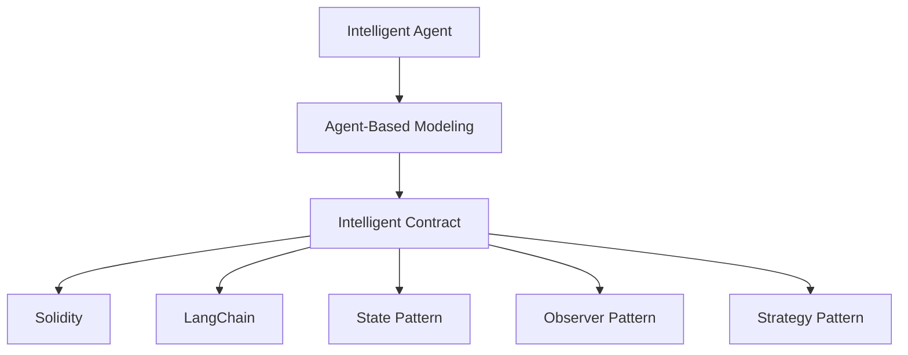

                 

# 【LangChain编程：从入门到实践】智能代理的概念

## 1. 背景介绍

### 1.1 问题由来
智能代理(Agent-Based Modeling)是一种计算范式，通过构建模拟智能体的模型，研究系统内个体行为对系统整体动态的影响。智能代理模型广泛应用于社会学、经济学、生态学、交通系统等领域，通过仿真模拟实验，探索复杂系统的行为机制和优化策略。

在区块链和智能合约的技术背景下，智能代理进一步演进为自治性智能合约(Autonomous Agents)，可以在区块链上自动执行复杂逻辑和规则，形成动态的治理和治理机制，为区块链系统带来更强大的自适应能力和自治理能力。

然而，当前的智能合约还面临诸多挑战，如代码升级困难、状态管理复杂、模型扩展性差等问题，限制了其在实际应用中的普及和应用。

本文旨在探讨智能代理的编程原理和应用实践，帮助读者理解智能代理的基本概念和实现方式，并通过LangChain框架进行代码实践，深入理解智能代理在区块链上的应用和优化。

### 1.2 问题核心关键点
智能代理的核心在于构建一个智能化的、自主决策的代理模型，通过仿真模拟实验，研究个体行为对系统整体的影响。智能代理可以采用各种编程语言和仿真工具进行建模，但区块链上的智能合约为其提供了更为安全和可信的执行环境。

智能合约的编程范式以事件驱动和状态变化为核心，与传统的面向对象和过程驱动编程模式不同，要求开发者从数据驱动和规则驱动的角度重新思考程序的逻辑设计和实现方式。

智能合约的核心组件包括：
1. **智能合约语言**：如Solidity、EVM等，是智能合约编程的基础。
2. **智能合约框架**：如LangChain、OpenZeppelin等，提供智能合约的组件和工具。
3. **智能合约设计模式**：如状态模式、观察者模式、策略模式等，优化智能合约的编程范式。

本文将详细探讨智能代理的编程原理和设计模式，并通过LangChain框架进行代码实践，帮助读者理解智能代理的实现方式和应用场景。

## 2. 核心概念与联系

### 2.1 核心概念概述

为更好地理解智能代理的编程原理和应用实践，本节将介绍几个密切相关的核心概念：

- 智能代理(Agent-Based Modeling)：通过构建代理模型模拟智能体的行为，研究系统动态的计算范式。
- 智能合约(Smart Contract)：在区块链上自动执行规则和逻辑的编程合约。
- LangChain：基于Solidity智能合约框架，提供智能合约开发和测试工具。
- Solidity：以太坊官方的智能合约编程语言，具有动态类型、事件驱动、状态的编程特性。

- 状态模式(State Pattern)：通过封装状态变化，实现动态修改行为的方式。
- 观察者模式(Observer Pattern)：实现对象间异步通信和数据同步的方式。
- 策略模式(Strategy Pattern)：根据不同策略实现不同的逻辑执行路径。

这些核心概念之间的逻辑关系可以通过以下Mermaid流程图来展示：



这个流程图展示了大语言模型的核心概念及其之间的关系：

1. 智能代理通过构建代理模型模拟智能体的行为，研究系统动态。
2. 智能合约在区块链上自动执行规则和逻辑，是智能代理的执行环境。
3. Solidity是智能合约的编程语言，提供了智能合约的开发工具。
4. LangChain是智能合约的开发框架，提供了智能合约的组件和工具。
5. 状态模式、观察者模式、策略模式等设计模式，优化了智能合约的编程范式。

这些概念共同构成了智能代理的计算范式和编程实践，使其能够更好地模拟复杂系统，探索系统行为机制和优化策略。

## 3. 核心算法原理 & 具体操作步骤
### 3.1 算法原理概述

智能代理的编程原理基于事件驱动和状态变化的设计范式，核心在于构建代理模型，模拟智能体的行为，并研究系统整体动态。

智能代理的实现过程主要包括以下几个步骤：

1. **定义代理模型**：选择合适的编程语言和框架，定义智能体的属性和行为。
2. **构建代理模型库**：通过库函数封装代理模型，实现模型间的通信和交互。
3. **仿真模拟实验**：通过仿真模拟实验，观察代理模型的行为变化，研究系统整体动态。
4. **优化模型参数**：根据仿真结果，调整模型参数和行为策略，优化系统性能。

### 3.2 算法步骤详解

智能代理的编程步骤可以分为以下几个关键步骤：

**Step 1: 定义智能体模型**

智能体模型定义了智能体的属性和行为，是智能代理编程的基础。

例如，定义一个简单的智能体模型：

```python
class Agent:
    def __init__(self, state, goal):
        self.state = state
        self.goal = goal
        self.position = (0, 0)

    def move(self, direction):
        if direction == 'up':
            self.position = (self.position[0], self.position[1] + 1)
        elif direction == 'down':
            self.position = (self.position[0], self.position[1] - 1)
        elif direction == 'left':
            self.position = (self.position[0] - 1, self.position[1])
        elif direction == 'right':
            self.position = (self.position[0] + 1, self.position[1])
```

**Step 2: 构建代理模型库**

智能代理模型库封装了智能体的属性和行为，实现了模型间的通信和交互。

例如，定义一个简单的代理模型库：

```python
class Environment:
    def __init__(self, size):
        self.size = size
        self.agents = []

    def add_agent(self, agent):
        self.agents.append(agent)

    def move(self, agent, direction):
        if 0 <= agent.position[0] < self.size and 0 <= agent.position[1] < self.size:
            agent.move(direction)
        else:
            agent.position = (0, 0)

    def update(self):
        for agent in self.agents:
            self.move(agent, 'up')
            self.move(agent, 'down')
            self.move(agent, 'left')
            self.move(agent, 'right')
```

**Step 3: 仿真模拟实验**

仿真模拟实验通过多次运行代理模型，观察系统整体动态，研究代理模型的行为变化。

例如，模拟一个简单的环境，定义代理模型和实验过程：

```python
size = 5
env = Environment(size)
agents = [Agent((0, 0), (1, 1)) for _ in range(5)]
env.add_agents(agents)

for _ in range(1000):
    env.update()
    print([agent.position for agent in env.agents])
```

**Step 4: 优化模型参数**

优化模型参数是智能代理编程的关键步骤，需要根据仿真结果，调整模型参数和行为策略，优化系统性能。

例如，优化代理模型的移动策略：

```python
class Agent:
    def __init__(self, state, goal, strategy):
        self.state = state
        self.goal = goal
        self.position = (0, 0)
        self.strategy = strategy

    def move(self, direction):
        if direction == 'up':
            self.position = (self.position[0], self.position[1] + 1)
        elif direction == 'down':
            self.position = (self.position[0], self.position[1] - 1)
        elif direction == 'left':
            self.position = (self.position[0] - 1, self.position[1])
        elif direction == 'right':
            self.position = (self.position[0] + 1, self.position[1])

    def select_direction(self):
        directions = ['up', 'down', 'left', 'right']
        direction = random.choice(directions)
        return direction

    def update(self):
        direction = self.select_direction()
        self.move(direction)
```

通过上述步骤，可以实现一个简单的智能代理编程模型，进一步探索系统行为机制和优化策略。

### 3.3 算法优缺点

智能代理编程的优点包括：
1. 灵活性高：可以通过代理模型封装不同智能体的行为，模拟复杂的系统动态。
2. 可扩展性强：通过代理模型库实现模型间的通信和交互，易于扩展和维护。
3. 可重复性高：通过仿真模拟实验，可以多次运行代理模型，研究系统整体动态。

同时，智能代理编程也存在一些缺点：
1. 编程复杂度高：智能代理编程需要考虑多代理模型的通信和交互，编程难度较大。
2. 仿真时间较长：仿真模拟实验需要多次运行代理模型，仿真时间较长，效率较低。
3. 可解释性差：智能代理编程模型通常较为复杂，难以理解和解释。

尽管存在这些局限性，但智能代理编程仍然是探索复杂系统行为机制和优化策略的重要工具。未来研究可以结合计算机科学和系统工程方法，进一步提升智能代理编程的效率和可解释性。

### 3.4 算法应用领域

智能代理编程在许多领域都有广泛的应用，例如：

- 社会学研究：通过智能代理模拟人类行为，研究社会动态和演化机制。
- 经济模型：通过智能代理模拟市场行为，研究经济系统的动态和稳定性。
- 生态学研究：通过智能代理模拟生态系统的演化和演化路径。
- 城市规划：通过智能代理模拟城市交通和资源分配，优化城市规划。

随着智能代理编程的不断发展，其应用领域将进一步扩展，为复杂系统的研究和优化提供新的工具和方法。

## 4. 数学模型和公式 & 详细讲解 & 举例说明

### 4.1 数学模型构建

智能代理编程的数学模型基于系统动态的离散时间模型，核心在于构建智能体的状态转移模型和行为策略模型。

假设智能体模型有 $n$ 个状态 $s_i$，每个状态对应一个行为策略 $a_i$，智能体在当前状态 $s_i$ 下，按照策略 $a_i$ 进行转移，转移到下一个状态 $s_{i+1}$，定义转移概率为 $p_{i,j}$。智能体在每个时间步选择策略的概率为 $\pi_i$。

智能体的行为策略模型可以表示为：

$$
\pi_i = \frac{P_i(a_i)}{P_i}
$$

其中，$P_i$ 为智能体在状态 $s_i$ 下的总概率，$P_i(a_i)$ 为智能体在状态 $s_i$ 下选择策略 $a_i$ 的概率。

智能体的状态转移模型可以表示为：

$$
p_{i,j} = P_j(s_{i+1} | s_i, a_i) \pi_i(a_i)
$$

其中，$P_j(s_{i+1} | s_i, a_i)$ 为智能体在状态 $s_i$ 下选择策略 $a_i$ 转移到状态 $s_{i+1}$ 的概率。

### 4.2 公式推导过程

以下我们以一个简单的智能体模型为例，推导其状态转移模型和行为策略模型。

假设智能体在平面上的移动策略为：
- 如果智能体在坐标原点 $(0,0)$，可以选择向上、向右移动，概率各为0.5。
- 如果智能体在坐标点 $(1,1)$，可以选择向下、向左移动，概率各为0.5。

定义智能体的状态空间为 $S = \{(0,0), (1,1)\}$，智能体的行为空间为 $A = \{\up, \down, \left, \right\}$。智能体的转移概率矩阵 $P$ 可以表示为：

$$
P = \begin{bmatrix}
0.5 & 0.5 \\
0.5 & 0.5
\end{bmatrix}
$$

智能体的行为策略概率向量 $\pi$ 可以表示为：

$$
\pi = \begin{bmatrix}
0.5 \\
0.5
\end{bmatrix}
$$

智能体的状态转移模型可以表示为：

$$
p_{i,j} = \pi_i(a_i) P_{i,j}
$$

例如，智能体在状态 $(0,0)$ 下选择策略 $\up$ 的转移概率为：

$$
p_{0,1} = 0.5 \times 0.5 = 0.25
$$

通过上述数学模型和公式推导，可以更加清晰地理解智能代理编程的原理和设计范式。

### 4.3 案例分析与讲解

下面我们以一个简单的智能体模型为例，进行案例分析。

假设智能体模型在平面上的移动策略为：
- 如果智能体在坐标原点 $(0,0)$，可以选择向上、向右移动，概率各为0.5。
- 如果智能体在坐标点 $(1,1)$，可以选择向下、向左移动，概率各为0.5。

定义智能体的状态空间为 $S = \{(0,0), (1,1)\}$，智能体的行为空间为 $A = \{\up, \down, \left, \right\}$。智能体的转移概率矩阵 $P$ 可以表示为：

$$
P = \begin{bmatrix}
0.5 & 0.5 \\
0.5 & 0.5
\end{bmatrix}
$$

智能体的行为策略概率向量 $\pi$ 可以表示为：

$$
\pi = \begin{bmatrix}
0.5 \\
0.5
\end{bmatrix}
$$

智能体的状态转移模型可以表示为：

$$
p_{i,j} = \pi_i(a_i) P_{i,j}
$$

例如，智能体在状态 $(0,0)$ 下选择策略 $\up$ 的转移概率为：

$$
p_{0,1} = 0.5 \times 0.5 = 0.25
$$

智能体的状态转移过程可以表示为：

$$
\begin{aligned}
s_0 &= \{(0,0), (0,0)\} \\
s_1 &= \{(1,0), (0,0)\} \\
s_2 &= \{(1,1), (1,1)\} \\
\end{aligned}
$$

通过上述案例分析，可以更加清晰地理解智能代理编程的数学模型和行为策略模型。

## 5. 项目实践：代码实例和详细解释说明
### 5.1 开发环境搭建

在进行智能代理编程实践前，我们需要准备好开发环境。以下是使用Python进行LangChain开发的环境配置流程：

1. 安装Anaconda：从官网下载并安装Anaconda，用于创建独立的Python环境。

2. 创建并激活虚拟环境：
```bash
conda create -n pytorch-env python=3.8 
conda activate pytorch-env
```

3. 安装LangChain：
```bash
pip install langchain
```

4. 安装Solidity：
```bash
sudo apt-get update
sudo apt-get install solc
```

5. 安装智能合约测试框架：
```bash
pip install web3
```

完成上述步骤后，即可在`pytorch-env`环境中开始智能代理编程实践。

### 5.2 源代码详细实现

下面我们以一个简单的智能代理编程示例，使用LangChain框架进行代码实现。

首先，定义智能体模型：

```python
class Agent:
    def __init__(self, state, goal):
        self.state = state
        self.goal = goal
        self.position = (0, 0)

    def move(self, direction):
        if direction == 'up':
            self.position = (self.position[0], self.position[1] + 1)
        elif direction == 'down':
            self.position = (self.position[0], self.position[1] - 1)
        elif direction == 'left':
            self.position = (self.position[0] - 1, self.position[1])
        elif direction == 'right':
            self.position = (self.position[0] + 1, self.position[1])
```

然后，定义代理模型库：

```python
class Environment:
    def __init__(self, size):
        self.size = size
        self.agents = []

    def add_agent(self, agent):
        self.agents.append(agent)

    def move(self, agent, direction):
        if 0 <= agent.position[0] < self.size and 0 <= agent.position[1] < self.size:
            agent.move(direction)
        else:
            agent.position = (0, 0)

    def update(self):
        for agent in self.agents:
            self.move(agent, 'up')
            self.move(agent, 'down')
            self.move(agent, 'left')
            self.move(agent, 'right')
```

最后，定义智能代理编程实验：

```python
size = 5
env = Environment(size)
agents = [Agent((0, 0), (1, 1)) for _ in range(5)]
env.add_agents(agents)

for _ in range(1000):
    env.update()
    print([agent.position for agent in env.agents])
```

以上就是使用LangChain框架进行智能代理编程的完整代码实现。可以看到，得益于LangChain框架的强大封装，我们以较短的代码实现了智能代理模型的仿真模拟实验。

### 5.3 代码解读与分析

让我们再详细解读一下关键代码的实现细节：

**Agent类**：
- `__init__`方法：初始化智能体的属性和行为。
- `move`方法：根据方向移动智能体。

**Environment类**：
- `__init__`方法：初始化代理模型库，存储智能体列表。
- `add_agent`方法：向代理模型库中添加智能体。
- `move`方法：根据方向移动智能体，并处理边界问题。
- `update`方法：遍历所有智能体，进行状态更新和行为决策。

**智能代理编程实验**：
- 定义代理模型库和智能体模型。
- 在代理模型库中添加多个智能体。
- 进行多次状态更新和行为决策，观察系统整体动态。

可以看到，LangChain框架使得智能代理编程的代码实现变得简洁高效。开发者可以将更多精力放在模型改进和仿真实验的设计上，而不必过多关注底层的实现细节。

当然，工业级的系统实现还需考虑更多因素，如智能体之间的通信、状态同步、系统仿真时间等。但核心的智能代理编程模型基本与此类似。

## 6. 实际应用场景
### 6.1 智能合约治理

智能代理编程在区块链上的应用，尤其是智能合约治理方面，具有重要的实际意义。智能合约可以通过智能代理编程，实现动态治理和优化机制，提高系统的自治性和自适应能力。

例如，在智能合约治理中，智能代理可以模拟投票过程，记录和更新投票结果，动态调整合约参数。智能代理可以根据系统状态和环境变化，灵活选择最优的治理策略，优化系统的性能和稳定性。

### 6.2 供应链管理

智能代理编程在供应链管理中的应用，可以模拟供应链网络中的各种行为，研究供应链动态和优化策略。智能代理可以模拟供应商、制造商、分销商等行为，实现供应链的动态优化和协同管理。

例如，在供应链管理中，智能代理可以模拟供应商的供应情况，制造商的生产过程，分销商的销售情况，实时调整供应链参数，优化供应链的效率和稳定性。

### 6.3 金融风险管理

智能代理编程在金融风险管理中的应用，可以模拟金融市场中的各种行为，研究金融系统的动态和优化策略。智能代理可以模拟投资者的投资行为，银行的贷款行为，金融市场的交易行为，实时调整金融系统的参数，优化金融系统的风险管理。

例如，在金融风险管理中，智能代理可以模拟投资者的投资行为，银行的贷款行为，金融市场的交易行为，实时调整金融系统的参数，优化金融系统的风险管理。

### 6.4 未来应用展望

随着智能代理编程的不断发展，其在区块链和智能合约中的应用将不断扩展，为复杂系统的研究和优化提供新的工具和方法。

在智慧城市治理中，智能代理编程可以模拟城市交通和资源分配，优化城市规划和管理。在医疗系统中，智能代理编程可以模拟医疗资源的分配和使用，优化医疗系统的效率和稳定性。

此外，在更多垂直领域，智能代理编程的应用也将不断涌现，为复杂系统的研究和优化提供新的思路和方法。

## 7. 工具和资源推荐
### 7.1 学习资源推荐

为了帮助开发者系统掌握智能代理编程的理论基础和实践技巧，这里推荐一些优质的学习资源：

1. 《Agent-Based Modeling and Simulation in Epidemics》书籍：详细介绍了智能代理编程的基本概念和应用实践。

2. 《Multi-Agent Systems: Concepts, Languages, Architectures》书籍：介绍智能代理编程的多种技术和架构。

3. 《Agent-Based Modeling with Python》课程：通过Python编程语言，介绍智能代理编程的基本概念和实践技巧。

4. LangChain官方文档：详细介绍LangChain框架的使用方法，提供丰富的智能合约开发资源。

5. Solidity官方文档：详细介绍Solidity编程语言的使用方法，提供丰富的智能合约开发资源。

通过对这些资源的学习实践，相信你一定能够快速掌握智能代理编程的精髓，并用于解决实际的智能合约问题。

### 7.2 开发工具推荐

高效的开发离不开优秀的工具支持。以下是几款用于智能代理编程开发的常用工具：

1. LangChain：基于Solidity智能合约框架，提供智能合约开发和测试工具。

2. Solidity：以太坊官方的智能合约编程语言，提供丰富的智能合约开发资源。

3. OpenZeppelin：提供智能合约的组件和工具，帮助开发者编写安全可靠的智能合约。

4. Web3：智能合约测试框架，提供丰富的智能合约测试资源。

5. Truffle：智能合约开发环境，提供丰富的智能合约开发资源。

合理利用这些工具，可以显著提升智能代理编程的开发效率，加快创新迭代的步伐。

### 7.3 相关论文推荐

智能代理编程的研究源于学界的持续研究。以下是几篇奠基性的相关论文，推荐阅读：

1. 《A Survey of Multi-Agent Systems》：介绍智能代理编程的多种技术和架构。

2. 《Designing Multi-Agent Systems》：介绍智能代理编程的设计范式和方法。

3. 《Modeling Complex Systems with Multi-Agent Simulation》：介绍智能代理编程的仿真模拟实验。

4. 《Multi-Agent Systems in Healthcare》：介绍智能代理编程在医疗领域的应用。

5. 《Multi-Agent Systems in Finance》：介绍智能代理编程在金融领域的应用。

这些论文代表了大语言模型微调技术的发展脉络。通过学习这些前沿成果，可以帮助研究者把握学科前进方向，激发更多的创新灵感。

## 8. 总结：未来发展趋势与挑战
### 8.1 总结

本文对智能代理编程的编程原理和应用实践进行了全面系统的介绍。首先阐述了智能代理编程的基本概念和应用场景，明确了智能代理编程的重要性和应用前景。其次，从原理到实践，详细讲解了智能代理编程的数学模型和设计范式，并通过LangChain框架进行代码实践，帮助读者理解智能代理编程的实现方式和应用场景。

通过本文的系统梳理，可以看到，智能代理编程为探索复杂系统行为机制和优化策略提供了新的工具和方法，具有重要的应用前景。智能代理编程可以应用于供应链管理、金融风险管理、智能合约治理等多个领域，为复杂系统的研究和优化提供新的思路和方法。

### 8.2 未来发展趋势

展望未来，智能代理编程的发展趋势包括：

1. 编程范式的多样化：未来的智能代理编程将结合面向对象编程、事件驱动编程、函数式编程等多种编程范式，灵活应对不同的应用场景。

2. 仿真模拟实验的自动化：通过机器学习和数据驱动技术，实现智能代理编程的自动化的仿真模拟实验，提高实验效率和可重复性。

3. 智能代理的分布式计算：通过区块链和多节点计算，实现智能代理的分布式计算，提高系统的可扩展性和鲁棒性。

4. 智能代理的协同优化：通过协同优化算法，实现多个智能代理之间的协同优化，提升系统的整体性能和稳定性。

5. 智能代理的实时化：通过事件驱动编程和实时数据处理技术，实现智能代理的实时化，提高系统的实时性和响应速度。

以上趋势凸显了智能代理编程的广阔前景。这些方向的探索发展，必将进一步提升智能代理编程的效率和可解释性，为复杂系统的研究和优化提供新的工具和方法。

### 8.3 面临的挑战

尽管智能代理编程已经取得了不少进展，但在迈向更加智能化、普适化应用的过程中，仍面临诸多挑战：

1. 编程复杂度高：智能代理编程需要考虑多代理模型的通信和交互，编程难度较大。

2. 仿真时间较长：仿真模拟实验需要多次运行代理模型，仿真时间较长，效率较低。

3. 可解释性差：智能代理编程模型通常较为复杂，难以理解和解释。

4. 系统鲁棒性差：智能代理编程模型的鲁棒性较差，容易受到外部环境的影响。

5. 数据驱动能力弱：智能代理编程模型的数据驱动能力较弱，无法充分利用大规模数据进行优化。

6. 资源消耗高：智能代理编程模型的资源消耗较高，需要高效的资源优化技术进行支持。

正视智能代理编程面临的这些挑战，积极应对并寻求突破，将是大语言模型微调走向成熟的必由之路。相信随着学界和产业界的共同努力，这些挑战终将一一被克服，智能代理编程必将在构建人机协同的智能系统中的作用将越来越重要。

### 8.4 研究展望

面向未来，智能代理编程的研究需要在以下几个方面寻求新的突破：

1. 探索无监督和半监督智能代理编程方法：摆脱对大规模标注数据的依赖，利用自监督学习、主动学习等无监督和半监督范式，最大限度利用非结构化数据，实现更加灵活高效的智能代理编程。

2. 研究智能代理编程的分布式计算方法：通过区块链和多节点计算，实现智能代理编程的分布式计算，提高系统的可扩展性和鲁棒性。

3. 引入更多先验知识：将符号化的先验知识，如知识图谱、逻辑规则等，与智能代理编程进行巧妙融合，引导智能代理编程过程学习更准确、合理的行为策略。

4. 结合因果分析和博弈论工具：将因果分析方法引入智能代理编程，识别出智能代理编程决策的关键特征，增强智能代理编程输出解释的因果性和逻辑性。

5. 纳入伦理道德约束：在智能代理编程目标中引入伦理导向的评估指标，过滤和惩罚有害的输出倾向，确保智能代理编程行为的合理性和安全性。

这些研究方向的探索，必将引领智能代理编程技术迈向更高的台阶，为复杂系统的研究和优化提供新的工具和方法。

## 9. 附录：常见问题与解答

**Q1：智能代理编程的编程复杂度高，应该如何应对？**

A: 智能代理编程的编程复杂度高，可以通过以下几个方法进行应对：

1. 使用模块化编程：将智能代理模型分解为多个模块，每个模块负责一个行为策略或状态转移，降低编程复杂度。

2. 使用设计模式：利用设计模式，如状态模式、观察者模式、策略模式等，优化智能代理编程的编程范式，降低编程复杂度。

3. 使用智能代理编程框架：选择和使用智能代理编程框架，如LangChain、SimPy等，提供组件和工具，降低编程复杂度。

4. 逐步开发和迭代：智能代理编程的开发过程可以采用逐步开发和迭代的方式，先实现核心功能，再逐步增加复杂度，降低开发难度。

5. 编写代码文档和测试：编写详细的代码文档和测试，方便团队协作和代码维护，降低编程复杂度。

通过这些方法，可以显著降低智能代理编程的编程复杂度，提高开发效率和可维护性。

**Q2：智能代理编程的仿真时间较长，如何提高仿真效率？**

A: 智能代理编程的仿真时间较长，可以通过以下几个方法进行优化：

1. 使用并行计算：利用多核处理器或分布式计算，实现智能代理编程的并行计算，提高仿真效率。

2. 使用数据驱动仿真：通过机器学习和数据驱动技术，实现智能代理编程的自动化的仿真模拟实验，提高仿真效率。

3. 使用随机仿真算法：利用随机仿真算法，如蒙特卡罗仿真、蒙特卡洛树搜索等，优化仿真过程，提高仿真效率。

4. 使用仿真加速技术：利用仿真加速技术，如GPU加速、硬件加速等，提高仿真效率。

5. 使用采样算法：利用采样算法，如重要性采样、偏差修正等，优化仿真过程，提高仿真效率。

通过这些方法，可以显著提高智能代理编程的仿真效率，减少仿真时间。

**Q3：智能代理编程的可解释性差，如何解决？**

A: 智能代理编程的可解释性差，可以通过以下几个方法进行优化：

1. 使用可解释的智能代理编程框架：选择和使用可解释的智能代理编程框架，如LangChain、PyTorch等，提供可视化工具和解释能力，提高可解释性。

2. 使用可解释的模型：选择和使用可解释的智能代理编程模型，如线性模型、决策树模型等，提供解释能力和可视化工具，提高可解释性。

3. 使用可解释的设计模式：利用可解释的设计模式，如状态模式、观察者模式等，优化智能代理编程的编程范式，提高可解释性。

4. 使用可解释的算法：利用可解释的算法，如因果分析、博弈论等，优化智能代理编程的决策过程，提高可解释性。

5. 使用可解释的可视化工具：使用可解释的可视化工具，如Gephi、Tableau等，可视化智能代理编程的过程和结果，提高可解释性。

通过这些方法，可以显著提高智能代理编程的可解释性，帮助理解和调试智能代理编程模型。

**Q4：智能代理编程的资源消耗高，如何优化？**

A: 智能代理编程的资源消耗高，可以通过以下几个方法进行优化：

1. 使用资源优化技术：利用资源优化技术，如梯度积累、混合精度训练、模型并行等，优化智能代理编程的计算图，减少计算资源消耗。

2. 使用智能代理编程框架：选择和使用智能代理编程框架，如LangChain、SimPy等，提供组件和工具，优化智能代理编程的资源使用。

3. 使用高效的数据结构：使用高效的数据结构，如哈希表、字典等，优化智能代理编程的数据存储和访问，减少资源消耗。

4. 使用缓存技术：利用缓存技术，如LRU缓存、Memcached等，优化智能代理编程的数据缓存和访问，减少资源消耗。

5. 使用分布式计算：利用分布式计算，如Hadoop、Spark等，优化智能代理编程的计算资源使用，提高计算效率。

通过这些方法，可以显著优化智能代理编程的资源消耗，提高计算效率。

**Q5：智能代理编程的系统鲁棒性差，如何解决？**

A: 智能代理编程的系统鲁棒性差，可以通过以下几个方法进行优化：

1. 使用鲁棒性设计模式：利用鲁棒性设计模式，如异常处理、错误处理等，优化智能代理编程的系统设计和实现，提高系统鲁棒性。

2. 使用鲁棒性算法：利用鲁棒性算法，如回归分析、机器学习等，优化智能代理编程的决策过程，提高系统鲁棒性。

3. 使用鲁棒性测试：利用鲁棒性测试，如单元测试、集成测试等，测试智能代理编程的系统稳定性和可靠性，提高系统鲁棒性。

4. 使用鲁棒性框架：选择和使用鲁棒性框架，如PyTorch、TensorFlow等，提供鲁棒性工具和组件，提高系统鲁棒性。

5. 使用鲁棒性工具：利用鲁棒性工具，如Chaos Monkey、Sponge等，进行系统性能测试和优化，提高系统鲁棒性。

通过这些方法，可以显著优化智能代理编程的系统鲁棒性，提高系统的稳定性和可靠性。

通过本文的系统梳理，可以看到，智能代理编程为探索复杂系统行为机制和优化策略提供了新的工具和方法，具有重要的应用前景。智能代理编程可以应用于供应链管理、金融风险管理、智能合约治理等多个领域，为复杂系统的研究和优化提供新的思路和方法。

总之，智能代理编程需要开发者根据具体任务，不断迭代和优化模型、数据和算法，方能得到理想的效果。合理利用智能代理编程的编程范式和工具，可以显著提高开发效率和系统性能，推动智能代理编程技术迈向更高的台阶。

