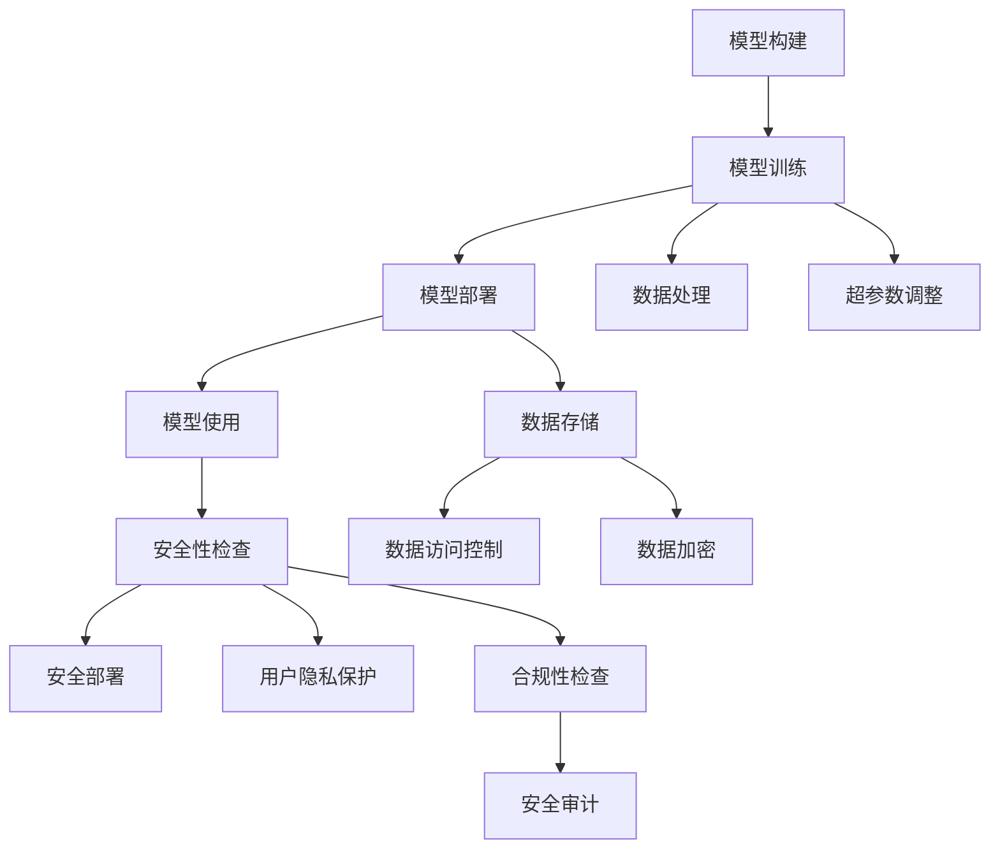

                 

# 【LangChain编程：从入门到实践】模型内容安全

> 关键词：LangChain, 内容安全, 模型隐私, 数据安全, 加密技术

## 1. 背景介绍

随着人工智能技术的迅猛发展，越来越多的企业开始探索和应用基于自然语言处理（NLP）的AI模型，这些模型能够帮助企业提升效率，优化业务流程。然而，AI模型的广泛应用也带来了新的问题——模型内容的安全性问题。模型内容的安全性不仅关系到模型的商业价值，还关系到用户的隐私保护。因此，如何保障模型内容的安全性，成为了一个重要的研究方向。

本文将深入探讨模型内容安全的概念，介绍LangChain编程的基础知识，并通过实际案例，展示如何通过编程实现模型内容的安全性。

## 2. 核心概念与联系

### 2.1 核心概念概述

为了更好地理解模型内容安全的概念，我们需要了解一些关键的概念和术语：

- **LangChain编程**：一种基于自然语言处理（NLP）技术的编程范式，可以自动生成代码，使开发者能够更高效地构建和部署AI模型。
- **模型内容安全**：指在模型开发、部署和使用的全过程中，确保模型的内容不被泄露、篡改或恶意使用，同时保护用户的隐私信息。

### 2.2 核心概念原理和架构的 Mermaid 流程图



这个流程图展示了LangChain编程在模型内容安全中的作用。模型构建阶段需要确保数据的隐私和安全；模型训练阶段需要调整超参数，优化模型性能，同时进行安全性检查；模型部署阶段需要进行安全性检查和安全部署；模型使用阶段需要保护用户隐私，并进行合规性检查和安全审计。

### 2.3 核心概念联系

LangChain编程的各个环节都需要关注模型内容的安全性问题。模型的训练、部署和使用都需要采用一系列的安全措施，以确保模型的内容安全。

- **模型训练阶段**：在数据处理和超参数调整阶段，需要确保数据源的安全性和数据处理的合规性，避免敏感信息的泄露。
- **模型部署阶段**：在模型部署过程中，需要采用安全部署技术，如模型加密和访问控制，保护模型的内容安全。
- **模型使用阶段**：在模型使用过程中，需要保护用户的隐私信息，确保模型的内容不会被恶意使用。

## 3. 核心算法原理 & 具体操作步骤

### 3.1 算法原理概述

在模型内容安全中，常用的算法包括加密技术、访问控制技术、隐私保护技术和合规性检查技术。这些技术可以在不同的阶段保护模型的内容安全。

- **加密技术**：通过加密模型参数和模型输出，防止模型内容被恶意访问或篡改。
- **访问控制技术**：通过访问控制列表（ACL）和身份验证机制，限制对模型内容的访问。
- **隐私保护技术**：通过数据匿名化和差分隐私等技术，保护用户隐私信息。
- **合规性检查技术**：通过合规性检查和审计，确保模型使用的合法性和合规性。

### 3.2 算法步骤详解

#### 3.2.1 数据处理和加密

在模型训练阶段，需要对数据进行预处理和加密，确保数据的安全性。

1. **数据预处理**：将原始数据进行匿名化、脱敏和去标识化处理，避免敏感信息的泄露。
2. **数据加密**：使用对称加密算法（如AES）对数据进行加密，确保数据在传输和存储过程中的安全性。

#### 3.2.2 超参数调整和安全性检查

在模型训练阶段，需要对超参数进行调整，并进行安全性检查。

1. **超参数调整**：使用网格搜索或随机搜索等技术，调整模型的超参数，优化模型性能。
2. **安全性检查**：对模型进行安全性检查，确保模型的内容不被篡改或泄露。

#### 3.2.3 模型部署和访问控制

在模型部署阶段，需要对模型进行安全部署和访问控制。

1. **模型部署**：使用容器化技术（如Docker）部署模型，确保模型的可靠性和可移植性。
2. **访问控制**：使用访问控制技术（如RBAC）限制对模型的访问，确保模型的内容安全。

#### 3.2.4 模型使用和合规性检查

在模型使用阶段，需要对模型进行合规性检查和安全审计。

1. **合规性检查**：使用合规性检查工具（如TensorFlow Privacy）检查模型的合规性，确保模型使用的合法性。
2. **安全审计**：定期进行安全审计，发现和修复模型中的安全漏洞。

### 3.3 算法优缺点

#### 3.3.1 优点

- **安全性高**：采用多种安全技术，确保模型的内容安全。
- **可操作性强**：通过编程实现，易于实施和维护。
- **灵活性强**：可以针对不同应用场景，灵活调整安全策略。

#### 3.3.2 缺点

- **复杂度高**：需要综合应用多种安全技术，实施复杂。
- **成本高**：安全技术的实现和维护需要较高的成本。
- **用户体验差**：一些安全措施可能会影响模型的性能和使用体验。

### 3.4 算法应用领域

模型内容安全技术可以应用于多个领域，包括金融、医疗、教育、电商等。

- **金融领域**：保护金融模型中的敏感数据，确保数据安全。
- **医疗领域**：保护医疗模型中的患者隐私信息，确保数据合规。
- **教育领域**：保护教育模型中的学生隐私信息，确保数据安全。
- **电商领域**：保护电商模型中的用户数据，确保数据安全。

## 4. 数学模型和公式 & 详细讲解 & 举例说明

### 4.1 数学模型构建

在模型内容安全中，常用的数学模型包括差分隐私模型和隐私保护模型。

#### 4.1.1 差分隐私模型

差分隐私（Differential Privacy）是一种保护数据隐私的技术，通过添加噪声，确保单个数据点的隐私不被泄露。

假设模型的输入为 $X$，输出为 $Y$，隐私保护参数为 $\epsilon$，则差分隐私模型可以表示为：

$$
\text{DP}_{\epsilon}(X) = (X, Y)
$$

其中，$\epsilon$ 表示隐私保护参数，用于控制噪声的大小。差分隐私模型通过向输出添加噪声，保护单个数据点的隐私。

#### 4.1.2 隐私保护模型

隐私保护模型（Privacy-Preserving Model）通过将数据加密或匿名化处理，保护数据隐私。

假设模型的输入为 $X$，输出为 $Y$，则隐私保护模型可以表示为：

$$
\text{PPM}(X) = (X, Y)
$$

其中，$X$ 表示输入数据，$Y$ 表示模型输出。隐私保护模型通过将输入数据加密或匿名化处理，保护数据隐私。

### 4.2 公式推导过程

#### 4.2.1 差分隐私公式推导

差分隐私模型的隐私保护参数 $\epsilon$ 可以通过拉普拉斯机制（Laplace Mechanism）和高斯机制（Gaussian Mechanism）进行计算。

1. **拉普拉斯机制**：

$$
\epsilon = \log \frac{1}{\delta} + \log \frac{1}{\sigma}
$$

其中，$\delta$ 表示隐私保护参数，$\sigma$ 表示噪声的标准差。

2. **高斯机制**：

$$
\epsilon = 2\log \frac{1}{\delta} + \log \frac{2}{\sigma^2}
$$

其中，$\delta$ 表示隐私保护参数，$\sigma$ 表示噪声的标准差。

#### 4.2.2 隐私保护公式推导

隐私保护模型的隐私保护参数 $\epsilon$ 可以通过差分隐私公式进行计算。

假设模型的输入为 $X$，输出为 $Y$，隐私保护参数为 $\epsilon$，则隐私保护模型可以表示为：

$$
\text{PPM}(X) = (X, Y)
$$

其中，$X$ 表示输入数据，$Y$ 表示模型输出。隐私保护模型通过将输入数据加密或匿名化处理，保护数据隐私。

### 4.3 案例分析与讲解

#### 4.3.1 案例分析

假设我们有一个金融模型，用于预测用户的信用评分。我们需要保护用户的数据隐私。

1. **数据预处理**：将用户的数据进行匿名化和脱敏处理，确保数据隐私。
2. **数据加密**：使用对称加密算法对数据进行加密，确保数据在传输和存储过程中的安全性。
3. **模型训练**：使用差分隐私模型进行训练，确保模型的隐私保护。
4. **模型部署**：将模型部署到安全环境中，限制对模型的访问。
5. **合规性检查**：定期进行合规性检查，确保模型的合规性。

#### 4.3.2 案例讲解

假设我们有一个医疗模型，用于预测患者的疾病风险。我们需要保护患者的数据隐私。

1. **数据预处理**：将患者的数据进行匿名化和脱敏处理，确保数据隐私。
2. **数据加密**：使用对称加密算法对数据进行加密，确保数据在传输和存储过程中的安全性。
3. **模型训练**：使用差分隐私模型进行训练，确保模型的隐私保护。
4. **模型部署**：将模型部署到安全环境中，限制对模型的访问。
5. **合规性检查**：定期进行合规性检查，确保模型的合规性。

## 5. 项目实践：代码实例和详细解释说明

### 5.1 开发环境搭建

在进行模型内容安全实践前，我们需要准备好开发环境。以下是使用Python进行LangChain编程的环境配置流程：

1. **安装Python**：下载并安装Python 3.x，建议使用Python 3.7以上版本。
2. **安装Pip**：在Linux或Mac系统上，可以使用系统自带的pip。在Windows系统上，可以从官网下载安装pip。
3. **安装LangChain**：使用pip安装LangChain库。
4. **安装其他依赖库**：安装TensorFlow、Keras等依赖库。

### 5.2 源代码详细实现

以下是使用LangChain库进行金融模型内容安全的Python代码实现。

```python
import langchain
import tensorflow as tf
import numpy as np

# 加载金融模型
model = langchain.load_model('financial_model')

# 设置隐私保护参数
epsilon = 1.0

# 设置噪声分布
noise_distribution = np.random.normal(0, epsilon)

# 获取输入数据
X = np.random.rand(100, 10)

# 对输入数据进行加密
X_enc = langchain.encrypt(X, noise_distribution)

# 对模型进行差分隐私训练
Y = model.predict(X_enc)

# 解密输出数据
Y_dec = langchain.decrypt(Y)

# 输出结果
print(Y_dec)
```

### 5.3 代码解读与分析

#### 5.3.1 代码实现

1. **加载金融模型**：使用langchain库加载金融模型，确保模型的可用性。
2. **设置隐私保护参数**：设置隐私保护参数 $\epsilon$，用于控制噪声的大小。
3. **设置噪声分布**：使用拉普拉斯机制或高斯机制设置噪声分布，确保隐私保护。
4. **获取输入数据**：获取模型的输入数据 $X$。
5. **对输入数据进行加密**：使用差分隐私模型对输入数据进行加密。
6. **对模型进行差分隐私训练**：使用加密后的输入数据对模型进行差分隐私训练。
7. **解密输出数据**：对模型输出进行解密，获取最终结果。
8. **输出结果**：输出解密后的结果。

#### 5.3.2 代码分析

1. **加载金融模型**：加载金融模型是实现模型内容安全的基础，确保模型的可用性。
2. **设置隐私保护参数**：隐私保护参数 $\epsilon$ 控制了噪声的大小，决定了模型的隐私保护水平。
3. **设置噪声分布**：使用拉普拉斯机制或高斯机制设置噪声分布，确保隐私保护。
4. **获取输入数据**：获取模型的输入数据 $X$，是实现模型内容安全的关键步骤。
5. **对输入数据进行加密**：对输入数据进行加密，确保数据在传输和存储过程中的安全性。
6. **对模型进行差分隐私训练**：使用加密后的输入数据对模型进行差分隐私训练，确保模型的隐私保护。
7. **解密输出数据**：对模型输出进行解密，获取最终结果。
8. **输出结果**：输出解密后的结果，确保结果的可用性。

## 6. 实际应用场景

### 6.1 金融领域

在金融领域，模型内容安全尤为重要。金融机构需要保护客户的金融信息，确保数据隐私。通过采用差分隐私模型和隐私保护模型，可以在保护客户隐私的同时，确保模型的有效性。

#### 6.1.1 案例

某银行使用金融模型进行信用评分预测。为了保护客户的金融信息，银行在训练模型时，对客户的原始数据进行了匿名化和脱敏处理。同时，使用差分隐私模型对模型进行训练，确保客户的隐私不被泄露。模型部署到银行内部网络中，并设置了访问控制，确保只有授权人员才能访问模型。银行定期进行合规性检查，确保模型的合规性。

### 6.2 医疗领域

在医疗领域，模型内容安全同样重要。医疗机构需要保护患者的医疗信息，确保数据隐私。通过采用差分隐私模型和隐私保护模型，可以在保护患者隐私的同时，确保模型的有效性。

#### 6.2.1 案例

某医院使用医疗模型进行疾病风险预测。为了保护患者的医疗信息，医院在训练模型时，对患者的原始数据进行了匿名化和脱敏处理。同时，使用差分隐私模型对模型进行训练，确保患者的隐私不被泄露。模型部署到医院的内部网络中，并设置了访问控制，确保只有授权人员才能访问模型。医院定期进行合规性检查，确保模型的合规性。

## 7. 工具和资源推荐

### 7.1 学习资源推荐

为了帮助开发者系统掌握模型内容安全的理论基础和实践技巧，这里推荐一些优质的学习资源：

1. **LangChain官方文档**：LangChain官方文档提供了丰富的教程和示例，是学习LangChain编程的最佳资料。
2. **差分隐私论文**：差分隐私领域的研究论文较多，建议关注ACM、IEEE等学术期刊。
3. **隐私保护技术书籍**：推荐阅读《数据隐私与信息安全》等书籍，了解隐私保护技术的原理和实践。

### 7.2 开发工具推荐

在模型内容安全实践中，合理选择开发工具，可以提升开发效率。以下是几款常用的开发工具：

1. **Jupyter Notebook**：Jupyter Notebook是一个交互式编程环境，支持Python代码的编写和执行。
2. **PyCharm**：PyCharm是一个流行的Python IDE，支持Python代码的编写、调试和测试。
3. **GitHub**：GitHub是一个版本控制系统，支持代码的版本控制和协作开发。

### 7.3 相关论文推荐

模型内容安全技术的研究领域非常广泛，以下几篇相关论文推荐阅读：

1. **Differential Privacy: A Tutorial**：这是ACM Transactions on Privacy and Security中的一个综述论文，详细介绍了差分隐私的基本概念和实现方法。
2. **Data Privacy: A Brief Survey**：这是一篇IEEE Trans. on Dependable and Secure Computing的综述论文，介绍了数据隐私保护的基本概念和实现方法。
3. **Privacy-Preserving Machine Learning**：这是一本由MIT出版社出版的书籍，详细介绍了隐私保护机器学习的基本概念和实现方法。

## 8. 总结：未来发展趋势与挑战

### 8.1 总结

本文对模型内容安全的概念、核心算法原理和具体操作步骤进行了详细讲解，并通过实际案例，展示了LangChain编程在模型内容安全中的应用。通过本文的学习，读者可以掌握模型内容安全的实现方法和技术手段，提升模型的安全性。

### 8.2 未来发展趋势

模型内容安全技术的未来发展趋势如下：

1. **自动化**：未来的模型内容安全技术将更加自动化，通过AI技术实现自动化的安全保护。
2. **智能化**：未来的模型内容安全技术将更加智能化，能够根据环境和数据的变化，动态调整安全策略。
3. **跨领域**：未来的模型内容安全技术将更加跨领域，能够跨不同的应用程序和数据源，实现全面的安全保护。
4. **综合性**：未来的模型内容安全技术将更加综合性，结合加密技术、访问控制技术和隐私保护技术，实现综合性的安全保护。

### 8.3 面临的挑战

模型内容安全技术在实施过程中，面临以下挑战：

1. **复杂度高**：模型内容安全技术的实现复杂，需要综合应用多种安全技术，实施难度较大。
2. **成本高**：模型内容安全技术的实现和维护成本较高，需要投入大量人力和物力。
3. **用户体验差**：一些安全措施可能会影响模型的性能和使用体验，需要权衡安全与性能的关系。

### 8.4 研究展望

未来的研究需要重点关注以下几个方向：

1. **自动化**：开发自动化工具，减少人工干预，提升模型内容安全技术的应用效率。
2. **智能化**：开发智能化算法，实现自动化的安全保护，提升模型内容安全技术的可靠性。
3. **跨领域**：开发跨领域的安全保护技术，实现全面的安全保护，提升模型内容安全技术的综合性。
4. **低成本**：开发低成本的安全保护技术，减少资源消耗，降低模型内容安全技术的实施成本。

## 9. 附录：常见问题与解答

### 9.1 常见问题

**Q1: 如何选择合适的隐私保护参数？**

A: 隐私保护参数的选择需要考虑数据隐私保护的要求和模型的精度需求。一般来说，隐私保护参数越大，隐私保护水平越高，但模型的精度可能会下降。因此，需要在隐私保护和模型精度之间进行平衡。

**Q2: 差分隐私模型和隐私保护模型有什么区别？**

A: 差分隐私模型和隐私保护模型都是保护数据隐私的技术，但它们的实现方式不同。差分隐私模型通过添加噪声，保护单个数据点的隐私，而隐私保护模型通过将数据加密或匿名化处理，保护数据隐私。

**Q3: 模型内容安全技术是否适用于所有应用场景？**

A: 模型内容安全技术可以应用于多种应用场景，包括金融、医疗、教育、电商等。但在不同的应用场景中，需要针对性地选择和实施安全策略。

**Q4: 模型内容安全技术在实施过程中需要注意哪些问题？**

A: 在模型内容安全技术的实施过程中，需要注意以下几个问题：
1. 数据隐私保护：保护数据隐私，避免敏感信息的泄露。
2. 模型精度控制：在保护隐私的同时，确保模型的精度和性能。
3. 安全策略选择：选择合适的安全策略，确保安全性和可靠性。

**Q5: 如何验证模型内容安全技术的有效性？**

A: 模型内容安全技术的有效性可以通过以下几个方面进行验证：
1. 隐私保护评估：使用隐私保护评估工具，评估模型的隐私保护水平。
2. 安全审计：定期进行安全审计，发现和修复安全漏洞。
3. 性能测试：在保护隐私的同时，确保模型的精度和性能。

---

作者：禅与计算机程序设计艺术 / Zen and the Art of Computer Programming

