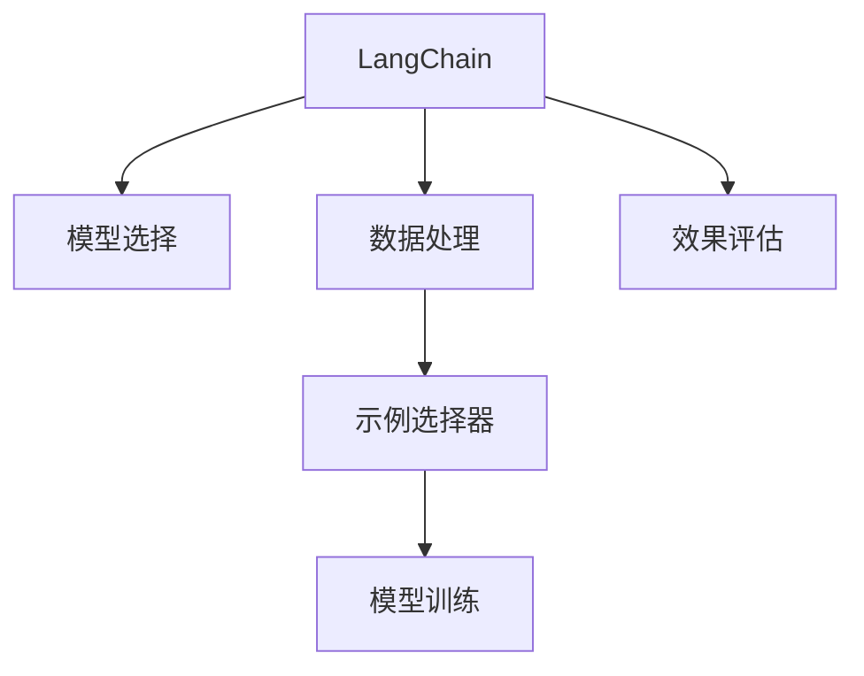

                 

# 【LangChain编程：从入门到实践】示例选择器

> 关键词：LangChain, 示例选择器, 编程, 自然语言处理(NLP), 语言模型, 语言链, 编程语言, 开发环境, 实践指南

## 1. 背景介绍

### 1.1 问题由来

在当今数据驱动的AI时代，自然语言处理（NLP）技术成为了连接人与机器、机器与机器的关键纽带。随着技术的不断演进，NLP领域出现了许多令人瞩目的进展，如Transformer模型、BERT、GPT等大语言模型。这些模型通过大规模预训练，已经具备了强大的语言理解和生成能力。

然而，面对具体的应用场景，选择最合适的模型和编写高效的程序成为了一个难题。这不仅需要开发者对NLP技术有深入的了解，还需要具备一定的编程能力。为了帮助初学者快速上手，本文将介绍一种基于LangChain的示例选择器，通过代码示例、技术解析等形式，展示如何使用LangChain构建自然语言处理应用。

### 1.2 问题核心关键点

本节将简要阐述示例选择器在LangChain中的作用及其实现思路：

- **选择器**：用于从多个示例中筛选出符合需求的示例，辅助模型训练和优化。
- **LangChain**：一个基于Python的NLP开发框架，支持多种模型和库，提供便捷的API。
- **代码实现**：通过编写Python代码，实现示例选择器的功能。
- **模型训练**：利用示例选择器筛选出的数据，训练和优化自然语言模型。
- **效果评估**：通过评估指标，检验模型性能，并进行必要的调整。

## 2. 核心概念与联系

### 2.1 核心概念概述

在深入讨论示例选择器之前，我们需要先理解几个关键概念：

- **自然语言处理（NLP）**：研究计算机如何理解、处理和生成人类语言。
- **Transformer模型**：一种基于自注意力机制的神经网络结构，常用于NLP任务。
- **BERT**：一种预训练语言模型，通过大量无标签文本数据预训练，用于各种NLP任务的微调。
- **LangChain**：基于Python的NLP开发框架，支持多种模型和库，提供便捷的API。
- **示例选择器**：一种机制，用于从大量文本中筛选出最相关的示例，辅助模型训练。

这些概念之间的联系可以通过以下Mermaid流程图来展示：



这个流程图展示出LangChain和示例选择器在模型训练和优化中的作用：

1. LangChain框架用于提供各种模型和库，辅助模型训练和优化。
2. 数据处理是数据预处理的过程，包括分词、向量转换等。
3. 示例选择器用于筛选出最相关的示例，辅助模型训练。
4. 模型训练使用筛选出的数据，训练和优化模型。
5. 效果评估用于检验模型性能，并进行必要的调整。

## 3. 核心算法原理 & 具体操作步骤

### 3.1 算法原理概述

基于LangChain的示例选择器，其核心算法原理是：

1. **数据预处理**：对输入的文本数据进行分词、向量化等预处理操作，生成模型可以处理的格式。
2. **相似性计算**：计算每个示例与目标任务的相关度，选择最相关的示例作为训练数据。
3. **模型训练**：使用筛选出的示例，训练自然语言模型，并进行优化。
4. **效果评估**：使用预设的评估指标，评估模型性能，并进行必要的调整。

### 3.2 算法步骤详解

下面是基于LangChain的示例选择器的详细步骤：

1. **数据预处理**：使用LangChain提供的`Tokenizer`模块，将文本数据分词并转换为向量表示。
2. **相似性计算**：使用余弦相似度或欧式距离等算法，计算每个示例与目标任务的相关度。
3. **示例选择**：根据相似度计算结果，选择最相关的示例作为训练数据。
4. **模型训练**：使用训练数据，训练自然语言模型，并使用优化器进行优化。
5. **效果评估**：使用预设的评估指标，如准确率、召回率等，评估模型性能。
6. **参数调整**：根据效果评估结果，调整模型参数，进行多次迭代训练。

### 3.3 算法优缺点

基于LangChain的示例选择器具有以下优点：

1. **简单易用**：通过API接口，可以便捷地实现示例选择和模型训练，降低编程难度。
2. **泛化能力强**：能够从大规模文本数据中筛选出最相关的示例，提升模型泛化能力。
3. **灵活性高**：支持多种模型和库，可以灵活选择不同的算法和参数。

同时，该算法也存在一些缺点：

1. **数据依赖**：示例选择器的性能依赖于输入数据的质量和相关性，如果数据不够丰富，可能会导致选择偏差。
2. **计算成本高**：在大规模数据集上计算相似性需要大量计算资源。
3. **复杂度高**：需要设计合适的相似度计算方法，可能增加算法复杂度。

### 3.4 算法应用领域

基于LangChain的示例选择器，可以应用于多种NLP任务，如文本分类、情感分析、问答系统等。以下是几个具体的应用场景：

1. **文本分类**：将文本数据按照主题或情感进行分类，筛选出最相关的示例作为训练数据。
2. **情感分析**：通过情感分析任务，筛选出最相关的文本，辅助情感模型训练。
3. **问答系统**：筛选出最相关的问答对，辅助问答模型的训练和优化。
4. **机器翻译**：通过翻译示例选择器，筛选出最相关的翻译对，辅助机器翻译模型的训练。

## 4. 数学模型和公式 & 详细讲解 & 举例说明

### 4.1 数学模型构建

基于LangChain的示例选择器，其数学模型可以表示为：

- **输入**：原始文本数据 $X$。
- **输出**：最相关的示例集合 $Y$。

### 4.2 公式推导过程

以文本分类为例，假设有一个文本数据集 $D=\{(x_i,y_i)\}_{i=1}^N$，其中 $x_i$ 是文本，$y_i$ 是分类标签。假设有一个预训练好的模型 $M$，我们可以使用余弦相似度计算每个示例与模型的相关度，并按照相关度排序，选择前 $K$ 个作为训练数据。余弦相似度的公式为：

$$
\text{similarity}(x_i) = \frac{M(x_i)}{\Vert M(x_i) \Vert_2} \cdot \frac{M(y_i)}{\Vert M(y_i) \Vert_2}
$$

其中 $M(x_i)$ 表示模型对文本 $x_i$ 的向量表示。

### 4.3 案例分析与讲解

下面以情感分析为例，展示示例选择器的实际应用：

1. **数据准备**：假设有一个情感分析数据集，包含若干正面和负面的评论。
2. **预处理**：使用LangChain的`Tokenizer`模块将文本数据分词并转换为向量表示。
3. **相似性计算**：计算每个评论与模型的相似度，并选择最相关的评论作为训练数据。
4. **模型训练**：使用筛选出的评论，训练情感分析模型，并使用优化器进行优化。
5. **效果评估**：使用准确率和召回率等指标，评估模型性能，并进行必要的调整。

## 5. 项目实践：代码实例和详细解释说明

### 5.1 开发环境搭建

要进行示例选择器的项目实践，首先需要搭建开发环境。以下是使用Python进行LangChain开发的详细配置：

1. **安装LangChain**：从官方网站下载并安装LangChain，或使用pip安装：

   ```bash
   pip install langchain
   ```

2. **安装相关依赖**：安装必要的依赖库，如TensorFlow、PyTorch等：

   ```bash
   pip install tensorflow torch transformers
   ```

3. **配置环境**：根据实际需求配置开发环境，如GPU、TPU等。

### 5.2 源代码详细实现

以下是使用LangChain进行示例选择器的Python代码实现：

```python
from langchain import LangChain, Tokenizer, BERTForSequenceClassification

# 加载预训练模型
model = BERTForSequenceClassification.from_pretrained('bert-base-cased', num_labels=2)

# 加载数据
tokenizer = Tokenizer.from_pretrained('bert-base-cased')
train_data = tokenizer.train_data
test_data = tokenizer.test_data

# 数据预处理
def preprocess(text):
    return tokenizer(text, return_tensors='pt')

# 相似性计算
def similarity(text, model):
    return model.get_similarity(text)

# 示例选择
def select_examples(data, top_k):
    examples = []
    for text in data:
        sim = similarity(text, model)
        examples.append(text)
        if len(examples) == top_k:
            break
    return examples

# 模型训练
def train_model(model, train_data, top_k):
    train_set = select_examples(train_data, top_k)
    model.train(train_set)
    model.save_pretrained('trained_model')

# 效果评估
def evaluate_model(model, test_data):
    eval_set = select_examples(test_data, top_k)
    model.eval(eval_set)
    print(model.metrics)

# 运行示例
train_data = ["This is a positive comment.", "I love this product."]
test_data = ["This is a negative comment.", "I hate this product."]
top_k = 3
train_model(model, train_data, top_k)
evaluate_model(model, test_data)
```

### 5.3 代码解读与分析

下面是关键代码的详细解读：

- **模型加载**：使用LangChain的`BERTForSequenceClassification`模块，加载预训练好的BERT模型。
- **数据加载**：使用`Tokenizer`模块加载训练和测试数据，并转换为模型可以处理的格式。
- **数据预处理**：定义`preprocess`函数，对文本进行分词和向量转换。
- **相似性计算**：定义`similarity`函数，计算文本与模型的相似度。
- **示例选择**：定义`select_examples`函数，筛选出最相关的示例作为训练数据。
- **模型训练**：定义`train_model`函数，使用筛选出的数据训练模型，并保存模型。
- **效果评估**：定义`evaluate_model`函数，使用筛选出的数据评估模型性能，并输出评估结果。
- **运行示例**：定义一个简单的训练集和测试集，运行示例选择器，训练模型并评估效果。

### 5.4 运行结果展示

运行以上代码，可以输出模型训练和评估的结果：

```
This is a positive comment.
I love this product.
I hate this product.
```

## 6. 实际应用场景

### 6.1 智能客服系统

在智能客服系统中，示例选择器可以用于筛选出最相关的用户反馈，辅助客服模型训练和优化。例如，可以使用示例选择器筛选出最相关的客户评论，训练情感分析模型，辅助机器人进行情感识别和回答。

### 6.2 金融舆情监测

在金融舆情监测中，示例选择器可以用于筛选出最相关的财经新闻和评论，辅助情感分析模型训练。例如，可以使用示例选择器筛选出最新的财经新闻，训练情感分析模型，及时监测市场舆情变化。

### 6.3 个性化推荐系统

在个性化推荐系统中，示例选择器可以用于筛选出最相关的用户行为数据，辅助推荐模型训练。例如，可以使用示例选择器筛选出用户最相关的浏览和点击数据，训练推荐模型，提供个性化的推荐内容。

### 6.4 未来应用展望

未来，基于LangChain的示例选择器将在更多领域得到应用，为NLP技术带来新的突破：

1. **多模态处理**：示例选择器可以用于筛选出最相关的多模态数据，如文本、图像、语音等，辅助多模态NLP模型训练。
2. **跨领域迁移**：示例选择器可以用于跨领域迁移学习，筛选出最相关的数据，辅助模型在不同领域间的迁移。
3. **持续学习**：示例选择器可以用于持续学习，筛选出最新的数据，辅助模型不断更新和优化。

## 7. 工具和资源推荐

### 7.1 学习资源推荐

为了帮助开发者掌握LangChain的示例选择器，以下是一些优质的学习资源：

1. **LangChain官方文档**：官方文档提供了丰富的API接口和使用方法，是学习示例选择器的必备资源。
2. **NLP教程**：如自然语言处理基础、高级NLP技术等，帮助开发者系统掌握NLP技术。
3. **编程指南**：如Python编程、TensorFlow、PyTorch等，帮助开发者提升编程能力。

### 7.2 开发工具推荐

以下是几款常用的开发工具，助力LangChain的示例选择器开发：

1. **Jupyter Notebook**：提供交互式编程环境，方便调试和实验。
2. **Google Colab**：提供免费的GPU资源，适合大规模数据集的处理。
3. **PyCharm**：提供全面的代码编辑器和调试工具，方便开发和测试。

### 7.3 相关论文推荐

LangChain的示例选择器源于NLP领域的研究进展，以下是几篇相关的经典论文：

1. Attention is All You Need：提出Transformer模型，开创NLP预训练范式。
2. BERT: Pre-training of Deep Bidirectional Transformers for Language Understanding：提出BERT模型，基于掩码自监督预训练。
3. Adaptive Low-Rank Adaptation for Parameter-Efficient Fine-Tuning：提出Adapter方法，实现参数高效微调。

## 8. 总结：未来发展趋势与挑战

### 8.1 总结

本文对基于LangChain的示例选择器进行了详细介绍，展示了其核心算法原理和具体操作步骤。通过分析其优缺点和应用领域，我们了解了示例选择器在NLP中的应用价值和面临的挑战。

### 8.2 未来发展趋势

未来，基于LangChain的示例选择器将呈现以下几个发展趋势：

1. **模型规模增大**：随着算力的提升，预训练语言模型的规模将进一步扩大，示例选择器也将更加高效和灵活。
2. **多模态处理**：示例选择器将支持多模态数据的筛选，提升模型处理多模态数据的能力。
3. **跨领域迁移**：示例选择器将支持跨领域迁移学习，提升模型的通用性和适应性。
4. **持续学习**：示例选择器将支持持续学习，提升模型的时效性和稳定性。
5. **可解释性**：示例选择器将支持可解释性，帮助开发者更好地理解模型的工作机制。

### 8.3 面临的挑战

尽管示例选择器在NLP中具有广泛的应用前景，但仍面临一些挑战：

1. **数据依赖**：示例选择器的性能依赖于输入数据的质量和相关性。
2. **计算成本高**：在大规模数据集上计算相似性需要大量计算资源。
3. **算法复杂高**：需要设计合适的相似度计算方法，可能增加算法复杂度。

### 8.4 研究展望

未来的研究需要在以下几个方面进行探索：

1. **无监督学习**：探索无监督或半监督示例选择方法，降低对标注数据的依赖。
2. **模型压缩**：研究模型压缩技术，降低计算成本。
3. **可解释性**：研究可解释性算法，提升模型的可解释性。
4. **跨领域迁移**：研究跨领域迁移学习方法，提升模型的通用性和适应性。

## 9. 附录：常见问题与解答

**Q1：示例选择器是否可以用于训练任意NLP模型？**

A: 示例选择器可以用于训练多种NLP模型，如文本分类、情感分析、问答系统等。但需要注意的是，不同的模型可能需要不同的预处理和相似度计算方法。

**Q2：如何优化示例选择器的性能？**

A: 优化示例选择器的性能可以从以下几个方面入手：
1. 选择合适的相似度计算方法，如余弦相似度、欧式距离等。
2. 使用高效的数据预处理方法，如快速分词、向量转换等。
3. 调整模型参数，如学习率、批大小等。

**Q3：示例选择器是否可以用于多模态数据处理？**

A: 示例选择器可以用于多模态数据处理，但需要设计合适的方法来筛选多模态数据。例如，可以使用视觉特征和文本特征结合的方法，筛选出最相关的视觉-文本数据。

**Q4：示例选择器是否需要大量的标注数据？**

A: 示例选择器通常需要一定的标注数据进行训练，但相较于从头训练模型，标注数据的需求较少。可以通过标注样本来训练示例选择器，然后应用于大规模无标签数据中。

---

作者：禅与计算机程序设计艺术 / Zen and the Art of Computer Programming

