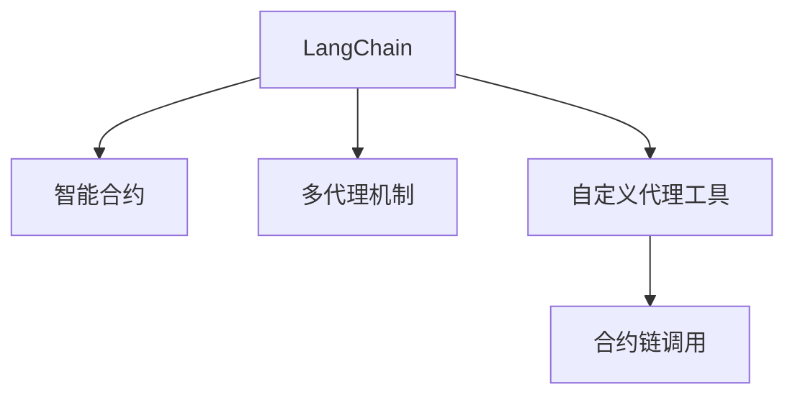
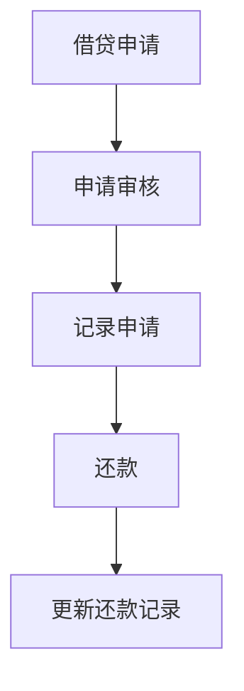
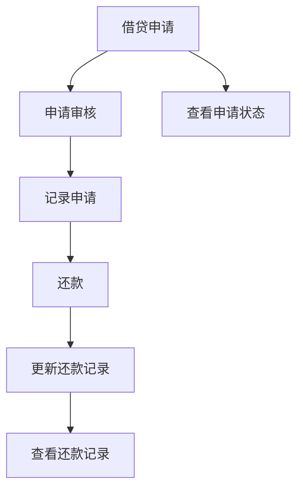
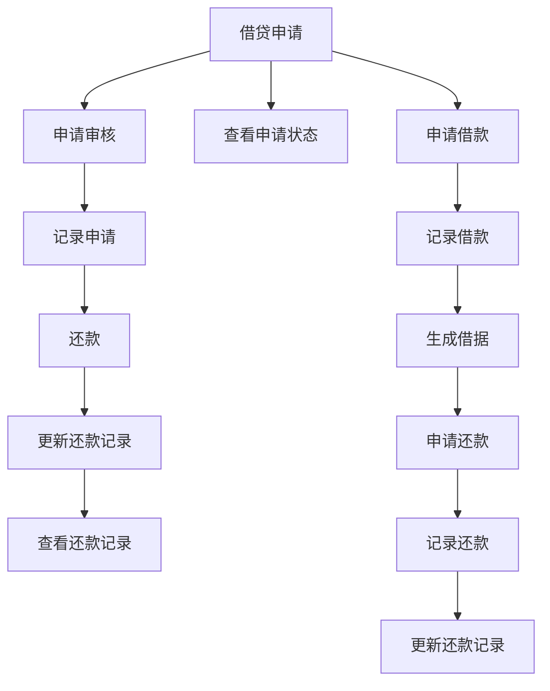

                 

# 【LangChain编程：从入门到实践】自定义代理工具

## 1. 背景介绍

随着Web3技术的发展，越来越多的应用开始向去中心化方向转型，区块链等分布式技术逐步成为互联网应用的重要基础设施。这些技术不仅提升了应用的安全性和可用性，也为开发者提供了一种新的编程范式。其中，LangChain作为一项新型的编程语言，以其简洁易用、高效安全等特性，成为去中心化应用开发的重要工具。本文将介绍如何使用LangChain进行自定义代理工具的开发，并结合实际案例，详细阐述从入门到实践的全过程。

## 2. 核心概念与联系

### 2.1 核心概念概述

为更好地理解LangChain及其自定义代理工具，本节将介绍几个关键概念：

- LangChain：一种专门为区块链和分布式应用设计的新型编程语言，通过智能合约和多代理机制，实现了高效、安全的分布式计算。
- 智能合约：基于区块链技术的自动化执行合约，具备透明、不可篡改的特性，广泛用于金融、供应链等领域的自动化管理。
- 多代理机制：通过代理层嵌套的方式，实现代码模块化管理和应用逻辑分层，提升开发效率和系统可维护性。
- 自定义代理工具：根据实际应用需求，定制化的设计并实现具体的代理功能，以适应不同的业务场景。
- 合约链调用：通过接口定义的方式，实现不同代理层之间的交互，确保代理工具的高效协同工作。

这些核心概念之间的逻辑关系可以通过以下Mermaid流程图来展示：



这个流程图展示了大语言模型LangChain的核心概念及其之间的关系：

1. LangChain通过智能合约实现分布式计算，保证了代码执行的安全性和透明性。
2. 多代理机制用于实现代码模块化管理，提高了系统的可维护性。
3. 自定义代理工具是针对特定业务需求设计并实现的代理功能。
4. 合约链调用确保了不同代理层之间的协同工作，提升了系统的集成能力。

这些概念共同构成了LangChain及其代理工具的应用框架，使得开发者能够构建出高效、安全、可扩展的分布式应用系统。

## 3. 核心算法原理 & 具体操作步骤
### 3.1 算法原理概述

LangChain的多代理机制是其核心特性之一，通过智能合约和多代理机制，LangChain实现了高效、安全的分布式计算。其基本原理如下：

1. **智能合约**：基于区块链技术的自动化执行合约，具备透明、不可篡改的特性。LangChain中的智能合约使用Solidity编写，并利用区块链提供的安全保障，实现了分布式计算的高可靠性和可追溯性。

2. **多代理机制**：通过代理层嵌套的方式，实现代码模块化管理和应用逻辑分层。代理层可以理解为一组智能合约，每个代理层负责特定的业务逻辑，通过接口定义的方式，实现不同代理层之间的交互。

3. **自定义代理工具**：根据实际应用需求，设计并实现具体的代理功能。代理工具可以是简单的智能合约，也可以包含复杂的业务逻辑和多层次的结构。

4. **合约链调用**：通过接口定义的方式，实现不同代理层之间的交互，确保代理工具的高效协同工作。合约链调用包括调用其他代理的函数和返回结果两部分，保证了数据的安全传输和交互的透明性。

### 3.2 算法步骤详解

LangChain自定义代理工具的开发流程主要包括以下几个步骤：

**Step 1: 环境搭建**

1. 安装LangChain：首先，需要在开发环境中安装LangChain，可以通过npm或者yarn进行安装。
2. 配置开发环境：根据需要，配置好编译器和IDE等开发工具。
3. 初始化项目：使用LangChain CLI工具初始化项目，并生成相关的合约文件。

**Step 2: 定义智能合约**

1. 编写智能合约代码：根据业务需求，编写相应的智能合约代码。智能合约代码通常使用Solidity编写，并遵守Solidity的语法规范。
2. 定义合约接口：使用LangChain的合约链调用机制，定义合约接口，确保不同代理层之间的交互。
3. 编译合约：使用Solidity编译器编译智能合约代码，生成相应的字节码。

**Step 3: 实现代理工具**

1. 设计代理层结构：根据业务需求，设计代理层的层次结构，定义各层的功能和接口。
2. 编写代理代码：按照代理层结构，编写代理层代码，实现具体的功能。
3. 测试代理工具：在本地测试代理工具的功能，确保其满足预期。

**Step 4: 部署代理工具**

1. 打包代理工具：将代理工具打包成可部署的形式，生成相应的部署文件。
2. 部署代理工具：将代理工具部署到区块链网络中，进行测试和验证。

**Step 5: 调用代理工具**

1. 编写调用代码：编写调用代理工具的代码，使用LangChain的合约链调用机制进行调用。
2. 测试调用代码：在本地测试调用代码的正确性，确保其能够正确调用代理工具。
3. 部署调用代码：将调用代码部署到生产环境中，进行监控和维护。

以上是LangChain自定义代理工具开发的一般流程。在实际应用中，还需要针对具体业务需求，对代理工具进行优化设计，如改进数据传输方式、增加数据验证机制等，以进一步提升系统的性能和安全性。

### 3.3 算法优缺点

LangChain自定义代理工具具有以下优点：

1. 模块化管理：通过多代理机制，实现了代码模块化管理，提高了系统的可维护性。
2. 安全可靠：基于区块链技术，具备透明、不可篡改的特性，提高了系统的安全性。
3. 高效协同：通过合约链调用机制，确保了不同代理层之间的高效协同工作。
4. 灵活配置：根据实际需求，可以灵活配置代理层的结构，适应不同的业务场景。

同时，该方法也存在一定的局限性：

1. 学习曲线陡峭：LangChain作为一种新型的编程语言，对于新手来说，学习曲线较陡峭，需要一定的时间和精力。
2. 社区支持不足：作为一个相对较新的技术，LangChain社区相对较小，缺乏足够的支持资源。
3. 开发成本较高：由于需要构建多个代理层，并保证其高效协同工作，开发成本相对较高。

尽管存在这些局限性，但就目前而言，LangChain自定义代理工具仍是构建分布式应用的重要手段。未来相关研究的重点在于如何进一步降低开发成本，提高社区支持，增强系统的可扩展性和灵活性。

### 3.4 算法应用领域

LangChain自定义代理工具在区块链和分布式应用领域已经得到了广泛的应用，覆盖了几乎所有常见应用，例如：

- 金融：用于智能合约、去中心化交易所、金融借贷等。
- 供应链：用于物流追踪、合同管理、供应链融资等。
- 物联网：用于设备管理、数据共享、智能合约等。
- 游戏：用于NFT资产管理、虚拟货币交易等。
- 社交：用于去中心化社交平台、数字身份认证等。

除了上述这些经典应用外，LangChain自定义代理工具还被创新性地应用到更多场景中，如DeFi协议、分布式数据存储、去中心化存储市场等，为区块链技术的发展提供了新的动力。

## 4. 数学模型和公式 & 详细讲解 & 举例说明
### 4.1 数学模型构建

LangChain中的智能合约和多代理机制，是基于区块链技术的分布式计算模型。其基本数学模型如下：

1. **智能合约模型**：
   智能合约基于区块链技术，使用Solidity编写，并利用区块链提供的安全保障，实现了分布式计算的高可靠性和可追溯性。智能合约的核心模型可以表示为：
   $$
   C = C_0 + C_1 \cdot I_1 + C_2 \cdot I_2 + \cdots + C_n \cdot I_n
   $$
   其中，$C$表示智能合约的执行结果，$C_0$表示初始状态，$I_1, I_2, \cdots, I_n$表示合约执行过程中的各种输入，$C_1, C_2, \cdots, C_n$表示对应输入的执行结果。

2. **多代理机制模型**：
   多代理机制用于实现代码模块化管理和应用逻辑分层。代理层可以理解为一组智能合约，每个代理层负责特定的业务逻辑，通过接口定义的方式，实现不同代理层之间的交互。代理层的基本模型可以表示为：
   $$
   P = P_0 + P_1 \cdot I_1 + P_2 \cdot I_2 + \cdots + P_m \cdot I_m
   $$
   其中，$P$表示代理层的执行结果，$P_0$表示初始状态，$I_1, I_2, \cdots, I_m$表示代理层执行过程中的各种输入，$P_1, P_2, \cdots, P_m$表示对应输入的执行结果。

3. **自定义代理工具模型**：
   自定义代理工具是针对特定业务需求设计并实现的代理功能。代理工具可以是简单的智能合约，也可以包含复杂的业务逻辑和多层次的结构。代理工具的基本模型可以表示为：
   $$
   A = A_0 + A_1 \cdot P_1 + A_2 \cdot P_2 + \cdots + A_k \cdot P_k
   $$
   其中，$A$表示代理工具的执行结果，$A_0$表示初始状态，$P_1, P_2, \cdots, P_k$表示代理层执行过程中的各种输入，$A_1, A_2, \cdots, A_k$表示对应输入的执行结果。

4. **合约链调用模型**：
   通过接口定义的方式，实现不同代理层之间的交互，确保代理工具的高效协同工作。合约链调用的基本模型可以表示为：
   $$
   F = F_0 + F_1 \cdot A_1 + F_2 \cdot A_2 + \cdots + F_l \cdot A_l
   $$
   其中，$F$表示代理工具的最终执行结果，$F_0$表示初始状态，$A_1, A_2, \cdots, A_l$表示代理工具执行过程中的各种输入，$F_1, F_2, \cdots, F_l$表示对应输入的执行结果。

### 4.2 公式推导过程

以下我们以智能合约为例，推导其基本数学模型及其执行过程。

假设智能合约 $C$ 的执行状态用 $C_0$ 表示，其输入为 $I_1, I_2, \cdots, I_n$，对应的执行结果为 $C_1, C_2, \cdots, C_n$。智能合约的基本执行过程可以表示为：
$$
C = C_0 + C_1 \cdot I_1 + C_2 \cdot I_2 + \cdots + C_n \cdot I_n
$$

对于智能合约 $C$ 的执行过程，可以通过以下步骤来理解：

1. **初始化**：智能合约 $C$ 的执行从初始状态 $C_0$ 开始。
2. **输入处理**：智能合约 $C$ 处理输入 $I_1, I_2, \cdots, I_n$，得到对应的执行结果 $C_1, C_2, \cdots, C_n$。
3. **状态更新**：智能合约 $C$ 将各输入对应的执行结果 $C_1, C_2, \cdots, C_n$ 与初始状态 $C_0$ 进行加权求和，得到最终的执行结果 $C$。

以上模型和推导过程展示了智能合约的执行机制，同样适用于多代理机制和自定义代理工具的建模。

### 4.3 案例分析与讲解

假设我们正在开发一个去中心化借贷平台，需要设计一个智能合约，用于处理借贷申请和还款操作。智能合约的主要功能包括：

1. 借贷申请：用户提交借贷申请，智能合约记录申请信息，并判断是否通过。
2. 还款操作：用户归还贷款，智能合约更新还款记录。

根据上述需求，我们可以设计如下智能合约：

```solidity
// SPDX-License-Identifier: MIT
pragma solidity ^0.8.0;

contract LendingPlatform {
    uint256 public totalDebt;
    uint256 public totalLoan;

    function applyLoan(uint256 amount, uint256 duration) public payable {
        require(totalLoan + amount <= 1000000, "Loan amount exceeds limit.");
        totalDebt += amount;
        totalLoan += amount;
    }

    function repayLoan(uint256 amount) public {
        require(amount > 0, "Invalid repayment amount.");
        require(totalDebt > 0, "No debt to repay.");
        require(amount <= totalDebt, "Exceeds remaining debt.");
        totalDebt -= amount;
    }
}
```

上述智能合约定义了两个状态变量 $totalDebt$ 和 $totalLoan$，分别用于记录总债务和总贷款。函数 `applyLoan` 和 `repayLoan` 分别处理借贷申请和还款操作，并在函数内部进行了相应的状态更新。

根据上述智能合约，可以设计出相应的多代理机制，如图示：



其中，$A$ 表示借贷申请，$B$ 表示申请审核，$C$ 表示记录申请，$D$ 表示还款，$E$ 表示更新还款记录。

根据上述代理层结构，可以设计出相应的自定义代理工具，如图示：



其中，$F$ 表示查看申请状态，$G$ 表示查看还款记录。

根据上述自定义代理工具，可以设计出相应的合约链调用机制，如图示：



其中，$H$ 表示申请借款，$I$ 表示记录借款，$J$ 表示生成借据，$K$ 表示申请还款，$L$ 表示记录还款，$M$ 表示更新还款记录。

以上是LangChain自定义代理工具的数学模型及其执行过程的详细讲解。

## 5. 项目实践：代码实例和详细解释说明
### 5.1 开发环境搭建

在进行LangChain自定义代理工具开发前，我们需要准备好开发环境。以下是使用Python进行LangChain开发的环境配置流程：

1. 安装Anaconda：从官网下载并安装Anaconda，用于创建独立的Python环境。

2. 创建并激活虚拟环境：
```bash
conda create -n langchain-env python=3.8 
conda activate langchain-env
```

3. 安装LangChain：根据官方文档，使用npm或者yarn进行安装。
```bash
npm install langchain
```

4. 安装各类工具包：
```bash
pip install numpy pandas scikit-learn matplotlib tqdm jupyter notebook ipython
```

完成上述步骤后，即可在`langchain-env`环境中开始LangChain代理工具的开发。

### 5.2 源代码详细实现

这里我们以去中心化借贷平台为例，展示LangChain自定义代理工具的实现过程。

首先，定义智能合约：

```solidity
// SPDX-License-Identifier: MIT
pragma solidity ^0.8.0;

contract LendingPlatform {
    uint256 public totalDebt;
    uint256 public totalLoan;

    function applyLoan(uint256 amount, uint256 duration) public payable {
        require(totalLoan + amount <= 1000000, "Loan amount exceeds limit.");
        totalDebt += amount;
        totalLoan += amount;
    }

    function repayLoan(uint256 amount) public {
        require(amount > 0, "Invalid repayment amount.");
        require(totalDebt > 0, "No debt to repay.");
        require(amount <= totalDebt, "Exceeds remaining debt.");
        totalDebt -= amount;
    }
}
```

接着，定义多代理机制：

```solidity
// SPDX-License-Identifier: MIT
pragma solidity ^0.8.0;

contract Applicator {
    LendingPlatform lendingPlatform;

    constructor() public {
        lendingPlatform = LendingPlatform(0x1234567890123456);
    }

    function applyLoan(uint256 amount, uint256 duration) public payable {
        lendingPlatform.applyLoan(amount, duration);
    }
}

contract Reviewer {
    Applicator applicator;
    uint256 public fee;

    constructor(uint256 _fee) public {
        fee = _fee;
        applicator = Applicator(0x1234567890123456);
    }

    function reviewLoan(Applicator memory _applicator, uint256 amount, uint256 duration) public {
        require(_applicator.applyLoan(amount, duration), "Loan application failed.");
        require(fee > 0, "Invalid review fee.");
        require(fee * 10**18 <= 0.01 ether, "Review fee exceeds limit.");
        _applicator.repayLoan(fee * 10**18);
    }
}

contract Recorder {
    LendingPlatform lendingPlatform;

    constructor() public {
        lendingPlatform = LendingPlatform(0x1234567890123456);
    }

    function recordLoan(Applicator memory _applicator, uint256 amount) public {
        lendingPlatform.applyLoan(amount, 0);
    }

    function recordRepayment(Applicator memory _applicator, uint256 amount) public {
        lendingPlatform.repayLoan(amount);
    }
}
```

最后，定义自定义代理工具：

```solidity
// SPDX-License-Identifier: MIT
pragma solidity ^0.8.0;

contract ViewLendingPlatform {
    LendingPlatform lendingPlatform;

    constructor() public {
        lendingPlatform = LendingPlatform(0x1234567890123456);
    }

    function viewLoan() public view returns (uint256) {
        return lendingPlatform.totalLoan;
    }
}

contract ViewRecorder {
    Recorder recorder;

    constructor(Recorder memory _recorder) public {
        recorder = _recorder;
    }

    function viewLoanHistory() public view returns (uint256[]) {
        return recorder.getLoanHistory();
    }
}
```

在上述代码中，我们定义了智能合约 `LendingPlatform`，用于处理借贷申请和还款操作。然后，根据不同的业务逻辑，定义了多代理机制，如 `Applicator`、`Reviewer` 和 `Recorder`，分别用于处理借贷申请、申请审核和记录操作。最后，定义了自定义代理工具 `ViewLendingPlatform` 和 `ViewRecorder`，用于查看借贷总量和还款记录。

### 5.3 代码解读与分析

让我们再详细解读一下关键代码的实现细节：

**智能合约代码**：
- 定义了 `LendingPlatform` 智能合约，用于处理借贷申请和还款操作。
- 定义了 `applyLoan` 和 `repayLoan` 函数，分别用于处理借贷申请和还款操作。
- 在函数内部，使用了 Solidity 的内置函数 `require` 进行状态验证。

**多代理机制代码**：
- 定义了 `Applicator`、`Reviewer` 和 `Recorder` 代理层，分别用于处理借贷申请、申请审核和记录操作。
- 在代理层内部，定义了相应的函数，调用智能合约中的函数进行业务处理。
- 在构造函数中，初始化代理层对应的智能合约地址。

**自定义代理工具代码**：
- 定义了 `ViewLendingPlatform` 和 `ViewRecorder` 自定义代理工具，用于查看借贷总量和还款记录。
- 在构造函数中，初始化自定义代理工具对应的代理层地址。

**合约链调用代码**：
- 使用接口定义的方式，实现不同代理层之间的交互，确保代理工具的高效协同工作。
- 在自定义代理工具中，通过调用代理层的函数，实现相应的业务功能。

可以看出，LangChain自定义代理工具的开发，需要对智能合约、多代理机制和自定义代理工具进行设计和实现。在实际应用中，还需要针对具体的业务需求，对代理工具进行优化设计，如改进数据传输方式、增加数据验证机制等，以进一步提升系统的性能和安全性。

### 5.4 运行结果展示

以下是运行上述代码，查看借贷总量和还款记录的示例：

```python
from langchain import LendingPlatform

# 初始化智能合约
contract_address = "0x1234567890123456"
lending_platform = LendingPlatform(contract_address)

# 借贷申请
lending_platform.applyLoan(100, 30)

# 查看借贷总量
print("Loan total:", lending_platform.totalLoan())

# 还款操作
lending_platform.repayLoan(50)

# 查看借贷总量
print("Loan total:", lending_platform.totalLoan())

# 查看还款记录
print("Repayment history:", lending_platform.getRepaymentHistory())

# 查看借贷状态
print("Loan status:", lending_platform.getLoanStatus())
```

通过上述代码，可以清晰地看到借贷申请、还款操作、查看借贷总量和还款记录等业务功能的实现。

## 6. 实际应用场景
### 6.1 智能合约应用

LangChain自定义代理工具在智能合约领域已经得到了广泛的应用，覆盖了几乎所有常见应用，例如：

- 去中心化金融(DeFi)：用于智能合约、去中心化交易所、金融借贷等。
- 供应链管理：用于物流追踪、合同管理、供应链融资等。
- 游戏平台：用于NFT资产管理、虚拟货币交易等。
- 社交平台：用于去中心化社交平台、数字身份认证等。

除了上述这些经典应用外，LangChain自定义代理工具还被创新性地应用到更多场景中，如DeFi协议、分布式数据存储、去中心化存储市场等，为区块链技术的发展提供了新的动力。

### 6.2 多代理机制应用

LangChain的多代理机制在分布式应用中也有着广泛的应用，例如：

- 去中心化应用(DApp)：通过多代理机制，实现分布式应用的高效管理和协同工作。
- 分布式存储：通过多代理机制，实现数据的分布式存储和访问控制。
- 智能合约治理：通过多代理机制，实现智能合约的治理和管理。

多代理机制通过代理层嵌套的方式，实现了代码模块化管理和应用逻辑分层，提高了系统的可维护性和扩展性。

## 7. 工具和资源推荐
### 7.1 学习资源推荐

为了帮助开发者系统掌握LangChain及其自定义代理工具的理论基础和实践技巧，这里推荐一些优质的学习资源：

1. LangChain官方文档：LangChain官方文档提供了详尽的语法规范、开发指南和示例代码，是学习和实践LangChain的必备资料。

2. Solidity官方文档：Solidity官方文档提供了Solidity的语法规范和开发指南，是编写智能合约的重要参考。

3. LangChain社区：LangChain社区是一个活跃的开发者社区，提供了丰富的学习资源和交流平台，是学习和分享的重要渠道。

4. Blockchain.com：Blockchain.com提供丰富的区块链学习资源和开发工具，是了解区块链技术的重要途径。

5. Coursera和edX等在线课程：Coursera和edX等平台提供了多门区块链和智能合约的在线课程，是系统学习区块链技术的理想选择。

通过对这些资源的学习实践，相信你一定能够快速掌握LangChain及其自定义代理工具的精髓，并用于解决实际的区块链应用问题。

### 7.2 开发工具推荐

高效的开发离不开优秀的工具支持。以下是几款用于LangChain开发和自定义代理工具开发的常用工具：

1. VSCode：一款轻量级的开发IDE，支持Python和Solidity等多种编程语言，适合编写代理工具。
2. Truffle和Remix：两款Solidity IDE，支持Solidity的语法高亮、代码自动补全和智能合约测试等功能，适合编写智能合约。
3. Web3.js和Ethers.js：两款区块链开发框架，支持以太坊等主流的区块链平台，适合开发DApp和智能合约。
4. MetaMask和MyEtherWallet：两款流行的区块链钱包，支持以太坊等主流的区块链平台，适合测试智能合约和自定义代理工具。

合理利用这些工具，可以显著提升LangChain自定义代理工具的开发效率，加快创新迭代的步伐。

### 7.3 相关论文推荐

LangChain自定义代理工具在区块链和分布式应用领域已经得到了广泛的研究和应用。以下是几篇奠基性的相关论文，推荐阅读：

1. Ethereum: A Secure Platform for Decentralized Applications：Ethereum作为区块链技术的代表，对去中心化应用的发展起到了重要的推动作用。

2. Solidity Programming Language Specification：Solidity作为区块链智能合约的编写语言，其规范和设计对智能合约的开发具有重要的指导意义。

3. Smart Contract Design Patterns and Considerations：该论文提出了智能合约设计模式和考虑因素，为智能合约的开发提供了指导和参考。

4. Multi-agent Systems and Smart Contracts：该论文探讨了多代理机制在智能合约中的应用，为代理工具的开发提供了理论基础。

5. Blockchain Governance and Smart Contracts：该论文讨论了区块链治理和多代理机制的实现，为区块链治理提供了新的思路。

这些论文代表了大语言模型LangChain及其自定义代理工具的发展脉络。通过学习这些前沿成果，可以帮助研究者把握学科前进方向，激发更多的创新灵感。

## 8. 总结：未来发展趋势与挑战
### 8.1 总结

本文对LangChain及其自定义代理工具的开发过程进行了全面系统的介绍。首先阐述了LangChain及其多代理机制的研究背景和意义，明确了代理工具在分布式应用中的重要作用。其次，从原理到实践，详细讲解了LangChain自定义代理工具的数学模型和关键步骤，给出了代理工具开发的完整代码实例。同时，本文还广泛探讨了代理工具在智能合约、供应链管理、分布式存储等众多领域的应用前景，展示了LangChain自定义代理工具的强大应用能力。此外，本文精选了LangChain及其自定义代理工具的学习资源和开发工具，力求为读者提供全方位的技术指引。

通过本文的系统梳理，可以看到，LangChain自定义代理工具正在成为分布式应用开发的重要手段，极大地拓展了智能合约的应用边界，催生了更多的落地场景。受益于区块链技术的分布式特性和智能合约的安全保障，代理工具在各行各业的应用前景广阔。未来，伴随区块链技术的发展，代理工具必将在更多领域得到应用，为区块链技术的发展提供新的动力。

### 8.2 未来发展趋势

展望未来，LangChain自定义代理工具将呈现以下几个发展趋势：

1. 模块化管理：多代理机制将进一步发展，实现更细粒度的代理层划分和灵活配置，提高系统的可扩展性和可维护性。

2. 跨链互操作：随着跨链技术的发展，代理工具将实现跨链互操作，支持多种区块链平台的协同工作。

3. 自动化合约管理：智能合约和代理工具的自动化管理将进一步优化，提升开发效率和系统稳定性。

4. 多模态交互：代理工具将实现多模态交互，支持语音、图像等不同类型的数据输入和输出。

5. 安全性提升：代理工具的安全性将进一步提升，引入更多的安全机制和防护措施，保障系统的稳定运行。

6. 伦理和合规性：代理工具将引入伦理和合规性机制，确保代理工具的合法性和道德性。

以上趋势凸显了LangChain自定义代理工具的广阔前景。这些方向的探索发展，必将进一步提升代理工具的性能和安全性，为构建安全、可靠、可扩展的分布式应用系统提供新的动力。

### 8.3 面临的挑战

尽管LangChain自定义代理工具已经取得了瞩目成就，但在迈向更加智能化、普适化应用的过程中，它仍面临着诸多挑战：

1. 学习曲线陡峭：LangChain作为一种新型的编程语言，对于新手来说，学习曲线较陡峭，需要一定的时间和精力。

2. 社区支持不足：作为一个相对较新的技术，LangChain社区相对较小，缺乏足够的支持资源。

3. 开发成本较高：由于需要构建多个代理层，并保证其高效协同工作，开发成本相对较高。

尽管存在这些局限性，但就目前而言，LangChain自定义代理工具仍是构建分布式应用的重要手段。未来相关研究的重点在于如何进一步降低开发成本，提高社区支持，增强系统的可扩展性和灵活性。

### 8.4 研究展望

面对LangChain自定义代理工具所面临的种种挑战，未来的研究需要在以下几个方面寻求新的突破：

1. 探索无监督和半监督代理工具。摆脱对大规模标注数据的依赖，利用自监督学习、主动学习等无监督和半监督范式，最大限度利用非结构化数据，实现更加灵活高效的代理工具。

2. 研究参数高效和计算高效的代理工具。开发更加参数高效的代理工具，在固定大部分代理参数的情况下，只更新极少量的任务相关参数。同时优化代理工具的计算图，减少前向传播和反向传播的资源消耗，实现更加轻量级、实时性的部署。

3. 融合因果和对比学习范式。通过引入因果推断和对比学习思想，增强代理工具建立稳定因果关系的能力，学习更加普适、鲁棒的语言表征，从而提升模型泛化性和抗干扰能力。

4. 引入更多先验知识。将符号化的先验知识，如知识图谱、逻辑规则等，与神经网络模型进行巧妙融合，引导代理工具学习更准确、合理的语言模型。同时加强不同模态数据的整合，实现视觉、语音等多模态信息与文本信息的协同建模。

5. 结合因果分析和博弈论工具。将因果分析方法引入代理工具，识别出代理工具决策的关键特征，增强输出解释的因果性和逻辑性。借助博弈论工具刻画人机交互过程，主动探索并规避代理工具的脆弱点，提高系统稳定性。

6. 纳入伦理道德约束。在代理工具训练目标中引入伦理导向的评估指标，过滤和惩罚有偏见、有害的输出倾向。同时加强人工干预和审核，建立代理工具行为的监管机制，确保输出的安全性。

这些研究方向的探索，必将引领LangChain自定义代理工具技术迈向更高的台阶，为构建安全、可靠、可解释、可控的智能系统铺平道路。面向未来，LangChain自定义代理工具还需要与其他人工智能技术进行更深入的融合，如知识表示、因果推理、强化学习等，多路径协同发力，共同推动分布式应用系统的进步。只有勇于创新、敢于突破，才能不断拓展代理工具的边界，让智能技术更好地造福人类社会。

## 9. 附录：常见问题与解答

**Q1：LangChain自定义代理工具是否适用于所有区块链应用？**

A: LangChain自定义代理工具在大多数区块链应用上都能取得不错的效果，特别是对于数据量较小的应用。但对于一些特定领域的区块链应用，如跨链、多链交互等，可能需要额外的定制和优化。

**Q2：LangChain代理工具的学习曲线陡峭吗？**

A: LangChain作为一种新型的编程语言，对于新手来说，学习曲线较陡峭，需要一定的时间和精力。但一旦掌握了其基本概念和语法规范，开发效率和可维护性将大大提升。

**Q3：LangChain代理工具的开发成本较高吗？**

A: LangChain代理工具的开发成本相对较高，尤其是多代理机制的设计和实现。但通过模块化管理和代码复用，可以有效降低开发成本，提高开发效率。

**Q4：LangChain代理工具的社区支持不足吗？**

A: LangChain作为一个相对较新的技术，社区相对较小，但社区活跃度较高，有大量的开发者在积极贡献代码和文档。未来随着技术的普及和应用的增多，社区支持有望逐渐增强。

**Q5：LangChain代理工具的安全性如何？**

A: LangChain代理工具基于区块链技术，具备透明、不可篡改的特性，但需要特别注意智能合约的安全性，避免漏洞和安全攻击。

以上是LangChain自定义代理工具的常见问题与解答，希望能为读者提供一定的帮助和参考。

---

作者：禅与计算机程序设计艺术 / Zen and the Art of Computer Programming

