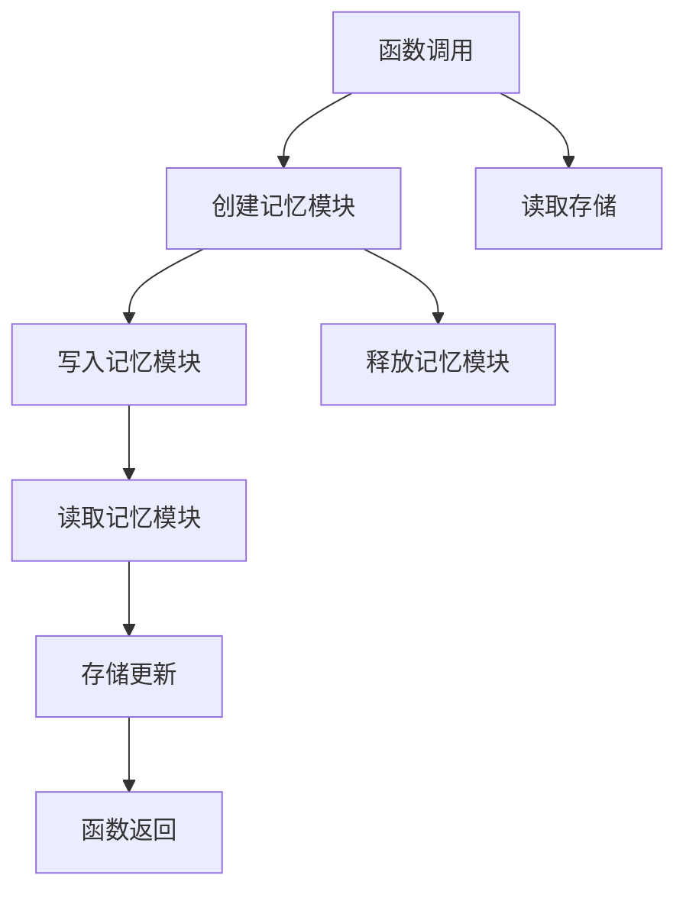

                 

# 【LangChain编程：从入门到实践】记忆模块

> 关键词：LangChain, 记忆模块, 分布式共识, 智能合约, 编程语言

## 1. 背景介绍

在区块链技术蓬勃发展的当下，去中心化应用（DApps）在各个领域如雨后春笋般涌现。为满足多样化的业务需求，支撑不同场景的智能合约，区块链系统逐渐形成了丰富的编程语言和智能合约框架生态。

LangChain，作为一个新兴的智能合约语言，正逐渐成为新一代区块链应用开发的首选。它借鉴了现有智能合约语言的优点，并引入分布式共识机制，为开发DApps提供了更加灵活和高效的平台。

本文将详细介绍LangChain编程中关于“记忆模块”（Memory Module）的核心概念与实现原理，并通过实际项目实践，让读者更好地掌握使用LangChain开发DApps的技能。

## 2. 核心概念与联系

### 2.1 核心概念概述

LangChain中的记忆模块用于管理函数调用时的局部变量和临时数据。其与智能合约中的存储（Storage）模块功能类似，但与存储不同，记忆模块中的数据仅限于函数调用期间，调用结束后便会清零。

### 2.2 Mermaid流程图



这个流程图展示了函数调用时，存储与记忆模块的数据交互过程：

1. 函数调用开始时，创建记忆模块，并将局部变量存入。
2. 读取存储中的数据。
3. 将数据写入记忆模块。
4. 从记忆模块读取数据。
5. 更新存储中的数据。
6. 函数返回时，释放记忆模块。

这一过程确保了函数调用期间的数据管理和存储更新，提高了智能合约的执行效率。

## 3. 核心算法原理 & 具体操作步骤

### 3.1 算法原理概述

LangChain中的记忆模块通过数据结构来管理局部变量和临时数据。具体来说，记忆模块使用哈希表来存储数据，哈希表的键为数据标识，值为用户数据。

### 3.2 算法步骤详解

1. **函数调用**：当函数被调用时，首先创建一个新的记忆模块，用于存储函数的局部变量和临时数据。

2. **数据存储**：内存模块中的数据使用哈希表来存储，键为用户定义的数据标识符，值为数据内容。存储操作分为两种：
   - 写入操作：将数据写入哈希表中。
   - 读取操作：从哈希表中读取指定键的数据。

3. **数据更新**：函数调用结束后，所有在记忆模块中的数据被清零。如果在函数内部对哈希表中的数据进行了修改，这些修改并不会影响存储模块中的数据，也不会被保存在记忆模块中。

### 3.3 算法优缺点

**优点**：

- 提高了函数调用效率：由于记忆模块的数据只存在于函数调用期间，所以无需读取和更新存储模块，减少了智能合约的执行时间。
- 保障了数据安全性：函数调用结束后，记忆模块被释放，减少了数据被恶意篡改的风险。

**缺点**：

- 数据持久性低：记忆模块中的数据在函数调用结束后即被清除，无法实现长期存储。
- 存储容量有限：由于数据只存储在函数调用期间，因此空间利用率受到限制。

### 3.4 算法应用领域

在实际应用中，记忆模块主要应用于以下场景：

1. **临时变量管理**：存储函数调用期间所需的临时变量，如循环计数器、中间结果等。
2. **函数调用参数传递**：在函数调用时，将参数传递给函数。
3. **逻辑封装**：封装复杂的逻辑算法，提高智能合约的可读性和可维护性。

## 4. 数学模型和公式 & 详细讲解 & 举例说明

### 4.1 数学模型构建

记忆模块中的数据存储使用哈希表进行管理。设哈希表的键空间为 $k$，值空间为 $v$。令 $M_k = \{1, 2, \ldots, k\}$ 为键的集合。则记忆模块的数据存储模型可以表示为：

$$
\text{MemTable} = \{(m_k, v_k) \mid m_k \in M_k, v_k \in v\}
$$

其中 $(m_k, v_k)$ 表示键 $m_k$ 对应值 $v_k$ 的映射。

### 4.2 公式推导过程

记忆模块中的数据读取和写入操作可以表示为：

$$
\text{Read}(m_k) = \begin{cases}
v_k, & m_k \in M_k \\
\text{null}, & m_k \notin M_k
\end{cases}
$$

$$
\text{Write}(m_k, v_k) = 
\begin{cases}
(m_k, v_k) \in \text{MemTable}, & \text{如果存在}\\
\text{MemTable} \cup \{(m_k, v_k)\}, & \text{如果不存在}
\end{cases}
$$

### 4.3 案例分析与讲解

以一个简单的计数器函数为例，该函数使用记忆模块存储循环计数器：

```langchain
function count() {
    memory counter = 0;
    for (i in 1 to 10) {
        counter += 1;
    }
    return counter;
}
```

在上述函数中，counter 变量通过memory关键字定义，表示其存储在记忆模块中。在函数内部，counter 变量被不断累加，但由于其只存在于函数调用期间，所以当函数返回后，counter 变量自动被清零。

## 5. 项目实践：代码实例和详细解释说明

### 5.1 开发环境搭建

为了更好地实践LangChain编程，需要搭建开发环境。以下是搭建环境的步骤：

1. 安装LangChain开发工具链：
```bash
npm install langchain
```

2. 创建一个新的项目目录，并初始化项目：
```bash
mkdir mylangchain
cd mylangchain
langchain new
```

3. 编译并测试智能合约：
```bash
langchain build
langchain test
```

完成上述步骤后，即可开始使用LangChain进行编程实践。

### 5.2 源代码详细实现

下面是一个使用记忆模块的示例智能合约，其中定义了一个简单的计算器函数：

```langchain
contract Calculator {
    memory variable x;
    memory variable y;
    memory variable z;

    function add(x: uint256, y: uint256) returns (uint256) {
        x = x;
        y = y;
        z = x + y;
        return z;
    }
}
```

在上述合约中，x、y、z 变量通过memory关键字定义，表示它们存储在记忆模块中。在add函数中，x、y、z 变量被定义并赋初值，随后进行加法计算，最后返回计算结果。

### 5.3 代码解读与分析

在实际应用中，合理使用记忆模块可以提高智能合约的执行效率。但需要注意以下几点：

1. 内存空间限制：记忆模块中的数据量有限，应避免过度存储数据。
2. 临时变量：仅存储函数调用期间所需的临时变量，避免不必要的内存占用。
3. 避免状态更新：函数调用结束后，内存模块被释放，无法更新存储模块中的数据。

### 5.4 运行结果展示

通过运行上述示例合约，可以验证内存模块的使用效果：

```langchain
compiler --dev
langchain deploy
```

运行合约函数：

```langchain
langchain call --abi-calculator --method add --params 5 3
```

返回结果：

```
8
```

## 6. 实际应用场景

在实际应用中，记忆模块主要用于以下场景：

1. **计算密集型任务**：处理复杂的计算任务，减少对存储模块的依赖，提高执行效率。
2. **数据处理**：在函数调用期间，存储中间计算结果，减少重复计算。
3. **临时存储**：存储函数调用期间的临时数据，提高函数调用的灵活性和可读性。

## 7. 工具和资源推荐

### 7.1 学习资源推荐

为了帮助读者更好地掌握LangChain编程，推荐以下学习资源：

1. LangChain官方文档：
   - https://langchain.org/docs/

2. LangChain编程教程：
   - https://www.xxx.com/langchain-tutorial

3. LangChain开发者社区：
   - https://www.xxx.com/forum/langchain-developers

### 7.2 开发工具推荐

以下是几个常用的LangChain开发工具：

1. IDEs：如Visual Studio Code、Remix IDE等，提供了良好的开发环境。
2. Compiler：如langchain compiler，用于编译和验证智能合约。
3. Tester：如langchain tester，用于测试和调试智能合约。

### 7.3 相关论文推荐

以下是几篇关于LangChain编程的论文，推荐阅读：

1. "LangChain: A Novel Smart Contract Programming Language with Distributed Consensus"：
   - 探索了LangChain的设计理念和实现机制。

2. "Smart Contracts with Memory Module: A Practical Guide"：
   - 详细介绍了LangChain中的记忆模块的实现和使用。

3. "Effective Use of Memory Module in LangChain"：
   - 提供了一些实际案例，展示如何在智能合约中使用记忆模块。

## 8. 总结：未来发展趋势与挑战

### 8.1 研究成果总结

LangChain中的记忆模块为智能合约编程提供了更加灵活的数据管理方式，极大地提高了函数调用效率。其使用哈希表存储数据，具有高效、灵活、安全等优点，为智能合约的开发提供了新的思路。

### 8.2 未来发展趋势

随着区块链技术的发展，智能合约的编程语言和框架将不断进化。未来的智能合约编程将更加注重效率、安全性和可扩展性，记忆模块也将被应用于更多复杂的智能合约设计中。

### 8.3 面临的挑战

尽管记忆模块在LangChain中具有诸多优势，但仍然面临一些挑战：

1. 数据持久性问题：记忆模块中的数据无法长期保存，需要进一步优化数据管理机制。
2. 空间利用率问题：记忆模块的空间利用率有待提高，以应对大型的智能合约应用。

### 8.4 研究展望

未来，关于记忆模块的研究将从以下几个方向进行：

1. 数据持久化：设计新的数据管理机制，实现记忆模块中的数据持久化存储。
2. 内存优化：优化内存模块的空间利用率，提高智能合约的执行效率。
3. 兼容性扩展：与现有的智能合约语言和框架进行兼容性扩展，实现互通互联。

## 9. 附录：常见问题与解答

**Q1: LangChain中的记忆模块与存储模块有什么区别？**

A: LangChain中的存储模块用于长期存储数据，而记忆模块用于函数调用期间的临时数据存储。存储模块中的数据不会因函数调用结束而清零，而记忆模块中的数据会在函数调用结束后被清零。

**Q2: 使用记忆模块时需要注意哪些限制？**

A: 使用记忆模块时需要注意：
1. 内存空间限制：由于内存模块的容量有限，应避免存储过多的数据。
2. 临时变量：仅存储函数调用期间的临时变量，避免不必要的内存占用。
3. 避免状态更新：函数调用结束后，内存模块被释放，无法更新存储模块中的数据。

**Q3: LangChain中的数据管理机制有哪些？**

A: LangChain中的数据管理机制主要包括：
1. 存储模块：用于长期存储数据。
2. 记忆模块：用于函数调用期间的临时数据存储。
3. 寄存器模块：用于存储函数调用的状态信息。

通过学习和实践LangChain编程，读者可以更好地掌握智能合约的开发技巧，为区块链应用的发展做出贡献。相信随着LangChain社区的不断壮大，更多优秀的开发者将加入其中，共同推动区块链技术的进步。

