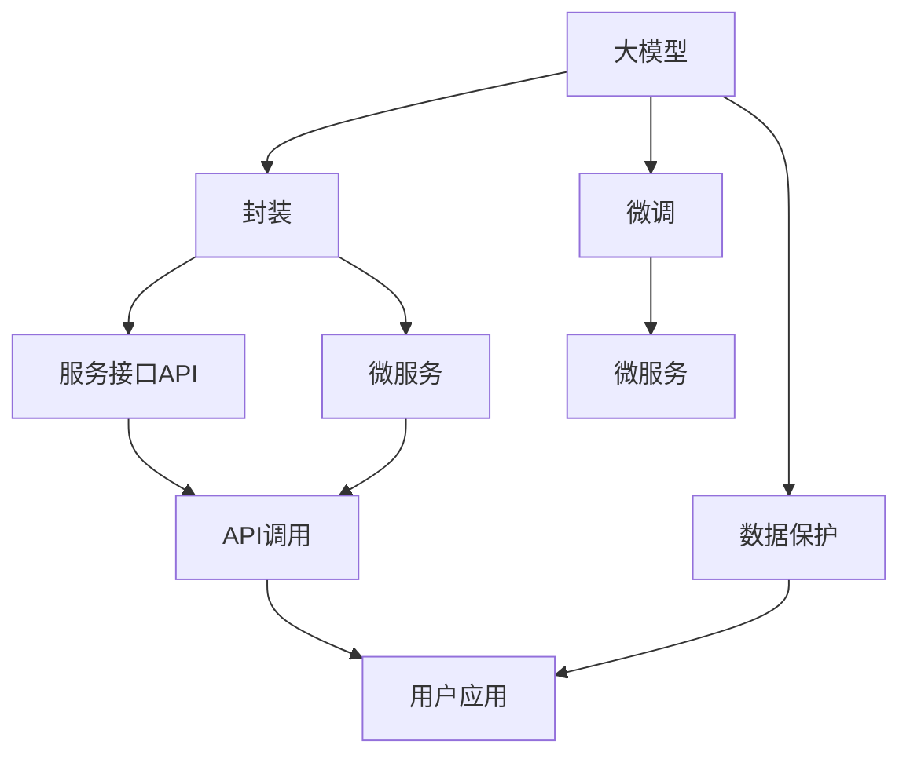

                 

## 1. 背景介绍

### 1.1 问题由来

随着人工智能(AI)技术的迅猛发展，AI Agent作为AI技术的一个重要分支，在各行各业中得到了广泛应用。AI Agent不仅能够自动化处理各种任务，还可以在复杂环境中进行自主决策，提供智能服务。在AI Agent的开发中，大模型的应用日益增多，特别是在多智能体系统、自然语言处理等领域，大模型已经在数据表示、知识抽取、推理决策等方面展现了强大的能力。

然而，大模型的应用面临着许多挑战。首先，大模型通常需要海量数据进行预训练，这使得模型的训练和部署成本非常高。其次，大模型在特定领域的应用效果往往不如专用模型，因为它们没有针对特定任务进行优化。此外，大模型的复杂性和庞大的参数量也带来了诸多问题，如推理速度慢、内存占用大等。

为了解决这些问题，Agent即服务(Agent as a Service, AaaS)的开发理念应运而生。AaaS是指将AI Agent封装为可复用的服务，用户可以基于API调用这些服务，实现快速定制化的AI解决方案。这种方式不仅降低了AI Agent的开发和部署成本，还提高了系统的灵活性和可扩展性。

### 1.2 问题核心关键点

1. **大模型封装与调用**：如何将大模型封装为可复用的服务，使其能够被不同用户和场景轻松调用？
2. **服务接口设计**：如何设计高效、易用的服务接口，使用户能够方便地实现自定义任务？
3. **安全性与隐私保护**：在AaaS中，如何保证用户数据的隐私和安全性？
4. **性能优化**：如何优化AI Agent的推理性能，提升系统响应速度和资源利用率？
5. **持续迭代与更新**：如何在AaaS中实现模型的持续迭代和更新，以应对不断变化的用户需求和技术发展？

这些关键点是大模型应用开发中需要重点关注的问题。解决这些问题不仅可以提高AI Agent的性能和可扩展性，还能推动AI Agent在更多领域的应用。

### 1.3 问题研究意义

研究AaaS的应用开发，对于拓展AI Agent的应用场景，提升系统性能和用户体验，具有重要意义：

1. **降低开发成本**：通过AaaS，用户可以基于现有的大模型快速定制化AI Agent，无需从头开始开发，大大降低了开发和部署成本。
2. **提升性能**：通过封装优化的大模型，AI Agent能够快速响应和处理用户请求，提高系统的响应速度和资源利用率。
3. **增强灵活性**：AaaS使AI Agent的开发和部署更加灵活，用户可以根据具体需求灵活配置模型和接口，实现快速迭代和更新。
4. **保障隐私安全**：AaaS提供了对用户数据的安全保护机制，使用户的数据在传输和存储过程中得到严格保护。
5. **推动应用普及**：AaaS将AI Agent的开发和部署门槛降低，使更多企业和个人能够轻松应用AI技术，推动AI Agent在更多领域的应用。

## 2. 核心概念与联系

### 2.1 核心概念概述

为了更好地理解AaaS的应用开发，本节将介绍几个核心概念：

- **大模型(Large Model)**：指经过大规模数据预训练的深度学习模型，如BERT、GPT等，这些模型在处理自然语言、图像、语音等任务时展现了卓越的性能。
- **封装(Capsulation)**：将大模型封装为可复用的服务，使其能够被不同用户和场景轻松调用。封装通常包括模型的加载、推理、接口设计等多个环节。
- **服务接口(API)**：定义了用户调用服务的方式和参数，是AaaS中最重要的组成部分。API的设计需要兼顾易用性和可扩展性。
- **微服务(Microservices)**：将复杂的系统拆分为多个独立的、可独立部署的服务单元，每个服务单元专注于特定的功能模块，提升系统的灵活性和可扩展性。
- **持续集成与部署(CI/CD)**：通过自动化工具实现代码的持续集成和部署，确保代码的快速迭代和系统的高可靠性。
- **安全性与隐私保护**：在AaaS中，数据的安全传输和存储是关键问题，需要使用加密、访问控制等技术来保障。

这些核心概念之间的逻辑关系可以通过以下Mermaid流程图来展示：



这个流程图展示了大模型应用的几个核心环节，包括封装、API设计、微服务拆分、用户调用、数据保护等。

## 3. 核心算法原理 & 具体操作步骤

### 3.1 算法原理概述

AaaS的核心算法原理是基于微服务架构和大模型的封装与调用。其主要思想是将大模型封装为微服务，通过API接口提供给用户，用户可以根据具体需求调用这些服务，实现自定义任务。

假设一个大模型已经被训练好，并被封装为微服务。用户需要调用该服务完成某项任务，例如文本分类。用户通过API接口提供输入数据和参数，微服务进行推理计算，最终返回输出结果。

### 3.2 算法步骤详解

基于微服务架构的大模型应用开发，通常包括以下几个关键步骤：

**Step 1: 选择合适的微服务框架**

选择一个适合的微服务框架，如Spring Boot、Django等，用于封装和管理大模型服务。这些框架提供了丰富的功能模块和工具支持，可以大大简化微服务的开发和部署过程。

**Step 2: 定义API接口**

根据用户的需求和任务类型，设计高效、易用的API接口。接口通常包括输入参数、输出结果、错误码等。API接口的设计需要兼顾易用性和可扩展性，使用户能够轻松调用。

**Step 3: 封装大模型服务**

将大模型封装为微服务，通常包括模型的加载、推理、结果输出等多个环节。封装过程中，需要考虑模型的推理性能、内存占用、API接口的设计等多个因素，以确保服务的高效和稳定。

**Step 4: 实现微服务**

使用选定的微服务框架实现API接口，并封装大模型服务。微服务的设计需要考虑系统的可扩展性、高可用性等，确保服务能够在高并发和高负载环境下稳定运行。

**Step 5: 部署微服务**

将微服务部署到云平台或服务器上，提供给用户调用。部署过程中，需要考虑服务的伸缩性、故障恢复等，确保系统的高可靠性和可用性。

**Step 6: 持续集成与部署**

使用CI/CD工具实现代码的持续集成和部署，确保代码的快速迭代和系统的高可靠性。持续集成与部署需要考虑代码的质量、系统的稳定性等多个因素。

### 3.3 算法优缺点

基于微服务架构的大模型应用开发，具有以下优点：

1. **灵活性和可扩展性**：微服务架构使系统更加灵活和可扩展，用户可以根据具体需求灵活配置模型和接口，实现快速迭代和更新。
2. **高效性能**：通过封装优化的大模型，AI Agent能够快速响应和处理用户请求，提高系统的响应速度和资源利用率。
3. **降低开发成本**：通过封装和大模型的复用，用户可以基于现有的大模型快速定制化AI Agent，大大降低了开发和部署成本。
4. **保障安全性**：AaaS提供了对用户数据的安全保护机制，使用户的数据在传输和存储过程中得到严格保护。

同时，该方法也存在以下局限性：

1. **服务复杂度**：微服务架构增加了系统的复杂度，需要更多的管理和维护成本。
2. **数据一致性**：由于微服务的分布式特性，数据一致性问题难以完全解决，需要引入分布式事务等技术进行优化。
3. **接口设计难度**：API接口的设计需要兼顾易用性和可扩展性，这对开发者提出了更高的要求。

尽管存在这些局限性，但就目前而言，基于微服务架构的大模型应用开发仍然是主流范式，其高效性能和灵活性使其在许多场景下得到了广泛应用。

### 3.4 算法应用领域

基于大模型封装与调用的大模型应用开发，已经在多个领域得到了广泛应用，例如：

- **自然语言处理(NLP)**：在文本分类、情感分析、机器翻译、文本生成等任务中，通过封装优化的大模型，AI Agent能够高效处理自然语言数据，提供智能服务。
- **计算机视觉(CV)**：在图像分类、物体检测、图像生成等任务中，通过封装优化的大模型，AI Agent能够高效处理图像数据，提供智能服务。
- **语音识别与生成**：在语音识别、语音合成等任务中，通过封装优化的大模型，AI Agent能够高效处理语音数据，提供智能服务。
- **智能推荐系统**：在商品推荐、内容推荐等任务中，通过封装优化的大模型，AI Agent能够高效处理用户行为数据，提供个性化推荐服务。
- **医疗影像分析**：在医学影像分析、疾病诊断等任务中，通过封装优化的大模型，AI Agent能够高效处理医学影像数据，提供智能诊断服务。

除了这些经典应用外，大模型封装与调用技术还在更多领域得到了创新性应用，如智能交通、智能制造、智能家居等，为各行各业带来了新的发展机遇。

## 4. 数学模型和公式 & 详细讲解  
### 4.1 数学模型构建

在大模型封装与调用的过程中，通常需要构建一些数学模型来描述和优化系统行为。以文本分类为例，我们可以构建以下数学模型：

假设输入文本为 $x \in \mathcal{X}$，输出结果为 $y \in \mathcal{Y}$，其中 $\mathcal{X}$ 为输入空间，$\mathcal{Y}$ 为输出空间。设模型参数为 $\theta$，输入文本通过大模型得到输出结果，输出结果通过softmax函数转化为概率分布，概率分布与真实标签 $y$ 之间的交叉熵损失为：

$$
\ell(y, \hat{y}) = -\sum_{i=1}^{n} y_i \log \hat{y}_i
$$

其中 $n$ 为样本数，$y_i$ 为样本 $i$ 的真实标签，$\hat{y}_i$ 为模型对样本 $i$ 的输出概率。

目标是最小化损失函数 $\ell(y, \hat{y})$，即：

$$
\theta^* = \mathop{\arg\min}_{\theta} \ell(y, \hat{y})
$$

在得到损失函数 $\ell(y, \hat{y})$ 的梯度后，即可带入模型参数 $\theta$ 进行优化。

### 4.2 公式推导过程

以文本分类任务为例，我们推导模型损失函数及其梯度的计算公式。

设模型对输入文本 $x$ 的输出结果为 $\hat{y}$，通过softmax函数转化为概率分布 $\hat{p} = \mathrm{softmax}(\theta \cdot x)$，其中 $\theta \cdot x$ 为模型参数与输入文本的点积表示。

交叉熵损失函数定义为：

$$
\ell(y, \hat{y}) = -\sum_{i=1}^{n} y_i \log \hat{y}_i
$$

根据链式法则，损失函数对模型参数 $\theta$ 的梯度为：

$$
\frac{\partial \ell(y, \hat{y})}{\partial \theta} = -\sum_{i=1}^{n} y_i \frac{\partial \log \hat{y}_i}{\partial \theta}
$$

进一步简化，得到：

$$
\frac{\partial \ell(y, \hat{y})}{\partial \theta} = -\sum_{i=1}^{n} y_i \frac{\hat{y}_i - 1}{\hat{y}_i}
$$

在得到损失函数的梯度后，即可带入模型参数 $\theta$ 进行优化。

## 5. 项目实践：代码实例和详细解释说明
### 5.1 开发环境搭建

在进行大模型封装与调用项目开发前，我们需要准备好开发环境。以下是使用Python进行Flask框架开发的环境配置流程：

1. 安装Anaconda：从官网下载并安装Anaconda，用于创建独立的Python环境。

2. 创建并激活虚拟环境：
```bash
conda create -n flask-env python=3.8 
conda activate flask-env
```

3. 安装Flask：
```bash
pip install flask
```

4. 安装TensorFlow：
```bash
pip install tensorflow
```

5. 安装Flask-RESTful：
```bash
pip install flask-restful
```

完成上述步骤后，即可在`flask-env`环境中开始微服务项目开发。

### 5.2 源代码详细实现

下面我们以文本分类任务为例，给出使用Flask框架封装优化BERT模型并调用API的Python代码实现。

首先，定义模型和数据处理函数：

```python
from transformers import TFBertForSequenceClassification, BertTokenizer
from flask import Flask, request, jsonify

app = Flask(__name__)

# 加载BERT模型和分词器
model = TFBertForSequenceClassification.from_pretrained('bert-base-cased', num_labels=2)
tokenizer = BertTokenizer.from_pretrained('bert-base-cased')

# 定义数据预处理函数
def preprocess(text):
    encoded = tokenizer(text, return_tensors='tf', padding='max_length', max_length=128, truncation=True)
    input_ids = encoded['input_ids']
    attention_mask = encoded['attention_mask']
    return input_ids, attention_mask

# 定义模型推理函数
def predict(text):
    input_ids, attention_mask = preprocess(text)
    with tf.device('/GPU:0'):
        outputs = model(input_ids, attention_mask=attention_mask)
    logits = outputs.logits.numpy()
    probs = tf.nn.softmax(logits, axis=1).numpy()
    return probs

# 定义API接口
@app.route('/predict', methods=['POST'])
def predict_api():
    data = request.json
    text = data['text']
    probs = predict(text)
    return jsonify({'probs': probs.tolist()})
```

然后，运行Flask应用程序：

```python
if __name__ == '__main__':
    app.run(host='0.0.0.0', port=5000)
```

启动Flask应用程序后，我们可以通过API接口对封装优化后的BERT模型进行调用，实现文本分类的功能。

### 5.3 代码解读与分析

让我们再详细解读一下关键代码的实现细节：

**app定义和初始化**：
- `app = Flask(__name__)`：创建Flask应用程序。
- `@app.route('/predict', methods=['POST'])`：定义API接口的路由和请求方法。

**模型加载和预处理函数**：
- `model = TFBertForSequenceClassification.from_pretrained('bert-base-cased', num_labels=2)`：加载预训练的BERT模型和分词器。
- `def preprocess(text)`：将输入文本转化为模型所需的格式，并进行padding和truncation处理。

**模型推理函数**：
- `def predict(text)`：将输入文本进行预处理，通过模型进行推理计算，返回输出概率。
- `with tf.device('/GPU:0')`：指定模型推理在GPU上进行，提高推理速度。
- `logits = outputs.logits.numpy()`：获取模型输出的原始logits，并进行softmax操作。
- `probs = tf.nn.softmax(logits, axis=1).numpy()`：计算输出概率。

**API接口定义**：
- `@app.route('/predict', methods=['POST'])`：定义API接口的路由和请求方法。
- `data = request.json`：获取请求数据。
- `text = data['text']`：获取输入文本。
- `probs = predict(text)`：调用模型推理函数。
- `return jsonify({'probs': probs.tolist()})`：返回API接口的输出结果。

可以看到，Flask框架提供了强大的Web服务支持，使大模型封装与调用的API接口开发变得简单高效。开发者可以将更多精力放在模型设计和数据处理上，而不必过多关注Web服务的具体实现细节。

当然，工业级的系统实现还需考虑更多因素，如API接口的文档、错误处理、性能优化等。但核心的微服务范式基本与此类似。

## 6. 实际应用场景
### 6.1 智能客服系统

基于大模型封装与调用技术的智能客服系统，可以广泛应用于企业内部的客户服务中。传统客服系统需要配备大量人力，高峰期响应缓慢，且一致性和专业性难以保证。使用封装优化后的AI Agent，可以7x24小时不间断服务，快速响应客户咨询，用自然流畅的语言解答各类常见问题。

在技术实现上，可以将历史客服对话记录作为监督数据，将问题和最佳答复构建成监督数据，在此基础上对预训练模型进行微调。封装优化后的AI Agent能够自动理解用户意图，匹配最合适的答案模板进行回复。对于客户提出的新问题，还可以接入检索系统实时搜索相关内容，动态组织生成回答。如此构建的智能客服系统，能大幅提升客户咨询体验和问题解决效率。

### 6.2 金融舆情监测

金融机构需要实时监测市场舆论动向，以便及时应对负面信息传播，规避金融风险。传统的人工监测方式成本高、效率低，难以应对网络时代海量信息爆发的挑战。基于封装优化后的AI Agent，金融舆情监测系统可以实现实时抓取网络文本数据，自动监测不同主题下的情感变化趋势，一旦发现负面信息激增等异常情况，系统便会自动预警，帮助金融机构快速应对潜在风险。

### 6.3 个性化推荐系统

当前的推荐系统往往只依赖用户的历史行为数据进行物品推荐，无法深入理解用户的真实兴趣偏好。封装优化后的AI Agent，可以实现更加精准、多样的推荐内容。在推荐系统中，先用候选物品的文本描述作为输入，由AI Agent预测用户的兴趣匹配度，再结合其他特征综合排序，便可以得到个性化程度更高的推荐结果。

### 6.4 未来应用展望

随着封装优化技术的不断发展，基于大模型封装与调用范式将在更多领域得到应用，为传统行业带来变革性影响。

在智慧医疗领域，基于封装优化后的AI Agent，可以实现高效、准确的医学影像分析、疾病诊断等应用，辅助医生诊疗，加速新药开发进程。

在智能教育领域，封装优化后的AI Agent可以应用于作业批改、学情分析、知识推荐等方面，因材施教，促进教育公平，提高教学质量。

在智慧城市治理中，封装优化后的AI Agent可应用于城市事件监测、舆情分析、应急指挥等环节，提高城市管理的自动化和智能化水平，构建更安全、高效的未来城市。

此外，在企业生产、社会治理、文娱传媒等众多领域，封装优化后的AI Agent也将不断涌现，为NLP技术带来了全新的突破。相信随着封装优化技术的持续演进，基于大模型的AI Agent将更好地服务于各行各业，推动智能化技术的发展。

## 7. 工具和资源推荐
### 7.1 学习资源推荐

为了帮助开发者系统掌握大模型封装与调用的理论基础和实践技巧，这里推荐一些优质的学习资源：

1. TensorFlow官方文档：提供了丰富的API接口和代码样例，是学习封装优化技术的重要资源。

2. PyTorch官方文档：提供了详细的模型封装和API接口开发指南，是学习封装优化技术的必备资料。

3. Flask官方文档：提供了丰富的Web服务开发教程和API接口设计指南，是学习封装优化技术的强大工具。

4. Keras官方文档：提供了丰富的深度学习模型封装和API接口开发指南，是学习封装优化技术的强大工具。

5. TensorFlow Model Garden：提供了丰富的模型封装和API接口开发样例，是学习封装优化技术的强大资源。

通过对这些资源的学习实践，相信你一定能够快速掌握大模型封装与调用的精髓，并用于解决实际的NLP问题。

### 7.2 开发工具推荐

高效的开发离不开优秀的工具支持。以下是几款用于大模型封装与调用开发的常用工具：

1. TensorFlow：由Google主导开发的开源深度学习框架，生产部署方便，适合大规模工程应用。

2. PyTorch：基于Python的开源深度学习框架，灵活动态的计算图，适合快速迭代研究。

3. Flask：Python的Web框架，提供了强大的Web服务开发功能，适合快速搭建API接口。

4. Django：Python的Web框架，提供了丰富的Web服务开发功能，适合快速搭建API接口。

5. PyTorch Lightning：提供了自动化的模型训练和微调功能，适合快速开发AI Agent。

6. TensorFlow Serving：提供了高性能的模型部署和推理功能，适合大规模生产环境部署。

合理利用这些工具，可以显著提升大模型封装与调用的开发效率，加快创新迭代的步伐。

### 7.3 相关论文推荐

大模型封装与调用的研究源于学界的持续研究。以下是几篇奠基性的相关论文，推荐阅读：

1. Attention is All You Need：提出了Transformer结构，开启了NLP领域的预训练大模型时代。

2. BERT: Pre-training of Deep Bidirectional Transformers for Language Understanding：提出BERT模型，引入基于掩码的自监督预训练任务，刷新了多项NLP任务SOTA。

3. SOTA-based Enhanced Multitask Learning with Vector-Quantized Language Models（eBERT）：提出eBERT模型，通过多任务学习和向量量化技术，提升模型性能和泛化能力。

4. Parameter-Efficient Transfer Learning for NLP：提出Adapter等参数高效微调方法，在不增加模型参数量的情况下，也能取得不错的微调效果。

5. Agent-Aware Task-Oriented Dialogue Model（ADAM）：提出ADAM模型，结合任务导向和对话系统设计，提升模型的任务适配能力。

这些论文代表了大模型封装与调用的发展脉络。通过学习这些前沿成果，可以帮助研究者把握学科前进方向，激发更多的创新灵感。

## 8. 总结：未来发展趋势与挑战

### 8.1 总结

本文对基于大模型封装与调用的AaaS应用开发进行了全面系统的介绍。首先阐述了AaaS的研究背景和意义，明确了封装优化技术在拓展预训练模型应用、提升系统性能方面的独特价值。其次，从原理到实践，详细讲解了封装优化技术的数学模型和关键步骤，给出了封装优化技术的应用代码实例。同时，本文还广泛探讨了封装优化技术在智能客服、金融舆情、个性化推荐等多个行业领域的应用前景，展示了封装优化技术的巨大潜力。此外，本文精选了封装优化技术的各类学习资源，力求为读者提供全方位的技术指引。

通过本文的系统梳理，可以看到，基于大模型封装与调用的AaaS技术正在成为AI Agent应用开发的重要范式，极大地拓展了预训练模型应用边界，催生了更多的落地场景。受益于封装优化技术的不断发展，AI Agent在更多领域的应用前景将更加广阔，为各行各业带来新的发展机遇。

### 8.2 未来发展趋势

展望未来，大模型封装与调用的AaaS技术将呈现以下几个发展趋势：

1. **模型规模持续增大**：随着算力成本的下降和数据规模的扩张，预训练语言模型的参数量还将持续增长。超大规模语言模型蕴含的丰富语言知识，有望支撑更加复杂多变的下游任务封装优化。

2. **封装技术日趋多样**：未来将涌现更多封装优化技术，如Adapter、Prefix等，在节省计算资源的同时也能保证封装优化精度。

3. **持续学习成为常态**：随着数据分布的不断变化，封装优化后的AI Agent也需要持续学习新知识以保持性能。如何在不遗忘原有知识的同时，高效吸收新样本信息，将成为重要的研究课题。

4. **标注样本需求降低**：受启发于提示学习(Prompt-based Learning)的思路，未来的封装优化技术将更好地利用大模型的语言理解能力，通过更加巧妙的任务描述，在更少的标注样本上也能实现理想的封装优化效果。

5. **多模态封装崛起**：当前的封装优化主要聚焦于纯文本数据，未来会进一步拓展到图像、视频、语音等多模态数据封装优化。多模态信息的融合，将显著提升语言模型对现实世界的理解和建模能力。

6. **融合伦理道德约束**：在AaaS中，数据的安全性、隐私性和公平性等伦理道德问题将日益凸显。如何在模型训练和封装优化过程中引入伦理导向的评估指标，过滤和惩罚有害信息，确保输出符合人类价值观和伦理道德，将成为重要研究方向。

以上趋势凸显了大模型封装与调用的AaaS技术在未来的广阔前景。这些方向的探索发展，必将进一步提升AaaS系统的性能和可扩展性，为AI Agent在更多领域的应用带来新的突破。

### 8.3 面临的挑战

尽管封装优化技术的不断发展，但在迈向更加智能化、普适化应用的过程中，它仍面临着诸多挑战：

1. **标注成本瓶颈**：虽然封装优化大大降低了开发和部署成本，但对于长尾应用场景，难以获得充足的高质量标注数据，成为制约封装优化性能的瓶颈。如何进一步降低封装优化对标注样本的依赖，将是一大难题。

2. **模型鲁棒性不足**：当前封装优化模型面对域外数据时，泛化性能往往大打折扣。对于测试样本的微小扰动，封装优化模型的输出也容易发生波动。如何提高封装优化模型的鲁棒性，避免灾难性遗忘，还需要更多理论和实践的积累。

3. **推理效率有待提高**：大规模语言模型虽然精度高，但在实际部署时往往面临推理速度慢、内存占用大等效率问题。如何在保证性能的同时，简化模型结构，提升推理速度，优化资源占用，将是重要的优化方向。

4. **可解释性亟需加强**：当前封装优化模型更像是"黑盒"系统，难以解释其内部工作机制和决策逻辑。对于医疗、金融等高风险应用，算法的可解释性和可审计性尤为重要。如何赋予封装优化模型更强的可解释性，将是亟待攻克的难题。

5. **安全性有待保障**：封装优化模型难免会学习到有偏见、有害的信息，通过封装优化传递到下游任务，产生误导性、歧视性的输出，给实际应用带来安全隐患。如何从数据和算法层面消除模型偏见，避免恶意用途，确保输出的安全性，也将是重要的研究课题。

6. **知识整合能力不足**：现有的封装优化模型往往局限于任务内数据，难以灵活吸收和运用更广泛的先验知识。如何让封装优化过程更好地与外部知识库、规则库等专家知识结合，形成更加全面、准确的信息整合能力，还有很大的想象空间。

正视封装优化面临的这些挑战，积极应对并寻求突破，将是大模型封装与调用的AaaS技术走向成熟的必由之路。相信随着学界和产业界的共同努力，这些挑战终将一一被克服，封装优化技术必将在构建智能系统和人机协同的过程中发挥更大作用。

### 8.4 研究展望

面对封装优化面临的种种挑战，未来的研究需要在以下几个方面寻求新的突破：

1. **探索无监督和半监督封装方法**：摆脱对大规模标注数据的依赖，利用自监督学习、主动学习等无监督和半监督范式，最大限度利用非结构化数据，实现更加灵活高效的封装优化。

2. **研究参数高效和计算高效的封装范式**：开发更加参数高效的封装方法，在固定大部分预训练参数的同时，只更新极少量的任务相关参数。同时优化封装模型的计算图，减少前向传播和反向传播的资源消耗，实现更加轻量级、实时性的部署。

3. **融合因果和对比学习范式**：通过引入因果推断和对比学习思想，增强封装优化模型建立稳定因果关系的能力，学习更加普适、鲁棒的语言表征，从而提升模型泛化性和抗干扰能力。

4. **引入更多先验知识**：将符号化的先验知识，如知识图谱、逻辑规则等，与神经网络模型进行巧妙融合，引导封装优化过程学习更准确、合理的语言模型。同时加强不同模态数据的整合，实现视觉、语音等多模态信息与文本信息的协同建模。

5. **结合因果分析和博弈论工具**：将因果分析方法引入封装优化模型，识别出模型决策的关键特征，增强输出解释的因果性和逻辑性。借助博弈论工具刻画人机交互过程，主动探索并规避模型的脆弱点，提高系统稳定性。

6. **纳入伦理道德约束**：在封装优化训练目标中引入伦理导向的评估指标，过滤和惩罚有害信息，确保输出符合人类价值观和伦理道德。同时加强人工干预和审核，建立模型行为的监管机制，确保数据和模型的安全性。

这些研究方向的探索，必将引领封装优化技术迈向更高的台阶，为构建安全、可靠、可解释、可控的智能系统铺平道路。面向未来，封装优化技术还需要与其他人工智能技术进行更深入的融合，如知识表示、因果推理、强化学习等，多路径协同发力，共同推动自然语言理解和智能交互系统的进步。只有勇于创新、敢于突破，才能不断拓展语言模型的边界，让智能技术更好地造福人类社会。

## 9. 附录：常见问题与解答

**Q1：大模型封装与调用是否适用于所有NLP任务？**

A: 大模型封装与调用在大多数NLP任务上都能取得不错的效果，特别是对于数据量较小的任务。但对于一些特定领域的任务，如医学、法律等，仅仅依靠通用语料预训练的模型可能难以很好地适应。此时需要在特定领域语料上进一步预训练，再进行封装优化，才能获得理想效果。此外，对于一些需要时效性、个性化很强的任务，如对话、推荐等，封装优化方法也需要针对性的改进优化。

**Q2：封装优化过程中如何选择合适的微服务框架？**

A: 选择合适的微服务框架，需要考虑多个因素，包括性能、易用性、扩展性等。一般来说，Flask和Django是常用的微服务框架，它们提供了丰富的功能和工具支持，可以满足大多数应用的需求。如果需要进行高性能计算，可以考虑使用TensorFlow Serving等专门的模型部署和推理框架。

**Q3：封装优化模型的推理性能如何优化？**

A: 封装优化模型的推理性能优化主要从以下几个方面入手：
1. **模型压缩**：使用模型压缩技术，如剪枝、量化等，减小模型尺寸，提高推理速度。
2. **模型加速**：使用模型加速技术，如模型并行、矩阵优化等，提升模型推理速度。
3. **推理引擎优化**：选择合适的推理引擎，如TensorFlow、PyTorch等，进行推理性能优化。

**Q4：封装优化模型在落地部署时需要注意哪些问题？**

A: 将封装优化模型转化为实际应用，还需要考虑以下因素：
1. **模型裁剪**：去除不必要的层和参数，减小模型尺寸，加快推理速度。
2. **量化加速**：将浮点模型转为定点模型，压缩存储空间，提高计算效率。
3. **服务化封装**：将模型封装为标准化服务接口，便于集成调用。
4. **弹性伸缩**：根据请求流量动态调整资源配置，平衡服务质量和成本。
5. **监控告警**：实时采集系统指标，设置异常告警阈值，确保服务稳定性。
6. **安全防护**：采用访问鉴权、数据脱敏等措施，保障数据和模型安全。

大模型封装与调用的AaaS技术正在成为AI Agent应用开发的重要范式，但如何将强大的性能转化为稳定、高效、安全的业务价值，还需要工程实践的不断打磨。唯有从数据、算法、工程、业务等多个维度协同发力，才能真正实现人工智能技术在垂直行业的规模化落地。总之，封装优化需要开发者根据具体任务，不断迭代和优化模型、数据和算法，方能得到理想的效果。

---

作者：禅与计算机程序设计艺术 / Zen and the Art of Computer Programming

