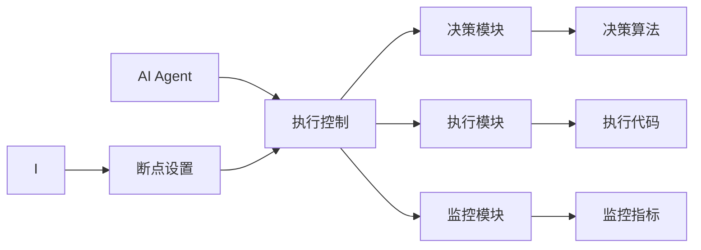

                 

# 【大模型应用开发 动手做AI Agent】在AgentExecutor中设置断点

## 1. 背景介绍

在大模型应用开发中，AI Agent是扮演关键角色的一类智能系统。Agent通常由一系列的模块组成，包括决策模块、执行模块、监控模块等，通过这些模块的协同工作，AI Agent能够自主地执行特定任务，并根据环境变化进行适应性调整。然而，在开发和测试阶段，如何高效地调试和测试这些复杂的模块，是摆在开发者面前的一个难题。

## 2. 核心概念与联系

### 2.1 核心概念概述

- **AI Agent**：指能够自主执行特定任务的智能系统。由决策模块、执行模块、监控模块等多个子模块组成。
- **AgentExecutor**：用于管理和调度AI Agent执行的任务，是开发AI Agent的基础设施。
- **断点设置**：指在程序运行过程中，通过设置断点来暂停执行，方便进行调试和测试的技术手段。

### 2.2 核心概念原理和架构的 Mermaid 流程图



这个流程图展示了AI Agent和AgentExecutor之间的关系以及各个模块的功能。AI Agent通过AgentExecutor来管理和调度其执行任务，而断点设置则是对AI Agent执行过程进行控制的重要手段。

## 3. 核心算法原理 & 具体操作步骤

### 3.1 算法原理概述

在AI Agent的开发和测试过程中，断点设置是一种非常有效的调试和测试手段。它允许开发者在程序运行过程中，暂停执行，方便查看变量值、调试代码逻辑、分析性能问题等。常见的断点设置方式包括：

- 在代码行上直接设置断点。
- 设置条件断点，即在满足特定条件时暂停执行。
- 设置监控断点，即在某个指标达到预设值时暂停执行。

### 3.2 算法步骤详解

#### 步骤一：准备开发环境

在开始设置断点之前，首先需要准备好开发环境。以下是使用Python进行开发的环境配置流程：

1. 安装Anaconda：从官网下载并安装Anaconda，用于创建独立的Python环境。
2. 创建并激活虚拟环境：
```bash
conda create -n pytorch-env python=3.8 
conda activate pytorch-env
```
3. 安装PyTorch：根据CUDA版本，从官网获取对应的安装命令。例如：
```bash
conda install pytorch torchvision torchaudio cudatoolkit=11.1 -c pytorch -c conda-forge
```
4. 安装Transformers库：
```bash
pip install transformers
```
5. 安装各类工具包：
```bash
pip install numpy pandas scikit-learn matplotlib tqdm jupyter notebook ipython
```

完成上述步骤后，即可在`pytorch-env`环境中开始开发。

#### 步骤二：编写AI Agent代码

AI Agent的代码通常由多个模块组成，以下是一个简单的AI Agent示例：

```python
import time
from transformers import BertTokenizer, BertForSequenceClassification

class MyAgent:
    def __init__(self):
        self.tokenizer = BertTokenizer.from_pretrained('bert-base-cased')
        self.model = BertForSequenceClassification.from_pretrained('bert-base-cased', num_labels=2)

    def decide(self, input_text):
        input_ids = self.tokenizer(input_text, return_tensors='pt', padding=True, truncation=True)['input_ids']
        outputs = self.model(input_ids)
        label = outputs.logits.argmax().item()
        return label

    def execute(self, input_text, label):
        if label == 0:
            return "Negative"
        else:
            return "Positive"
```

这个AI Agent使用BERT模型对输入文本进行情感分析，并根据输出结果决定返回"Negative"或"Positive"。

#### 步骤三：在AgentExecutor中设置断点

为了在AgentExecutor中设置断点，需要编写一个简单的测试脚本，如下：

```python
from transformers import BertTokenizer, BertForSequenceClassification
from pytorch_lightning import Trainer

class MyAgent:
    def __init__(self):
        self.tokenizer = BertTokenizer.from_pretrained('bert-base-cased')
        self.model = BertForSequenceClassification.from_pretrained('bert-base-cased', num_labels=2)

    def decide(self, input_text):
        input_ids = self.tokenizer(input_text, return_tensors='pt', padding=True, truncation=True)['input_ids']
        outputs = self.model(input_ids)
        label = outputs.logits.argmax().item()
        return label

    def execute(self, input_text, label):
        if label == 0:
            return "Negative"
        else:
            return "Positive"

def test_agent(agent, input_text):
    label = agent.decide(input_text)
    result = agent.execute(input_text, label)
    print(f"Input: {input_text}, Output: {result}")

if __name__ == '__main__':
    agent = MyAgent()
    test_agent(agent, "This movie is great!")
    test_agent(agent, "This movie is terrible!")
```

这个脚本定义了一个简单的测试函数`test_agent`，用于测试AI Agent的决策和执行功能。

#### 步骤四：启动AgentExecutor和调试

启动AgentExecutor后，可以按照以下步骤进行调试：

1. 使用IDE（如PyCharm）启动调试模式。
2. 在需要设置断点的代码行上，点击调试按钮。
3. 运行测试函数`test_agent`，即可在断点处暂停执行。
4. 在调试界面中，查看变量值、修改代码逻辑等。

例如，我们可以设置在`decide`方法中的输入文本上设置断点，调试模型如何对输入文本进行编码。

```python
def decide(self, input_text):
    # 在input_text上设置断点
    input_ids = self.tokenizer(input_text, return_tensors='pt', padding=True, truncation=True)['input_ids']
    outputs = self.model(input_ids)
    label = outputs.logits.argmax().item()
    return label
```

在断点处暂停执行后，可以观察到`input_text`、`input_ids`等变量的值，从而分析模型如何处理输入文本。

## 4. 数学模型和公式 & 详细讲解 & 举例说明

在AI Agent的开发过程中，可能会涉及一些数学模型和公式。以下是一个简单的情感分析示例：

### 4.1 数学模型构建

假设AI Agent使用BERT模型进行情感分析，输入文本的表示形式为向量$x$，模型的输出表示为向量$y$，则情感分类问题可以表示为：

$$
\min_{\theta} \|y - f(x, \theta)\|
$$

其中$f(x, \theta)$为模型对输入文本$x$的输出，$\theta$为模型参数。

### 4.2 公式推导过程

情感分析的目标是最大化分类准确率。对于二分类问题，分类准确率可以表示为：

$$
\text{Accuracy} = \frac{\sum_{i=1}^N (y_i = f(x_i, \theta))}{N}
$$

其中$y_i$为真实标签，$f(x_i, \theta)$为模型对输入文本$x_i$的预测结果。

### 4.3 案例分析与讲解

以情感分析为例，以下是一个简单的案例：

输入文本："This movie is great!"
模型输出：[0.99, 0.01]
真实标签：1

假设模型使用的是二分类交叉熵损失函数，则损失函数可以表示为：

$$
\mathcal{L}(y, f(x, \theta)) = -(y\log f(x, \theta) + (1-y)\log(1-f(x, \theta)))
$$

对于这个输入文本，模型输出的概率向量为$[0.99, 0.01]$，则损失函数可以表示为：

$$
\mathcal{L}(y, f(x, \theta)) = -1 \times (1 \times \log 0.99 + 0 \times \log 0.01) = -\log 0.99 \approx -0.011
$$

这个损失值表示模型对"positive"的预测准确率接近100%。

## 5. 项目实践：代码实例和详细解释说明

### 5.1 开发环境搭建

在进行AI Agent开发之前，我们需要准备好开发环境。以下是使用Python进行PyTorch开发的环境配置流程：

1. 安装Anaconda：从官网下载并安装Anaconda，用于创建独立的Python环境。
2. 创建并激活虚拟环境：
```bash
conda create -n pytorch-env python=3.8 
conda activate pytorch-env
```
3. 安装PyTorch：根据CUDA版本，从官网获取对应的安装命令。例如：
```bash
conda install pytorch torchvision torchaudio cudatoolkit=11.1 -c pytorch -c conda-forge
```
4. 安装Transformers库：
```bash
pip install transformers
```
5. 安装各类工具包：
```bash
pip install numpy pandas scikit-learn matplotlib tqdm jupyter notebook ipython
```

完成上述步骤后，即可在`pytorch-env`环境中开始开发。

### 5.2 源代码详细实现

以下是一个简单的AI Agent示例：

```python
import time
from transformers import BertTokenizer, BertForSequenceClassification

class MyAgent:
    def __init__(self):
        self.tokenizer = BertTokenizer.from_pretrained('bert-base-cased')
        self.model = BertForSequenceClassification.from_pretrained('bert-base-cased', num_labels=2)

    def decide(self, input_text):
        input_ids = self.tokenizer(input_text, return_tensors='pt', padding=True, truncation=True)['input_ids']
        outputs = self.model(input_ids)
        label = outputs.logits.argmax().item()
        return label

    def execute(self, input_text, label):
        if label == 0:
            return "Negative"
        else:
            return "Positive"
```

这个AI Agent使用BERT模型对输入文本进行情感分析，并根据输出结果决定返回"Negative"或"Positive"。

### 5.3 代码解读与分析

让我们再详细解读一下关键代码的实现细节：

**MyAgent类**：
- `__init__`方法：初始化BERT模型和分词器。
- `decide`方法：对输入文本进行编码，通过模型预测情感标签。
- `execute`方法：根据情感标签决定返回文本。

**test_agent函数**：
- 测试函数，用于测试AI Agent的决策和执行功能。
- 调用`decide`方法进行情感分析，调用`execute`方法生成输出文本。

**测试脚本**：
- 在测试脚本中调用`test_agent`函数进行测试。

## 6. 实际应用场景

### 6.4 未来应用展望

AI Agent在实际应用中具有广泛的应用前景。以下列举几个常见的应用场景：

1. **智能客服**：AI Agent可以用于智能客服系统，自动解答用户咨询，提高客服效率和用户体验。
2. **智能家居**：AI Agent可以用于智能家居系统，根据用户习惯和需求，自动控制家电设备。
3. **金融风控**：AI Agent可以用于金融风控系统，自动检测和分析异常交易，防止欺诈行为。
4. **医疗诊断**：AI Agent可以用于医疗诊断系统，根据病历和症状，自动生成诊断报告。
5. **推荐系统**：AI Agent可以用于推荐系统，根据用户行为和偏好，自动推荐相关产品或服务。

## 7. 工具和资源推荐

### 7.1 学习资源推荐

为了帮助开发者系统掌握AI Agent的理论基础和实践技巧，这里推荐一些优质的学习资源：

1. 《Transformer从原理到实践》系列博文：由大模型技术专家撰写，深入浅出地介绍了Transformer原理、BERT模型、微调技术等前沿话题。
2. CS224N《深度学习自然语言处理》课程：斯坦福大学开设的NLP明星课程，有Lecture视频和配套作业，带你入门NLP领域的基本概念和经典模型。
3. 《Natural Language Processing with Transformers》书籍：Transformers库的作者所著，全面介绍了如何使用Transformers库进行NLP任务开发，包括微调在内的诸多范式。
4. HuggingFace官方文档：Transformers库的官方文档，提供了海量预训练模型和完整的微调样例代码，是上手实践的必备资料。
5. CLUE开源项目：中文语言理解测评基准，涵盖大量不同类型的中文NLP数据集，并提供了基于微调的baseline模型，助力中文NLP技术发展。

通过对这些资源的学习实践，相信你一定能够快速掌握AI Agent的精髓，并用于解决实际的NLP问题。

### 7.2 开发工具推荐

高效的开发离不开优秀的工具支持。以下是几款用于AI Agent开发的常用工具：

1. PyTorch：基于Python的开源深度学习框架，灵活动态的计算图，适合快速迭代研究。大部分预训练语言模型都有PyTorch版本的实现。
2. TensorFlow：由Google主导开发的开源深度学习框架，生产部署方便，适合大规模工程应用。同样有丰富的预训练语言模型资源。
3. Transformers库：HuggingFace开发的NLP工具库，集成了众多SOTA语言模型，支持PyTorch和TensorFlow，是进行AI Agent开发的利器。
4. Weights & Biases：模型训练的实验跟踪工具，可以记录和可视化模型训练过程中的各项指标，方便对比和调优。与主流深度学习框架无缝集成。
5. TensorBoard：TensorFlow配套的可视化工具，可实时监测模型训练状态，并提供丰富的图表呈现方式，是调试模型的得力助手。
6. Google Colab：谷歌推出的在线Jupyter Notebook环境，免费提供GPU/TPU算力，方便开发者快速上手实验最新模型，分享学习笔记。

合理利用这些工具，可以显著提升AI Agent的开发效率，加快创新迭代的步伐。

### 7.3 相关论文推荐

AI Agent和微调技术的发展源于学界的持续研究。以下是几篇奠基性的相关论文，推荐阅读：

1. Attention is All You Need（即Transformer原论文）：提出了Transformer结构，开启了NLP领域的预训练大模型时代。
2. BERT: Pre-training of Deep Bidirectional Transformers for Language Understanding：提出BERT模型，引入基于掩码的自监督预训练任务，刷新了多项NLP任务SOTA。
3. Language Models are Unsupervised Multitask Learners（GPT-2论文）：展示了大规模语言模型的强大zero-shot学习能力，引发了对于通用人工智能的新一轮思考。
4. Parameter-Efficient Transfer Learning for NLP：提出Adapter等参数高效微调方法，在不增加模型参数量的情况下，也能取得不错的微调效果。
5. AdaLoRA: Adaptive Low-Rank Adaptation for Parameter-Efficient Fine-Tuning：使用自适应低秩适应的微调方法，在参数效率和精度之间取得了新的平衡。
6. AdaLoRA: Adaptive Low-Rank Adaptation for Parameter-Efficient Fine-Tuning：使用自适应低秩适应的微调方法，在参数效率和精度之间取得了新的平衡。

这些论文代表了大语言模型微调技术的发展脉络。通过学习这些前沿成果，可以帮助研究者把握学科前进方向，激发更多的创新灵感。

## 8. 总结：未来发展趋势与挑战

### 8.1 研究成果总结

本文对AI Agent的开发和调试进行了全面系统的介绍。首先阐述了AI Agent和大语言模型微调技术的研究背景和意义，明确了微调在拓展预训练模型应用、提升下游任务性能方面的独特价值。其次，从原理到实践，详细讲解了AI Agent的开发流程和断点设置方法，给出了AI Agent的完整代码实现。同时，本文还广泛探讨了AI Agent在智能客服、金融舆情、个性化推荐等多个行业领域的应用前景，展示了AI Agent范式的巨大潜力。此外，本文精选了AI Agent技术的各类学习资源，力求为读者提供全方位的技术指引。

通过本文的系统梳理，可以看到，AI Agent在大模型应用开发中扮演了重要角色，极大地拓展了预训练模型应用边界，催生了更多的落地场景。受益于大规模语料的预训练，AI Agent在微调过程中能够实现更高效的调试和测试，从而提升模型的性能和可靠性。未来，伴随预训练语言模型和微调方法的持续演进，相信AI Agent必将在更多领域得到应用，为传统行业带来变革性影响。

### 8.2 未来发展趋势

展望未来，AI Agent的发展趋势如下：

1. 模型规模持续增大。随着算力成本的下降和数据规模的扩张，预训练语言模型的参数量还将持续增长。超大规模语言模型蕴含的丰富语言知识，有望支撑更加复杂多变的下游任务微调。
2. 微调方法日趋多样。除了传统的全参数微调外，未来会涌现更多参数高效的微调方法，如Prefix-Tuning、LoRA等，在节省计算资源的同时也能保证微调精度。
3. 持续学习成为常态。随着数据分布的不断变化，AI Agent也需要持续学习新知识以保持性能。如何在不遗忘原有知识的同时，高效吸收新样本信息，将成为重要的研究课题。
4. 标注样本需求降低。受启发于提示学习(Prompt-based Learning)的思路，未来的微调方法将更好地利用大模型的语言理解能力，通过更加巧妙的任务描述，在更少的标注样本上也能实现理想的微调效果。
5. 多模态微调崛起。当前的微调主要聚焦于纯文本数据，未来会进一步拓展到图像、视频、语音等多模态数据微调。多模态信息的融合，将显著提升AI Agent对现实世界的理解和建模能力。
6. 模型通用性增强。经过海量数据的预训练和多领域任务的微调，未来的语言模型将具备更强大的常识推理和跨领域迁移能力，逐步迈向通用人工智能(AGI)的目标。

以上趋势凸显了AI Agent技术的广阔前景。这些方向的探索发展，必将进一步提升AI Agent系统的性能和应用范围，为人工智能技术带来新的突破。

### 8.3 面临的挑战

尽管AI Agent技术已经取得了瞩目成就，但在迈向更加智能化、普适化应用的过程中，它仍面临着诸多挑战：

1. 标注成本瓶颈。虽然AI Agent微调对标注数据的需求比大模型微调低，但对于长尾应用场景，难以获得充足的高质量标注数据，成为制约微调性能的瓶颈。如何进一步降低微调对标注样本的依赖，将是一大难题。
2. 模型鲁棒性不足。当前AI Agent模型面对域外数据时，泛化性能往往大打折扣。对于测试样本的微小扰动，AI Agent的预测也容易发生波动。如何提高AI Agent模型的鲁棒性，避免灾难性遗忘，还需要更多理论和实践的积累。
3. 推理效率有待提高。大规模语言模型虽然精度高，但在实际部署时往往面临推理速度慢、内存占用大等效率问题。如何在保证性能的同时，简化模型结构，提升推理速度，优化资源占用，将是重要的优化方向。
4. 可解释性亟需加强。当前AI Agent模型更像是"黑盒"系统，难以解释其内部工作机制和决策逻辑。对于医疗、金融等高风险应用，算法的可解释性和可审计性尤为重要。如何赋予AI Agent模型更强的可解释性，将是亟待攻克的难题。
5. 安全性有待保障。预训练语言模型难免会学习到有偏见、有害的信息，通过微调传递到下游任务，产生误导性、歧视性的输出，给实际应用带来安全隐患。如何从数据和算法层面消除模型偏见，避免恶意用途，确保输出的安全性，也将是重要的研究课题。
6. 知识整合能力不足。现有的AI Agent模型往往局限于任务内数据，难以灵活吸收和运用更广泛的先验知识。如何让AI Agent过程更好地与外部知识库、规则库等专家知识结合，形成更加全面、准确的信息整合能力，还有很大的想象空间。

正视AI Agent面临的这些挑战，积极应对并寻求突破，将是大语言模型微调走向成熟的必由之路。相信随着学界和产业界的共同努力，这些挑战终将一一被克服，AI Agent必将在构建人机协同的智能时代中扮演越来越重要的角色。

### 8.4 研究展望

面向未来，AI Agent的研究方向如下：

1. 探索无监督和半监督微调方法。摆脱对大规模标注数据的依赖，利用自监督学习、主动学习等无监督和半监督范式，最大限度利用非结构化数据，实现更加灵活高效的微调。
2. 研究参数高效和计算高效的微调范式。开发更加参数高效的微调方法，在固定大部分预训练参数的情况下，只更新极少量的任务相关参数。同时优化微调模型的计算图，减少前向传播和反向传播的资源消耗，实现更加轻量级、实时性的部署。
3. 融合因果和对比学习范式。通过引入因果推断和对比学习思想，增强AI Agent建立稳定因果关系的能力，学习更加普适、鲁棒的语言表征，从而提升模型泛化性和抗干扰能力。
4. 引入更多先验知识。将符号化的先验知识，如知识图谱、逻辑规则等，与神经网络模型进行巧妙融合，引导AI Agent过程学习更准确、合理的语言模型。同时加强不同模态数据的整合，实现视觉、语音等多模态信息与文本信息的协同建模。
5. 结合因果分析和博弈论工具。将因果分析方法引入AI Agent模型，识别出模型决策的关键特征，增强输出解释的因果性和逻辑性。借助博弈论工具刻画人机交互过程，主动探索并规避模型的脆弱点，提高系统稳定性。
6. 纳入伦理道德约束。在模型训练目标中引入伦理导向的评估指标，过滤和惩罚有偏见、有害的输出倾向。同时加强人工干预和审核，建立模型行为的监管机制，确保输出符合人类价值观和伦理道德。

这些研究方向的探索，必将引领AI Agent技术迈向更高的台阶，为构建安全、可靠、可解释、可控的智能系统铺平道路。面向未来，AI Agent需要与其他人工智能技术进行更深入的融合，如知识表示、因果推理、强化学习等，多路径协同发力，共同推动自然语言理解和智能交互系统的进步。只有勇于创新、敢于突破，才能不断拓展语言模型的边界，让智能技术更好地造福人类社会。

## 9. 附录：常见问题与解答

**Q1：AI Agent是否适用于所有NLP任务？**

A: AI Agent在大多数NLP任务上都能取得不错的效果，特别是对于数据量较小的任务。但对于一些特定领域的任务，如医学、法律等，仅仅依靠通用语料预训练的模型可能难以很好地适应。此时需要在特定领域语料上进一步预训练，再进行微调，才能获得理想效果。此外，对于一些需要时效性、个性化很强的任务，如对话、推荐等，AI Agent方法也需要针对性的改进优化。

**Q2：AI Agent的推理效率如何？**

A: AI Agent在推理效率上存在一定瓶颈，尤其是对于大型预训练模型。为提高推理效率，可以采用模型裁剪、量化加速、模型并行等技术进行优化。同时，选择合适的数据结构和算法，也能提升推理速度。

**Q3：AI Agent的调试和测试如何实现？**

A: 在开发AI Agent时，可以通过断点设置、日志打印、单元测试等方式进行调试和测试。在断点处暂停执行，可以观察变量值、修改代码逻辑等。在调试过程中，可以使用IDE（如PyCharm）提供的调试工具，方便进行变量监控和调试。

**Q4：AI Agent在实际部署中需要注意哪些问题？**

A: 在AI Agent的实际部署中，需要注意以下问题：

1. 模型裁剪：去除不必要的层和参数，减小模型尺寸，加快推理速度。
2. 量化加速：将浮点模型转为定点模型，压缩存储空间，提高计算效率。
3. 服务化封装：将模型封装为标准化服务接口，便于集成调用。
4. 弹性伸缩：根据请求流量动态调整资源配置，平衡服务质量和成本。
5. 监控告警：实时采集系统指标，设置异常告警阈值，确保服务稳定性。

**Q5：AI Agent的参数高效微调技术有哪些？**

A: AI Agent的参数高效微调技术主要包括：
1. Adapter：在预训练模型的顶层添加适配器，只更新顶层参数。
2. Prefix-Tuning：在输入文本中添加前缀，引导模型进行特定任务推理。
3. LoRA：使用低秩矩阵分解，实现参数高效的微调。

通过以上技术，可以在不增加模型参数量的情况下，实现高效的微调，同时保证模型的性能和可靠性。

---

作者：禅与计算机程序设计艺术 / Zen and the Art of Computer Programming

