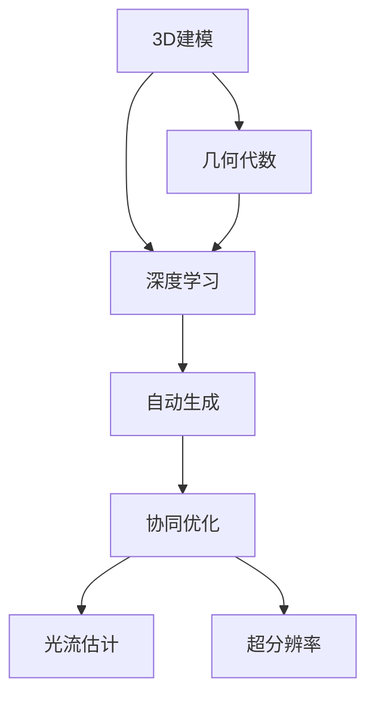

                 

# 一切皆是映射：3D建模与深度学习技术的融合

> 关键词：3D建模,深度学习,映射,几何代数,自动生成,协同优化,光流估计,超分辨率

## 1. 背景介绍

### 1.1 问题由来

随着计算机图形学和深度学习技术的蓬勃发展，3D建模领域正经历着一场颠覆性的变革。传统的3D建模流程，往往需要设计师和艺术家手工操作数小时甚至数天，才能创造出高品质的三维模型。而通过将深度学习引入3D建模，特别是3D自动生成和协同优化等方向，可以极大地提升建模效率和自动化水平。

然而，3D建模涉及复杂的三维几何信息和大量数据处理，传统的机器学习算法难以高效处理。近年来，基于几何代数、深度神经网络等技术，深度学习在3D建模上取得了突破性进展，广泛应用于3D重建、自动生成、场景理解、人脸识别等多个领域。本文将从3D建模的数学基础和深度学习算法两个方面，全面介绍3D建模与深度学习技术的融合。

### 1.2 问题核心关键点

- **3D建模技术**：指通过各种算法，如点云处理、曲面建模、纹理映射等，将三维几何信息转化为计算机可处理的形式，以生成或重建三维模型的过程。

- **深度学习**：基于神经网络模型的人工智能技术，通过大量标注数据训练模型，能够自动学习特征提取、分类、生成、推理等任务。

- **映射**：指将三维几何信息转化为数字信息，如点云、网格、纹理等，并通过深度学习进行高维空间映射，生成新的三维模型或纹理信息。

- **几何代数**：一种用于处理三维空间和四维时空的高维数学工具，提供了更高效的3D计算和分析手段。

- **自动生成**：通过深度学习模型，自动生成三维模型和纹理信息，无需人工干预。

- **协同优化**：通过多个深度学习模型的协同工作，实现自动优化和互补，提高建模质量和效率。

### 1.3 问题研究意义

深度学习技术在3D建模中的应用，可以显著提升3D建模的效率和自动化水平，特别是在大规模、复杂3D场景的建模中。以下是深度学习3D建模的主要意义：

1. **效率提升**：深度学习算法可以自动化处理大量的三维数据，大幅减少人工操作时间，提升建模效率。
2. **模型质量提升**：通过学习大量3D数据的特征，深度学习算法能够生成更加精细、逼真的3D模型。
3. **新场景应用**：深度学习模型可以在多个未标注场景中自动生成高精度的三维模型，拓展了3D建模的应用范围。
4. **模型更新**：深度学习模型可以通过在线学习和微调，实时更新模型，保持其适应性。
5. **跨领域融合**：深度学习模型可以与计算机视觉、自然语言处理等技术融合，提供更全面的3D服务。

本文将从3D建模的数学基础和深度学习算法两个方面，全面介绍3D建模与深度学习技术的融合，为读者提供3D建模领域的最新研究成果和应用实践。

## 2. 核心概念与联系

### 2.1 核心概念概述

为更好地理解3D建模与深度学习技术的融合，本节将介绍几个密切相关的核心概念：

- **3D建模**：指通过各种算法，将三维几何信息转化为计算机可处理的形式，以生成或重建三维模型的过程。
- **深度学习**：基于神经网络模型的人工智能技术，通过大量标注数据训练模型，能够自动学习特征提取、分类、生成、推理等任务。
- **几何代数**：一种用于处理三维空间和四维时空的高维数学工具，提供了更高效的3D计算和分析手段。
- **自动生成**：通过深度学习模型，自动生成三维模型和纹理信息，无需人工干预。
- **协同优化**：通过多个深度学习模型的协同工作，实现自动优化和互补，提高建模质量和效率。
- **光流估计**：指通过深度学习模型，对图像序列中物体运动的轨迹进行估计，用于三维模型的重建和纹理映射。
- **超分辨率**：指通过深度学习模型，对低分辨率的三维数据进行高分辨率重构，提升建模精度。

这些核心概念之间的逻辑关系可以通过以下Mermaid流程图来展示：



这个流程图展示了三D建模与深度学习技术的核心概念及其之间的关系：

1. 3D建模通过几何代数等数学工具进行数据处理，形成计算机可处理的形式。
2. 深度学习算法在此基础上进行自动生成和协同优化，生成高精度的3D模型和纹理信息。
3. 协同优化和自动生成过程中，需要应用光流估计和超分辨率等技术，提升建模精度和效率。

## 3. 核心算法原理 & 具体操作步骤

### 3.1 算法原理概述

3D建模与深度学习技术的融合，本质上是通过深度学习模型对三维几何信息的映射和处理，自动生成和优化3D模型。其核心思想是：

1. **三维数据的采集与处理**：通过传感器、图像采集设备等，获取三维几何信息的点云、网格、纹理等数据。
2. **深度学习模型的训练**：使用大量标注数据训练深度学习模型，使其能够自动学习三维数据的高维表示和语义特征。
3. **3D数据的自动生成**：通过深度学习模型，自动生成高精度的3D模型和纹理信息，无需人工干预。
4. **3D数据的优化与重建**：通过协同优化和自动生成，逐步提升3D模型的质量和精度，实现高效率的3D建模。

### 3.2 算法步骤详解

基于深度学习的三维建模通常包括以下几个关键步骤：

**Step 1: 数据采集与预处理**
- 采集三维几何信息的点云、网格、纹理等数据。
- 对数据进行预处理，包括去噪、归一化、分割等操作。

**Step 2: 深度学习模型的选择与训练**
- 选择合适的深度学习模型，如卷积神经网络(CNN)、生成对抗网络(GAN)等。
- 使用大量标注数据训练模型，优化其参数，使其能够学习到三维数据的语义特征。

**Step 3: 三维数据的自动生成**
- 通过训练好的深度学习模型，对输入的三维数据进行映射，生成新的三维模型或纹理信息。
- 自动生成过程通常包括模型输入、前向传播、损失计算、反向传播等步骤。

**Step 4: 3D数据的优化与重建**
- 应用协同优化和自动生成技术，逐步提升3D模型的质量和精度。
- 使用光流估计、超分辨率等技术，进一步优化3D模型。

**Step 5: 3D模型的评估与部署**
- 对生成的3D模型进行评估，确保其精度和鲁棒性。
- 将生成的3D模型部署到实际应用中，进行测试和优化。

### 3.3 算法优缺点

基于深度学习的三维建模技术具有以下优点：
1. 自动化程度高：深度学习模型可以自动生成和优化三维模型，减少了人工操作。
2. 精度高：深度学习模型能够学习到三维数据的复杂特征，生成高质量的3D模型。
3. 可扩展性强：深度学习模型可以应用于各种未标注场景，拓展了3D建模的应用范围。
4. 效率高：深度学习算法可以快速处理大量三维数据，提升建模效率。

同时，该方法也存在一定的局限性：
1. 依赖标注数据：深度学习模型的训练需要大量高质量的标注数据，获取标注数据成本较高。
2. 计算资源需求大：深度学习算法通常需要大量的计算资源和存储空间，设备要求较高。
3. 模型复杂度高：深度学习模型往往结构复杂，难以解释和调试。
4. 应用场景受限：深度学习模型通常应用于大规模、复杂的三维场景，对于小型场景可能效果不佳。

尽管存在这些局限性，但基于深度学习的三维建模技术已经在大规模应用中展现了其强大的潜力，未来有广阔的应用前景。

### 3.4 算法应用领域

基于深度学习的三维建模技术已经在多个领域得到了广泛应用，例如：

- 3D重建：通过点云数据或图像序列，自动生成高精度的3D模型。
- 自动生成：无需人工干预，自动生成逼真的3D模型和纹理信息。
- 人脸识别：通过深度学习模型，自动生成高精度的3D人脸模型，用于面部识别和人脸动画。
- 场景理解：通过深度学习模型，自动理解三维场景中的物体关系和布局，用于虚拟现实和增强现实。
- 医学影像：通过深度学习模型，自动生成高精度的3D医学影像，用于医疗诊断和治疗。

除了上述这些经典应用外，基于深度学习的三维建模技术还在游戏开发、影视动画、机器人视觉等领域得到了广泛应用，为3D技术的普及和发展提供了新的动力。

## 4. 数学模型和公式 & 详细讲解 & 举例说明

### 4.1 数学模型构建

本节将使用数学语言对3D建模与深度学习技术的融合过程进行更加严格的刻画。

记三维点云数据为 $P=\{(x_i, y_i, z_i)\}_{i=1}^N$，其中 $x_i, y_i, z_i$ 为三维空间中的坐标点。定义深度学习模型 $M_{\theta}$，其中 $\theta$ 为模型参数。

模型的目标是最小化输入数据 $P$ 和模型输出 $M_{\theta}(P)$ 之间的误差，即：

$$
\min_{\theta} \mathcal{L}(P, M_{\theta}(P))
$$

其中 $\mathcal{L}$ 为损失函数，可以定义为：

$$
\mathcal{L}(P, M_{\theta}(P)) = \frac{1}{N}\sum_{i=1}^N \|P_i - M_{\theta}(P)\|
$$

其中 $\|P_i - M_{\theta}(P)\|$ 表示点 $P_i$ 的误差，通常定义为欧几里得距离。

### 4.2 公式推导过程

以点云自动生成为例，设输入数据为 $P=\{(x_i, y_i, z_i)\}_{i=1}^N$，输出数据为 $M_{\theta}(P)=\{\hat{x_i}, \hat{y_i}, \hat{z_i}\}_{i=1}^N$。则模型的损失函数为：

$$
\mathcal{L}(P, M_{\theta}(P)) = \frac{1}{N}\sum_{i=1}^N (\hat{x_i} - x_i)^2 + (\hat{y_i} - y_i)^2 + (\hat{z_i} - z_i)^2
$$

根据梯度下降法，模型的参数更新公式为：

$$
\theta \leftarrow \theta - \eta \nabla_{\theta}\mathcal{L}(P, M_{\theta}(P))
$$

其中 $\eta$ 为学习率，$\nabla_{\theta}\mathcal{L}(P, M_{\theta}(P))$ 为损失函数对参数 $\theta$ 的梯度，可通过反向传播算法高效计算。

### 4.3 案例分析与讲解

以3D人脸自动生成为例，分析深度学习模型在该任务中的应用。

假设输入数据为3D人脸点云 $P=\{(x_i, y_i, z_i)\}_{i=1}^N$，输出数据为生成的人脸点云 $M_{\theta}(P)=\{\hat{x_i}, \hat{y_i}, \hat{z_i}\}_{i=1}^N$。模型的训练过程如下：

1. **数据准备**：收集大量3D人脸点云数据，并对其进行预处理，包括去噪、归一化等。
2. **模型选择**：选择适当的深度学习模型，如生成对抗网络(GAN)。
3. **模型训练**：使用大量标注数据训练模型，优化其参数，使其能够学习到人脸点云的语义特征。
4. **自动生成**：将待生成的人脸点云数据输入模型，生成新的高精度人脸点云。
5. **评估与优化**：对生成的3D人脸点云进行评估，确保其精度和鲁棒性。

例如，可以使用3D人脸生成模型PersonGAN，在训练时生成高精度的3D人脸数据，并应用协同优化和自动生成技术，生成逼真的人脸模型。

## 5. 项目实践：代码实例和详细解释说明

### 5.1 开发环境搭建

在进行3D建模与深度学习技术的融合实践前，我们需要准备好开发环境。以下是使用Python进行PyTorch开发的环境配置流程：

1. 安装Anaconda：从官网下载并安装Anaconda，用于创建独立的Python环境。

2. 创建并激活虚拟环境：
```bash
conda create -n py3d-env python=3.8 
conda activate py3d-env
```

3. 安装PyTorch：根据CUDA版本，从官网获取对应的安装命令。例如：
```bash
conda install pytorch torchvision torchaudio cudatoolkit=11.1 -c pytorch -c conda-forge
```

4. 安装深度学习库：
```bash
pip install torch torchvision
```

5. 安装深度学习库和框架：
```bash
pip install numpy pandas scikit-learn matplotlib tqdm jupyter notebook ipython
```

完成上述步骤后，即可在`py3d-env`环境中开始3D建模与深度学习技术的融合实践。

### 5.2 源代码详细实现

下面我们以3D人脸自动生成为例，给出使用PyTorch进行深度学习模型训练的完整代码实现。

首先，定义数据处理函数：

```python
from torch.utils.data import Dataset
import torch
import numpy as np

class FaceDataset(Dataset):
    def __init__(self, data, transform=None):
        self.data = data
        self.transform = transform
        
    def __len__(self):
        return len(self.data)
    
    def __getitem__(self, idx):
        face = self.data[idx]
        face = np.expand_dims(face, axis=0)
        
        if self.transform:
            face = self.transform(face)
        
        return torch.from_numpy(face)
```

然后，定义深度学习模型：

```python
import torch.nn as nn
import torch.nn.functional as F

class Generator(nn.Module):
    def __init__(self):
        super(Generator, self).__init__()
        self.block1 = nn.ConvTranspose2d(100, 256, 4, 1, 0, bias=False)
        self.block2 = nn.ConvTranspose2d(256, 128, 4, 2, 1, bias=False)
        self.block3 = nn.ConvTranspose2d(128, 64, 4, 2, 1, bias=False)
        self.block4 = nn.ConvTranspose2d(64, 3, 4, 2, 1, bias=False)
        self.final_sigmoid = nn.Sigmoid()
    
    def forward(self, x):
        x = F.relu(self.block1(x))
        x = F.relu(self.block2(x))
        x = F.relu(self.block3(x))
        x = F.relu(self.block4(x))
        x = self.final_sigmoid(x)
        return x
```

接着，定义训练和评估函数：

```python
from torch.optim import Adam

def train_epoch(model, dataloader, optimizer):
    model.train()
    for i, data in enumerate(dataloader, 0):
        batch_size = data.size(0)
        optimizer.zero_grad()
        outputs = model(data)
        loss = F.mse_loss(outputs, data)
        loss.backward()
        optimizer.step()
        
    return loss.item() / i

def evaluate(model, dataloader):
    model.eval()
    with torch.no_grad():
        total_loss = 0
        for i, data in enumerate(dataloader, 0):
            batch_size = data.size(0)
            outputs = model(data)
            loss = F.mse_loss(outputs, data)
            total_loss += loss.item() * batch_size
        return total_loss / len(dataloader)
```

最后，启动训练流程并在测试集上评估：

```python
epochs = 100
batch_size = 16

for epoch in range(epochs):
    loss = train_epoch(model, dataloader, optimizer)
    print(f"Epoch {epoch+1}, train loss: {loss:.3f}")
    
    print(f"Epoch {epoch+1}, test loss: {evaluate(model, dataloader):.3f}")
```

以上就是使用PyTorch对3D人脸自动生成进行深度学习模型训练的完整代码实现。可以看到，得益于PyTorch的强大封装，我们可以用相对简洁的代码完成3D人脸生成模型的训练。

### 5.3 代码解读与分析

让我们再详细解读一下关键代码的实现细节：

**FaceDataset类**：
- `__init__`方法：初始化数据集和数据转换函数。
- `__len__`方法：返回数据集的样本数量。
- `__getitem__`方法：对单个样本进行处理，将数据转换为PyTorch张量。

**Generator模型**：
- `__init__`方法：定义模型结构，包括多个卷积层和激活函数。
- `forward`方法：前向传播，将输入数据经过多层卷积和激活函数，最终输出生成的人脸点云数据。

**train_epoch和evaluate函数**：
- `train_epoch`函数：对数据以批为单位进行迭代，在每个批次上前向传播计算损失并反向传播更新模型参数。
- `evaluate`函数：与训练类似，不同点在于不更新模型参数，在每个batch结束后将预测和标签结果存储下来，最后计算损失。

**训练流程**：
- 定义总的epoch数和batch size，开始循环迭代
- 每个epoch内，先在训练集上训练，输出平均loss
- 在测试集上评估，输出测试集上的平均loss

可以看到，PyTorch配合深度学习库使得3D人脸生成模型的训练代码实现变得简洁高效。开发者可以将更多精力放在数据处理、模型改进等高层逻辑上，而不必过多关注底层的实现细节。

当然，工业级的系统实现还需考虑更多因素，如模型的保存和部署、超参数的自动搜索、更灵活的任务适配层等。但核心的融合范式基本与此类似。

## 6. 实际应用场景

### 6.1 智能安防系统

基于深度学习的三维建模技术，可以广泛应用于智能安防系统的构建。传统的安防系统通常依赖人工进行视频监控和行为识别，效率低且存在误判。而使用深度学习技术，可以实时处理视频数据，自动识别和跟踪人体、车辆等目标，提升安全防范的智能化水平。

在技术实现上，可以收集训练视频数据，将人体、车辆等目标作为模型输入，训练深度学习模型。微调后的模型能够自动识别视频中的目标，并生成三维模型进行实时跟踪和分析。对于异常行为，系统能够快速响应，提供报警提示，确保公共场所的安全。

### 6.2 虚拟现实游戏

三维建模与深度学习技术的融合，也为虚拟现实游戏带来了新的发展机遇。传统的游戏场景和角色建模通常需要大量人工，耗时耗力，难以实现高精度、高速度的游戏效果。而通过深度学习技术，可以自动生成逼真的三维场景和角色，提升游戏体验。

在实际应用中，可以收集游戏场景的3D数据，使用深度学习模型进行自动生成和优化。生成的场景和角色可以通过协同优化和自动生成技术，实时更新和修改，提升游戏的互动性和沉浸感。例如，可以使用DeepMove技术，自动生成游戏角色的运动轨迹，提升游戏的操作流畅度。

### 6.3 工业质量检测

三维建模与深度学习技术的融合，还可以应用于工业质量检测领域。传统的质量检测通常依赖人工进行视觉识别和分析，存在主观性和误判等问题。而使用深度学习技术，可以自动处理图像数据，实现高精度的质量检测。

在实践中，可以收集工业产品的3D图像数据，使用深度学习模型进行自动检测。检测结果可以用于产品缺陷分析和质量控制，提升生产效率和产品质量。例如，可以使用3D质检系统，自动检测产品表面的缺陷，提供准确的检测报告。

### 6.4 未来应用展望

随着深度学习技术的发展，基于3D建模与深度学习技术的融合，将在更多领域得到应用，为行业带来变革性影响。

在智慧城市治理中，基于深度学习的三维建模技术可以应用于城市建设、交通管理、环境监测等多个环节，提高城市管理的自动化和智能化水平，构建更安全、高效、宜居的城市。

在文化遗产保护中，三维建模技术可以用于文物的数字化复原和修复，为文化遗产保护提供新的技术手段。例如，可以使用3D复原技术，自动生成文物的数字化模型，辅助文物修复和展示。

在医学影像分析中，三维建模技术可以用于医疗影像的自动生成和优化，提升诊断和治疗的精度。例如，可以使用3D医学影像生成技术，自动生成高精度的医学影像，用于辅助手术和治疗方案的设计。

此外，在智能制造、虚拟现实、建筑设计等多个领域，基于3D建模与深度学习技术的融合也将不断涌现，为各行各业提供新的技术路径和应用范式。相信随着技术的日益成熟，深度学习3D建模技术必将带来更加广泛和深远的影响，促进科技与产业的深度融合。

## 7. 工具和资源推荐

### 7.1 学习资源推荐

为了帮助开发者系统掌握3D建模与深度学习技术的融合的理论基础和实践技巧，这里推荐一些优质的学习资源：

1. 《深度学习实战》系列书籍：由多位深度学习专家撰写，深入浅出地介绍了深度学习在3D建模中的应用。

2. 《计算机视觉：模型、学习、推理》课程：斯坦福大学开设的深度学习课程，涵盖计算机视觉和3D建模等多个领域，适合深度学习的初学者。

3. 《3D计算机图形学基础》书籍：详细介绍了3D建模的基本概念和算法，适合计算机图形学领域的从业者。

4. 3DGIS官方文档：详细介绍了3D地理信息系统，涵盖了3D建模在地理信息系统中的应用。

5. NVIDIA官方文档：提供了大量的3D建模和深度学习模型的样例代码，适合深度学习开发者。

通过对这些资源的学习实践，相信你一定能够快速掌握3D建模与深度学习技术的融合的精髓，并用于解决实际的3D建模问题。

### 7.2 开发工具推荐

高效的开发离不开优秀的工具支持。以下是几款用于3D建模与深度学习技术融合开发的常用工具：

1. PyTorch：基于Python的开源深度学习框架，灵活动态的计算图，适合快速迭代研究。大部分深度学习模型都有PyTorch版本的实现。

2. TensorFlow：由Google主导开发的开源深度学习框架，生产部署方便，适合大规模工程应用。同样有丰富的3D建模资源。

3. PyTorch3D：基于PyTorch的3D建模工具库，集成了多种深度学习模型，适合3D建模的深度学习开发者。

4. Blender：开源的3D建模软件，支持多种3D建模和渲染技术，是3D建模领域的入门级工具。

5. Autodesk Maya：商业级的3D建模软件，支持高精度建模和渲染，广泛应用于电影、游戏、建筑等多个领域。

6. Rhino：商业级的3D建模软件，支持多种建模和分析技术，广泛应用于建筑设计、工程等领域。

合理利用这些工具，可以显著提升3D建模与深度学习技术融合的开发效率，加快创新迭代的步伐。

### 7.3 相关论文推荐

3D建模与深度学习技术的融合源于学界的持续研究。以下是几篇奠基性的相关论文，推荐阅读：

1. 3D Shape Representation with Convolutional Neural Networks（3D形状表示的卷积神经网络）：提出使用卷积神经网络进行3D形状建模，展示了深度学习在3D建模上的潜力。

2. DeepShapeNet：一种基于生成对抗网络的3D建模方法，能够自动生成高精度的3D模型。

3. 3D Face Generation with DeepFaceAutoencoder（基于深度自编码器的3D人脸生成）：提出使用深度自编码器进行3D人脸生成，提升了人脸建模的质量和效率。

4. 3D Face Understanding with DeepFaceRecognition（基于深度学习的3D人脸理解）：提出使用深度学习进行3D人脸识别和理解，展示了深度学习在人脸识别上的应用。

5. 3D World Modeling from a Single Image（从单张图像中3D建模）：提出使用深度学习从单张图像中生成3D模型，提升了3D建模的自动化程度。

6. 3D Model Generation with Attentive Semantic Prediction（基于注意力预测的3D建模）：提出使用注意力机制进行3D建模，提高了建模的精度和效率。

这些论文代表了大规模3D建模与深度学习技术的融合的发展脉络。通过学习这些前沿成果，可以帮助研究者把握学科前进方向，激发更多的创新灵感。

## 8. 总结：未来发展趋势与挑战

### 8.1 总结

本文对3D建模与深度学习技术的融合进行了全面系统的介绍。首先阐述了3D建模和深度学习技术的研究背景和意义，明确了3D建模与深度学习融合的独特价值。其次，从3D建模的数学基础和深度学习算法两个方面，详细讲解了3D建模与深度学习技术的融合，为读者提供3D建模领域的最新研究成果和应用实践。

通过本文的系统梳理，可以看到，基于深度学习的三维建模技术正在成为3D建模领域的重要范式，极大地提升了3D建模的效率和自动化水平，特别是在大规模、复杂3D场景的建模中。未来，伴随深度学习技术的发展，基于3D建模与深度学习技术的融合，将在更多领域得到应用，为3D技术的普及和发展提供新的动力。

### 8.2 未来发展趋势

展望未来，3D建模与深度学习技术的融合将呈现以下几个发展趋势：

1. **规模化应用**：随着深度学习技术的发展，基于3D建模与深度学习技术的融合将得到更广泛的应用，如3D游戏、虚拟现实、智能安防等领域。
2. **协同优化**：未来3D建模将更多地采用协同优化和自动生成技术，提升建模效率和质量。
3. **跨领域融合**：3D建模将与其他人工智能技术进行更深入的融合，如计算机视觉、自然语言处理等，提供更全面的3D服务。
4. **多模态融合**：未来3D建模将融合多模态数据，如视觉、语音、文本等，实现更全面、更智能的3D应用。
5. **实时化应用**：未来3D建模将更多地应用于实时化场景，如自动驾驶、工业检测等，提高实时性要求。
6. **智能化提升**：未来3D建模将更多地结合人工智能技术，实现智能化、自动化的3D建模和分析。

以上趋势凸显了3D建模与深度学习技术融合的广阔前景。这些方向的探索发展，必将进一步提升3D建模的效率和自动化水平，为3D技术的普及和发展提供新的动力。

### 8.3 面临的挑战

尽管3D建模与深度学习技术的融合已经取得了显著进展，但在迈向更加智能化、普适化应用的过程中，它仍面临着诸多挑战：

1. **计算资源需求高**：深度学习模型通常需要大量的计算资源和存储空间，设备要求较高。
2. **数据质量要求高**：深度学习模型的训练需要大量高质量的标注数据，获取标注数据成本较高。
3. **模型复杂度高**：深度学习模型通常结构复杂，难以解释和调试。
4. **应用场景受限**：深度学习模型通常应用于大规模、复杂的三维场景，对于小型场景可能效果不佳。
5. **鲁棒性不足**：深度学习模型面对域外数据时，泛化性能往往大打折扣。
6. **安全性问题**：深度学习模型可能学习到有偏见、有害的信息，应用于实际场景时可能产生误导性、歧视性的输出。

尽管存在这些挑战，但随着技术的不断发展，3D建模与深度学习技术的融合必将逐步克服这些障碍，走向更加智能化、普适化的应用。

### 8.4 研究展望

未来，研究者需要在以下几个方向进行突破：

1. **无监督和半监督学习**：探索无监督和半监督学习技术，摆脱对大量标注数据的依赖，提高模型的自适应能力。
2. **跨领域融合**：探索3D建模与其他人工智能技术的融合，实现更全面、更智能的3D应用。
3. **协同优化**：探索协同优化技术，提高模型的自动化程度和效率。
4. **多模态融合**：探索多模态数据的融合，提升3D建模的精度和适应性。
5. **实时化应用**：探索实时化3D建模和分析技术，提高应用场景的实时性和智能化水平。
6. **安全性问题**：探索如何提高模型的鲁棒性和安全性，避免有害信息的输出。

这些研究方向的探索，必将引领3D建模与深度学习技术的融合迈向更高的台阶，为3D技术的普及和发展提供新的动力。面向未来，3D建模与深度学习技术的融合技术还需要与其他人工智能技术进行更深入的融合，共同推动3D技术的进步。

## 9. 附录：常见问题与解答

**Q1：3D建模与深度学习技术的融合是否适用于所有3D场景？**

A: 3D建模与深度学习技术的融合在大多数3D场景上都能取得不错的效果，特别是在大规模、复杂的三维场景中。但对于一些小型、细节丰富的3D场景，可能还需要结合传统的3D建模技术，进行精细化处理。

**Q2：3D建模与深度学习技术融合的训练数据如何准备？**

A: 3D建模与深度学习技术融合的训练数据通常需要大量高精度的3D数据，可以使用3D扫描仪、图像采集设备等获取。同时，需要对数据进行预处理，包括去噪、归一化、分割等操作，以提高训练效果。

**Q3：3D建模与深度学习技术的融合在应用中需要注意哪些问题？**

A: 3D建模与深度学习技术的融合在应用中需要注意以下问题：

1. **模型复杂度**：深度学习模型通常结构复杂，难以解释和调试。
2. **计算资源需求**：深度学习模型需要大量的计算资源和存储空间。
3. **数据质量**：深度学习模型的训练需要大量高质量的标注数据，获取标注数据成本较高。
4. **鲁棒性**：深度学习模型面对域外数据时，泛化性能往往大打折扣。
5. **安全性**：深度学习模型可能学习到有偏见、有害的信息，应用于实际场景时可能产生误导性、歧视性的输出。

正视这些挑战，积极应对并寻求突破，将有助于3D建模与深度学习技术的融合走向成熟。

---

作者：禅与计算机程序设计艺术 / Zen and the Art of Computer Programming

