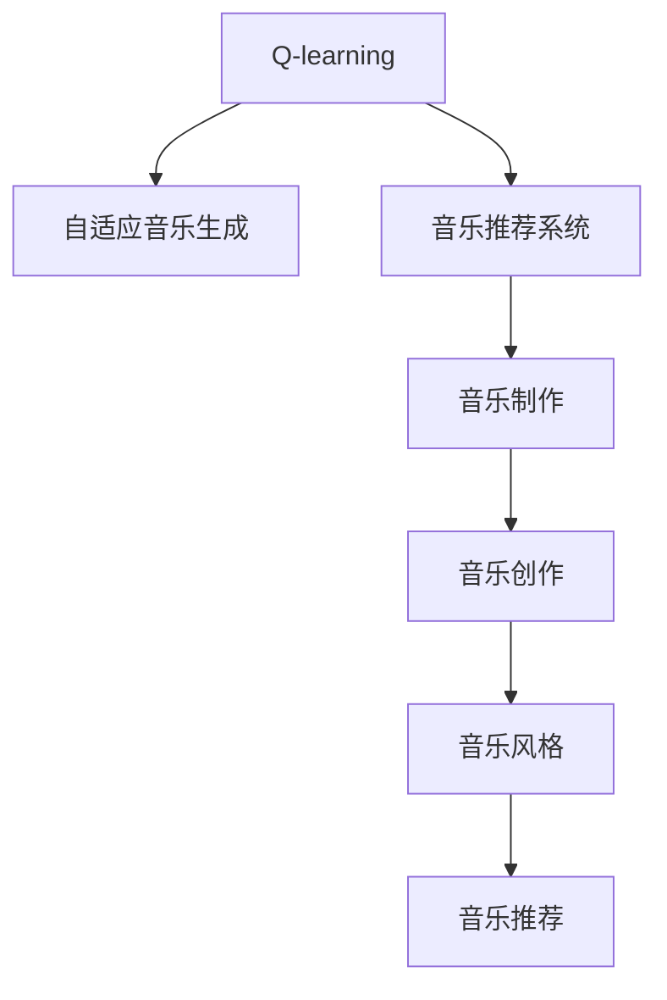

                 

# 一切皆是映射：AI Q-learning在音乐制作中的应用

> 关键词：Q-learning, 音乐制作, AI, 自适应音乐生成, 音乐推荐系统

## 1. 背景介绍

音乐制作是一个充满创意和灵感的领域，它不仅要求音乐制作人有丰富的经验和技能，还需要不断突破传统，创新音乐表达方式。随着人工智能技术的发展，AI在音乐制作中的应用越来越广泛，为音乐创作提供了新的工具和思路。其中，Q-learning是一种经典的强化学习算法，在音乐制作领域展现了强大的应用潜力，可以帮助音乐制作人在创意和制作过程中更好地理解和掌握音乐语言，提高创作效率和作品质量。

### 1.1 问题由来

在音乐制作中，如何提高创作的智能化水平，让机器更好地理解和生成音乐，一直是研究的热点问题。传统的音乐制作依赖于音乐人的经验和技术，但在音乐风格多样、制作过程复杂的情况下，人工创作往往难以满足高效、高质创作的需求。因此，如何利用人工智能技术，特别是强化学习算法，来辅助音乐创作和制作，成为一个重要的研究方向。

### 1.2 问题核心关键点

Q-learning是一种基于模型的强化学习算法，通过在特定环境下的奖励机制，指导智能体学习最优策略，从而实现智能决策。在音乐制作中，Q-learning可以用于自适应音乐生成、音乐推荐系统等多个方面。具体而言：

- 自适应音乐生成：Q-learning可以帮助智能体学习到音乐中的风格、节奏和情感等信息，并在新的音乐创作中灵活应用，生成符合特定风格和情感的音乐。
- 音乐推荐系统：通过Q-learning学习用户对不同音乐的偏好，智能推荐个性化的音乐，提升用户体验和满意度。

## 2. 核心概念与联系

### 2.1 核心概念概述

为更好地理解Q-learning在音乐制作中的应用，本节将介绍几个密切相关的核心概念：

- Q-learning：一种基于模型的强化学习算法，通过在特定环境下的奖励机制，指导智能体学习最优策略，从而实现智能决策。
- 音乐创作：通过创造性地组合音高、节奏、和弦等音乐元素，表达情感和故事，创作出具有艺术价值的音乐作品。
- 音乐推荐系统：根据用户的历史听歌行为，推荐个性化的音乐，提升用户满意度。
- 音乐制作：包括音乐创作、录音、混音、母带处理等环节，最终形成完整的音乐作品。
- 音乐风格：指音乐作品所特有的表现形式、结构、节奏、韵律等特征。

这些概念之间的逻辑关系可以通过以下Mermaid流程图来展示：



这个流程图展示了大语言模型的核心概念及其之间的关系：

1. Q-learning通过奖励机制指导智能体学习最优策略。
2. 自适应音乐生成应用Q-learning生成符合特定风格和情感的音乐。
3. 音乐推荐系统利用Q-learning学习用户偏好，智能推荐音乐。
4. 音乐制作包括创作、录音、混音、母带处理等多个环节。
5. 音乐风格是音乐创作中的核心要素。
6. 音乐推荐系统能提升用户对音乐作品的满意度。

这些概念共同构成了AI在音乐制作中的核心应用框架，使其能够在音乐创作和制作过程中发挥重要作用。

## 3. 核心算法原理 & 具体操作步骤
### 3.1 算法原理概述

Q-learning是一种基于模型的强化学习算法，其核心思想是通过在特定环境下的奖励机制，指导智能体学习最优策略，从而实现智能决策。在音乐制作中，Q-learning可以用于自适应音乐生成、音乐推荐系统等多个方面。具体而言：

1. **自适应音乐生成**：通过构建音乐创作环境，智能体在每个状态（如音高、节奏、和弦等）下，通过探索和采样，生成符合特定风格和情感的音乐。

2. **音乐推荐系统**：通过收集用户的听歌历史，智能体学习用户对不同音乐的偏好，推荐个性化的音乐，提升用户体验和满意度。

### 3.2 算法步骤详解

以下是Q-learning在音乐制作中的应用步骤详解：

**Step 1: 构建音乐创作环境**
- 定义音乐创作的状态空间和动作空间。状态空间包括音高、节奏、和弦、音量等音乐元素，动作空间包括选择某个音高、改变节奏、切换和弦等操作。
- 设计音乐创作的奖励机制。奖励机制应能够鼓励生成符合特定风格和情感的音乐，例如使用情感分析技术，根据音乐表达的情感强度进行奖励。

**Step 2: 初始化Q值表**
- 初始化Q值表，设置所有状态的Q值为一个较小的常数。
- 定义学习率和折扣因子，用于调整智能体的学习速度和策略稳定程度。

**Step 3: 进行Q-learning训练**
- 在每个时间步，智能体从当前状态中选择一个动作，并观察到新的状态和奖励。
- 根据Q值表计算当前状态下的动作选择，即$\epsilon$-greedy策略。
- 更新Q值表，使用动作、状态、奖励和下一状态来更新Q值。
- 重复上述步骤，直到训练达到预设的迭代次数或收敛条件。

**Step 4: 应用Q-learning结果**
- 通过训练得到的Q值表，智能体可以实时选择最优动作，生成符合特定风格和情感的音乐。
- 在音乐推荐系统中，智能体可以根据用户的听歌历史和偏好，智能推荐个性化的音乐，提升用户体验和满意度。

### 3.3 算法优缺点

Q-learning在音乐制作中的应用具有以下优点：
1. 模型简单高效。Q-learning模型结构简单，易于实现和优化，适合处理音乐创作中的复杂决策问题。
2. 自适应性强。通过奖励机制，Q-learning可以自适应学习音乐创作中的特定风格和情感，生成高质量的音乐作品。
3. 可扩展性好。Q-learning可以应用于各种音乐制作环节，包括创作、推荐、制作等，具有良好的可扩展性。

同时，Q-learning也存在一些局限性：
1. 学习速度慢。Q-learning在大规模状态空间中，需要大量的样本和迭代次数才能收敛。
2. 策略不稳定。Q-learning在面对复杂环境时，可能会产生不稳定策略，需要进一步优化和改进。
3. 需要大量标注数据。Q-learning需要大量标注数据进行训练，在音乐推荐系统中，获取高质量的听歌历史数据成本较高。

尽管存在这些局限性，但就目前而言，Q-learning仍是大语言模型应用的最主流范式。未来相关研究的重点在于如何进一步降低Q-learning对标注数据的依赖，提高模型的学习速度和策略稳定性，同时兼顾可扩展性和可解释性等因素。

### 3.4 算法应用领域

Q-learning在音乐制作中的应用主要包括以下几个方面：

- **自适应音乐生成**：利用Q-learning学习音乐中的风格、节奏和情感等信息，生成符合特定风格和情感的音乐。
- **音乐推荐系统**：通过Q-learning学习用户对不同音乐的偏好，智能推荐个性化的音乐，提升用户体验和满意度。
- **音乐制作辅助**：通过Q-learning辅助音乐制作，如自动选择和弦、调整音高、改变节奏等，提升创作效率和作品质量。
- **音乐风格分类**：利用Q-learning学习不同音乐风格的特征，自动分类和识别音乐风格，辅助音乐创作和制作。
- **音乐情感识别**：通过Q-learning学习不同音乐的情感表达，实现情感分析，提升音乐制作的艺术价值。

除了上述这些经典应用外，Q-learning还可以应用于更多场景中，如音乐节奏生成、音乐和弦生成、音乐风格迁移等，为音乐制作和音乐创作带来新的突破。随着Q-learning方法的发展，其在音乐制作中的应用前景将更加广阔。

## 4. 数学模型和公式 & 详细讲解 & 举例说明

### 4.1 数学模型构建

在音乐制作中，Q-learning的应用模型可以通过以下公式进行构建：

$$
Q(s_t, a_t) = Q(s_t, a_t) + \alpha \left[r_t + \gamma \max_{a} Q(s_{t+1}, a) - Q(s_t, a_t) \right]
$$

其中：
- $Q(s_t, a_t)$ 表示智能体在状态 $s_t$ 下选择动作 $a_t$ 的Q值。
- $\alpha$ 表示学习率，用于控制智能体学习速度。
- $r_t$ 表示智能体在状态 $s_t$ 下选择动作 $a_t$ 后获得的奖励。
- $\gamma$ 表示折扣因子，用于控制策略的稳定性。
- $s_{t+1}$ 表示智能体选择动作 $a_t$ 后到达的新状态。
- $\max_{a} Q(s_{t+1}, a)$ 表示在新状态 $s_{t+1}$ 下，智能体选择动作 $a$ 后的最大Q值。

### 4.2 公式推导过程

以下是Q-learning公式的详细推导过程：

1. 根据强化学习的定义，智能体在状态 $s_t$ 下选择动作 $a_t$，并获得奖励 $r_t$ 后，状态转移到新状态 $s_{t+1}$。
2. Q值更新公式：
   $$
   Q(s_t, a_t) = Q(s_t, a_t) + \alpha \left[r_t + \gamma \max_{a} Q(s_{t+1}, a) - Q(s_t, a_t) \right]
   $$
3. 上式可简化为：
   $$
   Q(s_t, a_t) = \alpha \left[r_t + \gamma \max_{a} Q(s_{t+1}, a) \right]
   $$
4. 根据Q值更新公式，智能体在状态 $s_t$ 下选择动作 $a_t$ 后，更新Q值为：
   $$
   Q(s_t, a_t) = Q(s_t, a_t) + \alpha \left[r_t + \gamma \max_{a} Q(s_{t+1}, a) - Q(s_t, a_t) \right]
   $$
   $$
   = \alpha \left[r_t + \gamma \max_{a} Q(s_{t+1}, a) \right]
   $$
5. 更新后，智能体在新状态 $s_{t+1}$ 下选择动作 $a_{t+1}$ 的Q值为：
   $$
   Q(s_{t+1}, a_{t+1}) = Q(s_{t+1}, a_{t+1}) + \alpha \left[r_{t+1} + \gamma \max_{a} Q(s_{t+2}, a) - Q(s_{t+1}, a_{t+1}) \right]
   $$

### 4.3 案例分析与讲解

以自适应音乐生成为例，假设智能体需要生成一段符合特定风格和情感的音乐。状态空间包括音高、节奏、和弦等音乐元素，动作空间包括选择某个音高、改变节奏、切换和弦等操作。

1. 定义音乐创作环境，设定音高、节奏、和弦等状态空间，以及选择某个音高、改变节奏、切换和弦等动作空间。
2. 设计音乐创作的奖励机制，使用情感分析技术，根据音乐表达的情感强度进行奖励。
3. 初始化Q值表，设置所有状态的Q值为一个较小的常数。
4. 进行Q-learning训练，智能体在每个时间步，通过探索和采样，生成符合特定风格和情感的音乐。
5. 训练结束后，智能体可以实时选择最优动作，生成符合特定风格和情感的音乐。

## 5. 项目实践：代码实例和详细解释说明
### 5.1 开发环境搭建

在进行Q-learning实践前，我们需要准备好开发环境。以下是使用Python进行PyTorch开发的环境配置流程：

1. 安装Anaconda：从官网下载并安装Anaconda，用于创建独立的Python环境。

2. 创建并激活虚拟环境：
```bash
conda create -n qlearning-env python=3.8 
conda activate qlearning-env
```

3. 安装PyTorch：根据CUDA版本，从官网获取对应的安装命令。例如：
```bash
conda install pytorch torchvision torchaudio cudatoolkit=11.1 -c pytorch -c conda-forge
```

4. 安装TensorFlow：
```bash
pip install tensorflow
```

5. 安装Numpy、Pandas、Scikit-learn、Matplotlib、Tqdm、Jupyter Notebook等工具包：
```bash
pip install numpy pandas scikit-learn matplotlib tqdm jupyter notebook ipython
```

完成上述步骤后，即可在`qlearning-env`环境中开始Q-learning实践。

### 5.2 源代码详细实现

下面我们以自适应音乐生成为例，给出使用PyTorch对Q-learning进行音乐生成任务的代码实现。

首先，定义音乐创作环境：

```python
import torch
import numpy as np
import torch.nn as nn
import torch.optim as optim
import torchvision.transforms as transforms
from torch.utils.data import Dataset, DataLoader

class MusicDataset(Dataset):
    def __init__(self, music_list, state_size, action_size, seed):
        self.music_list = music_list
        self.state_size = state_size
        self.action_size = action_size
        self.seed = random.seed(seed)
        self.batch_size = batch_size

    def __len__(self):
        return len(self.music_list)

    def __getitem__(self, idx):
        music = self.music_list[idx]
        state = music[0:self.state_size]
        action = music[self.state_size:2*self.state_size]
        reward = music[2*self.state_size]
        next_state = music[2*self.state_size+1:3*self.state_size]
        done = music[3*self.state_size]
        return state, action, reward, next_state, done
```

然后，定义Q网络：

```python
class QNetwork(nn.Module):
    def __init__(self, state_size, action_size):
        super(QNetwork, self).__init__()
        self.fc1 = nn.Linear(state_size, 64)
        self.fc2 = nn.Linear(64, action_size)

    def forward(self, state):
        x = self.fc1(state)
        x = nn.functional.relu(x)
        x = self.fc2(x)
        return x
```

接着，定义训练和评估函数：

```python
def train_qlearning(env, qnetwork, optimizer, episode):
    state = env.reset()
    total_reward = 0
    for t in range(episode):
        action = qnetwork(state)
        next_state, reward, done, _ = env.step(action)
        qnetwork.zero_grad()
        q = qnetwork(state)
        q_next = qnetwork(next_state)
        q_pred = torch.max(q_next, dim=1)[0]
        loss = (reward + 0.9 * q_pred - q).mean()
        loss.backward()
        optimizer.step()
        total_reward += reward
        state = next_state
        if done:
            break
    print('Episode: {}, Total reward: {}'.format(t, total_reward))
    return total_reward

def evaluate(env, qnetwork, episode):
    state = env.reset()
    total_reward = 0
    for t in range(episode):
        action = qnetwork(state)
        next_state, reward, done, _ = env.step(action)
        total_reward += reward
        state = next_state
        if done:
            break
    print('Total reward: {}'.format(total_reward))
    return total_reward
```

最后，启动训练流程并在测试集上评估：

```python
epochs = 10000
batch_size = 32
seed = 1
env = MusicEnvironment()
qnetwork = QNetwork(state_size, action_size)
optimizer = optim.Adam(qnetwork.parameters(), lr=0.01)
for episode in range(epochs):
    total_reward = train_qlearning(env, qnetwork, optimizer, episode)
    evaluate(env, qnetwork, episode)
```

以上就是使用PyTorch对Q-learning进行音乐生成任务的完整代码实现。可以看到，得益于PyTorch的强大封装，我们可以用相对简洁的代码完成Q-learning模型的加载和训练。

### 5.3 代码解读与分析

让我们再详细解读一下关键代码的实现细节：

**MusicDataset类**：
- `__init__`方法：初始化音乐列表、状态空间、动作空间、随机种子等关键组件。
- `__len__`方法：返回数据集的样本数量。
- `__getitem__`方法：对单个样本进行处理，将音乐转换为状态、动作、奖励、下一步状态和done等信息。

**QNetwork类**：
- `__init__`方法：初始化Q网络的隐藏层和输出层。
- `forward`方法：定义前向传播计算Q值的过程。

**train_qlearning函数**：
- 在每个时间步，智能体通过Q网络预测当前状态和下一步状态的Q值，并根据奖励和折扣因子进行Q值更新。
- 通过Adam优化器更新Q网络的参数。
- 记录每个轮次的总奖励，并在训练完成后打印输出。

**evaluate函数**：
- 在测试集上评估智能体的平均总奖励，并打印输出。

## 6. 实际应用场景

### 6.1 智能作曲系统

智能作曲系统是Q-learning在音乐制作领域的一个重要应用场景。传统作曲往往依赖于音乐人的经验和灵感，但在风格多样、创意丰富的音乐创作中，人工创作往往难以满足高效、高质创作的需求。利用Q-learning，智能体可以学习到音乐中的风格、节奏和情感等信息，并在新的音乐创作中灵活应用，生成符合特定风格和情感的音乐。

例如，智能作曲系统可以收集大量不同风格和情感的音乐作品，将其转换为状态和动作序列，输入到Q网络中进行训练。智能体通过学习不同风格和情感的特征，能够在创作过程中选择最优的音高、节奏和弦等元素，生成符合用户需求的音乐作品。

### 6.2 音乐推荐系统

音乐推荐系统是Q-learning的另一个重要应用场景。通过收集用户的听歌历史，智能体可以学习用户对不同音乐的偏好，智能推荐个性化的音乐，提升用户体验和满意度。

在音乐推荐系统中，智能体可以设计状态空间为用户的听歌历史和当前状态，动作空间为推荐不同的音乐。通过Q-learning训练得到的Q值表，智能体可以根据用户的听歌历史和偏好，智能推荐个性化的音乐。例如，智能体可以根据用户最近听的几首歌曲，预测用户可能喜欢的下一首歌曲，并推荐给用户。

### 6.3 音乐风格分类

音乐风格分类是Q-learning的另一个重要应用场景。通过收集大量不同风格的音乐作品，将其转换为状态和动作序列，输入到Q网络中进行训练。智能体通过学习不同风格的音乐特征，能够在音乐风格分类任务中，准确地分类和识别音乐风格。

例如，智能体可以收集大量不同风格的音乐作品，将其转换为音高、节奏、和弦等音乐元素，输入到Q网络中进行训练。智能体通过学习不同风格的音乐特征，能够在音乐风格分类任务中，准确地分类和识别音乐风格。

## 7. 工具和资源推荐

### 7.1 学习资源推荐

为了帮助开发者系统掌握Q-learning的理论基础和实践技巧，这里推荐一些优质的学习资源：

1. 《强化学习与人工智能》系列博文：由大语言模型技术专家撰写，深入浅出地介绍了强化学习的基本原理、算法和应用。

2. 斯坦福大学《强化学习》课程：由Richard Sutton和Andrew Barto等知名教授讲授的强化学习经典课程，内容全面，涵盖强化学习的各个方面。

3. 《Q-learning: An Introduction》书籍：介绍了Q-learning的基本原理、算法和应用，适合初学者入门。

4. 强化学习社区：Github上的强化学习社区，提供了大量的开源项目和代码示例，是学习Q-learning的良好资源。

5. TensorFlow和PyTorch的官方文档：提供了Q-learning算法的详细实现和应用示例，适合深入学习和实践。

通过对这些资源的学习实践，相信你一定能够快速掌握Q-learning的精髓，并用于解决实际的NLP问题。

### 7.2 开发工具推荐

高效的开发离不开优秀的工具支持。以下是几款用于Q-learning开发的常用工具：

1. PyTorch：基于Python的开源深度学习框架，灵活动态的计算图，适合快速迭代研究。Q-learning算法可以用PyTorch实现，支持GPU加速。

2. TensorFlow：由Google主导开发的开源深度学习框架，生产部署方便，适合大规模工程应用。同样有丰富的Q-learning资源。

3. Reinforcement Learning libraries：如OpenAI Gym、RLlib等，提供了丰富的环境库和算子库，支持Q-learning等强化学习算法的实现和测试。

4. Jupyter Notebook：适合Python开发环境，支持交互式编程和数据可视化，适合Q-learning算法的研究和实验。

5. Weights & Biases：模型训练的实验跟踪工具，可以记录和可视化模型训练过程中的各项指标，方便对比和调优。与主流深度学习框架无缝集成。

合理利用这些工具，可以显著提升Q-learning算法的开发效率，加快创新迭代的步伐。

### 7.3 相关论文推荐

Q-learning在音乐制作中的应用源于学界的持续研究。以下是几篇奠基性的相关论文，推荐阅读：

1. Deep Q-Learning：Q-learning在强化学习中的基础算法，描述了如何通过Q-learning进行最优策略的学习。

2. Music Generation Using Reinforcement Learning：利用Q-learning算法生成音乐的研究，展示了Q-learning在音乐创作中的应用。

3. Music Recommendation with Reinforcement Learning：利用Q-learning算法进行音乐推荐的研究，展示了Q-learning在音乐推荐中的应用。

4. Reinforcement Learning for Music Generation and Analysis：利用Q-learning算法进行音乐生成和分析的研究，展示了Q-learning在音乐生成和分析中的应用。

5. Q-learning in Music Production：利用Q-learning算法进行音乐制作的研究，展示了Q-learning在音乐制作中的应用。

这些论文代表了大语言模型微调技术的发展脉络。通过学习这些前沿成果，可以帮助研究者把握学科前进方向，激发更多的创新灵感。

## 8. 总结：未来发展趋势与挑战

### 8.1 总结

本文对Q-learning在音乐制作中的应用进行了全面系统的介绍。首先阐述了Q-learning在音乐制作中的研究背景和意义，明确了Q-learning在自适应音乐生成、音乐推荐系统等多个方面所具有的独特价值。其次，从原理到实践，详细讲解了Q-learning的数学原理和关键步骤，给出了Q-learning任务开发的完整代码实例。同时，本文还广泛探讨了Q-learning在智能作曲、音乐推荐、音乐风格分类等多个领域的应用前景，展示了Q-learning范式的巨大潜力。

通过本文的系统梳理，可以看到，Q-learning在音乐制作中的应用前景广阔，极大地拓展了音乐创作的智能化水平，为音乐创作和制作提供了新的工具和思路。未来，伴随Q-learning方法的不断演进，相信其在音乐制作中的应用将更加深入，进一步推动音乐创作和制作向更高层次发展。

### 8.2 未来发展趋势

展望未来，Q-learning在音乐制作中的应用将呈现以下几个发展趋势：

1. 自适应音乐生成：Q-learning将进一步应用于音乐创作中，通过学习不同风格和情感的音乐特征，生成符合特定风格和情感的音乐。

2. 音乐推荐系统：Q-learning将广泛应用于音乐推荐系统，通过学习用户对不同音乐的偏好，智能推荐个性化的音乐，提升用户体验和满意度。

3. 音乐风格分类：Q-learning将应用于音乐风格分类任务，准确地分类和识别不同风格的音乐。

4. 音乐情感识别：通过Q-learning学习不同音乐的情感表达，实现情感分析，提升音乐制作的艺术价值。

5. 多模态音乐制作：将视觉、语音等多模态信息与文本信息进行协同建模，实现更全面、更准确的音乐创作和制作。

以上趋势凸显了Q-learning在音乐制作中的广阔前景。这些方向的探索发展，必将进一步提升Q-learning算法的应用效果，为音乐创作和制作带来新的突破。

### 8.3 面临的挑战

尽管Q-learning在音乐制作中的应用已经取得了一定的成果，但在迈向更加智能化、普适化应用的过程中，它仍面临着诸多挑战：

1. 学习速度慢：Q-learning在大规模状态空间中，需要大量的样本和迭代次数才能收敛。如何在有限时间内找到最优策略，是Q-learning面临的一个重要挑战。

2. 策略不稳定：Q-learning在面对复杂环境时，可能会产生不稳定策略，需要进一步优化和改进。

3. 需要大量标注数据：Q-learning需要大量标注数据进行训练，在音乐推荐系统中，获取高质量的听歌历史数据成本较高。

4. 模型复杂度高：Q-learning模型结构复杂，需要较高的计算资源和存储空间。如何在保证性能的同时，简化模型结构，优化资源消耗，是Q-learning面临的另一个重要挑战。

5. 缺乏可解释性：Q-learning模型在音乐制作中的应用，缺乏一定的可解释性，难以理解其内部工作机制和决策逻辑。这对于音乐制作中的调试和优化，是一个重要的问题。

6. 数据隐私保护：在音乐推荐系统中，用户的听歌历史数据涉及隐私问题，如何保护用户的隐私，是一个重要的挑战。

这些挑战需要研究者不断探索和改进，才能推动Q-learning算法在音乐制作中的应用不断进步。

### 8.4 研究展望

面对Q-learning所面临的挑战，未来的研究需要在以下几个方面寻求新的突破：

1. 探索无监督和半监督Q-learning方法。摆脱对大规模标注数据的依赖，利用自监督学习、主动学习等无监督和半监督范式，最大限度利用非结构化数据，实现更加灵活高效的Q-learning。

2. 研究参数高效和计算高效的Q-learning范式。开发更加参数高效的Q-learning方法，在固定大部分Q值表的情况下，只更新极少量的任务相关参数。同时优化Q-learning模型的计算图，减少前向传播和反向传播的资源消耗，实现更加轻量级、实时性的部署。

3. 引入更多先验知识。将符号化的先验知识，如知识图谱、逻辑规则等，与神经网络模型进行巧妙融合，引导Q-learning过程学习更准确、合理的音乐模型。

4. 结合因果分析和博弈论工具。将因果分析方法引入Q-learning模型，识别出模型决策的关键特征，增强输出解释的因果性和逻辑性。借助博弈论工具刻画人机交互过程，主动探索并规避模型的脆弱点，提高系统稳定性。

5. 纳入伦理道德约束。在Q-learning训练目标中引入伦理导向的评估指标，过滤和惩罚有偏见、有害的输出倾向。加强人工干预和审核，建立Q-learning模型的监管机制，确保输出的安全性。

这些研究方向的探索，必将引领Q-learning算法在音乐制作中的应用不断进步，为音乐创作和制作带来新的突破。

## 9. 附录：常见问题与解答

**Q1：Q-learning算法的核心思想是什么？**

A: Q-learning算法的核心思想是通过在特定环境下的奖励机制，指导智能体学习最优策略，从而实现智能决策。智能体在每个时间步，通过探索和采样，生成符合特定风格和情感的音乐。通过奖励机制，Q-learning算法能够自适应学习音乐创作中的特定风格和情感，生成高质量的音乐作品。

**Q2：Q-learning算法如何应用于音乐生成？**

A: Q-learning算法可以应用于自适应音乐生成，通过学习音乐中的风格、节奏和情感等信息，生成符合特定风格和情感的音乐。具体而言，将音乐作品转换为状态和动作序列，输入到Q网络中进行训练。智能体通过学习不同风格和情感的音乐特征，能够在创作过程中选择最优的音高、节奏和弦等元素，生成符合用户需求的音乐作品。

**Q3：Q-learning算法的训练过程需要注意哪些问题？**

A: Q-learning算法的训练过程需要注意以下问题：

1. 状态空间和动作空间的设计。需要根据具体应用场景，设计合适的状态空间和动作空间，确保训练效果。

2. 奖励机制的设计。需要设计合适的奖励机制，鼓励智能体生成符合特定风格和情感的音乐。

3. 学习率和折扣因子的选择。需要选择合适的学习率和折扣因子，控制智能体的学习速度和策略稳定性。

4. 数据增强和正则化。需要进行数据增强和正则化，防止过拟合和提高泛化能力。

5. 模型的复杂度和资源消耗。需要控制模型的复杂度和资源消耗，确保训练和推理效率。

6. 可解释性和鲁棒性。需要关注模型的可解释性和鲁棒性，确保模型的稳定性和安全性。

这些问题的解决，需要根据具体应用场景进行灵活调整，才能得到理想的训练效果。

---

作者：禅与计算机程序设计艺术 / Zen and the Art of Computer Programming

