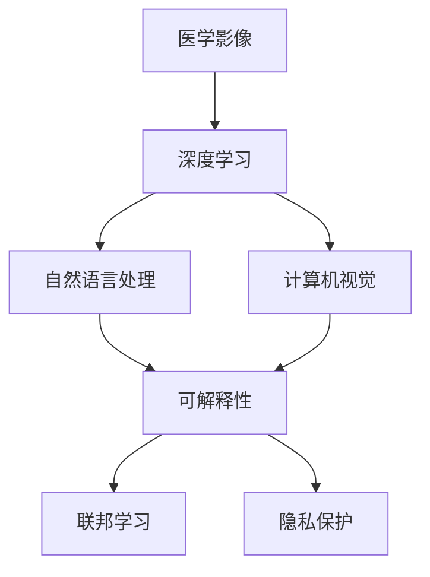

                 

# 一切皆是映射：AI在医学影像中的革新

## 1. 背景介绍

### 1.1 问题由来
随着医学影像技术的快速发展，大量的医学影像数据被生成和存储。这些数据为AI在医学影像中的应用提供了数据基础。通过深度学习和数据驱动的方法，AI已经在医学影像诊断、疾病预测、手术辅助等多个领域展现出了巨大的潜力。医学影像数据的丰富性和多样性，为AI提供了广阔的试验场，催生了各种AI技术在医学影像领域的革新。

### 1.2 问题核心关键点
大语言模型在医学影像中的应用主要体现在以下几个方面：

1. **影像标注和生成**：通过自然语言描述或图表，生成医学影像的辅助信息，如病灶标记、诊断报告等。
2. **影像分析与诊断**：使用深度学习模型对医学影像进行自动分析，辅助或替代放射科医生进行疾病诊断。
3. **影像引导治疗**：利用AI技术生成医学影像，辅助手术规划、放射治疗等。
4. **数据挖掘与分析**：从大量医学影像数据中提取有用的信息，用于疾病预测和模式识别。
5. **患者信息管理**：通过AI技术管理患者信息，辅助医生对患者的病情进行跟踪和诊断。

这些关键点凸显了AI在医学影像中的应用前景，但也带来了新的挑战，如数据隐私保护、模型解释性、伦理问题等。

### 1.3 问题研究意义
AI在医学影像中的应用，对于提升医疗服务效率、降低医疗成本、改善患者体验等方面具有重要意义。通过深度学习和大数据驱动的AI技术，AI能够在复杂的医学影像中自动分析并提取有用信息，辅助医生进行决策，从而提升诊断准确率和效率。此外，AI还能用于病情预测、个性化治疗方案设计等，推动医学影像技术的持续进步。

## 2. 核心概念与联系

### 2.1 核心概念概述

要理解AI在医学影像中的应用，首先需要理解以下核心概念：

- **医学影像**：包括X光片、CT、MRI、PET等多种类型，是医学影像分析的基础数据。
- **深度学习**：通过多层神经网络，学习输入数据的表示，实现自动化的特征提取和模式识别。
- **自然语言处理(NLP)**：使计算机理解和处理自然语言，实现医学影像和自然语言之间的映射。
- **计算机视觉**：使计算机理解图像和视频中的视觉信息，实现医学影像的自动分析。
- **可解释性**：模型的决策过程和结果能够被解释和理解，有助于医疗决策的透明性和可靠性。
- **联邦学习**：一种分布式学习方式，多个参与方在不共享本地数据的情况下，协同训练一个全局模型。
- **隐私保护**：在医学影像数据处理中，确保数据隐私和安全。

这些核心概念之间存在紧密的联系，共同构成了AI在医学影像中的应用框架。

### 2.2 核心概念原理和架构的 Mermaid 流程图



这个流程图展示了医学影像和AI技术之间的关系：医学影像作为输入，经过深度学习、自然语言处理和计算机视觉的映射，最终输出可解释的模型结果。同时，联邦学习和隐私保护确保了模型的训练和应用过程中的数据安全和隐私保护。

## 3. 核心算法原理 & 具体操作步骤

### 3.1 算法原理概述

AI在医学影像中的应用，主要依赖于深度学习模型的训练和应用。以医学影像分类任务为例，假设输入为医学影像，输出为对应的疾病分类标签。该任务可以表示为：

$$
y = f(x; \theta)
$$

其中，$x$ 为医学影像，$y$ 为疾病分类标签，$f(x; \theta)$ 为深度学习模型，$\theta$ 为模型参数。模型的目标是通过最小化损失函数 $\mathcal{L}(y, f(x; \theta))$ 来逼近真实标签 $y$。

### 3.2 算法步骤详解

AI在医学影像中的应用主要包括以下几个关键步骤：

**Step 1: 数据准备**

- 收集和标注医学影像数据，构建训练集、验证集和测试集。标注数据通常由放射科医生进行，包括影像描述和疾病标签。
- 数据预处理，包括数据增强、归一化等，以提升模型泛化能力。

**Step 2: 模型选择和训练**

- 选择适合医学影像任务的深度学习模型，如卷积神经网络(CNN)、全卷积网络(FCN)、注意力机制网络(Attention)等。
- 使用标注数据训练模型，优化损失函数 $\mathcal{L}$，更新模型参数 $\theta$。
- 在验证集上评估模型性能，根据性能指标（如准确率、召回率、F1分数等）选择最佳模型。

**Step 3: 模型应用**

- 将训练好的模型应用于医学影像分析，包括疾病预测、影像分类、病变检测等。
- 对新输入的医学影像进行前向传播，得到模型预测结果。

**Step 4: 结果解释和验证**

- 对模型预测结果进行解释和验证，确保其准确性和可靠性。
- 结合医学知识和经验，对模型输出进行人工校验，必要时调整模型参数。

**Step 5: 结果应用**

- 将模型输出结果用于临床决策支持，辅助医生进行诊断和治疗。
- 定期更新模型，适应新的医学影像数据和新发现的疾病特征。

### 3.3 算法优缺点

AI在医学影像中的应用具有以下优点：

1. **高效性和准确性**：深度学习模型能够自动提取医学影像中的关键特征，实现高精度的疾病预测和诊断。
2. **泛化能力**：通过大量标注数据训练，模型具备较强的泛化能力，能够适应不同类型的医学影像数据。
3. **自动化**：深度学习模型能够自动处理大量医学影像数据，减少医生工作量，提高诊断效率。

同时，也存在以下缺点：

1. **数据依赖**：模型的性能依赖于高质量的标注数据，标注数据的获取和处理成本较高。
2. **模型复杂性**：深度学习模型参数较多，训练和推理过程复杂，对计算资源要求较高。
3. **可解释性**：深度学习模型通常被称为“黑盒”模型，难以解释其内部工作机制和决策逻辑。
4. **隐私保护**：医学影像数据涉及个人隐私，如何在模型训练和应用中保护数据隐私是一大挑战。

### 3.4 算法应用领域

AI在医学影像中的应用广泛，主要包括以下几个领域：

1. **影像分类**：对医学影像进行疾病分类，如肺癌、乳腺癌、脑卒中等。
2. **病变检测**：检测医学影像中的病变区域，如肿瘤、结节、病灶等。
3. **疾病预测**：基于医学影像和病历数据，预测患者未来可能患上的疾病。
4. **影像引导治疗**：利用医学影像指导手术和治疗，如手术规划、放射治疗等。
5. **患者信息管理**：通过AI技术管理患者信息，辅助医生对患者的病情进行跟踪和诊断。

## 4. 数学模型和公式 & 详细讲解

### 4.1 数学模型构建

以医学影像分类任务为例，模型的数学模型可以表示为：

$$
y = f(x; \theta)
$$

其中，$f(x; \theta)$ 为深度学习模型，$\theta$ 为模型参数。模型的目标是通过最小化损失函数 $\mathcal{L}(y, f(x; \theta))$ 来逼近真实标签 $y$。常用的损失函数包括交叉熵损失函数和均方误差损失函数等。

### 4.2 公式推导过程

以交叉熵损失函数为例，其推导过程如下：

$$
\mathcal{L}(y, f(x; \theta)) = -\frac{1}{N} \sum_{i=1}^N \sum_{c=1}^C y_{ic} \log f(x_i; \theta)_{ic}
$$

其中，$N$ 为样本数量，$C$ 为分类数量，$y_{ic}$ 为样本 $i$ 在类别 $c$ 的标签（0或1），$f(x_i; \theta)_{ic}$ 为模型对样本 $i$ 在类别 $c$ 的预测概率。

在反向传播过程中，模型的梯度更新公式为：

$$
\frac{\partial \mathcal{L}}{\partial \theta} = -\frac{1}{N} \sum_{i=1}^N \sum_{c=1}^C [y_{ic} - f(x_i; \theta)_{ic}] \frac{\partial f(x_i; \theta)_{ic}}{\partial \theta}
$$

### 4.3 案例分析与讲解

以医学影像分类为例，以下是一个简单的代码实现：

```python
import torch
import torch.nn as nn
import torch.optim as optim

# 定义卷积神经网络模型
class Net(nn.Module):
    def __init__(self):
        super(Net, self).__init__()
        self.conv1 = nn.Conv2d(1, 6, 5)
        self.pool = nn.MaxPool2d(2, 2)
        self.conv2 = nn.Conv2d(6, 16, 5)
        self.fc1 = nn.Linear(16 * 5 * 5, 120)
        self.fc2 = nn.Linear(120, 84)
        self.fc3 = nn.Linear(84, 10)

    def forward(self, x):
        x = self.pool(torch.relu(self.conv1(x)))
        x = self.pool(torch.relu(self.conv2(x)))
        x = x.view(-1, 16 * 5 * 5)
        x = torch.relu(self.fc1(x))
        x = torch.relu(self.fc2(x))
        x = self.fc3(x)
        return x

# 定义损失函数和优化器
net = Net()
criterion = nn.CrossEntropyLoss()
optimizer = optim.SGD(net.parameters(), lr=0.001, momentum=0.9)

# 定义训练和评估函数
def train(net, train_loader, epochs):
    for epoch in range(epochs):
        for i, (inputs, labels) in enumerate(train_loader):
            optimizer.zero_grad()
            outputs = net(inputs)
            loss = criterion(outputs, labels)
            loss.backward()
            optimizer.step()

def evaluate(net, test_loader):
    correct = 0
    total = 0
    with torch.no_grad():
        for images, labels in test_loader:
            outputs = net(images)
            _, predicted = torch.max(outputs.data, 1)
            total += labels.size(0)
            correct += (predicted == labels).sum().item()
    return correct / total

# 数据加载
train_loader = ...
test_loader = ...

# 训练模型
train(net, train_loader, epochs=10)

# 评估模型
evaluate(net, test_loader)
```

在上述代码中，我们定义了一个简单的卷积神经网络模型，使用交叉熵损失函数和随机梯度下降优化器进行训练。训练过程中，我们逐步迭代模型参数，最小化损失函数，直到达到预设的迭代轮数。

## 5. 项目实践：代码实例和详细解释说明

### 5.1 开发环境搭建

在进行医学影像AI应用开发前，我们需要准备好开发环境。以下是使用Python进行PyTorch开发的环境配置流程：

1. 安装Anaconda：从官网下载并安装Anaconda，用于创建独立的Python环境。

2. 创建并激活虚拟环境：
```bash
conda create -n pytorch-env python=3.8 
conda activate pytorch-env
```

3. 安装PyTorch：根据CUDA版本，从官网获取对应的安装命令。例如：
```bash
conda install pytorch torchvision torchaudio cudatoolkit=11.1 -c pytorch -c conda-forge
```

4. 安装各类工具包：
```bash
pip install numpy pandas scikit-learn matplotlib tqdm jupyter notebook ipython
```

完成上述步骤后，即可在`pytorch-env`环境中开始医学影像AI应用的开发。

### 5.2 源代码详细实现

这里我们以医学影像分类任务为例，给出使用PyTorch进行深度学习模型训练的PyTorch代码实现。

首先，定义训练数据和测试数据的预处理函数：

```python
import numpy as np
import matplotlib.pyplot as plt
import torch
import torch.nn as nn
import torch.optim as optim
from torch.utils.data import DataLoader, Dataset

class ImageDataset(Dataset):
    def __init__(self, data, transforms=None):
        self.data = data
        self.transforms = transforms

    def __len__(self):
        return len(self.data)

    def __getitem__(self, idx):
        img = self.data[idx]
        label = self.labels[idx]
        if self.transforms is not None:
            img = self.transforms(img)
        return img, label

def train_loader(dataset, batch_size, shuffle=True):
    dataloader = DataLoader(dataset, batch_size=batch_size, shuffle=shuffle, drop_last=False)
    return dataloader

def evaluate_loader(dataset, batch_size):
    dataloader = DataLoader(dataset, batch_size=batch_size, shuffle=False, drop_last=False)
    return dataloader

# 数据预处理
def preprocess_data(data):
    # 数据增强
    data = data.transform(resize=(224, 224))
    data = data.transform(rescale(1./255))
    return data

# 训练和测试数据集
train_data = ImageDataset(train_data, transforms=preprocess_data)
test_data = ImageDataset(test_data, transforms=preprocess_data)

# 训练和测试数据加载器
train_loader = train_loader(train_data, batch_size=32)
test_loader = evaluate_loader(test_data, batch_size=32)
```

然后，定义深度学习模型：

```python
class CNN(nn.Module):
    def __init__(self):
        super(CNN, self).__init__()
        self.conv1 = nn.Conv2d(1, 16, 3)
        self.pool = nn.MaxPool2d(2, 2)
        self.conv2 = nn.Conv2d(16, 32, 3)
        self.fc1 = nn.Linear(32 * 7 * 7, 128)
        self.fc2 = nn.Linear(128, 10)

    def forward(self, x):
        x = torch.relu(self.pool(self.conv1(x)))
        x = torch.relu(self.pool(self.conv2(x)))
        x = x.view(-1, 32 * 7 * 7)
        x = torch.relu(self.fc1(x))
        x = self.fc2(x)
        return x

# 定义损失函数和优化器
model = CNN()
criterion = nn.CrossEntropyLoss()
optimizer = optim.SGD(model.parameters(), lr=0.01, momentum=0.9)

# 训练模型
def train_model(model, train_loader, epochs, device):
    model.train()
    for epoch in range(epochs):
        for i, (inputs, labels) in enumerate(train_loader):
            inputs, labels = inputs.to(device), labels.to(device)
            optimizer.zero_grad()
            outputs = model(inputs)
            loss = criterion(outputs, labels)
            loss.backward()
            optimizer.step()
        print(f"Epoch {epoch+1}, Loss: {loss.item()}")

# 测试模型
def evaluate_model(model, test_loader, device):
    model.eval()
    correct = 0
    total = 0
    with torch.no_grad():
        for inputs, labels in test_loader:
            inputs, labels = inputs.to(device), labels.to(device)
            outputs = model(inputs)
            _, predicted = torch.max(outputs.data, 1)
            total += labels.size(0)
            correct += (predicted == labels).sum().item()
    print(f"Accuracy: {correct/total}")
```

最后，启动训练流程并在测试集上评估：

```python
# 定义设备
device = torch.device("cuda" if torch.cuda.is_available() else "cpu")

# 训练模型
train_model(model, train_loader, epochs=10, device=device)

# 测试模型
evaluate_model(model, test_loader, device=device)
```

以上就是使用PyTorch对医学影像分类任务进行深度学习模型训练的完整代码实现。可以看到，得益于PyTorch的强大封装，我们可以用相对简洁的代码完成模型的训练和评估。

### 5.3 代码解读与分析

让我们再详细解读一下关键代码的实现细节：

**ImageDataset类**：
- `__init__`方法：初始化数据和转换函数。
- `__len__`方法：返回数据集的样本数量。
- `__getitem__`方法：对单个样本进行处理，将图像和标签转换为模型所需的输入。

**train_loader和evaluate_loader函数**：
- `train_loader`函数：构建训练数据加载器，批量加载数据。
- `evaluate_loader`函数：构建测试数据加载器，批量加载数据。

**preprocess_data函数**：
- 对输入的医学影像数据进行预处理，包括图像大小调整和归一化。

**CNN类**：
- `__init__`方法：定义卷积层和全连接层。
- `forward`方法：定义前向传播过程，通过卷积和全连接层进行特征提取和分类。

**train_model和evaluate_model函数**：
- `train_model`函数：在训练数据集上迭代模型，更新参数。
- `evaluate_model`函数：在测试数据集上评估模型，输出准确率。

**设备定义**：
- 判断是否有可用的GPU，若有则使用GPU，否则使用CPU。

通过上述代码，我们实现了深度学习模型在医学影像分类任务中的应用。在实际应用中，开发者还需要结合具体任务，对模型结构、损失函数、优化器等进行进一步优化，以获得更好的性能。

## 6. 实际应用场景

### 6.1 智能诊断系统

AI在医学影像中的应用，可以构建智能诊断系统，辅助医生进行疾病诊断。智能诊断系统能够自动分析医学影像，提取关键特征，预测疾病，生成诊断报告。这种系统可以快速处理大量医学影像数据，减轻医生工作负担，提高诊断效率和准确性。

### 6.2 影像引导手术

AI技术可以用于影像引导手术，通过医学影像数据生成手术路径和方案，辅助外科医生进行手术操作。影像引导手术能够减少手术风险，提升手术成功率和患者安全性。

### 6.3 病情预测与监控

AI技术可以用于病情预测和监控，通过分析医学影像和病历数据，预测患者未来可能患上的疾病，并实时监控病情变化，及时调整治疗方案。这种系统能够为患者提供个性化的治疗方案，提升治疗效果。

### 6.4 医学影像生成

AI技术可以用于医学影像生成，通过自然语言描述，生成医学影像或病变区域，辅助医生进行诊断和治疗。医学影像生成技术能够填补实际医学影像数据的不足，提高诊断准确性。

### 6.5 临床决策支持

AI技术可以用于临床决策支持，通过分析医学影像和病历数据，为医生提供决策建议。这种系统能够辅助医生进行诊断和治疗决策，提升医疗服务的效率和质量。

## 7. 工具和资源推荐

### 7.1 学习资源推荐

为了帮助开发者系统掌握AI在医学影像中的应用，这里推荐一些优质的学习资源：

1. 《深度学习》（Ian Goodfellow, Yoshua Bengio, Aaron Courville）：深度学习领域的经典教材，全面介绍深度学习的基本原理和算法。
2. 《医学影像AI实战》：结合实际案例，介绍AI在医学影像中的应用方法和实践经验。
3. Coursera的《深度学习专项课程》：由斯坦福大学等知名学府开设，提供深度学习理论和技术学习的全流程。
4. Kaggle的医学影像数据集：Kaggle上提供大量的医学影像数据集，供开发者进行模型训练和测试。
5. GitHub的医学影像项目：GitHub上有许多医学影像相关的开源项目，供开发者学习和借鉴。

通过对这些资源的学习实践，相信你一定能够快速掌握AI在医学影像中的应用方法，并用于解决实际的医学问题。

### 7.2 开发工具推荐

高效的开发离不开优秀的工具支持。以下是几款用于医学影像AI应用开发的常用工具：

1. PyTorch：基于Python的开源深度学习框架，灵活性高，适合快速迭代研究。
2. TensorFlow：由Google主导开发的深度学习框架，稳定性好，适合大规模工程应用。
3. TensorBoard：TensorFlow配套的可视化工具，可实时监测模型训练状态，提供丰富的图表呈现方式。
4. Weights & Biases：模型训练的实验跟踪工具，记录和可视化模型训练过程中的各项指标，方便对比和调优。
5. Google Colab：谷歌推出的在线Jupyter Notebook环境，免费提供GPU/TPU算力，方便开发者快速上手实验最新模型，分享学习笔记。

合理利用这些工具，可以显著提升医学影像AI应用开发的效率，加快创新迭代的步伐。

### 7.3 相关论文推荐

AI在医学影像中的应用研究源于学界的持续探索。以下是几篇奠基性的相关论文，推荐阅读：

1. AlexNet：计算机视觉领域的经典模型，奠定了深度学习在图像识别中的应用基础。
2. InceptionNet：通过多尺度卷积层的设计，提升模型对不同尺寸目标的识别能力。
3. ResNet：通过残差连接的设计，解决了深度网络退化的问题，提升模型训练深度。
4. VGGNet：通过卷积层堆叠的设计，提升模型对图像细节的识别能力。
5. U-Net：用于医学影像分割的卷积神经网络，具备较强的像素级分割能力。
6. Mask R-CNN：用于医学影像分割的实例分割模型，具备较强的目标定位和分割能力。
7. GoogleNet：通过Inception模块的设计，提升模型对不同尺寸目标的识别能力。

这些论文代表了大语言模型在医学影像中的应用研究，通过学习这些前沿成果，可以帮助研究者把握学科前进方向，激发更多的创新灵感。

## 8. 总结：未来发展趋势与挑战

### 8.1 总结

本文对AI在医学影像中的应用进行了全面系统的介绍。首先阐述了AI在医学影像中的研究背景和应用意义，明确了AI在医学影像分析中的独特价值。其次，从原理到实践，详细讲解了深度学习模型的训练和应用方法，给出了AI在医学影像中的实际应用示例。同时，本文还广泛探讨了AI在医学影像中的应用场景，展示了AI技术在医学影像中的巨大潜力。

通过本文的系统梳理，可以看到，AI在医学影像中的应用前景广阔，有望为医疗行业带来革命性变化。得益于深度学习模型的强大能力，AI能够在复杂的医学影像中自动分析并提取有用信息，辅助医生进行决策，从而提升诊断准确率和效率。

### 8.2 未来发展趋势

展望未来，AI在医学影像中的应用将呈现以下几个发展趋势：

1. **深度学习模型的演进**：随着深度学习模型的不断演进，模型结构将更加复杂，精度更高。通过模型压缩、稀疏化等技术，可以进一步提升模型的推理速度和计算效率。
2. **多模态学习**：未来的医学影像分析将更加注重多模态数据的融合，将医学影像、基因数据、临床数据等综合分析，提升诊断的全面性和准确性。
3. **个性化医疗**：通过AI技术，可以为每个患者量身定制个性化的治疗方案，提升治疗效果。
4. **远程医疗**：AI技术可以用于远程医疗，通过医学影像分析和诊断，实现医疗服务的远程化和智能化。
5. **智能辅助手术**：AI技术可以用于手术辅助，通过医学影像生成手术路径和方案，提高手术的精准性和安全性。

以上趋势凸显了AI在医学影像中的应用前景，AI技术将在医疗服务中扮演越来越重要的角色，推动医疗行业的持续进步。

### 8.3 面临的挑战

尽管AI在医学影像中的应用已经取得了一定的成就，但在推广应用的过程中，仍面临着诸多挑战：

1. **数据隐私保护**：医学影像数据涉及个人隐私，如何在模型训练和应用中保护数据隐私是一大挑战。
2. **模型解释性**：深度学习模型通常被称为“黑盒”模型，难以解释其内部工作机制和决策逻辑。
3. **模型鲁棒性**：AI模型面对域外数据时，泛化性能往往大打折扣。
4. **模型计算资源**：深度学习模型的训练和推理过程需要大量的计算资源，如何优化模型结构和算法，提高计算效率，是一个重要的问题。
5. **数据质量和标注成本**：高质量的医学影像数据和标注数据的获取成本较高，如何降低数据标注成本，提升数据质量，是一大挑战。

### 8.4 研究展望

面对AI在医学影像中的应用面临的挑战，未来的研究需要在以下几个方面寻求新的突破：

1. **无监督和半监督学习**：摆脱对大规模标注数据的依赖，利用自监督学习、主动学习等方法，最大限度利用非结构化数据，实现更加灵活高效的模型训练。
2. **联邦学习**：通过分布式学习方式，在不共享本地数据的情况下，协同训练一个全局模型，保护数据隐私。
3. **知识图谱和符号知识**：将符号化的先验知识，如知识图谱、逻辑规则等，与神经网络模型进行融合，引导模型学习更准确、合理的语言模型。
4. **对抗攻击和鲁棒性**：引入对抗攻击和鲁棒性训练技术，提高模型的抗干扰能力和泛化性能。
5. **个性化医疗和智能辅助手术**：开发更加个性化和智能化的医疗辅助系统，提升诊断和治疗效果。

这些研究方向的探索，必将引领AI在医学影像中的应用技术迈向更高的台阶，为医疗行业带来更多的创新和突破。

## 9. 附录：常见问题与解答

**Q1：AI在医学影像中的应用是否需要大量的标注数据？**

A: 是的，AI在医学影像中的应用需要大量的标注数据。标注数据通常由放射科医生进行，包括影像描述和疾病标签。标注数据的获取和处理成本较高，但通过深度学习模型的训练，可以在少量标注数据的情况下，仍获得不错的效果。

**Q2：AI在医学影像中的应用是否存在数据隐私问题？**

A: 是的，AI在医学影像中的应用存在数据隐私问题。医学影像数据涉及个人隐私，如何在模型训练和应用中保护数据隐私是一大挑战。未来的研究需要在数据隐私保护方面进行更多探索。

**Q3：AI在医学影像中的应用是否存在可解释性问题？**

A: 是的，AI在医学影像中的应用存在可解释性问题。深度学习模型通常被称为“黑盒”模型，难以解释其内部工作机制和决策逻辑。未来的研究需要在模型可解释性方面进行更多探索，提升模型的透明性和可靠性。

**Q4：AI在医学影像中的应用是否存在模型鲁棒性问题？**

A: 是的，AI在医学影像中的应用存在模型鲁棒性问题。AI模型面对域外数据时，泛化性能往往大打折扣。未来的研究需要在模型鲁棒性方面进行更多探索，提升模型的泛化能力和抗干扰能力。

**Q5：AI在医学影像中的应用是否存在计算资源问题？**

A: 是的，AI在医学影像中的应用存在计算资源问题。深度学习模型的训练和推理过程需要大量的计算资源，如何优化模型结构和算法，提高计算效率，是一大挑战。未来的研究需要在模型计算效率方面进行更多探索，优化模型的推理速度和计算资源。

通过上述问题的解答，可以看到，AI在医学影像中的应用虽然前景广阔，但也面临诸多挑战。只有在数据隐私、模型解释性、鲁棒性和计算效率等方面进行不断探索和优化，才能真正实现AI在医学影像中的应用潜力，推动医疗行业的持续进步。

---

作者：禅与计算机程序设计艺术 / Zen and the Art of Computer Programming

