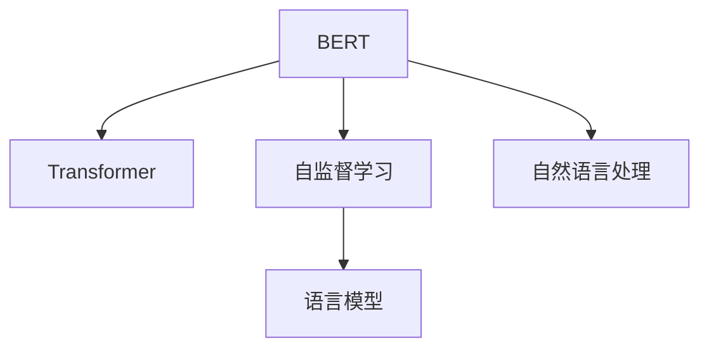

                 

# 一切皆是映射：BERT模型原理及其在文本理解中的应用

> 关键词：BERT,Transformer,语言模型,自监督学习,自然语言处理,NLP,文本理解

## 1. 背景介绍

### 1.1 问题由来

现代自然语言处理（NLP）技术的核心是理解文本的语义，并能够在此基础上执行各种自然语言任务，例如文本分类、情感分析、问答系统等。然而，传统的基于规则的NLP方法通常需要大量人工设计的特征，难以有效捕捉复杂的语言现象。随着深度学习技术的发展，特别是Transformer架构的引入，基于神经网络的语言模型在NLP任务中取得了显著的进展。BERT（Bidirectional Encoder Representations from Transformers）作为第一个大规模预训练语言模型，其基于Transformer架构的自监督学习训练方式极大地提升了语言模型的表示能力，为自然语言理解提供了新的突破。

### 1.2 问题核心关键点

BERT模型的核心思想是将大规模无标签文本语料进行自监督训练，使得模型能够从大量数据中学习到语言的丰富语义表示。通过引入掩码语言模型（Masked Language Model, MLM）和下一句预测（Next Sentence Prediction, NSP）任务，BERT模型能够学习到单词和句子的双向语义表示，提升了模型的语言理解能力。

BERT模型的两个关键特征是：
- 双向自监督预训练：通过掩码语言模型和下一句预测任务，模型可以学习到单词和句子的双向语义表示。
- 大规模预训练：使用大规模无标签文本数据进行预训练，使得模型能够捕捉到广泛的语言现象。

这些核心特性使得BERT模型在各种NLP任务上取得了最先进的表现，推动了自然语言处理技术的发展。

### 1.3 问题研究意义

研究BERT模型的原理和应用，对于理解现代NLP技术的底层机制，推动基于语言模型的NLP任务研究，具有重要意义：

1. 提升自然语言理解能力：BERT模型的双向自监督预训练方式，极大提升了模型对文本语义的理解能力，为各种NLP任务提供了坚实的技术基础。
2. 促进跨领域知识迁移：BERT模型通过大规模预训练，学习到了丰富的语言知识，在跨领域知识迁移方面表现出色，能够轻松地应用于不同的NLP任务。
3. 加速技术应用落地：基于BERT模型的技术开发，可以显著降低数据和算法的开发成本，加速NLP技术的产业化进程。
4. 增强模型泛化能力：BERT模型的自监督预训练方式，使得模型具有较强的泛化能力，能够适应不同领域的文本数据。
5. 推动学术和产业研究：BERT模型作为NLP领域的里程碑，推动了学术界和产业界对语言模型和自监督学习技术的深入研究。

## 2. 核心概念与联系

### 2.1 核心概念概述

为更好地理解BERT模型的原理和应用，本节将介绍几个密切相关的核心概念：

- BERT：一种基于Transformer架构的大规模预训练语言模型，由Google在2018年提出。
- Transformer：一种基于自注意力机制的神经网络结构，相较于传统的卷积神经网络和循环神经网络，Transformer在处理序列数据时具有更好的性能和可扩展性。
- 自监督学习：一种无需人工标注数据的学习方式，通过利用数据的自然属性（如掩码、下一句预测等）进行无监督训练。
- 语言模型：用于预测文本中单词或字符的概率分布，是NLP任务中常用的预训练方式。
- 自然语言处理：研究如何让计算机理解和处理人类语言的领域，包括文本分类、情感分析、问答系统等任务。

这些核心概念之间的逻辑关系可以通过以下Mermaid流程图来展示：



这个流程图展示了大语言模型BERT的各个核心概念及其之间的关系：

1. BERT通过Transformer架构进行自监督预训练，学习到双向的语义表示。
2. 自监督学习是BERT模型的训练方式，通过掩码语言模型和下一句预测任务进行无监督学习。
3. 语言模型是BERT模型的预训练任务之一，用于学习单词和句子的概率分布。
4. 自然语言处理是大语言模型应用的具体领域，通过BERT模型进行各种NLP任务的处理。

## 3. 核心算法原理 & 具体操作步骤
### 3.1 算法原理概述

BERT模型的核心算法原理是自监督学习，即在大规模无标签文本数据上进行预训练，学习到单词和句子的双向语义表示。其核心步骤如下：

1. 数据预处理：将输入的文本序列进行分词、填充、截断等处理，使得文本序列的长度相同。
2. 掩码语言模型（MLM）：随机遮挡文本序列中的某些单词，模型需要预测这些被遮挡的单词。
3. 下一句预测（NSP）：给定两个句子，模型需要预测它们是否为同一篇文档的一部分。
4. 预测任务：将预训练得到的向量通过线性分类器进行下游任务的微调。

### 3.2 算法步骤详解

以下是对BERT模型核心算法的详细步骤：

**Step 1: 数据预处理**
- 将输入文本序列进行分词，例如使用WordPiece分词方式。
- 对文本序列进行填充和截断，使得所有序列长度一致。
- 将序列转换为模型所需的格式，例如将单词转换为ID序列，并添加特殊符号。

**Step 2: 掩码语言模型（MLM）**
- 随机选择部分单词进行掩码，例如将某些单词替换为[CLS]、[SEP]、[MASK]等特殊符号。
- 将掩码后的文本序列输入模型，模型需要预测被掩码的单词。
- 计算掩码语言模型的损失函数，用于衡量预测结果与真实值的差异。

**Step 3: 下一句预测（NSP）**
- 将输入的文本序列分成两个句子，例如第一句和第二句。
- 计算模型对下一句的预测概率，判断它们是否为同一篇文档的一部分。
- 计算下一句预测的损失函数，用于衡量预测结果与真实值的差异。

**Step 4: 模型训练**
- 将预处理后的文本序列输入模型，进行前向传播计算。
- 计算模型在掩码语言模型和下一句预测任务上的损失函数。
- 使用梯度下降等优化算法，更新模型参数。
- 重复上述步骤，直至模型收敛。

**Step 5: 下游任务微调**
- 在预训练得到的向量上，添加任务适配层，例如线性分类器或解码器。
- 使用微调数据集，训练模型进行下游任务的优化。
- 使用微调后的模型进行下游任务的推理和预测。

### 3.3 算法优缺点

BERT模型的自监督预训练方式具有以下优点：
1. 无需标注数据：通过大规模无标签文本数据进行预训练，降低了数据标注的成本。
2. 广泛的语义表示：通过双向自监督预训练，模型能够学习到单词和句子的丰富语义表示。
3. 良好的泛化能力：大规模预训练使得模型具有较强的泛化能力，能够适应不同领域的文本数据。
4. 参数高效的微调：使用少量下游任务的标注数据，就能实现高效的微调，提升模型性能。

同时，BERT模型也存在一些局限性：
1. 训练成本高：预训练模型需要大量的计算资源和时间，初期投入较大。
2. 数据分布限制：大规模预训练依赖于数据的分布特性，某些领域的数据可能不足。
3. 难以解释：BERT模型作为黑盒系统，其内部工作机制难以解释，难以进行调试和优化。
4. 过拟合风险：在微调过程中，模型可能会过拟合下游任务的标注数据，导致泛化性能下降。

尽管存在这些局限性，但BERT模型的自监督预训练方式仍然是大规模语言模型训练的重要参考，被广泛应用于各种NLP任务的预训练和微调中。

### 3.4 算法应用领域

BERT模型的自监督预训练方式在自然语言处理领域已经得到了广泛的应用，涵盖了以下多个任务：

- 文本分类：例如电影评论分类、新闻分类等。通过微调BERT模型，能够学习文本-标签的映射关系，实现文本分类。
- 情感分析：例如情感倾向分类、情感强度分析等。通过对情感标注数据进行微调，模型能够学习到文本的情感倾向。
- 问答系统：例如智能客服、问答机器人等。通过微调BERT模型，能够实现自然语言理解与生成，提升问答系统的准确性和自然度。
- 命名实体识别：例如人名、地名、机构名等的识别和分类。通过对命名实体标注数据进行微调，模型能够学习到实体边界和类型。
- 关系抽取：例如抽取实体之间的语义关系。通过对关系标注数据进行微调，模型能够学习到实体-关系三元组。
- 文本生成：例如机器翻译、文本摘要等。通过对生成样本进行微调，模型能够学习到文本生成规律，提升生成质量。

除了上述这些经典任务外，BERT模型还广泛应用于各种新兴的NLP任务，如对话系统、推荐系统、知识图谱构建等，推动了NLP技术的不断进步。

## 4. 数学模型和公式 & 详细讲解  
### 4.1 数学模型构建

BERT模型的核心数学模型包括掩码语言模型和下一句预测任务，以下我们将详细介绍这两个任务的数学模型构建。

**掩码语言模型（MLM）**
- 对于文本序列 $X = \{x_1, x_2, ..., x_n\}$，假设其中 $k$ 个位置随机被掩码，即 $X^{[k_1, k_2, ..., k_k]}$，其中 $k \leq n$。掩码语言模型目标是预测被掩码的单词。
- 掩码后的文本序列经过BERT模型得到向量表示 $Z = \{z_1, z_2, ..., z_n\}$。
- 对于每个被掩码的单词，模型预测其下一个单词的概率分布 $P_{pred}(x_k|x_1, x_2, ..., x_{k-1}, x_{k+1}, ..., x_n)$。
- 计算掩码语言模型的损失函数 $L_{mlm} = -\sum_{i=1}^k \log P_{pred}(x_i|Z)$。

**下一句预测（NSP）**
- 对于两个句子 $A$ 和 $B$，模型需要判断它们是否为同一篇文档的一部分。下一句预测任务的目标是判断 $A$ 和 $B$ 的顺序关系。
- 模型通过BERT模型分别得到向量表示 $Z_A$ 和 $Z_B$。
- 模型计算两个向量之间的距离或相似度 $d(Z_A, Z_B)$。
- 下一句预测的损失函数为 $L_{nsp} = \sum_{i=1}^N [-\log(P_{pred}(y_i=1|Z_A, Z_B) + \log(1-P_{pred}(y_i=1|Z_A, Z_B))]$，其中 $y_i \in \{1, 0\}$ 表示 $A$ 和 $B$ 是否为同一篇文档的一部分。

### 4.2 公式推导过程

以下是掩码语言模型和下一句预测任务的详细公式推导：

**掩码语言模型（MLM）**
- 假设文本序列 $X = \{x_1, x_2, ..., x_n\}$，掩码后的文本序列为 $X^{[k_1, k_2, ..., k_k]}$，其中 $k \leq n$。
- 经过BERT模型得到向量表示 $Z = \{z_1, z_2, ..., z_n\}$。
- 对于被掩码的单词 $x_i$，模型预测其下一个单词的概率分布为 $P_{pred}(x_i|Z) = \frac{e^{z_i^\top W_1 z_{i+1}}}{\sum_{j=1}^{n-1} e^{z_i^\top W_1 z_j}}$，其中 $W_1$ 为线性投影矩阵。
- 计算掩码语言模型的损失函数为 $L_{mlm} = -\sum_{i=1}^k \log P_{pred}(x_i|Z)$。

**下一句预测（NSP）**
- 对于两个句子 $A$ 和 $B$，假设模型需要判断 $A$ 和 $B$ 是否为同一篇文档的一部分。
- 经过BERT模型得到向量表示 $Z_A$ 和 $Z_B$。
- 计算两个向量之间的距离或相似度 $d(Z_A, Z_B) = z_A^\top W_2 z_B$，其中 $W_2$ 为线性投影矩阵。
- 下一句预测的损失函数为 $L_{nsp} = \sum_{i=1}^N [-\log(P_{pred}(y_i=1|Z_A, Z_B) + \log(1-P_{pred}(y_i=1|Z_A, Z_B))]$，其中 $y_i \in \{1, 0\}$ 表示 $A$ 和 $B$ 是否为同一篇文档的一部分。

通过以上公式推导，我们可以更直观地理解BERT模型的数学模型构建过程。

### 4.3 案例分析与讲解

下面以文本分类任务为例，详细介绍BERT模型的微调过程：

假设有一个文本分类任务，需要对电影评论进行情感分类（正面、负面）。步骤如下：

**Step 1: 数据预处理**
- 对输入的电影评论进行分词、填充、截断等处理。
- 将文本序列转换为BERT模型所需的格式，例如将单词转换为ID序列，并添加特殊符号。

**Step 2: 微调模型**
- 使用掩码语言模型和下一句预测任务对预训练模型进行微调。
- 添加一个线性分类器作为任务适配层，将BERT模型的向量表示输入到分类器中进行训练。
- 使用电影评论的情感标注数据进行微调，学习文本-情感的映射关系。

**Step 3: 测试和部署**
- 在测试集上评估微调后的模型性能，例如使用准确率、F1分数等指标。
- 使用微调后的模型对新的电影评论进行情感分类，集成到实际的应用系统中。

在实际应用中，还需要根据具体任务特点对微调过程进行优化设计，如改进训练目标函数、引入更多的正则化技术、搜索最优的超参数组合等，以进一步提升模型性能。

## 5. 项目实践：代码实例和详细解释说明
### 5.1 开发环境搭建

在进行BERT模型微调实践前，我们需要准备好开发环境。以下是使用Python进行TensorFlow开发的环境配置流程：

1. 安装Anaconda：从官网下载并安装Anaconda，用于创建独立的Python环境。

2. 创建并激活虚拟环境：
```bash
conda create -n tf-env python=3.8 
conda activate tf-env
```

3. 安装TensorFlow：根据CUDA版本，从官网获取对应的安装命令。例如：
```bash
conda install tensorflow-gpu -c conda-forge
```

4. 安装各类工具包：
```bash
pip install numpy pandas scikit-learn matplotlib tqdm jupyter notebook ipython
```

完成上述步骤后，即可在`tf-env`环境中开始微调实践。

### 5.2 源代码详细实现

下面以文本分类任务为例，给出使用TensorFlow对BERT模型进行微调的代码实现。

首先，定义文本分类任务的数据处理函数：

```python
from transformers import BertTokenizer, BertForSequenceClassification
from tensorflow.keras.preprocessing.text import Tokenizer
from tensorflow.keras.preprocessing.sequence import pad_sequences

def load_dataset(filename):
    with open(filename, 'r', encoding='utf-8') as f:
        lines = f.readlines()
    texts = [line.strip() for line in lines]
    labels = [int(line.strip()) for line in lines]
    return texts, labels

train_dataset = load_dataset('train.txt')
dev_dataset = load_dataset('dev.txt')
test_dataset = load_dataset('test.txt')

tokenizer = BertTokenizer.from_pretrained('bert-base-cased')
```

然后，定义模型和优化器：

```python
from tensorflow.keras.layers import Dense
from tensorflow.keras.models import Model

num_labels = 2
max_seq_length = 128
batch_size = 32
learning_rate = 2e-5
epochs = 3

model = BertForSequenceClassification.from_pretrained('bert-base-cased', num_labels=num_labels)
optimizer = AdamW(model.parameters(), lr=learning_rate)
```

接着，定义训练和评估函数：

```python
def train_epoch(model, dataset, batch_size, optimizer):
    model.train()
    for batch in dataset:
        input_ids = tokenizer(batch['text'], padding='max_length', max_length=max_seq_length, truncation=True, return_tensors='tf')
        attention_mask = tokenizer.batch_encode_plus(input_ids, padding='max_length', max_length=max_seq_length, truncation=True, return_tensors='tf')['attention_mask']
        labels = tokenizer(batch['text'], padding='max_length', max_length=max_seq_length, truncation=True, return_tensors='tf')['input_ids']
        loss, logits = model(input_ids=input_ids, attention_mask=attention_mask, labels=labels)
        optimizer.zero_grad()
        loss.backward()
        optimizer.step()
    return loss.numpy().mean()

def evaluate(model, dataset, batch_size):
    model.eval()
    losses = []
    predictions = []
    labels = []
    for batch in dataset:
        input_ids = tokenizer(batch['text'], padding='max_length', max_length=max_seq_length, truncation=True, return_tensors='tf')
        attention_mask = tokenizer.batch_encode_plus(input_ids, padding='max_length', max_length=max_seq_length, truncation=True, return_tensors='tf')['attention_mask']
        labels = tokenizer(batch['text'], padding='max_length', max_length=max_seq_length, truncation=True, return_tensors='tf')['input_ids']
        logits = model(input_ids=input_ids, attention_mask=attention_mask, labels=labels)
        loss = tf.reduce_mean(logits)
        predictions.append(tf.argmax(logits, axis=1).numpy())
        labels.append(labels.numpy())
        losses.append(loss.numpy())
    loss = tf.reduce_mean(losses)
    accuracy = np.mean(np.array(predictions) == np.array(labels))
    return loss.numpy(), accuracy
```

最后，启动训练流程并在测试集上评估：

```python
epochs = 3
batch_size = 32

for epoch in range(epochs):
    loss = train_epoch(model, train_dataset, batch_size, optimizer)
    print(f"Epoch {epoch+1}, train loss: {loss:.3f}")
    
    print(f"Epoch {epoch+1}, dev results:")
    dev_loss, accuracy = evaluate(model, dev_dataset, batch_size)
    print(f"Dev accuracy: {accuracy:.3f}")

print("Test results:")
test_loss, accuracy = evaluate(model, test_dataset, batch_size)
print(f"Test accuracy: {accuracy:.3f}")
```

以上就是使用TensorFlow对BERT进行文本分类任务微调的完整代码实现。可以看到，得益于TensorFlow的强大封装，我们可以用相对简洁的代码完成BERT模型的加载和微调。

### 5.3 代码解读与分析

让我们再详细解读一下关键代码的实现细节：

**load_dataset函数**：
- 读取文本文件，并将文本和标签分别存储到列表中。
- 使用BertTokenizer对文本进行分词处理，转换为BERT模型所需的格式。

**train_epoch函数**：
- 在训练阶段，将输入的文本序列转换为BERT模型所需的格式。
- 添加注意力掩码，确保模型能够处理变长的文本序列。
- 计算掩码语言模型和下一句预测任务的损失函数，进行前向传播和反向传播。
- 使用AdamW优化器更新模型参数。

**evaluate函数**：
- 在评估阶段，将输入的文本序列转换为BERT模型所需的格式。
- 计算模型在掩码语言模型和下一句预测任务上的损失函数，进行前向传播。
- 计算模型的预测结果和真实标签，并计算准确率。

**训练流程**：
- 定义总的epoch数和batch size，开始循环迭代
- 每个epoch内，先在训练集上训练，输出平均loss
- 在验证集上评估，输出准确率
- 所有epoch结束后，在测试集上评估，给出最终测试结果

可以看到，TensorFlow配合BertTokenizer等组件，使得BERT微调的代码实现变得简洁高效。开发者可以将更多精力放在数据处理、模型改进等高层逻辑上，而不必过多关注底层的实现细节。

当然，工业级的系统实现还需考虑更多因素，如模型的保存和部署、超参数的自动搜索、更灵活的任务适配层等。但核心的微调范式基本与此类似。

## 6. 实际应用场景
### 6.1 智能客服系统

基于BERT模型的对话技术，可以广泛应用于智能客服系统的构建。传统客服往往需要配备大量人力，高峰期响应缓慢，且一致性和专业性难以保证。而使用BERT微调后的对话模型，可以7x24小时不间断服务，快速响应客户咨询，用自然流畅的语言解答各类常见问题。

在技术实现上，可以收集企业内部的历史客服对话记录，将问题和最佳答复构建成监督数据，在此基础上对预训练对话模型进行微调。微调后的对话模型能够自动理解用户意图，匹配最合适的答案模板进行回复。对于客户提出的新问题，还可以接入检索系统实时搜索相关内容，动态组织生成回答。如此构建的智能客服系统，能大幅提升客户咨询体验和问题解决效率。

### 6.2 金融舆情监测

金融机构需要实时监测市场舆论动向，以便及时应对负面信息传播，规避金融风险。传统的人工监测方式成本高、效率低，难以应对网络时代海量信息爆发的挑战。基于BERT模型的文本分类和情感分析技术，为金融舆情监测提供了新的解决方案。

具体而言，可以收集金融领域相关的新闻、报道、评论等文本数据，并对其进行主题标注和情感标注。在此基础上对预训练语言模型进行微调，使其能够自动判断文本属于何种主题，情感倾向是正面、中性还是负面。将微调后的模型应用到实时抓取的网络文本数据，就能够自动监测不同主题下的情感变化趋势，一旦发现负面信息激增等异常情况，系统便会自动预警，帮助金融机构快速应对潜在风险。

### 6.3 个性化推荐系统

当前的推荐系统往往只依赖用户的历史行为数据进行物品推荐，无法深入理解用户的真实兴趣偏好。基于BERT模型的个性化推荐系统可以更好地挖掘用户行为背后的语义信息，从而提供更精准、多样的推荐内容。

在实践中，可以收集用户浏览、点击、评论、分享等行为数据，提取和用户交互的物品标题、描述、标签等文本内容。将文本内容作为模型输入，用户的后续行为（如是否点击、购买等）作为监督信号，在此基础上微调预训练语言模型。微调后的模型能够从文本内容中准确把握用户的兴趣点。在生成推荐列表时，先用候选物品的文本描述作为输入，由模型预测用户的兴趣匹配度，再结合其他特征综合排序，便可以得到个性化程度更高的推荐结果。

### 6.4 未来应用展望

随着BERT模型的不断发展，其在自然语言处理领域的应用将更加广泛。未来，BERT模型将在更多领域得到应用，为传统行业带来变革性影响。

在智慧医疗领域，基于BERT模型的医疗问答、病历分析、药物研发等应用将提升医疗服务的智能化水平，辅助医生诊疗，加速新药开发进程。

在智能教育领域，BERT模型可应用于作业批改、学情分析、知识推荐等方面，因材施教，促进教育公平，提高教学质量。

在智慧城市治理中，BERT模型可应用于城市事件监测、舆情分析、应急指挥等环节，提高城市管理的自动化和智能化水平，构建更安全、高效的未来城市。

此外，在企业生产、社会治理、文娱传媒等众多领域，基于BERT模型的AI应用也将不断涌现，为经济社会发展注入新的动力。相信随着BERT模型的持续演进，其在自然语言理解中的应用将更加深入，推动人工智能技术更好地服务于各行各业。

## 7. 工具和资源推荐
### 7.1 学习资源推荐

为了帮助开发者系统掌握BERT模型的理论基础和实践技巧，这里推荐一些优质的学习资源：

1. 《Transformers: From Self-Attention to State-of-the-Art》系列博文：由BERT模型提出者撰写，详细介绍了BERT模型的原理、微调方法等内容。

2. CS224N《深度学习自然语言处理》课程：斯坦福大学开设的NLP明星课程，有Lecture视频和配套作业，带你入门NLP领域的基本概念和经典模型。

3. 《Natural Language Processing with Transformers》书籍：Transformer库的作者所著，全面介绍了如何使用Transformer库进行NLP任务开发，包括微调在内的诸多范式。

4. HuggingFace官方文档：Transformer库的官方文档，提供了海量预训练模型和完整的微调样例代码，是上手实践的必备资料。

5. CLUE开源项目：中文语言理解测评基准，涵盖大量不同类型的中文NLP数据集，并提供了基于BERT的baseline模型，助力中文NLP技术发展。

通过对这些资源的学习实践，相信你一定能够快速掌握BERT模型的精髓，并用于解决实际的NLP问题。
###  7.2 开发工具推荐

高效的开发离不开优秀的工具支持。以下是几款用于BERT模型微调开发的常用工具：

1. PyTorch：基于Python的开源深度学习框架，灵活动态的计算图，适合快速迭代研究。BERT模型的经典实现就在PyTorch中。

2. TensorFlow：由Google主导开发的开源深度学习框架，生产部署方便，适合大规模工程应用。TensorFlow也有BERT模型的实现。

3. Transformers库：HuggingFace开发的NLP工具库，集成了BERT等SOTA语言模型，支持PyTorch和TensorFlow，是进行微调任务开发的利器。

4. Weights & Biases：模型训练的实验跟踪工具，可以记录和可视化模型训练过程中的各项指标，方便对比和调优。与主流深度学习框架无缝集成。

5. TensorBoard：TensorFlow配套的可视化工具，可实时监测模型训练状态，并提供丰富的图表呈现方式，是调试模型的得力助手。

6. Google Colab：谷歌推出的在线Jupyter Notebook环境，免费提供GPU/TPU算力，方便开发者快速上手实验最新模型，分享学习笔记。

合理利用这些工具，可以显著提升BERT模型微调任务的开发效率，加快创新迭代的步伐。

### 7.3 相关论文推荐

BERT模型的研究源于学界的持续研究。以下是几篇奠基性的相关论文，推荐阅读：

1. Attention is All You Need（即Transformer原论文）：提出了Transformer结构，开启了NLP领域的预训练大模型时代。

2. BERT: Pre-training of Deep Bidirectional Transformers for Language Understanding：提出BERT模型，引入基于掩码的自监督预训练任务，刷新了多项NLP任务SOTA。

3. Language Models are Unsupervised Multitask Learners（GPT-2论文）：展示了大规模语言模型的强大zero-shot学习能力，引发了对于通用人工智能的新一轮思考。

4. Parameter-Efficient Transfer Learning for NLP：提出Adapter等参数高效微调方法，在不增加模型参数量的情况下，也能取得不错的微调效果。

5. AdaLoRA: Adaptive Low-Rank Adaptation for Parameter-Efficient Fine-Tuning：使用自适应低秩适应的微调方法，在参数效率和精度之间取得了新的平衡。

这些论文代表了大语言模型微调技术的发展脉络。通过学习这些前沿成果，可以帮助研究者把握学科前进方向，激发更多的创新灵感。

## 8. 总结：未来发展趋势与挑战

### 8.1 总结

本文对BERT模型的原理和应用进行了全面系统的介绍。首先阐述了BERT模型的研究背景和意义，明确了BERT模型在自然语言处理中的重要地位。其次，从原理到实践，详细讲解了BERT模型的自监督预训练过程，给出了微调任务开发的完整代码实例。同时，本文还广泛探讨了BERT模型在各种NLP任务中的应用前景，展示了BERT模型的强大应用能力。此外，本文精选了BERT模型的各类学习资源，力求为读者提供全方位的技术指引。

通过本文的系统梳理，可以看到，BERT模型通过自监督预训练的方式，学习到了丰富的语言知识，极大地提升了自然语言处理能力。BERT模型已成为NLP领域的经典模型，广泛应用于各种任务中。未来，随着BERT模型的不断演进，其在自然语言处理领域的应用将更加广泛。

### 8.2 未来发展趋势

展望未来，BERT模型的发展趋势将呈现以下几个方向：

1. 更大规模的预训练：随着计算资源的不断增加，未来BERT模型的参数量将会进一步增大，学习到的语言知识将更加丰富。超大模型的出现，将为自然语言处理带来更大的突破。

2. 更高效的微调方法：未来的微调方法将更加注重参数高效和计算高效，避免大规模模型的过拟合风险，提高微调模型的泛化性能。

3. 持续学习和适应性增强：BERT模型将不断通过新数据进行学习和更新，保持模型的时效性和适应性，提高其对不断变化的语言环境的适应能力。

4. 跨领域知识迁移能力的提升：未来的BERT模型将能够更好地适应跨领域知识迁移，学习到更多领域特定的语言知识，提升模型的通用性。

5. 更好的可解释性：未来的BERT模型将具备更好的可解释性，开发者和用户可以更好地理解和调试模型，提高模型的可靠性和安全性。

6. 更多的应用场景：随着BERT模型的不断演进，其在更多领域的应用将不断涌现，推动NLP技术的广泛应用。

以上趋势凸显了BERT模型在自然语言处理领域的广泛应用前景。这些方向的探索发展，必将进一步提升自然语言处理系统的性能和应用范围，为人类认知智能的进化带来深远影响。

### 8.3 面临的挑战

尽管BERT模型在自然语言处理领域取得了显著的进展，但在迈向更加智能化、普适化应用的过程中，它仍面临着诸多挑战：

1. 数据标注成本高：虽然微调降低了数据标注的成本，但对于某些特定领域的任务，获取高质量标注数据仍然是一项昂贵的工作。如何降低微调对标注数据的依赖，将是一大难题。

2. 计算资源需求大：BERT模型具有巨大的参数量和计算量，需要高性能的计算资源进行训练和推理。如何在保证性能的同时，降低资源消耗，将是未来的重要研究方向。

3. 模型复杂度高：BERT模型虽然性能优越，但其内部结构复杂，难以解释和调试。如何提高BERT模型的可解释性，将是未来的重要挑战。

4. 过拟合风险：在大规模数据训练过程中，BERT模型可能会过拟合，导致泛化性能下降。如何避免过拟合，提高模型的泛化能力，将是重要的研究方向。

5. 安全性和隐私问题：BERT模型可能学习到有害信息，甚至有害的偏见，如何保障数据和模型的安全性，将是未来的重要挑战。

6. 模型鲁棒性不足：在处理未知领域的文本时，BERT模型可能表现不佳。如何提高模型的鲁棒性，避免模型在特定领域的表现下降，将是未来的研究方向。

尽管存在这些挑战，但随着BERT模型的不断演进和优化，其应用前景将更加广阔。相信通过学界和产业界的共同努力，BERT模型将克服这些挑战，进一步推动自然语言处理技术的发展。

### 8.4 研究展望

面对BERT模型所面临的挑战，未来的研究需要在以下几个方面寻求新的突破：

1. 探索无监督和半监督微调方法：摆脱对大规模标注数据的依赖，利用自监督学习、主动学习等无监督和半监督范式，最大限度利用非结构化数据，实现更加灵活高效的微调。

2. 研究参数高效和计算高效的微调范式：开发更加参数高效的微调方法，在固定大部分预训练参数的同时，只更新极少量的任务相关参数。同时优化微调模型的计算图，减少前向传播和反向传播的资源消耗，实现更加轻量级、实时性的部署。

3. 融合因果和对比学习范式：通过引入因果推断和对比学习思想，增强BERT模型建立稳定因果关系的能力，学习更加普适、鲁棒的语言表征，从而提升模型泛化性和抗干扰能力。

4. 引入更多先验知识：将符号化的先验知识，如知识图谱、逻辑规则等，与BERT模型进行巧妙融合，引导微调过程学习更准确、合理的语言模型。同时加强不同模态数据的整合，实现视觉、语音等多模态信息与文本信息的协同建模。

5. 结合因果分析和博弈论工具：将因果分析方法引入BERT模型，识别出模型决策的关键特征，增强输出解释的因果性和逻辑性。借助博弈论工具刻画人机交互过程，主动探索并规避模型的脆弱点，提高系统稳定性。

6. 纳入伦理道德约束：在模型训练目标中引入伦理导向的评估指标，过滤和惩罚有偏见、有害的输出倾向。同时加强人工干预和审核，建立模型行为的监管机制，确保输出符合人类价值观和伦理道德。

这些研究方向的探索，必将引领BERT模型微调技术迈向更高的台阶，为构建安全、可靠、可解释、可控的智能系统铺平道路。面向未来，BERT模型需要与其他人工智能技术进行更深入的融合，如知识表示、因果推理、强化学习等，多路径协同发力，共同推动自然语言理解和智能交互系统的进步。只有勇于创新、敢于突破，才能不断拓展BERT模型的边界，让智能技术更好地造福人类社会。

## 9. 附录：常见问题与解答

**Q1：BERT模型是否可以应用于所有NLP任务？**

A: BERT模型在各种NLP任务上表现优异，但对于一些特定领域的任务，如医学、法律等，需要针对领域特点进行微调，才能获得理想效果。此外，对于需要时效性、个性化很强的任务，如对话、推荐等，微调方法也需要针对性的改进优化。

**Q2：如何选择合适的微调学习率？**

A: 微调的学习率一般要比预训练时小1-2个数量级，如果使用过大的学习率，容易破坏预训练权重，导致过拟合。一般建议从1e-5开始调参，逐步减小学习率，直至收敛。也可以使用warmup策略，在开始阶段使用较小的学习率，再逐渐过渡到预设值。

**Q3：BERT模型在微调过程中是否需要全参数微调？**

A: BERT模型在微调过程中可以只更新少量参数，如BERT的隐藏层和分类器，固定预训练权重不变，以提高微调效率，避免过拟合。部分微调方法（如Adapter、Premix）可以进一步减少微调参数，实现参数高效微调。

**Q4：BERT模型在微调过程中是否需要增加噪声？**

A: 是的。在微调过程中，可以通过增加噪声来防止过拟合，例如使用Dropout、L2正则化等技术。这些技术可以使模型更加鲁棒，减少对训练数据的依赖。

**Q5：BERT模型在微调过程中是否需要考虑数据增强？**

A: 是的。数据增强可以有效提高模型泛化能力，防止过拟合。例如，可以通过近义替换、回译等技术，增加训练数据的多样性。此外，在微调过程中，可以通过改变输入文本的格式、增加噪声等方式进行数据增强。

**Q6：BERT模型在微调过程中是否需要考虑对抗训练？**

A: 是的。对抗训练可以提高模型鲁棒性，防止过拟合。例如，可以在训练过程中引入对抗样本，增加模型对噪声的抵抗力。此外，还可以使用对抗生成网络（GAN）等技术生成对抗样本，进一步增强模型的鲁棒性。

通过以上问题的解答，相信你对BERT模型的微调方法有了更深入的理解。BERT模型的微调方法虽然复杂，但通过合理设计微调过程和优化策略，可以显著提升模型的性能和泛化能力，推动自然语言处理技术的发展。

