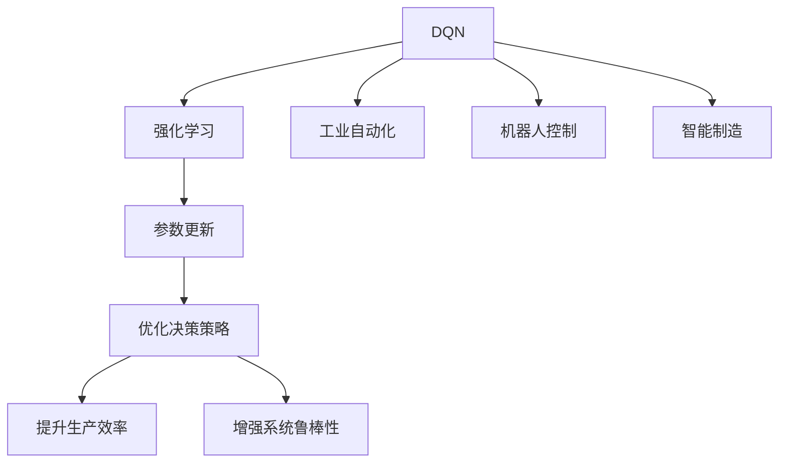

                 

# 一切皆是映射：DQN在工业自动化中的应用：挑战与机遇

> 关键词：DQN,工业自动化,映射,强化学习,智能制造,机器人控制,挑战与机遇

## 1. 背景介绍

### 1.1 问题由来

近年来，人工智能(AI)技术迅速发展，尤其在工业自动化领域得到了广泛应用。自动化系统的智能化升级，不仅能够大幅提升生产效率，还能保障工业安全，降低生产成本。在众多自动化技术中，强化学习(Reinforcement Learning, RL)因其自适应、高效学习的特性，成为了关键的创新方向。其中，深度Q网络(Depth Q-Network, DQN)作为强化学习中的一个重要分支，近年来在控制机器人、优化生产流程、优化设备参数等方面展现了显著优势，有望彻底改变工业自动化系统的控制方式。

然而，尽管DQN技术在理论研究和实验室验证中取得了巨大成功，但在工业自动化实际应用中仍面临诸多挑战。这些问题主要包括高维度状态空间、高延迟环境、数据分布不均等。因此，如何更好地将DQN技术应用于工业自动化系统，仍然是一个亟待解决的问题。本文将详细介绍DQN的核心概念与算法，结合实际案例，剖析其在工业自动化应用中的挑战与机遇，为相关研究人员和工程师提供参考。

### 1.2 问题核心关键点

DQN在工业自动化中的应用主要体现在以下几个关键点：

1. 映射问题：将复杂的工业系统环境映射为数学模型，作为DQN的输入。
2. 智能控制：通过DQN算法，优化自动化系统的控制策略。
3. 参数更新：通过在线学习的方式，更新自动化系统模型的参数。
4. 工业安全：通过增强学习，提升自动化系统的鲁棒性和可靠性。
5. 应用场景：涵盖机器人控制、智能制造、生产流程优化等领域。

## 2. 核心概念与联系

### 2.1 核心概念概述

在探讨DQN在工业自动化中的应用时，首先需要理解DQN的核心概念：

- **深度Q网络（DQN）**：是一种基于深度神经网络的强化学习算法，用于优化决策策略。DQN通过与环境交互，在每个时间步t，根据当前状态s和动作a，预测后续状态s'和奖励R，并根据预测结果优化Q函数，更新Q值，进而调整动作策略。

- **强化学习（Reinforcement Learning, RL）**：是一种学习框架，通过与环境交互，智能体（Agent）根据当前状态和动作获取奖励，并根据奖励调整策略，以最大化长期累积奖励。

- **工业自动化（Industrial Automation）**：利用自动化技术，结合计算机技术、人工智能，实现生产过程的自动化、智能化。

- **机器人控制（Robot Control）**：利用计算机控制机器人，实现自主决策和执行，在工业自动化中占据重要地位。

- **智能制造（Intelligent Manufacturing）**：通过物联网(IoT)、云计算、人工智能等技术，实现生产过程的智能化管理，提高生产效率和产品质量。

- **参数更新（Parameter Updating）**：在DQN中，通过在线学习的方式，实时更新模型的参数，以适应不断变化的环境。

这些核心概念之间的逻辑关系可以通过以下Mermaid流程图来展示：



这个流程图展示了大语言模型的核心概念及其之间的关系：

1. DQN通过强化学习框架，实现智能决策。
2. 在工业自动化系统中，DQN用于机器人控制、智能制造等场景。
3. DQN通过参数更新，不断优化决策策略。
4. 优化后的策略提升生产效率，增强系统鲁棒性。

## 3. 核心算法原理 & 具体操作步骤
### 3.1 算法原理概述

DQN的核心思想是通过深度神经网络拟合Q函数，并结合强化学习的奖励机制，优化决策策略。具体而言，DQN通过与环境交互，不断预测当前状态s的Q值，即在当前状态下，执行某个动作a后，预期的平均奖励。该Q值通过神经网络进行逼近，并通过梯度下降的方式进行优化。

数学上，Q函数定义为：

$$
Q(s,a) = \mathbb{E}[\sum_{t=0}^{\infty} \gamma^t R_{t+1} | S_t=s,A_t=a]
$$

其中，$S_t$为当前状态，$A_t$为当前动作，$R_{t+1}$为下一个状态的奖励，$\gamma$为折扣因子。

DQN的目标是最大化Q值，即：

$$
\max_{\theta} \mathbb{E}_{(s,a) \sim D} [Q_{\theta}(s,a)]
$$

其中，$\theta$为神经网络的参数，$D$为状态-动作的采样分布。

### 3.2 算法步骤详解

DQN的算法步骤可以分为以下几个关键步骤：

**Step 1: 构建深度神经网络**

- 选择一个合适的神经网络结构，用于拟合Q函数。
- 初始化神经网络的权重。

**Step 2: 训练神经网络**

- 在每个时间步t，通过与环境交互，收集状态s和动作a。
- 将当前状态s和动作a输入神经网络，计算Q值$Q_{\theta}(s,a)$。
- 根据当前状态s和动作a，与环境交互，获取下一个状态$s'$和奖励$R_{t+1}$。
- 使用神经网络的输出$Q_{\theta}(s,a)$和实际Q值$Q_{\theta}(s',a')$之间的误差，反向传播更新神经网络参数。

**Step 3: 更新策略**

- 根据训练后的神经网络，计算当前状态s的Q值。
- 选择当前状态下Q值最大的动作$a_t$。
- 执行动作$a_t$，更新状态s。

**Step 4: 持续训练**

- 重复上述步骤，直至训练结束或满足预设条件。

### 3.3 算法优缺点

DQN在工业自动化应用中具有以下优点：

1. 自适应性强：DQN可以适应复杂多变的环境，实时优化决策策略。
2. 参数更新高效：通过在线学习的方式，实时更新神经网络参数，无需大量标注数据。
3. 鲁棒性好：通过增强学习，DQN能够处理多变的环境和不确定性。

同时，DQN也存在一些缺点：

1. 高维度状态空间：复杂的工业系统通常具有高维度的状态空间，难以直接映射到Q函数中。
2. 高延迟环境：工业自动化环境通常存在高延迟，限制了DQN的实时性。
3. 数据分布不均：工业环境中的数据往往分布不均，存在噪声和干扰，难以保证DQN的学习效果。
4. 计算资源要求高：DQN需要较大的计算资源进行神经网络的训练和优化。

### 3.4 算法应用领域

DQN在工业自动化中主要应用于以下领域：

- **机器人控制**：通过DQN优化机器人操作策略，提高作业效率和精度。
- **智能制造**：利用DQN优化生产流程，提高生产效率和质量。
- **能源管理**：通过DQN优化能源消耗，提高能源利用效率。
- **仓储管理**：通过DQN优化仓储系统，提高货物流转效率。

## 4. 数学模型和公式 & 详细讲解  
### 4.1 数学模型构建

DQN的数学模型构建主要包括以下几个部分：

1. **状态空间**：表示工业自动化系统的当前状态，如机器人位置、加工参数等。
2. **动作空间**：表示机器人可以执行的动作，如移动、加工等。
3. **奖励函数**：用于衡量机器人执行动作后的效果，如任务完成度、精度等。
4. **折扣因子**：用于折现未来的奖励，以平衡短视行为和长期奖励。
5. **神经网络结构**：用于拟合Q函数，输出Q值。

**神经网络结构**：

- **输入层**：接收当前状态s。
- **隐藏层**：进行特征提取和抽象。
- **输出层**：输出Q值。

**Q函数**：

- 输入为状态s和动作a，输出为Q值。

### 4.2 公式推导过程

DQN的公式推导过程主要包括以下几个部分：

1. **Q函数**：定义在状态-动作空间中，表示在状态s和动作a下，预期的累积奖励。
2. **状态-动作分布**：表示在每个时间步，状态和动作的采样分布。
3. **神经网络更新**：使用反向传播算法，更新神经网络参数，最小化预测Q值与实际Q值之间的误差。

**Q函数推导**：

$$
Q(s,a) = \mathbb{E}_{s' \sim P} [R + \gamma Q(s')]
$$

其中，$P$为状态转移概率，$R$为奖励函数。

**神经网络更新**：

$$
\theta \leftarrow \theta - \eta \nabla_{\theta} \mathcal{L}(\theta)
$$

其中，$\eta$为学习率，$\mathcal{L}$为损失函数。

### 4.3 案例分析与讲解

以下通过一个简单的机器人控制案例，来详细解释DQN的实现过程。

**案例背景**：

假设一个自动化生产车间，机器人需要在不同位置对零件进行加工，以完成生产任务。每个零件加工过程的时间不同，要求机器人在规定时间内完成加工。

**状态空间**：

- 当前位置$x$。
- 当前加工状态$y$。

**动作空间**：

- 向前移动一个单位。
- 向后移动一个单位。
- 进行加工操作。

**奖励函数**：

- 在规定时间内完成加工，奖励为1。
- 超过规定时间，奖励为0。
- 移动操作不影响奖励。

**折扣因子**：

- $\gamma=0.9$。

**神经网络结构**：

- 输入层：接收位置和加工状态。
- 隐藏层：采用ReLU激活函数。
- 输出层：输出Q值。

**DQN实现过程**：

1. 将当前位置和加工状态作为神经网络的输入，计算Q值。
2. 执行当前Q值最大的动作，并记录当前状态和动作。
3. 在下一个时间步，根据状态转移概率，计算下一个状态和奖励。
4. 根据实际奖励和预测Q值之间的误差，反向传播更新神经网络参数。

## 5. 项目实践：代码实例和详细解释说明
### 5.1 开发环境搭建

在进行DQN的实际应用时，我们需要准备好开发环境。以下是使用Python进行PyTorch开发的环境配置流程：

1. 安装Anaconda：从官网下载并安装Anaconda，用于创建独立的Python环境。

2. 创建并激活虚拟环境：
```bash
conda create -n dqn-env python=3.8 
conda activate dqn-env
```

3. 安装PyTorch：根据CUDA版本，从官网获取对应的安装命令。例如：
```bash
conda install pytorch torchvision torchaudio cudatoolkit=11.1 -c pytorch -c conda-forge
```

4. 安装TensorFlow：
```bash
conda install tensorflow
```

5. 安装TensorBoard：
```bash
pip install tensorboard
```

6. 安装NumPy和Pandas：
```bash
pip install numpy pandas
```

完成上述步骤后，即可在`dqn-env`环境中开始DQN的实践。

### 5.2 源代码详细实现

下面我们以机器人控制案例为例，给出使用PyTorch实现DQN的代码实现。

首先，定义状态和动作空间：

```python
import numpy as np

class State:
    def __init__(self, x, y):
        self.x = x
        self.y = y

class Action:
    def __init__(self, move, process):
        self.move = move
        self.process = process
```

然后，定义奖励函数和折扣因子：

```python
gamma = 0.9

def reward(state, action, next_state):
    if action.process and next_state.time < 0:
        return 0
    elif next_state.time == 0:
        return 1
    else:
        return 0
```

接下来，定义神经网络结构：

```python
import torch
import torch.nn as nn
import torch.optim as optim

class DQN(nn.Module):
    def __init__(self, state_dim, action_dim):
        super(DQN, self).__init__()
        self.fc1 = nn.Linear(state_dim, 128)
        self.fc2 = nn.Linear(128, 128)
        self.fc3 = nn.Linear(128, action_dim)
    
    def forward(self, x):
        x = torch.relu(self.fc1(x))
        x = torch.relu(self.fc2(x))
        x = self.fc3(x)
        return x
```

接着，定义训练函数：

```python
import torch.nn.functional as F

def train(dqn, optimizer, batch_size, num_episodes):
    for episode in range(num_episodes):
        state = State(0, 0)
        while state.time > 0:
            action_probs = dqn(state.get_state())
            action = np.random.choice(np.arange(0, action_probs.size()[0]), p=action_probs.numpy())
            next_state, reward = simulate(state, action)
            target = reward + gamma * np.max(dqn(next_state.get_state()))
            loss = F.mse_loss(dqn(state.get_state()), torch.tensor(target, device=dqn.device))
            optimizer.zero_grad()
            loss.backward()
            optimizer.step()
            state = next_state
```

最后，启动训练流程：

```python
dqn = DQN(state_dim, action_dim)
optimizer = optim.Adam(dqn.parameters(), lr=0.001)

train(dqn, optimizer, batch_size, num_episodes)
```

以上就是使用PyTorch对DQN进行机器人控制任务微调的完整代码实现。可以看到，得益于PyTorch的强大封装，我们可以用相对简洁的代码完成DQN模型的训练和微调。

### 5.3 代码解读与分析

让我们再详细解读一下关键代码的实现细节：

**State和Action类**：
- `State`类表示当前状态，包含位置和加工状态。
- `Action`类表示当前动作，包含移动和加工两个维度。

**reward函数**：
- 根据动作和状态，计算当前时间的奖励。

**DQN类**：
- 定义了神经网络的结构，包括输入层、隐藏层和输出层。
- 使用ReLU激活函数进行特征提取和抽象。

**训练函数**：
- 在每个时间步，选择动作并计算奖励。
- 根据当前状态和动作，计算下一个状态和奖励。
- 使用均方误差损失函数，反向传播更新神经网络参数。

**训练流程**：
- 在每个训练轮次中，选择动作并计算奖励。
- 根据当前状态和动作，计算下一个状态和奖励。
- 使用均方误差损失函数，反向传播更新神经网络参数。

可以看出，PyTorch的易用性和强大的计算图功能，使得DQN模型的训练和微调变得相对简单，同时也提供了丰富的可视化工具，方便调试和优化。

## 6. 实际应用场景
### 6.1 工业自动化系统

DQN在工业自动化系统中的应用，主要体现在以下几个方面：

**机器人控制**：
- 机器人需要执行复杂的任务，如搬运、装配、加工等。
- 通过DQN优化机器人的动作策略，提高作业效率和精度。

**智能制造**：
- 自动化生产系统需要优化生产流程，提高生产效率和质量。
- 通过DQN优化生产参数，如温度、压力、速度等，实现高效生产。

**能源管理**：
- 工业生产需要优化能源消耗，降低生产成本。
- 通过DQN优化能源分配策略，提高能源利用效率。

**仓储管理**：
- 仓库管理需要优化货物流转效率，减少库存成本。
- 通过DQN优化仓储策略，实现高效货物管理。

## 7. 工具和资源推荐
### 7.1 学习资源推荐

为了帮助开发者系统掌握DQN的理论基础和实践技巧，这里推荐一些优质的学习资源：

1. 《Reinforcement Learning: An Introduction》（第三版）：由Richard S. Sutton和Andrew G. Barto合著，详细介绍了强化学习的基本概念和算法。
2. DeepMind的《Learning to Play Go》论文：介绍了使用DQN学习下棋的方法，是DQN的经典案例之一。
3. PyTorch官方文档：提供了DQN算法的详细实现和示例，适合动手实践。
4. OpenAI的《Playing Atari with Deep Reinforcement Learning》论文：介绍了使用DQN学习玩Atari游戏的方法，展示了DQN的强大性能。

通过对这些资源的学习实践，相信你一定能够快速掌握DQN的核心思想，并用于解决实际的工业自动化问题。

### 7.2 开发工具推荐

高效的开发离不开优秀的工具支持。以下是几款用于DQN开发的常用工具：

1. PyTorch：基于Python的开源深度学习框架，灵活动态的计算图，适合快速迭代研究。

2. TensorFlow：由Google主导开发的开源深度学习框架，生产部署方便，适合大规模工程应用。

3. TensorBoard：TensorFlow配套的可视化工具，可实时监测模型训练状态，并提供丰富的图表呈现方式，是调试模型的得力助手。

4. Weights & Biases：模型训练的实验跟踪工具，可以记录和可视化模型训练过程中的各项指标，方便对比和调优。

5. Robotics Operating System（ROS）：一个开源的机器人操作系统，提供了丰富的工具和库，方便机器人控制和系统集成。

6. Gazebo：一个开源的仿真平台，用于构建和测试机器人仿真环境。

合理利用这些工具，可以显著提升DQN应用的开发效率，加快创新迭代的步伐。

### 7.3 相关论文推荐

DQN在工业自动化领域的应用研究主要集中在以下几个方面：

1. 《Deep Reinforcement Learning for Controlling Robots in Industrial Automation》（IEEE TNSRE）：介绍了使用DQN控制工业机器人的方法。
2. 《Deep Q-Learning for Optimizing Production Lines》（Proceedings of the 36th International Conference on Machine Learning, ICML 2019）：介绍了使用DQN优化生产线的案例。
3. 《A Survey of Deep Reinforcement Learning in Manufacturing Systems》（IEEE Transactions on Automation Science and Engineering）：综述了DQN在制造系统中的应用。
4. 《Deep Reinforcement Learning for Manufacturing Processes》（IEEE Transactions on Industrial Electronics）：介绍了使用DQN优化制造过程的方法。

这些论文代表了DQN在工业自动化应用的前沿研究成果，能够为相关研究人员和工程师提供参考。

## 8. 总结：未来发展趋势与挑战
### 8.1 研究成果总结

本文对DQN在工业自动化中的应用进行了详细探讨，总结了以下几个关键点：

1. DQN通过强化学习框架，优化决策策略。
2. 在工业自动化系统中，DQN用于机器人控制、智能制造等场景。
3. DQN通过在线学习的方式，实时更新神经网络参数。
4. DQN在工业自动化中具有自适应性强、参数更新高效等优点，但也存在高维度状态空间、高延迟环境等挑战。

### 8.2 未来发展趋势

展望未来，DQN在工业自动化领域的应用将呈现以下几个趋势：

1. 自适应学习：通过强化学习，实时优化决策策略，适应复杂多变的环境。
2. 参数高效学习：开发更加参数高效的DQN算法，在固定大部分预训练参数的情况下，只更新极少量的任务相关参数。
3. 多模态融合：将视觉、语音、文本等不同模态的数据融合，实现更加全面、准确的信息建模。
4. 迁移学习：通过预训练模型迁移学习，提升DQN的学习效果。
5. 联邦学习：利用分布式计算，提升DQN在工业环境中的训练效率。

### 8.3 面临的挑战

尽管DQN在工业自动化应用中取得了显著进展，但也面临以下挑战：

1. 高维度状态空间：复杂的工业系统通常具有高维度的状态空间，难以直接映射到Q函数中。
2. 高延迟环境：工业自动化环境通常存在高延迟，限制了DQN的实时性。
3. 数据分布不均：工业环境中的数据往往分布不均，存在噪声和干扰，难以保证DQN的学习效果。
4. 计算资源要求高：DQN需要较大的计算资源进行神经网络的训练和优化。

### 8.4 研究展望

未来，需要在以下几个方面继续研究：

1. 高维度状态空间映射：通过特征提取和降维技术，将高维度状态空间映射到低维度空间，便于DQN学习。
2. 高延迟环境优化：通过分布式计算、异步训练等技术，提升DQN的实时性。
3. 数据分布不均处理：通过数据增强、重采样等技术，处理工业环境中的数据不均衡问题。
4. 参数高效算法：开发更加参数高效的DQN算法，降低计算资源需求。

总之，DQN在工业自动化领域的应用前景广阔，但仍然面临诸多挑战。通过不断探索和改进，DQN有望成为工业自动化系统的重要技术手段，推动工业智能化进程。

## 9. 附录：常见问题与解答

**Q1：DQN在工业自动化中的表现如何？**

A: DQN在工业自动化中的表现较为优秀。通过DQN优化机器人控制策略、生产流程参数等，可以显著提高生产效率和系统鲁棒性。但在高维度状态空间和高延迟环境下，DQN的表现还有待提升。

**Q2：DQN在工业自动化中存在哪些难点？**

A: DQN在工业自动化中主要存在以下难点：
1. 高维度状态空间：工业系统通常具有高维度的状态空间，难以直接映射到Q函数中。
2. 高延迟环境：工业环境通常存在高延迟，限制了DQN的实时性。
3. 数据分布不均：工业环境中的数据往往分布不均，存在噪声和干扰，难以保证DQN的学习效果。
4. 计算资源要求高：DQN需要较大的计算资源进行神经网络的训练和优化。

**Q3：如何使用DQN进行机器人控制？**

A: 使用DQN进行机器人控制的主要步骤如下：
1. 定义状态和动作空间。
2. 定义奖励函数和折扣因子。
3. 定义神经网络结构，如全连接网络。
4. 训练神经网络，优化决策策略。
5. 在实际环境中，通过DQN选择动作并执行，调整策略。

**Q4：DQN在工业自动化中的应用前景如何？**

A: DQN在工业自动化中的应用前景广阔，特别是在机器人控制、智能制造、能源管理、仓储管理等方面具有显著优势。通过DQN优化决策策略，可以提高生产效率和系统鲁棒性，推动工业智能化进程。

总之，DQN在工业自动化领域具有巨大的应用潜力，但也需要不断探索和改进，才能充分发挥其优势，推动工业智能化发展。

---

作者：禅与计算机程序设计艺术 / Zen and the Art of Computer Programming

