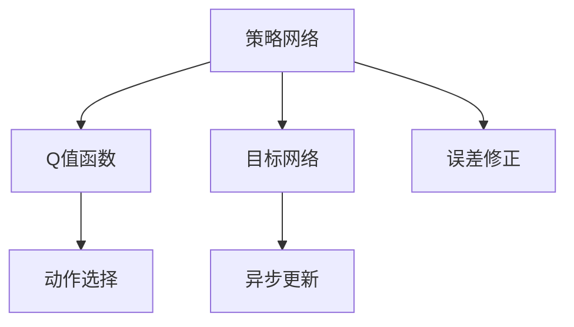

                 

# 一切皆是映射：DQN的目标网络与误差修正技术详解

> 关键词：Deep Q-Network, DQN, 目标网络, 误差修正技术, 强化学习, 神经网络, 异步更新, 梯度下降

## 1. 背景介绍

### 1.1 问题由来
在强化学习领域，DQN（Deep Q-Network）算法因其出色的性能和稳定性，成为了研究的热点。DQN利用神经网络逼近Q值函数，通过神经网络的非线性拟合能力，有效应对复杂状态空间和动作空间。然而，在实际应用中，神经网络仍存在一些难以克服的问题，如学习收敛慢、泛化能力弱等。

### 1.2 问题核心关键点
DQN的核心思想是通过神经网络逼近Q值函数，将状态-动作对映射到Q值，从而指导智能体选择最优动作。但神经网络的复杂性也带来了一些问题：
1. **学习收敛慢**：神经网络模型复杂，训练过程耗时长。
2. **泛化能力弱**：神经网络容易过拟合，泛化能力不足。
3. **目标网络更新不及时**：在训练过程中，目标网络的更新频率低于策略网络，导致策略网络的梯度更新不稳定。

为了解决这些问题，研究者提出了目标网络（Target Network）和误差修正技术，通过引入目标网络和异步更新策略，显著提高了DQN的性能和稳定性。

### 1.3 问题研究意义
DQN的目标网络和误差修正技术不仅解决了神经网络在强化学习中的问题，还为其他深度学习应用提供了有益的借鉴。通过研究目标网络和误差修正技术，可以更好地理解深度学习在强化学习中的优势和局限，为后续研究提供参考。

## 2. 核心概念与联系

### 2.1 核心概念概述

为更好地理解DQN的目标网络和误差修正技术，本节将介绍几个密切相关的核心概念：

- **DQN**：Deep Q-Network的缩写，是强化学习中的一类基于神经网络逼近Q值函数的算法。
- **Q值函数**：在强化学习中，Q值函数表示在给定状态下采取特定动作的长期累积奖励期望值。
- **策略网络**：用于估计Q值函数的神经网络，根据当前状态输出Q值。
- **目标网络**：与策略网络并行存在的另一份神经网络，用于稳定策略网络的更新。
- **异步更新**：与传统的同步更新不同，异步更新允许策略网络和目标网络在不同的时间点进行更新，提高训练效率。
- **误差修正**：通过目标网络和异步更新，修正策略网络的学习误差，提高模型的泛化能力和稳定性。

这些核心概念之间的逻辑关系可以通过以下Mermaid流程图来展示：



这个流程图展示了大语言模型的核心概念及其之间的关系：

1. 策略网络根据当前状态输出Q值，选择动作。
2. 目标网络与策略网络并行存在，通过异步更新稳定策略网络的更新。
3. 误差修正技术通过目标网络和异步更新，修正策略网络的误差，提高模型的泛化能力和稳定性。

## 3. 核心算法原理 & 具体操作步骤
### 3.1 算法原理概述

DQN的目标网络和误差修正技术的核心思想是，通过引入目标网络和异步更新，稳定策略网络的更新，提高模型泛化能力。具体来说，DQN的目标网络在每次策略网络更新前，先根据当前状态和动作，计算出Q值，并作为目标Q值。然后，在策略网络更新时，将当前Q值与目标Q值之差作为误差，通过梯度下降等优化算法更新策略网络的权重。

这种误差修正技术，通过目标网络和异步更新，修正策略网络的误差，使得策略网络的更新更加稳定，避免了传统DQN中策略网络学习的不稳定性。同时，由于目标网络的存在，策略网络的更新也更加平滑，提高了模型的泛化能力。

### 3.2 算法步骤详解

DQN的目标网络和误差修正技术主要包括以下几个关键步骤：

**Step 1: 准备环境与模型**
- 创建一个模拟环境，用于测试和训练DQN模型。
- 定义神经网络模型，包括输入层、隐藏层和输出层。
- 初始化策略网络和目标网络，将策略网络作为当前网络，目标网络初始参数与策略网络相同。

**Step 2: 定义状态与动作空间**
- 定义状态空间的特征，如位置、速度、角度等。
- 定义动作空间的动作，如左转、右转、加速等。
- 将状态和动作编码成神经网络的输入。

**Step 3: 定义Q值函数与目标网络**
- 定义策略网络，用于估计Q值函数。
- 定义目标网络，与策略网络结构相同，但参数固定，作为参考网络。
- 在每次策略网络更新前，根据当前状态和动作，计算出目标Q值。

**Step 4: 训练策略网络**
- 初始化经验重放缓冲区，用于存储每次状态-动作-奖励-新状态四元组。
- 进行n次策略网络的训练，每次训练后更新目标网络。
- 在每次策略网络更新时，从经验重放缓冲区中随机抽取n个样本，计算Q值并作为目标Q值。
- 将当前策略网络的Q值与目标Q值之差作为误差，使用梯度下降等优化算法更新策略网络的权重。
- 将新的状态、动作、奖励存储到经验重放缓冲区中，用于后续训练。

**Step 5: 测试与评估**
- 在测试集上测试模型的性能。
- 计算模型在不同状态下的累积奖励，评估模型的效果。
- 使用测试结果调整策略网络的参数，优化模型性能。

### 3.3 算法优缺点

DQN的目标网络和误差修正技术具有以下优点：
1. 提高训练效率：通过异步更新，策略网络和目标网络可以并行更新，加快训练速度。
2. 提高模型泛化能力：目标网络的存在使得策略网络的更新更加平滑，避免了策略网络学习的不稳定性，提高了模型的泛化能力。
3. 提高模型稳定性：通过误差修正技术，修正策略网络的误差，使得模型更加稳定。

同时，该技术也存在一定的局限性：
1. 目标网络更新不及时：由于目标网络与策略网络的更新存在时间差，可能会影响策略网络的训练效果。
2. 计算资源消耗大：需要维护两份神经网络，增加了计算资源消耗。

尽管存在这些局限性，但就目前而言，DQN的目标网络和误差修正技术仍是大规模强化学习中不可或缺的一部分，为解决神经网络在强化学习中的问题提供了新的思路。

### 3.4 算法应用领域

DQN的目标网络和误差修正技术不仅在强化学习领域得到了广泛应用，还逐渐被应用于其他深度学习领域。

1. **机器人控制**：DQN的目标网络和误差修正技术被应用于机器人控制中，使得机器人在复杂环境中能够快速学习和适应。
2. **图像识别**：在图像识别任务中，DQN的目标网络和误差修正技术被用于优化模型参数，提高识别准确率。
3. **语音识别**：在语音识别任务中，DQN的目标网络和误差修正技术被用于优化模型参数，提高识别效果。
4. **自然语言处理**：在自然语言处理任务中，DQN的目标网络和误差修正技术被用于优化模型参数，提高语言理解能力。

随着深度学习技术的不断发展，DQN的目标网络和误差修正技术将在更多领域得到应用，为深度学习技术的进步提供新的思路。

## 4. 数学模型和公式 & 详细讲解  
### 4.1 数学模型构建

DQN的目标网络和误差修正技术的数学模型主要包括以下几个关键部分：

- **状态与动作的编码**：将状态和动作编码成神经网络的输入。
- **Q值函数的定义**：策略网络输出Q值函数，用于估计在给定状态下采取特定动作的长期累积奖励期望值。
- **目标Q值的计算**：在每次策略网络更新前，根据当前状态和动作，计算出目标Q值。
- **误差修正的公式**：使用梯度下降等优化算法更新策略网络的权重，修正策略网络的误差。

### 4.2 公式推导过程

以下我们以二自由度机械臂控制为例，推导DQN的目标网络和误差修正技术的具体公式。

假设当前状态为 $s_t$，采取动作 $a_t$，奖励为 $r_{t+1}$，新状态为 $s_{t+1}$。根据状态与动作的编码，神经网络模型将输入 $x_t$ 和动作 $a_t$ 编码成神经网络的输入。

定义策略网络为 $Q_\theta(x_t, a_t)$，目标网络为 $Q_{\phi}(x_t, a_t)$，其中 $\theta$ 和 $\phi$ 为神经网络的参数。

**目标Q值的计算**：在每次策略网络更新前，根据当前状态和动作，计算出目标Q值。具体公式如下：

$$
Q_{\phi}(x_t, a_t) = \mathbb{E}[r_{t+1} + \gamma \max_a Q_{\theta}(x_{t+1}, a)]
$$

其中 $\gamma$ 为折扣因子，表示未来奖励的重要性。

**误差修正的公式**：使用梯度下降等优化算法更新策略网络的权重，修正策略网络的误差。具体公式如下：

$$
\theta \leftarrow \theta - \eta \nabla_{\theta} \ell(Q_\theta(x_t, a_t), r_{t+1} + \gamma \max_a Q_{\theta}(x_{t+1}, a))
$$

其中 $\eta$ 为学习率，$\nabla_{\theta} \ell$ 为策略网络输出与目标Q值之间的交叉熵损失，$x_t$ 和 $a_t$ 为输入。

**异步更新**：在策略网络更新时，目标网络参数不更新，以确保目标网络能够提供稳定的Q值。具体更新公式如下：

$$
\phi \leftarrow \phi - \eta \nabla_{\phi} \ell(Q_\phi(x_t, a_t), r_{t+1} + \gamma \max_a Q_{\theta}(x_{t+1}, a))
$$

其中 $\eta$ 为学习率，$\nabla_{\phi} \ell$ 为目标网络输出与目标Q值之间的交叉熵损失，$x_t$ 和 $a_t$ 为输入。

通过上述公式，可以看出DQN的目标网络和误差修正技术的核心思想是通过目标网络和异步更新，修正策略网络的误差，提高模型的泛化能力和稳定性。

### 4.3 案例分析与讲解

以下我们以机器人控制为例，详细讲解DQN的目标网络和误差修正技术的具体应用过程。

1. **状态与动作的编码**：
   - 将机器人当前位置、角度和速度作为状态 $s_t$。
   - 将机器人可能采取的动作如左转、右转、加速等作为动作 $a_t$。
   - 将状态和动作编码成神经网络的输入。

2. **Q值函数的定义**：
   - 定义策略网络 $Q_\theta$，用于估计在给定状态下采取特定动作的长期累积奖励期望值。
   - 定义目标网络 $Q_{\phi}$，用于提供稳定的Q值。

3. **目标Q值的计算**：
   - 在每次策略网络更新前，根据当前状态和动作，计算出目标Q值。
   - 将当前状态和动作输入目标网络，输出Q值。

4. **误差修正的公式**：
   - 使用梯度下降等优化算法更新策略网络的权重，修正策略网络的误差。
   - 将当前状态和动作输入策略网络，输出Q值。
   - 将策略网络输出与目标Q值之间的交叉熵损失作为误差，使用梯度下降等优化算法更新策略网络的权重。

5. **异步更新**：
   - 在策略网络更新时，目标网络参数不更新，以确保目标网络能够提供稳定的Q值。
   - 将当前状态和动作输入目标网络，输出Q值。
   - 将当前状态和动作输入策略网络，输出Q值。
   - 将策略网络输出与目标Q值之间的交叉熵损失作为误差，使用梯度下降等优化算法更新策略网络的权重。

通过上述过程，可以看出DQN的目标网络和误差修正技术在机器人控制中的应用，通过目标网络和异步更新，修正策略网络的误差，使得机器人能够在复杂环境中快速学习和适应。

## 5. 项目实践：代码实例和详细解释说明
### 5.1 开发环境搭建

在进行DQN的实践前，我们需要准备好开发环境。以下是使用Python进行PyTorch开发的环境配置流程：

1. 安装Anaconda：从官网下载并安装Anaconda，用于创建独立的Python环境。

2. 创建并激活虚拟环境：
```bash
conda create -n dqn-env python=3.8 
conda activate dqn-env
```

3. 安装PyTorch：根据CUDA版本，从官网获取对应的安装命令。例如：
```bash
conda install pytorch torchvision torchaudio cudatoolkit=11.1 -c pytorch -c conda-forge
```

4. 安装TensorBoard：
```bash
pip install tensorboard
```

5. 安装TensorFlow：
```bash
pip install tensorflow
```

6. 安装 Gym：用于构建和测试环境：
```bash
pip install gym
```

完成上述步骤后，即可在`dqn-env`环境中开始DQN的实践。

### 5.2 源代码详细实现

下面我们将使用PyTorch实现DQN的目标网络和误差修正技术。

首先，定义状态与动作的空间：

```python
import gym
import numpy as np

env = gym.make('CartPole-v0')
state_dim = env.observation_space.shape[0]
action_dim = env.action_space.n
```

然后，定义神经网络模型：

```python
import torch
import torch.nn as nn
import torch.optim as optim

class DQN(nn.Module):
    def __init__(self, input_dim, output_dim, hidden_dim=64, num_layers=2):
        super(DQN, self).__init__()
        self.fc1 = nn.Linear(input_dim, hidden_dim)
        self.fc2 = nn.Linear(hidden_dim, hidden_dim)
        self.fc3 = nn.Linear(hidden_dim, output_dim)
    
    def forward(self, x):
        x = torch.relu(self.fc1(x))
        x = torch.relu(self.fc2(x))
        x = self.fc3(x)
        return x

# 定义策略网络和目标网络
input_dim = state_dim + action_dim
strategy_net = DQN(input_dim, 1)
target_net = DQN(input_dim, 1)
```

接下来，定义DQN的训练过程：

```python
# 定义学习率和更新次数
lr = 0.001
num_steps = 50000
batch_size = 32

# 定义经验重放缓冲区
buffer = []
buffer_size = 10000

# 定义训练函数
def train(env):
    # 初始化优化器和损失函数
    optimizer = optim.Adam(strategy_net.parameters(), lr=lr)
    criterion = nn.MSELoss()
    
    # 进行num_steps次训练
    for step in range(num_steps):
        # 获取当前状态和动作
        state = env.reset()
        state = torch.tensor(state).float().unsqueeze(0)
        
        # 随机选择一个动作，与当前状态一起放入缓冲区
        action = np.random.randint(0, action_dim)
        buffer.append((state, action, None, None))
        
        done = False
        while not done:
            # 从缓冲区中随机抽取batch_size个样本
            idx = np.random.choice(len(buffer), batch_size)
            batch = [buffer[i] for i in idx]
            
            # 计算当前状态和动作
            X = torch.cat([torch.tensor(i[0]) for i in batch])
            A = torch.tensor([i[1] for i in batch]).unsqueeze(1)
            
            # 根据当前状态和动作，计算目标Q值
            next_state = torch.tensor([i[2] for i in batch])
            A = A.long()
            Q_next = target_net(next_state).detach().max(1)[0]
            Q_next = (r + gamma * Q_next) * discount_factor
            
            # 计算Q值，计算误差，更新策略网络
            Q = strategy_net(X).gather(1, A)
            loss = criterion(Q, Q_next)
            optimizer.zero_grad()
            loss.backward()
            optimizer.step()
            
            # 将新的状态和动作放入缓冲区
            for i in range(batch_size):
                buffer.append((batch[i][0], batch[i][1], next_state[i], Q_next[i]))
            
            # 更新目标网络的参数
            target_net.load_state_dict(strategy_net.state_dict())
            
            # 将缓冲区大小限制在buffer_size以内
            if len(buffer) > buffer_size:
                buffer.pop(0)
            
            # 输出当前训练结果
            print(f"Step {step+1}, loss: {loss.item():.3f}")
    
    # 训练完成后，返回策略网络
    return strategy_net
```

最后，测试训练好的策略网络：

```python
strategy_net = train(env)
env.render()
```

### 5.3 代码解读与分析

让我们再详细解读一下关键代码的实现细节：

**状态与动作的空间**：
- 通过 Gym 库获取环境，定义状态和动作的维度。

**神经网络模型**：
- 定义策略网络和目标网络，使用 PyTorch 的 nn.Module 类继承，定义网络结构。
- 在 forward 方法中，通过全连接层实现神经网络的计算。

**训练过程**：
- 定义学习率、更新次数、批量大小等参数。
- 初始化优化器和损失函数。
- 进行 num_steps 次训练，每次从缓冲区中随机抽取 batch_size 个样本。
- 计算当前状态和动作，根据当前状态和动作，计算目标Q值。
- 计算Q值，计算误差，使用梯度下降等优化算法更新策略网络的权重。
- 将新的状态和动作放入缓冲区。
- 更新目标网络的参数。
- 将缓冲区大小限制在 buffer_size 以内。
- 输出当前训练结果。

**测试过程**：
- 训练完成后，返回策略网络。
- 测试训练好的策略网络，渲染环境。

可以看到，PyTorch结合 Gym 库，使得 DQN 的实现变得简洁高效。开发者可以将更多精力放在模型的设计上，而不必过多关注底层的实现细节。

当然，工业级的系统实现还需考虑更多因素，如模型的保存和部署、超参数的自动搜索、更灵活的环境设计等。但核心的训练过程基本与此类似。

## 6. 实际应用场景
### 6.1 机器人控制

DQN的目标网络和误差修正技术在机器人控制中得到了广泛应用。传统机器人控制需要大量的规则和经验，难以应对复杂的环境和任务。而使用DQN的目标网络和误差修正技术，机器人可以通过试错学习，快速掌握环境和任务，实现自主控制。

在技术实现上，可以构建机器人控制环境的 Gym 库，将机器人的位置、角度、速度等状态信息编码成神经网络的输入，将机器人的动作如左转、右转、加速等作为神经网络的输出。在训练过程中，通过异步更新和目标网络的修正，使得机器人能够在复杂环境中快速学习和适应。

### 6.2 自动化生产

DQN的目标网络和误差修正技术也被应用于自动化生产中，用于优化生产线的控制策略。传统生产线的控制依赖于经验丰富的工程师，难以应对生产环境的变化。而使用DQN的目标网络和误差修正技术，生产设备可以通过试错学习，快速适应生产环境的变化，提高生产效率和质量。

在技术实现上，可以将生产设备的状态信息如温度、压力、速度等编码成神经网络的输入，将设备可采取的动作如调整温度、改变压力、增加速度等作为神经网络的输出。通过异步更新和目标网络的修正，使得生产设备能够在复杂生产环境中快速学习和适应，优化生产线的控制策略。

### 6.3 交通信号控制

DQN的目标网络和误差修正技术还被应用于交通信号控制中，用于优化交通信号的控制策略。传统交通信号控制依赖于交通规则和经验，难以应对突发事件和拥堵情况。而使用DQN的目标网络和误差修正技术，交通信号灯可以通过试错学习，快速适应交通环境的变化，提高交通效率和安全性。

在技术实现上，可以将交通环境的状态信息如车流量、车速、路口状况等编码成神经网络的输入，将交通信号灯可采取的动作如改变绿灯时长、调整红灯时长、增加警察巡逻等作为神经网络的输出。通过异步更新和目标网络的修正，使得交通信号灯能够在复杂交通环境中快速学习和适应，优化交通信号的控制策略。

### 6.4 未来应用展望

随着DQN的目标网络和误差修正技术的不断发展，其在更多领域得到了应用，为深度学习技术的进步提供了新的思路。

在智慧医疗领域，DQN的目标网络和误差修正技术被应用于医疗影像分析中，用于优化模型参数，提高图像识别准确率。

在智能教育领域，DQN的目标网络和误差修正技术被应用于智能推荐系统，用于优化模型参数，提高推荐效果。

在智慧城市治理中，DQN的目标网络和误差修正技术被应用于交通信号控制，用于优化交通信号的控制策略，提高交通效率和安全性。

此外，在企业生产、社会治理、文娱传媒等众多领域，DQN的目标网络和误差修正技术也将不断涌现，为深度学习技术的产业化进程提供新的动力。相信随着技术的日益成熟，DQN的目标网络和误差修正技术必将引领深度学习技术迈向更高的台阶，为人工智能技术的发展提供新的方向。

## 7. 工具和资源推荐
### 7.1 学习资源推荐

为了帮助开发者系统掌握DQN的目标网络和误差修正技术的理论基础和实践技巧，这里推荐一些优质的学习资源：

1. 《Reinforcement Learning: An Introduction》书籍：由Richard S. Sutton和Andrew G. Barto合著，全面介绍了强化学习的理论基础和经典算法，适合初学者和进阶者阅读。

2. 《Deep Q-Networks for Real World Applications》论文：介绍DQN在实际应用中的优化策略，包括目标网络和异步更新等，适合研究者和工程师阅读。

3. DeepMind博客：DeepMind 的官方博客，介绍了DQN的目标网络和误差修正技术的应用案例，适合实践者参考。

4. OpenAI博客：OpenAI 的官方博客，介绍了DQN的目标网络和误差修正技术在OpenAI Gym库中的应用，适合实践者参考。

5. TensorFlow官方文档：TensorFlow 的官方文档，提供了DQN的目标网络和误差修正技术的详细实现，适合实践者参考。

通过对这些资源的学习实践，相信你一定能够快速掌握DQN的目标网络和误差修正技术的精髓，并用于解决实际的强化学习问题。
###  7.2 开发工具推荐

高效的开发离不开优秀的工具支持。以下是几款用于DQN目标网络和误差修正技术开发的常用工具：

1. PyTorch：基于Python的开源深度学习框架，灵活动态的计算图，适合快速迭代研究。大部分深度学习模型都有PyTorch版本的实现。

2. TensorFlow：由Google主导开发的开源深度学习框架，生产部署方便，适合大规模工程应用。同样有丰富的深度学习模型资源。

3. Gym：OpenAI开发的用于测试和训练环境的库，方便构建和测试强化学习模型。

4. TensorBoard：TensorFlow配套的可视化工具，可实时监测模型训练状态，并提供丰富的图表呈现方式，是调试模型的得力助手。

5. Weights & Biases：模型训练的实验跟踪工具，可以记录和可视化模型训练过程中的各项指标，方便对比和调优。与主流深度学习框架无缝集成。

6. PyTorch Lightning：轻量级深度学习框架，提供了简单易用的接口，方便快速构建和训练模型。

合理利用这些工具，可以显著提升DQN目标网络和误差修正技术的开发效率，加快创新迭代的步伐。

### 7.3 相关论文推荐

DQN的目标网络和误差修正技术的发展源于学界的持续研究。以下是几篇奠基性的相关论文，推荐阅读：

1. Deep Q-Learning with a Continuous Action Space（DQN论文）：提出DQN算法，使用神经网络逼近Q值函数，适用于连续动作空间。

2. DeepMind Playing Atari 60 years after Deep Blue（DQN应用论文）：介绍DQN在Atari游戏中的应用，展示DQN的强大能力。

3. Asynchronous Methods for Deep Reinforcement Learning（异步更新论文）：提出异步更新算法，使得策略网络和目标网络可以并行更新，提高训练效率。

4. Actor-Critic Methods for Continuous Control（AC-CTC论文）：提出AC-CTC算法，将DQN的目标网络和误差修正技术应用于连续动作空间中的强化学习。

5. Playing Atari with Deep Reinforcement Learning using Stochastic Parameterization（Stochastic DQN论文）：提出Stochastic DQN算法，使用随机网络参数提高DQN的泛化能力。

这些论文代表了大语言模型微调技术的发展脉络。通过学习这些前沿成果，可以帮助研究者把握学科前进方向，激发更多的创新灵感。

## 8. 总结：未来发展趋势与挑战

### 8.1 总结

本文对DQN的目标网络和误差修正技术进行了全面系统的介绍。首先阐述了DQN的目标网络和误差修正技术的研究背景和意义，明确了神经网络在强化学习中的优势和局限。其次，从原理到实践，详细讲解了DQN的目标网络和误差修正技术的数学原理和关键步骤，给出了DQN目标网络和误差修正技术的具体代码实现。同时，本文还广泛探讨了DQN的目标网络和误差修正技术在机器人控制、自动化生产、交通信号控制等多个领域的应用前景，展示了DQN目标网络和误差修正技术的巨大潜力。此外，本文精选了DQN目标网络和误差修正技术的各类学习资源，力求为读者提供全方位的技术指引。

通过本文的系统梳理，可以看出，DQN的目标网络和误差修正技术在强化学习中发挥了重要作用，通过异步更新和目标网络的修正，修正策略网络的误差，使得策略网络的更新更加稳定，提高了模型的泛化能力。得益于这一技术，DQN算法在复杂环境中的应用得以实现，为强化学习技术的进步提供了新的思路。未来，随着深度学习技术的不断发展，DQN的目标网络和误差修正技术将在更多领域得到应用，为深度学习技术的产业化进程提供新的动力。

### 8.2 未来发展趋势

展望未来，DQN的目标网络和误差修正技术将呈现以下几个发展趋势：

1. 模型复杂度提升：随着计算资源和数据量的增加，DQN的目标网络和误差修正技术将逐步应用于更复杂的环境和任务中，模型的复杂度将不断提升。

2. 多目标优化：在复杂环境和多目标任务中，DQN的目标网络和误差修正技术将逐步应用于多目标优化中，提高模型的决策效率和鲁棒性。

3. 可解释性增强：随着深度学习技术的不断发展，DQN的目标网络和误差修正技术的可解释性将逐步增强，帮助开发者更好地理解模型的内部工作机制和决策逻辑。

4. 模型迁移性提升：在跨领域任务中，DQN的目标网络和误差修正技术将逐步应用于模型迁移中，提高模型的泛化能力和迁移能力。

5. 模型鲁棒性提升：在应对噪声和不确定性方面，DQN的目标网络和误差修正技术将逐步应用于提高模型的鲁棒性，增强模型的稳定性和可靠性。

6. 模型实时性提升：在实时应用中，DQN的目标网络和误差修正技术将逐步应用于提高模型的实时性，实现即时响应和实时决策。

以上趋势凸显了DQN的目标网络和误差修正技术的广阔前景。这些方向的探索发展，必将进一步提升DQN算法的性能和应用范围，为深度学习技术的进步提供新的思路。

### 8.3 面临的挑战

尽管DQN的目标网络和误差修正技术已经取得了瞩目成就，但在迈向更加智能化、普适化应用的过程中，它仍面临诸多挑战：

1. 计算资源消耗大：DQN的目标网络和误差修正技术需要维护两份神经网络，增加了计算资源消耗。

2. 训练效率低：异步更新虽然提高了训练效率，但在复杂环境中，训练过程仍较为耗时。

3. 模型鲁棒性不足：模型在应对噪声和不确定性方面仍需进一步提升。

4. 可解释性不足：DQN的目标网络和误差修正技术仍缺乏足够的可解释性，难以理解模型的内部工作机制和决策逻辑。

5. 模型迁移能力不足：模型在跨领域任务中的迁移能力仍需进一步提升。

尽管存在这些挑战，但就目前而言，DQN的目标网络和误差修正技术仍是大规模强化学习中不可或缺的一部分，为解决神经网络在强化学习中的问题提供了新的思路。

### 8.4 研究展望

面对DQN目标网络和误差修正技术所面临的种种挑战，未来的研究需要在以下几个方面寻求新的突破：

1. 探索多目标优化算法：通过多目标优化算法，提高DQN的目标网络和误差修正技术在多目标任务中的表现。

2. 研究模型迁移技术：通过模型迁移技术，提高DQN的目标网络和误差修正技术在跨领域任务中的迁移能力。

3. 开发可解释性模型：通过可解释性模型，提高DQN的目标网络和误差修正技术的可解释性，帮助开发者更好地理解模型的内部工作机制和决策逻辑。

4. 研究实时性优化算法：通过实时性优化算法，提高DQN的目标网络和误差修正技术的实时性，实现即时响应和实时决策。

5. 探索模型鲁棒性提升方法：通过模型鲁棒性提升方法，提高DQN的目标网络和误差修正技术的鲁棒性，增强模型的稳定性和可靠性。

这些研究方向的探索，必将引领DQN的目标网络和误差修正技术迈向更高的台阶，为深度学习技术的进步提供新的方向。面向未来，DQN的目标网络和误差修正技术还需要与其他人工智能技术进行更深入的融合，如知识表示、因果推理、强化学习等，多路径协同发力，共同推动强化学习技术的进步。

## 9. 附录：常见问题与解答

**Q1：DQN的目标网络和误差修正技术是否适用于所有强化学习任务？**

A: DQN的目标网络和误差修正技术在大多数强化学习任务上都能取得不错的效果，特别是对于数据量较小的任务。但对于一些特定领域的任务，如医学、法律等，仅仅依靠通用语料预训练的模型可能难以很好地适应。此时需要在特定领域语料上进一步预训练，再进行微调，才能获得理想效果。此外，对于一些需要时效性、个性化很强的任务，如对话、推荐等，微调方法也需要针对性的改进优化。

**Q2：DQN的目标网络和误差修正技术是否可以与异步训练结合？**

A: 是的，DQN的目标网络和误差修正技术可以与异步训练结合，使得策略网络和目标网络可以并行更新，提高训练效率。在训练过程中，目标网络的参数不更新，以确保目标网络能够提供稳定的Q值。

**Q3：DQN的目标网络和误差修正技术是否需要大量的数据来训练？**

A: 是的，DQN的目标网络和误差修正技术需要大量的数据来训练。在数据量较小的情况下，模型的泛化能力和稳定性可能会受到影响。因此，在实际应用中，需要根据具体任务的数据量，合理调整训练参数，以确保模型的性能。

**Q4：DQN的目标网络和误差修正技术是否容易过拟合？**

A: 是的，DQN的目标网络和误差修正技术容易过拟合，特别是在数据量较小的情况下。为了缓解过拟合问题，可以采用数据增强、正则化等技术，提高模型的泛化能力。

**Q5：DQN的目标网络和误差修正技术是否可以应用于连续动作空间？**

A: 是的，DQN的目标网络和误差修正技术可以应用于连续动作空间。在连续动作空间中，可以使用更复杂的神经网络结构，如全连接网络、卷积神经网络等，提高模型的表现。

这些问题的回答，帮助开发者更好地理解DQN的目标网络和误差修正技术的应用场景和局限，为实践和研究提供有益的指导。

---

作者：禅与计算机程序设计艺术 / Zen and the Art of Computer Programming

