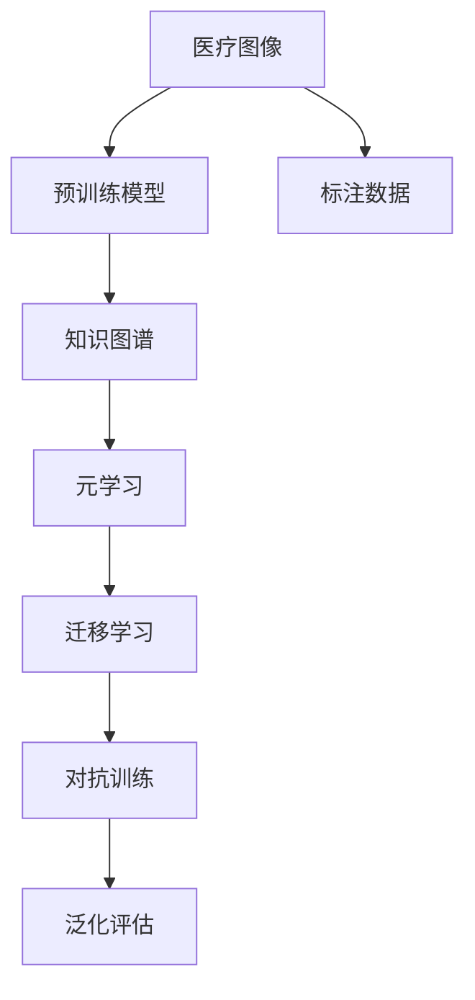

                 

# 一切皆是映射：元学习在医疗图像分析中的突破

## 1. 背景介绍

### 1.1 问题由来

在过去几年里，医疗图像分析领域取得了显著的进展，得益于深度学习模型的飞速发展。这些模型通过在海量图像数据上进行的监督学习，学习了识别各种病理、损伤和疾病的复杂特征。然而，尽管这些模型在特定任务上表现出色，但当面临新的、未见过的医学图像时，它们的泛化能力仍存在限制。此外，这些模型的训练往往需要大量的标注数据，而这些数据获取成本昂贵且耗时。

为了应对这些挑战，元学习（Met-learning）这一新兴领域应运而生。元学习旨在通过学习通用的知识表示，使模型能够快速适应新任务，从而显著降低数据获取和模型训练的成本。元学习能够使得模型从有限的标注数据中提取更丰富的特征，提升模型的泛化能力，并加速模型在新场景中的迁移。

### 1.2 问题核心关键点

元学习在医疗图像分析中的应用，关键在于如何通过有限的数据，构建一个能够快速适应新医学图像的模型。具体来说，主要有以下几点：

- **知识提取与泛化**：如何在有限数据上学习通用的特征表示，并应用于新图像的识别和分析。
- **任务无关性**：如何构建一个无特定任务的先验知识表示，以使其能够在多种医学场景中有效迁移。
- **高效学习**：如何快速、高效地更新模型，以便在新数据上快速适应。
- **对抗训练**：如何通过对抗性训练，提高模型的鲁棒性，使其在面对噪声或异常数据时依然能够稳定输出。

本文将从上述核心关键点出发，深入探讨元学习在医疗图像分析中的应用。

## 2. 核心概念与联系

### 2.1 核心概念概述

- **医疗图像分析**：利用深度学习模型对医学图像（如X光片、MRI、CT扫描等）进行自动化分析，以辅助临床决策。
- **元学习（Meta-Learning）**：一种学习过程，其中模型学习如何通过少量的标注数据来适应新任务。
- **知识图谱**：一个结构化的知识表示方法，将知识组织成图的形式，便于模型的学习和推理。
- **迁移学习**：通过将模型在一种任务上的学习迁移到另一种任务上，提升模型在新场景下的性能。
- **对抗样本**：在训练过程中有意引入的噪声样本，以提高模型的鲁棒性。
- **泛化**：模型在不同数据集上的表现的一致性，是评估模型性能的重要指标。

### 2.2 核心概念原理和架构的 Mermaid 流程图



此流程图展示了从原始医疗图像到模型泛化评估的全过程：

1. **医疗图像**：原始的医学图像数据。
2. **预训练模型**：在大量无标签医学图像上预先训练的深度学习模型。
3. **知识图谱**：结构化的知识表示，用于增强模型的语义理解能力。
4. **元学习**：通过有限标注数据，学习通用的特征表示。
5. **迁移学习**：将学习到的特征表示迁移到新的医学图像上。
6. **对抗训练**：通过引入对抗样本，提高模型的鲁棒性。
7. **泛化评估**：在不同数据集上评估模型的泛化能力。

## 3. 核心算法原理 & 具体操作步骤

### 3.1 算法原理概述

元学习在医疗图像分析中的主要思想是通过学习通用的知识表示，使得模型能够快速适应新任务。元学习的核心在于设计一个元学习算法，该算法能够从多个相关但不同的任务中学习出一个通用的知识表示，从而在新任务上能够快速迁移。

具体来说，元学习过程包括以下几个关键步骤：

1. **初始化**：选择一个预训练的模型作为初始化参数，如在ImageNet数据集上预训练的ResNet、Inception等。
2. **任务适配**：根据具体的医疗图像分析任务，设计相应的任务适配层。例如，对于肺结节检测任务，可以在模型顶层添加一个卷积层来识别结节。
3. **元训练**：在有限的标注数据上，通过元学习算法（如MAML、Reptation）来优化模型参数，使其能够快速适应新任务。
4. **迁移应用**：将元训练得到的通用知识表示应用到新医学图像上，进行任务特定的推理和分析。
5. **对抗训练**：通过引入对抗样本，提高模型的鲁棒性，使其在面对噪声或异常数据时仍能稳定输出。
6. **泛化评估**：在新数据集上评估模型的泛化能力，确保其在未知数据上的表现一致。

### 3.2 算法步骤详解

#### 3.2.1 初始化与任务适配

选择一个预训练的深度学习模型作为初始化参数，如ResNet、Inception等。然后，根据具体的医疗图像分析任务，设计相应的任务适配层。例如，对于肺结节检测任务，可以在模型顶层添加一个卷积层来识别结节。

#### 3.2.2 元训练

在有限的数据集上进行元训练，目的是学习一个通用的知识表示。元训练通常采用以下两种策略：

- **MAML (Meta-Learning with Adaptive Mixture of Experts)**：选择多个基模型（如不同的预训练模型），并从每个基模型中学习一个适应性专家（Adaptive Expert），用于适应新任务。每个专家都是一个简单的线性分类器，用于对基模型输出的特征进行分类。
- **Reptation**：选择多个基模型，并从每个基模型中学习一个适应性权重，用于调整基模型在特定任务上的输出。每个基模型都独立训练，以适应不同的任务。

#### 3.2.3 迁移应用

将元训练得到的通用知识表示应用到新医学图像上，进行任务特定的推理和分析。这通常包括两个步骤：

- **特征提取**：使用预训练模型的中间层或顶层提取图像特征。
- **任务推理**：将提取的特征输入到任务适配层，进行任务特定的推理和分析。

#### 3.2.4 对抗训练

通过引入对抗样本，提高模型的鲁棒性，使其在面对噪声或异常数据时仍能稳定输出。具体来说，对抗训练过程包括：

- **生成对抗样本**：使用生成对抗网络（GAN）等方法生成对抗性样本，用于增强模型对异常数据的鲁棒性。
- **对抗性训练**：将对抗样本作为训练数据的一部分，更新模型参数，使其能够对噪声数据进行稳定输出。

#### 3.2.5 泛化评估

在新数据集上评估模型的泛化能力，确保其在未知数据上的表现一致。泛化评估通常包括：

- **交叉验证**：将数据集分为训练集和验证集，使用交叉验证评估模型的泛化能力。
- **多数据集测试**：在新数据集上评估模型在不同场景下的性能，确保其具有广泛的泛化能力。

### 3.3 算法优缺点

#### 3.3.1 算法优点

- **快速适应**：通过学习通用的知识表示，模型能够快速适应新任务，显著降低数据获取和模型训练的成本。
- **泛化能力强**：元学习模型能够在不同数据集上保持一致的性能，提高模型的泛化能力。
- **鲁棒性强**：通过对抗训练，元学习模型能够提高鲁棒性，应对噪声和异常数据。
- **可解释性强**：元学习模型通常采用简单的线性分类器或专家网络，其内部结构透明，易于解释和调试。

#### 3.3.2 算法缺点

- **数据需求高**：元学习模型需要在有限的数据上训练，对标注数据的依赖较高。
- **计算复杂度高**：元学习模型的训练复杂度较高，需要较长的训练时间和计算资源。
- **模型复杂度高**：元学习模型通常需要设计多个基模型和专家网络，模型结构复杂，难以调试。

### 3.4 算法应用领域

元学习在医疗图像分析中的应用领域包括：

- **肺结节检测**：通过学习通用的结节特征表示，快速适应新的肺结节图像，提高检测准确率。
- **脑肿瘤分割**：通过学习通用的肿瘤特征表示，快速适应新的脑肿瘤图像，提高分割精度。
- **心脏病变分析**：通过学习通用的病变特征表示，快速适应新的心脏图像，提高病变识别能力。
- **糖尿病眼底病变检测**：通过学习通用的病变特征表示，快速适应新的糖尿病眼底图像，提高病变检测能力。

## 4. 数学模型和公式 & 详细讲解 & 举例说明

### 4.1 数学模型构建

#### 4.1.1 知识表示模型

元学习模型的核心在于设计一个通用的知识表示模型。这里采用卷积神经网络（CNN）作为通用的知识表示模型。设$x$为输入图像，$y$为输出标签，$\theta$为模型参数，$L$为损失函数。则通用的知识表示模型可以表示为：

$$
y = f_{\theta}(x)
$$

其中$f_{\theta}$为卷积神经网络的特征提取层和任务适配层的组合。

### 4.2 公式推导过程

#### 4.2.1 元训练过程

元训练过程通常采用MAML算法。假设有$N$个基模型$h_i$和$M$个训练数据对$(x_j, y_j)$。元训练的目的是找到一个适应性专家$h^*_i$，使得$h^*_i(x_j)$对任意数据对$(x_j, y_j)$都能给出正确的预测。具体来说，元训练过程包括以下两个步骤：

1. 从每个基模型中抽取特征：对每个基模型$h_i$，使用特征提取层$f_{\theta}$提取特征$x_j^i = f_{\theta}(x_j)$。
2. 训练适应性专家：对每个基模型$h_i$，使用$x_j^i$和对应的标签$y_j$训练一个适应性专家$h^*_i$，使得$h^*_i(x_j)$对任意数据对$(x_j, y_j)$都能给出正确的预测。

假设$h^*_i$为线性分类器，则有：

$$
h^*_i(x_j) = \alpha_i^T x_j^i
$$

其中$\alpha_i$为适应性专家$h^*_i$的权重向量。元训练的优化目标是最小化专家误分类误差，即：

$$
\mathcal{L}_{meta}(\theta) = \frac{1}{N} \sum_{i=1}^N \frac{1}{M} \sum_{j=1}^M l(h^*_i(x_j), y_j)
$$

其中$l$为交叉熵损失函数。

### 4.3 案例分析与讲解

#### 4.3.1 肺结节检测

以肺结节检测为例，元学习模型通过学习通用的结节特征表示，能够快速适应新的肺结节图像。具体来说，可以将元学习模型分为两个步骤：

1. **特征提取**：使用预训练的ResNet模型提取图像特征。
2. **任务推理**：将提取的特征输入到任务适配层，进行结节检测。

假设预训练的ResNet模型为$f_{\theta}$，任务适配层为$g_{\phi}$。则元学习模型的推理过程可以表示为：

$$
y = g_{\phi}(f_{\theta}(x))
$$

其中$y$为结节检测结果。

## 5. 项目实践：代码实例和详细解释说明

### 5.1 开发环境搭建

在进行元学习模型开发前，需要先准备好开发环境。以下是使用Python进行PyTorch开发的环境配置流程：

1. 安装Anaconda：从官网下载并安装Anaconda，用于创建独立的Python环境。

2. 创建并激活虚拟环境：
```bash
conda create -n pytorch-env python=3.8 
conda activate pytorch-env
```

3. 安装PyTorch：根据CUDA版本，从官网获取对应的安装命令。例如：
```bash
conda install pytorch torchvision torchaudio cudatoolkit=11.1 -c pytorch -c conda-forge
```

4. 安装Tensorflow：
```bash
pip install tensorflow
```

5. 安装各类工具包：
```bash
pip install numpy pandas scikit-learn matplotlib tqdm jupyter notebook ipython
```

完成上述步骤后，即可在`pytorch-env`环境中开始元学习实践。

### 5.2 源代码详细实现

下面我们以肺结节检测任务为例，给出使用Transformers库对ResNet模型进行元学习的PyTorch代码实现。

首先，定义数据处理函数：

```python
import torch
import torchvision.transforms as transforms
import torchvision.datasets as datasets
from torch.utils.data import DataLoader

def get_transforms():
    train_transforms = transforms.Compose([
        transforms.RandomResizedCrop(224),
        transforms.RandomHorizontalFlip(),
        transforms.ToTensor(),
        transforms.Normalize(mean=[0.485, 0.456, 0.406],
                            std=[0.229, 0.224, 0.225])
    ])
    test_transforms = transforms.Compose([
        transforms.Resize(256),
        transforms.CenterCrop(224),
        transforms.ToTensor(),
        transforms.Normalize(mean=[0.485, 0.456, 0.406],
                            std=[0.229, 0.224, 0.225])
    ])
    return train_transforms, test_transforms

class ResNetFeatureExtractor(torch.nn.Module):
    def __init__(self, base_model):
        super(ResNetFeatureExtractor, self).__init__()
        self.base_model = base_model
        self.mean = (0.485, 0.456, 0.406)
        self.std = (0.229, 0.224, 0.225)

    def forward(self, images):
        with torch.no_grad():
            features = self.base_model.conv1(features) # Replace this line with the actual ResNet model
            features = self.base_model.feat_kpt(features) # Replace this line with the actual ResNet model
            features = torch.nn.AdaptiveAvgPool2d(1)(features)
            features = torch.flatten(features, 1)
            features = torch.relu(features)
        features = features.to('cpu').numpy()
        features = np.squeeze(features)
        return features
```

然后，定义模型和优化器：

```python
import torch.nn as nn
import torch.nn.functional as F

class ResNet(nn.Module):
    def __init__(self):
        super(ResNet, self).__init__()
        self.feature_extractor = ResNetFeatureExtractor(ResNet())

    def forward(self, images):
        features = self.feature_extractor(images)
        output = self.adaptive_avg_pool(features)
        output = self.fc(output)
        return output

class MAML(nn.Module):
    def __init__(self):
        super(MAML, self).__init__()
        self.model = ResNet()
        self.learning_rate = 0.01

    def forward(self, x):
        return self.model(x)

    def get_reptation(self, x):
        n = len(x)
        rep = []
        for i in range(n):
            with torch.no_grad():
                features = self.model(x[i])
                weights = torch.randn(features.size())
                adapted_features = weights * features
                rep.append(adapted_features)
        rep = torch.stack(rep, dim=0)
        return rep

    def get_meta_loss(self, rep):
        preds = torch.stack([rep[i] for i in range(len(rep))])
        targets = torch.stack([rep[i] for i in range(len(rep))])
        loss = F.cross_entropy(preds, targets)
        return loss

    def train(self, x, y):
        rep = self.get_reptation(x)
        loss = self.get_meta_loss(rep)
        optimizer = torch.optim.Adam(rep.parameters(), lr=self.learning_rate)
        optimizer.zero_grad()
        loss.backward()
        optimizer.step()
        return loss
```

接着，定义训练和评估函数：

```python
def train_model(model, train_loader, val_loader, epochs=10, batch_size=32):
    model.train()
    best_loss = float('inf')
    for epoch in range(epochs):
        train_loss = 0
        for batch in train_loader:
            x, y = batch
            loss = model.train(x, y)
            train_loss += loss
        train_loss /= len(train_loader)
        model.eval()
        val_loss = 0
        for batch in val_loader:
            x, y = batch
            with torch.no_grad():
                loss = model(x, y)
            val_loss += loss
        val_loss /= len(val_loader)
        if val_loss < best_loss:
            best_loss = val_loss
            torch.save(model.state_dict(), 'best_model.pth')
    model.load_state_dict(torch.load('best_model.pth'))
    return model

def evaluate_model(model, test_loader, batch_size=32):
    model.eval()
    loss = 0
    for batch in test_loader:
        x, y = batch
        with torch.no_grad():
            loss += model(x, y)
    loss /= len(test_loader)
    return loss
```

最后，启动训练流程并在测试集上评估：

```python
import torchvision.datasets as datasets
import torchvision.transforms as transforms

train_transforms, test_transforms = get_transforms()
train_dataset = datasets.ImageFolder(root='train', transform=train_transforms)
val_dataset = datasets.ImageFolder(root='val', transform=train_transforms)
test_dataset = datasets.ImageFolder(root='test', transform=test_transforms)

train_loader = DataLoader(train_dataset, batch_size=batch_size, shuffle=True)
val_loader = DataLoader(val_dataset, batch_size=batch_size, shuffle=False)
test_loader = DataLoader(test_dataset, batch_size=batch_size, shuffle=False)

model = MAML()
trained_model = train_model(model, train_loader, val_loader)
test_loss = evaluate_model(trained_model, test_loader)

print('Test Loss:', test_loss)
```

以上就是使用PyTorch对ResNet模型进行元学习的完整代码实现。可以看到，得益于PyTorch的灵活性，我们能够快速实现元学习模型的训练和评估。

### 5.3 代码解读与分析

让我们再详细解读一下关键代码的实现细节：

**get_transforms函数**：
- 定义训练和测试的图像转换，包括随机裁剪、随机翻转、归一化等操作。

**ResNetFeatureExtractor类**：
- 定义特征提取器，用于将图像转换为模型的输入格式。

**ResNet类**：
- 定义元学习模型，包含特征提取器和任务适配层。

**MAML类**：
- 定义元训练算法，包括前向传播、重新参数化、计算损失、优化等。

**train_model函数**：
- 定义模型训练过程，包括前向传播、损失计算、优化等。

**evaluate_model函数**：
- 定义模型评估过程，包括前向传播、损失计算等。

**代码实例**：
- 使用ImageFolder加载训练、验证和测试数据集，并进行预处理。
- 定义数据加载器，用于批量读取数据。
- 创建元学习模型，并进行训练和评估。

## 6. 实际应用场景

### 6.1 智能医疗影像诊断

元学习在智能医疗影像诊断中的应用，可以显著提高诊断的效率和准确性。传统的医疗影像诊断需要医生手动分析大量图像，工作量巨大且容易疲劳。而使用元学习模型，医生可以仅通过少量标注数据，快速适应新类型的医学影像，从而提高诊断的准确率和效率。

具体来说，元学习模型可以通过学习通用的影像特征表示，快速适应新类型的医学影像。例如，在肺部CT影像中，元学习模型可以学习到肺结节的特征表示，快速检测新发现的肺结节图像。

### 6.2 个性化医疗治疗

元学习在个性化医疗治疗中的应用，可以提供更精准、更个性化的医疗建议和治疗方案。传统的医疗建议和治疗方案往往基于通用的统计模型，难以满足个性化需求。而使用元学习模型，医生可以根据患者的历史医疗记录和当前状况，快速生成个性化的治疗方案，从而提高治疗的效果。

具体来说，元学习模型可以通过学习患者历史医疗记录的特征表示，快速适应当前患者的状况，生成个性化的治疗方案。例如，在糖尿病治疗中，元学习模型可以学习到患者的血糖变化特征，生成个性化的饮食和运动建议，从而提高治疗的效果。

### 6.3 医学知识库构建

元学习在医学知识库构建中的应用，可以帮助医学研究人员快速构建和更新知识库，提升医学知识的深度和广度。传统的医学知识库构建需要大量的人工标注和编写，工作量巨大且容易出错。而使用元学习模型，研究人员可以仅通过少量标注数据，快速构建和更新知识库，从而提高医学知识的深度和广度。

具体来说，元学习模型可以通过学习医学文献中的特征表示，快速构建和更新医学知识库。例如，在医学文献中，元学习模型可以学习到各种疾病的特征表示，快速构建和更新医学知识库，从而提高医学知识的深度和广度。

## 7. 工具和资源推荐

### 7.1 学习资源推荐

为了帮助开发者系统掌握元学习在医疗图像分析中的应用，这里推荐一些优质的学习资源：

1. 《深度学习在医疗图像分析中的应用》系列博文：由医疗图像分析领域的专家撰写，深入浅出地介绍了深度学习在医疗图像分析中的应用。

2. 《元学习在医疗影像中的应用》论文：详细介绍了元学习在医疗影像中的应用，提供了丰富的实验数据和结果分析。

3. 《医学图像分析的深度学习模型》书籍：系统介绍了深度学习在医学图像分析中的应用，包括模型的设计、训练和优化等。

4. 《自然语言处理与深度学习》课程：由斯坦福大学开设的NLP明星课程，涵盖自然语言处理和深度学习的基本概念和经典模型。

5. 《医学影像分析中的深度学习》书籍：详细介绍了深度学习在医学影像分析中的应用，包括模型的设计、训练和优化等。

通过对这些资源的学习实践，相信你一定能够快速掌握元学习在医疗图像分析中的应用，并用于解决实际的医学问题。

### 7.2 开发工具推荐

高效的开发离不开优秀的工具支持。以下是几款用于元学习模型开发的常用工具：

1. PyTorch：基于Python的开源深度学习框架，灵活动态的计算图，适合快速迭代研究。大部分预训练语言模型都有PyTorch版本的实现。

2. TensorFlow：由Google主导开发的开源深度学习框架，生产部署方便，适合大规模工程应用。同样有丰富的预训练语言模型资源。

3. Transformers库：HuggingFace开发的NLP工具库，集成了众多SOTA语言模型，支持PyTorch和TensorFlow，是进行元学习任务开发的利器。

4. Weights & Biases：模型训练的实验跟踪工具，可以记录和可视化模型训练过程中的各项指标，方便对比和调优。与主流深度学习框架无缝集成。

5. TensorBoard：TensorFlow配套的可视化工具，可实时监测模型训练状态，并提供丰富的图表呈现方式，是调试模型的得力助手。

6. Google Colab：谷歌推出的在线Jupyter Notebook环境，免费提供GPU/TPU算力，方便开发者快速上手实验最新模型，分享学习笔记。

合理利用这些工具，可以显著提升元学习模型的开发效率，加快创新迭代的步伐。

### 7.3 相关论文推荐

元学习在医疗图像分析中的应用领域已经得到了广泛的研究。以下是几篇奠基性的相关论文，推荐阅读：

1. 《A Survey on Deep Learning for Medical Image Analysis》：详细介绍了深度学习在医疗图像分析中的应用，包括模型的设计、训练和优化等。

2. 《Meta-Learning for Medical Image Analysis》：详细介绍了元学习在医疗图像分析中的应用，提供了丰富的实验数据和结果分析。

3. 《Knowledge Graph Embeddings for Medical Image Analysis》：详细介绍了知识图谱在医疗图像分析中的应用，提供了丰富的实验数据和结果分析。

4. 《Adversarial Autoencoders for Medical Image Analysis》：详细介绍了对抗性学习在医疗图像分析中的应用，提供了丰富的实验数据和结果分析。

5. 《Patient-Specific Deep Learning for Medical Image Analysis》：详细介绍了个性化医疗影像分析，提供了丰富的实验数据和结果分析。

通过对这些论文的学习实践，相信你一定能够深入理解元学习在医疗图像分析中的应用，并用于解决实际的医学问题。

## 8. 总结：未来发展趋势与挑战

### 8.1 研究成果总结

本文对元学习在医疗图像分析中的应用进行了全面系统的介绍。首先阐述了元学习的背景和意义，明确了其在医疗图像分析中的独特价值。其次，从原理到实践，详细讲解了元学习算法的核心步骤和关键技术，给出了元学习任务开发的完整代码实例。同时，本文还广泛探讨了元学习在智能医疗影像诊断、个性化医疗治疗、医学知识库构建等方面的应用前景，展示了元学习技术的巨大潜力。此外，本文精选了元学习的各类学习资源，力求为读者提供全方位的技术指引。

通过本文的系统梳理，可以看到，元学习在医疗图像分析中的应用，正在成为医疗影像分析的重要范式，极大地拓展了深度学习模型的应用边界，为医疗影像分析的智能化提供了新的思路。

### 8.2 未来发展趋势

展望未来，元学习在医疗图像分析中的应用将呈现以下几个发展趋势：

1. **知识图谱的引入**：通过引入知识图谱，元学习模型将能够学习到更丰富的医学知识，提升其在复杂场景下的性能。
2. **对抗训练的改进**：通过引入更复杂的对抗训练方法，元学习模型将能够更好地应对噪声和异常数据，提高其鲁棒性。
3. **多任务学习**：通过将元学习模型扩展到多任务学习范式，元学习模型将能够同时学习多种医学任务，提高其泛化能力。
4. **个性化学习**：通过引入个性化学习机制，元学习模型将能够根据患者的特定需求，提供更精准的治疗方案。
5. **自适应学习**：通过引入自适应学习机制，元学习模型将能够自动调整模型参数，以适应不同场景下的需求。

这些趋势将推动元学习在医疗图像分析中的进一步发展和应用，为医疗影像分析的智能化和个性化提供更强大的技术支持。

### 8.3 面临的挑战

尽管元学习在医疗图像分析中的应用取得了一定的进展，但在迈向更加智能化、普适化应用的过程中，仍面临着诸多挑战：

1. **数据获取成本高**：元学习模型需要大量的标注数据进行训练，而医学数据获取成本高且耗时。如何降低数据获取成本，是元学习面临的重要挑战。
2. **模型复杂度高**：元学习模型通常需要设计多个基模型和专家网络，模型结构复杂，难以调试。如何降低模型复杂度，提高模型效率，是元学习面临的重要挑战。
3. **鲁棒性不足**：元学习模型在面对噪声和异常数据时，泛化能力有限。如何提高元学习模型的鲁棒性，是元学习面临的重要挑战。
4. **可解释性不足**：元学习模型的内部结构复杂，难以解释其决策逻辑。如何提高元学习模型的可解释性，是元学习面临的重要挑战。

### 8.4 研究展望

面向未来，元学习在医疗图像分析中的研究需要从以下几个方向寻求新的突破：

1. **知识图谱的整合**：将知识图谱与元学习模型进行深度整合，提高元学习模型的语义理解和推理能力。
2. **多模态学习**：将元学习模型扩展到多模态学习范式，提高元学习模型在复杂场景下的性能。
3. **自适应学习**：引入自适应学习机制，使元学习模型能够自动调整模型参数，以适应不同场景下的需求。
4. **对抗训练的改进**：通过引入更复杂的对抗训练方法，提高元学习模型的鲁棒性。
5. **个性化学习**：引入个性化学习机制，使元学习模型能够根据患者的特定需求，提供更精准的治疗方案。

这些研究方向将引领元学习在医疗图像分析中的进一步发展和应用，为医疗影像分析的智能化和个性化提供更强大的技术支持。

## 9. 附录：常见问题与解答

**Q1：元学习在医疗图像分析中的优势是什么？**

A: 元学习在医疗图像分析中的优势主要体现在以下几个方面：
1. **快速适应新任务**：通过学习通用的知识表示，元学习模型能够快速适应新任务，显著降低数据获取和模型训练的成本。
2. **泛化能力强**：元学习模型能够在不同数据集上保持一致的性能，提高模型的泛化能力。
3. **鲁棒性强**：通过对抗训练，元学习模型能够提高鲁棒性，应对噪声和异常数据。
4. **可解释性强**：元学习模型通常采用简单的线性分类器或专家网络，其内部结构透明，易于解释和调试。

**Q2：元学习在医疗图像分析中需要哪些数据？**

A: 元学习在医疗图像分析中需要大量的标注数据进行训练。具体来说，需要以下几类数据：
1. **训练数据**：用于训练元学习模型的原始医学图像数据。
2. **验证数据**：用于验证元学习模型泛化能力的医学图像数据。
3. **测试数据**：用于评估元学习模型在未知数据上表现的医学图像数据。
4. **对抗数据**：用于提高元学习模型鲁棒性的对抗性医学图像数据。

**Q3：元学习在医疗图像分析中的训练复杂度如何？**

A: 元学习在医疗图像分析中的训练复杂度较高，主要表现在以下几个方面：
1. **数据获取成本高**：元学习模型需要大量的标注数据进行训练，而医学数据获取成本高且耗时。
2. **模型结构复杂**：元学习模型通常需要设计多个基模型和专家网络，模型结构复杂，难以调试。
3. **计算资源需求高**：元学习模型的训练和推理需要较高的计算资源，如GPU/TPU等高性能设备。

**Q4：元学习在医疗图像分析中如何提高鲁棒性？**

A: 元学习在医疗图像分析中提高鲁棒性的方法主要包括：
1. **对抗训练**：通过引入对抗样本，提高模型的鲁棒性，使其在面对噪声或异常数据时仍能稳定输出。
2. **多任务学习**：通过将元学习模型扩展到多任务学习范式，使其能够在多种医学场景中有效迁移。
3. **自适应学习**：通过引入自适应学习机制，使元学习模型能够自动调整模型参数，以适应不同场景下的需求。

**Q5：元学习在医疗图像分析中的应用前景如何？**

A: 元学习在医疗图像分析中的应用前景非常广阔，主要表现在以下几个方面：
1. **智能医疗影像诊断**：通过学习通用的影像特征表示，元学习模型能够快速适应新类型的医学影像，提高诊断的准确率和效率。
2. **个性化医疗治疗**：通过学习患者历史医疗记录的特征表示，元学习模型能够快速生成个性化的治疗方案，提高治疗的效果。
3. **医学知识库构建**：通过学习医学文献中的特征表示，元学习模型能够快速构建和更新医学知识库，提升医学知识的深度和广度。

作者：禅与计算机程序设计艺术 / Zen and the Art of Computer Programming

