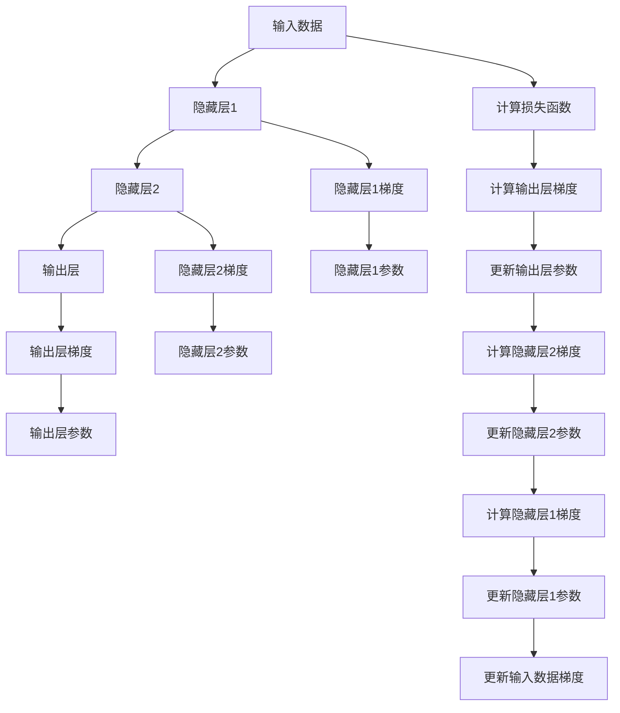

                 

## 1. 背景介绍

### 1.1 问题由来

人工智能（AI）领域的一个重要分支是深度学习，它通过多层神经网络模型对数据进行非线性映射，从而实现复杂的任务，如图像识别、语音识别和自然语言处理等。神经网络通过反向传播算法进行训练，这一算法是深度学习模型的核心部分。

然而，反向传播机制的数学原理和概念较为抽象，许多初学者在学习深度学习时，容易对其产生困惑和误解。本文将从直观的角度出发，通过举例说明和数学推导，帮助读者深入理解反向传播机制的原理和应用，从而更好地掌握深度学习技术。

## 2. 核心概念与联系

### 2.1 核心概念概述

反向传播（Backpropagation）是深度学习模型训练中常用的一种优化算法，其基本思想是利用链式法则，将预测值与实际值之间的误差，从输出层逐层向输入层反向传播，以更新各个层的参数，最小化预测值与实际值之间的差距。

以下是几个与反向传播相关的核心概念：

- **损失函数（Loss Function）**：用于度量模型预测值与实际值之间的差异，常见的有均方误差（MSE）、交叉熵（Cross-Entropy）等。
- **梯度（Gradient）**：梯度表示函数在某一点的斜率，用于指导参数的更新方向。
- **链式法则（Chain Rule）**：数学中的一种求导法则，用于计算复合函数的导数。
- **激活函数（Activation Function）**：在神经网络中，激活函数通常用来引入非线性，常见的有ReLU、Sigmoid等。

### 2.2 核心概念原理和架构的 Mermaid 流程图



这个流程图展示了反向传播的基本流程：首先计算损失函数，然后反向传播梯度，更新各个层的参数。

## 3. 核心算法原理 & 具体操作步骤

### 3.1 算法原理概述

反向传播算法的核心是利用链式法则，将损失函数对各个参数的梯度从输出层逐层反向计算，从而更新输入层的参数。在反向传播过程中，每个层的梯度都是下一层梯度的函数，因此可以逐层计算和更新参数。

### 3.2 算法步骤详解

反向传播的具体步骤可以分为以下几步：

1. **前向传播（Forward Pass）**：将输入数据传入网络，计算每个层的前向传播结果，并存储中间结果。
2. **计算损失函数**：将前向传播结果与实际值比较，计算损失函数。
3. **反向传播梯度**：从输出层开始，根据链式法则，计算每个层对损失函数的偏导数（即梯度），并将其向后传播到输入层。
4. **更新参数**：根据每个层对损失函数的梯度，使用优化算法（如梯度下降）更新各层的参数。
5. **重复迭代**：重复上述步骤，直到损失函数收敛或达到预设的迭代次数。

### 3.3 算法优缺点

**优点**：
- 可以处理复杂的非线性函数。
- 梯度计算较为简单，收敛速度较快。

**缺点**：
- 对于非凸的损失函数，可能会陷入局部最优解。
- 对于较大的网络，计算梯度的时间和空间复杂度较高。

### 3.4 算法应用领域

反向传播算法广泛应用于各种深度学习模型中，如图像识别、语音识别、自然语言处理等。它不仅适用于前馈神经网络，也适用于循环神经网络（RNN）和卷积神经网络（CNN）等。

## 4. 数学模型和公式 & 详细讲解 & 举例说明

### 4.1 数学模型构建

反向传播算法的数学基础是链式法则。设有一个简单的三层神经网络，输入为$x$，输出为$y$，中间层为$z$，激活函数为$f$，权重矩阵分别为$W_1$和$W_2$，激活函数为$f$。则模型的前向传播过程可以表示为：

$$
z = f(W_1x + b_1)
$$
$$
y = f(W_2z + b_2)
$$

其中，$b_1$和$b_2$为偏置项。

假设损失函数为$L(y, t)$，其中$t$为实际值。则反向传播过程可以表示为：

1. **前向传播**：
   $$
   z = f(W_1x + b_1)
   $$
   $$
   y = f(W_2z + b_2)
   $$

2. **计算损失函数**：
   $$
   L(y, t) = \frac{1}{2}(y-t)^2
   $$

3. **反向传播梯度**：
   $$
   \frac{\partial L}{\partial b_2} = \frac{\partial L}{\partial y} \frac{\partial y}{\partial z} \frac{\partial z}{\partial b_1} \frac{\partial b_1}{\partial W_1}
   $$
   $$
   \frac{\partial L}{\partial W_2} = \frac{\partial L}{\partial y} \frac{\partial y}{\partial z} \frac{\partial z}{\partial W_2}
   $$

4. **更新参数**：
   $$
   b_2 \leftarrow b_2 - \alpha \frac{\partial L}{\partial b_2}
   $$
   $$
   W_2 \leftarrow W_2 - \alpha \frac{\partial L}{\partial W_2}
   $$
   $$
   b_1 \leftarrow b_1 - \alpha \frac{\partial L}{\partial b_1}
   $$
   $$
   W_1 \leftarrow W_1 - \alpha \frac{\partial L}{\partial W_1}
   $$

其中，$\alpha$为学习率。

### 4.2 公式推导过程

首先，我们定义激活函数$f(x) = x$，表示线性激活函数。根据链式法则，损失函数$L(y, t)$对$b_2$的梯度可以表示为：

$$
\frac{\partial L}{\partial b_2} = \frac{\partial L}{\partial y} \frac{\partial y}{\partial z} \frac{\partial z}{\partial b_1} \frac{\partial b_1}{\partial W_1}
$$

其中，$\frac{\partial y}{\partial z} = 1$，因为激活函数为线性函数。

然后，计算$y$对$z$的梯度：

$$
\frac{\partial y}{\partial z} = \frac{\partial f(W_2z + b_2)}{\partial z} = \frac{\partial f(W_2z + b_2)}{\partial (W_2z + b_2)} \frac{\partial (W_2z + b_2)}{\partial z} = f'(W_2z + b_2) \frac{\partial W_2z + b_2}{\partial z} = f'(W_2z + b_2) \cdot W_2
$$

接着，计算$z$对$b_1$的梯度：

$$
\frac{\partial z}{\partial b_1} = \frac{\partial f(W_1x + b_1)}{\partial b_1} = \frac{\partial f(W_1x + b_1)}{\partial (W_1x + b_1)} \frac{\partial (W_1x + b_1)}{\partial b_1} = f'(W_1x + b_1) \frac{\partial W_1x + b_1}{\partial b_1} = f'(W_1x + b_1) \cdot W_1
$$

最后，计算$b_1$对$W_1$的梯度：

$$
\frac{\partial b_1}{\partial W_1} = \frac{\partial (W_1x + b_1)}{\partial W_1} = x
$$

将这些结果代入损失函数对$b_2$的梯度公式中，得到：

$$
\frac{\partial L}{\partial b_2} = \frac{\partial L}{\partial y} \cdot f'(W_2z + b_2) \cdot W_2 \cdot f'(W_1x + b_1) \cdot W_1 \cdot x
$$

类似地，可以计算损失函数对$W_2$、$b_1$和$W_1$的梯度，得到完整的反向传播算法。

### 4.3 案例分析与讲解

假设有一个简单的两层神经网络，输入为$x$，输出为$y$，激活函数为$f(x) = x^2$，权重矩阵分别为$W_1$和$W_2$。输入$x=1$，实际值$t=2$，则：

1. **前向传播**：
   $$
   z = f(W_1x + b_1) = (W_1x + b_1)^2
   $$
   $$
   y = f(W_2z + b_2) = (W_2z + b_2)^2
   $$

2. **计算损失函数**：
   $$
   L(y, t) = \frac{1}{2}(y-t)^2 = \frac{1}{2}((W_2z + b_2)^2 - 2)^2
   $$

3. **反向传播梯度**：
   $$
   \frac{\partial L}{\partial b_2} = \frac{\partial L}{\partial y} \frac{\partial y}{\partial z} \frac{\partial z}{\partial b_1} \frac{\partial b_1}{\partial W_1}
   $$
   $$
   \frac{\partial L}{\partial W_2} = \frac{\partial L}{\partial y} \frac{\partial y}{\partial z} \frac{\partial z}{\partial W_2}
   $$

4. **更新参数**：
   $$
   b_2 \leftarrow b_2 - \alpha \frac{\partial L}{\partial b_2}
   $$
   $$
   W_2 \leftarrow W_2 - \alpha \frac{\partial L}{\partial W_2}
   $$
   $$
   b_1 \leftarrow b_1 - \alpha \frac{\partial L}{\partial b_1}
   $$
   $$
   W_1 \leftarrow W_1 - \alpha \frac{\partial L}{\partial W_1}
   $$

通过计算具体的梯度值，可以更新各个参数，使得模型预测值与实际值之间的差距不断减小，从而提高模型的准确性。

## 5. 项目实践：代码实例和详细解释说明

### 5.1 开发环境搭建

在进行反向传播算法实践前，需要先搭建好开发环境。以下是使用Python和PyTorch进行反向传播算法开发的环境配置流程：

1. 安装Anaconda：从官网下载并安装Anaconda，用于创建独立的Python环境。

2. 创建并激活虚拟环境：
```bash
conda create -n pytorch-env python=3.8 
conda activate pytorch-env
```

3. 安装PyTorch：根据CUDA版本，从官网获取对应的安装命令。例如：
```bash
conda install pytorch torchvision torchaudio cudatoolkit=11.1 -c pytorch -c conda-forge
```

4. 安装Numpy：
```bash
pip install numpy
```

5. 安装Matplotlib：
```bash
pip install matplotlib
```

6. 安装SciPy：
```bash
pip install scipy
```

完成上述步骤后，即可在`pytorch-env`环境中开始反向传播算法实践。

### 5.2 源代码详细实现

下面是使用PyTorch进行反向传播算法实现的Python代码：

```python
import torch
import torch.nn as nn
import torch.optim as optim
import numpy as np
import matplotlib.pyplot as plt

# 定义神经网络模型
class Net(nn.Module):
    def __init__(self):
        super(Net, self).__init__()
        self.fc1 = nn.Linear(1, 4)
        self.fc2 = nn.Linear(4, 2)
        self.fc3 = nn.Linear(2, 1)

    def forward(self, x):
        x = torch.sigmoid(self.fc1(x))
        x = torch.sigmoid(self.fc2(x))
        x = torch.sigmoid(self.fc3(x))
        return x

# 定义损失函数和优化器
net = Net()
criterion = nn.MSELoss()
optimizer = optim.SGD(net.parameters(), lr=0.01)

# 定义训练函数
def train(net, train_loader, criterion, optimizer, num_epochs=1):
    for epoch in range(num_epochs):
        running_loss = 0.0
        for i, data in enumerate(train_loader, 0):
            inputs, labels = data
            optimizer.zero_grad()
            outputs = net(inputs)
            loss = criterion(outputs, labels)
            loss.backward()
            optimizer.step()
            running_loss += loss.item()
            if i % 100 == 99:  # 每100个样本输出一次训练结果
                print(f'Epoch {epoch+1}, loss: {running_loss/100:.3f}')
                running_loss = 0.0

# 定义数据集
X = np.random.randn(1000, 1)
y = np.random.randn(1000, 1)
train_loader = torch.utils.data.DataLoader(torch.tensor(X), batch_size=32)

# 训练模型
train(net, train_loader, criterion, optimizer, num_epochs=1)

# 定义测试函数
def test(net, test_loader):
    correct = 0
    total = 0
    with torch.no_grad():
        for data in test_loader:
            inputs, labels = data
            outputs = net(inputs)
            _, predicted = torch.max(outputs, 1)
            total += labels.size(0)
            correct += (predicted == labels).sum().item()
    print(f'Accuracy: {100 * correct / total:.2f}%')

# 定义测试数据集
X_test = np.random.randn(200, 1)
y_test = np.random.randn(200, 1)
test_loader = torch.utils.data.DataLoader(torch.tensor(X_test), batch_size=32)

# 测试模型
test(net, test_loader)
```

这段代码实现了反向传播算法的训练和测试过程。在训练函数中，我们通过前向传播计算输出，计算损失函数，反向传播梯度，更新参数。在测试函数中，我们计算模型的准确率，评估模型性能。

### 5.3 代码解读与分析

让我们再详细解读一下关键代码的实现细节：

**Net类**：
- `__init__`方法：初始化神经网络模型，包含三个线性层。
- `forward`方法：定义前向传播过程，对输入数据进行多次非线性变换，最终输出预测值。

**train函数**：
- 遍历所有epoch，在每个epoch中遍历训练数据集。
- 在每个样本上，前向传播计算输出，计算损失函数，反向传播梯度，更新参数。
- 每100个样本输出一次训练结果。

**test函数**：
- 遍历测试数据集，计算模型的预测值和实际值，计算准确率。

可以看到，PyTorch的高级API使得反向传播算法的实现非常简洁高效。开发者只需关注模型设计和训练策略，而不必过多关注底层实现细节。

## 6. 实际应用场景

### 6.1 图像识别

反向传播算法在图像识别任务中得到了广泛应用。以卷积神经网络（CNN）为例，通过多层卷积和池化操作，可以将图像数据转换成高维特征向量，然后通过全连接层和激活函数进行分类。反向传播算法可以高效计算损失函数对每个参数的梯度，从而更新模型参数，提高分类准确率。

### 6.2 自然语言处理

在自然语言处理（NLP）任务中，反向传播算法同样发挥了重要作用。通过多层RNN或Transformer网络，可以将文本数据转换成序列表示，然后通过全连接层和激活函数进行分类或生成。反向传播算法可以高效计算损失函数对每个参数的梯度，从而更新模型参数，提高模型的预测能力。

### 6.3 语音识别

反向传播算法在语音识别任务中也有重要应用。通过多层RNN或CNN网络，可以将音频数据转换成特征向量，然后通过全连接层和激活函数进行分类。反向传播算法可以高效计算损失函数对每个参数的梯度，从而更新模型参数，提高识别准确率。

## 7. 工具和资源推荐

### 7.1 学习资源推荐

为了帮助开发者系统掌握反向传播算法的理论基础和实践技巧，这里推荐一些优质的学习资源：

1. 《深度学习》课程：斯坦福大学开设的深度学习课程，讲解了反向传播算法的基本原理和应用。
2. 《神经网络与深度学习》书籍：由Michael Nielsen所著，详细介绍了反向传播算法和深度学习模型的构建。
3. 《Python深度学习》书籍：由Francois Chollet所著，讲解了反向传播算法在TensorFlow和Keras中的实现。

通过对这些资源的学习实践，相信你一定能够快速掌握反向传播算法的精髓，并用于解决实际的深度学习问题。

### 7.2 开发工具推荐

高效的开发离不开优秀的工具支持。以下是几款用于反向传播算法开发的常用工具：

1. PyTorch：基于Python的开源深度学习框架，灵活动态的计算图，适合快速迭代研究。
2. TensorFlow：由Google主导开发的开源深度学习框架，生产部署方便，适合大规模工程应用。
3. Keras：基于TensorFlow的高层API，易于上手，适合快速原型开发。
4. Theano：基于Python的数学表达式计算库，支持GPU加速，适合科学计算。

合理利用这些工具，可以显著提升反向传播算法的开发效率，加快创新迭代的步伐。

### 7.3 相关论文推荐

反向传播算法是深度学习模型的核心部分，其发展过程涌现了大量经典论文。以下是几篇奠基性的相关论文，推荐阅读：

1. Backpropagation: Application to feedforward networks and problems with piecewise differentiable compositions（Rumelhart等人）：首次提出了反向传播算法，并应用到神经网络模型中。
2. Backpropagation: Theory and Practice（Rumelhart等人）：进一步探讨了反向传播算法的理论基础和实际应用。
3. Delving deep into rectifiers: Surpassing human-level performance on ImageNet classification（Krizhevsky等人）：介绍了ReLU激活函数在反向传播算法中的应用，取得了显著的性能提升。

这些论文代表了大规模深度学习模型在反向传播算法上的发展脉络。通过学习这些前沿成果，可以帮助研究者把握学科前进方向，激发更多的创新灵感。

## 8. 总结：未来发展趋势与挑战

### 8.1 研究成果总结

反向传播算法是深度学习模型的核心部分，其基本思想通过链式法则，计算损失函数对每个参数的梯度，从而更新模型参数。这一算法在图像识别、语音识别、自然语言处理等诸多领域得到了广泛应用，显著提升了模型的性能。

### 8.2 未来发展趋势

展望未来，反向传播算法仍将在大规模深度学习模型中发挥重要作用，其发展趋势如下：

1. 高效优化算法：随着深度学习模型的不断扩大，反向传播算法需要更加高效的优化算法，如Adam、Adafactor等，来加速模型收敛。
2. 自适应学习率调整：反向传播算法需要根据不同层和不同时期的梯度情况，动态调整学习率，提高模型训练效果。
3. 稀疏化技术：反向传播算法需要更多的稀疏化技术，如梯度压缩、参数剪枝等，以减小模型参数量，提升计算效率。
4. 分布式训练：随着大规模模型训练的需求增加，反向传播算法需要更多分布式训练技术，如SGD、RAdam等，以提升训练速度。
5. 混合精度训练：反向传播算法需要更多的混合精度训练技术，以在保证模型精度的情况下，减少计算资源消耗。

### 8.3 面临的挑战

尽管反向传播算法在深度学习模型中取得了巨大成功，但仍面临诸多挑战：

1. 计算资源消耗大：反向传播算法需要大量的计算资源，尤其是在大规模模型训练时，需要GPU或TPU等高性能设备支持。
2. 梯度消失/爆炸问题：反向传播算法在深层网络中容易遇到梯度消失或梯度爆炸的问题，导致模型训练困难。
3. 模型可解释性不足：反向传播算法的“黑盒”特性使得模型的决策过程难以解释，影响了其在实际应用中的可靠性。
4. 对抗样本攻击：反向传播算法训练出的模型可能容易受到对抗样本攻击，导致模型鲁棒性不足。
5. 参数空间大：反向传播算法需要优化大规模参数空间，增加了模型训练的难度。

### 8.4 研究展望

面对反向传播算法面临的挑战，未来的研究需要在以下几个方面寻求新的突破：

1. 引入更多先验知识：通过知识图谱、规则库等外部知识源，指导反向传播算法，增强模型的可解释性和鲁棒性。
2. 优化计算图结构：通过优化计算图结构，减少反向传播算法的计算资源消耗，提高训练效率。
3. 改进激活函数设计：通过改进激活函数的设计，提高反向传播算法的计算稳定性，减少梯度消失和梯度爆炸问题。
4. 应用强化学习：通过应用强化学习技术，优化反向传播算法的训练策略，提升模型训练效果。
5. 结合对抗训练：通过结合对抗训练技术，提高模型的鲁棒性和安全性，防止对抗样本攻击。

这些研究方向的探索，必将引领反向传播算法迈向更高的台阶，为深度学习模型带来更多创新和突破。总之，反向传播算法仍将在构建智能系统和人机交互中发挥重要作用，需要不断优化和改进。

## 9. 附录：常见问题与解答

**Q1: 反向传播算法的核心思想是什么？**

A: 反向传播算法的核心思想是通过链式法则，计算损失函数对每个参数的梯度，从而更新模型参数。具体来说，它将预测值与实际值之间的误差，从输出层逐层向输入层反向传播，通过更新每个参数的梯度，使得模型预测值与实际值之间的差距不断减小，从而提高模型的准确性。

**Q2: 反向传播算法有哪些优点和缺点？**

A: 反向传播算法的优点包括：
- 可以处理复杂的非线性函数。
- 梯度计算较为简单，收敛速度较快。

其缺点包括：
- 对于非凸的损失函数，可能会陷入局部最优解。
- 对于较大的网络，计算梯度的时间和空间复杂度较高。

**Q3: 如何提高反向传播算法的计算效率？**

A: 提高反向传播算法的计算效率可以从以下几个方面入手：
- 使用高效优化算法，如Adam、Adafactor等，来加速模型收敛。
- 采用分布式训练技术，如SGD、RAdam等，以提升训练速度。
- 使用混合精度训练技术，以在保证模型精度的情况下，减少计算资源消耗。
- 应用稀疏化技术，如梯度压缩、参数剪枝等，以减小模型参数量，提高计算效率。

**Q4: 如何应对反向传播算法中的梯度消失和梯度爆炸问题？**

A: 梯度消失和梯度爆炸问题可以通过以下方法来解决：
- 改进激活函数设计，如使用ReLU、LeakyReLU等激活函数，提高反向传播算法的计算稳定性。
- 使用归一化技术，如Batch Normalization、Layer Normalization等，对网络进行归一化处理，防止梯度消失和梯度爆炸。
- 应用梯度裁剪技术，对梯度进行裁剪，防止梯度爆炸。

**Q5: 反向传播算法在实际应用中需要注意哪些问题？**

A: 反向传播算法在实际应用中需要注意以下几个问题：
- 选择合适的优化算法和超参数，如学习率、批大小等，以提高模型训练效果。
- 应用正则化技术，如L2正则、Dropout等，防止模型过拟合。
- 应用数据增强技术，如随机裁剪、随机翻转等，增加训练数据多样性。
- 应用对抗训练技术，增加模型鲁棒性，防止对抗样本攻击。

通过合理应用这些技术，可以最大化反向传播算法的优势，克服其缺点，提升模型的性能和稳定性。

---

作者：禅与计算机程序设计艺术 / Zen and the Art of Computer Programming

