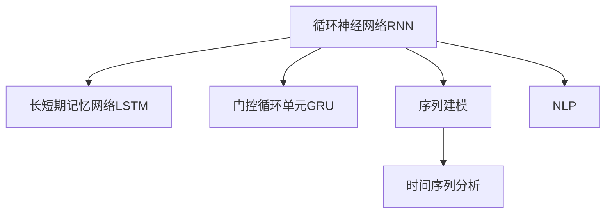

                 

# 一切皆是映射：循环神经网络(RNN)与序列预测

> 关键词：循环神经网络(RNN), 序列预测, 长短期记忆网络(LSTM), 门控循环单元(GRU), 序列建模, 时间序列分析, 自然语言处理(NLP)

## 1. 背景介绍

### 1.1 问题由来
在现代机器学习与数据科学中，序列数据的处理是一个核心挑战。自然语言处理(NLP)、时间序列分析、生物信息学等领域中，经常需要对序列数据进行建模、预测和分析。传统的线性回归、决策树等方法无法处理序列数据的时间依赖性，因此，需要一种能够自然捕捉时间序列特征的模型。

循环神经网络(RNN)正是应运而生的模型，它能够有效处理时间序列数据，在序列预测、语言模型等任务中表现出卓越的性能。本篇文章将深入探讨RNN的工作原理、算法细节以及其在序列预测中的应用，希望能够为读者提供一个全面且详细的技术视角。

## 2. 核心概念与联系

### 2.1 核心概念概述

为更好地理解RNN，本节将介绍几个密切相关的核心概念：

- 循环神经网络(RNN)：一种特殊的神经网络，它能够处理序列数据，通过在时间维度上共享权重，能够捕捉序列中相邻元素之间的关系。
- 长短期记忆网络(LSTM)：一种特殊的RNN，通过引入遗忘门、输入门和输出门，能够更好地处理长序列数据，避免梯度消失或爆炸的问题。
- 门控循环单元(GRU)：一种更加轻量级的LSTM变种，通过结合遗忘门和更新门，能够在保证性能的同时，减少模型复杂度。
- 序列建模：指在处理序列数据时，如何将序列中不同位置的信息进行编码和利用。
- 时间序列分析：一种特定类型的序列建模，关注于时间维度上的变化规律和趋势。
- 自然语言处理(NLP)：将文本数据转化为机器可以理解的格式，并在此基础上进行文本分析、信息检索、自动翻译等任务。

这些核心概念之间的逻辑关系可以通过以下Mermaid流程图来展示：



这个流程图展示了大语言模型的核心概念及其之间的关系：

1. 循环神经网络RNN是所有序列建模的基础。
2. 长短期记忆网络LSTM是RNN的一种改进，能够更好地处理长序列数据。
3. 门控循环单元GRU是LSTM的简化版，在保证性能的同时，减少了计算复杂度。
4. 序列建模是将序列数据转化为机器可理解格式的过程。
5. 时间序列分析专注于时间维度上的变化规律和趋势。
6. 自然语言处理NLP是序列建模在文本数据上的应用。

这些概念共同构成了序列数据处理的框架，使我们能够更好地理解和应用RNN模型。

## 3. 核心算法原理 & 具体操作步骤
### 3.1 算法原理概述

RNN模型通过在时间维度上共享权重，能够捕捉序列中相邻元素之间的关系。具体来说，RNN模型将序列中的每个元素作为输入，输出当前元素和下一时刻的隐藏状态。其基本结构如下图所示：


其中，$x_t$ 表示当前时刻的输入，$h_t$ 表示当前时刻的隐藏状态，$y_t$ 表示当前时刻的输出。$w$ 和$b$ 是模型的参数。

### 3.2 算法步骤详解

RNN模型的训练和预测可以分为以下几个步骤：

**Step 1: 初始化模型参数**
- 随机初始化模型的权重$w$和偏置$b$，例如使用均值为0、标准差为$\sigma$的高斯分布。

**Step 2: 训练数据准备**
- 准备训练集$\{(x_t, h_{t-1}, y_t)\}_{t=1}^T$，其中$x_t$是输入，$h_{t-1}$是前一时刻的隐藏状态，$y_t$是目标输出。

**Step 3: 前向传播**
- 对于每一个时刻$t$，使用当前输入$x_t$和前一时刻的隐藏状态$h_{t-1}$，计算当前时刻的隐藏状态$h_t$和输出$y_t$。具体计算公式如下：
  $$
  h_t = \tanh(\text{W}x_t + \text{U}h_{t-1} + \text{b})
  $$
  $$
  y_t = \text{softmax}(\text{V}h_t + \text{c})
  $$

**Step 4: 计算损失函数**
- 使用交叉熵损失函数计算模型输出$y_t$与真实标签$y_t^*$之间的差距，得到损失函数$\mathcal{L}$：
  $$
  \mathcal{L} = -\frac{1}{T}\sum_{t=1}^T\log y_t^*
  $$

**Step 5: 反向传播和优化**
- 通过反向传播算法，计算每个参数的梯度，使用梯度下降等优化算法更新模型参数，最小化损失函数$\mathcal{L}$。

**Step 6: 预测**
- 使用训练好的模型，对新的输入序列进行前向传播，输出预测结果。

### 3.3 算法优缺点

RNN模型具有以下优点：

1. 能够自然处理序列数据，捕捉相邻元素之间的依赖关系。
2. 结构简单，易于实现和训练。
3. 在序列预测、语言建模等任务中表现出卓越的性能。

但RNN模型也存在一些缺点：

1. 训练时梯度可能消失或爆炸，导致长期依赖信息无法传递。
2. 需要大量数据进行训练，模型复杂度高，计算成本高。
3. 难以并行化，在大规模数据集上训练效率较低。

尽管存在这些局限性，但RNN仍是序列数据建模的重要工具，对于处理时间序列数据、自然语言处理等任务具有广泛的应用前景。

### 3.4 算法应用领域

RNN模型在多个领域中具有广泛的应用：

- 时间序列预测：如股票价格预测、天气预报等，能够捕捉时间序列中的长期依赖关系。
- 语音识别：如自动语音识别(ASR)、语音合成(TTS)，能够捕捉语音信号中的语音单元和语义信息。
- 自然语言处理(NLP)：如文本分类、情感分析、机器翻译等，能够捕捉文本中的语义信息。
- 信号处理：如音频信号处理、图像处理等，能够捕捉信号中的时间依赖关系。

随着RNN技术的不断进步，其在更多领域中得到了应用，为数据驱动的决策和自动化系统提供了重要支持。

## 4. 数学模型和公式 & 详细讲解 & 举例说明

### 4.1 数学模型构建

RNN模型的数学模型可以表示为：

$$
h_t = f(\text{W}x_t + \text{U}h_{t-1} + \text{b})
$$

其中，$f$为激活函数，$x_t$表示当前时刻的输入，$h_t$表示当前时刻的隐藏状态，$w$、$u$和$b$是模型的权重和偏置。

### 4.2 公式推导过程

为了更好地理解RNN模型的推导过程，我们先定义一些基本符号：

- $x_t$：当前时刻的输入，可以是一个标量、向量或矩阵。
- $h_t$：当前时刻的隐藏状态，是一个向量或矩阵。
- $y_t$：当前时刻的输出，可以是一个标量、向量或矩阵。
- $W$、$U$、$V$：模型的权重矩阵，大小为$n\times d$，$n$为隐藏状态的大小，$d$为输入的大小。
- $b$、$c$：模型的偏置向量，大小为$n$。
- $f$：激活函数，常用的有tanh和ReLU。

根据RNN模型的结构，可以得到如下递推公式：

$$
h_t = f(\text{W}x_t + \text{U}h_{t-1} + \text{b})
$$

其中，$\text{W}$和$\text{U}$是模型中的两个权重矩阵，分别用于计算当前输入和上一时刻隐藏状态的影响。$\text{b}$是模型中的偏置向量，用于调整输出。$f$是激活函数，常用的有tanh和ReLU。

通过递推公式，我们可以将时间维度的信息融入到隐藏状态中，从而捕捉序列数据的时间依赖关系。

### 4.3 案例分析与讲解

为了更好地理解RNN模型的应用，我们以股票价格预测为例，分析RNN模型的工作原理。假设我们有一个时间序列数据$X=\{x_1, x_2, \ldots, x_T\}$，其中$x_t$表示第$t$天的股票价格。我们的目标是预测下一天的股票价格$x_{t+1}$。

首先，我们需要将输入数据$x_t$编码为一个向量形式。假设我们使用了LSTM模型，那么可以将当前时刻的股票价格$x_t$和前一时刻的隐藏状态$h_{t-1}$作为LSTM模型的输入，计算得到当前时刻的隐藏状态$h_t$和输出$y_t$。

假设我们选择了ReLU作为激活函数，可以得到如下递推公式：

$$
h_t = \text{ReLU}(\text{W}x_t + \text{U}h_{t-1} + \text{b})
$$

其中，$\text{ReLU}$表示ReLU激活函数，$\text{W}$、$\text{U}$和$\text{b}$是模型的权重和偏置。

通过递推公式，我们可以将时间维度的信息融入到隐藏状态中，从而捕捉序列数据的时间依赖关系。最终，我们可以使用得到的隐藏状态$h_t$作为下一时刻的输入，进行预测。

## 5. 项目实践：代码实例和详细解释说明

### 5.1 开发环境搭建

在进行RNN模型开发前，我们需要准备好开发环境。以下是使用Python进行TensorFlow开发的环境配置流程：

1. 安装Anaconda：从官网下载并安装Anaconda，用于创建独立的Python环境。

2. 创建并激活虚拟环境：
```bash
conda create -n tf-env python=3.8 
conda activate tf-env
```

3. 安装TensorFlow：根据CUDA版本，从官网获取对应的安装命令。例如：
```bash
conda install tensorflow -c tf
```

4. 安装相关库：
```bash
pip install numpy matplotlib pandas scikit-learn jupyter notebook
```

完成上述步骤后，即可在`tf-env`环境中开始RNN模型开发。

### 5.2 源代码详细实现

下面我们以LSTM模型进行股票价格预测为例，给出使用TensorFlow库对LSTM模型进行训练和预测的Python代码实现。

首先，导入必要的库和模块：

```python
import tensorflow as tf
import numpy as np
import matplotlib.pyplot as plt
import pandas as pd
from sklearn.preprocessing import MinMaxScaler
```

然后，定义数据处理函数：

```python
def create_dataset(df, look_back=1):
    dataX, dataY = [], []
    for i in range(len(df)-look_back-1):
        a = df.iloc[i:(i+look_back)].values
        dataX.append(a)
        dataY.append(df.iloc[i + look_back])
    return np.array(dataX), np.array(dataY)
```

接着，读取数据并处理：

```python
# 读取股票价格数据
df = pd.read_csv('stock_prices.csv')

# 将日期转换为时间戳
df['timestamp'] = pd.to_datetime(df['date'], format='%Y-%m-%d').astype(int) / 10**9

# 对数据进行标准化处理
scaler = MinMaxScaler()
scaled_data = scaler.fit_transform(df[['close']].values)

# 将数据拆分为训练集和测试集
train_size = int(len(scaled_data) * 0.7)
test_size = len(scaled_data) - train_size
trainX, trainY = create_dataset(scaled_data[:train_size], look_back=1)
testX, testY = create_dataset(scaled_data[train_size:], look_back=1)

# 对训练数据进行数据增强
trainX = trainX.reshape((trainX.shape[0], 1, trainX.shape[1]))
testX = testX.reshape((testX.shape[0], 1, testX.shape[1]))

# 将数据转换为TensorFlow张量
trainX = tf.convert_to_tensor(trainX)
trainY = tf.convert_to_tensor(trainY)
testX = tf.convert_to_tensor(testX)
testY = tf.convert_to_tensor(testY)
```

然后，定义LSTM模型：

```python
def build_model(input_shape):
    model = tf.keras.Sequential()
    model.add(tf.keras.layers.LSTM(4, return_sequences=True, input_shape=input_shape))
    model.add(tf.keras.layers.LSTM(4))
    model.add(tf.keras.layers.Dense(1))
    model.compile(loss='mean_squared_error', optimizer='adam')
    return model
```

接着，训练模型：

```python
look_back = 1
input_shape = (look_back, 1)
model = build_model(input_shape)

model.fit(trainX, trainY, epochs=50, batch_size=1, verbose=2)

# 对测试集进行预测
testPredict = model.predict(testX)
testPredict = scaler.inverse_transform(testPredict)
```

最后，可视化结果：

```python
plt.plot(testY, color='red', label='Actual Price')
plt.plot(testPredict, color='blue', label='Predicted Price')
plt.legend()
plt.show()
```

以上就是使用TensorFlow进行LSTM模型进行股票价格预测的完整代码实现。可以看到，TensorFlow提供了丰富的API，使得模型的定义、训练和预测变得简单高效。

### 5.3 代码解读与分析

让我们再详细解读一下关键代码的实现细节：

**create_dataset函数**：
- 该函数用于生成训练集和测试集的数据。
- 通过时间窗口滑动，将输入数据和输出数据依次加入训练集和测试集中。
- 注意，需要根据具体任务调整时间窗口大小。

**股票数据处理**：
- 首先，将日期转换为时间戳，方便后续处理。
- 然后，对数据进行标准化处理，使得数据在[0,1]之间。
- 接着，将数据分为训练集和测试集，并使用数据增强技术将训练数据转换为三维张量。
- 最后，将数据转换为TensorFlow张量，方便模型训练。

**模型定义**：
- 定义LSTM模型，包含两个LSTM层和一个Dense层。
- 使用均方误差作为损失函数，Adam作为优化器。

**模型训练**：
- 使用训练集数据进行模型训练，设定训练轮数为50，批次大小为1。
- 通过verbose参数，控制训练过程的输出信息。

**模型预测和可视化**：
- 使用训练好的模型对测试集数据进行预测。
- 使用逆标准化技术将预测结果还原为原始值。
- 使用Matplotlib绘制实际值和预测值的曲线图。

可以看到，TensorFlow提供了一个灵活、高效的平台，使得RNN模型的开发和训练变得简单快捷。同时，TensorFlow提供了丰富的可视化工具，方便我们调试模型和分析结果。

## 6. 实际应用场景

### 6.1 股票价格预测

RNN模型在股票价格预测中表现出卓越的性能。通过LSTM模型对历史股票价格数据进行建模，可以预测未来股价的走势，辅助投资决策。

在实际应用中，我们首先收集股票历史价格数据，然后对数据进行标准化处理，使用LSTM模型进行训练和预测。通过可视化的曲线图，可以对预测结果进行评估，辅助投资决策。

### 6.2 语音识别

RNN模型在语音识别中也有广泛应用。通过RNN模型对语音信号进行建模，可以识别出语音中的音素和语义信息。

在实际应用中，我们首先收集语音信号数据，然后对数据进行预处理，使用LSTM模型进行训练和预测。通过解码器，将模型输出的音素序列转换为文本，实现语音到文本的转换。

### 6.3 自然语言处理(NLP)

RNN模型在NLP任务中也有广泛应用，如文本分类、情感分析、机器翻译等。通过RNN模型对文本数据进行建模，可以捕捉文本中的语义信息，进行分类、情感分析和翻译。

在实际应用中，我们首先收集文本数据，然后对数据进行预处理，使用LSTM模型进行训练和预测。通过分类器或解码器，将模型输出的分类或翻译结果转换为文本，实现自动分类或翻译。

## 7. 工具和资源推荐

### 7.1 学习资源推荐

为了帮助开发者系统掌握RNN的工作原理和实践技巧，这里推荐一些优质的学习资源：

1. TensorFlow官方文档：TensorFlow的官方文档，提供了丰富的API和示例，是学习RNN模型的必备资料。
2. CS231n《深度学习计算机视觉》课程：斯坦福大学开设的计算机视觉明星课程，有Lecture视频和配套作业，带你在视觉领域入门深度学习。
3. Natural Language Processing with TensorFlow书籍：TensorFlow库的作者所著，全面介绍了如何使用TensorFlow进行NLP任务开发，包括RNN在内的诸多范式。
4. LSTM模型介绍博客：来自Google的博客，深入浅出地介绍了LSTM模型的原理和应用，值得一看。

通过对这些资源的学习实践，相信你一定能够快速掌握RNN模型的精髓，并用于解决实际的序列预测问题。

### 7.2 开发工具推荐

高效的开发离不开优秀的工具支持。以下是几款用于RNN模型开发的常用工具：

1. TensorFlow：由Google主导开发的开源深度学习框架，生产部署方便，适合大规模工程应用。
2. PyTorch：基于Python的开源深度学习框架，灵活动态的计算图，适合快速迭代研究。
3. Keras：一个高级神经网络API，可以在TensorFlow、Theano和CNTK等后端上运行，非常适合初学者使用。

合理利用这些工具，可以显著提升RNN模型的开发效率，加快创新迭代的步伐。

### 7.3 相关论文推荐

RNN模型和序列预测技术的发展源于学界的持续研究。以下是几篇奠基性的相关论文，推荐阅读：

1. Long Short-Term Memory：提出LSTM模型，通过引入遗忘门、输入门和输出门，能够更好地处理长序列数据。
2. Recurrent Neural Network Architectures for Large Vocabulary Speech Recognition：展示RNN模型在语音识别中的应用，提出双向LSTM模型。
3. A Unified Framework for NLP，Recursive Neural Networks and Reinforcement Learning：提出RNN模型在NLP任务中的应用，如句法分析、语义分析等。
4. Recurrent Neural Network Based Language Model：提出使用RNN模型进行语言建模，取得显著的效果。

这些论文代表了大语言模型和RNN技术的进展脉络。通过学习这些前沿成果，可以帮助研究者把握学科前进方向，激发更多的创新灵感。

## 8. 总结：未来发展趋势与挑战

### 8.1 总结

本文对RNN模型的工作原理和应用进行了全面系统的介绍。首先阐述了RNN模型的背景和重要性，明确了RNN在序列预测、语音识别、自然语言处理等领域的独特价值。其次，从原理到实践，详细讲解了RNN的数学原理和关键步骤，给出了RNN模型训练和预测的完整代码实例。同时，本文还广泛探讨了RNN模型在股票价格预测、语音识别、自然语言处理等多个领域的应用前景，展示了RNN范式的强大潜力。此外，本文精选了RNN技术的各类学习资源，力求为读者提供全方位的技术指引。

通过本文的系统梳理，可以看到，RNN模型正在成为序列数据处理的重要工具，极大地拓展了序列数据应用的范围。在RNN模型的支持下，我们可以在多个领域实现高效、准确、智能的决策和预测。未来，伴随RNN技术的不断进步，其在更多领域中将会得到更广泛的应用，为人类社会带来深远的影响。

### 8.2 未来发展趋势

展望未来，RNN模型将呈现以下几个发展趋势：

1. 结构优化：通过优化RNN的结构，引入新型的门控单元和激活函数，进一步提升模型的性能。
2. 多模态融合：将RNN模型与其他模态数据（如视觉、音频）结合，实现多模态数据的协同建模。
3. 分布式训练：在大规模数据集上，采用分布式训练技术，提高模型的训练效率和稳定性。
4. 模型压缩和加速：通过模型剪枝、量化等技术，优化RNN模型的计算资源消耗，提高推理速度和计算效率。
5. 应用拓展：将RNN模型应用于更多领域，如交通、医疗、金融等，拓展其应用边界。

以上趋势凸显了RNN模型的广阔前景。这些方向的探索发展，必将进一步提升RNN模型的性能和应用范围，为数据驱动的决策和自动化系统提供重要支持。

### 8.3 面临的挑战

尽管RNN模型已经取得了瞩目成就，但在迈向更加智能化、普适化应用的过程中，它仍面临诸多挑战：

1. 梯度消失和爆炸：长期依赖信息难以传递，导致RNN模型无法捕捉长序列数据中的信息。
2. 计算资源消耗大：大规模数据集上的训练和推理需要大量计算资源，难以在单机上处理。
3. 可解释性不足：RNN模型的内部工作机制难以解释，难以进行调试和优化。
4. 数据标注成本高：序列数据标注成本较高，难以获取大规模高质量标注数据。
5. 安全性问题：RNN模型可能学习到有偏见、有害的信息，给实际应用带来安全隐患。

尽管存在这些挑战，但通过不断的技术创新和应用实践，相信RNN模型在未来的应用中会不断优化和完善，真正实现其巨大的潜力。

### 8.4 研究展望

面对RNN模型所面临的挑战，未来的研究需要在以下几个方面寻求新的突破：

1. 优化门控单元和激活函数：引入新型的门控单元和激活函数，提升RNN模型的性能。
2. 多模态数据融合：将RNN模型与其他模态数据结合，实现多模态数据的协同建模。
3. 分布式训练和优化：采用分布式训练技术，提高RNN模型的训练效率和稳定性。
4. 模型压缩和加速：通过模型剪枝、量化等技术，优化RNN模型的计算资源消耗，提高推理速度和计算效率。
5. 增强可解释性：引入可视化工具和可解释性技术，提升RNN模型的可解释性。
6. 强化训练和优化：采用强化学习等技术，进一步优化RNN模型的训练过程和参数更新策略。

这些研究方向的探索，必将引领RNN模型迈向更高的台阶，为构建智能、高效、可靠的决策和预测系统铺平道路。

## 9. 附录：常见问题与解答

**Q1：RNN模型是否可以处理非序列数据？**

A: RNN模型主要设计用于处理序列数据，对于非序列数据，通常需要使用其他类型的神经网络模型，如卷积神经网络(CNN)。RNN模型需要输入和输出都有明确的时间依赖关系，而非序列数据则没有这种关系。

**Q2：RNN模型如何处理长序列数据？**

A: 长序列数据容易导致梯度消失或爆炸，导致RNN模型难以处理。为了解决这一问题，可以引入LSTM或GRU等变种模型，通过引入遗忘门、输入门和输出门等机制，更好地处理长序列数据。

**Q3：RNN模型如何避免过拟合？**

A: 在RNN模型中，过拟合问题通常可以通过以下方式解决：
1. 数据增强：通过回译、近义替换等方式扩充训练集。
2. 正则化：使用L2正则、Dropout等方法防止过拟合。
3. 早停：当模型在验证集上的性能不再提升时，停止训练。
4. 参数共享：共享部分参数，减小模型复杂度。

**Q4：RNN模型在实际应用中需要注意哪些问题？**

A: 在实际应用中，RNN模型需要注意以下问题：
1. 梯度消失和爆炸：长期依赖信息难以传递，导致模型无法捕捉长序列数据中的信息。
2. 计算资源消耗大：大规模数据集上的训练和推理需要大量计算资源，难以在单机上处理。
3. 可解释性不足：RNN模型的内部工作机制难以解释，难以进行调试和优化。
4. 数据标注成本高：序列数据标注成本较高，难以获取大规模高质量标注数据。
5. 安全性问题：RNN模型可能学习到有偏见、有害的信息，给实际应用带来安全隐患。

正视RNN模型面临的这些挑战，积极应对并寻求突破，将使RNN模型在未来的应用中不断优化和完善，真正实现其巨大的潜力。相信随着学界和产业界的共同努力，RNN模型必将在构建智能、高效、可靠的决策和预测系统铺平道路。总之，RNN需要开发者根据具体任务，不断迭代和优化模型、数据和算法，方能得到理想的效果。

